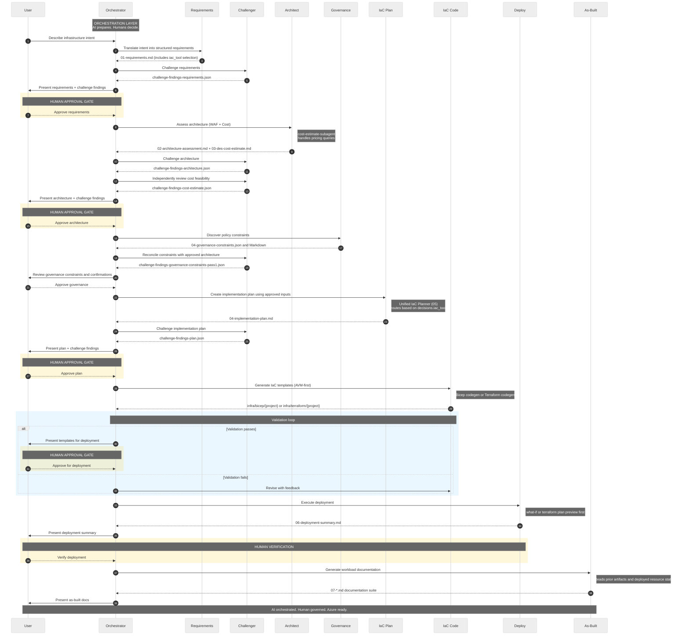

# APEX

Agentic Platform Engineering eXperience for Azure.

This repository is the source project for a multi-agent workflow that turns Azure
platform engineering requirements into deployable Bicep or Terraform with human approval
gates across the lifecycle.

The full documentation for this repository lives here:

- [APEX documentation](https://apexops.pro/)

Key entry points:

- [Accelerator template](https://github.com/jonathan-vella/apex-accelerator)
- [MicroHack](https://microhack.apexops.pro/)
- [Contributing guide](CONTRIBUTING.md)

## Workflow

## Start Here

For new projects, use the Accelerator template rather than cloning this repository
directly.

1. Create a repository from the [Accelerator template](https://github.com/jonathan-vella/apex-accelerator).
2. Open that repository in VS Code and reopen it in the dev container.
3. Start with the published docs:
   [https://apexops.pro/](https://apexops.pro/)

## What This Repository Contains

- Agent definitions, skills, and instruction files for the workflow engine
- Reference implementations for Bicep and Terraform tracks
- Validation scripts, MCP configuration, and sample agent outputs
- `apex-recall` CLI for progressive session recall across agent-output projects
- Source content for the published documentation site

## License

MIT. See [LICENSE](LICENSE).
