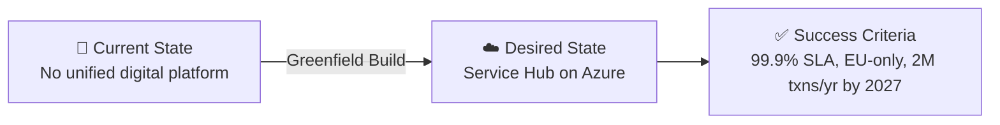

# 📋 Step 1: Requirements - Contoso Service Hub

<strong>📑 Requirements Overview</strong>

- [🎯 Project Overview](#-project-overview)
- [🚀 Functional Requirements](#-functional-requirements)
- [⚡ Non-Functional Requirements (NFRs)](#-non-functional-requirements-nfrs)
- [🔒 Compliance & Security Requirements](#-compliance--security-requirements)
- [💰 Budget](#-budget)
- [🔧 Operational Requirements](#-operational-requirements)
- [🌍 Regional Preferences](#-regional-preferences)
- [📊 Complexity Classification](#-complexity-classification)
- [📋 Summary for Architecture Assessment](#-summary-for-architecture-assessment)
- [References](#references)

> Generated by @requirements agent | 2026-03-16

| ⬅️ Previous | 📑 Index            | Next ➡️                                                        |
| ----------- | ------------------- | -------------------------------------------------------------- |
| —           | [README](README.md) | [02-architecture-assessment.md](02-architecture-assessment.md) |

## 🎯 Project Overview

| Field                   | Value                                                                                      |
| ----------------------- | ------------------------------------------------------------------------------------------ |
| **Project Name**        | Contoso Service Hub                                                                        |
| **Project Type**        | Full-Stack Digital Services Platform                                                       |
| **Timeline**            | May 2026 (MVP) → September 2027 (Release 2.1); contract through February 2029              |
| **Primary Stakeholder** | Contoso — EU real estate / lifestyle digital services                                      |
| **Business Context**    | Unified digital platform for bookings, payments, content delivery, and customer engagement |

### Business Context

| Field               | Value                                                                                                                                                 |
| ------------------- | ----------------------------------------------------------------------------------------------------------------------------------------------------- |
| Industry / Vertical | Real Estate / Lifestyle / Digital Services                                                                                                            |
| Company Size        | Enterprise                                                                                                                                            |
| Current State       | Greenfield                                                                                                                                            |
| Migration Source    | N/A — new platform build                                                                                                                              |
| Business Drivers    | Unify digital touchpoints for residents, visitors, tenants, and partners; improve customer adoption; support growth from 50K to 2M transactions/year  |
| Success Criteria    | Platform live by May 2026 (MVP); 99.9% availability SLA; support 5,000+ active users scaling to growth targets; GDPR-compliant EU-only data residency |

### State Transition

## 🚀 Functional Requirements

### Cloud Services Inventory (RFQ Table 2 — Faithful Mapping)

The following table maps each of the 15 cloud services from RFQ Table 2 to their Azure equivalents, preserving the original numbering, service names, and indicative volumetrics.

| RFQ # | RFQ Cloud Service                              | Azure Mapping                                 | Indicative Volumetrics                           | Priority  |
| ----- | ---------------------------------------------- | --------------------------------------------- | ------------------------------------------------ | --------- |
| 1     | Web Application Firewall (WAF)                 | Azure Front Door Premium + WAF Policy         | 1,500,000 requests/month                         | 🔴 Must   |
| 2     | Edge Security and CDN                          | Azure Front Door CDN (separate profile)       | 1,500,000 requests/month                         | 🔴 Must   |
| 3     | Customer Identity and Access Management (CIAM) | Microsoft Entra External ID                   | 15,000 monthly active users                      | 🔴 Must   |
| 4     | API Management                                 | Azure API Management (Standard v2)            | 5,000,000 API requests/month                     | 🔴 Must   |
| 5     | Container Engine                               | AKS or Azure Container Apps (see OQ-3)        | Standard 8 vCPU virtual machines                 | 🔴 Must   |
| 6     | Database (PostgreSQL)                          | Azure Database for PostgreSQL Flexible Server | General purpose tier, 256 GB                     | 🔴 Must   |
| 7     | Object Storage                                 | Azure Blob Storage (Hot tier)                 | 200 GB                                           | 🔴 Must   |
| 8     | File Storage                                   | Azure Files (Premium SSD)                     | 256 GB SSD                                       | 🔴 Must   |
| 9     | Block Storage                                  | Azure Managed Disks (Premium SSD)             | 256 GB SSD                                       | 🔴 Must   |
| 10    | In-memory Cache                                | Azure Cache for Redis (see OQ-2)              | 128 GB                                           | 🔴 Must   |
| 11    | Key and Secrets Management                     | Azure Key Vault (Standard)                    | 100,000 operations/month                         | 🔴 Must   |
| 12    | Virtual Machine                                | D8s v5 or equivalent (8 vCPU)                 | Standard 8 vCPU virtual machines                 | 🟡 Should |
| 13    | Network Services                               | VNet, Subnets, NSGs, Private Endpoints, LB    | As required                                      | 🔴 Must   |
| 14    | SDLC Services (DevOps)                         | Azure DevOps or GitHub Enterprise             | CI/CD pipelines, artifact repo, security tooling | 🟡 Should |
| 15    | Observability and Monitoring Services          | Azure Monitor + Log Analytics + App Insights  | On 8 vCPU VMs or managed services                | 🔴 Must   |

### Business Capabilities (Application Layer)

These are application-level capabilities served by the cloud services above, not separate cloud service requirements.

| Capability                 | Dependent Cloud Services (RFQ #) | Notes                                            |
| -------------------------- | -------------------------------- | ------------------------------------------------ |
| Service Booking Engine     | #4, #5, #6                       | Core business logic; bookings across venues      |
| Payment Processing         | #4, #5, #11                      | PCI-relevant; external gateway integration       |
| Content Delivery           | #1, #2, #7                       | Mobile/web content via CDN; <2s page load target |
| Customer Engagement / CIAM | #3, #4                           | Self-service registration and authentication     |

### User Types

| User Type          | Description                                         | Est. Count | Access Level |
| ------------------ | --------------------------------------------------- | ---------- | ------------ |
| Residents          | Community residents using booking, payment, content | ~3,000     | Reader       |
| Visitors           | Day visitors accessing venue services               | ~1,500     | Reader       |
| Tenants / Partners | Leased property operators and service providers     | ~300       | Contributor  |
| Internal Staff     | Contoso operations, admin, and support teams        | ~200       | Admin        |
| Platform Engineers | DevOps and SRE teams managing infrastructure        | ~20        | Admin        |

### Integrations

| System                     | Direction     | Protocol    | Auth Method             | SLA    |
| -------------------------- | ------------- | ----------- | ----------------------- | ------ |
| Payment Gateway (external) | Outbound      | REST / TLS  | OAuth 2.0 / API Key     | 99.9%  |
| CIAM (Entra External ID)   | Bidirectional | OIDC / REST | OAuth 2.0               | 99.9%  |
| CDN / Edge (Front Door)    | Outbound      | HTTPS       | Managed Identity        | 99.99% |
| Internal ERP / CRM         | Bidirectional | REST / gRPC | Managed Identity / mTLS | 99.5%  |
| Monitoring (Azure Monitor) | Inbound       | SDK / Agent | Managed Identity        | 99.9%  |

### Data Types

| Category               | Sensitivity | Est. Volume    | Retention  | Residency |
| ---------------------- | ----------- | -------------- | ---------- | --------- |
| Customer PII           | 🔴 High     | ~50 GB         | 7 years    | EU only   |
| Transaction records    | 🔴 High     | ~20 GB/year    | 7 years    | EU only   |
| Application logs       | 🟡 Medium   | ~100 GB/year   | 90 days    | EU only   |
| Content & media assets | 🟢 Low      | ~200 GB        | Indefinite | EU only   |
| Session / cache data   | 🟡 Medium   | ~128 GB (live) | Ephemeral  | EU only   |

### Architecture Pattern

| Field              | Value                                                                                           |
| ------------------ | ----------------------------------------------------------------------------------------------- |
| Workload Pattern   | N-Tier Web + Container (hybrid)                                                                 |
| Recommended Option | Enterprise tier — AKS/Container Apps + PostgreSQL + Redis + Front Door + APIM                   |
| Tier               | Enterprise                                                                                      |
| Justification      | 15 cloud services, 3 environments, GDPR compliance, 2M txn growth target, 99.9% SLA requirement |
| `iac_tool`         | Bicep                                                                                           |

## ⚡ Non-Functional Requirements (NFRs)

| WAF Pillar     | Metric             | Target                                    | Current | Gap                    |
| -------------- | ------------------ | ----------------------------------------- | ------- | ---------------------- |
| 🔄 Reliability | SLA                | 99.9%                                     | N/A     | Full build required    |
| 🔄 Reliability | RTO                | 4 hours                                   | N/A     | Standard tier recovery |
| 🔄 Reliability | RPO                | 1 hour                                    | N/A     | Standard tier recovery |
| ⚡ Performance | Page Load          | <2,000 ms                                 | N/A     | CDN + edge caching     |
| ⚡ Performance | API Response (p95) | <500 ms                                   | N/A     | APIM + caching layer   |
| ⚡ Performance | Concurrent Users   | 500 (2026) → 2,000+ (2027)                | N/A     | Auto-scaling required  |
| 🔒 Security    | Auth Method        | Entra ID B2C + MFA                        | —       | —                      |
| 🔒 Security    | Encryption         | At-rest (AES-256) + In-transit (TLS 1.2+) | —       | —                      |
| 💰 Cost        | Monthly Budget     | ~€8,000–€12,000 (estimated)               | —       | —                      |
| 🔧 Operations  | Uptime Monitoring  | Yes                                       | —       | —                      |

### Scalability

| Dimension        | Current (MVP 2026) | 6-Month Projection (EOY 2026) | 12-Month Projection (EOY 2027) |
| ---------------- | ------------------ | ----------------------------- | ------------------------------ |
| Users            | 5,000              | 8,000                         | 15,000+                        |
| Data Volume      | ~500 GB            | ~750 GB                       | ~1.5 TB                        |
| Transactions/day | ~200 (50K/year)    | ~500                          | ~5,500 (2M/year)               |

## 🔒 Compliance & Security Requirements

### Regulatory Frameworks

<strong>PCI-DSS</strong> — Potentially Applicable

| Requirement             | Applicability | Notes                                                       |
| ----------------------- | ------------- | ----------------------------------------------------------- |
| Cardholder data storage | Pending       | Depends on payment integration model (direct vs. tokenized) |
| Network segmentation    | Yes           | Required if cardholder data flows through platform          |
| Encryption requirements | Yes           | TLS 1.2+ in transit, AES-256 at rest                        |

> **Open Question**: Payment architecture not fully specified in RFP. If Contoso processes card data directly, PCI-DSS scope is broader. If using a PCI-certified payment gateway with tokenization, scope is reduced (SAQ-A).

<strong>SOC 2</strong> — Recommended

| Trust Principle | Applicability | Notes                                |
| --------------- | ------------- | ------------------------------------ |
| Security        | Yes           | Platform handles customer PII        |
| Availability    | Yes           | 99.9% SLA commitment                 |
| Confidentiality | Yes           | Multi-tenant data isolation required |

<strong>HIPAA</strong> — Not Applicable

| Requirement   | Applicability | Notes                       |
| ------------- | ------------- | --------------------------- |
| PHI handling  | No            | No healthcare data in scope |
| BAA required  | No            | —                           |
| Audit logging | N/A           | —                           |

<strong>GDPR</strong> — Mandatory

| Requirement         | Applicability | Notes                                                     |
| ------------------- | ------------- | --------------------------------------------------------- |
| EU data subjects    | Yes           | Primary user base is EU residents and visitors            |
| Data residency      | Yes           | All data must remain within EU borders — no exceptions    |
| Right to erasure    | Yes           | Must support GDPR Article 17 deletion requests            |
| Data processing     | Yes           | No processing outside EU without written Contoso approval |
| Breach notification | Yes           | 72-hour notification requirement per GDPR Article 33      |

**Detailed EU Residency Constraints (per RFQ Section 4.3)**:

All of the following must remain within EU borders at all times:

| Data Category         | Constraint                                                                |
| --------------------- | ------------------------------------------------------------------------- |
| Customer data         | All PII, transaction records, and user-generated content — EU only        |
| Application logs      | Log Analytics workspace and all log sinks must be in EU region            |
| Backups & snapshots   | All backup vaults, PITR, blob snapshots — EU region only                  |
| Service metadata      | Azure resource metadata, tags, configuration state — EU region            |
| Telemetry & analytics | Application Insights, Azure Monitor data — no telemetry export outside EU |
| Replication & caching | Redis cache, CDN edge caches — EU PoP locations only                      |
| Indexing & search     | Any search indexes or vector stores — EU region only                      |
| Remote support access | Must use GDPR-compliant safeguards including Standard Contractual Clauses |

<strong>ISO 27001</strong> — Recommended

| Control Area        | Applicability | Notes                                         |
| ------------------- | ------------- | --------------------------------------------- |
| Access control      | Yes           | RBAC + Managed Identity baseline              |
| Asset management    | Yes           | Azure resource tagging and inventory          |
| Incident management | Yes           | Monitoring, alerting, and response procedures |

### Data Residency

| Requirement              | Value                                              |
| ------------------------ | -------------------------------------------------- |
| Primary Region           | EU (Azure `swedencentral`)                         |
| Data Sovereignty         | EU-only — strictly enforced per RFQ Section 4.3    |
| Cross-region Replication | Not required (DR out of scope per RFQ Section 4.1) |

### Authentication & Authorization

| Requirement       | Value                                                          |
| ----------------- | -------------------------------------------------------------- |
| Identity Provider | Microsoft Entra External ID (CIAM for 15,000 MAU)              |
| MFA Requirement   | Required for administrative access; conditional for end users  |
| RBAC Model        | Azure RBAC for infrastructure; application-level for end users |

### Network Security

| Control                     | Required | Notes                                                  |
| --------------------------- | -------- | ------------------------------------------------------ |
| Private endpoints           | ✅       | For all data services (PostgreSQL, Redis, Storage, KV) |
| VNet integration            | ✅       | Container workloads and backend services               |
| Public endpoints acceptable | ✅       | Only via WAF/Front Door for end-user traffic           |
| WAF required                | ✅       | 1.5M requests/month; DDoS protection                   |

### Recommended Security Controls

| Control               | Recommended | User Confirmed | Notes                                       |
| --------------------- | ----------- | -------------- | ------------------------------------------- |
| Managed Identity      | Yes         | Yes            | Preferred over keys/connection strings      |
| Private Endpoints     | Yes         | Yes            | For PostgreSQL, Redis, Storage, Key Vault   |
| WAF                   | Yes         | Yes            | Azure Front Door WAF for all public traffic |
| Key Vault for Secrets | Yes         | Yes            | 100K ops/month; centralized secrets mgmt    |
| Diagnostic Settings   | Yes         | Yes            | All resources → Log Analytics workspace     |
| TLS 1.2 Minimum       | Yes         | Yes            | Enforced on all services                    |
| Encryption at Rest    | Yes         | Yes            | Platform-managed keys (default)             |
| Network Isolation     | Yes         | Yes            | VNet + NSG + Private Link for data plane    |

## 💰 Budget

> [!NOTE]
> The RFP does **not** specify an explicit budget. The estimate below is derived from the
> 15 proposed cloud services and their indicative volumetrics (RFQ Table 2), sized for
> Production environment. Dev and Staging environments add approximately 40-60% overhead.

| Field              | Value                                                                     |
| ------------------ | ------------------------------------------------------------------------- |
| 💰 Monthly Budget  | ~€8,000–€12,000 (estimated across 3 environments)                         |
| 📅 Annual Budget   | ~€96,000–€144,000                                                         |
| 🚦 Limit Type      | 🟡 Soft — no hard budget stated in RFP; subject to commercial negotiation |
| 📊 Cost Model Pref | Hybrid (reserved capacity for baseline + consumption for burst)           |

### Cost Estimation Breakdown (Production Environment)

| Service                           | Azure Mapping                      | Est. Monthly (EUR)  |
| --------------------------------- | ---------------------------------- | ------------------- |
| WAF (1.5M req/mo)                 | Azure Front Door Premium + WAF     | €400–600            |
| CDN / Edge Security (1.5M req/mo) | Azure Front Door (included above)  | (included)          |
| CIAM (15K MAU)                    | Entra External ID                  | €400–600            |
| API Management (5M req/mo)        | Azure API Management (Standard v2) | €500–700            |
| Container Engine (8 vCPU)         | AKS or Container Apps              | €600–1,000          |
| PostgreSQL (GP, 256 GB)           | Azure Database for PostgreSQL Flex | €400–600            |
| Object Storage (200 GB)           | Azure Blob Storage (Hot)           | €10–20              |
| File Storage (256 GB SSD)         | Azure Files (Premium)              | €80–120             |
| Block Storage (256 GB SSD)        | Azure Managed Disks (Premium SSD)  | €40–60              |
| In-Memory Cache (128 GB)          | Azure Cache for Redis              | €1,500–3,000        |
| Key Vault (100K ops/mo)           | Azure Key Vault (Standard)         | €10–20              |
| Virtual Machine (8 vCPU)          | D8s v5 or equivalent               | €300–400            |
| Network Services                  | VNet, NSG, Private Endpoints, LB   | €200–400            |
| SDLC / DevOps                     | Azure DevOps or GitHub Enterprise  | €100–200            |
| Observability (monitoring)        | Azure Monitor + Log Analytics      | €300–500            |
| **Production Subtotal**           |                                    | **~€4,800–€7,200**  |
| Dev + Staging overhead (~60%)     |                                    | ~€2,900–€4,300      |
| **Total Estimated Monthly**       |                                    | **~€7,700–€11,500** |

### Cost Optimization Priorities

| Priority                         | Selected | Impact |
| -------------------------------- | -------- | ------ |
| Minimize compute costs           | ☐        | High   |
| Prefer consumption-based pricing | ☑        | Medium |
| Reserved instances acceptable    | ☑        | High   |
| Spot instances for non-critical  | ☑        | Medium |

> **Note**: 3-year contract term (March 2026–February 2029) makes reserved instances strongly recommended for baseline compute, database, and cache workloads.

## 🔧 Operational Requirements

### Monitoring & Alerting

| Capability             | Required | Tool / Service                     | Notes                                            |
| ---------------------- | -------- | ---------------------------------- | ------------------------------------------------ |
| Application monitoring | ✅       | Application Insights               | Distributed tracing across all services          |
| Log aggregation        | ✅       | Log Analytics Workspace            | Centralized logs; 90-day retention               |
| Alert notifications    | ✅       | Azure Monitor Alerts → Email/Teams | Severity-based routing to ops team               |
| Custom dashboards      | ✅       | Azure Monitor Workbooks / Grafana  | SLA compliance, transaction volumes, error rates |

### Support & Maintenance

| Requirement         | Value                                                                  |
| ------------------- | ---------------------------------------------------------------------- |
| Support Hours       | 24/7 for Production; business hours for Dev/Staging                    |
| On-call Requirement | Yes — for Production environment                                       |
| Maintenance Windows | Weekends 02:00–06:00 UTC for Production; flexible for non-production   |
| Change Management   | Formal CAB for Production; team approval for Staging; self-service Dev |

### Backup & Disaster Recovery

| Component     | Backup Frequency | Retention | Recovery Method                      |
| ------------- | ---------------- | --------- | ------------------------------------ |
| PostgreSQL DB | Daily + PITR     | 35 days   | Automated (Azure-managed)            |
| Blob Storage  | Daily snapshots  | 30 days   | Automated (soft delete + versioning) |
| Key Vault     | Soft delete      | 90 days   | Automated (purge protection)         |
| Redis Cache   | Periodic RDB     | 7 days    | Manual restore from snapshot         |
| File Storage  | Daily snapshots  | 30 days   | Automated restore                    |

> **Note**: Multi-region disaster recovery is explicitly out of scope per RFQ Section 4.1.

## 🌍 Regional Preferences

| Preference         | Value         | Justification                                             |
| ------------------ | ------------- | --------------------------------------------------------- |
| Primary Region     | swedencentral | EU GDPR-compliant; low latency to Northern/Central Europe |
| Failover Region    | N/A           | DR not in scope per RFQ Section 4.1                       |
| Availability Zones | Required      | Needed for 99.9% SLA on Production workloads              |

---

## 📊 Complexity Classification

| Field      | Value                                                                                                                                                                                                                                                                                                                                                                                                                                                                                                                          |
| ---------- | ------------------------------------------------------------------------------------------------------------------------------------------------------------------------------------------------------------------------------------------------------------------------------------------------------------------------------------------------------------------------------------------------------------------------------------------------------------------------------------------------------------------------------ |
| Complexity | `complex`                                                                                                                                                                                                                                                                                                                                                                                                                                                                                                                      |
| Criteria   | >8 resource types (15 services), multi-env (Dev/Staging/Production), GDPR compliance, 3-year contract                                                                                                                                                                                                                                                                                                                                                                                                                          |
| Rationale  | 15 distinct cloud services with significant volumetrics, 3 environments requiring separate configurations, mandatory GDPR data residency enforcement, enterprise-grade SLA (99.9%), substantial growth trajectory (40× transaction increase from 2026 to 2027), and payment processing with potential PCI-DSS implications. This exceeds the `complex` threshold on all three dimensions: resource types (15 > 8), environments (3 including production), and compliance scope (GDPR + potential PCI-DSS + recommended SOC 2). |

---

## 📋 Summary for Architecture Assessment

### Handoff Summary

| Aspect               | Key Points                                                                                            |
| -------------------- | ----------------------------------------------------------------------------------------------------- |
| Critical Constraints | EU-only data residency (GDPR); 99.9% availability SLA; 3 environments (Dev/Staging/Prod)              |
| Key Decisions        | IaC tool = Bicep; Enterprise tier; Entra External ID for CIAM; private endpoints for data services    |
| Open Risks           | No explicit budget in RFP; Redis 128 GB tier selection; AKS vs Container Apps decision; PCI-DSS scope |
| Recommended Pattern  | N-Tier Web + Container (Enterprise tier)                                                              |
| Budget Envelope      | ~€8,000–€12,000/month estimated (pending commercial negotiation)                                      |

### Requirements Completeness

| Section                  | Status | Notes                                                         |
| ------------------------ | ------ | ------------------------------------------------------------- |
| Project Overview         | ✅     | Fully captured from RFQ Sections 1-3                          |
| Functional Requirements  | ✅     | 15 services mapped from RFQ Table 2                           |
| NFRs                     | ✅     | SLA, RTO/RPO, scalability targets from RFQ Section 4.5        |
| Compliance & Security    | ✅     | GDPR mandatory; PCI-DSS pending; SOC 2 recommended            |
| Budget                   | ⚠️     | No budget in RFP — estimate provided from service volumetrics |
| Operational Requirements | ✅     | 3 environments, monitoring, backup per RFQ Section 4.4        |

### Open Questions

> [!WARNING]
> The following items were identified as gaps in the RFP and require resolution
> during architecture assessment (Step 2) or commercial negotiation.

| #    | Open Question                                  | Source      | Impact    | Recommended Resolution                                                                                                                                                                                                                                        |
| ---- | ---------------------------------------------- | ----------- | --------- | ------------------------------------------------------------------------------------------------------------------------------------------------------------------------------------------------------------------------------------------------------------- |
| OQ-1 | **No explicit budget specified**               | RFQ overall | 🔴 High   | Estimated €8K–€12K/month from 15 service volumetrics. Architect should validate with Azure Pricing MCP and recommend reserved instance strategy for 3-year term.                                                                                              |
| OQ-2 | **128 GB Redis — Premium P4 vs Enterprise**    | RFQ Table 2 | 🟡 Medium | 128 GB exceeds Premium P3 (26 GB). Options: Premium P4 (120 GB, clustered) or Enterprise E50 (128 GB, native). Enterprise offers better performance and Redis modules. Architect should evaluate cost/feature trade-off.                                      |
| OQ-3 | **AKS vs Container Apps for Container Engine** | RFQ Table 2 | 🟡 Medium | RFQ references both "Container Engine" (#5) and "Managed Kubernetes" (Section 4.1 #10). AKS provides full Kubernetes control; Container Apps offers simpler serverless containers. Architect should evaluate based on team expertise and workload complexity. |
| OQ-4 | **PCI-DSS scope for payment processing**       | RFQ Table 2 | 🟡 Medium | Payment processing is listed but architecture is unspecified. If tokenized via external gateway → SAQ-A (minimal scope). If direct card processing → full PCI-DSS compliance required.                                                                        |
| OQ-5 | **CIAM provider confirmation**                 | RFQ Table 2 | 🟢 Low    | RFQ says "Customer Identity and Access Management" — mapped to Microsoft Entra External ID (Azure AD B2C unavailable for new customers since May 2025). Confirm acceptable vs. third-party IdP.                                                               |

---

## References

> [!NOTE]
> 📚 The following Microsoft Learn resources provide additional guidance.

| Topic                       | Link                                                                                                |
| --------------------------- | --------------------------------------------------------------------------------------------------- |
| Well-Architected Framework  | [Overview](https://learn.microsoft.com/azure/well-architected/)                                     |
| Azure Regions               | [Products by Region](https://azure.microsoft.com/explore/global-infrastructure/products-by-region/) |
| Compliance Offerings        | [Azure Compliance](https://learn.microsoft.com/azure/compliance/)                                   |
| GDPR and Azure              | [GDPR Overview](https://learn.microsoft.com/azure/compliance/offerings/offering-gdpr)               |
| Azure Cache for Redis Tiers | [Redis Pricing](https://learn.microsoft.com/azure/azure-cache-for-redis/cache-overview#pricing)     |
| AKS vs Container Apps       | [Comparison](https://learn.microsoft.com/azure/container-apps/compare-options)                      |

---

_Requirements extracted from Contoso RFQ (RFQ issued 18 FEB 2026) using automated analysis._

---

| ⬅️ — | 🏠 [Project Index](README.md) | ➡️ [02-architecture-assessment.md](02-architecture-assessment.md) |
| ---- | ----------------------------- | ----------------------------------------------------------------- |

