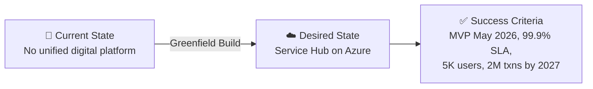

# 📋 Step 1: Requirements - Contoso Service Hub

<strong>📑 Requirements Overview</strong>

- [🎯 Project Overview](#-project-overview)
- [🚀 Functional Requirements](#-functional-requirements)
- [⚡ Non-Functional Requirements (NFRs)](#-non-functional-requirements-nfrs)
- [🔒 Compliance & Security Requirements](#-compliance--security-requirements)
- [💰 Budget](#-budget)
- [🔧 Operational Requirements](#-operational-requirements)
- [🌍 Regional Preferences](#-regional-preferences)
- [📊 Complexity Classification](#-complexity-classification)
- [📋 Summary for Architecture Assessment](#-summary-for-architecture-assessment)
- [References](#references)

> Generated by @requirements agent | 2026-04-01
>
> **Source**: Contoso RFQ — Selection of Cloud Services Provider (RFQ issued 18 FEB 2026)
>
> `iac_tool: Bicep`

| ⬅️ Previous | 📑 Index            | Next ➡️                                                        |
| ----------- | ------------------- | -------------------------------------------------------------- |
| —           | [README](README.md) | [02-architecture-assessment.md](02-architecture-assessment.md) |

---

## 🎯 Project Overview

| Field                   | Value                                                                             |
| ----------------------- | --------------------------------------------------------------------------------- |
| **Project Name**        | Contoso Service Hub                                                               |
| **Project Type**        | Full-Stack Digital Platform (Mobile + Web + API + Backend services)                |
| **Timeline**            | MVP May 2026 → R1.0 Jul 2026 → R1.1 Oct 2026 → R2.0 Mar 2027 → R2.1 Sep 2027    |
| **Contract Period**     | 3 years (March 2026 – February 2029)                                              |
| **Primary Stakeholder** | Contoso Procurement / Digital Services                                            |
| **Business Context**    | Unified digital services platform for EU real estate and lifestyle ecosystem      |

### Business Context

| Field               | Value                                                                                                      |
| ------------------- | ---------------------------------------------------------------------------------------------------------- |
| Industry / Vertical | Real Estate & Lifestyle Services (EU)                                                                      |
| Company Size        | Enterprise                                                                                                 |
| Current State       | Greenfield — new platform build                                                                            |
| Migration Source    | N/A (greenfield)                                                                                           |
| Business Drivers    | Digital transformation of property management, resident/visitor engagement, revenue from digital services   |
| Success Criteria    | Launch MVP by May 2026; 5,000 users onboarded; 50K transactions processed in 2026; 99.9% platform uptime  |

Contoso operates digital and operational services supporting residents, visitors, tenants, partners, and internal business users across a large mixed-use real estate and lifestyle ecosystem within the European Union. Their service areas span:

1. Residential community management and mixed-use property administration
2. Common area, amenity, and facility maintenance
3. Sports, leisure, and community venue operations
4. Lifestyle and convenience services for end users
5. Financial and operational support for leased/managed properties
6. Digital services and smart environment capabilities
7. Parking and mobility services

### State Transition

---

## 🚀 Functional Requirements

### Core Capabilities

| #   | Capability                           | Priority   | Acceptance Criteria                                                        |
| --- | ------------------------------------ | ---------- | -------------------------------------------------------------------------- |
| 1   | Service Booking & Reservations       | 🔴 Must    | Users can book services, venues, and amenities through mobile/web          |
| 2   | Payment Processing                   | 🔴 Must    | Secure payment transactions with PCI-DSS-compliant processing              |
| 3   | Content Delivery                     | 🔴 Must    | Digital content served globally via CDN with <2s page loads                 |
| 4   | Customer Identity & Access Mgmt      | 🔴 Must    | Self-service registration, SSO, MFA for 15K+ MAU                          |
| 5   | API Gateway                          | 🔴 Must    | Centralized API management handling 5M requests/month                      |
| 6   | Customer Engagement & Notifications  | 🟡 Should  | Push notifications, in-app messaging, email campaigns                      |
| 7   | Venue & Service Provider Integration | 🟡 Should  | Third-party venue and partner system integrations via APIs                  |
| 8   | Administrative Portal                | 🔴 Must    | Internal admin functions for property/service management                   |
| 9   | Analytics & Reporting                | 🟡 Should  | Business intelligence dashboards for operations and engagement metrics      |
| 10  | Utilities Sales (MVP)                | 🔴 Must    | Utility service sales capability included in MVP (May 2026)                |

### User Types

| User Type           | Description                                            | Est. Count | Access Level     |
| ------------------- | ------------------------------------------------------ | ---------- | ---------------- |
| Residents           | Residential community members                          | ~3,000     | Contributor      |
| Visitors            | Day visitors to mixed-use properties                   | ~1,500     | Reader           |
| Tenants             | Commercial and retail tenants                           | ~300       | Contributor      |
| Partners            | Service providers and venue operators                   | ~150       | Contributor      |
| Internal Users      | Contoso staff — operations, admin, support              | ~50        | Admin            |

### Integrations

| System                          | Direction      | Protocol    | Auth Method          | SLA   |
| ------------------------------- | -------------- | ----------- | -------------------- | ----- |
| Payment Gateway                 | Outbound       | REST        | OAuth 2.0 / API Key  | 99.9% |
| Venue Management Systems        | Bidirectional  | REST / gRPC | OAuth 2.0            | 99.5% |
| Property Management Software    | Inbound        | REST        | API Key / MI         | 99.5% |
| Email / Notification Service    | Outbound       | REST        | API Key              | 99.5% |
| Identity Provider (Entra EID)   | Bidirectional  | OIDC/SAML   | OAuth 2.0            | 99.9% |

### Data Types

| Category              | Sensitivity   | Est. Volume | Retention | Residency |
| --------------------- | ------------- | ----------- | --------- | --------- |
| Customer PII          | 🔴 High      | ~50 GB      | 7 years   | EU-only   |
| Transaction Records   | 🔴 High      | ~100 GB/yr  | 7 years   | EU-only   |
| Application Logs      | 🟡 Medium    | ~200 GB/yr  | 90 days   | EU-only   |
| Content / Media       | 🟢 Low       | ~200 GB     | Ongoing   | EU-only   |
| Service Metadata      | 🟡 Medium    | ~50 GB      | 3 years   | EU-only   |

### Architecture Pattern

| Field              | Value                                                                                          |
| ------------------ | ---------------------------------------------------------------------------------------------- |
| Workload Pattern   | N-Tier / Microservices (API-First with containerized backend)                                   |
| Recommended Option | Enterprise Balanced — container-based compute, managed database, CDN, API gateway              |
| Tier               | Balanced (production SLA 99.9%, cost-aware with reserved capacity potential)                    |
| Justification      | 15 cloud services, 3 environments, high transaction growth (50K→2M), GDPR compliance, EU-only  |

### Scope Boundary

> **Step 1 captures solution, operational, and compliance requirements only.**
> Commercial terms, procurement logistics, contractual obligations, and financial proposal
> structures are out of scope for this artifact. They are addressed through the RFQ
> response process (Sections 5–7 of the RFQ).

### RFQ Minimum Scope Requirements

The following service domains are **mandatory** per RFQ Section 4.1. All must be addressed
in the architecture. Items intentionally deferred or interpreted differently are noted.

| #   | RFQ Mandatory Domain (§4.1)              | Status        | Notes / Azure Mapping                                      |
| --- | ---------------------------------------- | ------------- | ----------------------------------------------------------- |
| 1   | Compute                                  | ✅ Addressed   | AKS, Azure VMs, Container Engine                            |
| 2   | Storage                                  | ✅ Addressed   | Blob Storage, Azure Files, Managed Disks                    |
| 3   | Databases                                | ✅ Addressed   | Azure Database for PostgreSQL Flexible Server               |
| 4   | In-memory caching                        | ✅ Addressed   | Managed Redis-compatible cache (Azure Managed Redis)        |
| 5   | Networking                               | ✅ Addressed   | VNet, NSG, Load Balancer, Private Link, Front Door          |
| 6   | Security                                 | ✅ Addressed   | WAF, Key Vault, Managed Identity, Entra External ID         |
| 7   | CDN and DNS                              | ✅ Addressed   | Azure Front Door (CDN); **DNS: Azure DNS required**         |
| 8   | Observability and monitoring             | ✅ Addressed   | Azure Monitor, Application Insights, Log Analytics          |
| 9   | Backup                                   | ✅ Addressed   | **Mandatory** — PostgreSQL PITR, Blob soft delete, snapshots |
| 10  | Managed Kubernetes                       | ✅ Addressed   | **Mandatory** — Azure Kubernetes Service (AKS)              |
| 11  | Serverless capabilities                  | ✅ Addressed   | **Mandatory** — Azure Functions / serverless compute        |
| 12  | SDLC and DevOps-enabling services        | ✅ Addressed   | Azure DevOps / GitHub Actions                               |

> **Note**: Disaster recovery across multiple regions is explicitly excluded from this RFQ scope (§4.1).

### Proposed Azure Service Mapping

The following table maps the 15 RFQ cloud services (Table 2) to recommended Azure services:

| #   | RFQ Cloud Service                     | Volumetrics                       | Recommended Azure Service                             | Azure SKU / Tier               |
| --- | ------------------------------------- | --------------------------------- | ----------------------------------------------------- | ------------------------------ |
| 1   | Web Application Firewall (WAF)        | 1.5M requests/month               | Azure Front Door with WAF                             | Standard / Premium             |
| 2   | Edge Security and CDN                 | 1.5M requests/month               | Azure Front Door (integrated CDN)                     | Standard                       |
| 3   | Customer Identity & Access Mgmt      | 15,000 MAU                        | Microsoft Entra External ID                           | P1 (first 50K MAU free)        |
| 4   | API Management                        | 5M API requests/month             | Azure API Management                                  | Standard                       |
| 5   | Container Engine                      | 8 vCPU VMs                        | Azure Kubernetes Service (AKS)                        | Standard (managed Kubernetes is an explicit RFQ §4.1 requirement) |
| 6   | Database (PostgreSQL)                 | General Purpose, 256 GB           | Azure Database for PostgreSQL Flexible Server         | General Purpose, 256 GB        |
| 7   | Object Storage                        | 200 GB                            | Azure Blob Storage                                    | StorageV2, Hot tier, LRS/ZRS   |
| 8   | File Storage                          | 256 GB SSD                        | Azure Files                                           | Premium SSD, 256 GB            |
| 9   | Block Storage                         | 256 GB SSD                        | Azure Managed Disks                                   | Premium SSD P15 (256 GB)       |
| 10  | In-memory Cache                       | 128 GB                            | Azure Managed Redis (managed Redis-compatible cache)  | Enterprise or Memory Optimized |
| 11  | Key and Secrets Management            | 100K operations/month             | Azure Key Vault                                       | Standard                       |
| 12  | Virtual Machine                       | 8 vCPU                            | Azure Virtual Machines                                | D8s_v5 or equivalent           |
| 13  | Network Services                      | As required                       | Azure VNet, NSG, Azure Load Balancer, Private Link    | Standard                       |
| 14  | SDLC Services (DevOps)                | CI/CD, repos, security tooling    | Azure DevOps / GitHub Actions                         | Basic / Enterprise             |
| 15  | Observability & Monitoring            | 8 vCPU VMs or managed             | Azure Monitor, Application Insights, Log Analytics    | Pay-as-you-go                  |

> **EU Data Boundary Note**: Azure Front Door is a global service excluded from the Microsoft EU Data Boundary. An explicit EU Data Boundary validation requirement is added to compliance controls below. Storage uses ZRS (not GRS) to keep data within a single EU region.

---

## ⚡ Non-Functional Requirements (NFRs)

### Extracted from RFQ (Source-Backed)

| WAF Pillar         | Metric              | Target                  | RFQ Source    | Notes                          |
| ------------------ | ------------------- | ----------------------- | ------------- | ------------------------------ |
| 🔄 Reliability     | SLA                 | 99.9%                   | §4.5          | Explicit availability target   |
| ⚡ Performance     | Concurrent Users    | 500 (2026), 2,000 (2027)| §4.5 inferred | Based on 5K→15K growth         |
| 🔒 Security        | Auth Method         | OIDC + MFA              | §4.3, §4.2    | CIAM + admin controls          |
| 🔒 Security        | Encryption          | At-rest + In-transit    | §4.3          | GDPR compliance requirement    |
| 🔧 Operations      | Uptime Monitoring   | Yes                     | Table 2 #15   | Observability mandatory        |

### Assumptions to Validate in Step 2

The following values are **not stated in the RFQ** and are analyst inferences or industry
defaults. They must be validated during Architecture Assessment (Step 2).

| WAF Pillar         | Metric              | Assumed Value           | Rationale                                              |
| ------------------ | ------------------- | ----------------------- | ------------------------------------------------------ |
| 🔄 Reliability     | RTO                 | 4 hours (inferred)      | Standard tier default — RFQ excludes multi-region DR    |
| 🔄 Reliability     | RPO                 | 1 hour (inferred)       | Standard tier default — PostgreSQL PITR supports this   |
| ⚡ Performance     | Page Load           | <2,000 ms (inferred)    | Industry standard for CDN-optimized web apps           |
| ⚡ Performance     | API Response (p95)  | <500 ms (inferred)      | Typical target for API Management + cache tier          |
| 💰 Cost            | Monthly Budget      | ~€8,000–€12,000 (est.)  | Analyst estimate from volumetrics — **not an RFQ NFR** |

### Scalability

| Dimension            | Current (MVP 2026) | 6-Month Projection (Dec 2026) | 12-Month Projection (2027) |
| -------------------- | ------------------ | ----------------------------- | -------------------------- |
| Active Users         | 5,000              | 10,000                        | 15,000+                    |
| Data Volume          | ~500 GB            | ~1 TB                         | ~2 TB                      |
| Transactions/month   | ~6,250             | ~50,000                       | ~170,000                   |
| Transactions/year    | —                  | 50,000 (May–Dec 2026)         | ~2,000,000                 |

### Service Level Agreement

The RFQ mandates service credits for SLA breaches (Section 4.5):

| SLA Metric                | Target  | Credit Mechanism Required | RFQ Source |
| ------------------------- | ------- | ------------------------- | ---------- |
| Platform Availability     | 99.9%   | Yes — tiered percentage of monthly fees | §4.5 (explicit) |
| API Response Time (p95)   | <500 ms | Yes — performance SLA schedule          | **Inferred** — validate in Step 2 |

---

## 🔒 Compliance & Security Requirements

### Regulatory Frameworks

<strong>GDPR</strong> — Applicable (Mandatory)

| Requirement                | Applicability | Notes                                                               |
| -------------------------- | ------------- | ------------------------------------------------------------------- |
| EU data subjects           | Yes           | All users are EU residents, visitors, tenants                       |
| Data residency             | Yes           | All data must remain within EU borders — no exceptions without approval |
| Right to erasure           | Yes           | Must support GDPR Article 17 data deletion requests                 |
| Data processing agreements | Yes           | Required with all sub-processors                                    |
| Privacy by design          | Yes           | Built into platform architecture                                    |
| Breach notification        | Yes           | 72-hour notification to supervisory authority                       |

<strong>PCI-DSS</strong> — Applicable (Payment Processing)

| Requirement             | Applicability | Notes                                                        |
| ----------------------- | ------------- | ------------------------------------------------------------ |
| Cardholder data storage | Yes           | Booking and utility payment transactions                     |
| Network segmentation    | Yes           | Payment services isolated in dedicated subnet                |
| Encryption requirements | Yes           | TLS 1.2+ in transit, AES-256 at rest for payment data        |

<strong>SOC 2</strong> — Recommended

| Trust Principle | Applicability | Notes                                                    |
| --------------- | ------------- | -------------------------------------------------------- |
| Security        | Yes           | Platform handles customer PII and payment data           |
| Availability    | Yes           | 99.9% SLA commitment                                    |
| Confidentiality | Yes           | Multi-tenant data isolation required                     |

<strong>HIPAA</strong> — Not Applicable

| Requirement   | Applicability | Notes                   |
| ------------- | ------------- | ----------------------- |
| PHI handling  | No            | No healthcare data      |
| BAA required  | No            | N/A                     |
| Audit logging | No            | N/A                     |

<strong>ISO 27001</strong> — Recommended

| Control Area        | Applicability | Notes                                              |
| ------------------- | ------------- | -------------------------------------------------- |
| Access control      | Yes           | RBAC + Managed Identity required                   |
| Asset management    | Yes           | 15 cloud services to inventory and manage          |
| Incident management | Yes           | Required for GDPR breach reporting                 |

### Data Residency (RFQ §4.3 — Full Constraints)

| Requirement                  | Value                                                                     |
| ---------------------------- | ------------------------------------------------------------------------- |
| Primary Region               | EU region (swedencentral recommended)                                     |
| Data Sovereignty             | EU-only — no data transfer outside EU without written approval            |
| Cross-region Replication     | Not required (DR excluded from current RFQ scope)                         |
| EU Data Boundary Validation  | Required — Azure Front Door is a global service; validate data handling   |
| Storage Redundancy           | ZRS recommended (GRS replicates to paired region — may conflict with EU-only) |

**Verbatim RFQ §4.3 requirements** (all mandatory):

1. The primary cloud region must be located within the European Union and should provide low latency to the core user base.
2. All customer data, application logs, backups, and service metadata must remain within EU borders.
3. **No processing, replication, caching, indexing, telemetry analysis, or backup outside the EU is permitted** unless explicitly authorized in writing by Contoso.
4. Any remote support access must be performed under **GDPR-compliant safeguards**, including **Standard Contractual Clauses (SCCs)** where relevant.

> ⚠️ **Implication**: This prohibits CDN edge caching outside EU, telemetry export to non-EU regions,
> and any non-EU backup replication. Architecture must validate that Azure Front Door WAF/CDN,
> Entra External ID, Azure DNS, and Application Insights all comply or have documented exceptions
> approved in writing by Contoso.

### Authentication & Authorization

| Requirement       | Value                                            |
| ----------------- | ------------------------------------------------ |
| Identity Provider | Microsoft Entra External ID (CIAM for 15K MAU)   |
| MFA Requirement   | Required for admin and partner users; conditional for residents |
| RBAC Model        | Azure RBAC for infrastructure + Application-level for users |

### Network Security

| Control                     | Required | Notes                                                              |
| --------------------------- | -------- | ------------------------------------------------------------------ |
| Private endpoints           | ✅       | For PostgreSQL, Key Vault, Storage, Azure Managed Redis   |
| VNet integration            | ✅       | Container compute and VMs within VNet                              |
| Public endpoints acceptable | ✅       | Only via Front Door WAF — no direct public access to backend       |
| WAF required                | ✅       | 1.5M requests/month — DDoS protection and OWASP ruleset           |

### Recommended Security Controls

#### Extracted from RFQ (Mandatory)

| Control               | Required    | RFQ Source | Notes                                              |
| --------------------- | ----------- | ---------- | -------------------------------------------------- |
| WAF                   | Yes         | Table 2 #1 | Azure Front Door WAF for all public endpoints       |
| Key Vault for Secrets | Yes         | Table 2 #11| Centralized secret, key, and certificate management |
| TLS 1.2 Minimum       | Yes         | §4.3       | Mandatory on all services (GDPR / data in transit)  |
| Encryption at Rest    | Yes         | §4.3       | Required for EU data sovereignty compliance         |
| Network Isolation     | Yes         | §4.2       | VNet + NSG for backend isolation                    |

#### Design Preferences (Analyst Recommendation — Validate in Step 2)

| Control               | Recommended | Notes                                              |
| --------------------- | ----------- | -------------------------------------------------- |
| Managed Identity      | Yes         | Prefer over keys for all service-to-service auth   |
| Private Endpoints     | Yes         | For all data services (PostgreSQL, Redis, Storage)  |
| Diagnostic Settings   | Yes         | All resources → Log Analytics workspace             |
| Encryption at Rest    | CMK optional| Platform-managed keys default; CMK for high-sensitivity |
| Network Isolation     | Full        | Private Link for all data services (beyond VNet)    |

---

## 💰 Budget

> [!NOTE]
> The RFQ does **not specify an explicit budget**. The values below are **analyst estimates**
> (planning assumptions) derived from the 15 proposed cloud services and their volumetrics
> (Table 2), mapped to Azure pricing for the swedencentral region. These are **not extracted
> NFRs** and must be validated through detailed cost modeling in Step 2 (Architecture Assessment)
> using the Azure Pricing MCP server.

| Field              | Value                                                                          |
| ------------------ | ------------------------------------------------------------------------------ |
| 💰 Monthly Budget   | ~€8,000–€12,000 (analyst estimate across all 3 environments)                    |
| 📅 Annual Budget    | ~€96,000–€144,000                                                               |
| 🚦 Limit Type       | 🟡 Soft — **planning assumption**, not a contractual budget                    |
| 📊 Cost Model Pref  | Hybrid (Reserved for predictable workloads + Consumption for dev)              |

### Estimated Cost Breakdown (Production Environment)

| Azure Service                        | Estimated Monthly (€)  | Notes                                        |
| ------------------------------------ | ---------------------- | -------------------------------------------- |
| Azure Front Door (WAF + CDN)         | ~€350–€500             | 1.5M requests, WAF rules                    |
| Microsoft Entra External ID          | ~€0                    | First 50K MAU free                           |
| Azure API Management (Standard)      | ~€600–€750             | 5M requests/month                            |
| Container Compute (AKS/ACA)          | ~€500–€800             | 8 vCPU × 2+ nodes, auto-scaling             |
| PostgreSQL Flexible Server           | ~€400–€600             | General Purpose, 256 GB storage              |
| Azure Blob Storage (200 GB, Hot)     | ~€5–€10                | LRS/ZRS                                      |
| Azure Files (256 GB Premium SSD)     | ~€70–€90               | Premium tier                                 |
| Azure Managed Disks (256 GB P15)     | ~€35–€50               | Premium SSD                                  |
| Azure Managed Redis (128 GB)         | ~€3,000–€4,500         | Tier-dependent — validate sizing in Step 2    |
| Azure Key Vault                      | ~€5–€10                | 100K operations                              |
| Azure VM (D8s_v5)                    | ~€280–€350             | Single 8 vCPU VM                             |
| Network (VNet, NSG, LB, PL)          | ~€100–€200             | Private endpoints + load balancer            |
| Azure DevOps / GitHub                | ~€30–€60               | CI/CD pipelines                              |
| Azure Monitor + App Insights         | ~€150–€300             | Log Analytics ingestion                      |
| **Production Subtotal**              | **~€5,500–€8,200**     |                                              |
| Dev + Staging (reduced tiers)        | ~€2,000–€3,500         | Smaller SKUs, no HA                          |
| **Total All Environments**           | **~€7,500–€11,700**    |                                              |

### Cost Optimization Priorities

| Priority                         | Selected | Impact |
| -------------------------------- | -------- | ------ |
| Minimize compute costs           | ☑        | High   |
| Prefer consumption-based pricing | ☑        | Medium |
| Reserved instances acceptable    | ☑        | High   |
| Spot instances for non-critical  | ☐        | Low    |

---

## 🔧 Operational Requirements

### Monitoring & Alerting

| Capability             | Required | Tool / Service              | Notes                                      |
| ---------------------- | -------- | --------------------------- | ------------------------------------------ |
| Application monitoring | ✅       | Application Insights         | Distributed tracing, performance metrics   |
| Log aggregation        | ✅       | Log Analytics                | Centralized logs — EU region workspace     |
| Alert notifications    | ✅       | Email / Teams                | SLA breach alerts, health degradation      |
| Custom dashboards      | ✅       | Azure Monitor / Grafana      | Operations and business KPI dashboards     |

### Support & Maintenance

| Requirement         | Value                                                       | Source                    |
| ------------------- | ----------------------------------------------------------- | ------------------------- |
| Support Hours       | 24/7 for Production; Business hours for Dev/Staging         | §4.4 (inferred from env tiers) |
| On-call Requirement | Yes — for production incidents                              | Inferred (industry norm)  |
| Maintenance Windows | Saturday 02:00–06:00 UTC (assumed)                           | **Assumption — validate in Step 2** |
| Change Management   | Formal — staging validation required before production      | §4.4 (explicit)            |

### Backup & Disaster Recovery

> Backup is a **mandatory RFQ §4.1 requirement**. The frequencies and retention periods
> below are **analyst assumptions** based on service defaults — validate in Step 2.

| Component                | Backup Frequency       | Retention | Recovery Method             | Source          |
| ------------------------ | ---------------------- | --------- | --------------------------- | --------------- |
| PostgreSQL Database      | Daily + PITR           | 35 days   | Automated (Flexible Server)  | Assumed default |
| Blob Storage             | Soft delete            | 30 days   | Self-service restore         | Assumed default |
| Key Vault                | Soft delete            | 90 days   | Automated                    | Azure default   |
| Container Images (ACR)   | Geo-replication        | Ongoing   | Re-deploy from registry      | Assumed         |
| VM Disks                 | Daily snapshots        | 30 days   | Automated restore            | Assumed default |

> **Note**: Multi-region disaster recovery is explicitly excluded from current RFQ scope (Section 4.1).

### Environment Strategy

| Environment | Purpose                                          | Scaling          | HA Required |
| ----------- | ------------------------------------------------ | ---------------- | ----------- |
| Production  | End-user facing — high availability, auto-scale  | Auto-scaling     | Yes         |
| Staging     | Mirrors production — load/security validation    | Manual/reduced   | No          |
| Development | Engineering, integration testing, CI/CD          | Minimal          | No          |

---

## 🌍 Regional Preferences

| Preference             | Value             | Justification                                               |
| ---------------------- | ----------------- | ----------------------------------------------------------- |
| Primary Region         | swedencentral     | EU GDPR-compliant, low latency to European user base        |
| Failover Region        | N/A               | DR excluded from current RFQ scope                          |
| Availability Zones     | Required          | Production environment — 99.9% SLA target                   |
| EU Data Boundary       | Mandatory         | All data processing and storage within EU                   |

### EU Data Boundary Considerations

| Service                     | Regional Status | Action Required                                       |
| --------------------------- | --------------- | ----------------------------------------------------- |
| Azure Front Door            | Global          | Validate EU Data Boundary compliance for caching/WAF  |
| Microsoft Entra External ID | Global          | Validate token/session data residency                 |
| Azure DNS                   | Global          | Name resolution data may be processed globally        |
| All other services          | Regional        | Deploy to swedencentral                               |

---

## 📊 Complexity Classification

| Field      | Value                                                                                             |
| ---------- | ------------------------------------------------------------------------------------------------- |
| Complexity | `complex`                                                                                         |
| Criteria   | >8 resource types (15 services), multi-env (3), GDPR + PCI-DSS compliance, EU data residency      |
| Rationale  | 15 distinct cloud services with specific volumetrics, 3 environments (Dev/Staging/Production), mandatory GDPR and PCI-DSS compliance, EU-only data residency constraint, significant transaction growth (50K→2M), 3-year contract with phased delivery milestones. Exceeds all "complex" thresholds. |

---

## 📋 Summary for Architecture Assessment

### Open Questions

> ⚠️ The following gaps were identified in the RFQ and require resolution before or during Architecture Assessment (Step 2).

| Aspect               | Key Points                                                                                  |
| -------------------- | ------------------------------------------------------------------------------------------- |
| Critical Constraints | EU-only data residency (full §4.3 constraints), 99.9% SLA, 128 GB managed Redis cache      |
| Key Decisions        | IaC tool: Bicep; Region: swedencentral; ZRS over GRS; Entra External ID for CIAM; AKS (mandatory per §4.1) |
| Open Risks           | Azure Managed Redis tier/sizing validation, no explicit budget (analyst estimate only), inferred RTO/RPO/performance targets need validation |
| Recommended Pattern  | N-Tier / Microservices — containerized backend with API gateway                              |
| Budget Envelope      | ~€8,000–€12,000/month across all environments (analyst estimate — not an RFQ NFR)           |

### Requirements Completeness

| Section                  | Status | Notes                                                          |
| ------------------------ | ------ | -------------------------------------------------------------- |
| Project Overview         | ✅     | Complete from RFQ Sections 1-3                                 |
| Functional Requirements  | ✅     | Derived from RFQ Sections 3, 4.1, 4.2                         |
| NFRs                     | ✅     | SLA, scalability from Section 4.5                              |
| Compliance & Security    | ✅     | GDPR mandatory (Section 4.3); PCI-DSS inferred from payments  |
| Budget                   | ⚠️     | **No explicit budget in RFQ** — estimated from volumetrics     |
| Operational Requirements | ✅     | 3 environments (Section 4.4), monitoring (Table 2 #15)         |

---

## References

> [!NOTE]
> 📚 The following Microsoft Learn resources provide additional guidance.

| Topic                             | Link                                                                                                |
| --------------------------------- | --------------------------------------------------------------------------------------------------- |
| Well-Architected Framework        | [Overview](https://learn.microsoft.com/azure/well-architected/)                                     |
| Azure Regions                     | [Products by Region](https://azure.microsoft.com/explore/global-infrastructure/products-by-region/) |
| Compliance Offerings              | [Azure Compliance](https://learn.microsoft.com/azure/compliance/)                                   |
| EU Data Boundary                  | [EU Data Boundary](https://learn.microsoft.com/privacy/eudb/eu-data-boundary-learn)                 |
| Entra External ID                 | [Overview](https://learn.microsoft.com/entra/external-id/)                                          |
| Azure Managed Redis           | [Overview](https://learn.microsoft.com/azure/azure-cache-for-redis/managed-redis/managed-redis-overview) |
| AKS vs Container Apps             | [Choose Compute](https://learn.microsoft.com/azure/architecture/guide/container-service-general-guidance) |

---

_Requirements extracted from Contoso RFQ — Selection of Cloud Services Provider (18 FEB 2026)_

---

| ⬅️ — | 🏠 [Project Index](README.md) | ➡️ [02-architecture-assessment.md](02-architecture-assessment.md) |
| ---- | ----------------------------- | ----------------------------------------------------------------- |

