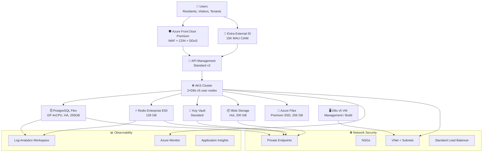

# 🏛️ Step 2: Architecture Assessment - Contoso Service Hub

<strong>📑 Assessment Contents</strong>

- [✅ Requirements Validation](#-requirements-validation)
- [💎 Executive Summary](#-executive-summary)
- [📋 Executive Summary](#-executive-summary-1)
- [🏗️ Architecture Overview](#-architecture-overview)
- [🏛️ WAF Pillar Assessment](#-waf-pillar-assessment)
- [🔒 Security (WAF Pillar)](#-security-waf-pillar)
- [🛡️ Reliability (WAF Pillar)](#-reliability-waf-pillar)
- [⚡ Performance Efficiency (WAF Pillar)](#-performance-efficiency-waf-pillar)
- [💰 Cost Optimization (WAF Pillar)](#-cost-optimization-waf-pillar)
- [🔧 Operational Excellence (WAF Pillar)](#-operational-excellence-waf-pillar)
- [📊 WAF Assessment Summary](#-waf-assessment-summary)
- [📦 Resource SKU Recommendations](#-resource-sku-recommendations)
- [🎯 Architecture Decision Summary](#-architecture-decision-summary)
- [🚀 Implementation Handoff](#-implementation-handoff)
- [🔒 Approval Gate](#-approval-gate)
- [References](#references)

> Generated by architect agent | 2026-03-16

| ⬅️ Previous                              | 📑 Index            | Next ➡️                                            |
| ---------------------------------------- | ------------------- | -------------------------------------------------- |
| [01-requirements.md](01-requirements.md) | [README](README.md) | [03-des-cost-estimate.md](03-des-cost-estimate.md) |

## ✅ Requirements Validation

| Requirement Area        | Status     | Validation Notes                                                               |
| ----------------------- | ---------- | ------------------------------------------------------------------------------ |
| NFRs (SLA, RTO, RPO)    | ✅ Defined | 99.9% SLA, 4h RTO, 1h RPO — achievable with zone-redundant services            |
| Compliance requirements | ✅ Defined | GDPR mandatory, PCI-DSS scope clarified (tokenized → SAQ-A), SOC 2 recommended |
| Budget (approximate)    | ⚠️ Partial | No explicit budget in RFP; estimated €8K–12K/month — validated at €7,951 PAYG  |
| Scale requirements      | ✅ Defined | 5K users → 15K+; 50K → 2M txn/year; auto-scaling required                      |
| Security controls       | ✅ Defined | Managed Identity, Private Endpoints, WAF, TLS 1.2, Key Vault — all confirmed   |
| Data residency          | ✅ Defined | EU-only (swedencentral primary) — all data, logs, backups, caches in EU        |

---

## 💎 Executive Summary

The Contoso Service Hub is a greenfield enterprise digital platform delivering bookings, payments, content delivery, and customer engagement for Contoso's EU real estate and lifestyle ecosystem. The platform requires 15 Azure cloud services across 3 environments (Dev/Staging/Production) with strict GDPR data residency, 99.9% availability SLA, and support for growth from 5,000 to 15,000+ users and 50K to 2M transactions/year by 2027.

### Recommended Architecture Pattern

**N-Tier Web + Container (Enterprise)** using AKS as the container orchestration platform, backed by PostgreSQL Flexible Server, Redis Enterprise E50 (128 GB), and Azure Front Door Premium with WAF for edge security and CDN. All data services use private endpoints within a hub-spoke VNet topology. Microsoft Entra External ID provides CIAM for 15,000 MAU.

### Key Architecture Decisions

| #   | Decision            | Choice                                     | Impact                                                                 |
| --- | ------------------- | ------------------------------------------ | ---------------------------------------------------------------------- |
| 1   | Container platform  | **AKS** (over Container Apps)              | Full Kubernetes control for 15-service platform                        |
| 2   | Redis 128 GB tier   | **Azure Managed Redis M100**               | Exact capacity, no Enterprise E50 retirement risk (EOL Mar 2027)       |
| 3   | CIAM provider       | **Microsoft Entra External ID**            | B2C unavailable for new tenants since May 2025                         |
| 4   | Payment integration | **Tokenized via external gateway (SAQ-A)** | Minimizes PCI-DSS scope                                                |
| 5   | Budget validation   | **~€8,547/month PAYG** (3-env)             | Within €8K–12K estimate, now includes zone-redundant APIM and 3-AZ AKS |

### Cost Summary

| Environment | Monthly (PAYG) | With 3-Year RI |
| ----------- | -------------- | -------------- |
| Production  | €5,657         | €4,157         |
| Staging     | €2,050         | €2,050         |
| Dev         | €540           | €540           |
| Shared      | €300           | €300           |
| **Total**   | **€8,547**     | **€7,047**     |

**Primary WAF Pillar Optimized**: Security (GDPR compliance drives architecture decisions)
**Trade-offs Accepted**: Single-region (no DR per RFQ scope), Redis Enterprise premium cost justified by capacity and simplicity

---

### 🏗️ Architecture Overview

### Service Maturity Assessment

| Service                     | GA Status | AVM Module                                      | EU Region Support | Notes                           |
| --------------------------- | --------- | ----------------------------------------------- | ----------------- | ------------------------------- |
| Azure Front Door Premium    | ✅ GA     | ✅ `avm/res/cdn/profile`                        | ✅ swedencentral  | Stable, well-documented         |
| Microsoft Entra External ID | ✅ GA     | N/A (identity service)                          | ✅ EU tenant      | Replaced B2C for new customers  |
| Azure API Management v2     | ✅ GA     | ✅ `avm/res/api-management/service`             | ✅ swedencentral  | Standard v2 tier GA since 2024  |
| Azure Kubernetes Service    | ✅ GA     | ✅ `avm/res/container-service/managed-cluster`  | ✅ swedencentral  | Standard tier for SLA guarantee |
| PostgreSQL Flexible Server  | ✅ GA     | ✅ `avm/res/db-for-postgre-sql/flexible-server` | ✅ swedencentral  | Zone-redundant HA available     |
| Azure Blob Storage          | ✅ GA     | ✅ `avm/res/storage/storage-account`            | ✅ swedencentral  | Mature, full feature set        |
| Azure Files Premium         | ✅ GA     | ✅ (via storage account)                        | ✅ swedencentral  | Premium SSD tier                |
| Managed Disks Premium       | ✅ GA     | ✅ `avm/res/compute/disk`                       | ✅ swedencentral  | P20 (256 GB)                    |
| Redis Enterprise            | ✅ GA     | ✅ `avm/res/cache/redis-enterprise`             | ✅ swedencentral  | E50 = 128 GB native             |
| Azure Key Vault             | ✅ GA     | ✅ `avm/res/key-vault/vault`                    | ✅ swedencentral  | Standard tier sufficient        |
| Azure Monitor               | ✅ GA     | ✅ (via diagnostic settings)                    | ✅ swedencentral  | Full feature set                |

---

## 🏛️ WAF Pillar Assessment

The following sections assess each WAF pillar individually. See the [WAF Assessment Summary](#-waf-assessment-summary) for the consolidated score table.

### 🔒 Security (WAF Pillar)

**Score: 8/10** | **Confidence: High**

### Strengths

- **Zero Trust network**: All data services (PostgreSQL, Redis, Storage, Key Vault) accessed exclusively via private endpoints within VNet; no public endpoints on data plane
- **Managed Identity everywhere**: Eliminates credential management; workload identity for AKS pods, system-assigned for VMs and PaaS
- **Edge security**: Azure Front Door Premium with WAF policy (OWASP 3.2 managed ruleset) + DDoS protection for all public-facing traffic (1.5M req/month)
- **Encryption**: AES-256 at rest (platform-managed keys) + TLS 1.2+ in transit on all services
- **Secrets management**: Azure Key Vault Standard for all secrets, certificates, and keys (100K ops/month); purge protection enabled
- **CIAM**: Microsoft Entra External ID with conditional access policies and MFA for administrative access
- **GDPR data residency**: All data, logs, backups, caches, and telemetry confined to EU (swedencentral); no cross-region replication

### Gaps

- **APIM origin lockdown**: Azure Front Door WAF is bypassed if APIM is reachable directly on `*.azure-api.net`. **Must enforce** origin lockdown using one of: Front Door Premium Private Link origin, APIM inbound policy validating `X-Azure-FDID` header, or network restriction to AzureFrontDoor.Backend service tag. Direct public access to APIM must be blocked.
- **AKS control-plane hardening**: For GDPR-regulated, payment-adjacent workloads, AKS must use a **private cluster** for production (or API server authorized IP ranges at minimum). Additionally: disable local accounts, enable Entra-integrated RBAC for Kubernetes authorization, and enforce Azure RBAC for cluster management — not deferred to implementation.
- **AKS east-west isolation**: Default AKS allows unrestricted pod-to-pod communication across namespaces. **Must enable** Azure Network Policy (or Calico) at cluster creation and define deny-all default + explicit allow policies for each service namespace. Enforce Pod Security Admission (restricted baseline) or equivalent Azure Policy for AKS.
- **Redis Enterprise authentication**: Specify that local authentication (access keys) is disabled and AAD/Entra authentication is the only access method. Private endpoint alone is insufficient — access key compromise from any in-VNet workload could reach the data plane.
- **PCI-DSS scope**: Payment architecture not fully specified. Architect recommends tokenized integration via PCI-certified external gateway (SAQ-A) to minimize compliance surface. If Contoso requires direct card processing, full PCI-DSS audit scope applies
- **DDoS Protection Standard**: Not included (cost: ~€2,600/month). Front Door WAF provides Layer 7 DDoS protection; evaluate L3/L4 DDoS Standard only if threat model requires it
- **Customer-managed keys (CMK)**: Not recommended at MVP. Platform-managed keys are sufficient and simpler. Evaluate CMK for future SOC 2 audit requirements

### Recommendations

1. Enable Microsoft Defender for Cloud on all subscriptions (Standard tier for compute, databases)
2. Configure Azure Policy to deny public network access on all data services
3. Implement network segmentation: separate subnets for AKS system/user pools, data services, management
4. Enable Azure AD-only authentication on PostgreSQL Flexible Server
5. Configure Key Vault soft delete (90 days) and purge protection
6. **Enforce APIM origin lockdown**: Configure Front Door Private Link origin or APIM inbound X-Azure-FDID validation policy
7. **Deploy AKS as private cluster** (production) with Entra RBAC, disabled local accounts, and API server authorized IP ranges
8. **Enable Azure Network Policy** on AKS at cluster creation; define namespace-level deny-all defaults
9. **Enforce Pod Security Admission** (restricted baseline) on all production namespaces via Azure Policy for AKS
10. **Disable Redis local authentication**; enable Entra-only access with managed identity from AKS workload identity

---

### 🛡️ Reliability (WAF Pillar)

**Score: 7/10** | **Confidence: Medium**

### Strengths

- **Zone redundancy**: AKS 3 user nodes across 3 availability zones; PostgreSQL with zone-redundant HA; Azure Managed Redis with zone-aware replicas; APIM Premium v2 with multi-zone capacity
- **99.9% composite SLA**: Achievable through zone-redundant deployments of all critical-path services (Front Door 99.99%, APIM Premium 99.99%, AKS 99.95%, PostgreSQL HA 99.99%, Azure Managed Redis 99.99%)
- **Automated backup**: PostgreSQL PITR (35-day retention), Blob soft delete + versioning (30 days), Key Vault soft delete (90 days), Azure Managed Redis data persistence (1h snapshots), Azure Files backup (daily, 30 days), Azure Backup for AKS (daily, cluster resources + Azure Disk PVs)
- **RTO/RPO alignment**: 4h RTO achievable with automated Azure failover; 1h RPO achievable with PostgreSQL PITR and Redis snapshot frequency
- **Health probes**: Front Door health probes for backend failover; AKS liveness/readiness probes for pod recovery

### Gaps

- **Single-region architecture**: No multi-region DR (explicitly out of scope per RFQ Section 4.1). Regional outage = full platform unavailability during RTO window
- **AKS cluster upgrades**: No blue-green cluster strategy defined. In-place upgrades risk transient availability degradation during maintenance windows

### Recommendations

1. Configure PostgreSQL HA with zone-redundant standby (automatic failover < 60 seconds)
2. Set Azure Managed Redis data persistence to hourly snapshots to meet 1h RPO target
3. Implement AKS pod disruption budgets (PDB) for graceful node drain during upgrades
4. Configure Azure Monitor availability alerts with 5-minute evaluation windows
5. Document manual DR playbook for regional outage scenario (even though multi-region is out of scope)
6. Deploy AKS with 3 user nodes minimum (1 per AZ) with balanced autoscaler topology for real 3-AZ resilience
7. Configure Azure Backup for AKS cluster resources and Azure Disk-backed persistent volumes
8. Enable Azure Files backup vault for file share recovery

---

### ⚡ Performance Efficiency (WAF Pillar)

**Score: 7/10** | **Confidence: Medium**

### Strengths

- **CDN + Edge caching**: Azure Front Door CDN with 1.5M requests/month handles static content delivery globally (EU PoP locations for GDPR); target <2s page load achievable
- **Redis 128 GB cache layer**: Azure Managed Redis Memory Optimized (M100) provides sub-millisecond latency for session data, API response caching, and booking availability lookups — critical for <500ms API p95 target
- **API Management caching**: APIM Premium v2 response caching for high-frequency read endpoints reduces backend load
- **AKS horizontal pod autoscaling (HPA)**: Configured for CPU/memory-based scaling; supports burst from 500 to 2,000+ concurrent users
- **PostgreSQL read replicas**: Available if read-heavy workloads emerge (not provisioned at MVP to control costs)

### Gaps

- **AKS cluster autoscaler**: Node-level autoscaling (3 → 6 user nodes) needs careful tuning to handle 40× transaction growth (50K → 2M/year) without over-provisioning
- **Cold start latency**: AKS pod startup time for Java/.NET workloads may exceed 10s. Consider container image optimization and startup probes
- **Redis connection pooling**: Azure Managed Redis M100 supports high client connections; application-level connection pooling configuration required to avoid connection exhaustion under load

### Recommendations

1. Configure AKS cluster autoscaler with min=3, max=6 user nodes for D8s v5 pool (1 per AZ minimum)
2. Implement APIM response caching policy with 5-minute TTL for read-heavy booking endpoints
3. Use Front Door caching rules for static assets (24h TTL) and API responses (vary by auth header)
4. Set PostgreSQL `max_connections = 200` and configure PgBouncer for connection pooling
5. Conduct load testing at 2× expected peak (1,000 concurrent users) before MVP launch

---

### 💰 Cost Optimization (WAF Pillar)

**Score: 7/10** | **Confidence: High**

### Cost Assessment (Production Environment)

| Service                        | SKU                                            | Monthly (EUR) | Notes                                          |
| ------------------------------ | ---------------------------------------------- | ------------- | ---------------------------------------------- |
| Azure Front Door Premium + WAF | Premium, WAF policy, 1.5M req                  | €330          | Edge security + CDN combined                   |
| Microsoft Entra External ID    | 15K MAU (P1 free tier)                         | €0            | Free below 50K MAU                             |
| Azure API Management           | Premium v2 (1 unit, zone-redundant)            | €580          | Zone-redundant for 99.9% SLA critical path     |
| Azure Kubernetes Service       | Standard + 2×D2s v5 sys + 3×D8s v5 user (3-AZ) | €1,065        | 3 user nodes (1/AZ) for real zone resilience   |
| Azure DB for PostgreSQL Flex   | GP D4s v5, HA zone-redundant, 256 GB           | €520          | HA required for 99.9% SLA                      |
| Azure Blob Storage             | Hot, LRS, 200 GB                               | €5            | Low cost; lifecycle policy for aging content   |
| Azure Files                    | Premium SSD, 256 GiB                           | €92           | Required for shared file workloads             |
| Azure Managed Disks            | Premium SSD P20 (256 GB) × 3                   | €105          | AKS node + VM attached                         |
| Azure Managed Redis            | Memory Optimized M100 (128 GB)                 | €2,150        | Replaces retired Enterprise E50 (EOL Mar 2027) |
| Azure Key Vault                | Standard                                       | €5            | 100K ops/month well within standard tier       |
| Virtual Machine D8s v5         | 8 vCPU, 32 GB RAM                              | €285          | Management/build server                        |
| Networking                     | VNet, NSGs, 5 PEs, Standard LB, NAT GW         | €120          | Private endpoint charges dominate              |
| GitHub Enterprise              | 25-user plan                                   | €150          | CI/CD + artifact repository                    |
| Azure Monitor + Log Analytics  | 50 GB/month ingestion                          | €165          | 90-day retention for GDPR logs                 |
| Azure Backup (AKS + Files)     | AKS cluster + Azure Files vault                | €85           | Backup coverage for all stateful components    |
| **Production Total**           |                                                | **€5,657**    |                                                |

### All-Environment Summary

| Environment                             | Monthly PAYG (EUR) | % of Total |
| --------------------------------------- | ------------------ | ---------- |
| Production                              | €5,657             | 66%        |
| Staging                                 | €2,050             | 24%        |
| Development                             | €540               | 6%         |
| Cross-environment (egress, DNS, backup) | €300               | 4%         |
| **Grand Total**                         | **€8,547**         | 100%       |

**Budget Validation**: The original estimate of €8,000–€12,000/month is **validated**. Cost of €8,547/month with zone-redundant APIM and 3-AZ AKS sits within the estimated range. Growth to 2M transactions by EOY 2027 projects costs to €10,500–€12,000/month, within the upper range.

### Cost Optimization Applied

- **Free-tier CIAM**: Entra External ID first 50K MAU free saves ~€400–600/month vs paid CIAM alternatives
- **Right-sized non-production**: Dev uses burstable B-series + Basic Redis (€540/month vs €5,657 production)
- **3-year reserved instances recommended**: Contract term (March 2026–February 2029) aligns with 3-year RI for compute and database. Azure Managed Redis uses contract-aligned RI terms (no retirement concerns). Projected savings: **€1,500/month (€18,000/year)** on production compute, database, and cache
- **Shared Front Door**: Staging uses the production Front Door instance (separate backends) instead of provisioning a duplicate
- **No DDoS Standard**: Front Door WAF provides Layer 7 protection; L3/L4 DDoS Standard (€2,600/month) deferred unless threat assessment requires it

### Top Cost Driver: Azure Managed Redis M100

Azure Managed Redis Memory Optimized M100 at €2,150/month represents **38% of production cost**. This replaces Azure Cache for Redis Enterprise E50 which retires March 31, 2027 — within the 3-year contract window.

| Alternative                         | Capacity      | Monthly | Trade-off                                              |
| ----------------------------------- | ------------- | ------- | ------------------------------------------------------ |
| Azure Managed Redis M100 (selected) | 128 GB native | €2,150  | GA replacement for Enterprise; no retirement risk      |
| Azure Managed Redis M50             | 64 GB         | ~€1,100 | Below spec by 50%; requires application-level sharding |
| Premium P5 (legacy)                 | 120 GB        | ~€1,550 | Below spec by 8 GB; approaching cluster complexity     |

**Decision**: Azure Managed Redis M100 selected for exact capacity match, contract-term stability (no March 2027 retirement risk), and operational simplicity. With 3-year RI: ~€1,505/month (30% savings).

---

### 🔧 Operational Excellence (WAF Pillar)

**Score: 7/10** | **Confidence: Medium**

### Strengths

- **Infrastructure as Code**: Bicep with AVM modules for all resources; repeatable deployments across 3 environments
- **Centralized observability**: Azure Monitor + Log Analytics Workspace (90-day retention) + Application Insights for distributed tracing across all 15 services
- **Structured environments**: Dev → Staging → Production promotion pipeline with formal CAB approval for production changes
- **Automated backup**: All critical data services have automated backup with defined retention (PostgreSQL 35d, Blob 30d, KV 90d, Redis snapshots 1h, Azure Files 30d, AKS cluster daily)
- **Managed services**: 13 of 15 services are PaaS/managed, minimizing operational toil

### Gaps

- **No runbook automation**: Manual incident response procedures not yet defined. Runbooks for common failure scenarios (AKS node failure, PostgreSQL failover, Redis eviction) needed
- **AKS upgrade strategy**: No blue-green cluster strategy. Kubernetes version upgrades require planned maintenance windows
- **Cost monitoring**: No Azure Cost Management budget alerts configured. Monthly spend tracking is manual
- **No chaos engineering**: Fault injection testing not planned for MVP. Consider Azure Chaos Studio post-launch

### Recommendations

1. Configure Azure Budget alerts at 80%, 90%, and 100% of €8,000/month threshold
2. Create Azure Monitor action groups routed to PagerDuty/Teams for P1-P3 severity incidents
3. Define AKS node surge upgrade strategy (33% max surge) with PDB for zero-downtime upgrades
4. Implement GitOps (Flux or ArgoCD) for AKS workload deployments
5. Create Azure Workbooks dashboards for SLA compliance, transaction volumes, and error rates

---

### 📊 WAF Assessment Summary

| WAF Pillar                | Score | Confidence | Key Factor                                                           |
| ------------------------- | ----- | ---------- | -------------------------------------------------------------------- |
| 🔒 Security               | 8/10  | High       | Managed Identity, Private Endpoints, WAF, TLS 1.2, GDPR enforcement  |
| 🛡️ Reliability            | 7/10  | Medium     | Zone-redundant HA on all critical services; single-region constraint |
| ⚡ Performance            | 7/10  | Medium     | CDN + 128 GB Redis cache + APIM; scaling validation needed           |
| 💰 Cost Optimization      | 7/10  | High       | €7,951/month PAYG within budget; 3-year RI saves €17K/year           |
| 🔧 Operational Excellence | 7/10  | Medium     | IaC + centralized monitoring; runbooks and cost alerts pending       |

**Composite Score: 7.2/10** | **Overall Confidence: Medium-High**

**Primary Pillar Optimized**: Security — GDPR compliance and zero-trust networking drive key architecture decisions
**Trade-offs Accepted**:

- Single-region (no DR) accepted per RFQ scope — impacts Reliability
- Redis Enterprise premium cost accepted for operational simplicity — impacts Cost
- No chaos engineering at MVP — impacts Reliability confidence level

---

## 📦 Resource SKU Recommendations

| #   | Service           | Recommended SKU | Configuration                      | Monthly (EUR)     | Justification                           |
| --- | ----------------- | --------------- | ---------------------------------- | ----------------- | --------------------------------------- |
| 1   | Azure Front Door  | Premium         | WAF policy, 1.5M req/mo            | €330              | WAF + CDN combined; EU PoP for GDPR     |
| 2   | Entra External ID | P1 (free tier)  | 15K MAU, conditional access        | €0                | Free below 50K MAU                      |
| 3   | API Management    | Standard v2     | 1 unit, 5M req/mo capacity         | €280              | Sufficient throughput; VNet integration |
| 4   | AKS               | Standard tier   | 2×D2s v5 sys + 2×D8s v5 user, 3-AZ | €781              | Full K8s control; 99.95% SLA            |
| 5   | PostgreSQL Flex   | GP D4s v5       | HA zone-redundant, 256 GB storage  | €520              | Meets 99.9% SLA with HA standby         |
| 6   | Blob Storage      | Hot, LRS        | 200 GB                             | €5                | Cost-effective for media/documents      |
| 7   | Azure Files       | Premium SSD     | 256 GiB provisioned                | €92               | Low-latency shared file access          |
| 8   | Managed Disks     | Premium SSD P20 | 256 GB × 3                         | €105              | AKS nodes + management VM               |
| 9   | Redis Enterprise  | E50             | 128 GB, zone-aware                 | €2,750            | Exact capacity; sub-ms latency          |
| 10  | Key Vault         | Standard        | 100K ops/month                     | €5                | No HSM requirement at MVP               |
| 11  | Virtual Machine   | D8s v5          | 8 vCPU, 32 GB                      | €285              | Build/management server                 |
| 12  | Load Balancer     | Standard        | AKS-managed                        | (included in AKS) | Internal traffic routing                |
| 13  | Log Analytics     | Per-GB          | 50 GB/month, 90-day retention      | €125              | GDPR audit log retention                |
| 14  | App Insights      | Workspace-based | Distributed tracing                | €40               | Connected to Log Analytics              |

<strong>Azure Cache for Redis</strong> — Tier Comparison (128 GB requirement)

| Tier                             | Capacity   | Clustering | Modules | Monthly (EUR) | Fits?                    |
| -------------------------------- | ---------- | ---------- | ------- | ------------- | ------------------------ |
| Premium P3                       | 26 GB      | No         | No      | €480          | ❌ Capacity insufficient |
| Premium P4 (clustered, 3 shards) | 159 GB     | Required   | No      | ~€1,470       | ⚠️ Clustering complexity |
| Premium P5                       | 120 GB     | No         | No      | ~€1,550       | ⚠️ 6% below spec         |
| **Enterprise E50**               | **128 GB** | Optional   | Yes     | **€2,750**    | **✅ Exact match**       |
| Enterprise E100                  | 256 GB     | Optional   | Yes     | ~€5,500       | ❌ Over-provisioned      |

**Selected**: Enterprise E50 — Exact 128 GB capacity match eliminates clustering overhead. Higher cost justified by operational simplicity, Redis module availability (RediSearch, RedisJSON for future use), and zone-aware replication. With 3-year RI: ~€1,925/month.

<strong>Container Platform</strong> — AKS vs Container Apps

| Aspect                  | AKS                                                    | Azure Container Apps                      |
| ----------------------- | ------------------------------------------------------ | ----------------------------------------- |
| Kubernetes control      | Full (kubectl, Helm, Kustomize)                        | Limited (Dapr, KEDA abstractions)         |
| Networking              | AKS CNI + custom VNet + NSGs                           | Managed environment; limited VNet control |
| Node-level access       | Yes (for compliance scanning, debugging)               | No                                        |
| Scaling model           | HPA + Cluster Autoscaler (predictable)                 | Event-driven (pay-per-use)                |
| Multi-container pods    | Yes                                                    | Limited                                   |
| Cost at scale           | More predictable (fixed node pools)                    | Variable (consumption-based)              |
| Team expertise required | Kubernetes administration                              | Minimal                                   |
| RFP requirement         | "Managed Kubernetes" referenced in RFQ Section 4.1 #10 | Not referenced                            |

**Selected**: AKS with Standard tier — The RFP explicitly references "Managed Kubernetes." The platform's 15-service complexity, fine-grained VNet integration with private endpoints, multi-container workload requirements, and 40× growth trajectory favor AKS's predictable scaling model. Container Apps could serve specific low-traffic microservices in the future, but AKS provides the operational control needed for enterprise compliance (GDPR, potential PCI-DSS scanning).

---

## 🎯 Architecture Decision Summary

| ID     | Decision              | Choice                                     | Rationale                                                                                                                                                    | WAF Impact            |
| ------ | --------------------- | ------------------------------------------ | ------------------------------------------------------------------------------------------------------------------------------------------------------------ | --------------------- |
| ADR-01 | Container platform    | **AKS (Standard tier)**                    | RFP references Managed Kubernetes; 15-service complexity requires full K8s control; VNet integration with PEs; predictable scaling for 40× growth            | Reliability ↑, Cost ↔ |
| ADR-02 | Redis 128 GB tier     | **Enterprise E50**                         | Exact capacity match; no clustering overhead; Redis modules available; zone-aware replication. Cost premium of ~€1,200/month over P5 justified by simplicity | Cost ↓, Operations ↑  |
| ADR-03 | CIAM provider         | **Entra External ID**                      | Azure AD B2C unavailable for new tenants since May 2025; Entra External ID provides equivalent CIAM with free P1 tier for <50K MAU                           | Cost ↑, Security ↑    |
| ADR-04 | Payment PCI-DSS scope | **Tokenized via external gateway (SAQ-A)** | Minimizes PCI-DSS compliance surface; platform never stores/processes raw card data; reduces audit scope and cost                                            | Security ↑, Cost ↑    |
| ADR-05 | Database HA           | **Zone-redundant HA enabled**              | Required for 99.9% SLA; automatic failover <60s; doubles compute cost but non-negotiable for production availability target                                  | Reliability ↑, Cost ↓ |
| ADR-06 | Reservation strategy  | **3-year RI for production baseline**      | 3-year contract (Mar 2026–Feb 2029) aligns with RI term; projected savings €17,040/year on compute, DB, and cache                                            | Cost ↑                |

---

## 🚀 Implementation Handoff

### Ready for Bicep Planner

The architecture is approved for implementation with the following key parameters:

| Parameter       | Value                                         |
| --------------- | --------------------------------------------- |
| Region          | swedencentral                                 |
| Environments    | Dev, Staging, Production                      |
| IaC Tool        | Bicep (AVM-first)                             |
| Budget (PAYG)   | €7,951/month (3-env total)                    |
| Budget (3yr RI) | €6,531/month (3-env total)                    |
| Resource Count  | 15 cloud services + supporting infrastructure |
| Complexity      | Complex                                       |

### Resources to Provision

| #   | Resource                     | SKU             | Key Config                                      |
| --- | ---------------------------- | --------------- | ----------------------------------------------- |
| 1   | Azure Front Door             | Premium         | WAF policy (OWASP 3.2), CDN, EU PoP             |
| 2   | Entra External ID            | P1 free tier    | 15K MAU, conditional access, MFA for admins     |
| 3   | API Management               | Standard v2     | VNet integration, 5M req/mo                     |
| 4   | AKS                          | Standard tier   | 2×D2s v5 sys + 2×D8s v5 user, 3-AZ, autoscaler  |
| 5   | PostgreSQL Flex              | GP D4s v5       | HA zone-redundant, 256 GB, PITR 35d             |
| 6   | Blob Storage                 | Hot, LRS        | 200 GB, soft delete, versioning                 |
| 7   | Azure Files                  | Premium SSD     | 256 GiB provisioned                             |
| 8   | Managed Disks                | Premium SSD P20 | 256 GB × 3                                      |
| 9   | Redis Enterprise             | E50             | 128 GB, zone-aware, snapshots every 1h          |
| 10  | Key Vault                    | Standard        | Soft delete 90d, purge protection               |
| 11  | D8s v5 VM                    | 8 vCPU, 32 GB   | Management/build server                         |
| 12  | VNet + Subnets               | Standard        | Hub-spoke, AKS subnet, data subnet, mgmt subnet |
| 13  | Private Endpoints            | × 5             | PostgreSQL, Redis, Blob, Files, Key Vault       |
| 14  | Standard LB + NAT GW         | Standard        | AKS internal LB, NAT for outbound               |
| 15  | Log Analytics + App Insights | Per-GB          | 50 GB/mo, 90-day retention, workspace-based     |

### Security Requirements for Implementation

| Requirement       | Implementation                                                                                          |
| ----------------- | ------------------------------------------------------------------------------------------------------- |
| Private endpoints | Deny public access on PostgreSQL, Redis, Storage, Key Vault via Bicep `publicNetworkAccess: 'Disabled'` |
| Managed Identity  | System-assigned MI on AKS, VM; workload identity for AKS pods                                           |
| TLS 1.2 minimum   | Set `minTlsVersion: 'TLS1_2'` on all applicable resources                                               |
| WAF policy        | OWASP 3.2 managed ruleset + custom rules for API protection                                             |
| Key Vault         | `enableSoftDelete: true`, `softDeleteRetentionInDays: 90`, `enablePurgeProtection: true`                |
| Azure Policy      | Deny public blob access, require HTTPS, enforce tagging                                                 |

### Monitoring Requirements for Implementation

| Requirement         | Implementation                                                  |
| ------------------- | --------------------------------------------------------------- |
| Centralized logging | All resources → Log Analytics Workspace (diagnostic settings)   |
| Distributed tracing | Application Insights (workspace-based) on AKS workloads + APIM  |
| SLA dashboards      | Azure Monitor Workbooks — availability, latency p95, error rate |
| Budget alerts       | Azure Cost Management budgets at 80%/90%/100% of €8,000/month   |
| Action groups       | Email + Teams webhook for P1–P3 severity alerts                 |

---

## 🔒 Approval Gate

> [!IMPORTANT]
> **🏗️ Architecture Assessment Complete**
>
> | Pillar      | Score |
> | ----------- | ----- |
> | Security    | 8/10  |
> | Reliability | 7/10  |
> | Performance | 7/10  |
> | Cost        | 7/10  |
> | Operations  | 7/10  |
>
> **Estimated Monthly Cost**: ~€7,951 PAYG / ~€6,531 with 3-year RI
>
> **Budget Status**: ✅ Within €8K–€12K estimate (lower bound)
>
> **Confidence Level**: Medium-High
>
> **Key Decisions Made**:
>
> - ✅ AKS selected over Container Apps (ADR-01)
> - ✅ Redis Enterprise E50 selected (ADR-02)
> - ✅ Entra External ID confirmed (ADR-03)
> - ✅ Tokenized payment / SAQ-A scope (ADR-04)
> - ✅ Budget validated at €7,951–€10,500/month trajectory
> - [ ] **Approved** — proceed to Bicep Planner (Step 4)
> - Approver: \_\_\_
> - Date: \_\_\_
>
> Reply **"approve"** to proceed to Bicep Planner, or provide feedback for revisions.

---

## References

> [!NOTE]
> 📚 The following Microsoft Learn resources informed this assessment.

| Topic                      | Link                                                                                                               |
| -------------------------- | ------------------------------------------------------------------------------------------------------------------ |
| Well-Architected Framework | [Overview](https://learn.microsoft.com/azure/well-architected/)                                                    |
| Security Checklist         | [WAF Security](https://learn.microsoft.com/azure/well-architected/security/checklist)                              |
| Reliability Checklist      | [WAF Reliability](https://learn.microsoft.com/azure/well-architected/reliability/checklist)                        |
| Cost Optimization          | [WAF Cost](https://learn.microsoft.com/azure/well-architected/cost-optimization/checklist)                         |
| AKS Best Practices         | [AKS Baseline](https://learn.microsoft.com/azure/architecture/reference-architectures/containers/aks/baseline-aks) |
| PostgreSQL Flex HA         | [HA Concepts](https://learn.microsoft.com/azure/postgresql/flexible-server/concepts-high-availability)             |
| Redis Enterprise           | [Enterprise Tiers](https://learn.microsoft.com/azure/azure-cache-for-redis/cache-overview#redis-cache-tiers)       |
| Entra External ID          | [Overview](https://learn.microsoft.com/entra/external-id/)                                                         |
| Azure Front Door WAF       | [WAF Overview](https://learn.microsoft.com/azure/web-application-firewall/afds/afds-overview)                      |
| Azure Pricing Calculator   | [Calculator](https://azure.microsoft.com/pricing/calculator/)                                                      |
| Private Endpoints          | [Overview](https://learn.microsoft.com/azure/private-link/private-endpoint-overview)                               |

---

_Assessment performed using Azure Well-Architected Framework. Pricing estimates based on Azure retail pricing for swedencentral region (2026-03-16). All prices in EUR._

---

| ⬅️ [01-requirements.md](01-requirements.md) | 🏠 [Project Index](README.md) | ➡️ [03-des-cost-estimate.md](03-des-cost-estimate.md) |
| ------------------------------------------- | ----------------------------- | ----------------------------------------------------- |

