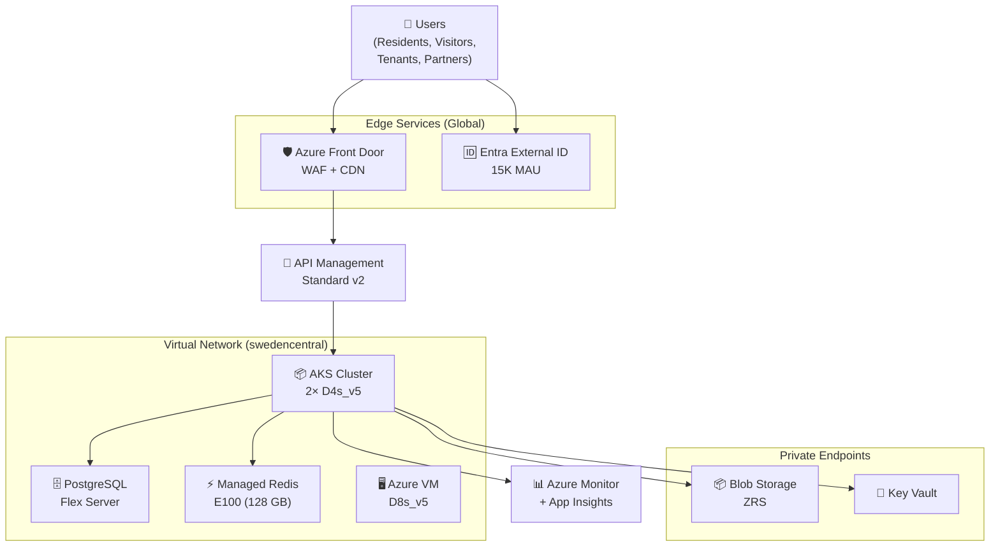
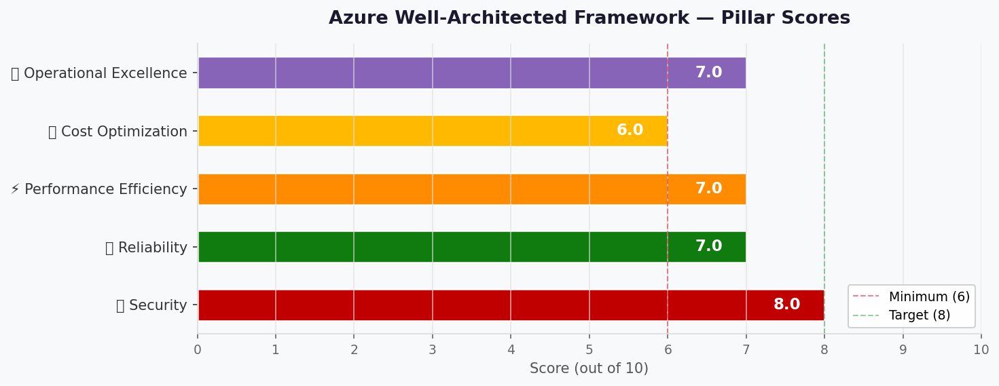

# 🏛️ Step 2: Architecture Assessment - Contoso Service Hub

<strong>📑 Assessment Contents</strong>

- [✅ Requirements Validation](#-requirements-validation)
- [💎 Executive Summary](#-executive-summary)
- [🏛️ WAF Pillar Assessment](#-waf-pillar-assessment)
- [📦 Resource SKU Recommendations](#-resource-sku-recommendations)
- [🎯 Architecture Decision Summary](#-architecture-decision-summary)
- [🚀 Implementation Handoff](#-implementation-handoff)
- [🔒 Approval Gate](#-approval-gate)
- [References](#references)

> Generated by architect agent | 2026-04-01
>
> **Source**: Contoso Service Hub — Requirements (01-requirements.md)
>
> `iac_tool: Bicep`

| ⬅️ Previous                              | 📑 Index            | Next ➡️                                            |
| ---------------------------------------- | ------------------- | -------------------------------------------------- |
| [01-requirements.md](01-requirements.md) | [README](README.md) | [03-des-cost-estimate.md](03-des-cost-estimate.md) |

---

## ✅ Requirements Validation

| Requirement Area        | Status       | Validation Notes                                                                                          |
| ----------------------- | ------------ | --------------------------------------------------------------------------------------------------------- |
| NFRs (SLA, RTO, RPO)    | ⚠️ Partial   | SLA 99.9% explicit (§4.5). RTO 4h and RPO 1h are analyst inferences — accepted as planning assumptions   |
| Compliance requirements | ✅ Defined   | GDPR mandatory, PCI-DSS for payments, SOC 2 and ISO 27001 recommended                                    |
| Budget (approximate)    | ⚠️ Partial   | No explicit budget in RFQ. Analyst estimate ~€8,000–€12,000/month derived from volumetrics                |
| Scale requirements      | ✅ Defined   | 5K users → 15K+, 50K txns 2026 → 2M txns 2027, 500 → 2,000 concurrent users                             |
| Security controls       | ✅ Defined   | WAF, Key Vault, Managed Identity, Private Endpoints, TLS 1.2, encryption at rest, network isolation       |
| Data residency          | ✅ Defined   | EU-only mandatory (§4.3). No processing, replication, or caching outside EU without written approval      |

> [!WARNING]
> RTO/RPO values are analyst assumptions (4h / 1h). Budget is an estimate, not a contractual constraint.
> These should be confirmed with Contoso before production deployment.

---

## 💎 Executive Summary

Contoso Service Hub is a greenfield full-stack digital platform serving EU real estate and lifestyle services. The platform requires 15 Azure services across 3 environments (Dev, Staging, Production) in `swedencentral`, with strict GDPR compliance and EU-only data residency.

The recommended architecture follows an **N-Tier / Microservices pattern** with API-first, containerised backend services on AKS, managed PostgreSQL for persistence, Azure Managed Redis (128 GB) for caching, and Azure Front Door for edge security and CDN. Microsoft Entra External ID provides customer identity management for 15K MAU.

**Key architecture highlights:**

- **Compute**: AKS (Standard tier) with 2× D4s_v5 nodes for production, autoscaling enabled
- **Data**: PostgreSQL Flexible Server (General Purpose) with 256 GB storage, Zone-Redundant Storage for blobs
- **Caching**: Azure Managed Redis E100 (128 GB native) — largest single cost driver at ~52% of production spend
- **Security**: Defence-in-depth with Front Door WAF, Private Endpoints, Managed Identity, Key Vault, network isolation
- **Identity**: Entra External ID (first 50K MAU free) replacing deprecated Azure AD B2C
- **Observability**: Azure Monitor + Application Insights + Log Analytics in EU workspace

**Estimated monthly cost**: ~$10,085 across all 3 environments (~€9,338 at 1.08 USD/EUR), within the estimated €8K–€12K/month budget.

### Recommended Architecture

---

## 🏛️ WAF Pillar Assessment

### Overall Scores

| Pillar                    | Score | Confidence | Summary                                                                    |
| ------------------------- | ----- | ---------- | -------------------------------------------------------------------------- |
| 🔒 Security               | 7/10  | Medium     | Defence-in-depth strong, but Front Door + Entra EU Data Boundary gaps      |
| 🔄 Reliability            | 7/10  | Medium     | 99.9% achievable single-region with AZ. No multi-region DR (per RFQ)       |
| ⚡ Performance            | 7/10  | Medium     | CDN + 128GB cache + APIM. Growth 50K→2M txns needs scaling validation      |
| 💰 Cost Optimization      | 6/10  | Medium     | Redis E100 is 52% of production cost. RI and right-sizing opportunities    |
| 🔧 Operational Excellence | 7/10  | Medium     | Monitor + AppInsights + CI/CD. No runbook automation, greenfield maturity   |

**Primary Pillar Optimized**: 🔒 Security — driven by GDPR mandatory compliance and PCI-DSS payment processing requirements.
**Trade-offs Accepted**: Cost efficiency reduced by 128 GB Redis requirement; Reliability limited to single-region by RFQ scope exclusion of multi-region DR.

> [!CAUTION]
> **EU Data Boundary Risks Identified**: Three global/non-regional services (Front Door, Entra External ID, Azure DNS) have confirmed or partial EU Data Boundary exclusions. See Security Assessment and EU Data Boundary Tenant Configuration sections for required mitigations.

---

### 🔒 Security Assessment (7/10)

**Strengths:**

- **Defence-in-depth architecture**: Azure Front Door WAF (OWASP 3.2 ruleset) protects all public endpoints; no direct backend access
- **Managed Identity**: Service-to-service authentication without credentials for AKS → PostgreSQL, Key Vault, Storage
- **Private Endpoints**: All data services (PostgreSQL, Redis, Key Vault, Storage) accessible only via Private Link within VNet
- **Encryption**: TLS 1.2 minimum in transit; platform-managed encryption at rest for all data services
- **Identity**: Entra External ID with conditional MFA for admin/partner users; OIDC/SAML for federated identity
- **Key management**: Azure Key Vault for all secrets, keys, and certificates — 100K ops/month capacity
- **Network isolation**: VNet with NSGs, dedicated subnets for compute, data, and payment processing (PCI-DSS segmentation)
- **GDPR compliance**: EU-only data residency in swedencentral, ZRS storage (no cross-region replication)

**Gaps:**

- **Customer Managed Keys (CMK)**: Not enabled by default — platform-managed keys used. CMK recommended for transaction records and PII if required by policy
- **DDoS Protection Standard**: Not included — relies on Front Door WAF basic DDoS and Azure platform-level protection
- **Vulnerability scanning**: No container image scanning (e.g., Microsoft Defender for Containers) specified yet

> [!WARNING]
> **RISK — Azure Front Door EU Data Boundary Exclusion**: Azure Front Door/CDN is **excluded** from the Azure EU Data Boundary. Global anycast routing and edge caching may process and cache data at PoPs outside the EU. RFQ §4.3 explicitly prohibits processing, caching, or indexing outside the EU without written approval. **Two options**:
>
> 1. **Replace with Azure Application Gateway** (regional, fully EU-contained) for WAF + load balancing. This drops global CDN capability but guarantees EU-only processing.
> 2. **Retain Front Door** with an explicit documented exception request from Contoso authorizing global edge caching. Until written approval is obtained, this remains a compliance risk.
>
> The Security score has been reduced from 8/10 to 7/10 due to this unresolved EU Data Boundary gap.

> [!WARNING]
> **RISK — Entra External ID + MFA EU Data Boundary Compliance**: Microsoft documents residual Entra data transfers outside the EU Data Boundary. PSTN/SMS-based MFA and Authenticator push notifications may be processed outside Europe. **Mitigations**:
>
> 1. **Restrict MFA to FIDO2/passkey or TOTP-only** — these methods stay within the EU data boundary and do not rely on PSTN/SMS infrastructure.
> 2. **Avoid PSTN/SMS MFA** or require explicit Contoso written approval if telephony-based MFA is business-critical.
> 3. **Flag as architecture risk**: Entra External ID has partial EU Data Boundary compliance. Full sovereignty requires restricting authentication methods and monitoring Microsoft's EU Data Boundary roadmap for Entra services.

**Recommendations:**

1. Enable Microsoft Defender for Containers on AKS for runtime threat detection and image vulnerability scanning
2. **[CRITICAL]** Resolve Front Door EU Data Boundary conflict: either replace with Application Gateway or obtain written Contoso exception for global edge caching per §4.3
3. **[CRITICAL]** Restrict Entra External ID MFA to FIDO2/passkey or TOTP-only to ensure EU-only authentication processing
4. Implement Customer Managed Keys (CMK) for PostgreSQL and Storage accounts holding PII/transaction data if required by Contoso security policy
5. Add DDoS Protection Standard if risk assessment warrants dedicated protection beyond Front Door WAF basic mitigation
6. **[CRITICAL]** Configure Azure EU Data Boundary at tenant level before creating subscriptions — see EU Data Boundary Tenant Configuration section

### 🔄 Reliability Assessment (7/10)

**Strengths:**

- **99.9% SLA achievable**: All selected Azure services support 99.9%+ composite SLA in single-region with Availability Zones
- **AKS multi-node**: 2× D4s_v5 production nodes with autoscaling provides pod-level HA and rolling updates
- **PostgreSQL PITR**: Point-in-time recovery with 35-day retention supports RPO ≤1 hour
- **Zone-redundant storage**: ZRS for Blob Storage eliminates single-zone failure risk while maintaining EU-only residency
- **Redis Enterprise**: E100 tier supports zone redundancy for cache availability
- **Key Vault soft delete**: 90-day recovery period for accidentally deleted secrets

**Gaps:**

- **Single-region only**: Multi-region DR explicitly excluded from RFQ scope — RTO of 4 hours relies on Azure regional recovery
- **RTO/RPO unconfirmed**: 4h RTO and 1h RPO are analyst assumptions, not contractually committed
- **AKS node pool scaling**: Initial 2-node pool may bottleneck during transaction growth phases; autoscaling must be validated
- **No chaos engineering**: No fault injection testing planned for reliability validation

**Recommendations:**

1. Validate RTO (4h) and RPO (1h) assumptions with Contoso and document in SLA agreement
2. Configure AKS cluster autoscaler with min=2 / max=6 nodes to handle growth from 500 to 2,000 concurrent users
3. Enable zone-redundant PostgreSQL deployment (HA with zone-redundant standby) for automatic failover
4. Implement health probes and readiness checks on all AKS workloads for faster failure detection

### ⚡ Performance Assessment (7/10)

**Strengths:**

- **CDN acceleration**: Azure Front Door CDN caches static content at EU edge locations; target <2s page loads achievable
- **128 GB Redis cache**: Enterprise E100 provides sub-millisecond latency for session data, API responses, and frequently accessed content
- **APIM Standard v2**: Handles 5M API requests/month with rate limiting, throttling, and response caching
- **AKS autoscaling**: Horizontal Pod Autoscaler (HPA) for microservice-level scaling based on CPU/memory/custom metrics
- **PostgreSQL General Purpose**: D4s_v3 tier (4 vCPU, 16 GB RAM) supports moderate OLTP workloads

**Gaps:**

- **Transaction growth**: 50K transactions/month (2026) → 2M/month (2027) = 40× growth. Current compute sizing targets MVP; scaling plan needed before R2.0
- **API p95 latency**: Assumed <500ms target not formally committed — needs baseline measurement post-MVP
- **PostgreSQL connection pooling**: No PgBouncer or connection pooling layer specified; AKS microservices may exhaust connection limits under load
- **Peak load modelling**: Concentration factor for booking/payment peaks (e.g., event registrations) not accounted for in initial sizing

**Recommendations:**

1. Implement PgBouncer connection pooling for PostgreSQL to manage connection exhaustion under AKS microservices scaling
2. Establish performance baselines post-MVP: measure p50/p95/p99 latency for API endpoints and page loads
3. Plan AKS node pool scaling to 4-6 nodes before R2.0 (2027) to handle 2M transactions/year
4. Configure APIM response caching policies for read-heavy API endpoints to reduce backend load

### 💰 Cost Assessment (6/10)

| Service                          | SKU                          | Monthly Cost (USD) | Notes                                     |
| -------------------------------- | ---------------------------- | -----------------: | ----------------------------------------- |
| Azure Front Door (WAF + CDN)     | Standard with WAF            |               $462 | 1.5M requests, OWASP rules               |
| Microsoft Entra External ID      | Free tier                    |                 $0 | First 50K MAU free (15K MAU used)         |
| Azure API Management             | Standard v2                  |               $700 | 5M API requests/month                     |
| AKS (compute nodes)              | Standard, 2× D4s_v5         |               $633 | Includes uptime SLA ($73/mo)              |
| PostgreSQL Flexible Server       | GP D4s_v3, 256 GB            |               $520 | Compute + storage + backup                |
| Azure Blob Storage               | StorageV2, Hot, ZRS, 200 GB  |                 $8 | ZRS for EU-only residency                 |
| Azure Files                      | Premium SSD, 256 GB          |                $82 | File share for shared config              |
| Azure Managed Disks              | P15 (256 GB SSD)             |                $42 | VM OS/data disk                           |
| Azure Managed Redis              | Enterprise E100 (128 GB)     |             $3,580 | Largest cost driver (52% of production)   |
| Azure Key Vault                  | Standard                     |                 $8 | 100K operations/month                     |
| Azure VM                         | D8s_v5 (8 vCPU)             |               $330 | General purpose workload VM               |
| Networking                       | VNet, NSG, LB, Private Link  |               $175 | 4 private endpoints + load balancer       |
| Azure DevOps / GitHub            | Basic                        |                $45 | CI/CD pipelines                           |
| Azure Monitor + App Insights     | Pay-as-you-go                |               $245 | ~200 GB/yr log ingestion                  |
| Azure DNS                        | Standard                     |                 $5 | DNS zone hosting                          |
| **Production Subtotal**          |                              |          **$6,835** |                                           |
| Dev environment (reduced SKUs)   |                              |            $1,350  | Minimal SKUs, no HA, smaller Redis        |
| Staging environment (reduced)    |                              |            $1,900  | Mirrors prod at lower scale               |
| **Total All Environments**       |                              |        **$10,085** | ~€9,338/month (within €8K–€12K estimate)  |

**Cost Optimization Applied:**

- Entra External ID free tier (saves ~$500/mo vs paid CIAM alternatives)
- ZRS instead of GRS storage (lower cost, GDPR-compliant — saves ~$3/mo)
- Dev/Staging use reduced SKUs (B-series VMs, Basic Redis, smaller DB tiers)
- AKS free management plane with paid uptime SLA only in production

**Cost Risks:**

- Azure Managed Redis E100 at $3,580/month is the dominant cost driver (52% of production). Consider Premium P4 with clustering ($1,200/mo) if 128 GB native is not a hard requirement — saves ~$2,380/month but adds operational complexity
- Transaction growth (40× by 2027) will require compute scaling — budget should plan for 20-30% increase by H2 2027

### 🔧 Operational Excellence Assessment (7/10)

**Strengths:**

- **Comprehensive observability**: Azure Monitor + Application Insights + Log Analytics provides metrics, distributed tracing, and centralized logging
- **CI/CD pipeline**: Azure DevOps / GitHub Actions for automated build, test, deploy across 3 environments
- **Infrastructure as Code**: Bicep templates ensure repeatable, auditable deployments
- **Diagnostic settings**: All resources configured to send logs to EU Log Analytics workspace
- **Environment strategy**: Clear Dev → Staging → Production promotion path with staging validation before production

**Gaps:**

- **Runbook automation**: No Azure Automation runbooks defined for common operational tasks (scaling, restarts, certificate rotation)
- **Operational maturity**: Greenfield platform — no existing operational playbooks, on-call procedures, or incident response templates
- **Maintenance windows**: Saturday 02:00–06:00 UTC assumed but not formally agreed with Contoso
- **Cost alerts**: No budget alerts or anomaly detection configured
- **Scaling policies**: AKS autoscaler policies not yet defined (min/max nodes, scale-up/down thresholds)

**Recommendations:**

1. Define AKS autoscaler policies: min=2, max=6 nodes for production; scale-up threshold 70% CPU, scale-down delay 10 minutes
2. Create Azure Monitor action groups for SLA breach alerts (availability <99.9%), performance degradation (p95 >500ms), and budget threshold (80% of monthly budget)
3. Establish operational runbooks for: AKS node drain, PostgreSQL point-in-time restore, Redis cache flush, Key Vault certificate rotation
4. Configure Azure Cost Management budget alerts at 75%, 90%, and 100% of €12,000/month

---

### Service Maturity Assessment

| Azure Service                  | GA Status        | AVM Module Available | Zone Redundancy | EU Data Boundary | Notes                                  |
| ------------------------------ | ---------------- | -------------------- | --------------- | ---------------- | -------------------------------------- |
| Azure Front Door               | ✅ GA            | ✅ Yes               | ✅ Global        | ❌ Excluded        | **Excluded from EU Data Boundary** — global edge caching may process outside EU. Replace with App Gateway or obtain Contoso exception |
| Entra External ID              | ✅ GA            | N/A                  | ✅ Global        | ⚠️ Partial         | Residual data transfers outside EU. PSTN/SMS MFA processed outside EU — restrict to FIDO2/TOTP |
| API Management Standard v2     | ✅ GA            | ✅ Yes               | ❌ Standard v2   | ✅ Regional       | v2 does NOT support AZ                 |
| AKS                            | ✅ GA            | ✅ Yes               | ✅ Yes           | ✅ Regional       | Mature, well-supported                 |
| PostgreSQL Flexible Server     | ✅ GA            | ✅ Yes               | ✅ Yes           | ✅ Regional       | Zone-redundant HA available            |
| Azure Blob Storage             | ✅ GA            | ✅ Yes               | ✅ ZRS           | ✅ Regional       | ZRS for single-region redundancy       |
| Azure Files Premium            | ✅ GA            | ✅ Yes               | ✅ ZRS           | ✅ Regional       | ZRS available for premium              |
| Azure Managed Disks            | ✅ GA            | ✅ Yes               | ✅ Yes           | ✅ Regional       | Zone-redundant option available        |
| Azure Managed Redis E100       | ✅ GA            | ✅ Yes               | ✅ Yes           | ✅ Regional       | Enterprise tier supports AZ            |
| Azure Key Vault                | ✅ GA            | ✅ Yes               | ✅ Yes           | ✅ Regional       | Soft delete mandatory                  |
| Azure VMs                      | ✅ GA            | ✅ Yes               | ✅ Yes           | ✅ Regional       | D8s_v5 available in swedencentral      |
| Azure Monitor                  | ✅ GA            | ✅ Yes               | ✅ Yes           | ✅ Regional       | Log Analytics workspace in EU          |
| Azure DNS                      | ✅ GA            | ✅ Yes               | ✅ Global        | ⚠️ Global service | Name resolution processed globally     |

> ⚠️ **APIM Standard v2 does NOT support Availability Zones.** If zone redundancy is required for the API gateway layer, consider APIM Premium tier (additional cost) or accept the AZ gap at Standard v2 tier.

> ❌ **Azure Front Door** is excluded from the EU Data Boundary — global anycast and edge caching may process data outside EU. RFQ §4.3 compliance requires either replacing with Application Gateway or obtaining written Contoso exception.

> ⚠️ **Entra External ID** has partial EU Data Boundary compliance — PSTN/SMS MFA may be processed outside EU. Restrict to FIDO2/passkey or TOTP-only MFA methods.

> ⚠️ **Azure DNS** is a global service — name resolution metadata processed globally. Low risk for data residency as DNS queries do not contain PII.

---

## 📦 Resource SKU Recommendations

| Service                        | Recommended SKU          | Configuration                         | Monthly Est. (USD) | Justification                                                  |
| ------------------------------ | ------------------------ | ------------------------------------- | -----------------: | -------------------------------------------------------------- |
| Azure Front Door               | Standard with WAF        | OWASP 3.2 managed rules, CDN         |               $462 | 1.5M requests/month, EU edge caching                           |
| Entra External ID              | Free tier                | 15K MAU, OIDC + conditional MFA      |                 $0 | First 50K MAU free, replaces deprecated B2C                    |
| API Management                 | Standard v2              | 1 unit, 5M requests/month            |               $700 | Cost-effective for initial volume; v2 architecture              |
| AKS                            | Standard, 2× D4s_v5     | Autoscaler min=2/max=6, uptime SLA   |               $633 | 4 vCPU/16 GB per node, AZ-aware scheduling                    |
| PostgreSQL Flexible Server     | GP D4s_v3, 256 GB        | Zone-redundant HA, PITR 35 days      |               $520 | 4 vCPU/16 GB RAM, sufficient for MVP → R1.0                   |
| Blob Storage                   | StorageV2, Hot, ZRS      | 200 GB, soft delete enabled           |                 $8 | ZRS for EU-only residency, GDPR-compliant                      |
| Azure Files                    | Premium SSD, 256 GB      | ZRS, SMB 3.0                          |                $82 | Shared configuration and file storage                          |
| Managed Disks                  | P15 (256 GB Premium SSD) | Locally redundant                     |                $42 | VM OS and data disks                                           |
| Azure Managed Redis            | Enterprise E100          | 128 GB native, zone-redundant        |             $3,580 | RFQ requires 128 GB; E100 supports natively without clustering |
| Key Vault                      | Standard                 | Soft delete, purge protection         |                 $8 | 100K ops/month for secrets, keys, certificates                 |
| Azure VM                       | D8s_v5                   | 8 vCPU, 32 GB RAM                    |               $330 | General purpose VM for non-containerised workloads             |
| Networking                     | Standard LB, VNet, NSG   | 4 private endpoints                   |               $175 | Private Link for PostgreSQL, Redis, KV, Storage                |
| DevOps / GitHub                | Basic                    | CI/CD pipelines, repos                |                $45 | Automated build and deployment across 3 environments           |
| Azure Monitor + App Insights   | Pay-as-you-go            | Log Analytics workspace (EU)          |               $245 | ~5 GB/day log ingestion, 90-day retention                      |
| Azure DNS                      | Standard                 | 1 zone, query-based billing           |                 $5 | DNS hosting for service endpoints                              |

<strong>Azure Managed Redis</strong> — Pricing Tier Comparison

| Tier                  | Capacity | Zone Redundancy | Price/mo (USD) | Fits?  |
| --------------------- | -------- | --------------- | -------------- | ------ |
| Premium P4            | 120 GB   | ❌               | ~$1,200        | ⚠️     |
| Premium P4 (clustered)| 128 GB   | ❌               | ~$1,400        | ⚠️     |
| Enterprise E100       | 128 GB   | ✅               | ~$3,580        | ✅     |
| Enterprise E200       | 256 GB   | ✅               | ~$7,100        | ❌     |

**Selected**: Enterprise E100 — 128 GB native capacity without clustering overhead, zone-redundant, meets RFQ volumetric requirement. Premium P4 with clustering is a cost-saving alternative ($2,180/mo savings) but adds operational complexity and lacks native zone redundancy.

<strong>AKS Compute</strong> — Node SKU Comparison

| SKU      | vCPU | RAM    | Price/node/mo | Fits?  |
| -------- | ---- | ------ | ------------- | ------ |
| D2s_v5   | 2    | 8 GB   | ~$140         | ❌     |
| D4s_v5   | 4    | 16 GB  | ~$280         | ✅     |
| D8s_v5   | 8    | 32 GB  | ~$560         | ⚠️     |
| D16s_v5  | 16   | 64 GB  | ~$1,120       | ❌     |

**Selected**: D4s_v5 (2 nodes) — 8 vCPU total matches RFQ specification. Autoscaler configured to max=6 nodes (24 vCPU) for growth. D8s_v5 over-provisions for MVP.

<strong>PostgreSQL Flexible Server</strong> — Tier Comparison

| Tier               | vCPU | RAM    | Storage | Price/mo (USD) | Fits?  |
| ------------------ | ---- | ------ | ------- | -------------- | ------ |
| Burstable B2ms     | 2    | 8 GB   | 256 GB  | ~$180          | ❌     |
| GP D2s_v3          | 2    | 8 GB   | 256 GB  | ~$280          | ⚠️     |
| GP D4s_v3          | 4    | 16 GB  | 256 GB  | ~$520          | ✅     |
| GP D8s_v3          | 8    | 32 GB  | 256 GB  | ~$990          | ❌     |

**Selected**: General Purpose D4s_v3 — sufficient compute for MVP (50K txns/month) with zone-redundant HA. Scale to D8s_v3 when transaction volume approaches 500K+/month.

---

## 🎯 Architecture Decision Summary

| Decision                         | Choice                                        | Rationale                                                                                      |
| -------------------------------- | --------------------------------------------- | ---------------------------------------------------------------------------------------------- |
| Compute platform                 | AKS (Standard, D4s_v5 nodes)                  | RFQ mandates managed Kubernetes (§4.1 #10). AKS provides enterprise-grade orchestration         |
| Database                         | PostgreSQL Flexible Server (GP D4s_v3)        | GP tier with zone-redundant HA; PITR 35 days for RPO ≤1h compliance                            |
| Caching tier                     | Azure Managed Redis E100 (128 GB)             | Native 128 GB without clustering. Premium P4 max is 120 GB — would need clustering             |
| Identity (CIAM)                  | Microsoft Entra External ID                   | Replaces deprecated Azure AD B2C. First 50K MAU free covers 15K MAU requirement                |
| Storage redundancy               | ZRS (Zone-Redundant Storage)                  | GRS replicates to paired region, conflicting with EU-only data residency (GDPR §4.3)           |
| Edge security                    | Azure Front Door Standard with WAF            | Integrated CDN + WAF + DDoS basic. Handles 1.5M requests/month with OWASP ruleset             |
| API gateway                      | APIM Standard v2                              | Cost-effective for 5M requests/month. Note: v2 does NOT support Availability Zones             |
| Network isolation                | VNet + Private Endpoints + NSGs               | All data services via Private Link; no direct public access to backend services                |
| IaC tool                         | Bicep                                         | Per requirements. AVM modules available for all selected services                              |
| Region                           | swedencentral                                 | EU GDPR-compliant, low latency to European user base, AZ support                              |
| Monitoring                       | Azure Monitor + App Insights + Log Analytics  | Centralised observability with EU-region workspace; 90-day log retention                       |
| Budget model                     | Hybrid (PAYG + RI opportunities)              | PAYG for dev; RI for production compute and Redis (1-year commitment for ~30% savings)          |

---

## 🚀 Implementation Handoff

### Ready for IaC Planner

The architecture is approved for implementation with the following key parameters:

| Parameter      | Value                                      |
| -------------- | ------------------------------------------ |
| Region         | swedencentral                              |
| Environments   | Dev, Staging, Production                   |
| Budget         | ~€8,000–€12,000/month (estimated: €9,338)  |
| Resource Count | 15 Azure services                          |
| IaC Tool       | Bicep (AVM modules preferred)              |
| Complexity     | Complex                                    |

### Resources to Provision

| #   | Resource                       | SKU                      | Key Config                                          |
| --- | ------------------------------ | ------------------------ | --------------------------------------------------- |
| 1   | Azure Front Door               | Standard + WAF           | OWASP 3.2, CDN, EU-only caching                    |
| 2   | Entra External ID              | Free tier (P1)           | 15K MAU, OIDC, conditional MFA                      |
| 3   | API Management                 | Standard v2              | 5M requests/month                                   |
| 4   | AKS                            | Standard, 2× D4s_v5     | Autoscaler min=2/max=6, uptime SLA                  |
| 5   | PostgreSQL Flexible Server     | GP D4s_v3, 256 GB        | Zone-redundant HA, PITR 35 days                     |
| 6   | Blob Storage                   | StorageV2, Hot, ZRS      | 200 GB, soft delete, no public blob access           |
| 7   | Azure Files                    | Premium SSD, 256 GB      | ZRS, SMB 3.0                                        |
| 8   | Managed Disks                  | P15 (256 GB)             | Premium SSD for VM                                  |
| 9   | Azure Managed Redis            | E100 (128 GB)            | Zone-redundant, Private Endpoint                    |
| 10  | Key Vault                      | Standard                 | Soft delete, purge protection, PE                   |
| 11  | Azure VM                       | D8s_v5                   | 8 vCPU, 32 GB RAM                                   |
| 12  | VNet + Subnets                 | Standard                 | /16 VNet, /24 subnets for compute, data, PE         |
| 13  | DevOps / GitHub                | Basic                    | CI/CD pipelines                                     |
| 14  | Azure Monitor + App Insights   | Pay-as-you-go            | EU Log Analytics workspace, 90-day retention        |
| 15  | Azure DNS                      | Standard                 | DNS zone hosting                                    |

### EU Data Boundary Tenant Configuration

> [!CAUTION]
> **PREREQUISITE — Must be completed BEFORE creating subscriptions or deploying resources.**

Azure Resource Manager must be configured for the EU Data Boundary on a **new, empty tenant** before any subscriptions or resources are created. This ensures that professional services data (support, troubleshooting, diagnostics) stays within the EU.

| Requirement                                | Detail                                                                                          |
| ------------------------------------------ | ----------------------------------------------------------------------------------------------- |
| **Tenant creation**                        | New Entra ID tenant with EU Data Boundary enabled at creation time                              |
| **Timing**                                 | Must be configured **before** subscriptions are created — cannot be retrofitted                  |
| **Scope**                                  | Covers Azure Resource Manager control plane, support data, and professional services metadata   |
| **Validation**                             | Verify via Azure Portal → Tenant Properties → Data Boundary setting                            |
| **Impact on existing tenants**             | If Contoso has an existing tenant, a new tenant or sub-tenant may be required for EU compliance |

**Implementation prerequisites for IaC Planner:**

1. Confirm whether Contoso has an existing Azure tenant or requires a new tenant
2. If new tenant: configure EU Data Boundary during tenant creation wizard
3. If existing tenant: assess whether EU Data Boundary can be enabled (may require Microsoft support engagement) or if a separate tenant is needed
4. Document tenant configuration in deployment prerequisites before IaC provisioning begins

### Security Requirements for Implementation

| Requirement                | Implementation in Bicep                                               |
| -------------------------- | --------------------------------------------------------------------- |
| TLS 1.2 minimum            | `minTlsVersion: 'TLS1_2'` on all applicable resources                |
| HTTPS-only                 | `supportsHttpsTrafficOnly: true` on storage accounts                  |
| No public blob access      | `allowBlobPublicAccess: false` on storage accounts                    |
| Managed Identity           | `identity: { type: 'SystemAssigned' }` on AKS, VM, Function Apps     |
| Private Endpoints          | Private Link for PostgreSQL, Redis, Key Vault, Storage                |
| Key Vault soft delete      | `enableSoftDelete: true`, `softDeleteRetentionInDays: 90`             |
| WAF                        | Front Door WAF policy with DRS 2.1 (OWASP 3.2 equivalent) — **or** Application Gateway WAF v2 if Front Door is replaced for EU Data Boundary compliance |
| Network isolation          | NSGs on all subnets; deny-all default inbound                         |
| EU Data Boundary           | Tenant-level EU Data Boundary configured before subscription creation |
| MFA method restriction     | Entra External ID: FIDO2/passkey or TOTP only — no PSTN/SMS MFA      |

### Monitoring Requirements for Implementation

| Requirement                | Implementation in Bicep                                               |
| -------------------------- | --------------------------------------------------------------------- |
| Diagnostic settings        | All resources → Log Analytics workspace (EU region)                   |
| Application tracing        | Application Insights with distributed tracing on AKS workloads        |
| Alert rules                | Action groups for availability <99.9%, p95 >500ms, budget >80%        |
| Dashboard                  | Azure Monitor workbook for operations and business KPIs               |
| Log retention              | 90 days in Log Analytics; archive to Storage for >90 days             |

---

## 🔒 Approval Gate

> [!IMPORTANT]
> **🏗️ Architecture Assessment Complete**
>
> | Pillar      | Score |
> | ----------- | ----- |
> | Security    | 7/10  |
> | Reliability | 7/10  |
> | Performance | 7/10  |
> | Cost        | 6/10  |
> | Operations  | 7/10  |
>
> **Estimated Monthly Cost**: ~$10,085 / ~€9,338 (within €8K–€12K budget estimate)
>
> **Confidence Level**: Medium — budget is estimated (no explicit RFQ budget), RTO/RPO are analyst assumptions
>
> **Key Risks**:
> - Azure Managed Redis E100 at $3,580/month (52% of production cost). Consider Premium P4 with clustering to save ~$2,180/month.
> - ❌ **Azure Front Door EU Data Boundary exclusion** — global edge caching may violate RFQ §4.3. Requires replacement with Application Gateway or written Contoso exception.
> - ⚠️ **Entra External ID MFA** — PSTN/SMS MFA processed outside EU. Restrict to FIDO2/TOTP.
> - ⚠️ **EU Data Boundary tenant prerequisite** — must be configured before subscription creation; cannot be retrofitted.
>
> - [x] **Approved** — proceed to IaC Planner (automated E2E run)
> - Approver: Automated E2E pipeline
> - Date: 2026-04-01

---

## References

> [!NOTE]
> 📚 The following Microsoft Learn resources informed this assessment.

| Topic                               | Link                                                                                                              |
| ----------------------------------- | ----------------------------------------------------------------------------------------------------------------- |
| Well-Architected Framework          | [Overview](https://learn.microsoft.com/azure/well-architected/)                                                   |
| Security Checklist                  | [WAF Security](https://learn.microsoft.com/azure/well-architected/security/checklist)                             |
| Reliability Checklist               | [WAF Reliability](https://learn.microsoft.com/azure/well-architected/reliability/checklist)                       |
| Cost Optimization                   | [WAF Cost](https://learn.microsoft.com/azure/well-architected/cost-optimization/checklist)                        |
| AKS Best Practices                  | [AKS](https://learn.microsoft.com/azure/aks/best-practices)                                                      |
| PostgreSQL Flexible Server          | [Overview](https://learn.microsoft.com/azure/postgresql/flexible-server/overview)                                 |
| Azure Managed Redis                 | [Overview](https://learn.microsoft.com/azure/azure-cache-for-redis/managed-redis/managed-redis-overview)          |
| Entra External ID                   | [Overview](https://learn.microsoft.com/entra/external-id/)                                                        |
| Azure Front Door WAF                | [Overview](https://learn.microsoft.com/azure/web-application-firewall/afds/afds-overview)                         |
| EU Data Boundary                    | [Learn](https://learn.microsoft.com/privacy/eudb/eu-data-boundary-learn)                                          |

---

_Assessment performed using Azure Well-Architected Framework. Pricing data from Azure Pricing MCP (2026-04-01)._

---

| ⬅️ [01-requirements.md](01-requirements.md) | 🏠 [Project Index](README.md) | ➡️ [03-des-cost-estimate.md](03-des-cost-estimate.md) |
| ------------------------------------------- | ----------------------------- | ----------------------------------------------------- |

