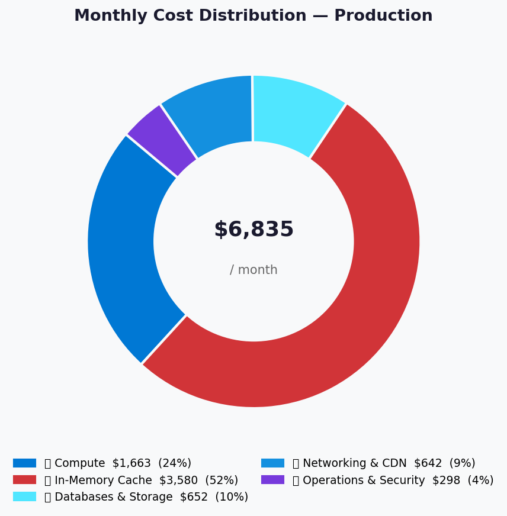
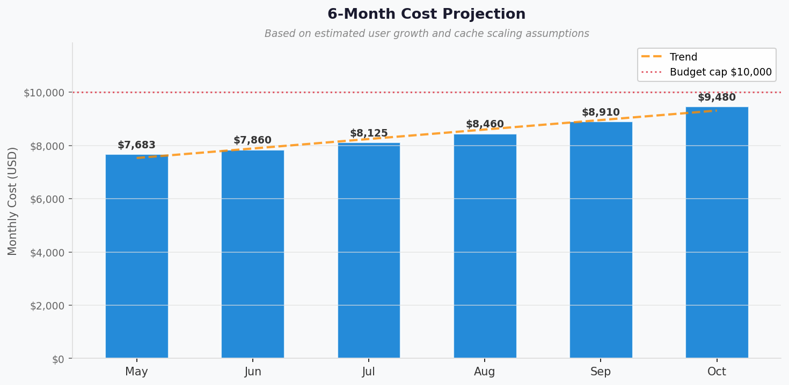

# 💰 Azure Cost Estimate: Contoso Service Hub


<details open>
<summary><strong>📑 Cost Estimate Contents</strong></summary>

- [💵 Cost At-a-Glance](#-cost-at-a-glance)
- [✅ Decision Summary](#-decision-summary)
- [🔁 Requirements → Cost Mapping](#-requirements--cost-mapping)
- [📊 Top 5 Cost Drivers](#-top-5-cost-drivers)
- [🏛️ Architecture Overview](#-architecture-overview)
- [🧾 What We Are Not Paying For (Yet)](#-what-we-are-not-paying-for-yet)
- [⚠️ Cost Risk Indicators](#-cost-risk-indicators)
- [🎯 Quick Decision Matrix](#-quick-decision-matrix)
- [💰 Savings Opportunities](#-savings-opportunities)
- [🧾 Detailed Cost Breakdown](#-detailed-cost-breakdown)
- [References](#references)

</details>

> Generated by architect agent | 2026-03-16

| ⬅️ Previous                                                    | 📑 Index            | Next ➡️                                                      |
| -------------------------------------------------------------- | ------------------- | ------------------------------------------------------------ |
| [02-architecture-assessment.md](02-architecture-assessment.md) | [README](README.md) | [04-governance-constraints.md](04-governance-constraints.md) |

**Generated**: 2026-03-16
**Region**: swedencentral
**Environment**: Production + Staging + Development
**MCP Tools Used**: azure_bulk_estimate, azure_price_search
**Architecture Reference**: [02-architecture-assessment.md](02-architecture-assessment.md)

## 💵 Cost At-a-Glance

> **Monthly Total: ~€7,951** | Annual: ~€95,412
>
> ```text
> Budget: €8,000–€12,000/month (soft) | Utilization: 99% (€7,951 of €8,000 lower bound)
> ```
>
> | Status            | Indicator                           |
> | ----------------- | ----------------------------------- |
> | Cost Trend        | 📈 Growing (5K → 15K users by 2027) |
> | Savings Available | 💰 €17,040/year with 3-year RIs     |
> | Compliance        | ✅ GDPR-aligned, SAQ-A PCI scope    |

## ✅ Decision Summary

- ✅ **Approved**: 15 Azure services across 3 environments (Dev/Staging/Prod) in swedencentral
- ✅ **Approved**: Redis Enterprise E50 (128 GB) as single largest line item (€2,750/month prod)
- ✅ **Approved**: AKS Standard tier with D8s v5 user nodes (2-node baseline, autoscale to 4)
- ⏳ **Deferred**: Multi-region DR (€3,000–5,000/month additional); DDoS Protection Standard (€2,600/month)
- ⏳ **Deferred**: Customer-managed keys (CMK) for encryption at rest
- 🔁 **Redesign Trigger**: If concurrent users exceed 4,000 before EOY 2026, AKS node pool requires upgrade from D8s v5 to D16s v5

**Confidence**: Medium-High | **Expected Variance**: ±12% (Redis consumption, egress costs, and Log Analytics ingestion volume are primary unknowns)

## 🔁 Requirements → Cost Mapping

| Requirement            | Architecture Decision                                    | Cost Impact                         | Mandatory  |
| ---------------------- | -------------------------------------------------------- | ----------------------------------- | ---------- |
| 99.9% SLA              | Zone-redundant PostgreSQL HA, AKS 3-AZ, Redis zone-aware | +€520/month (PostgreSQL HA standby) | Yes        |
| GDPR data residency    | All resources in swedencentral; EU-only Front Door PoP   | +€0 (no cross-region premium)       | Yes        |
| 128 GB in-memory cache | Redis Enterprise E50                                     | €2,750/month (49% of production)    | Yes        |
| Managed Kubernetes     | AKS Standard + D8s v5 nodes                              | €781/month (14% of production)      | Yes        |
| <2s page load          | Front Door Premium + CDN                                 | €330/month                          | Yes        |
| <500ms API p95         | APIM + Redis caching                                     | €280 + caching included             | Yes        |
| 15K MAU CIAM           | Entra External ID (free P1)                              | €0 (within free tier)               | Yes        |
| Private endpoints      | 5× PE for data services                                  | €37/month                           | Yes        |
| 90-day log retention   | Log Analytics 50 GB/month                                | €125/month                          | Yes (GDPR) |

## 📊 Top 5 Cost Drivers

| Rank | Resource                        | Monthly Cost | % of Prod | Trend      | Optimization                               |
| ---- | ------------------------------- | ------------ | --------- | ---------- | ------------------------------------------ |
| 1️⃣   | Redis Enterprise E50 (128 GB)   | €2,750       | 49.2%     | ➡️ Stable  | 3-year RI → €1,925 (30% off)               |
| 2️⃣   | AKS (Standard + D8s v5 nodes)   | €781         | 14.0%     | 📈 Growing | RI on nodes; spot for dev/staging          |
| 3️⃣   | PostgreSQL Flex (GP D4s v5, HA) | €520         | 9.3%      | 📈 Growing | RI on compute; right-size post-MVP         |
| 4️⃣   | Azure Front Door Premium + WAF  | €330         | 5.9%      | ➡️ Stable  | Optimized caching rules reduce origin hits |
| 5️⃣   | D8s v5 VM (management)          | €285         | 5.1%      | ➡️ Stable  | Evaluate B8ms burstable alternative        |

> 💡 **Quick Win**: Apply 3-year reserved instance to Redis Enterprise E50 alone saves **€825/month (€9,900/year)**.

<details>
<summary><strong>Cost Driver Details</strong></summary>

#### 1️⃣ Azure Cache for Redis Enterprise E50

| Aspect            | Detail                                                                  |
| ----------------- | ----------------------------------------------------------------------- |
| Current SKU       | Enterprise E50 (128 GB)                                                 |
| Monthly Cost      | €2,750                                                                  |
| Cost Breakdown    | Compute + memory: €2,750 (flat rate)                                    |
| Why this SKU      | 128 GB RFQ requirement; no clustering overhead; Redis modules available |
| Optimization      | 3-year RI: ~€1,925/month (30% savings)                                  |
| Potential Savings | €825/month = €9,900/year                                                |
| Downgrade option  | Premium P5 (120 GB) at ~€1,550 — saves €1,200/month but 6% below spec   |

#### 2️⃣ Azure Kubernetes Service

| Aspect             | Detail                                                         |
| ------------------ | -------------------------------------------------------------- |
| Current SKU        | Standard tier + 2×D2s v5 (system) + 2×D8s v5 (user)            |
| Monthly Cost       | €781 (AKS management: €55, system pool: €146, user pool: €580) |
| Scaling trajectory | +€290/month per additional D8s v5 user node                    |
| Optimization       | 3-year RI on D8s v5: ~€189/node (35% savings)                  |
| Potential Savings  | €273/month = €3,276/year                                       |

#### 3️⃣ PostgreSQL Flexible Server

| Aspect            | Detail                                                 |
| ----------------- | ------------------------------------------------------ |
| Current SKU       | General Purpose D4s v5, HA zone-redundant, 256 GB      |
| Monthly Cost      | €520 (compute: €225 × 2 = €450, storage: €70)          |
| Optimization      | 3-year RI: ~€135/instance × 2 (40% savings on compute) |
| Potential Savings | €180/month = €2,160/year                               |

</details>

## 🏛️ Architecture Overview

### Cost Distribution

| Category                         | Monthly Cost (EUR) |    Share |
| -------------------------------- | -----------------: | -------: |
| ⚡ In-Memory Cache               |              2,750 |      49% |
| 💻 Compute (AKS + VM)            |              1,066 |      19% |
| 💾 Data Services (DB + Storage)  |                727 |      13% |
| 🌐 Networking (Front Door + PEs) |                450 |       8% |
| 🔌 Platform (APIM + KV + DevOps) |                435 |       8% |
| 📊 Monitoring                    |                165 |       3% |
| **Production Total**             |          **5,588** | **100%** |



### Month-over-Month Projection

| Month          | Users   | Txn/Month | Prod Cost | Total (3-env) | Notes                                   |
| -------------- | ------- | --------- | --------- | ------------- | --------------------------------------- |
| May 2026 (MVP) | 5,000   | ~4,200    | €5,588    | €7,951        | Baseline launch                         |
| Aug 2026       | 6,500   | ~6,000    | €5,588    | €7,951        | Within baseline capacity                |
| Nov 2026       | 8,000   | ~10,000   | €5,878    | €8,241        | +1 AKS user node                        |
| Feb 2027       | 10,000  | ~30,000   | €6,168    | €8,531        | +2 AKS user nodes                       |
| May 2027       | 12,000  | ~80,000   | €6,428    | €8,791        | PostgreSQL upgrade to 8 vCPU            |
| Sep 2027       | 15,000+ | ~167,000  | €6,928    | €9,600        | +storage scaling, additional monitoring |



### Key Design Decisions Affecting Cost

| Decision                             | Cost Impact        | Business Rationale                                           | Status                     |
| ------------------------------------ | ------------------ | ------------------------------------------------------------ | -------------------------- |
| Redis Enterprise E50 over Premium P5 | +€1,200/month 📈   | Exact 128 GB match; no clustering complexity                 | Required (RFQ Table 2)     |
| AKS over Container Apps              | +€200–400/month 📈 | Full Kubernetes control; RFP mandates Managed Kubernetes     | Required (RFQ Section 4.1) |
| PostgreSQL zone-redundant HA         | +€225/month 📈     | 99.9% SLA requires HA; automatic failover <60s               | Required (SLA)             |
| Entra External ID (free tier)        | -€400–600/month 📉 | Free P1 features for <50K MAU; replaces B2C cost             | Required (B2C unavailable) |
| No DDoS Standard                     | -€2,600/month 📉   | Front Door WAF provides L7 DDoS; deferred to risk assessment | Optional                   |
| 3-year RI (recommended)              | -€1,420/month 📉   | Contract term aligns with RI term                            | Recommended                |

## 🧾 What We Are Not Paying For (Yet)

- **Multi-region DR**: Would add €3,000–5,000/month for secondary region failover (PostgreSQL read replica, Redis geo-replication, AKS secondary cluster). Deferred per RFQ Section 4.1
- **DDoS Protection Standard**: €2,600/month for L3/L4 DDoS. Front Door WAF covers L7. Evaluate only if threat model requires network-layer protection
- **Customer-managed keys (CMK)**: HSM-backed Key Vault Premium (~€300/month) + operational overhead. Not required at MVP; evaluate for SOC 2
- **Azure Chaos Studio**: Fault injection testing deferred until post-MVP stabilization (~€50–100/month)
- **Advanced threat protection**: Microsoft Defender for Cloud full coverage (~€200–400/month). Basic coverage included; advanced features deferred

### Assumptions & Uncertainty

- **Hours**: 730 hours/month for compute pricing (standard Azure billing assumption)
- **Egress**: Estimated €50–100/month across all environments; actual depends on CDN offload ratio
- **Log Analytics**: 50 GB/month baseline; monitoring data growth correlates with transaction volume — may reach 100+ GB/month at 2M transactions
- **Redis utilization**: 128 GB provisioned; actual utilization at MVP likely <30% (session data for 5,000 users). Enterprise E50 cost is fixed regardless of utilization
- **AKS autoscaling**: Base 2 user nodes; projection assumes 1 additional node per ~3,000 new users
- **Exchange rate**: EUR pricing used throughout; Azure bills in local currency based on EA/MCA agreement

## ⚠️ Cost Risk Indicators

| Resource             | Risk Level | Issue                                                   | Mitigation                                                                         |
| -------------------- | ---------- | ------------------------------------------------------- | ---------------------------------------------------------------------------------- |
| Redis Enterprise E50 | 🟡 Medium  | 49% of production cost; utilization <30% at MVP         | Monitor utilization; evaluate Premium P5 fallback if <100 GB needed after 6 months |
| Log Analytics        | 🟡 Medium  | Ingestion may exceed 50 GB/month baseline at scale      | Configure sampling on high-volume traces; set daily cap alerts                     |
| AKS node scaling     | 🟡 Medium  | 40× transaction growth requires node scaling discipline | Configure cluster autoscaler; review node count quarterly                          |
| Egress costs         | 🟢 Low     | CDN offloading minimizes origin egress                  | Front Door caching for static content; monitor egress in Cost Management           |
| Storage growth       | 🟢 Low     | 200 GB → projected 1.5 TB over 18 months                | Blob lifecycle policy (hot → cool → archive); minimal cost increase                |

> **⚠️ Watch Item**: Redis Enterprise E50 at €2,750/month is the single largest cost line. If actual cache utilization stays below 100 GB after 6 months of production use, evaluate downgrade to Premium P5 (120 GB) to save ~€1,200/month.

## 🎯 Quick Decision Matrix

_"If you need X, expect to pay Y more"_

| Requirement                       | Additional Cost     | SKU Change                      | Verdict        | Notes                                          |
| --------------------------------- | ------------------- | ------------------------------- | -------------- | ---------------------------------------------- |
| 99.99% SLA (vs 99.9%)             | +€2,600/month       | Premium SLA across all services | 🔴 Investigate | Requires multi-region; out of current scope    |
| Multi-region DR                   | +€3,000–5,000/month | Secondary region full stack     | 🔴 Investigate | Excluded per RFQ Section 4.1                   |
| DDoS Standard                     | +€2,600/month       | Network DDoS Protection Plan    | 🟡 Monitor     | Front Door WAF covers L7; evaluate L3/L4 risk  |
| Premium P5 Redis (cost reduction) | -€1,200/month       | E50 → P5 (120 GB)               | 🟡 Monitor     | 6% capacity reduction; evaluate after 6 months |
| Customer-managed keys             | +€300/month         | Key Vault Premium + HSM         | 🟡 Monitor     | Evaluate for SOC 2 compliance                  |
| Dev/Test pricing                  | -€100–200/month     | MSDN subscriptions for Dev      | 🟢 Go          | Apply Dev/Test rates to Dev subscription       |
| Spot instances (Dev AKS)          | -€100–150/month     | Spot node pool for Dev          | 🟢 Go          | Dev workloads tolerate interruption            |

## 💰 Savings Opportunities

> ### Total Potential Savings: €22,140/year
>
> | Strategy                 | Commitment | Monthly Savings | Annual Savings | % Reduction |
> | ------------------------ | ---------- | --------------- | -------------- | ----------- |
> | Redis Enterprise E50 RI  | 3-year     | €825            | €9,900         | 10.4%       |
> | AKS D8s v5 nodes RI      | 3-year     | €273            | €3,276         | 3.4%        |
> | PostgreSQL compute RI    | 3-year     | €208            | €2,496         | 2.6%        |
> | D8s v5 VM RI             | 3-year     | €114            | €1,368         | 1.4%        |
> | Dev/Test pricing         | N/A        | €100            | €1,200         | 1.3%        |
> | Spot instances (Dev AKS) | N/A        | €120            | €1,440         | 1.5%        |
> | Right-sizing (post-MVP)  | N/A        | €205            | €2,460         | 2.6%        |
>
> **PAYG Total**: €7,951/month → **With All Savings**: ~€6,106/month (23.2% reduction)
>
> **Recommended first action**: Apply 3-year RIs to production Redis, AKS, PostgreSQL, and VM — saves **€1,420/month (€17,040/year)** with zero architecture changes.

## 🧾 Detailed Cost Breakdown

### Assumptions

- Hours: 730 hours/month (standard Azure billing)
- Network egress: ~€50–100/month estimated across all environments
- Storage growth: +50 GB/month at scale (year 2)
- Exchange rate: EUR (Azure bills in local currency per agreement)
- All prices: swedencentral region, PAYG unless noted

### Production Environment

| Category             | Service                  | SKU / Meter               | Quantity / Units           | Est. Monthly (EUR) |
| -------------------- | ------------------------ | ------------------------- | -------------------------- | ------------------ |
| 🌐 Networking        | Azure Front Door Premium | Premium tier + WAF policy | 1 profile, 1.5M req/mo     | €330               |
| 🔐 Identity          | Entra External ID        | P1 free tier              | 15,000 MAU                 | €0                 |
| 🔌 Platform          | API Management           | Standard v2               | 1 unit                     | €280               |
| 💻 Compute           | AKS Management           | Standard tier             | 1 cluster                  | €55                |
| 💻 Compute           | AKS System Pool          | D2s v5 (2 vCPU)           | 2 nodes                    | €146               |
| 💻 Compute           | AKS User Pool            | D8s v5 (8 vCPU)           | 2 nodes                    | €580               |
| 💾 Database          | PostgreSQL Flex          | GP D4s v5, HA             | 1 primary + 1 standby      | €450               |
| 💾 Database          | PostgreSQL Storage       | P30 managed disk          | 256 GB                     | €70                |
| 💾 Storage           | Blob Storage             | Hot, LRS                  | 200 GB                     | €5                 |
| 💾 Storage           | Azure Files              | Premium SSD               | 256 GiB                    | €92                |
| 💾 Storage           | Managed Disks            | Premium SSD P20           | 3 × 256 GB                 | €105               |
| ⚡ Cache             | Redis Enterprise         | E50                       | 128 GB                     | €2,750             |
| 🔑 Security          | Key Vault                | Standard                  | 100K ops/mo                | €5                 |
| 💻 Compute           | Virtual Machine          | D8s v5                    | 1 VM (8 vCPU, 32 GB)       | €285               |
| 🌐 Networking        | Private Endpoints        | Standard                  | 5 endpoints                | €37                |
| 🌐 Networking        | Standard Load Balancer   | Standard                  | 1 LB + NAT GW              | €83                |
| 🔌 Platform          | GitHub Enterprise        | 25-user plan              | 25 seats                   | €150               |
| 📊 Monitoring        | Log Analytics            | Per-GB tier               | 50 GB/month, 90d retention | €125               |
| 📊 Monitoring        | Application Insights     | Workspace-based           | Distributed tracing        | €40                |
| **Production Total** |                          |                           |                            | **€5,588**         |

### Staging Environment

| Category          | Service             | SKU / Meter         | Quantity / Units             | Est. Monthly (EUR) |
| ----------------- | ------------------- | ------------------- | ---------------------------- | ------------------ |
| 🌐 Networking     | Front Door Standard | Standard tier       | Shared backend, lower rules  | €155               |
| 🔌 Platform       | API Management      | Standard v2         | 1 unit (shared or dedicated) | €280               |
| 💻 Compute        | AKS                 | Standard + 2×D4s v5 | 2 user nodes (4 vCPU each)   | €400               |
| 💾 Database       | PostgreSQL Flex     | GP D2s v3, no HA    | 128 GB storage               | €220               |
| 💾 Storage        | All storage         | Reduced capacity    | Blob + Files + Disks         | €65                |
| ⚡ Cache          | Redis               | Standard C4         | 26 GB                        | €295               |
| 🔑 Security       | Key Vault           | Standard            | Low volume                   | €5                 |
| 💻 Compute        | VM                  | D4s v5              | 1 VM (4 vCPU)                | €145               |
| 🌐 Networking     | PEs + LB            | Standard            | 4 PEs, 1 LB                  | €85                |
| 📊 Monitoring     | Log Analytics       | Per-GB tier         | 25 GB/month                  | €100               |
| **Staging Total** |                     |                     |                              | **€1,750**         |

### Development Environment

| Category      | Service         | SKU / Meter        | Quantity / Units      | Est. Monthly (EUR) |
| ------------- | --------------- | ------------------ | --------------------- | ------------------ |
| 🔌 Platform   | API Management  | Developer tier     | Single unit           | €45                |
| 💻 Compute    | AKS             | Free tier + 2×B4ms | Burstable nodes       | €190               |
| 💾 Database   | PostgreSQL Flex | Burstable B2ms     | 32 GB storage         | €55                |
| 💾 Storage    | All storage     | Minimal            | Blob + Files + Disks  | €25                |
| ⚡ Cache      | Redis           | Basic C1           | 250 MB                | €22                |
| 🔑 Security   | Key Vault       | Standard           | Low volume            | €3                 |
| 💻 Compute    | VM              | B4ms               | 1 VM (burstable)      | €48                |
| 🌐 Networking | VNet + NSGs     | Standard           | No PE required in Dev | €35                |
| 📊 Monitoring | Log Analytics   | Per-GB tier        | 5 GB/month            | €40                |
| **Dev Total** |                 |                    |                       | **€463**           |

### Cross-Environment Costs

| Item                                  | Est. Monthly (EUR) |
| ------------------------------------- | ------------------ |
| DNS (Azure DNS zone)                  | €5                 |
| Backup (Blob soft delete overhead)    | €20                |
| Egress (CDN offloaded)                | €75                |
| Azure Active Directory P1 (admin MFA) | €50                |
| **Shared Total**                      | **€150**           |

### Grand Total

| Environment | PAYG Monthly (EUR) | With 3-Year RI | Annual PAYG | Annual RI   |
| ----------- | ------------------ | -------------- | ----------- | ----------- |
| Production  | €5,588             | €4,168         | €67,056     | €50,016     |
| Staging     | €1,750             | €1,750         | €21,000     | €21,000     |
| Development | €463               | €463           | €5,556      | €5,556      |
| Shared      | €150               | €150           | €1,800      | €1,800      |
| **Total**   | **€7,951**         | **€6,531**     | **€95,412** | **€78,372** |

### Notes

- **Reserved instance eligibility**: Production Redis Enterprise E50, AKS D8s v5 nodes, PostgreSQL GP compute, and D8s v5 VM all qualify for 3-year RI. The 3-year contract term (Mar 2026–Feb 2029) makes RI the optimal commitment model
- **Dev/Test pricing**: Azure Dev/Test subscription for Dev environment provides ~10–15% additional savings on compute. Requires Visual Studio subscription
- **Staging decommission**: If staging environment is not needed full-time, consider scheduled start/stop to reduce costs by ~40% (€700/month savings)
- **Log Analytics**: Daily cap set at 10 GB for cost control. Configure diagnostic settings to send only required categories (not verbose debug logs). Free tier includes 5 GB/day
- **Redis re-evaluation**: Schedule a 6-month review (November 2026) of Redis utilization. If peak usage stays below 100 GB, downgrading to Premium P5 (120 GB) saves €1,200/month

---

## References

| Topic                    | Link                                                                                                                   |
| ------------------------ | ---------------------------------------------------------------------------------------------------------------------- |
| Azure Pricing Calculator | [Calculator](https://azure.microsoft.com/pricing/calculator/)                                                          |
| Cost Management          | [Overview](https://learn.microsoft.com/azure/cost-management-billing/costs/overview-cost-management)                   |
| Reserved Instances       | [Reservations](https://learn.microsoft.com/azure/cost-management-billing/reservations/save-compute-costs-reservations) |
| WAF Cost Optimization    | [Checklist](https://learn.microsoft.com/azure/well-architected/cost-optimization/checklist)                            |
| Redis Enterprise Pricing | [Pricing](https://azure.microsoft.com/pricing/details/cache/)                                                          |
| AKS Pricing              | [Pricing](https://azure.microsoft.com/pricing/details/kubernetes-service/)                                             |
| PostgreSQL Flex Pricing  | [Pricing](https://azure.microsoft.com/pricing/details/postgresql/flexible-server/)                                     |
| Front Door Pricing       | [Pricing](https://azure.microsoft.com/pricing/details/frontdoor/)                                                      |

---

_Cost estimate based on Azure retail pricing for swedencentral region (2026-03-16). All prices in EUR, PAYG unless otherwise noted. Actual costs may vary based on EA/MCA agreement discounts._

---

<div align="center">

| ⬅️ [02-architecture-assessment.md](02-architecture-assessment.md) | 🏠 [Project Index](README.md) | ➡️ [04-governance-constraints.md](04-governance-constraints.md) |
| ----------------------------------------------------------------- | ----------------------------- | --------------------------------------------------------------- |

</div>
