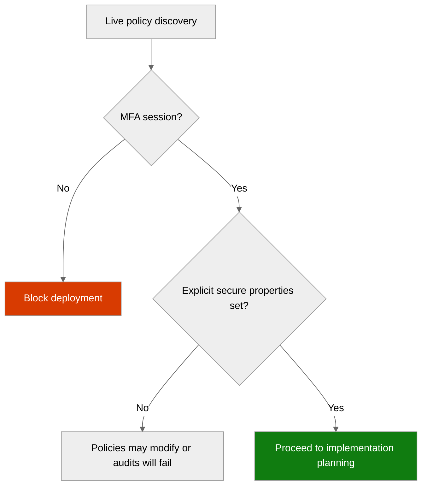

# 🛡️ Governance Constraints - contoso-service-hub-run-1


<details open>
<summary><strong>📑 Governance Contents</strong></summary>

- [🔍 Discovery Source](#-discovery-source)
- [📋 Azure Policy Compliance](#-azure-policy-compliance)
- [🔄 Plan Adaptations Based on Policies](#-plan-adaptations-based-on-policies)
- [🚫 Deployment Blockers](#-deployment-blockers)
- [🏷️ Required Tags](#-required-tags)
- [🔐 Security Policies](#-security-policies)
- [💰 Cost Policies](#-cost-policies)
- [🌐 Network Policies](#-network-policies)
- [References](#references)

</details>

> Generated by governance agent | 2026-03-16

| ⬅️ Previous                                        | 📑 Index            | Next ➡️                                                |
| -------------------------------------------------- | ------------------- | ------------------------------------------------------ |
| [03-des-cost-estimate.md](03-des-cost-estimate.md) | [README](README.md) | [04-implementation-plan.md](04-implementation-plan.md) |

This document captures the live Azure Policy constraints and effective tenant
governance that must be reflected in the Bicep implementation for Contoso
Service Hub.

## 🔍 Discovery Source

> [!IMPORTANT]
> Governance constraints in this artifact were discovered from live Azure REST
> API queries against the active tenant and subscription, with effective
> assignment cross-checking and policy definition inspection.

| Query              | Results                                                | Timestamp            |
| ------------------ | ------------------------------------------------------ | -------------------- |
| Policy Assignments | 20 total discovered; 14 relevant to this project       | 2026-03-16T11:38:43Z |
| Tag Policies       | 2 tag assignments plus 1 live key mismatch discovered  | 2026-03-16T11:38:43Z |
| Security Policies  | 9 root or subscription assignments relevant to Contoso | 2026-03-16T11:38:43Z |

**Discovery Method**: Azure REST API (`management.azure.com`) plus effective
policy assignment reconciliation
**Subscription**: `noalz` (`00858ffc-dded-4f0f-8bbf-e17fff0d47d9`)
**Scope**: Subscription plus inherited tenant-root management group policies

> [!NOTE]
> 6 additional assignments were excluded because they are scoped only to
> `rg-arcbox-swc01` and do not affect Contoso Service Hub resources.

### Policy Definition Analysis

> [!IMPORTANT]
> The table below reflects the actual evaluated behavior of the discovered
> definitions and assignment overrides, not just the policy display names.

| Policy Display Name                                                                | Assignment Scope | Effect | Actually Blocks or Modifies                                          | Evidence from policyRule.if / assignment override                                                                        | Bicep Property Path                | Required Value                                                                                                               |
| ---------------------------------------------------------------------------------- | ---------------- | ------ | -------------------------------------------------------------------- | ------------------------------------------------------------------------------------------------------------------------ | ---------------------------------- | ---------------------------------------------------------------------------------------------------------------------------- |
| Microsoft Azure Multi Factor Authentication Enforcement for Resource Write Actions | Management Group | Deny   | Any create or update operation made from a user session without MFA  | Assignment parameter `effect = Deny`                                                                                     | N/A                                | MFA-authenticated deployment session                                                                                         |
| JV-Enforce Resource Group Tags v3                                                  | Management Group | Audit  | Audits resource groups missing required governance tags              | Assignment override sets `policyEffect = Audit`; definition checks `tags['environment']` ... `tags['technical-contact']` | `tags`                             | `environment`, `owner`, `costcenter`, `application`, `workload`, `sla`, `backup-policy`, `maint-window`, `technical-contact` |
| JV - Inherit Multiple Tags from Resource Group                                     | Management Group | Modify | Adds or replaces missing child-resource tags from the resource group | Definition `then.effect = modify`; assignment parameters set tag names 1-9                                               | `tags`                             | Inherit 9 keys from RG, but assignment uses `tech-contact` instead of `technical-contact`                                    |
| Deny AKS deployment with agent pool count greater than 10                          | Management Group | Deny   | AKS clusters with more than 10 agent pool profiles                   | Definition counts `Microsoft.ContainerService/managedClusters/agentPoolProfiles[*]` and denies when `> 10`               | `properties.agentPoolProfiles`     | Maximum 10 agent pools                                                                                                       |
| SFI-ID4.2.1 Storage Accounts - Safe Secrets Standard                               | Management Group | Modify | Storage accounts that leave shared-key auth enabled                  | Definition targets `Microsoft.Storage/storageAccounts/allowSharedKeyAccess != false`                                     | `properties.allowSharedKeyAccess`  | `false`                                                                                                                      |
| Ensure secure access to storage account containers                                 | Management Group | Modify | Storage accounts with anonymous blob access enabled or unset         | Definition targets `Microsoft.Storage/storageAccounts/allowBlobPublicAccess` and replaces with `false`                   | `properties.allowBlobPublicAccess` | `false`                                                                                                                      |
| Block Azure RM Resource Creation                                                   | Management Group | Deny   | Classic resource types only                                          | Definition checks `type` for `Microsoft.Classic*` resources and denies                                                   | N/A                                | Do not use Classic resource providers                                                                                        |

**Analysis Notes**:

- The live tenant does **not** currently enforce an EU-region deny policy. GDPR
  and PCI are present as regulatory compliance audit assignments, so region
  restrictions must still be enforced in IaC and deployment defaults.
- The tag model has a real tenant inconsistency: the RG audit policy requires
  `technical-contact`, while the tag inheritance assignment propagates
  `tech-contact`. The implementation plan should emit both keys explicitly.
- No live deny policy was discovered for PostgreSQL Flexible Server, Azure
  Managed Redis, API Management Premium v2, Front Door Premium, Key Vault,
  Managed Disks, Entra External ID, or Log Analytics regional placement. Those
  remain architecture and compliance requirements, not tenant-enforced blockers.

## 📋 Azure Policy Compliance

| Category       | Constraint                                                                      | Implementation                                                               | Status |
| -------------- | ------------------------------------------------------------------------------- | ---------------------------------------------------------------------------- | ------ |
| Naming         | No tenant naming deny discovered                                                | Follow CAF naming from repository standards                                  | ✅     |
| Tagging        | Tenant expects 9 lowercase governance tags, plus inheritance is inconsistent    | Emit tenant-required lowercase tags and keep repo baseline tags where needed | ⚠️     |
| Security       | MFA for writes, storage local auth off, blob public access off, audit baselines | Set explicit secure properties in Bicep; do not rely on policy remediation   | ✅     |
| Data Residency | GDPR and PCI are audit initiatives, not region denies                           | Hard-code approved EU regions in parameters and deployment defaults          | ⚠️     |

> [!WARNING]
> The design is broadly compatible with the discovered tenant governance, but
> two implementation adaptations are mandatory: deploy through MFA-authenticated
> sessions and resolve the tag-key mismatch between RG audit and inheritance.

## 🔄 Plan Adaptations Based on Policies

> [!NOTE]
> This section records the concrete plan changes needed to keep the Contoso
> implementation compliant with live tenant governance.

### Architectural Changes

| Original Design                                             | Blocking Policy                                     | Effect         | Adaptation Applied                                                                                      |
| ----------------------------------------------------------- | --------------------------------------------------- | -------------- | ------------------------------------------------------------------------------------------------------- |
| 4 baseline tags from repo standards                         | JV-Enforce Resource Group Tags v3 + tag inheritance | Audit / Modify | Expand to tenant-required lowercase tags and explicitly add both `technical-contact` and `tech-contact` |
| AKS with system and user pools                              | MCAPSGov Deny Policies                              | Deny           | Keep AKS at 10 pools or fewer; current design stays far below the threshold                             |
| Shared storage account for Blob and Azure Files             | MCAPSGov Deploy and Modify Policies                 | Modify         | Set `allowSharedKeyAccess: false` and `allowBlobPublicAccess: false` explicitly                         |
| Management VM planned as a support/build node               | VM managed identity auto-remediation                | Modify         | Configure managed identity explicitly rather than depending on remediation                              |
| GDPR-driven EU placement assumed from architecture defaults | GDPR 2016/679 initiative is audit only              | Audit          | Enforce `swedencentral`, `westeurope`, and `germanywestcentral` in IaC parameters                       |

### Auto-Applied Resources

✅ No additional project resources are guaranteed to be auto-deployed for the
Contoso service set.

The tenant does have Defender and provisioning assignments at subscription scope,
but they operate as platform security enablement rather than as application
infrastructure the Bicep plan can safely assume.

### Auto-Modified Configurations

| Policy                                                                                                                | Effect | Auto-Applied Change                                                                      |
| --------------------------------------------------------------------------------------------------------------------- | ------ | ---------------------------------------------------------------------------------------- |
| JV - Inherit Multiple Tags from Resource Group                                                                        | Modify | Missing child-resource tags are copied from the resource group                           |
| SFI-ID4.2.1 Storage Accounts - Safe Secrets Standard                                                                  | Modify | `allowSharedKeyAccess` is changed to `false` unless excluded by `SecurityControl=Ignore` |
| Ensure secure access to storage account containers                                                                    | Modify | `allowBlobPublicAccess` is changed to `false` on non-FileStorage accounts                |
| Add system-assigned managed identity to enable Guest Configuration assignments on virtual machines with no identities | Modify | System-assigned identity is added to qualifying Windows client VMs                       |

## 🚫 Deployment Blockers

> [!CAUTION]
> One live operational blocker applies to the current tenant. The remaining
> discovered deny policies are already satisfied by the current architecture.

### Microsoft Azure Multi Factor Authentication Enforcement for Resource Write Actions

- **Policy ID**: `54f51f64-eaa5-44cf-8674-830bcfd14d21`
- **Effect**: Deny
- **Scope**: management group
- **Enforcement Mode**: Default
- **Impact**: Resource creation and updates fail when the deployer is not using
  an MFA-authenticated user session.
- **Assessment Date**: 2026-03-16

**Resolution Options**:

1. **Use an MFA-authenticated operator session**:
   - **Justification**: Proven compatible with the live assignment
   - **Duration**: immediate and ongoing
   - **Risk Level**: low
   - **Approval Process**: sign in with MFA before running subscription writes

2. **Validate a federated CI/CD identity path**:
   - **Justification**: only if Contoso needs unattended deployment
   - **Duration**: after validation
   - **Risk Level**: medium
   - **Approval Process**: test workload identity writes against this tenant before relying on automation

**Status**: ⚠️ **DEPLOYMENT CANNOT PROCEED WITHOUT MFA-COMPATIBLE EXECUTION**

❌ Any deployment attempt from a non-MFA user session should be treated as a hard failure condition.

**Next Steps**:

- [ ] Confirm deployment will run from an MFA-authenticated session
- [ ] Or validate a federated identity exemption path before automation

✅ No current architecture blocker was found for AKS pool count, VM SKU choice,
storage secure-transfer properties, or classic resource usage.

## 🏷️ Required Tags

All resource groups should include the live tenant governance tags plus the repo
baseline tags used elsewhere in this project.

```bicep
var rgTags = {
  Environment: environment
  ManagedBy: 'Bicep'
  Project: projectName
  Owner: owner
  environment: environment
  owner: owner
  costcenter: costCenter
  application: applicationName
  workload: workloadName
  sla: slaTarget
  'backup-policy': backupPolicy
  'maint-window': maintenanceWindow
  'technical-contact': technicalContact
  'tech-contact': technicalContact
}
```

> [!IMPORTANT]
> The duplicate `technical-contact` and `tech-contact` keys are intentional.
> The discovered tenant policies are inconsistent, so the implementation should
> emit both keys until governance is corrected upstream.

## 🔐 Security Policies

| Policy           | Requirement                                                                                                |
| ---------------- | ---------------------------------------------------------------------------------------------------------- |
| MFA for writes   | All deployment writes must be executed through MFA-compatible identity flow                                |
| TLS Version      | Enforce TLS 1.2+ across APIM, Front Door, PostgreSQL, Redis, Storage, Key Vault, and application endpoints |
| Public Access    | Explicitly disable storage blob public access and disable shared-key auth on the storage account           |
| Managed Identity | Configure managed identity directly on the management VM and use AKS workload identity                     |
| Key Vault        | No live deny discovered; keep soft delete, purge protection, private endpoint, and RBAC in Bicep           |

## 💰 Cost Policies

| Policy              | Constraint                                                               |
| ------------------- | ------------------------------------------------------------------------ |
| AKS pool limits     | MCAPSGov denies AKS clusters with more than 10 agent pools               |
| VM SKU restrictions | MCAPSGov denies H, M, and N-series VM SKUs; planned D8s v5 remains valid |
| Budget              | No live budget deny or cap policy discovered in this subscription        |

## 🌐 Network Policies

| Policy            | Constraint                                                                                                                                                                      |
| ----------------- | ------------------------------------------------------------------------------------------------------------------------------------------------------------------------------- |
| Private Endpoints | Azure Security Baseline audits private-link usage for storage and Azure SQL; implement private data plane explicitly                                                            |
| VNet Integration  | Azure Security Baseline audits APIM virtual network usage and NSGs on subnets                                                                                                   |
| Public Endpoints  | No live deny discovered for PostgreSQL, Redis, Key Vault, or Front Door public exposure, so IaC must enforce private connectivity and public network disablement where required |

---

## References



| Topic                    | Link                                                                                                |
| ------------------------ | --------------------------------------------------------------------------------------------------- |
| Azure Policy             | [Overview](https://learn.microsoft.com/azure/governance/policy/overview)                            |
| Azure Security Baseline  | [Security controls by service](https://learn.microsoft.com/security/benchmark/azure/overview)       |
| Azure Policy for Storage | [Secure blob access](https://learn.microsoft.com/azure/storage/blobs/anonymous-read-access-prevent) |
| AKS governance           | [Azure Policy built-ins for AKS](https://learn.microsoft.com/azure/aks/policy-reference)            |
| GDPR on Azure            | [Microsoft compliance offerings](https://learn.microsoft.com/compliance/regulatory/offering-gdpr)   |

---

_Governance constraints discovered from live Azure REST API policy assignments and definition analysis._
