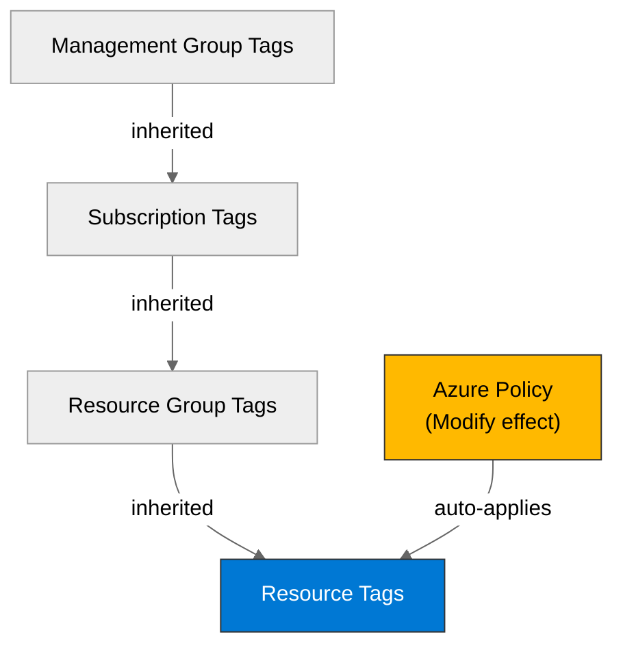

# 🛡️ Governance Constraints - Contoso Service Hub


<details open>
<summary><strong>📑 Governance Contents</strong></summary>

- [🔍 Discovery Source](#-discovery-source)
- [📋 Azure Policy Compliance](#-azure-policy-compliance)
- [🔄 Plan Adaptations Based on Policies](#-plan-adaptations-based-on-policies)
- [🚫 Deployment Blockers](#-deployment-blockers)
- [🏷️ Required Tags](#-required-tags)
- [🔐 Security Policies](#-security-policies)
- [💰 Cost Policies](#-cost-policies)
- [🌐 Network Policies](#-network-policies)
- [References](#references)

</details>

> Generated by 04g-Governance agent | 2026-04-01

| ⬅️ Previous                                        | 📑 Index            | Next ➡️                                                |
| -------------------------------------------------- | ------------------- | ------------------------------------------------------ |
| [03-des-cost-estimate.md](03-des-cost-estimate.md) | [README](README.md) | [04-implementation-plan.md](04-implementation-plan.md) |

This document captures the governance constraints and Azure Policy requirements
that must be addressed in the Bicep implementation.

## 🔍 Discovery Source

> [!IMPORTANT]
> This artifact is an automated E2E template baseline. Live Azure Policy discovery was not possible because Azure credentials were unavailable in this environment.

| Query              | Results                                                | Timestamp            |
| ------------------ | ------------------------------------------------------ | -------------------- |
| REST API Total     | 0 live assignments queried in this credentialless run  | 2026-04-01T03:05:00Z |
| Template Baseline  | 23 GDPR-focused controls modelled for planned services | 2026-04-01T03:05:00Z |
| Deny-effect        | 18 template blockers                                   | 2026-04-01T03:05:00Z |
| Tag Policies       | 4 required tags + 1 inheritance policy                 | 2026-04-01T03:05:00Z |
| Security Policies  | 18 service-level security constraints                  | 2026-04-01T03:05:00Z |

**Discovery Method**: Template baseline for automated E2E run (no ARM/REST API access)
**Subscription**: credentialless-e2e-template
**Scope**: Planned resource types only (AKS, PostgreSQL Flexible Server, Azure Managed Redis, Storage, API Management, Application Gateway/WAF, Key Vault, Virtual Machines, networking, Entra External ID)

- ✅ Template baseline generated for all planned services in the architecture assessment.
- ❌ Live Azure Policy discovery did not run in this environment because no Azure credentials were available.

> [!WARNING]
> This file is suitable for planning and downstream code scaffolding in the E2E run, but it is not a substitute for live policy discovery. Production deployment remains blocked until effective Azure Policy assignments are queried from the target tenant and subscription.

### Policy Definition Analysis

> [!IMPORTANT]
> The rows below document the template controls that must be translated into IaC. They are modeled from common Azure Policy enforcement patterns and the project's GDPR/EU data boundary requirements.

| Policy Display Name | Assignment Scope | Effect | Actually Blocks | Evidence from policyRule.if | Bicep Property Path | Required Value |
| ------------------- | ---------------- | ------ | --------------- | --------------------------- | ------------------- | -------------- |
| Allow only EU locations | Subscription / Management Group | Deny | Any planned resource outside `swedencentral`, `westeurope`, `germanywestcentral`, `northeurope` | `field: "location", notIn: [allowed regions]` | `genericResource::location` | `swedencentral|westeurope|germanywestcentral|northeurope` |
| Require mandatory governance tags | Subscription | Deny | Resources missing `Environment`, `ManagedBy`, `Project`, or `Owner` | `field: "tags['Environment']"`, `exists: false` and equivalent checks for other tags | `genericResource::tags` | `Environment|ManagedBy|Project|Owner present` |
| Inherit tags from resource group | Subscription | Modify | Untagged child resources drift from required tag set | `addOrReplace` operations targeting `tags` from RG scope | `genericResource::tags` | `Inherit required tags from RG` |
| Enforce HTTPS only on Storage | Subscription | Deny | Storage accounts with HTTP allowed | `field: "Microsoft.Storage/storageAccounts/supportsHttpsTrafficOnly", equals: false` | `storageAccounts::properties.supportsHttpsTrafficOnly` | `true` |
| Enforce TLS 1.2 on Storage | Subscription | Deny | Storage accounts below TLS 1.2 | `field: "Microsoft.Storage/storageAccounts/minimumTlsVersion", notEquals: "TLS1_2"` | `storageAccounts::properties.minimumTlsVersion` | `TLS1_2` |
| Disable public blob access | Subscription | Deny | Storage accounts permitting anonymous blob/container access | `field: "Microsoft.Storage/storageAccounts/allowBlobPublicAccess", equals: true` | `storageAccounts::properties.allowBlobPublicAccess` | `false` |
| Disable public network access on Storage | Subscription | Deny | Storage accounts reachable from public internet | `field: "Microsoft.Storage/storageAccounts/publicNetworkAccess", notEquals: "Disabled"` | `storageAccounts::properties.publicNetworkAccess` | `Disabled` |
| Require Key Vault purge protection | Subscription | Deny | Key Vaults without purge protection | `field: "Microsoft.KeyVault/vaults/enablePurgeProtection", notEquals: true` | `vaults::properties.enablePurgeProtection` | `true` |
| Require Key Vault soft delete retention | Subscription | Deny | Key Vaults without soft delete retention aligned to recovery policy | `field: "Microsoft.KeyVault/vaults/softDeleteRetentionInDays", less: 90` | `vaults::properties.softDeleteRetentionInDays` | `90` |
| Disable public network access on Key Vault | Subscription | Deny | Key Vaults exposed publicly | `field: "Microsoft.KeyVault/vaults/publicNetworkAccess", notEquals: "Disabled"` | `vaults::properties.publicNetworkAccess` | `Disabled` |
| Disable public network access on PostgreSQL | Subscription | Deny | PostgreSQL Flexible Servers exposed publicly | `field: "Microsoft.DBforPostgreSQL/flexibleServers/network.publicNetworkAccess", notEquals: "Disabled"` | `flexibleServers::properties.network.publicNetworkAccess` | `Disabled` |
| Enforce Microsoft Entra auth only on PostgreSQL | Subscription | Deny | PostgreSQL Flexible Servers with password auth enabled | `field: "Microsoft.DBforPostgreSQL/flexibleServers/authConfig.passwordAuth", notEquals: "Disabled"` | `flexibleServers::properties.authConfig.passwordAuth` | `Disabled` |
| Enforce TLS 1.2 on PostgreSQL | Subscription | Deny | PostgreSQL Flexible Servers below TLS 1.2 | `field: "Microsoft.DBforPostgreSQL/flexibleServers/minimalTlsVersion", notEquals: "TLS1_2"` | `flexibleServers::properties.minimalTlsVersion` | `TLS1_2` |
| Disable public network access on Azure Managed Redis | Subscription | Deny | Redis caches reachable from public internet | `field: "Microsoft.Cache/redisEnterprise/publicNetworkAccess", notEquals: "Disabled"` | `redisEnterprise::properties.publicNetworkAccess` | `Disabled` |
| Enforce TLS 1.2 on Azure Managed Redis | Subscription | Deny | Redis endpoints allowing legacy TLS | `field: "Microsoft.Cache/redisEnterprise/minimumTlsVersion", notEquals: "1.2"` | `redisEnterprise::properties.minimumTlsVersion` | `1.2` |
| Restrict AKS API server exposure | Subscription | Deny | AKS clusters without private API or explicit authorized IP ranges | `field: "Microsoft.ContainerService/managedClusters/apiServerAccessProfile.authorizedIPRanges", exists: false` | `managedClusters::properties.apiServerAccessProfile.authorizedIPRanges` | `Corp egress CIDRs only or private cluster` |
| Enforce AKS Azure Policy add-on | Subscription | DeployIfNotExists | AKS clusters without policy add-on enabled | `field: "Microsoft.ContainerService/managedClusters/addonProfiles.azurepolicy.enabled", notEquals: true` | `managedClusters::properties.addonProfiles.azurepolicy.enabled` | `true` |
| Enforce AKS network policy | Subscription | Deny | AKS clusters without `azure` or `calico` network policy | `field: "Microsoft.ContainerService/managedClusters/networkProfile.networkPolicy", exists: false` | `managedClusters::properties.networkProfile.networkPolicy` | `azure|calico` |
| Enforce managed disk encryption | Subscription | Deny | VM disks without platform or customer-managed encryption at rest | `field: "Microsoft.Compute/disks/encryption.type", exists: false` | `managedDisks::properties.encryption.type` | `EncryptionAtRestWithPlatformKey or EncryptionAtRestWithCustomerKey` |
| Require regional WAF on public ingress | Subscription | Deny | Public ingress without Application Gateway WAF v2 in prevention mode | `field: "Microsoft.Network/applicationGateways/webApplicationFirewallConfiguration.enabled", notEquals: true` and `firewallMode`, notEquals: `Prevention` | `applicationGateways::properties.webApplicationFirewallConfiguration` | `Enabled;Prevention` |

**Analysis Notes**:

- Front Door remains a governance exception because global edge processing conflicts with the EU-only baseline captured in Step 2.
- Entra External ID MFA restrictions are included as a manual governance control because they are not reliably enforceable through Azure Policy on ARM resources.
- APIM hardening and service-to-service managed identity usage are included as compliance expectations even where enforcement is likely `Audit` rather than `Deny`.

## 📋 Azure Policy Compliance

| Category | Constraint | Implementation | Status |
| -------- | ---------- | -------------- | ------ |
| Naming | CAF naming with EU region defaults and no non-EU regional drift | Keep all planned resources in `swedencentral` unless a documented exception uses another allowed EU region | ⚠️ |
| Tagging | `Environment`, `ManagedBy`, `Project`, and `Owner` required on every resource | Set tags in every Bicep module and allow RG inheritance modify policies to fill gaps | ⚠️ |
| Security | 18 template blockers across storage, database, cache, ingress, AKS, and VM encryption | Explicitly set secure properties in Bicep instead of relying on platform defaults | ⚠️ |
| Data Residency | EU-only regional baseline with Front Door excluded unless written exception is approved | Use Application Gateway/WAF for regional ingress, private endpoints for data services, and EU-sovereign Entra MFA methods | ⚠️ |

> [!WARNING]
> All rows remain template-derived until validated against the effective Azure Policy assignments in the target environment.

## 🔄 Plan Adaptations Based on Policies

> [!NOTE]
> This section documents how the implementation plan must adapt to the governance template rather than the original unconstrained architecture.

### Architectural Changes

| Original Design | Blocking Policy | Effect | Adaptation Applied |
| --------------- | --------------- | ------ | ------------------ |
| Azure Front Door as public ingress | Allow only EU locations and regional WAF baseline | Deny / manual compliance gate | Replace the compliant baseline with Application Gateway WAF v2 in `swedencentral`; treat Front Door as an exception path requiring written approval |
| Public endpoints on data services | Disable public network access on Storage, PostgreSQL, Redis, and Key Vault | Deny | Use private endpoints, private DNS zones, and VNet-integrated access only |
| AKS public API server by default | Restrict AKS API server exposure | Deny | Use a private cluster where possible, otherwise restrict authorized IP ranges to corporate egress CIDRs |
| PostgreSQL mixed authentication | Enforce Microsoft Entra auth only on PostgreSQL | Deny | Disable password auth and plan for Entra administrator bootstrap during deployment |

### Auto-Applied Resources

| Policy | Effect | Auto-Applied Resource |
| ------ | ------ | --------------------- |
| Enforce AKS Azure Policy add-on | DeployIfNotExists | Azure Policy add-on on the managed cluster |

### Auto-Modified Configurations

| Policy | Effect | Auto-Applied Change |
| ------ | ------ | ------------------- |
| Inherit tags from resource group | Modify | Required tags inherited from the resource group when omitted by a child resource |

## 🚫 Deployment Blockers

> [!CAUTION]
> This automated E2E baseline models 18 deny-style blockers. Even after satisfying them in code, live policy discovery is still required before production deployment.

### Allow Only EU Locations

- **Policy ID**: `template://governance/allowed-eu-locations`
- **Effect**: Deny
- **Scope**: Management Group / Subscription (template baseline)
- **Enforcement Mode**: Default
- **Impact**: Blocks resource deployment in any region outside `swedencentral`, `westeurope`, `germanywestcentral`, or `northeurope`
- **Assessment Date**: 2026-04-01

**Resolution Options**:

1. **Request Policy Exemption**:
   - **Justification**: Only for services that cannot remain within the approved EU regional set.
   - **Duration**: Temporary.
   - **Risk Level**: High.
   - **Approval Process**: Written business and compliance approval plus updated ADR.

2. **Alternative Architecture**:
   - Keep all regional resources in `swedencentral` and use `westeurope`, `germanywestcentral`, or `northeurope` only for approved failover or service-availability exceptions.
   - **Trade-offs**: Lower service choice flexibility, but aligns with GDPR/EU residency requirements.

**Status**: ⚠️ **DEPLOYMENT CANNOT PROCEED WITHOUT RESOLUTION**

**Next Steps**:

- [ ] Confirm allowed region set with tenant governance owners
- [ ] Remove any non-EU service choices from the plan
- [ ] Re-run live governance discovery before deployment

### Public Network Access Disabled For Data Services

- **Policy ID**: `template://governance/private-data-plane`
- **Effect**: Deny
- **Scope**: Subscription (template baseline)
- **Enforcement Mode**: Default
- **Impact**: Blocks Storage, Key Vault, PostgreSQL Flexible Server, and Azure Managed Redis if public endpoints remain enabled
- **Assessment Date**: 2026-04-01

**Resolution Options**:

1. **Request Policy Exemption**:
   - **Justification**: Short-lived migration or operational break-glass scenario only.
   - **Duration**: Temporary.
   - **Risk Level**: High.
   - **Approval Process**: Security review plus approved rollback plan.

2. **Alternative Architecture**:
   - Use private endpoints, private DNS zones, and VNet-integrated consumers only.
   - **Trade-offs**: Higher network complexity and Private Link cost, but materially lower data exposure risk.

**Status**: ⚠️ **DEPLOYMENT CANNOT PROCEED WITHOUT RESOLUTION**

**Next Steps**:

- [ ] Add private endpoints for Storage, Key Vault, PostgreSQL, and Redis
- [ ] Disable `publicNetworkAccess` on all data-plane services
- [ ] Validate DNS resolution and AKS egress paths

### Microsoft Entra Authentication Required For PostgreSQL

- **Policy ID**: `template://governance/postgresql-entra-only`
- **Effect**: Deny
- **Scope**: Subscription (template baseline)
- **Enforcement Mode**: Default
- **Impact**: Blocks PostgreSQL Flexible Server if password authentication is enabled or Microsoft Entra administrator bootstrap is omitted
- **Assessment Date**: 2026-04-01

**Resolution Options**:

1. **Request Policy Exemption**:
   - **Justification**: Transitional migration phase only.
   - **Duration**: Temporary.
   - **Risk Level**: High.
   - **Approval Process**: Security exception with explicit expiry.

2. **Alternative Architecture**:
   - Bootstrap a Microsoft Entra administrator, disable password auth, and use managed identity or workload identity for application connectivity.
   - **Trade-offs**: Higher deployment orchestration complexity, but avoids secrets and aligns with the project security baseline.

**Status**: ⚠️ **DEPLOYMENT CANNOT PROCEED WITHOUT RESOLUTION**

**Next Steps**:

- [ ] Add Microsoft Entra administrator bootstrap to the deployment plan
- [ ] Disable PostgreSQL password authentication
- [ ] Ensure application connectivity uses managed identity or federated identity

### Regional WAF Baseline Required

- **Policy ID**: `template://governance/appgw-waf-regional`
- **Effect**: Deny
- **Scope**: Subscription (template baseline)
- **Enforcement Mode**: Default
- **Impact**: Blocks a public ingress design that does not use Application Gateway WAF v2 in prevention mode for the compliant baseline
- **Assessment Date**: 2026-04-01

**Resolution Options**:

1. **Request Policy Exemption**:
   - **Justification**: Retaining Front Door for global edge caching despite EU data-boundary concerns.
   - **Duration**: Temporary or permanent, depending on Contoso approval.
   - **Risk Level**: High.
   - **Approval Process**: Written Contoso approval and documented GDPR/legal review.

2. **Alternative Architecture**:
   - Use Application Gateway WAF v2 in `swedencentral` with prevention mode enabled, and treat CDN/global edge services as out-of-scope unless explicitly approved.
   - **Trade-offs**: Loses Front Door CDN/global routing benefits, but keeps ingress processing regional.

**Status**: ⚠️ **DEPLOYMENT CANNOT PROCEED WITHOUT RESOLUTION**

**Next Steps**:

- [ ] Select Application Gateway WAF v2 as the compliant default ingress
- [ ] Document any Front Door exception separately in an ADR
- [ ] Reconcile ingress choice in Step 4 implementation planning

## 🏷️ Required Tags

All resources must include the following tags:

```bicep
tags: {
  Environment: environment
  Project: projectName
  ManagedBy: 'Bicep'
  Owner: owner
}
```



Required tag keys for this template baseline:

- `Environment`
- `ManagedBy`
- `Project`
- `Owner`

## 🔐 Security Policies

| Policy | Requirement |
| ------ | ----------- |
| HTTPS Only | Require HTTPS-only traffic on Storage and expose application ingress over HTTPS only |
| TLS Version | Enforce TLS 1.2 minimum on Storage, PostgreSQL Flexible Server, Redis, and public ingress |
| Public Access | Disable public network access on Storage, Key Vault, PostgreSQL Flexible Server, and Azure Managed Redis |
| Managed Identity | Use managed identity or workload identity for AKS, APIM, and VM access to downstream services; avoid shared keys and connection strings |
| Key Vault | Enable purge protection, retain soft delete for at least 90 days, and keep Key Vault on private access only |
| Disk Encryption | Enforce managed disk encryption at rest for VM disks and keep encryption enabled on all data services |
| Database Auth | Disable PostgreSQL password auth and plan Microsoft Entra-only administrative and application access |
| AKS | Restrict API server exposure, enable Azure Policy add-on, and set an explicit network policy |
| Application Gateway WAF | Use Application Gateway WAF v2 with WAF enabled in prevention mode as the compliant public ingress baseline |
| Entra External ID | Restrict MFA to FIDO2/passkey or TOTP-only unless an explicit sovereignty exception is approved |

## 💰 Cost Policies

| Policy | Constraint |
| ------ | ---------- |
| Budget | No live cost-governance policies were discovered; use the architecture estimate as the working budget baseline and treat material deviations above the approved range as a planning gate |
| SKU Restrictions | Keep APIM on Standard v2 unless zone redundancy is explicitly required, keep Redis Enterprise E100 as the approved 128 GB baseline unless Step 4 reopens the cost trade-off, and use Application Gateway WAF v2 for compliant ingress |
| Reserved Capacity | Do not commit to reservations or savings plans until live utilization data exists; optimize after the first validated production sizing pass |

## 🌐 Network Policies

| Policy | Constraint |
| ------ | ---------- |
| Private Endpoints | Mandatory for Storage, Key Vault, PostgreSQL Flexible Server, and Azure Managed Redis |
| VNet Integration | AKS, Application Gateway, private DNS zones, and backend access paths must be designed as a VNet-contained topology |
| Public Endpoints | Public exposure is limited to the regional WAF ingress layer; data-plane services must not expose public endpoints |
| Ingress | Application Gateway WAF v2 in prevention mode is the compliant public ingress baseline |
| Control Plane Access | AKS API server must be private or restricted to approved corporate egress CIDRs |

---

## References

| Topic | Link |
| ----- | ---- |
| Azure Policy | [Overview](https://learn.microsoft.com/azure/governance/policy/overview) |
| Azure Resource Graph | [ARG Overview](https://learn.microsoft.com/azure/governance/resource-graph/overview) |
| Application Gateway WAF | [WAF Overview](https://learn.microsoft.com/azure/web-application-firewall/ag/ag-overview) |
| AKS Azure Policy | [Azure Policy for AKS](https://learn.microsoft.com/azure/aks/use-azure-policy) |
| PostgreSQL Flexible Server Authentication | [Microsoft Entra Authentication](https://learn.microsoft.com/azure/postgresql/flexible-server/security-entra-configure) |
| Key Vault Network Security | [Network Security](https://learn.microsoft.com/azure/key-vault/general/network-security) |
| Tag Governance | [Tagging Strategy](https://learn.microsoft.com/azure/cloud-adoption-framework/ready/azure-best-practices/resource-tagging) |

---

_Governance constraints captured as an unverified template baseline for this automated E2E run._
_Live Azure Policy discovery is still required before deployment._

---

<div align="center">

| ⬅️ [03-des-cost-estimate.md](03-des-cost-estimate.md) | 🏠 [Project Index](README.md) | ➡️ [04-implementation-plan.md](04-implementation-plan.md) |
| ----------------------------------------------------- | ----------------------------- | --------------------------------------------------------- |

</div>