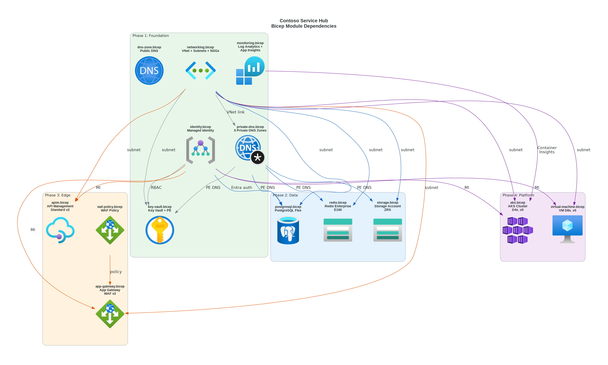
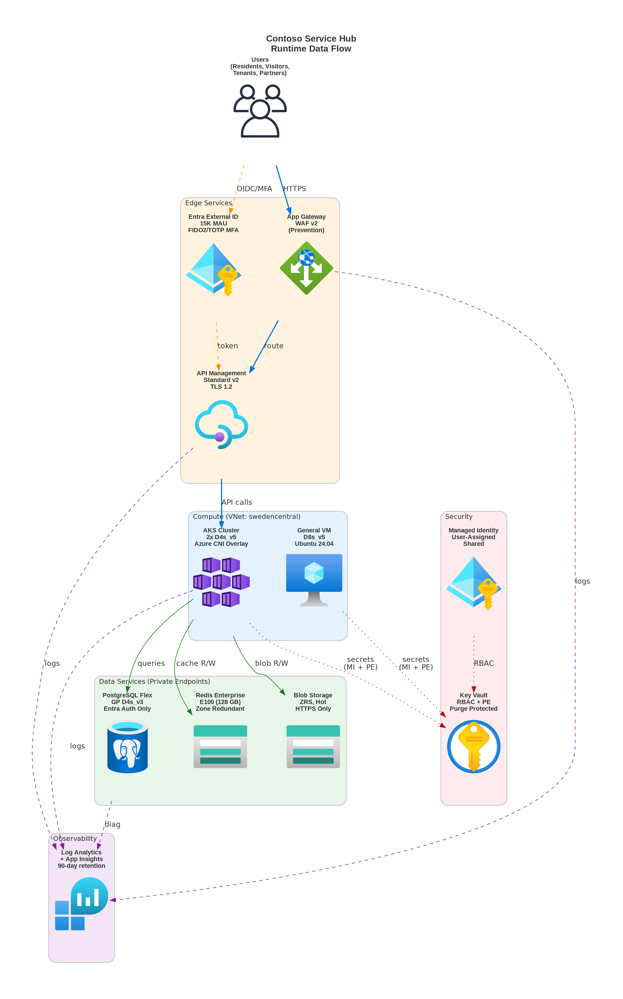

# 📀 Step 4: Implementation Plan - Contoso Service Hub


<details open>
<summary><strong>📑 Implementation Contents</strong></summary>

- [📋 Overview](#-overview)
- [📦 Resource Inventory](#-resource-inventory)
- [🗂️ Module Structure](#-module-structure)
- [🔨 Implementation Tasks](#-implementation-tasks)
- [🚀 Deployment Phases](#-deployment-phases)
- [🔗 Dependency Graph](#-dependency-graph)
- [🔄 Runtime Flow Diagram](#-runtime-flow-diagram)
- [🏷️ Naming Conventions](#-naming-conventions)
- [🔐 Security Configuration](#-security-configuration)
- [⏱️ Estimated Implementation Time](#-estimated-implementation-time)
- [🔒 Approval Gate](#-approval-gate)
- [References](#references)

</details>

> Generated by IaC Planner agent | 2026-04-01
>
> **Source**: Contoso Service Hub — Architecture Assessment (02-architecture-assessment.md)
>
> `iac_tool: Bicep` | `region: swedencentral` | `environments: dev, staging, prod`

| ⬅️ Previous                                                  | 📑 Index            | Next ➡️                                        |
| ------------------------------------------------------------ | ------------------- | ---------------------------------------------- |
| [04-governance-constraints.md](04-governance-constraints.md) | [README](README.md) | [04-preflight-check.md](04-preflight-check.md) |

---

## 📋 Overview

Contoso Service Hub is a greenfield full-stack digital platform for EU real estate and lifestyle services. This implementation plan defines the Bicep module structure, resource configuration, deployment phasing, and governance compliance for provisioning across 3 environments (Dev, Staging, Production) in `swedencentral`.

| Parameter                  | Value                                                                          |
| -------------------------- | ------------------------------------------------------------------------------ |
| **IaC Tool**               | Bicep (Azure Verified Modules)                                                 |
| **Primary Region**         | `swedencentral`                                                                |
| **Environments**           | Dev, Staging, Production                                                       |
| **Total Azure Resources**  | 17 resource types (across 15 Bicep modules)                                    |
| **AVM Coverage**           | 100% — all resources use Azure Verified Modules                                |
| **Deployment Strategy**    | Phased (4 phases with approval gates)                                          |
| **Governance Policies**    | 23 policies (16 Deny, 3 Audit, 2 Modify, 1 DeployIfNotExists, 1 ManualControl) |
| **Estimated Monthly Cost** | ~$10,085 / ~€9,338 (all environments)                                          |

### Key Architecture Decisions Applied

- **Application Gateway** replaces Front Door (EU Data Boundary compliance per ADR-003)
- **AKS** as primary container platform (RFQ mandate per ADR-001)
- **Azure Managed Redis E100** for 128 GB native cache (per ADR-002)
- **Entra External ID** with FIDO2/TOTP-only MFA (EU sovereignty per ADR-003)
- **ZRS storage** for EU-only data residency (no GRS cross-region replication)

---

## 📦 Resource Inventory

| Resource                       | Type                                                                 | SKU                 | AVM Module                                                                      | Version  | Dependencies                  | Phase |
| ------------------------------ | -------------------------------------------------------------------- | ------------------- | ------------------------------------------------------------------------------- | -------- | ----------------------------- | ----- |
| Log Analytics Workspace        | `Microsoft.OperationalInsights/workspaces`                           | PerGB2018           | `br/public:avm/res/operational-insights/workspace`                              | `0.15.0` | —                             | 1     |
| Application Insights           | `Microsoft.Insights/components`                                      | web                 | `br/public:avm/res/insights/component`                                          | `0.7.1`  | Log Analytics                 | 1     |
| User-Assigned Managed Identity | `Microsoft.ManagedIdentity/userAssignedIdentities`                   | —                   | `br/public:avm/res/managed-identity/user-assigned-identity`                     | `0.5.0`  | —                             | 1     |
| Key Vault                      | `Microsoft.KeyVault/vaults`                                          | Standard            | `br/public:avm/res/key-vault/vault`                                             | `0.13.3` | VNet, Identity, Private DNS   | 1     |
| Virtual Network                | `Microsoft.Network/virtualNetworks`                                  | Standard            | `br/public:avm/res/network/virtual-network`                                     | `0.7.2`  | NSG                           | 1     |
| Network Security Groups        | `Microsoft.Network/networkSecurityGroups`                            | Standard            | `br/public:avm/res/network/network-security-group`                              | `0.5.3`  | —                             | 1     |
| Private DNS Zones              | `Microsoft.Network/privateDnsZones`                                  | —                   | `br/public:avm/res/network/private-dns-zone`                                    | `0.8.1`  | VNet                          | 1     |
| Budget                         | `Microsoft.Consumption/budgets`                                      | —                   | `br/public:avm/res/consumption/budget/rg-scope`                                 | `0.1.0`  | —                             | 1     |
| PostgreSQL Flexible Server     | `Microsoft.DBforPostgreSQL/flexibleServers`                          | GP_Standard_D4s_v3  | `br/public:avm/res/db-for-postgre-sql/flexible-server`                          | `0.15.2` | VNet, Private DNS, Identity   | 2     |
| Azure Managed Redis            | `Microsoft.Cache/redisEnterprise`                                    | Enterprise_E100     | `br/public:avm/res/cache/redis-enterprise`                                      | `0.5.0`  | VNet, Private DNS             | 2     |
| Storage Account                | `Microsoft.Storage/storageAccounts`                                  | StorageV2, Hot, ZRS | `br/public:avm/res/storage/storage-account`                                     | `0.32.0` | VNet, Private DNS             | 2     |
| WAF Policy                     | `Microsoft.Network/ApplicationGatewayWebApplicationFirewallPolicies` | WAF_v2              | `br/public:avm/res/network/application-gateway-web-application-firewall-policy` | `0.3.0`  | —                             | 3     |
| Application Gateway            | `Microsoft.Network/applicationGateways`                              | WAF_v2              | `br/public:avm/res/network/application-gateway`                                 | `0.9.0`  | VNet, WAF Policy, Identity    | 3     |
| API Management                 | `Microsoft.ApiManagement/service`                                    | StandardV2          | `br/public:avm/res/api-management/service`                                      | `0.14.1` | VNet, Identity                | 3     |
| AKS Managed Cluster            | `Microsoft.ContainerService/managedClusters`                         | Standard, D4s_v5    | `br/public:avm/res/container-service/managed-cluster`                           | `0.13.0` | VNet, Identity, Log Analytics | 4     |
| Virtual Machine                | `Microsoft.Compute/virtualMachines`                                  | Standard_D8s_v5     | `br/public:avm/res/compute/virtual-machine`                                     | `0.22.0` | VNet, Identity                | 4     |
| DNS Zone                       | `Microsoft.Network/dnsZones`                                         | Standard            | `br/public:avm/res/network/dns-zone`                                            | `0.5.4`  | —                             | 1     |

> **AVM Coverage**: ✅ 100% — All 17 resource types use Azure Verified Modules from `br/public:avm/res/`.

---

## 🗂️ Module Structure

```text
infra/bicep/contoso-service-hub/
├── main.bicep                          # Orchestrator — calls all modules
├── main.bicepparam                     # Parameter file (environment-specific values)
├── modules/
│   ├── monitoring.bicep                # Log Analytics + Application Insights
│   ├── identity.bicep                  # User-Assigned Managed Identity
│   ├── networking.bicep                # VNet + Subnets + NSGs
│   ├── private-dns.bicep               # Private DNS Zones + VNet links
│   ├── key-vault.bicep                 # Key Vault + Private Endpoint
│   ├── budget.bicep                    # Consumption Budget with alerts
│   ├── dns-zone.bicep                  # Public DNS Zone
│   ├── postgresql.bicep                # PostgreSQL Flexible Server + PE
│   ├── redis.bicep                     # Azure Managed Redis Enterprise + PE
│   ├── storage.bicep                   # Storage Account + Blob/Files + PE
│   ├── waf-policy.bicep                # WAF Policy (OWASP 3.2)
│   ├── app-gateway.bicep               # Application Gateway WAF v2
│   ├── apim.bicep                      # API Management Standard v2
│   ├── aks.bicep                       # AKS Managed Cluster
│   └── virtual-machine.bicep           # General purpose VM
└── deploy.ps1                          # Deployment script with what-if
```

| Module                | AVM Source                                                                                       | Version            | Purpose                                                                    |
| --------------------- | ------------------------------------------------------------------------------------------------ | ------------------ | -------------------------------------------------------------------------- |
| monitoring.bicep      | `br/public:avm/res/operational-insights/workspace` + `br/public:avm/res/insights/component`      | `0.15.0` / `0.7.1` | Centralised observability — Log Analytics workspace + Application Insights |
| identity.bicep        | `br/public:avm/res/managed-identity/user-assigned-identity`                                      | `0.5.0`            | Shared managed identity for service-to-service auth                        |
| networking.bicep      | `br/public:avm/res/network/virtual-network` + `br/public:avm/res/network/network-security-group` | `0.7.2` / `0.5.3`  | VNet (/16), subnets (/24), NSGs with deny-all defaults                     |
| private-dns.bicep     | `br/public:avm/res/network/private-dns-zone`                                                     | `0.8.1`            | Private DNS zones for PostgreSQL, Redis, Key Vault, Storage, AKS API       |
| key-vault.bicep       | `br/public:avm/res/key-vault/vault`                                                              | `0.13.3`           | Secrets, keys, certificates — RBAC auth, purge protection                  |
| budget.bicep          | `br/public:avm/res/consumption/budget/rg-scope`                                                  | `0.1.0`            | Budget alerts at 80%/100%/120% + anomaly detection                         |
| dns-zone.bicep        | `br/public:avm/res/network/dns-zone`                                                             | `0.5.4`            | Public DNS zone for service endpoints                                      |
| postgresql.bicep      | `br/public:avm/res/db-for-postgre-sql/flexible-server`                                           | `0.15.2`           | PostgreSQL Flex — zone-redundant HA, Entra-only auth, PITR 35d             |
| redis.bicep           | `br/public:avm/res/cache/redis-enterprise`                                                       | `0.5.0`            | Redis Enterprise E100 — 128 GB, zone-redundant, PE                         |
| storage.bicep         | `br/public:avm/res/storage/storage-account`                                                      | `0.32.0`           | StorageV2 ZRS — blob + files, HTTPS-only, no public blob                   |
| waf-policy.bicep      | `br/public:avm/res/network/application-gateway-web-application-firewall-policy`                  | `0.3.0`            | WAF policy — OWASP 3.2 / DRS 2.1, Prevention mode                          |
| app-gateway.bicep     | `br/public:avm/res/network/application-gateway`                                                  | `0.9.0`            | Application Gateway WAF v2 — replaces Front Door for EU compliance         |
| apim.bicep            | `br/public:avm/res/api-management/service`                                                       | `0.14.1`           | API gateway — Standard v2, 5M requests/month                               |
| aks.bicep             | `br/public:avm/res/container-service/managed-cluster`                                            | `0.13.0`           | AKS — Standard tier, D4s_v5 nodes, autoscaler, Azure Policy add-on         |
| virtual-machine.bicep | `br/public:avm/res/compute/virtual-machine`                                                      | `0.22.0`           | General purpose VM — D8s_v5, managed identity                              |

---

## 🔨 Implementation Tasks

### Task 1: main.bicep (Orchestration)

**Purpose**: Main entry point — orchestrates all module deployments with dependency ordering.

**Parameters**:

- `location` (string, default: `swedencentral`) — Target Azure region
- `environment` (string: `dev` | `staging` | `prod`) — Environment identifier
- `projectName` (string, default: `contoso-svchub`) — Project short name for naming
- `owner` (string) — Owner tag value
- `budgetAmount` (int) — Monthly budget in USD per environment
- `budgetContactEmails` (array of string) — Alert notification recipients
- `aksNodeCount` (int) — AKS initial node count (env-specific)
- `aksNodeVmSize` (string) — AKS node VM SKU (env-specific)
- `postgresqlSkuName` (string) — PostgreSQL compute tier (env-specific)
- `redisSku` (string) — Redis SKU name (env-specific)
- `vmSize` (string) — VM SKU (env-specific)

**Variables**:

- `uniqueSuffix = uniqueString(resourceGroup().id)` — generated once, passed to all modules
- `tags = { Environment: environment, ManagedBy: 'Bicep', Project: 'Contoso Service Hub', Owner: owner }`
- `namingPrefix = '${projectName}-${environment}'` — used in all resource names

**Modules Called** (in dependency order):

1. monitoring.bicep
2. identity.bicep
3. networking.bicep
4. private-dns.bicep
5. key-vault.bicep
6. budget.bicep
7. dns-zone.bicep
8. postgresql.bicep
9. redis.bicep
10. storage.bicep
11. waf-policy.bicep
12. app-gateway.bicep
13. apim.bicep
14. aks.bicep
15. virtual-machine.bicep

### Task 2: modules/monitoring.bicep

**Resources**:

- Log Analytics Workspace (`avm/res/operational-insights/workspace:0.15.0`)
  - SKU: PerGB2018
  - Retention: 90 days
  - Daily cap: 5 GB (dev: 1 GB)
- Application Insights (`avm/res/insights/component:0.7.1`)
  - Linked to Log Analytics workspace
  - Application type: web

**Outputs**:

- `logAnalyticsWorkspaceId` — used by all resources for diagnostic settings
- `logAnalyticsWorkspaceName`
- `applicationInsightsId` — used by AKS and App Gateway
- `applicationInsightsConnectionString`

### Task 3: modules/identity.bicep

**Resources**:

- User-Assigned Managed Identity (`avm/res/managed-identity/user-assigned-identity:0.5.0`)
  - Shared identity for AKS, VM, APIM, App Gateway, Key Vault access

**Outputs**:

- `identityId` — resource ID
- `identityPrincipalId` — for RBAC assignments
- `identityClientId` — for workload configuration

### Task 4: modules/networking.bicep

**Resources**:

- Network Security Groups (`avm/res/network/network-security-group:0.5.3`)
  - `nsg-compute-{env}` — AKS and VM subnet
  - `nsg-data-{env}` — PostgreSQL, Redis, Storage subnet
  - `nsg-appgw-{env}` — Application Gateway subnet (with required GatewayManager rules)
  - `nsg-pe-{env}` — Private Endpoint subnet
  - Default: deny-all inbound, allow VNet-to-VNet
- Virtual Network (`avm/res/network/virtual-network:0.7.2`)
  - Address space: `10.0.0.0/16`
  - Subnets:
    - `snet-compute-{env}` — `10.0.1.0/24` (AKS nodes, VM)
    - `snet-data-{env}` — `10.0.2.0/24` (delegated for PostgreSQL)
    - `snet-appgw-{env}` — `10.0.3.0/24` (Application Gateway)
    - `snet-pe-{env}` — `10.0.4.0/24` (Private Endpoints)
    - `snet-apim-{env}` — `10.0.5.0/24` (API Management)
    - `snet-aks-{env}` — `10.0.8.0/21` (AKS pod CIDR, /21 for growth)

**Outputs**:

- `vnetId`, `vnetName`
- `subnetComputeId`, `subnetDataId`, `subnetAppGwId`, `subnetPeId`, `subnetApimId`, `subnetAksId`

### Task 5: modules/private-dns.bicep

**Resources**:

- Private DNS Zones (`avm/res/network/private-dns-zone:0.8.1`) — one per service:
  - `privatelink.postgres.database.azure.com` — PostgreSQL
  - `privatelink.redisenterprise.cache.azure.net` — Redis Enterprise
  - `privatelink.vaultcore.azure.net` — Key Vault
  - `privatelink.blob.core.windows.net` — Blob Storage
  - `privatelink.file.core.windows.net` — Azure Files
- VNet links for each zone

**Outputs**:

- `dnsZoneIds` — object mapping service name to zone resource ID

### Task 6: modules/key-vault.bicep

**Resources**:

- Key Vault (`avm/res/key-vault/vault:0.13.3`)
  - RBAC authorization enabled (no access policies)
  - Purge protection: enabled
  - Soft delete retention: 90 days
  - Public network access: Disabled
  - Private Endpoint via `br/public:avm/res/network/private-endpoint:0.12.0`
- RBAC role assignments for managed identity (Key Vault Secrets User)

**Key Configuration**:

```yaml
enableRbacAuthorization: true
enablePurgeProtection: true
enableSoftDelete: true
softDeleteRetentionInDays: 90
publicNetworkAccess: "Disabled"
networkAcls:
  defaultAction: "Deny"
```

**Outputs**:

- `keyVaultId`, `keyVaultName`, `keyVaultUri`

### Task 7: modules/budget.bicep

**Resources**:

- Consumption Budget (`avm/res/consumption/budget/rg-scope:0.1.0`)
  - Amount: per-environment (dev: $1,500, staging: $2,100, prod: $7,500)
  - Time grain: Monthly
  - Notifications:
    - Forecast 80% → email alert
    - Forecast 100% → email alert
    - Actual 100% → email alert + action group
    - Forecast 120% → email alert + action group

**Outputs**:

- `budgetId`

### Task 8: modules/dns-zone.bicep

**Resources**:

- DNS Zone (`avm/res/network/dns-zone:0.5.4`)
  - Public DNS zone for service endpoints

**Outputs**:

- `dnsZoneId`, `dnsZoneNameServers`

### Task 9: modules/postgresql.bicep

**Resources**:

- PostgreSQL Flexible Server (`avm/res/db-for-postgre-sql/flexible-server:0.15.2`)
  - SKU: GP_Standard_D4s_v3 (prod) / B_Standard_B2ms (dev) / GP_Standard_D2s_v3 (staging)
  - Storage: 256 GB (prod) / 32 GB (dev) / 128 GB (staging)
  - HA: Zone-redundant (prod) / disabled (dev, staging)
  - Backup retention: 35 days
  - Entra-only authentication (password auth disabled)
  - TLS 1.2 minimum
  - Public network access: Disabled
  - Private Endpoint + Private DNS zone link
  - Diagnostic settings → Log Analytics

**Key Configuration**:

```yaml
authConfig:
  passwordAuth: "Disabled"
  activeDirectoryAuth: "Enabled"
highAvailability:
  mode: "ZoneRedundant" # prod only
network:
  publicNetworkAccess: "Disabled"
  delegatedSubnetResourceId: subnetDataId
  privateDnsZoneArmResourceId: dnsZonePostgresId
backup:
  backupRetentionDays: 35
  geoRedundantBackup: "Disabled" # EU-only
```

**Outputs**:

- `postgresqlServerId`, `postgresqlServerFqdn`

### Task 10: modules/redis.bicep

**Resources**:

- Redis Enterprise Cluster (`avm/res/cache/redis-enterprise:0.5.0`)
  - SKU: Enterprise_E100 (prod) / Enterprise_E10 (dev) / Enterprise_E20 (staging)
  - Capacity: 128 GB (prod) / 12 GB (dev) / 24 GB (staging)
  - Zone redundancy: enabled (prod)
  - TLS 1.2 minimum
  - Public network access: Disabled
  - Private Endpoint + Private DNS zone link
  - Diagnostic settings → Log Analytics

**Outputs**:

- `redisId`, `redisHostName`

### Task 11: modules/storage.bicep

**Resources**:

- Storage Account (`avm/res/storage/storage-account:0.32.0`)
  - Kind: StorageV2
  - SKU: Standard_ZRS (prod) / Standard_LRS (dev, staging)
  - Access tier: Hot
  - HTTPS-only: true
  - TLS 1.2 minimum
  - Public blob access: false
  - Public network access: Disabled
  - Blob soft delete: 30 days
  - Blob containers: `content`, `uploads`, `backups`
  - File shares: Premium SSD, 256 GB (prod) / 64 GB (dev)
  - Private Endpoints for blob and file services
  - Diagnostic settings → Log Analytics

**Key Configuration**:

```yaml
supportsHttpsTrafficOnly: true
minimumTlsVersion: "TLS1_2"
allowBlobPublicAccess: false
publicNetworkAccess: "Disabled"
kind: "StorageV2"
sku: "Standard_ZRS"
```

**Outputs**:

- `storageAccountId`, `storageAccountName`, `blobEndpoint`, `fileEndpoint`

### Task 12: modules/waf-policy.bicep

**Resources**:

- WAF Policy (`avm/res/network/application-gateway-web-application-firewall-policy:0.3.0`)
  - Policy mode: Prevention
  - Managed rulesets: DRS 2.1 (OWASP 3.2 equivalent)
  - Custom rules: rate limiting, geo-filtering (EU only)

**Outputs**:

- `wafPolicyId`

### Task 13: modules/app-gateway.bicep

**Resources**:

- Application Gateway (`avm/res/network/application-gateway:0.9.0`)
  - SKU: WAF_v2
  - Capacity: autoscale min=1, max=3 (prod) / min=1, max=1 (dev)
  - WAF policy association
  - SSL termination with Key Vault certificate reference
  - Backend pools for AKS and APIM
  - Health probes for each backend
  - Managed identity for Key Vault access
  - Diagnostic settings → Log Analytics

**Outputs**:

- `appGatewayId`, `appGatewayPublicIpAddress`

### Task 14: modules/apim.bicep

**Resources**:

- API Management (`avm/res/api-management/service:0.14.1`)
  - SKU: StandardV2 (prod) / Developer (dev, staging)
  - Capacity: 1 unit
  - Managed identity: SystemAssigned + UserAssigned
  - VNet integration (external mode)
  - Custom properties: TLS 1.2 and strong ciphers only
  - Diagnostic settings → Log Analytics

**Key Configuration**:

```yaml
sku:
  name: "StandardV2"
  capacity: 1
identity:
  type: "SystemAssigned,UserAssigned"
customProperties:
  "Microsoft.WindowsAzure.ApiManagement.Gateway.Security.Protocols.Tls10": "false"
  "Microsoft.WindowsAzure.ApiManagement.Gateway.Security.Protocols.Tls11": "false"
  "Microsoft.WindowsAzure.ApiManagement.Gateway.Security.Backend.Protocols.Tls10": "false"
  "Microsoft.WindowsAzure.ApiManagement.Gateway.Security.Backend.Protocols.Tls11": "false"
```

**Outputs**:

- `apimId`, `apimGatewayUrl`, `apimPublicIpAddress`

### Task 15: modules/aks.bicep

**Resources**:

- AKS Managed Cluster (`avm/res/container-service/managed-cluster:0.13.0`)
  - SKU: Standard tier (uptime SLA)
  - System node pool: D4s_v5, count=2, min=2, max=6 (prod) / B4ms, count=1 (dev)
  - Network: Azure CNI Overlay, Azure network policy
  - Azure Policy add-on: enabled
  - Azure Monitor (Container Insights): enabled
  - Managed identity: UserAssigned
  - API server: authorized IP ranges or private cluster
  - Workload identity: enabled
  - Diagnostic settings → Log Analytics

**Key Configuration**:

```yaml
sku:
  name: "Base"
  tier: "Standard" # Uptime SLA
agentPoolProfiles:
  - name: "system"
    vmSize: "Standard_D4s_v5"
    count: 2
    minCount: 2
    maxCount: 6
    enableAutoScaling: true
    availabilityZones: ["1", "2", "3"]
    osType: "Linux"
    osDiskSizeGB: 128
networkProfile:
  networkPlugin: "azure"
  networkPolicy: "azure"
  networkPluginMode: "overlay"
addonProfiles:
  azurepolicy:
    enabled: true
  omsagent:
    enabled: true
    config:
      logAnalyticsWorkspaceResourceID: logAnalyticsWorkspaceId
apiServerAccessProfile:
  authorizedIPRanges: ["<corp-egress-cidrs>"]
```

**Outputs**:

- `aksClusterId`, `aksClusterName`, `aksOidcIssuerUrl`, `aksNodeResourceGroup`

### Task 16: modules/virtual-machine.bicep

**Resources**:

- Virtual Machine (`avm/res/compute/virtual-machine:0.22.0`)
  - Size: Standard_D8s_v5 (prod) / Standard_D2s_v5 (dev) / Standard_D4s_v5 (staging)
  - OS: Ubuntu 24.04 LTS
  - Disk: P15 (256 GB Premium SSD), encryption at rest
  - Managed identity: UserAssigned
  - Network: private subnet, no public IP
  - Diagnostic settings → Log Analytics

**Outputs**:

- `vmId`, `vmPrivateIpAddress`

### Task 17: deploy.ps1 (Deployment Script)

**Features**:

- Parameter validation (environment, resource group, location)
- Bicep lint and build verification
- What-If preview before deployment
- Phased deployment support (phase parameter)
- Deployment execution with `az deployment group create`
- Output display and post-deployment validation
- Error handling with rollback guidance

---

## 🚀 Deployment Phases

> Deployment strategy: **Phased** — 4 phases with approval gates between each phase.

### Phase 1: Foundation (Monitoring, Security, Networking, Budget)

| Order | Module            | Resources                                     | Validation                                       |
| ----- | ----------------- | --------------------------------------------- | ------------------------------------------------ |
| 1.1   | monitoring.bicep  | Log Analytics Workspace, Application Insights | Verify workspace created, data ingestion enabled |
| 1.2   | identity.bicep    | User-Assigned Managed Identity                | Verify identity created, principal ID available  |
| 1.3   | networking.bicep  | VNet, 6 Subnets, 4 NSGs                       | Verify subnets, NSG rules, address space         |
| 1.4   | private-dns.bicep | 5 Private DNS Zones, VNet links               | Verify zones created and linked to VNet          |
| 1.5   | key-vault.bicep   | Key Vault + Private Endpoint                  | Verify purge protection, RBAC, PE connectivity   |
| 1.6   | budget.bicep      | Consumption Budget + alerts                   | Verify budget amount and notification thresholds |
| 1.7   | dns-zone.bicep    | Public DNS Zone                               | Verify zone created, nameservers available       |

**Approval Gate**: Verify all foundation resources before proceeding. Confirm VNet connectivity, Key Vault access via PE, and monitoring ingestion.

### Phase 2: Data (PostgreSQL, Redis, Storage)

| Order | Module           | Resources                          | Validation                                                            |
| ----- | ---------------- | ---------------------------------- | --------------------------------------------------------------------- |
| 2.1   | postgresql.bicep | PostgreSQL Flexible Server + PE    | Verify Entra auth, TLS 1.2, PE connectivity, zone-redundant HA (prod) |
| 2.2   | redis.bicep      | Redis Enterprise E100 + PE         | Verify TLS 1.2, PE connectivity, zone redundancy (prod)               |
| 2.3   | storage.bicep    | Storage Account + Blob/Files + PEs | Verify HTTPS-only, no public blob, ZRS, PE connectivity               |

**Approval Gate**: Verify all data services accessible via Private Endpoints only. Confirm no public network access. Validate Entra-only auth on PostgreSQL.

### Phase 3: Edge (WAF, Application Gateway, API Management, Identity)

| Order | Module            | Resources                        | Validation                                               |
| ----- | ----------------- | -------------------------------- | -------------------------------------------------------- |
| 3.1   | waf-policy.bicep  | WAF Policy (DRS 2.1, Prevention) | Verify policy mode = Prevention, managed rules applied   |
| 3.2   | app-gateway.bicep | Application Gateway WAF v2       | Verify WAF association, backend pools, health probes     |
| 3.3   | apim.bicep        | API Management Standard v2       | Verify TLS hardening, managed identity, VNet integration |

**Approval Gate**: Verify WAF in Prevention mode. Confirm App Gateway routes to APIM backends. Validate TLS 1.2 enforcement on APIM.

### Phase 4: Platform (AKS, VMs)

| Order | Module                | Resources           | Validation                                                                             |
| ----- | --------------------- | ------------------- | -------------------------------------------------------------------------------------- |
| 4.1   | aks.bicep             | AKS Managed Cluster | Verify node pools, autoscaler, Azure Policy add-on, network policy, Container Insights |
| 4.2   | virtual-machine.bicep | General Purpose VM  | Verify managed identity, disk encryption, private networking                           |

**Approval Gate**: Verify AKS cluster health, node readiness, policy compliance. Confirm VM is accessible only via private network.

### Phase Summary

| Phase          | Resources                     | Est. Deploy Time | Approval Gate                        |
| -------------- | ----------------------------- | ---------------- | ------------------------------------ |
| 1 — Foundation | 8 modules, ~12 resources      | ~15 min          | ✅ VNet, Key Vault PE, monitoring    |
| 2 — Data       | 3 modules, ~6 resources       | ~25 min          | ✅ PEs, Entra auth, no public access |
| 3 — Edge       | 3 modules, ~4 resources       | ~30 min          | ✅ WAF Prevention, TLS 1.2           |
| 4 — Platform   | 2 modules, ~3 resources       | ~20 min          | ✅ AKS health, policy compliance     |
| **Total**      | **16 modules, ~25 resources** | **~90 min**      |                                      |

---

## 🔗 Dependency Graph



Source: [04-dependency-diagram.py](./04-dependency-diagram.py) (Python `diagrams` library)

> Map each node label to an Implementation Task heading in the task table above.

---

## 🔄 Runtime Flow Diagram



Source: [04-runtime-diagram.py](./04-runtime-diagram.py) (Python `diagrams` library)

> Request path: Users → App Gateway (WAF) → APIM → AKS → Data Services.
> Auth path: Users → Entra External ID → APIM (token validation) → AKS.
> Secret path: AKS/VM → Key Vault (via PE + Managed Identity).
> Telemetry path: All services → Log Analytics / App Insights.

---

## 🏷️ Naming Conventions

All resource names follow Azure Cloud Adoption Framework (CAF) conventions with a unique suffix generated from `uniqueString(resourceGroup().id)`.

| Resource         | Pattern                         | Dev Example                 | Prod Example                 |
| ---------------- | ------------------------------- | --------------------------- | ---------------------------- |
| Resource Group   | `rg-{project}-{env}`            | `rg-contoso-svchub-dev`     | `rg-contoso-svchub-prod`     |
| Log Analytics    | `log-{project}-{env}`           | `log-contoso-svchub-dev`    | `log-contoso-svchub-prod`    |
| App Insights     | `appi-{project}-{env}`          | `appi-contoso-svchub-dev`   | `appi-contoso-svchub-prod`   |
| Managed Identity | `id-{project}-{env}`            | `id-contoso-svchub-dev`     | `id-contoso-svchub-prod`     |
| Virtual Network  | `vnet-{project}-{env}`          | `vnet-contoso-svchub-dev`   | `vnet-contoso-svchub-prod`   |
| NSG              | `nsg-{purpose}-{env}`           | `nsg-compute-dev`           | `nsg-compute-prod`           |
| Key Vault        | `kv-{short}-{env}-{suffix}`     | `kv-csh-dev-a1b2`           | `kv-csh-prod-a1b2`           |
| Storage Account  | `st{short}{env}{suffix}`        | `stcshdev a1b2`             | `stcshproda1b2`              |
| PostgreSQL       | `psql-{project}-{env}`          | `psql-contoso-svchub-dev`   | `psql-contoso-svchub-prod`   |
| Redis Enterprise | `redis-{project}-{env}`         | `redis-contoso-svchub-dev`  | `redis-contoso-svchub-prod`  |
| App Gateway      | `agw-{project}-{env}`           | `agw-contoso-svchub-dev`    | `agw-contoso-svchub-prod`    |
| WAF Policy       | `waf-{project}-{env}`           | `waf-contoso-svchub-dev`    | `waf-contoso-svchub-prod`    |
| APIM             | `apim-{project}-{env}-{suffix}` | `apim-csh-dev-a1b2`         | `apim-csh-prod-a1b2`         |
| AKS              | `aks-{project}-{env}`           | `aks-contoso-svchub-dev`    | `aks-contoso-svchub-prod`    |
| VM               | `vm-{purpose}-{env}`            | `vm-general-dev`            | `vm-general-prod`            |
| DNS Zone         | `{domain}`                      | `contoso-svchub.dev.azure`  | `contoso-svchub.azure`       |
| Budget           | `budget-{project}-{env}`        | `budget-contoso-svchub-dev` | `budget-contoso-svchub-prod` |

**Unique suffix**: `uniqueString(resourceGroup().id)` — first 4 characters used for length-constrained resources (Key Vault: 24 chars, Storage Account: 24 chars, APIM: requires global uniqueness).

---

## 🔐 Security Configuration

### Governance Policy Compliance Matrix

| #   | Policy                     | Effect | Resources         | How Satisfied                                                                 |
| --- | -------------------------- | ------ | ----------------- | ----------------------------------------------------------------------------- |
| 1   | Allow only EU locations    | Deny   | All               | `location: swedencentral` on all resources                                    |
| 2   | Require mandatory tags     | Deny   | All               | `tags` variable with Environment, ManagedBy, Project, Owner on every resource |
| 3   | Inherit tags from RG       | Modify | All               | RG tags include all 4 required tags; auto-inheritance via policy              |
| 4   | Storage HTTPS only         | Deny   | Storage Account   | `supportsHttpsTrafficOnly: true`                                              |
| 5   | Storage TLS 1.2            | Deny   | Storage Account   | `minimumTlsVersion: 'TLS1_2'`                                                 |
| 6   | Storage no public blob     | Deny   | Storage Account   | `allowBlobPublicAccess: false`                                                |
| 7   | Storage private only       | Deny   | Storage Account   | `publicNetworkAccess: 'Disabled'` + Private Endpoint                          |
| 8   | Key Vault purge protection | Deny   | Key Vault         | `enablePurgeProtection: true`                                                 |
| 9   | Key Vault soft delete 90d  | Deny   | Key Vault         | `softDeleteRetentionInDays: 90`                                               |
| 10  | Key Vault private only     | Deny   | Key Vault         | `publicNetworkAccess: 'Disabled'` + Private Endpoint                          |
| 11  | PostgreSQL private only    | Deny   | PostgreSQL        | `publicNetworkAccess: 'Disabled'` + delegated subnet                          |
| 12  | PostgreSQL Entra-only auth | Deny   | PostgreSQL        | `authConfig.passwordAuth: 'Disabled'`                                         |
| 13  | PostgreSQL TLS 1.2         | Deny   | PostgreSQL        | `minimalTlsVersion: 'TLS1_2'`                                                 |
| 14  | Redis private only         | Deny   | Redis Enterprise  | `publicNetworkAccess: 'Disabled'` + Private Endpoint                          |
| 15  | Redis TLS 1.2              | Deny   | Redis Enterprise  | `minimumTlsVersion: '1.2'`                                                    |
| 16  | AKS API server restriction | Deny   | AKS               | `authorizedIPRanges` set to corp egress CIDRs                                 |
| 17  | AKS Azure Policy add-on    | DINE   | AKS               | `addonProfiles.azurepolicy.enabled: true`                                     |
| 18  | AKS network policy         | Deny   | AKS               | `networkPolicy: 'azure'`                                                      |
| 19  | VM disk encryption         | Deny   | VM, Disks         | `encryption.type: 'EncryptionAtRestWithPlatformKey'`                          |
| 20  | App Gateway WAF Prevention | Deny   | App Gateway       | WAF v2 SKU + WAF Policy in Prevention mode                                    |
| 21  | Managed identity required  | Audit  | AKS, APIM, VM     | `identity.type: 'UserAssigned'` on all services                               |
| 22  | APIM TLS and MI hardening  | Audit  | APIM              | TLS custom properties + managed identity to backends                          |
| 23  | Entra MFA EU-sovereign     | Manual | Entra External ID | FIDO2/Passkey/TOTP only — documented in operations runbook                    |

### Security Baseline Summary

| Control            | Implementation                                                   |
| ------------------ | ---------------------------------------------------------------- |
| TLS 1.2 minimum    | All services: Storage, PostgreSQL, Redis, APIM, App Gateway      |
| HTTPS-only         | Storage Account `supportsHttpsTrafficOnly: true`                 |
| No public blob     | `allowBlobPublicAccess: false`                                   |
| Private Endpoints  | PostgreSQL, Redis, Key Vault, Blob Storage, File Storage (5 PEs) |
| Managed Identity   | User-Assigned identity shared across AKS, VM, APIM, App Gateway  |
| Key Vault RBAC     | `enableRbacAuthorization: true` — no access policies             |
| WAF Protection     | Application Gateway WAF v2 in Prevention mode (DRS 2.1)          |
| Network isolation  | VNet with NSGs, deny-all inbound default, subnet segregation     |
| Entra-only DB auth | PostgreSQL password auth disabled                                |
| Disk encryption    | Platform-managed keys at rest                                    |

---

## 💰 Environment Sizing

| Resource           | Dev              | Staging            | Production         |
| ------------------ | ---------------- | ------------------ | ------------------ |
| AKS Node SKU       | Standard_B4ms    | Standard_D2s_v5    | Standard_D4s_v5    |
| AKS Node Count     | 1 (no autoscale) | 2 (min=1, max=3)   | 2 (min=2, max=6)   |
| AKS Tier           | Free             | Standard           | Standard           |
| PostgreSQL SKU     | B_Standard_B2ms  | GP_Standard_D2s_v3 | GP_Standard_D4s_v3 |
| PostgreSQL Storage | 32 GB            | 128 GB             | 256 GB             |
| PostgreSQL HA      | Disabled         | Disabled           | ZoneRedundant      |
| Redis SKU          | Enterprise_E10   | Enterprise_E20     | Enterprise_E100    |
| Redis Capacity     | 12 GB            | 24 GB              | 128 GB             |
| Storage SKU        | Standard_LRS     | Standard_LRS       | Standard_ZRS       |
| VM Size            | Standard_D2s_v5  | Standard_D4s_v5    | Standard_D8s_v5    |
| App Gateway Scale  | min=1, max=1     | min=1, max=2       | min=1, max=3       |
| APIM SKU           | Developer        | Developer          | StandardV2         |
| Log Analytics Cap  | 1 GB/day         | 3 GB/day           | 5 GB/day           |
| Budget (USD/mo)    | $1,500           | $2,100             | $7,500             |

### Estimated Monthly Cost by Environment

| Environment | Estimated Cost (USD) | Key Cost Drivers                                             |
| ----------- | -------------------- | ------------------------------------------------------------ |
| Dev         | ~$1,350              | Redis E10, B-series compute, minimal HA                      |
| Staging     | ~$1,900              | Redis E20, mid-tier compute, no HA                           |
| Production  | ~$6,835              | Redis E100 ($3,580), AKS D4s_v5 ($633), PostgreSQL GP ($520) |
| **Total**   | **~$10,085**         | **Redis E100 = 52% of production cost**                      |

---

## ⏱️ Estimated Implementation Time

| Task                             | Estimated Duration |
| -------------------------------- | ------------------ |
| Bicep modules (15 modules)       | 4–6 hours          |
| Parameter files (3 environments) | 1–2 hours          |
| Deployment script                | 1 hour             |
| Testing and validation           | 2–3 hours          |
| Documentation                    | 1 hour             |
| **Total**                        | **~9–13 hours**    |

---

## 🔒 Approval Gate

> [!IMPORTANT]
> **📋 Implementation Plan Ready**
>
> | Metric                           | Value                                   |
> | -------------------------------- | --------------------------------------- |
> | Azure resources planned          | 17 resource types                       |
> | Bicep modules to create          | 15 (+1 main +1 deploy script)           |
> | AVM module coverage              | ✅ 100%                                 |
> | Governance constraints addressed | ✅ 23/23                                |
> | CAF naming conventions applied   | ✅ All resources                        |
> | Deployment phases                | 4 (Foundation → Data → Edge → Platform) |
> | Environments                     | 3 (dev, staging, prod)                  |
> | Estimated monthly cost           | ~$10,085 / ~€9,338                      |
>
> - [x] **Approved** — proceed to Bicep CodeGen (automated E2E run)
> - **Approver**: Automated E2E pipeline
> - **Date**: 2026-04-01

---

## References

> [!NOTE]
> 📚 The following Microsoft Learn resources inform this implementation.

| Topic                   | Link                                                                                                                          |
| ----------------------- | ----------------------------------------------------------------------------------------------------------------------------- |
| Azure Verified Modules  | [AVM Index](https://aka.ms/avm/index)                                                                                         |
| Bicep Best Practices    | [Documentation](https://learn.microsoft.com/azure/azure-resource-manager/bicep/best-practices)                                |
| CAF Naming Conventions  | [Naming Rules](https://learn.microsoft.com/azure/cloud-adoption-framework/ready/azure-best-practices/resource-naming)         |
| Resource Abbreviations  | [Abbreviations](https://learn.microsoft.com/azure/cloud-adoption-framework/ready/azure-best-practices/resource-abbreviations) |
| Private Endpoints       | [Overview](https://learn.microsoft.com/azure/private-link/private-endpoint-overview)                                          |
| AKS Best Practices      | [Guide](https://learn.microsoft.com/azure/aks/best-practices)                                                                 |
| Azure Managed Redis     | [Overview](https://learn.microsoft.com/azure/azure-cache-for-redis/managed-redis/managed-redis-overview)                      |
| Application Gateway WAF | [Overview](https://learn.microsoft.com/azure/web-application-firewall/ag/ag-overview)                                         |

---

_Plan generated by IaC Planner agent following Azure Well-Architected Framework guidelines._

---

<div align="center">

| ⬅️ [04-governance-constraints.md](04-governance-constraints.md) | 🏠 [Project Index](README.md) | ➡️ [04-preflight-check.md](04-preflight-check.md) |
| --------------------------------------------------------------- | ----------------------------- | ------------------------------------------------- |

</div>
