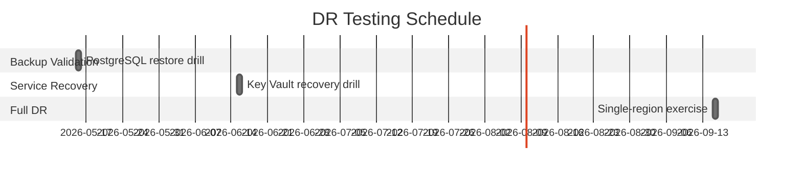

# 🛡️ Backup and Disaster Recovery Plan: Contoso Service Hub


<details open>
<summary><strong>📑 DR Plan Contents</strong></summary>

- [📋 Executive Summary](#-executive-summary)
- [🎯 1. Recovery Objectives](#-1-recovery-objectives)
- [💾 2. Backup Strategy](#-2-backup-strategy)
- [🌍 3. Disaster Recovery Procedures](#-3-disaster-recovery-procedures)
- [🧪 4. Testing Schedule](#-4-testing-schedule)
- [📢 5. Communication Plan](#-5-communication-plan)
- [👥 6. Roles and Responsibilities](#-6-roles-and-responsibilities)
- [🔗 7. Dependencies](#-7-dependencies)
- [📖 8. Recovery Runbooks](#-8-recovery-runbooks)
- [📎 9. Appendix](#-9-appendix)
- [References](#references)

</details>

> Generated by 08-As-Built agent | 2026-04-01

<div align="center">

| ⬅️ Previous                                          | 📑 Index            | Next ➡️                                            |
| ---------------------------------------------------- | ------------------- | -------------------------------------------------- |
| [07-resource-inventory.md](07-resource-inventory.md) | [README](README.md) | [07-compliance-matrix.md](07-compliance-matrix.md) |

</div>

**Generated**: 2026-04-01
**Version**: 1.0
**Environment**: dev, staging, prod
**Primary Region**: swedencentral
**Secondary Region**: Not in scope per RFQ; recovery is single-region only

---

## 📋 Executive Summary

> [!IMPORTANT]
> This document defines the backup strategy and disaster recovery procedures for Contoso Service Hub.

| Metric | Current | Target |
| --- | --- | --- |
| **RPO** | Design assumption: 1 hour for the critical database tier | 1 hour for production PostgreSQL |
| **RTO** | Design assumption: 4 hours for the critical service path | 4 hours for production ingress, API, and data services |
| **Availability** | 99.9% planned target | 99.9% |

This plan follows the RFQ single-region boundary. It does not include active-active or warm-standby failover to a second Azure region. Recovery depends on service-native backup, point-in-time restore, zonal resilience, and deterministic Bicep re-provisioning.

---

## 🎯 1. Recovery Objectives

### 1.1 Recovery Time Objective (RTO)

| Tier | RTO Target | Services |
| --- | --- | --- |
| 🔴 Critical | 4 hours | Application Gateway, API Management, AKS control plane and workloads, PostgreSQL, Redis, Key Vault |
| 🟠 Important | 8 hours | Storage account data paths, private DNS zones, monitoring services, budget alerts |
| 🟢 Standard | 24 hours | Utility VM, non-production environments, reporting and secondary operational tooling |

### 1.2 Recovery Point Objective (RPO)

| Data Type | RPO Target | Backup Strategy |
| --- | --- | --- |
| PostgreSQL transactional data | 1 hour | PostgreSQL Flexible Server point-in-time restore with 35-day retention |
| Blob and file data | 24 hours | Storage account container separation, operational backup container, and service restore procedures |
| Secrets and certificates | 24 hours | Key Vault soft delete and purge protection plus source-controlled infrastructure definitions |
| API and platform configuration | 24 hours | Bicep source, APIM configuration export, and Git-backed operational documentation |

```mermaid
%%{init: {'theme':'neutral'}}%%
gantt
    title RPO / RTO Targets by Tier
    dateFormat HH:mm
    axisFormat %H:%M
    section Critical
        RPO :crit, rpo1, 00:00, 1h
        RTO :crit, rto1, 00:00, 4h
    section Important
        RPO :rpo2, 00:00, 4h
        RTO :rto2, 00:00, 8h
    section Standard
        RPO :rpo3, 00:00, 24h
        RTO :rto3, 00:00, 24h
```



---

## 💾 2. Backup Strategy

<details>
<summary><strong>💾 PostgreSQL Flexible Server</strong></summary>

| Setting | Configuration |
| --- | --- |
| Backup Type | Native Azure PostgreSQL backup with point-in-time restore |
| Retention (PITR) | 35 days |
| Long-Term Retention | Not configured in the validated baseline |
| Geo-Redundancy | Disabled to preserve EU-only single-region scope |

**Point-in-Time Restore Command:**

```bash
ENV=prod
RESOURCE_GROUP="rg-contoso-svchub-${ENV}"
SERVER_NAME="psql-contoso-svchub-${ENV}-<suffix>"
RESTORE_NAME="${SERVER_NAME}-restore"

az postgres flexible-server restore \
  --resource-group "$RESOURCE_GROUP" \
  --name "$RESTORE_NAME" \
  --source-server "$SERVER_NAME" \
  --restore-time "2026-04-01T05:00:00Z"
```

</details>

<details>
<summary><strong>🗂️ Storage Account</strong></summary>

| Setting | Configuration |
| --- | --- |
| Blob containers | `content`, `uploads`, `backups` |
| Redundancy | `Standard_ZRS` in production, `Standard_LRS` in non-production |
| Public access | Disabled |
| Recovery dependency | Private endpoint, private DNS, and container-level restore procedure |

</details>

<details>
<summary><strong>🔐 Azure Key Vault</strong></summary>

| Setting | Configuration |
| --- | --- |
| Soft Delete | Enabled |
| Purge Protection | Enabled |
| Retention | 90 days |

</details>

<details>
<summary><strong>🧩 Control Plane Artifacts</strong></summary>

| Setting | Configuration |
| --- | --- |
| IaC source of truth | Bicep templates under [../../infra/bicep/contoso-service-hub-run-1/](../../infra/bicep/contoso-service-hub-run-1/) |
| Architecture record | ADRs and Step 7 documentation package |
| API gateway recovery requirement | Export APIM configuration before first production change window |
| Kubernetes recovery requirement | Store manifests, Helm values, or GitOps definitions outside the cluster |

</details>

---

## 🌍 3. Disaster Recovery Procedures

<details>
<summary><strong>🌍 Region Failover</strong></summary>

### 3.1 Failover Procedure

Region failover is intentionally out of scope for this workload. If a regional event affects `swedencentral`, the approved recovery posture is:

1. Confirm whether the incident is zonal, service-specific, or regional.
2. Restore the critical data tier through service-native recovery if the platform is still regionally available.
3. Re-provision ingress, API, compute, and utility services from Bicep if the failure is resource-scoped rather than region-wide.
4. Escalate to Contoso for business continuity decision-making if a full regional outage occurs, because no secondary-region recovery stack is part of the RFQ scope.

</details>

<details>
<summary><strong>↩️ Failback Procedure</strong></summary>

### 3.2 Failback Procedure

1. Validate that restored services meet the expected health checks, private DNS resolution, and security baselines.
2. Reapply any missing configuration drift from the Bicep source and operational exports.
3. Re-enable normal API, ingress, and workload traffic only after data integrity validation is complete.
4. Record the incident timeline, recovery duration, and configuration deviations in the post-incident review.

</details>

---

## 🧪 4. Testing Schedule

| Test Type | Frequency | Last Test | Next Test |
| --- | --- | --- | --- |
| PostgreSQL restore validation | Quarterly | Not yet executed in dry-run | First live test within 30 days of production deployment |
| Key Vault recovery drill | Quarterly | Not yet executed in dry-run | First live test within 30 days of production deployment |
| Full single-region recovery rehearsal | Semi-annual | Not yet executed in dry-run | First rehearsal in the first half after go-live |



> Replace calendar dates with Contoso-approved maintenance slots once live deployment scheduling exists.

---

## 📢 5. Communication Plan

| Audience | Channel | Template |
| --- | --- | --- |
| Internal platform team | Teams or on-call bridge | Technical incident update every 30 minutes during P1 events |
| Security and compliance | Dedicated escalation channel | GDPR or PCI-DSS exception notification when regulated controls are impacted |
| Contoso business stakeholders | Incident coordinator update | Business impact summary, ETA, and mitigation path |
| Audit and change management | Ticketing system | Post-incident record with evidence references |

---

## 👥 6. Roles and Responsibilities

| Role | Team | Responsibility |
| --- | --- | --- |
| Incident Commander | Platform Engineering | Coordinates P1 and P2 recovery actions |
| Data Recovery Owner | Data Platform | Executes PostgreSQL and storage recovery procedures |
| Security Reviewer | Security and Compliance | Validates control restoration and breach obligations |
| Service Owner | Product and Operations | Approves service restoration to normal operating state |

---

## 🔗 7. Dependencies

| Dependency | Impact | Mitigation |
| --- | --- | --- |
| Private DNS zones and VNet links | Loss breaks data-plane resolution and cluster API access | Re-provision private DNS from Bicep before attempting service recovery |
| Entra identity services | Loss impacts AKS RBAC, PostgreSQL auth, and customer sign-in | Maintain break-glass admin process and identity configuration export |
| APIM configuration state | Loss impacts external API contract and policy enforcement | Export APIM configuration before production cutover |
| Bicep repository availability | Loss delays full rebuild of the environment | Mirror the repository and preserve release artifacts in a protected backup location |

---

## 📖 8. Recovery Runbooks

| Scenario | Runbook | Owner |
| --- | --- | --- |
| PostgreSQL corruption or accidental deletion | Restore to point in time, validate Entra auth, repoint workloads | Data Platform |
| AKS cluster rebuild | Re-deploy from Bicep, reattach identity, restore workloads from Git-backed definitions | Platform Engineering |
| Key Vault deletion or secret loss | Recover vault through soft delete, then validate private access and RBAC | Security and Compliance |
| APIM service loss | Re-deploy APIM, reapply exported API configuration, validate gateway health | API Platform Owner |

<details>
<summary><strong>📖 Runbook: PostgreSQL Recovery</strong></summary>

**Trigger**: Data corruption, admin error, or service-level outage affecting the production database.
**Estimated Duration**: 2 to 4 hours.

1. Freeze application writes or place the platform in maintenance mode.
2. Execute PostgreSQL point-in-time restore to a new server.
3. Validate Entra administrator assignment, private DNS resolution, and application connectivity.
4. Repoint the workload to the restored endpoint through controlled configuration rollout.

**Validation**:

```bash
az postgres flexible-server show \
  --resource-group rg-contoso-svchub-prod \
  --name psql-contoso-svchub-prod-<suffix>
```

</details>

---

## 📎 9. Appendix

<details>
<summary>📋 Detailed Recovery Procedures</summary>

This DR plan assumes the following prerequisites before the first production deployment:

- APIM configuration export process defined and tested.
- AKS workload manifests or GitOps definitions stored outside the cluster.
- Key Vault break-glass access documented.
- Environment-specific parameter files for staging and production added to source control.
- Certificate management workflow completed for Application Gateway HTTPS listeners.

</details>

---

## References

> [!NOTE]
> 📚 The following Microsoft Learn resources provide DR guidance.

| Topic | Link |
| --- | --- |
| Azure Backup Overview | [Backup Overview](https://learn.microsoft.com/azure/backup/backup-overview) |
| Backup Best Practices | [Best Practices](https://learn.microsoft.com/azure/backup/backup-best-practices) |
| RTO/RPO Guidance | [Reliability Metrics](https://learn.microsoft.com/azure/well-architected/reliability/metrics) |
| Site Recovery | [ASR Overview](https://learn.microsoft.com/azure/site-recovery/site-recovery-overview) |
| Business Continuity | [DR Planning](https://learn.microsoft.com/azure/well-architected/reliability/disaster-recovery) |

---

_Backup and DR plan generated for a single-region validated Azure baseline._