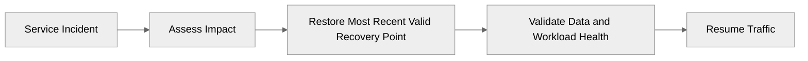

# 🛡️ Backup and Disaster Recovery Plan: Contoso Service Hub


<details open>
<summary><strong>📑 DR Plan Contents</strong></summary>

- [📋 Executive Summary](#-executive-summary)
- [🎯 1. Recovery Objectives](#-1-recovery-objectives)
- [💾 2. Backup Strategy](#-2-backup-strategy)
- [🌍 3. Disaster Recovery Procedures](#-3-disaster-recovery-procedures)
- [🧪 4. Testing Schedule](#-4-testing-schedule)
- [📢 5. Communication Plan](#-5-communication-plan)
- [👥 6. Roles and Responsibilities](#-6-roles-and-responsibilities)
- [🔗 7. Dependencies](#-7-dependencies)
- [📖 8. Recovery Runbooks](#-8-recovery-runbooks)
- [📎 9. Appendix](#-9-appendix)
- [References](#references)

</details>

> Generated by 08-As-Built agent | 2026-03-16

| ⬅️ Previous                                          | 📑 Index               | Next ➡️                                            |
| ---------------------------------------------------- | ---------------------- | -------------------------------------------------- |
| [07-resource-inventory.md](07-resource-inventory.md) | [README.md](README.md) | [07-compliance-matrix.md](07-compliance-matrix.md) |

**Generated**: 2026-03-16
**Version**: 1.0
**Environment**: dev, staging, prod
**Primary Region**: swedencentral
**Secondary Region**: Not in scope for the current RFQ

---

## 📋 Executive Summary

This document defines the validated backup and disaster recovery posture for Contoso Service Hub.
The target state supports service recovery within **RTO 4 hours** and **RPO 1 hour** while remaining
inside a single Azure region.

| Metric           | Current                           | Target  |
| ---------------- | --------------------------------- | ------- |
| **RPO**          | Design baseline                   | 1 hour  |
| **RTO**          | Design baseline                   | 4 hours |
| **Availability** | 99.9% target service availability | 99.9%   |

---

## 🎯 1. Recovery Objectives

### 1.1 Recovery Time Objective (RTO)

| Tier         | RTO Target | Services                                         |
| ------------ | ---------- | ------------------------------------------------ |
| 🔴 Critical  | 4 hours    | Front Door, APIM, AKS, PostgreSQL, Redis         |
| 🟠 Important | 8 hours    | Key Vault, Azure Files, Blob Storage, monitoring |
| 🟢 Standard  | 24 hours   | Dev and non-critical administrative services     |

### 1.2 Recovery Point Objective (RPO)

| Data Type                | RPO Target                           | Backup Strategy                                     |
| ------------------------ | ------------------------------------ | --------------------------------------------------- |
| Transactional data       | 1 hour                               | PostgreSQL PITR with frequent Azure-managed backups |
| Session / cache data     | 1 hour                               | Redis hourly snapshot baseline                      |
| File content             | 24 hours                             | Azure Files daily backup                            |
| Blob content             | 24 hours                             | Soft delete, versioning, and operational recovery   |
| Secrets and certificates | Near-zero administrative loss target | Key Vault soft delete and purge protection          |



---

## 💾 2. Backup Strategy

| Service                    | Backup Policy                             | Retention                 | Recovery Method                               |
| -------------------------- | ----------------------------------------- | ------------------------- | --------------------------------------------- |
| PostgreSQL Flexible Server | Azure-managed backups + PITR              | 35 days                   | Restore to a new server, validate, cut over   |
| Blob Storage               | Soft delete + versioning                  | 30 days                   | Restore blob version or deleted object        |
| Azure Files                | Azure Backup daily snapshots              | 30 days                   | File share restore to same or alternate share |
| Key Vault                  | Soft delete + purge protection            | 90 days                   | Recover deleted vault or object               |
| Azure Managed Redis        | Hourly persistence / snapshot             | 7 days operational window | Restore latest viable cache snapshot          |
| AKS cluster resources      | Azure Backup for cluster metadata and PVs | Service-managed retention | Rehydrate cluster state and persistent data   |

Additional backup design rules:

- Backups remain in-region and in the EU.
- Backup verification is mandatory before planned maintenance affecting data services.
- Production backup posture applies to staging where parity testing is required; dev uses a reduced retention model.

---

## 🌍 3. Disaster Recovery Procedures

This project does **not** implement multi-region active-passive or active-active failover.
The approved DR model is therefore **single-region recovery and controlled rebuild in `swedencentral`**.

### 3.1 Failover Procedure

1. Declare incident severity and freeze all non-essential changes.
2. Confirm whether the fault is edge, platform, data, or operator error.
3. Restore the affected tier in the same region using the latest verified recovery point.
4. Reattach platform dependencies in this order: Key Vault, networking, data, APIM, AKS workloads, Front Door.
5. Validate user journeys and monitoring before reopening production traffic.

### 3.2 Failback Procedure

1. Confirm the restored primary path is healthy and consistent.
2. Drain temporary or emergency endpoints.
3. Repoint APIM backends and Front Door origin targets if a temporary recovery stack was used.
4. Validate bookings, payments, CIAM, and content delivery end to end.
5. Close the incident only after operational sign-off and evidence capture.

---

## 🧪 4. Testing Schedule

| Test Type               | Frequency   | Last Test                               | Next Test                                |
| ----------------------- | ----------- | --------------------------------------- | ---------------------------------------- |
| PostgreSQL PITR restore | Quarterly   | Not yet executed - design baseline only | First post-deployment quarter            |
| Redis snapshot restore  | Quarterly   | Not yet executed - design baseline only | First post-deployment quarter            |
| Azure Files restore     | Semi-annual | Not yet executed - design baseline only | First post-deployment half-year          |
| Full recovery tabletop  | Quarterly   | Design review completed 2026-03-16      | First operational drill after deployment |

Testing rules:

- Execute staging restore drills before production drills.
- Capture elapsed time against the 4-hour RTO and 1-hour RPO targets.
- Update this plan after the first live restore exercise.

---

## 📢 5. Communication Plan

| Audience                | Channel                              | Template                               |
| ----------------------- | ------------------------------------ | -------------------------------------- |
| Internal operations     | Teams / on-call tooling              | P1 or P2 incident template             |
| Product owner           | Teams / email                        | Business impact summary                |
| Security and compliance | Teams / email                        | Security event or GDPR-impact template |
| Customers / partners    | Status page / approved comms channel | Service degradation or outage notice   |

---

## 👥 6. Roles and Responsibilities

| Role                   | Team                       | Responsibility                                         |
| ---------------------- | -------------------------- | ------------------------------------------------------ |
| Incident Commander     | Platform Operations        | Owns major incident coordination and recovery timeline |
| Database Recovery Lead | Data Platform              | Executes PostgreSQL restore and validation             |
| Platform Recovery Lead | SRE / Platform Engineering | Restores AKS, APIM, and edge services                  |
| Security Lead          | Security & Compliance      | Evaluates GDPR or security notification obligations    |
| Communications Lead    | Product / Operations       | Coordinates internal and external messaging            |

---

## 🔗 7. Dependencies

| Dependency                                          | Impact                                                | Mitigation                                                                    |
| --------------------------------------------------- | ----------------------------------------------------- | ----------------------------------------------------------------------------- |
| Azure control plane availability in `swedencentral` | Regional outage can delay rebuild                     | Maintain rebuild scripts, validated deployment phases, and operator readiness |
| MFA-compliant deployment path                       | Write-deny policy blocks resource changes without MFA | Validate operator access or federated exception path before incident use      |
| Key Vault availability                              | Secret access blocks application startup and restore  | Restore vault access early in the recovery chain                              |
| Private DNS resolution                              | Private endpoints fail without correct DNS            | Validate VNet links and DNS zones during each drill                           |

---

## 📖 8. Recovery Runbooks

| Scenario                                | Runbook                                         | Owner                |
| --------------------------------------- | ----------------------------------------------- | -------------------- |
| PostgreSQL corruption or operator error | PITR restore and application cutover            | Data Platform        |
| Redis cache loss                        | Restore snapshot and repopulate hot keys        | Platform Engineering |
| AKS cluster failure                     | Re-deploy cluster phase and rehydrate workloads | SRE                  |
| Storage recovery                        | Restore file share or blob versions             | Platform Engineering |

### PostgreSQL PITR Runbook

**Trigger**: Data corruption, destructive change, or failed schema release
**Estimated Duration**: 2-4 hours depending on validation and cutover complexity

1. Stop write-heavy application workflows where possible.
2. Restore PostgreSQL to a new server at the required point in time.
3. Validate schema, row counts, and application connectivity.
4. Update APIM / workload configuration to use the recovered server.
5. Re-enable writes and monitor for errors.

**Validation**:

```bash
az postgres flexible-server restore \
  --resource-group rg-contoso-service-hub-prod \
  --name psql-contoso-prod-<suffix> \
  --restore-time "<timestamp>" \
  --source-server psql-contoso-prod-<suffix>
```

### Redis Recovery Runbook

**Trigger**: Cache corruption, severe eviction, or node-level cache loss
**Estimated Duration**: 30-90 minutes

1. Confirm the failure is isolated to cache and not application identity or networking.
2. Restore the latest approved snapshot where supported.
3. Rewarm hot keys from the application or scheduled priming jobs.
4. Monitor hit ratio and latency for stabilization.

---

## 📎 9. Appendix

<details>
<summary>📋 Detailed Recovery Procedures</summary>

| Service               | Notes                                                                                                                                                                                                                                                                                                  |
| --------------------- | ------------------------------------------------------------------------------------------------------------------------------------------------------------------------------------------------------------------------------------------------------------------------------------------------------ |
| PostgreSQL            | Zone-redundant HA handles local failures; restore runbook covers logical corruption and operator error                                                                                                                                                                                                 |
| Redis                 | Cache can be rebuilt, but the target posture keeps the loss window inside the 1-hour RPO objective                                                                                                                                                                                                     |
| Blob Storage          | Versioning and soft delete handle accidental deletes more cheaply than full copy recovery                                                                                                                                                                                                              |
| Key Vault             | Purge protection prevents destructive operator error from becoming unrecoverable                                                                                                                                                                                                                       |
| **APIM**              | **APIs, policies, products, backends, and certificates must be exported regularly via `az apim api export` or APIOps toolkit. Bicep modules restore infrastructure; API configuration is restored from Git-backed APIOps repository. RTO: manual re-import ~30 minutes. Owner: Platform Engineering.** |
| **Entra External ID** | **App registrations, user flows, and custom policies are control-plane state outside IaC. Export via Microsoft Graph API backup scripts. RTO: manual re-configuration ~60 minutes. Owner: Identity Team.**                                                                                             |

</details>

---

## References

| Topic                 | Link                                                                                            |
| --------------------- | ----------------------------------------------------------------------------------------------- |
| Azure Backup Overview | [Backup Overview](https://learn.microsoft.com/azure/backup/backup-overview)                     |
| Backup Best Practices | [Best Practices](https://learn.microsoft.com/azure/backup/backup-best-practices)                |
| RTO/RPO Guidance      | [Reliability Metrics](https://learn.microsoft.com/azure/well-architected/reliability/metrics)   |
| Site Recovery         | [ASR Overview](https://learn.microsoft.com/azure/site-recovery/site-recovery-overview)          |
| Business Continuity   | [DR Planning](https://learn.microsoft.com/azure/well-architected/reliability/disaster-recovery) |

---

_Backup and disaster recovery plan generated from the validated Azure platform design._
