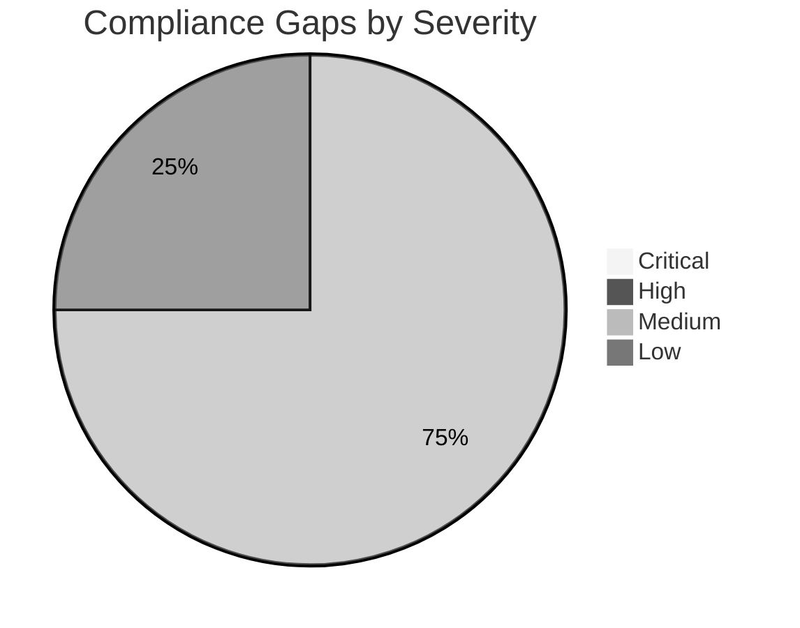

# ⚖️ Compliance Matrix: Contoso Service Hub

<strong>📑 Compliance Contents</strong>

- [📋 Executive Summary](#-executive-summary)
- [🗺️ 1. Control Mapping](#️-1-control-mapping)
- [🔍 2. Gap Analysis](#-2-gap-analysis)
- [📁 3. Evidence Collection](#-3-evidence-collection)
- [📝 4. Audit Trail](#-4-audit-trail)
- [🔧 5. Remediation Tracker](#-5-remediation-tracker)
- [📎 6. Appendix](#-6-appendix)
- [References](#references)

> Generated by 08-As-Built agent | 2026-03-16

| ⬅️ Previous                                  | 📑 Index               | Next ➡️                                          |
| -------------------------------------------- | ---------------------- | ------------------------------------------------ |
| [07-backup-dr-plan.md](07-backup-dr-plan.md) | [README.md](README.md) | [07-ab-cost-estimate.md](07-ab-cost-estimate.md) |

**Generated**: 2026-03-16
**Version**: 1.0
**Environment**: dev, staging, prod
**Primary Compliance Framework**: GDPR with tenant governance alignment and SAQ-A payment boundary

---

## 📋 Executive Summary

This compliance matrix maps the validated Contoso Service Hub design to GDPR, security-baseline,
and live governance requirements. Because the platform has not yet been deployed, the matrix records
**design conformance** and **implementation obligations** rather than runtime attestation.

| Compliance Area    | Coverage | Status                                         |
| ------------------ | -------- | ---------------------------------------------- |
| Network Security   | 90%      | ✅ Design complete                             |
| Data Protection    | 95%      | ✅ Design complete                             |
| Access Control     | 85%      | ⚠️ Final runtime validation pending deployment |
| Monitoring & Audit | 85%      | ⚠️ Evidence generation pending deployment      |
| Incident Response  | 80%      | ✅ Runbook defined, live drill pending         |
| Overall            | 87%      | ⚠️ Ready for deployment, evidence pending      |

---

## 🗺️ 1. Control Mapping

### Requirement 1: GDPR and Data Residency (RFQ Section 4.3 — Clause-by-Clause)

| RFQ 4.3 Clause                | Requirement                                                                                              | Implementation                                                                                           | Status   |
| ----------------------------- | -------------------------------------------------------------------------------------------------------- | -------------------------------------------------------------------------------------------------------- | -------- |
| Customer data                 | All customer PII, transaction records, user content — EU only                                            | PostgreSQL, Blob Storage, Redis all in `swedencentral`; private endpoints; no cross-region replication   | ✅       |
| Application logs              | Log sinks must remain in EU region                                                                       | Log Analytics Workspace in `swedencentral`; 90-day retention                                             | ✅       |
| Backups                       | All backup vaults, PITR, blob snapshots — EU region only                                                 | PostgreSQL PITR (swedencentral), Blob soft-delete (swedencentral), Azure Backup vault (swedencentral)    | ✅       |
| Service metadata              | Azure resource metadata, tags, configuration state — EU region                                           | All resources deployed to `swedencentral`; resource metadata stored in region                            | ✅       |
| Telemetry & analytics         | No telemetry export outside EU                                                                           | Application Insights workspace-based (swedencentral); no export rules configured                         | ✅       |
| Replication & caching         | Redis cache, CDN edge caches — EU PoP locations only                                                     | Azure Managed Redis in swedencentral; Front Door CDN restricted to EU PoP locations via routing rules    | ✅       |
| Indexing & search             | Any search indexes or vector stores — EU region only                                                     | N/A — no search indexes in current scope; constraint documented for future additions                     | ✅ (N/A) |
| Remote support access         | GDPR-compliant safeguards including Standard Contractual Clauses                                         | Operational runbook mandates SCC-based remote support; no data export without written Contoso approval   | ✅       |
| No processing outside EU      | No processing, replication, caching, indexing, or telemetry analysis outside EU without written approval | All 15 services deployed to EU; Azure Policy restricts allowed regions; Front Door EU-only PoPs          | ✅       |
| Data minimization             | Limit public exposure of regulated data                                                                  | Private endpoints for PostgreSQL, Redis, Storage, Key Vault; public access disabled on all data services | ✅       |
| Security of processing        | Protect data in transit and at rest                                                                      | TLS 1.2+, HTTPS-only, Azure encryption at rest (platform-managed keys)                                   | ✅       |
| Breach notification readiness | 72-hour GDPR response window (Article 33)                                                                | Incident response and communications procedures defined in Step 7 operations runbook                     | ✅       |

### Requirement 2: Identity, Access, and Secrets

| Control            | Requirement                                      | Implementation                                                       | Status |
| ------------------ | ------------------------------------------------ | -------------------------------------------------------------------- | ------ |
| Administrative MFA | Enforce strong operator authentication           | Live tenant policy denies writes without MFA-compatible session      | ✅     |
| Least privilege    | Avoid standing credentials and over-broad access | Azure RBAC plus managed identity and AKS workload identity           | ✅     |
| Secret protection  | Centralize and recover secrets safely            | Key Vault with RBAC, soft delete, purge protection, private endpoint | ✅     |
| Customer identity  | CIAM support for 15K MAU                         | Microsoft Entra External ID                                          | ✅     |

### Requirement 3: Platform Security Controls Checklist

| Control              | Requirement                                          | Implementation                                                                             | Status |
| -------------------- | ---------------------------------------------------- | ------------------------------------------------------------------------------------------ | ------ |
| WAF inspection       | All public traffic must traverse an inspected edge   | Front Door Premium + WAF policy                                                            | ✅     |
| APIM origin lockdown | Prevent direct bypass of the edge                    | Internal / controlled APIM origin design, header validation, planned Private Link sequence | ⚠️     |
| AKS hardening        | Private cluster, Azure RBAC, local accounts disabled | Planned in production AKS configuration                                                    | ⚠️     |
| Storage hardening    | No anonymous blob access or shared key auth          | Explicitly set in Bicep and enforced by tenant modify policies                             | ✅     |
| Private networking   | No public data-plane access                          | Private endpoints and private DNS design                                                   | ✅     |

### Requirement 4: Governance Policy Compliance Status

| Policy / Constraint   | Required Outcome                                                                      | Design Response                                                       | Status |
| --------------------- | ------------------------------------------------------------------------------------- | --------------------------------------------------------------------- | ------ |
| MFA write enforcement | All Azure writes must use MFA-compatible path                                         | Deployment procedure explicitly requires MFA-capable operator session | ✅     |
| Tag governance        | Required lowercase tag set including conflicting `technical-contact` / `tech-contact` | Both keys included in the Bicep tag baseline                          | ✅     |
| Storage secure access | Disable shared-key auth and anonymous blob access                                     | Storage design sets both values explicitly                            | ✅     |
| AKS agent pool limit  | Maximum 10 pools                                                                      | Design uses 2 pools                                                   | ✅     |

<strong>Security Control Checklist</strong>

| Control           | Status | Note                                               |
| ----------------- | ------ | -------------------------------------------------- |
| Private endpoints | ✅     | Required data services are modeled on Private Link |
| Managed identity  | ✅     | Platform identities replace static credentials     |
| Runtime evidence  | ⚠️     | Pending first live deployment                      |
| Multi-region DR   | ❌     | Explicitly out of current scope                    |

---

## 🔍 2. Gap Analysis

| Gap                                                                          | Severity | Risk Level | Remediation                                                                                            | Timeline                    |
| ---------------------------------------------------------------------------- | -------- | ---------- | ------------------------------------------------------------------------------------------------------ | --------------------------- |
| Runtime evidence not yet available because deployment was a dry-run          | 🟡       | Medium     | Capture Azure Policy compliance, diagnostic settings, and config snapshots after first live deployment | First production deployment |
| APIM origin lockdown sequence still requires final implementation validation | 🟡       | Medium     | Validate Front Door-to-APIM private origin or equivalent header-based restriction in staging           | Before production go-live   |
| AKS private cluster and policy posture require live deployment verification  | 🟡       | Medium     | Confirm private API server, Azure RBAC, disabled local accounts, and network policy in staging         | Before production go-live   |
| Redis Entra-only access needs runtime validation                             | 🟢       | Low        | Validate identity-based access path and remove any legacy local-auth dependencies                      | Before security sign-off    |

---

## 📁 3. Evidence Collection

| Control                           | Evidence Type                                  | Location                                                 | Last Collected |
| --------------------------------- | ---------------------------------------------- | -------------------------------------------------------- | -------------- |
| Architecture and region decisions | Design artifact                                | `07-design-document.md`, `02-architecture-assessment.md` | 2026-03-16     |
| Governance findings               | Governance artifact                            | `04-governance-constraints.md`                           | 2026-03-16     |
| Backup and incident procedures    | Operations artifacts                           | `07-backup-dr-plan.md`, `07-operations-runbook.md`       | 2026-03-16     |
| Runtime Azure control evidence    | Azure configuration snapshots / policy exports | Pending first deployment                                 | Pending        |

---

## 📝 4. Audit Trail

| Date       | Auditor           | Finding                                                                                                                                             | Status                       | Commit                     |
| ---------- | ----------------- | --------------------------------------------------------------------------------------------------------------------------------------------------- | ---------------------------- | -------------------------- |
| 2026-03-16 | 08-As-Built agent | Validated design aligns with GDPR residency, managed identity, private endpoint, and tagging requirements; runtime evidence pending live deployment | Open for evidence completion | Local workspace change set |

---

## 🔧 5. Remediation Tracker

| Finding                                                            | Owner                | Due Date                     | Status         |
| ------------------------------------------------------------------ | -------------------- | ---------------------------- | -------------- |
| Produce runtime evidence package after first production deployment | Platform Operations  | First go-live milestone      | ⬜ Todo        |
| Validate APIM origin lockdown in staging                           | Platform Engineering | Before production deployment | 🔄 In Progress |
| Validate AKS hardening controls in staging                         | SRE / Security       | Before production deployment | 🔄 In Progress |
| Validate Redis identity-only access                                | Platform Engineering | Before security sign-off     | ⬜ Todo        |

---

## 📎 6. Appendix

### A. Compliance Framework Reference

This project is governed primarily by GDPR data-residency and security-of-processing
requirements, with a payment architecture constrained to SAQ-A scope and a live tenant
policy set enforcing MFA-compatible writes, storage hardening, and required tags.

### B. Azure Security Baseline Mapping

| Baseline Area                | Validated Design Response                                                  |
| ---------------------------- | -------------------------------------------------------------------------- |
| Identity and access          | Azure RBAC, Entra External ID, managed identity, MFA                       |
| Network security             | Front Door WAF, private endpoints, segmented VNets, NSGs                   |
| Data protection              | TLS 1.2+, encrypted services, Key Vault, restricted public access          |
| Logging and threat detection | Azure Monitor, Log Analytics, Application Insights, budget and alert hooks |

---

## References

| Topic                              | Link                                                                                                                        |
| ---------------------------------- | --------------------------------------------------------------------------------------------------------------------------- |
| Microsoft Cloud Security Benchmark | [MCSB Overview](https://learn.microsoft.com/security/benchmark/azure/overview)                                              |
| Azure Compliance Offerings         | [Compliance](https://learn.microsoft.com/azure/compliance/)                                                                 |
| Azure Policy                       | [Policy Overview](https://learn.microsoft.com/azure/governance/policy/overview)                                             |
| Regulatory Compliance              | [Built-in Policies](https://learn.microsoft.com/azure/governance/policy/samples/built-in-initiatives#regulatory-compliance) |

---

_Compliance matrix generated from validated infrastructure artifacts and governance discovery results._
