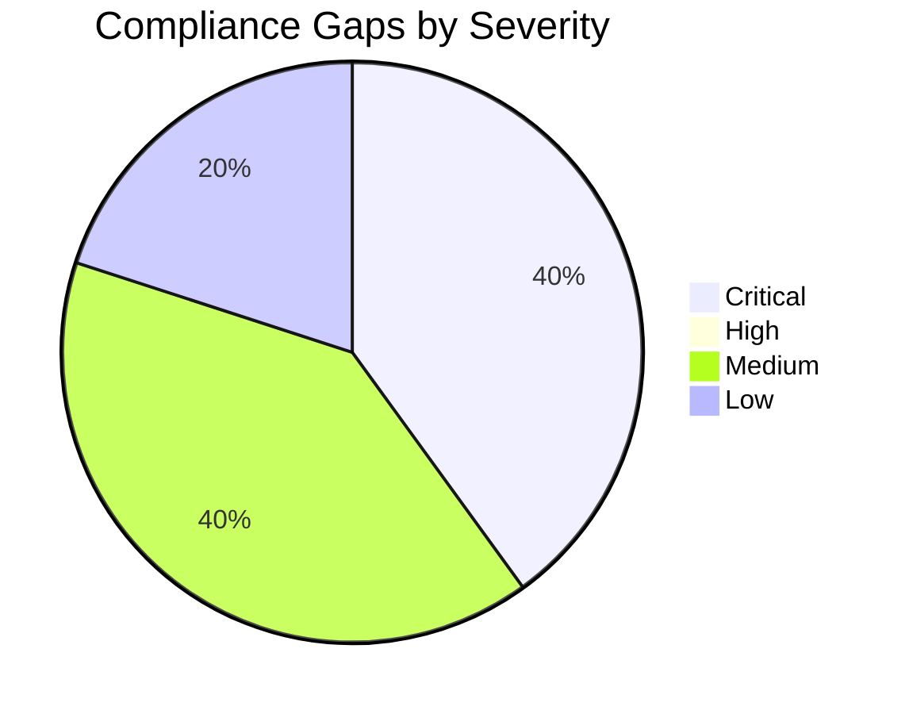

# ⚖️ Compliance Matrix: Contoso Service Hub

<strong>📑 Compliance Contents</strong>

- [📋 Executive Summary](#-executive-summary)
- [🗺️ 1. Control Mapping](#%EF%B8%8F-1-control-mapping)
- [🔍 2. Gap Analysis](#-2-gap-analysis)
- [📁 3. Evidence Collection](#-3-evidence-collection)
- [📝 4. Audit Trail](#-4-audit-trail)
- [🔧 5. Remediation Tracker](#-5-remediation-tracker)
- [📎 6. Appendix](#-6-appendix)
- [References](#references)

> Generated by 08-As-Built agent | 2026-04-01

| ⬅️ Previous                                  | 📑 Index            | Next ➡️                                          |
| -------------------------------------------- | ------------------- | ------------------------------------------------ |
| [07-backup-dr-plan.md](07-backup-dr-plan.md) | [README](README.md) | [07-ab-cost-estimate.md](07-ab-cost-estimate.md) |

**Generated**: 2026-04-01
**Version**: 1.0
**Environment**: dev, staging, prod
**Primary Compliance Framework**: GDPR and PCI-DSS

---

## 📋 Executive Summary

> [!IMPORTANT]
> This compliance matrix maps the Contoso Service Hub security controls to GDPR and PCI-DSS requirements.

| Compliance Area | Coverage | Status |
| --- | --- | --- |
| Network Security | 80% | ⚠️ |
| Data Protection | 85% | ⚠️ |
| Access Control | 90% | ⚠️ |
| Monitoring & Audit | 75% | ⚠️ |
| Incident Response | 70% | ⚠️ |
| Overall | 80% | ⚠️ |

Coverage is high at the design and IaC level, but the overall status remains warning rather than pass because this run produced validated code and validation evidence only. Live deployment evidence, actual Azure Policy assignment checks, and runtime audit evidence are still outstanding.

Status interpretation for this document: `✅` control implemented in validated source, `⚠️` partially evidenced or awaiting live validation, `❌` not yet acceptable for production sign-off.

---

## 🗺️ 1. Control Mapping

### Requirement 1: GDPR and PCI-DSS control baseline

| Control | Requirement | Implementation | Status |
| --- | --- | --- | --- |
| GDPR Article 5 and Article 44 | Keep regulated data within approved EU boundaries | Regional deployment in `swedencentral`, Application Gateway replacing Front Door in the compliant baseline, ZRS instead of GRS | ✅ |
| GDPR Article 25 | Privacy by design and by default | Private endpoints, private DNS, public network access disabled on data services, Entra-only auth for PostgreSQL | ✅ |
| GDPR Article 17 | Support controlled deletion of personal data | Storage separation, Key Vault recovery controls, platform architecture that avoids uncontrolled replicas outside the region | ⚠️ |
| GDPR Article 30 | Maintain processing records and traceability | Bicep source, ADRs, deployment summary, and Step 7 documentation package provide change traceability | ✅ |
| GDPR Article 32 | Protect confidentiality, integrity, and availability | TLS 1.2 minimum, Key Vault RBAC, WAF prevention mode, managed identity, Azure RBAC, diagnostic settings | ✅ |
| GDPR Article 33 | Breach notification capability | Runbook defines escalation, communication, and incident tracking | ⚠️ |
| PCI-DSS 1.2 | Segment card-processing-adjacent systems | NSGs, ingress tier separation, private data subnet, APIM fronting backend services | ✅ |
| PCI-DSS 3.4 | Protect stored account or personal data | PostgreSQL private access, Key Vault for secrets, encryption at rest by platform services | ✅ |
| PCI-DSS 4.2 | Encrypt transmissions of account data | TLS 1.2 minimum across storage, cache, database, and API surfaces | ✅ |
| PCI-DSS 7.2 and 8.3 | Least privilege and strong authentication | Managed identity, Azure RBAC, Entra MFA restriction to sovereign methods, PostgreSQL Entra-only auth | ✅ |
| PCI-DSS 10.2 | Log access and administrative actions | Log Analytics, Application Insights, AKS diagnostics, gateway diagnostics, Azure Activity Log | ⚠️ |
| PCI-DSS 11.5 and 12.10 | File integrity, monitoring, and incident response | WAF and monitoring baseline in code; operational testing and SOC integration still pending | ⚠️ |

<strong>📎 Evidence</strong>

**Evidence Location**: Bicep modules under [../../infra/bicep/contoso-service-hub-run-1/](../../infra/bicep/contoso-service-hub-run-1/), ADRs, [04-governance-constraints.md](./04-governance-constraints.md), and [06-deployment-summary.md](./06-deployment-summary.md)

| Evidence Item | Type | Date Collected |
| --- | --- | --- |
| [03-des-adr-003-eu-data-boundary.md](./03-des-adr-003-eu-data-boundary.md) | Architecture decision | 2026-04-01 |
| [04-governance-constraints.md](./04-governance-constraints.md) | Governance baseline | 2026-04-01 |
| [06-deployment-summary.md](./06-deployment-summary.md) | Validation evidence | 2026-04-01 |
| [../../infra/bicep/contoso-service-hub-run-1/modules/postgresql.bicep](../../infra/bicep/contoso-service-hub-run-1/modules/postgresql.bicep) | IaC evidence | 2026-04-01 |
| [../../infra/bicep/contoso-service-hub-run-1/modules/storage.bicep](../../infra/bicep/contoso-service-hub-run-1/modules/storage.bicep) | IaC evidence | 2026-04-01 |

---

## 🔍 2. Gap Analysis

| Gap | Severity | Risk Level | Remediation | Timeline |
| --- | --- | --- | --- | --- |
| Live Azure Policy assignments were not queried in this credentialless run | 🔴 | High | Re-run governance discovery against the target tenant and subscription before deployment approval | Before first deployment |
| Application Gateway is validated with an HTTP listener and requires HTTPS certificate binding for production exposure | 🔴 | High | Add certificate sourcing from Key Vault and enable HTTPS listener before go-live | Before external testing |
| No runtime evidence exists yet for diagnostic settings, alert delivery, or log retention | 🟡 | Medium | Validate after first deployment and capture evidence in operational handoff | Within 30 days of go-live |
| Public DNS names for staging and production remain parameterized, not committed | 🟡 | Medium | Add environment-specific `.bicepparam` files and approve DNS naming | Before first deployment |
| APIM export and identity runbooks are documented but not yet exercised | 🟢 | Low | Test recovery and evidence collection in the first recovery rehearsal | Within first semi-annual DR exercise |

---

## 📁 3. Evidence Collection

<strong>📁 Evidence Items</strong>

| Control | Evidence Type | Location | Last Collected |
| --- | --- | --- | --- |
| Data residency | ADR and design evidence | [03-des-adr-003-eu-data-boundary.md](./03-des-adr-003-eu-data-boundary.md) | 2026-04-01 |
| Mandatory tags | IaC source | [../../infra/bicep/contoso-service-hub-run-1/main.bicep](../../infra/bicep/contoso-service-hub-run-1/main.bicep) | 2026-04-01 |
| Private networking | IaC source | [../../infra/bicep/contoso-service-hub-run-1/modules/private-dns.bicep](../../infra/bicep/contoso-service-hub-run-1/modules/private-dns.bicep) | 2026-04-01 |
| PostgreSQL auth and TLS | IaC source | [../../infra/bicep/contoso-service-hub-run-1/modules/postgresql.bicep](../../infra/bicep/contoso-service-hub-run-1/modules/postgresql.bicep) | 2026-04-01 |
| Validation outcome | Deployment validation summary | [06-deployment-summary.md](./06-deployment-summary.md) | 2026-04-01 |

---

## 📝 4. Audit Trail

| Date | Auditor | Finding | Status | Commit |
| --- | --- | --- | --- | --- |
| 2026-04-01 | 08-As-Built | Step 7 compliance package created from validated source and dry-run deployment evidence | Open until live evidence exists | N/A in automated E2E run |

---

## 🔧 5. Remediation Tracker

| Finding | Owner | Due Date | Status |
| --- | --- | --- | --- |
| Complete live Azure Policy discovery against target subscription | Governance Owner | Before first deployment | ⬜ Todo |
| Enable HTTPS listener and certificate wiring on Application Gateway | Platform Engineering | Before external testing | ⬜ Todo |
| Add staging and production parameter files with approved DNS names and budget values | Platform Engineering | Before first deployment | ⬜ Todo |
| Capture runtime monitoring evidence and alert test results | Operations and SRE | Within 30 days of go-live | ⬜ Todo |

---

## 📎 6. Appendix

### A. Compliance Framework Reference

The GDPR scope in this solution centers on lawful regional processing, privacy-by-design controls, deletion support, auditability, and incident handling. The PCI-DSS scope centers on segmentation, encryption in transit and at rest, privileged access control, logging, and operational response. This design package addresses those controls at the infrastructure baseline level.

### B. Azure Security Baseline Mapping

- Azure Policy-modeled controls enforce EU regions, mandatory tags, HTTPS-only storage, TLS 1.2 minimums, private data-plane access, Key Vault purge protection, PostgreSQL Entra-only auth, AKS Azure Policy enablement, and regional WAF use.
- Identity controls rely on Azure RBAC, managed identity, and Entra External ID MFA restrictions.
- Monitoring controls rely on Log Analytics, Application Insights, diagnostic settings, and the operations runbook defined in [07-operations-runbook.md](./07-operations-runbook.md).

---

## References

> [!NOTE]
> 📚 The following Microsoft Learn resources provide compliance guidance.

| Topic | Link |
| --- | --- |
| Microsoft Cloud Security Benchmark | [MCSB Overview](https://learn.microsoft.com/security/benchmark/azure/overview) |
| Azure Compliance Offerings | [Compliance](https://learn.microsoft.com/azure/compliance/) |
| Azure Policy | [Policy Overview](https://learn.microsoft.com/azure/governance/policy/overview) |
| Regulatory Compliance | [Built-in Policies](https://learn.microsoft.com/azure/governance/policy/samples/built-in-initiatives#regulatory-compliance) |

---

_Compliance matrix generated from validated infrastructure artifacts and modeled governance controls._