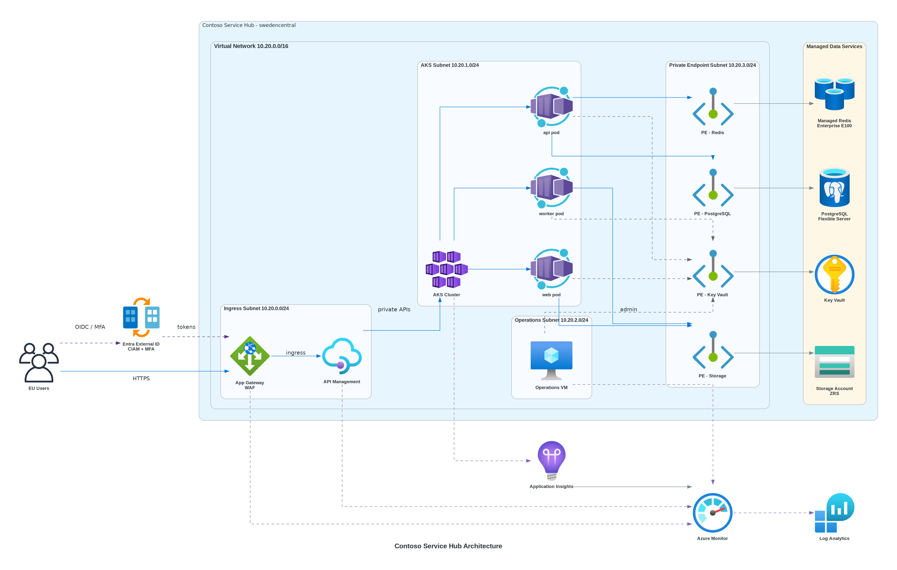

# 📐 Azure Design Document: Contoso Service Hub

<strong>📑 Design Contents</strong>

- [📝 1. Introduction](#-1-introduction)
- [🏛️ 2. Azure Architecture Overview](#-2-azure-architecture-overview)
- [🌐 3. Networking](#-3-networking)
- [💾 4. Storage](#-4-storage)
- [💻 5. Compute](#-5-compute)
- [👤 6. Identity & Access](#-6-identity--access)
- [🔐 7. Security & Compliance](#-7-security--compliance)
- [🔄 8. Backup & Disaster Recovery](#-8-backup--disaster-recovery)
- [📊 9. Management & Monitoring](#-9-management--monitoring)
- [📎 10. Appendix](#-10-appendix)
- [References](#references)

> Generated by 08-As-Built agent | 2026-04-01

| ⬅️ Previous                                            | 📑 Index            | Next ➡️                                              |
| ------------------------------------------------------ | ------------------- | ---------------------------------------------------- |
| [07-documentation-index.md](07-documentation-index.md) | [README](README.md) | [07-operations-runbook.md](07-operations-runbook.md) |

**Version**: 1.0
**Date**: 2026-04-01
**Author**: Generated by 08-As-Built
**Status**: Validated design baseline for `validated-not-deployed`

---

## 📝 1. Introduction

### 1.1 Document Purpose

This design document records the validated Azure implementation for Contoso Service Hub. It is intended for platform engineering, operations, security, and audit stakeholders who need a durable reference for what the Bicep solution has been validated to provision.

Because the deployment phase completed as a dry run, this document describes the validated infrastructure design rather than claiming runtime evidence for live Azure resources.

**Intended Audience:**

- Solution Architects
- Operations and SRE teams
- Security and Compliance teams
- Delivery and Platform Engineering teams

### 1.2 Project Overview

Contoso Service Hub is a greenfield digital services platform for EU real estate and lifestyle operations. The workload combines mobile and web entry points, partner-facing APIs, containerized backend services, stateful data services, and regulated identity and payment-adjacent processing requirements.

**Business Objectives:**

- Launch an Azure-hosted platform that supports bookings, payments, content delivery, and customer engagement for EU users.
- Meet GDPR and PCI-DSS control expectations while keeping customer and transaction data within approved EU boundaries.
- Scale from MVP traffic to projected growth without changing the primary AKS, PostgreSQL, Redis, and APIM service choices.

### 1.3 Design Objectives

| Objective | Target | Implementation |
| --- | --- | --- |
| Availability | 99.9% service availability | Zone-aware AKS pools, Application Gateway autoscale, zone-redundant PostgreSQL and Redis in production |
| Performance | Sub-2-second page loads and sub-500 ms API p95 planning target | Application Gateway, APIM, AKS autoscaling, Redis Enterprise E100, regional private data path |
| Security | GDPR and PCI-DSS aligned baseline | Private endpoints, Entra-only PostgreSQL auth, WAF, Key Vault, managed identity, TLS 1.2 minimum |
| Scalability | 5K users to 15K+ users and 50K to 2M annual transactions | AKS autoscaling, APIM throttling, PostgreSQL scale-up path, cache-first design |

### 1.4 Constraints & Assumptions

**Constraints:**

- The RFQ excludes multi-region disaster recovery; the validated design is single-region in `swedencentral`.
- Step 6 completed as `validated-not-deployed`, so live resource evidence, Azure Policy assignment discovery, and production telemetry are out of scope for this package.
- The current WAF module exposes an HTTP listener on port 80 and expects HTTPS certificate binding in a later rollout stage before go-live.
- Public DNS naming is parameterized by environment; only the dev value is committed in source control today.

**Assumptions:**

- The target subscription supports zone-aware AKS, PostgreSQL Flexible Server, Redis Enterprise, and Application Gateway WAF v2 in `swedencentral`.
- Environment-specific parameter files will be added for staging and production before actual deployment.
- Microsoft Entra External ID will be configured with FIDO2, passkey, or TOTP-based MFA only.
- The deployment identity will have the RBAC and policy permissions required to create private endpoints, private DNS links, budgets, and diagnostic settings.

### 1.5 Stakeholders

| Role | Team | Responsibility |
| --- | --- | --- |
| Product Sponsor | Contoso Digital Services | Business prioritization, compliance approval, and exception decisions |
| Platform Lead | Contoso Platform Engineering | Infrastructure ownership, release approval, and operational readiness |
| Security Lead | Security and Compliance | GDPR and PCI-DSS review, identity and network control approval |
| Operations Lead | SRE and Service Operations | Monitoring, incident management, backup testing, and change control |

---

## 🏛️ 2. Azure Architecture Overview

### 2.1 Architecture Diagram

Source: [03-des-architecture-diagram.png](./03-des-architecture-diagram.png)

The validated baseline routes internet traffic through Application Gateway WAF v2, then API Management, and into AKS-hosted application services. Stateful dependencies remain private through VNet and Private Link integration. The design intentionally replaces Front Door in the compliant baseline to align with the EU Data Boundary strategy captured in ADR-003.

### 2.2 Resource Summary

| Category | Count |
| --- | --- |
| Compute | 3 |
| Networking | 6 |
| Data | 3 |
| Security | 5 |

The 17 validated resource types break down into compute and integration services (AKS, APIM, VM), networking and ingress services (VNet, NSGs, DNS, private DNS, App Gateway, WAF policy), data services (PostgreSQL, Redis, Storage), and security or governance services (Key Vault, managed identity, budget, Log Analytics, Application Insights).

---

## 🌐 3. Networking

The network baseline is a regional, VNet-contained architecture built around `vnet-contoso-svchub-<env>` with the address space `10.0.0.0/16`. Each environment receives dedicated subnets for compute, data, ingress, private endpoints, APIM, and AKS pods:

- `snet-compute-<env>` for the utility VM and supporting compute workloads
- `snet-data-<env>` for delegated PostgreSQL placement
- `snet-appgw-<env>` for Application Gateway WAF v2
- `snet-pe-<env>` for private endpoints
- `snet-apim-<env>` for API Management
- `snet-aks-<env>` for AKS node and pod IP consumption

Network security groups enforce a deny-by-default model, with the Application Gateway subnet allowing only the Azure platform dependencies required for WAF operation and inbound HTTPS/HTTP traffic. The AKS API server is not left broadly public; the template restricts access to RFC 1918 address space through authorized IP ranges, which is a semi-private posture pending any move to a fully private control plane.

Private DNS zones are provisioned for PostgreSQL, Redis Enterprise, Key Vault, Blob Storage, Azure Files, and the AKS private API endpoint. This keeps all stateful service resolution inside the VNet and supports the governance requirement that data-plane services remain inaccessible from the public internet.

Public ingress is regional and compliance-oriented. Application Gateway WAF v2 is the approved baseline, with autoscale from one to three instances in production and an attached WAF policy in prevention mode. The current validated module terminates traffic on an HTTP listener and forwards to HTTPS backends; production deployment must add certificate binding and HTTPS listeners before the platform is exposed externally.

---

## 💾 4. Storage

The storage layer combines Azure Database for PostgreSQL Flexible Server, Azure Managed Redis Enterprise, and a general-purpose Storage Account for object and file data.

- PostgreSQL uses `psql-contoso-svchub-<env>-<suffix>` naming, private networking, Microsoft Entra-only authentication, TLS 1.2 minimum, 35-day backup retention, and zone-redundant high availability in production.
- Redis Enterprise uses `redis-contoso-svchub-<env>` naming, private connectivity only, TLS 1.2 minimum, and the Enterprise E100 tier in production to satisfy the 128 GB cache requirement natively.
- Storage Accounts use the constrained name pattern `stcsh<env><suffix>`, force HTTPS-only access, set TLS 1.2 minimum, disable anonymous blob access, disable public network access, and expose separate blob and file private endpoints.

The storage account provisions three blob containers named `content`, `uploads`, and `backups`, plus an Azure Files share named `appshare`. Production storage uses ZRS to maintain single-region resilience without enabling cross-region replication that would conflict with the EU-only residency baseline.

---

## 💻 5. Compute

The compute baseline is AKS-first, with supporting API gateway and utility VM components.

AKS is deployed as `aks-contoso-svchub-<env>` on Kubernetes `1.30`. The validated template enables two node pools:

- A `systempool` of `Standard_D4s_v5` nodes, autoscaling from two to five nodes across zones 1, 2, and 3.
- A `userpool` of `Standard_D4s_v5` nodes, autoscaling from two to ten nodes in production and one to three in non-production.

Azure RBAC, Azure Policy, Container Insights, and OIDC issuer output are enabled in the cluster definition. This is a strong baseline for future workload identity and policy enforcement.

API Management uses `apim-contoso-svchub-<env>-<suffix>`. The validated Bicep selects `StandardV2` for production and `Developer` for non-production. That meets the target API volume while controlling non-production cost.

The utility VM uses `vm-contoso-svchub-<env>`, with `Standard_D8s_v5` in production and `Standard_D4s_v5` elsewhere. It is positioned as a supporting management or operational workload rather than as a public application tier.

---

## 👤 6. Identity & Access

Identity design follows a no-shared-secret baseline wherever the platform supports it.

- A user-assigned managed identity named `id-contoso-svchub-<env>` is shared across platform components.
- Key Vault uses RBAC authorization, purge protection, 90-day soft delete retention, and private access only.
- PostgreSQL disables password authentication and enables Microsoft Entra authentication.
- AKS enables Azure RBAC and managed Entra integration.
- The application identity strategy assumes Microsoft Entra External ID for customer identity, with FIDO2, passkey, or TOTP-only MFA in the compliant baseline.

This design avoids embedded credentials in Bicep modules except for the temporary PostgreSQL bootstrap password that the ARM API still requires at creation time. That bootstrap password is non-usable once Entra-only authentication is enforced and must be treated as a deployment-time secret.

---

## 🔐 7. Security & Compliance

<strong>🔒 Security Controls</strong>

| Control | Implementation | Evidence |
| --- | --- | --- |
| TLS 1.2+ | Enforced on Storage, PostgreSQL, Redis, and APIM custom TLS properties | Bicep modules for [storage](../../infra/bicep/contoso-service-hub-run-1/modules/storage.bicep), [postgresql](../../infra/bicep/contoso-service-hub-run-1/modules/postgresql.bicep), [redis](../../infra/bicep/contoso-service-hub-run-1/modules/redis.bicep), and [apim](../../infra/bicep/contoso-service-hub-run-1/modules/apim.bicep) |
| HTTPS-only | Storage enforces HTTPS-only and Application Gateway forwards to HTTPS backends | [storage.bicep](../../infra/bicep/contoso-service-hub-run-1/modules/storage.bicep), [waf.bicep](../../infra/bicep/contoso-service-hub-run-1/modules/waf.bicep) |
| Managed Identity | Shared user-assigned identity for platform services | [identity.bicep](../../infra/bicep/contoso-service-hub-run-1/modules/identity.bicep) |
| Network isolation | Private endpoints, private DNS, disabled public network access | [private-dns.bicep](../../infra/bicep/contoso-service-hub-run-1/modules/private-dns.bicep), [key-vault.bicep](../../infra/bicep/contoso-service-hub-run-1/modules/key-vault.bicep), [postgresql.bicep](../../infra/bicep/contoso-service-hub-run-1/modules/postgresql.bicep), [redis.bicep](../../infra/bicep/contoso-service-hub-run-1/modules/redis.bicep) |

<strong>📋 Compliance Mapping</strong>

| Framework | Control ID | Status |
| --- | --- | --- |
| Legend | `✅` implemented in validated code, `⚠️` pending live evidence, `❌` not yet go-live complete | `✅ / ⚠️ / ❌` |
| GDPR | Articles 5, 17, 25, 30, 32, 33, 44 | ⚠️ Design validated; live evidence pending |
| PCI-DSS | 1.2, 3.4, 4.2, 7.2, 8.3, 10.2, 11.5, 12.10 | ⚠️ Design validated; live evidence pending |

The validated baseline is strong on preventative configuration but still carries go-live prerequisites:

- Front Door has been removed from the compliant baseline to avoid EU Data Boundary ambiguity.
- Entra MFA must stay on EU-sovereign methods only.
- The Application Gateway listener requires HTTPS certificate binding before external release.
- Live Azure Policy discovery was unavailable in this credentialless E2E run, so governance is based on a modeled baseline rather than real assignments.

---

## 🔄 8. Backup & Disaster Recovery

The workload is intentionally single-region. Recovery is based on service-native backup and restore plus deterministic Bicep redeployment rather than cross-region failover.

- PostgreSQL provides point-in-time restore capability with 35-day retention.
- Key Vault protects secrets with soft delete and purge protection.
- Blob data is separated into application and backup containers to support operational recovery.
- The Bicep codebase, ADRs, governance baseline, and Step 7 package act as control-plane recovery artifacts.

Planned recovery objectives remain the Step 2 assumptions of 4-hour RTO and 1-hour RPO for the critical production data tier. These values must be ratified during live deployment approval.

---

## 📊 9. Management & Monitoring

Azure Monitor is centralized through `log-contoso-svchub-<env>` and `appi-contoso-svchub-<env>`. All major platform services are wired to diagnostic settings or monitoring integrations in the validated templates.

Operational management features already present in code include:

- Log Analytics workspace with the `PerGB2018` SKU
- Application Insights linked to the regional workspace
- Container Insights for AKS
- Diagnostic settings for AKS, WAF/Application Gateway, PostgreSQL, Redis, and Storage
- A per-environment Azure Budget with threshold notifications

Operational management features still pending live deployment include action group delivery validation, alert tuning, dashboard curation, and on-call routing integration.

---

## 📎 10. Appendix

📋 Detailed Resource Configuration

| Item | Validated Value |
| --- | --- |
| Resource group pattern | `rg-contoso-svchub-<env>` |
| Common tags | `Environment`, `ManagedBy=Bicep`, `Project=contoso-service-hub`, `Owner=Contoso` |
| AKS Kubernetes version | `1.30` |
| AKS network policy | `azure` |
| PostgreSQL backup retention | 35 days |
| Key Vault soft delete retention | 90 days |
| Redis minimum TLS | `1.2` |
| Storage minimum TLS | `TLS1_2` |
| Storage redundancy | `Standard_ZRS` in production, `Standard_LRS` in non-production |

📚 Reference Architecture Links

| Architecture | Link |
| --- | --- |
| Implementation Plan | [04-implementation-plan.md](./04-implementation-plan.md) |
| Governance Constraints | [04-governance-constraints.md](./04-governance-constraints.md) |
| Deployment Validation | [06-deployment-summary.md](./06-deployment-summary.md) |

---

## References

> [!NOTE]
> 📚 The following Microsoft Learn resources provide additional guidance.

| Topic | Link |
| --- | --- |
| Well-Architected Framework | [Overview](https://learn.microsoft.com/azure/well-architected/) |
| Azure Architecture Center | [Architectures](https://learn.microsoft.com/azure/architecture/) |
| Security Best Practices | [Security Baseline](https://learn.microsoft.com/security/benchmark/azure/overview) |
| Networking Best Practices | [Network Security](https://learn.microsoft.com/azure/security/fundamentals/network-best-practices) |
| Backup Best Practices | [Azure Backup](https://learn.microsoft.com/azure/backup/backup-best-practices) |
| Monitoring Overview | [Azure Monitor](https://learn.microsoft.com/azure/azure-monitor/overview) |

---

_Design document generated from validated infrastructure artifacts and Bicep source._

---

| ⬅️ [07-documentation-index.md](07-documentation-index.md) | 🏠 [Project Index](README.md) | ➡️ [07-operations-runbook.md](07-operations-runbook.md) |
| --------------------------------------------------------- | ----------------------------- | ------------------------------------------------------- |

