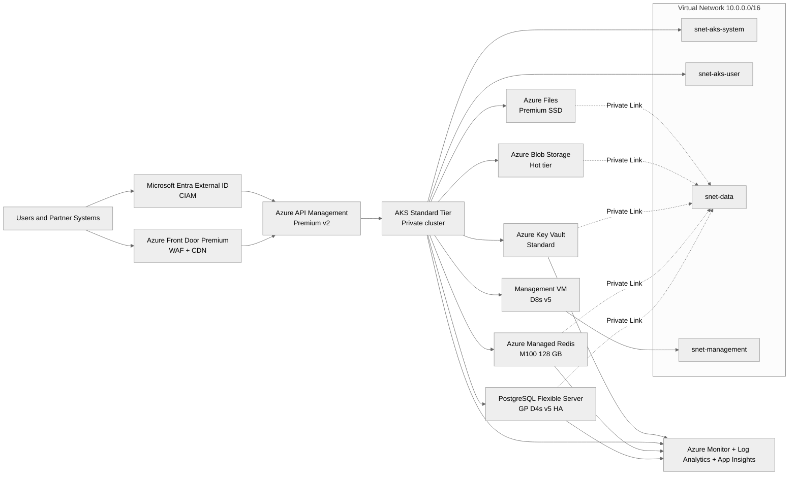

# 📐 Azure Design Document: Contoso Service Hub

<strong>📑 Design Contents</strong>

- [📝 1. Introduction](#-1-introduction)
- [🏛️ 2. Azure Architecture Overview](#-2-azure-architecture-overview)
- [🌐 3. Networking](#-3-networking)
- [💾 4. Storage](#-4-storage)
- [💻 5. Compute](#-5-compute)
- [👤 6. Identity & Access](#-6-identity--access)
- [🔐 7. Security & Compliance](#-7-security--compliance)
- [🔄 8. Backup & Disaster Recovery](#-8-backup--disaster-recovery)
- [📊 9. Management & Monitoring](#-9-management--monitoring)
- [📎 10. Appendix](#-10-appendix)
- [References](#references)

> Generated by 08-As-Built agent | 2026-03-16

| ⬅️ Previous                                            | 📑 Index               | Next ➡️                                              |
| ------------------------------------------------------ | ---------------------- | ---------------------------------------------------- |
| [07-documentation-index.md](07-documentation-index.md) | [README.md](README.md) | [07-operations-runbook.md](07-operations-runbook.md) |

**Version**: 1.0
**Date**: 2026-03-16
**Author**: Generated by 08-As-Built agent
**Status**: Complete

---

## 📝 1. Introduction

### 1.1 Document Purpose

This design document captures the validated target design for the Contoso Service Hub
Azure platform. It is the authoritative Step 7 reference for engineering, operations,
security, and audit teams.

Because the Step 6 deployment outcome was `validated-not-deployed`, this document records
the approved Bicep implementation baseline rather than live Azure runtime evidence.

**Intended Audience:**

- Solution architecture and platform engineering
- Site reliability engineering and operations
- Security, compliance, and audit stakeholders
- Delivery teams onboarding workloads to the platform

### 1.2 Project Overview

Contoso Service Hub is a unified digital services platform for bookings, payments,
content delivery, and customer engagement across Contoso's EU real estate and lifestyle
portfolio.

**Business Objectives:**

- Consolidate resident, visitor, tenant, and partner journeys behind a single Azure platform.
- Meet GDPR EU-residency requirements and maintain a 99.9% service availability target.
- Support growth from approximately 50,000 to 2,000,000 annual transactions without architectural rework.

### 1.3 Design Objectives

| Objective    | Target                             | Implementation                                                                    |
| ------------ | ---------------------------------- | --------------------------------------------------------------------------------- |
| Availability | 99.9%                              | Zone-aware Front Door, APIM Premium v2, AKS, and PostgreSQL HA in `swedencentral` |
| Performance  | `<2s` page load, `<500 ms` API p95 | Front Door caching, Redis acceleration, APIM policies, autoscaling AKS            |
| Security     | Zero-trust data plane              | Private endpoints, managed identity, WAF, TLS 1.2+, Key Vault                     |
| Scalability  | 40x transaction growth             | AKS autoscaler, PostgreSQL scale-up path, Redis M100, APIM headroom               |

### 1.4 Constraints & Assumptions

**Constraints:**

- All production data, logs, telemetry, and backups must remain in the EU, with `swedencentral` as the primary region.
- Disaster recovery is single-region only; cross-region failover is explicitly out of scope for the current RFQ.

**Assumptions:**

- Payments use a tokenized external gateway so the platform remains in SAQ-A PCI scope rather than full cardholder-data scope.
- Production deployment will be executed through an MFA-compatible Azure write path to satisfy live tenant policy.

### 1.5 Stakeholders

| Role              | Team                         | Responsibility                                     |
| ----------------- | ---------------------------- | -------------------------------------------------- |
| Platform Owner    | Contoso Platform Engineering | Service design authority and approval              |
| Operations Lead   | SRE / Operations             | Monitoring, incident response, maintenance windows |
| Security Lead     | Security & Compliance        | GDPR controls, policy compliance, audit evidence   |
| Application Owner | Product Delivery             | API and workload onboarding into AKS               |

---

## 🏛️ 2. Azure Architecture Overview

### 2.1 Architecture Diagram

The approved visual baseline remains the Step 3 design diagram: [03-des-diagram.png](./03-des-diagram.png).
The Mermaid view below summarizes the validated topology documented by this Step 7 suite.

### 2.2 Resource Summary

The design implements the full 15-service RFQ mapping plus supporting network,
monitoring, identity, and budget resources.

| Service                                 | Azure Selection                                            | Validated SKU / Tier                                         | Justification                                                                              |
| --------------------------------------- | ---------------------------------------------------------- | ------------------------------------------------------------ | ------------------------------------------------------------------------------------------ |
| Web Application Firewall                | Azure Front Door WAF                                       | Premium WAF policy                                           | Global entry point, OWASP rules, bot protection, and central policy enforcement            |
| Edge Security and CDN                   | Azure Front Door CDN                                       | Premium_AzureFrontDoor                                       | Meets edge acceleration and EU PoP delivery requirements with one managed control plane    |
| Customer Identity and Access Management | Microsoft Entra External ID                                | P1 free tier for 15K MAU                                     | Recommended successor to Azure AD B2C for new tenants                                      |
| API Management                          | Azure API Management                                       | Premium v2 in prod, Standard v2 in staging, Developer in dev | Supports private integration, policy enforcement, and environment-specific cost control    |
| Container Engine                        | Azure Kubernetes Service                                   | Standard tier with D8s v5 workload nodes                     | Matches managed Kubernetes requirement and provides full control for a 15-service platform |
| Database                                | Azure Database for PostgreSQL Flexible Server              | GP D4s v5 HA prod, D2s v5 staging, B1ms dev                  | Managed PostgreSQL with HA and point-in-time restore                                       |
| Object Storage                          | Azure Blob Storage                                         | Hot / Standard_LRS                                           | Low-cost object storage for media and documents                                            |
| File Storage                            | Azure Files                                                | Premium_LRS prod, Standard_LRS non-prod                      | Supports shared file workloads with SSD-backed production performance                      |
| Block Storage                           | Azure Managed Disks                                        | Premium SSD P20                                              | Persistent block storage for AKS and the management VM                                     |
| In-memory Cache                         | Azure Managed Redis                                        | M100 prod, reduced non-prod tiers                            | Exact-fit 128 GB production cache without a retiring SKU                                   |
| Key and Secrets Management              | Azure Key Vault                                            | Standard                                                     | Centralized secrets, certificate handling, soft delete, purge protection                   |
| Virtual Machine                         | Azure Virtual Machine                                      | D8s v5 prod, reduced non-prod sizes                          | Management and support node for platform administration                                    |
| Network Services                        | VNet, NSGs, Private Endpoints, Private DNS                 | Standard                                                     | Enforces the zero-trust data plane and subnet isolation model                              |
| SDLC Services                           | GitHub Enterprise with Azure-native deployment integration | Enterprise plan                                              | Source control, CI/CD, and release orchestration aligned to the platform delivery model    |
| Observability and Monitoring            | Azure Monitor, Log Analytics, Application Insights         | Per-GB workspace-based monitoring                            | Centralized metrics, logs, traces, and alert routing                                       |

---

## 🌐 3. Networking

The network design follows a single-region hub-style virtual network per environment.
All data services use private connectivity and private DNS resolution; public ingress is
restricted to Azure Front Door and the CIAM entry points.

### Topology

| Element           | Validated Design                                                                   |
| ----------------- | ---------------------------------------------------------------------------------- |
| Address space     | `10.0.0.0/16` per environment                                                      |
| AKS system subnet | `10.0.0.0/22` (`snet-aks-system-{env}`)                                            |
| AKS user subnet   | `10.0.4.0/22` (`snet-aks-user-{env}`)                                              |
| Data subnet       | `10.0.8.0/24` (`snet-data-{env}`) with private endpoint policies disabled          |
| Management subnet | `10.0.9.0/24` (`snet-management-{env}`)                                            |
| NSGs              | Dedicated NSGs for AKS system, AKS user, data, and management subnets              |
| Private DNS zones | PostgreSQL, Redis, Blob, File, Key Vault, and ACR private zones linked to the VNet |

### Private Endpoint Pattern

| Service                    | Private Endpoint Required                              | Notes                                                         |
| -------------------------- | ------------------------------------------------------ | ------------------------------------------------------------- |
| PostgreSQL Flexible Server | Yes                                                    | Database access restricted to the VNet                        |
| Azure Managed Redis        | Yes                                                    | Cache data plane stays private                                |
| Key Vault                  | Yes                                                    | Secrets access limited to platform identities inside the VNet |
| Blob Storage               | Yes                                                    | Object storage accessed over Private Link                     |
| Azure Files                | Yes                                                    | File share access isolated to the data subnet                 |
| API Management             | Planned for internal mode / Front Door origin lockdown | Prod requires direct origin bypass protection                 |

### Environment Configuration

| Environment | Public Entry                             | APIM Mode                       | AKS Mode                                          |
| ----------- | ---------------------------------------- | ------------------------------- | ------------------------------------------------- |
| dev         | Direct APIM access acceptable            | Developer tier                  | Reduced footprint, non-private cluster acceptable |
| staging     | Front Door or controlled internal access | Standard v2                     | Test parity with reduced scale                    |
| prod        | Front Door Premium only                  | Premium v2 with origin lockdown | Private cluster with zone-aware node pools        |

---

## 💾 4. Storage

Storage is split by access pattern so object storage, file shares, and block storage can be
governed independently while still meeting the repository security baseline.

| Storage Component | Production Selection                                                       | Design Rationale                                                      |
| ----------------- | -------------------------------------------------------------------------- | --------------------------------------------------------------------- |
| Blob Storage      | `StorageV2`, Hot tier, `Standard_LRS`, 200 GB                              | Media and document delivery with lifecycle controls and low unit cost |
| Azure Files       | `FileStorage`, `Premium_LRS`, 256 GiB                                      | Shared file workloads that require predictable SSD performance        |
| Managed Disks     | Premium SSD P20, 256 GB                                                    | Persistent block storage for AKS and the management VM                |
| Backup posture    | Blob soft delete and versioning, Azure Files backup, disk-aware AKS backup | Meets 30-day content retention and platform recovery objectives       |

All storage accounts are configured for HTTPS-only traffic, TLS 1.2 minimum,
`allowBlobPublicAccess = false`, and `allowSharedKeyAccess = false` to match tenant policy.

---

## 💻 5. Compute

Compute is centered on AKS for application workloads and a management VM for administrative
tasks that do not belong inside the cluster.

### AKS

| Environment | AKS Tier                | System Pool  | User Pool                   | Notes                                                  |
| ----------- | ----------------------- | ------------ | --------------------------- | ------------------------------------------------------ |
| prod        | Standard                | 2 × `D2s v5` | 3 × `D8s v5`, autoscale 3-6 | Multi-AZ baseline for 99.9% target and growth headroom |
| staging     | Standard                | 1 × `D2s v5` | 1 × `D4s v5`                | Functional parity at reduced scale                     |
| dev         | Free / reduced baseline | 1 × `B2ms`   | 1 × `B4ms`                  | Cost-controlled developer environment                  |

### Supporting Compute

| Component     | Production Selection | Purpose                                                                                     |
| ------------- | -------------------- | ------------------------------------------------------------------------------------------- |
| Management VM | `D8s v5`             | Break-glass administration, support tooling, and controlled maintenance access              |
| APIM Gateway  | Premium v2           | API ingress, policies, backend abstraction, throttling, and future developer portal support |
| Redis Cache   | M100                 | Session management, read acceleration, and availability caching                             |

### Key Architecture Decisions

- **AKS over Container Apps**: Selected because the platform needs private-cluster support,
  full Kubernetes controls, environment isolation, and predictable scaling for a complex service estate.
- **APIM Premium v2**: Chosen in production to align with the ingress security model, future scaling,
  and availability-zone capable deployment path.
- **Azure Managed Redis M100**: Chosen instead of the retiring Enterprise E50 so the 128 GB cache requirement
  is met without mid-contract migration risk.

---

## 👤 6. Identity & Access

The identity model separates customer identity from platform identity.

| Identity Plane      | Selection                   | Role in the Design                                                 |
| ------------------- | --------------------------- | ------------------------------------------------------------------ |
| Customer identity   | Microsoft Entra External ID | User registration, sign-in, and CIAM for up to 15,000 MAU          |
| Infrastructure RBAC | Azure RBAC                  | Least-privilege access to Azure resources and deployments          |
| Workload identity   | AKS workload identity       | Managed identity access from pods to Key Vault, Storage, and Redis |
| Break-glass admin   | Management VM + Azure RBAC  | Controlled privileged access path for maintenance and recovery     |

### Access Principles

- Administrative access requires MFA.
- Production AKS disables local accounts and uses Entra-integrated RBAC.
- Secrets are retrieved from Key Vault through managed identity rather than static credentials.
- The platform remains compatible with the SAQ-A payment boundary by delegating direct card handling to an external provider.

---

## 🔐 7. Security & Compliance

<strong>🔒 Security Controls</strong>

| Control           | Implementation                                                                             | Evidence                                                   |
| ----------------- | ------------------------------------------------------------------------------------------ | ---------------------------------------------------------- |
| TLS 1.2+          | Enforced on storage, PostgreSQL, Redis, APIM, and application endpoints                    | Requirements, architecture assessment, implementation plan |
| HTTPS-only        | Front Door, APIM, storage, and service ingress require HTTPS                               | Requirements and Bicep plan                                |
| Managed Identity  | AKS workload identity, VM system-assigned identity, RBAC-based service access              | ADRs and implementation plan                               |
| Network isolation | VNet segmentation, NSGs, private endpoints, private DNS, private AKS control plane in prod | Architecture assessment and Bicep plan                     |

<strong>📋 Compliance Mapping</strong>

| Framework         | Control ID                        | Status                                               |
| ----------------- | --------------------------------- | ---------------------------------------------------- |
| GDPR              | EU data residency                 | ✅ Designed for EU-only placement in `swedencentral` |
| GDPR              | Article 32 security of processing | ✅ Private endpoints, TLS, managed identity, WAF     |
| PCI-DSS SAQ-A     | Externalized payment processing   | ✅ Tokenized payment design approved                 |
| Tenant governance | MFA write enforcement             | ⚠️ Deployment path must remain MFA-compatible        |
| Cross-region DR   | Out of scope for current RFQ      | ❌ Not implemented in this release baseline          |

The security posture is driven by GDPR and tenant policy rather than public-cloud defaults.
Key controls are summarized below.

| Security Area       | Design Choice                                      | Reason                                                      |
| ------------------- | -------------------------------------------------- | ----------------------------------------------------------- |
| Edge protection     | Front Door Premium + WAF                           | Centralized inspection and controlled public entry          |
| Secret handling     | Key Vault with RBAC, soft delete, purge protection | Removes secret sprawl and supports controlled recovery      |
| Data plane exposure | Private endpoints everywhere feasible              | No public endpoints for databases, cache, storage, or vault |
| Runtime identity    | Managed identity and Entra RBAC                    | Eliminates long-lived credentials                           |
| Governance tags     | Baseline tags plus tenant-required lowercase tags  | Required to satisfy inherited policy set                    |

---

## 🔄 8. Backup & Disaster Recovery

The design targets **RTO 4 hours** and **RPO 1 hour** within a single region.
This is a resilience design, not a geo-DR architecture.

| Service      | Backup / Recovery Design                                            |
| ------------ | ------------------------------------------------------------------- |
| PostgreSQL   | Azure-managed backup with 35-day PITR and zone-redundant HA in prod |
| Redis        | Hourly persistence / snapshot strategy in production                |
| Blob Storage | Soft delete and versioning with 30-day recovery posture             |
| Key Vault    | Soft delete and purge protection with 90-day retention              |
| Azure Files  | Daily backup with 30-day restore capability                         |
| AKS          | Planned Azure Backup for cluster resources and persistent volumes   |

Regional failover remains out of scope; manual rebuild and restore inside `swedencentral`
is the governing recovery model for severe platform incidents.

---

## 📊 9. Management & Monitoring

The validated operations stack uses Azure-native observability services.

| Capability           | Azure Service           | Design Intent                                               |
| -------------------- | ----------------------- | ----------------------------------------------------------- |
| Metrics and alerting | Azure Monitor           | Central alert rules, action groups, and workbook dashboards |
| Log retention        | Log Analytics Workspace | Centralized platform, network, and service logging          |
| Distributed tracing  | Application Insights    | End-to-end request telemetry and failure correlation        |
| Cost governance      | Azure Budget            | Monthly threshold alerts at environment level               |

Operational design decisions:

- Production log retention is 90 days to support GDPR-aligned audit needs.
- Staging and dev retain shorter operational logs to reduce cost.
- APIM, AKS, PostgreSQL, Redis, and Key Vault all emit diagnostics to the same workspace baseline.

---

## 📎 10. Appendix

📋 Detailed Resource Configuration

| Area                | Key Configuration                                                                                                           |
| ------------------- | --------------------------------------------------------------------------------------------------------------------------- |
| Naming              | CAF-style names such as `vnet-contoso-service-hub-{env}`, `log-contoso-service-hub-{env}`, `apim-contoso-service-hub-{env}` |
| Tags                | `Environment`, `ManagedBy`, `Project`, `Owner`, plus tenant-required lowercase governance tags                              |
| Maintenance window  | Production weekends, 02:00-06:00 UTC                                                                                        |
| Deployment strategy | Foundation → Data → Edge → Platform                                                                                         |
| AVM coverage        | 14 of 16 planned Azure resources use AVM modules                                                                            |

📚 Reference Architecture Links

| Architecture       | Link                                                                                                             |
| ------------------ | ---------------------------------------------------------------------------------------------------------------- |
| Design diagram     | [03-des-diagram.png](./03-des-diagram.png)                                                                       |
| Dependency diagram | [04-dependency-diagram.png](./04-dependency-diagram.png)                                                         |
| Runtime diagram    | [04-runtime-diagram.png](./04-runtime-diagram.png)                                                               |
| Bicep orchestrator | [../../infra/bicep/contoso-service-hub-run-1/main.bicep](../../infra/bicep/contoso-service-hub-run-1/main.bicep) |

---

## References

| Topic                      | Link                                                                                               |
| -------------------------- | -------------------------------------------------------------------------------------------------- |
| Well-Architected Framework | [Overview](https://learn.microsoft.com/azure/well-architected/)                                    |
| Azure Architecture Center  | [Architectures](https://learn.microsoft.com/azure/architecture/)                                   |
| Security Best Practices    | [Security Baseline](https://learn.microsoft.com/security/benchmark/azure/overview)                 |
| Networking Best Practices  | [Network Security](https://learn.microsoft.com/azure/security/fundamentals/network-best-practices) |
| Backup Best Practices      | [Azure Backup](https://learn.microsoft.com/azure/backup/backup-best-practices)                     |
| Monitoring Overview        | [Azure Monitor](https://learn.microsoft.com/azure/azure-monitor/overview)                          |

---

_Design document generated from validated infrastructure artifacts and Bicep source._
