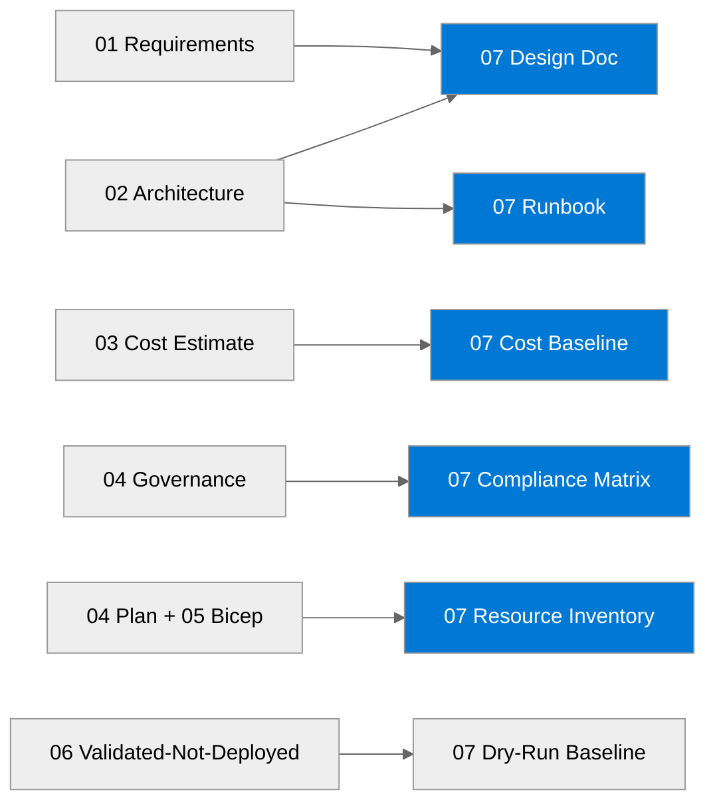

# 📚 Contoso Service Hub - Workload Documentation

<strong>📑 Documentation Contents</strong>

- [📦 1. Document Package Contents](#-1-document-package-contents)
- [📚 2. Source Artifacts](#-2-source-artifacts)
- [📋 3. Project Summary](#-3-project-summary)
- [🔗 4. Related Resources](#-4-related-resources)
- [⚡ 5. Quick Links](#-5-quick-links)

> Generated by 08-As-Built agent | 2026-04-01

| ⬅️ Previous                                          | 📑 Index            | Next ➡️                                        |
| ---------------------------------------------------- | ------------------- | ---------------------------------------------- |
| [06-deployment-summary.md](06-deployment-summary.md) | [README](README.md) | [07-design-document.md](07-design-document.md) |

**Generated**: 2026-04-01
**Version**: 1.0
**Status**: Validated design baseline for a dry-run deployment (`validated-not-deployed`)

---

## 📦 1. Document Package Contents

| Document | Description | Status |
| --- | --- | --- |
| [07-documentation-index.md](./07-documentation-index.md) | Master index for the Step 7 package |  |
| [07-design-document.md](./07-design-document.md) | Detailed technical design for the validated Azure baseline |  |
| [07-operations-runbook.md](./07-operations-runbook.md) | Day-2 operating model and incident procedures |  |
| [07-resource-inventory.md](./07-resource-inventory.md) | Inventory of validated resources, SKUs, regions, and tags |  |
| [07-backup-dr-plan.md](./07-backup-dr-plan.md) | Single-region backup and disaster recovery plan |  |
| [07-compliance-matrix.md](./07-compliance-matrix.md) | GDPR and PCI-DSS control mapping against the validated design |  |
| [07-ab-cost-estimate.md](./07-ab-cost-estimate.md) | Cost baseline for dev, staging, and prod using validated pricing inputs |  |

---

## 📚 2. Source Artifacts

These documents were generated from the following agentic workflow outputs and validated Bicep sources:

| Artifact | Source | Generated |
| --- | --- | --- |
| Requirements | [01-requirements.md](./01-requirements.md) | 2026-04-01 |
| WAF Assessment | [02-architecture-assessment.md](./02-architecture-assessment.md) | 2026-04-01 |
| Cost Estimate | [03-des-cost-estimate.md](./03-des-cost-estimate.md) | 2026-04-01 |
| ADR-001 | [03-des-adr-001-container-platform.md](./03-des-adr-001-container-platform.md) | 2026-04-01 |
| ADR-002 | [03-des-adr-002-caching-tier.md](./03-des-adr-002-caching-tier.md) | 2026-04-01 |
| ADR-003 | [03-des-adr-003-eu-data-boundary.md](./03-des-adr-003-eu-data-boundary.md) | 2026-04-01 |
| Governance Constraints | [04-governance-constraints.md](./04-governance-constraints.md) | 2026-04-01 |
| Implementation Plan | [04-implementation-plan.md](./04-implementation-plan.md) | 2026-04-01 |
| Deployment Summary | [06-deployment-summary.md](./06-deployment-summary.md) | 2026-04-01 |
| Bicep Templates | [../../infra/bicep/contoso-service-hub-run-1/](../../infra/bicep/contoso-service-hub-run-1/) | 2026-04-01 |

> Step 7 is based on validated infrastructure code and validation outputs. No live Azure resources were provisioned in this run.

---

## 📋 3. Project Summary

| Attribute | Value |
| --- | --- |
| **Project Name** | contoso-service-hub-run-1 |
| **Environment** | dev, staging, prod |
| **Primary Region** | swedencentral |
| **Compliance** | GDPR, PCI-DSS |
| **Monthly Cost** | ~$10,085/month baseline across all environments |

The Step 7 package documents the validated Bicep implementation for Contoso Service Hub. Because Step 6 completed as `validated-not-deployed`, every document in this package distinguishes between controls that are present in source code and controls that still require live deployment evidence.

---

## 🔗 4. Related Resources

- **Infrastructure Code**: [../../infra/bicep/contoso-service-hub-run-1/](../../infra/bicep/contoso-service-hub-run-1/)
- **Agent Outputs**: [./](./)
- **ADRs**: [03-des-adr-001-container-platform.md](./03-des-adr-001-container-platform.md), [03-des-adr-002-caching-tier.md](./03-des-adr-002-caching-tier.md), [03-des-adr-003-eu-data-boundary.md](./03-des-adr-003-eu-data-boundary.md)
- **Validated Deployment Summary**: [06-deployment-summary.md](./06-deployment-summary.md)

---

## ⚡ 5. Quick Links

- **Code**: [../../infra/bicep/contoso-service-hub-run-1/main.bicep](../../infra/bicep/contoso-service-hub-run-1/main.bicep) | [../../infra/bicep/contoso-service-hub-run-1/main.bicepparam](../../infra/bicep/contoso-service-hub-run-1/main.bicepparam) | [../../infra/bicep/contoso-service-hub-run-1/azure.yaml](../../infra/bicep/contoso-service-hub-run-1/azure.yaml)
- **Architecture**: [07-design-document.md](./07-design-document.md) | [03-des-architecture-diagram.png](./03-des-architecture-diagram.png) | [04-runtime-diagram.png](./04-runtime-diagram.png)
- **Operations**: [07-operations-runbook.md](./07-operations-runbook.md) | [07-backup-dr-plan.md](./07-backup-dr-plan.md)
- **Compliance & Cost**: [07-compliance-matrix.md](./07-compliance-matrix.md) | [07-ab-cost-estimate.md](./07-ab-cost-estimate.md)

---

_Documentation index generated by the As-Built agent for a validated dry-run baseline._

---

| ⬅️ [06-deployment-summary.md](06-deployment-summary.md) | 🏠 [Project Index](README.md) | ➡️ [07-design-document.md](07-design-document.md) |
| ------------------------------------------------------- | ----------------------------- | ------------------------------------------------- |

