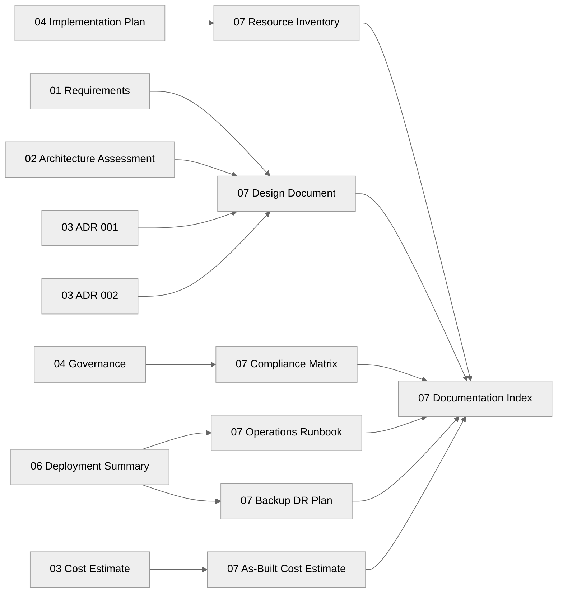

# 📚 Contoso Service Hub - Workload Documentation

<strong>📑 Documentation Contents</strong>

- [📦 1. Document Package Contents](#-1-document-package-contents)
- [📚 2. Source Artifacts](#-2-source-artifacts)
- [📋 3. Project Summary](#-3-project-summary)
- [🔗 4. Related Resources](#-4-related-resources)
- [⚡ 5. Quick Links](#-5-quick-links)

> Generated by 08-As-Built agent | 2026-03-16

| ⬅️ Previous                                          | 📑 Index               | Next ➡️                                        |
| ---------------------------------------------------- | ---------------------- | ---------------------------------------------- |
| [06-deployment-summary.md](06-deployment-summary.md) | [README.md](README.md) | [07-design-document.md](07-design-document.md) |

**Generated**: 2026-03-16
**Version**: 1.0
**Status**: Complete

---

## 📦 1. Document Package Contents

This Step 7 package documents the validated production design for Contoso Service Hub.
Because Step 6 completed as `validated-not-deployed`, the package records the approved
Bicep implementation baseline, expected operating model, and benchmarked cost envelope
rather than live Azure runtime state.

| Document                                                 | Description                                                                         | Status                                                        |
| -------------------------------------------------------- | ----------------------------------------------------------------------------------- | ------------------------------------------------------------- |
| [07-design-document.md](./07-design-document.md)         | Comprehensive technical design for the validated Azure platform                     |  |
| [07-operations-runbook.md](./07-operations-runbook.md)   | Day-2 procedures for deployment, monitoring, scaling, backup, and incident handling |  |
| [07-resource-inventory.md](./07-resource-inventory.md)   | Template-derived resource inventory across dev, staging, and prod                   |  |
| [07-backup-dr-plan.md](./07-backup-dr-plan.md)           | Backup retention, recovery targets, and single-region DR procedures                 |  |
| [07-compliance-matrix.md](./07-compliance-matrix.md)     | GDPR and governance control mapping against the validated design                    |  |
| [07-ab-cost-estimate.md](./07-ab-cost-estimate.md)       | Validated as-built cost baseline with PAYG and 3-year RI view                       |  |
| [07-documentation-index.md](./07-documentation-index.md) | Master index for all Step 7 artifacts and workflow inputs                           |  |

---

## 📚 2. Source Artifacts

The following workflow artifacts feed the Step 7 documentation set.

| Step | Artifact                  | File Path                                                                     | Description                                                                      |
| ---- | ------------------------- | ----------------------------------------------------------------------------- | -------------------------------------------------------------------------------- |
| 1    | Requirements              | `agent-output/contoso-service-hub-run-1/01-requirements.md`                   | RFP-derived functional, non-functional, compliance, and operational requirements |
| 2    | Architecture Assessment   | `agent-output/contoso-service-hub-run-1/02-architecture-assessment.md`        | WAF assessment, service selection, and target operating posture                  |
| 3    | ADR 001                   | `agent-output/contoso-service-hub-run-1/03-des-adr-001-container-platform.md` | Decision to standardize on AKS as the container platform                         |
| 3    | ADR 002                   | `agent-output/contoso-service-hub-run-1/03-des-adr-002-caching-tier.md`       | Decision to use Azure Managed Redis M100 for the 128 GB cache tier               |
| 3    | Design Cost Estimate      | `agent-output/contoso-service-hub-run-1/03-des-cost-estimate.md`              | Initial cost model used during architecture selection                            |
| 3    | Design Diagram Source     | `agent-output/contoso-service-hub-run-1/03-des-diagram.py`                    | Python source for the approved design diagram                                    |
| 3    | Design Diagram Image      | `agent-output/contoso-service-hub-run-1/03-des-diagram.png`                   | Rendered design diagram used as the visual reference baseline                    |
| 4    | Governance Constraints    | `agent-output/contoso-service-hub-run-1/04-governance-constraints.md`         | Live tenant policy findings and implementation constraints                       |
| 4    | Governance JSON           | `agent-output/contoso-service-hub-run-1/04-governance-constraints.json`       | Machine-readable governance baseline                                             |
| 4    | Implementation Plan       | `agent-output/contoso-service-hub-run-1/04-implementation-plan.md`            | Approved phased Bicep implementation plan                                        |
| 4    | Dependency Diagram Source | `agent-output/contoso-service-hub-run-1/04-dependency-diagram.py`             | Dependency view for planned resources                                            |
| 4    | Dependency Diagram Image  | `agent-output/contoso-service-hub-run-1/04-dependency-diagram.png`            | Rendered dependency diagram                                                      |
| 4    | Runtime Diagram Source    | `agent-output/contoso-service-hub-run-1/04-runtime-diagram.py`                | Runtime interaction model for the approved design                                |
| 4    | Runtime Diagram Image     | `agent-output/contoso-service-hub-run-1/04-runtime-diagram.png`               | Rendered runtime diagram                                                         |
| 5    | Bicep Orchestrator        | `infra/bicep/contoso-service-hub-run-1/main.bicep`                            | Main Bicep orchestrator defining naming, phasing, and outputs                    |
| 5    | Bicep Parameters          | `infra/bicep/contoso-service-hub-run-1/main.bicepparam`                       | Environment parameter baseline                                                   |
| 6    | Deployment Summary        | `agent-output/contoso-service-hub-run-1/06-deployment-summary.md`             | Dry-run validation results and expected deployed outputs                         |
| 7    | Documentation Index       | `agent-output/contoso-service-hub-run-1/07-documentation-index.md`            | Master index of the documentation suite                                          |
| 7    | Design Document           | `agent-output/contoso-service-hub-run-1/07-design-document.md`                | Technical design reference for the validated target state                        |
| 7    | Operations Runbook        | `agent-output/contoso-service-hub-run-1/07-operations-runbook.md`             | Operational procedures and maintenance guidance                                  |
| 7    | Resource Inventory        | `agent-output/contoso-service-hub-run-1/07-resource-inventory.md`             | Environment-by-environment resource catalog                                      |
| 7    | Backup and DR Plan        | `agent-output/contoso-service-hub-run-1/07-backup-dr-plan.md`                 | Recovery objectives, backup policies, and DR runbooks                            |
| 7    | Compliance Matrix         | `agent-output/contoso-service-hub-run-1/07-compliance-matrix.md`              | Control mapping and remediation tracking                                         |
| 7    | As-Built Cost Estimate    | `agent-output/contoso-service-hub-run-1/07-ab-cost-estimate.md`               | Validated cost baseline and optimization view                                    |

---

## 📋 3. Project Summary

| Attribute                    | Value                                                              |
| ---------------------------- | ------------------------------------------------------------------ |
| **Project Name**             | Contoso Service Hub                                                |
| **Project Folder**           | `agent-output/contoso-service-hub-run-1/`                          |
| **IaC Tool**                 | Bicep                                                              |
| **Primary Region**           | `swedencentral`                                                    |
| **Environments**             | dev, staging, prod                                                 |
| **Architecture Pattern**     | N-Tier Web + AKS Container (Enterprise)                            |
| **Compliance Scope**         | GDPR mandatory, SAQ-A PCI-DSS boundary, tenant governance policies |
| **Deployment State**         | Dry-run validated, not deployed                                    |
| **Validated Monthly Cost**   | €8,547 PAYG                                                        |
| **Validated 3-Year RI Cost** | €7,047                                                             |
| **Primary Decisions**        | AKS, Azure Managed Redis M100, APIM Premium v2, Entra External ID  |

---

## 🔗 4. Related Resources

- **Infrastructure Code**: [`../../infra/bicep/contoso-service-hub-run-1/`](../../infra/bicep/contoso-service-hub-run-1/)
- **Design Diagram**: [03-des-diagram.png](./03-des-diagram.png)
- **Dependency Diagram**: [04-dependency-diagram.png](./04-dependency-diagram.png)
- **Runtime Diagram**: [04-runtime-diagram.png](./04-runtime-diagram.png)
- **Project README**: [README.md](./README.md)

---

## ⚡ 5. Quick Links

- **Validated Design**: [07-design-document.md](./07-design-document.md)
- **Runbook**: [07-operations-runbook.md](./07-operations-runbook.md)
- **Inventory**: [07-resource-inventory.md](./07-resource-inventory.md)
- **Compliance**: [07-compliance-matrix.md](./07-compliance-matrix.md)
- **Backup / DR**: [07-backup-dr-plan.md](./07-backup-dr-plan.md)
- **Cost Baseline**: [07-ab-cost-estimate.md](./07-ab-cost-estimate.md)

---

_Documentation index generated from validated workflow artifacts and Bicep source._
