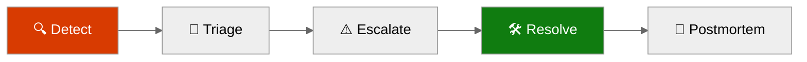
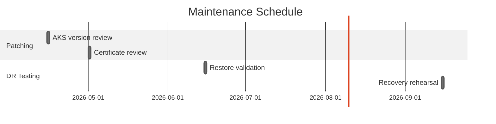
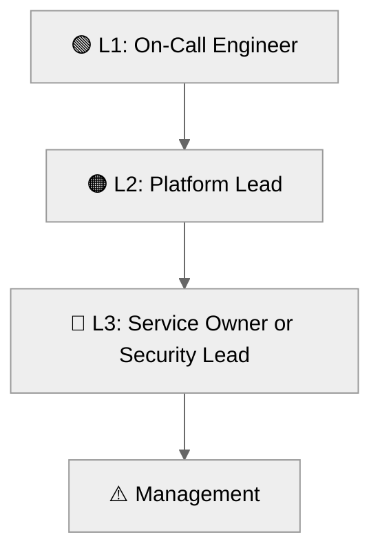

# 📖 Operations Runbook: Contoso Service Hub


<details open>
<summary><strong>📑 Runbook Contents</strong></summary>

- [⚡ Quick Reference](#-quick-reference)
- [📋 1. Daily Operations](#-1-daily-operations)
- [🚨 2. Incident Response](#-2-incident-response)
- [🔧 3. Common Procedures](#-3-common-procedures)
- [🕐 4. Maintenance Windows](#-4-maintenance-windows)
- [📞 5. Contacts & Escalation](#-5-contacts--escalation)
- [📝 6. Change Log](#-6-change-log)
- [References](#references)

</details>

> Generated by 08-As-Built agent | 2026-04-01

| ⬅️ Previous                                    | 📑 Index            | Next ➡️                                              |
| ---------------------------------------------- | ------------------- | ---------------------------------------------------- |
| [07-design-document.md](07-design-document.md) | [README](README.md) | [07-resource-inventory.md](07-resource-inventory.md) |

**Version**: 1.0
**Date**: 2026-04-01
**Environment**: dev, staging, prod
**Region**: swedencentral

---

## ⚡ Quick Reference

| Item | Value |
| --- | --- |
| **Primary Region** | swedencentral |
| **Resource Group** | `rg-contoso-svchub-<env>` |
| **Support Contact** | platform@contoso.com |
| **Escalation Path** | On-call platform engineer → Platform lead → Security lead or service owner → Contoso business sponsor |

### Critical Resources

| Resource | Name | Resource Group | Severity |
| --- | --- | --- | --- |
| Application Gateway WAF | `agw-contoso-svchub-<env>` | `rg-contoso-svchub-<env>` | 🔴 P1 |
| API Management | `apim-contoso-svchub-<env>-<suffix>` | `rg-contoso-svchub-<env>` | 🔴 P1 |
| AKS Cluster | `aks-contoso-svchub-<env>` | `rg-contoso-svchub-<env>` | 🔴 P1 |
| PostgreSQL Flexible Server | `psql-contoso-svchub-<env>-<suffix>` | `rg-contoso-svchub-<env>` | 🔴 P1 |
| Redis Enterprise | `redis-contoso-svchub-<env>` | `rg-contoso-svchub-<env>` | 🟠 P2 |
| Key Vault | `kv-csh-<env>-<suffix>` | `rg-contoso-svchub-<env>` | 🟠 P2 |
| Log Analytics Workspace | `log-contoso-svchub-<env>` | `rg-contoso-svchub-<env>` | 🟢 P3 |

---

## 📋 1. Daily Operations

### 1.1 Health Checks

**Morning Health Check:**

1. Confirm the most recent deployment or validation outcome in [06-deployment-summary.md](./06-deployment-summary.md) and verify no new governance blockers were introduced after the last template update.
2. Review Azure Monitor ingestion, budget threshold notifications, and diagnostic settings coverage for the environment being operated.
3. Confirm WAF policy state, APIM availability, AKS node pool health, PostgreSQL connectivity, Redis connectivity, and Key Vault reachability from the private network.

**KQL Query - System Health Overview:**

<details>
<summary><strong>📊 Health Check KQL</strong></summary>

```kusto
AzureActivity
| where TimeGenerated > ago(24h)
| where ResourceGroup startswith "rg-contoso-svchub-"
| summarize OperationCount = count() by ActivityStatusValue, ResourceProviderValue
| order by OperationCount desc
```

</details>

### 1.2 Log Review

**Priority Logs to Review:**

| Log Source | Query Focus | Action Threshold |
| --- | --- | --- |
| Application Gateway access and firewall logs | Unexpected surge in blocked requests, backend health changes, or listener failures | Any sustained 5xx pattern or WAF anomaly for more than 5 minutes |
| API Management gateway logs | Backend errors, policy failures, latency spikes | p95 latency above 500 ms or repeated 429 or 5xx responses |
| AKS Container Insights | Node pressure, failed pods, restart loops, ingress failures | More than 3 restarts per workload in 15 minutes |
| PostgreSQL diagnostics | Auth failures, connection saturation, storage growth | Failed auth burst or storage growth outside forecast |
| Budget notifications | Forecast crossing 80%, 100%, or 120% | Any alert above forecast 80% requires review |

---

## 🚨 2. Incident Response

### 2.1 Severity Definitions

| Severity | Definition | Response Time |
| --- | --- | --- |
| 🔴 P1 | Customer-facing outage, data-path failure, or inability to process core transactions | 15 minutes |
| 🟠 P2 | Material degradation with workaround or partial loss of a supporting platform dependency | 1 hour |
| 🟢 P3 | Non-critical issue, validation defect, or operational debt item without immediate customer impact | 1 business day |

### Incident Response Flow



### 2.2 Runbooks by Alert

| Alert | Runbook | Owner |
| --- | --- | --- |
| App Gateway health probe failure | Validate backend pool, ingress service, and certificate configuration before restarting the ingress path | Platform Engineering |
| APIM 5xx increase | Check backend dependency status, APIM diagnostic logs, and recent policy changes | API Platform Owner |
| AKS node or pod instability | Inspect node pressure, rollout status, and HPA events; then restart or scale as needed | SRE |
| PostgreSQL connection or auth failure | Validate Entra auth path, private DNS resolution, and restore posture | Data Platform Owner |
| Redis unavailability | Validate private endpoint, DNS resolution, and cache availability zone status | Platform Engineering |
| Budget forecast breach | Review recent scaling or diagnostics changes and decide whether to constrain non-prod or approve budget headroom | Platform Lead |

---

## 🔧 3. Common Procedures

### 3.1 Restart Services

<details>
<summary>🔧 Restart AKS Workload</summary>

```bash
ENV=prod
RESOURCE_GROUP="rg-contoso-svchub-${ENV}"
CLUSTER_NAME="aks-contoso-svchub-${ENV}"
NAMESPACE=platform
DEPLOYMENT=service-hub-api

az aks get-credentials --resource-group "$RESOURCE_GROUP" --name "$CLUSTER_NAME" --overwrite-existing
kubectl rollout restart deployment/"$DEPLOYMENT" -n "$NAMESPACE"
kubectl rollout status deployment/"$DEPLOYMENT" -n "$NAMESPACE" --timeout=5m
```

</details>

### 3.2 Scale Resources

<details>
<summary>📈 Scale Up/Out Commands</summary>

```bash
ENV=prod
RESOURCE_GROUP="rg-contoso-svchub-${ENV}"
CLUSTER_NAME="aks-contoso-svchub-${ENV}"

az aks nodepool scale \
  --resource-group "$RESOURCE_GROUP" \
  --cluster-name "$CLUSTER_NAME" \
  --name userpool \
  --node-count 4
```

</details>

Operational note: the validated templates already enable autoscaling. Manual scaling is a controlled exception, usually for incident mitigation, load testing, or change windows.

---

## 🕐 4. Maintenance Windows

| Task | Schedule | Duration |
| --- | --- | --- |
| AKS version and node image review | Monthly, second Tuesday | 2 hours |
| Key Vault certificate and secret rotation review | Monthly, first business day | 1 hour |
| PostgreSQL restore verification | Quarterly | 2 hours |
| Redis failover and cache behavior validation | Quarterly | 1 hour |
| Full single-region recovery rehearsal | Semi-annual | 4 hours |



> Maintenance windows remain planned until the first live deployment. Align the exact dates to Contoso’s business calendar before go-live.

> [!TIP]
> 💡 Complete HTTPS listener and certificate integration on Application Gateway before the first external validation test. The current template is not go-live ready until that is in place.

---

## 📞 5. Contacts & Escalation

| Role | Contact | Phone | On-Call Rotation |
| --- | --- | --- | --- |
| On-call Platform Engineer | platform@contoso.com | N/A in dry-run | Weekly rotation |
| Platform Lead | platform-lead@contoso.com | N/A in dry-run | Primary escalation |
| Security Lead | security@contoso.com | N/A in dry-run | As needed for GDPR or PCI-DSS issues |
| Product Sponsor | digital-services@contoso.com | N/A in dry-run | Business approval path |

### Escalation Path



---

## 📝 6. Change Log

| Date | Change | Author |
| --- | --- | --- |
| 2026-04-01 | Initial Step 7 operations runbook generated from validated Bicep design and dry-run deployment summary | 08-As-Built |

---

## References

> [!NOTE]
> 📚 The following Microsoft Learn resources provide operational guidance.

| Topic | Link |
| --- | --- |
| Azure Monitor Alerts | [Alerting Best Practices](https://learn.microsoft.com/azure/azure-monitor/best-practices-alerts) |
| Log Analytics Queries | [KQL Reference](https://learn.microsoft.com/azure/azure-monitor/logs/get-started-queries) |
| Incident Management | [Azure Status](https://status.azure.com/) |
| Service Health | [Azure Service Health](https://learn.microsoft.com/azure/service-health/overview) |

---

_Operations runbook generated from validated infrastructure artifacts and intended for go-live preparation._

---

<div align="center">

| ⬅️ [07-design-document.md](07-design-document.md) | 🏠 [Project Index](README.md) | ➡️ [07-resource-inventory.md](07-resource-inventory.md) |
| ------------------------------------------------- | ----------------------------- | ------------------------------------------------------- |

</div>