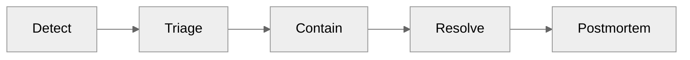
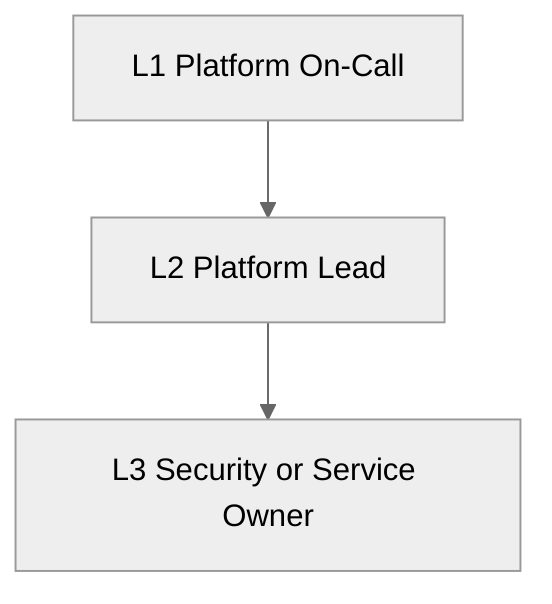

# 📖 Operations Runbook: Contoso Service Hub


<details open>
<summary><strong>📑 Runbook Contents</strong></summary>

- [⚡ Quick Reference](#-quick-reference)
- [📋 1. Daily Operations](#-1-daily-operations)
- [🚨 2. Incident Response](#-2-incident-response)
- [🔧 3. Common Procedures](#-3-common-procedures)
- [🕐 4. Maintenance Windows](#-4-maintenance-windows)
- [📞 5. Contacts & Escalation](#-5-contacts--escalation)
- [📝 6. Change Log](#-6-change-log)
- [References](#references)

</details>

> Generated by 08-As-Built agent | 2026-03-16

| ⬅️ Previous                                    | 📑 Index               | Next ➡️                                              |
| ---------------------------------------------- | ---------------------- | ---------------------------------------------------- |
| [07-design-document.md](07-design-document.md) | [README.md](README.md) | [07-resource-inventory.md](07-resource-inventory.md) |

**Version**: 1.0
**Date**: 2026-03-16
**Environment**: dev, staging, prod
**Region**: swedencentral

---

## ⚡ Quick Reference

| Item                | Value                                                                                         |
| ------------------- | --------------------------------------------------------------------------------------------- |
| **Primary Region**  | `swedencentral`                                                                               |
| **Resource Groups** | `rg-contoso-service-hub-dev`, `rg-contoso-service-hub-staging`, `rg-contoso-service-hub-prod` |
| **Support Contact** | `platform-engineering@contoso.local`                                                          |
| **Escalation Path** | L1 Platform On-Call → L2 Platform Lead → L3 Security / Service Owner                          |

### Critical Resources

| Resource           | Name Pattern                    | Resource Group                | Severity |
| ------------------ | ------------------------------- | ----------------------------- | -------- |
| Edge ingress       | `afd-contoso-service-hub-prod`  | `rg-contoso-service-hub-prod` | 🔴 P1    |
| API gateway        | `apim-contoso-service-hub-prod` | `rg-contoso-service-hub-prod` | 🔴 P1    |
| Container platform | `aks-contoso-service-hub-prod`  | `rg-contoso-service-hub-prod` | 🔴 P1    |
| Primary database   | `psql-contoso-prod-<suffix>`    | `rg-contoso-service-hub-prod` | 🔴 P1    |
| Primary cache      | `redis-contoso-prod-<suffix>`   | `rg-contoso-service-hub-prod` | 🔴 P1    |

---

## 📋 1. Daily Operations

### 1.1 Health Checks

**Morning Health Check:**

1. Confirm Azure Monitor alerts are green for Front Door, APIM, AKS, PostgreSQL, and Redis.
2. Confirm Log Analytics ingestion and Application Insights availability for the last 24 hours.
3. Confirm private endpoint DNS resolution and Key Vault secret retrieval from the platform subnets.

**KQL Query - System Health Overview:**

```kusto
let startTime = ago(24h);
union isfuzzy=true
    AzureDiagnostics,
    AppRequests,
    AppExceptions
| where TimeGenerated >= startTime
| summarize Events = count(), Failures = countif(tostring(ResultType) !in ("Success", "200", "201", "202")) by bin(TimeGenerated, 1h), ResourceProvider
| order by TimeGenerated desc
```

### 1.2 Log Review

<details>
<summary><strong>Daily Operations Checklist</strong></summary>

Use the production checklist first, then apply the same pattern to staging and dev if a release or incident warrants it.

</details>

| Log Source               | Query Focus                                     | Action Threshold                                                       |
| ------------------------ | ----------------------------------------------- | ---------------------------------------------------------------------- |
| Front Door / WAF         | Blocked requests, rate-limit hits, bot activity | Investigate if spikes exceed normal campaign traffic                   |
| API Management           | 5xx rate, latency, backend failures             | Investigate when 5xx > 1% or p95 > 500 ms                              |
| AKS / Container Insights | Pod restarts, node pressure, autoscaler events  | Investigate when restart loops or CPU saturation persists > 10 min     |
| PostgreSQL               | Connection saturation, failover, storage growth | Investigate when utilization > 80% or connections > planned pool limit |
| Redis                    | Memory pressure, eviction rate, failover        | Investigate if eviction or connection failures appear in production    |

---

## 🚨 2. Incident Response

### 2.1 Severity Definitions

| Severity | Definition                                                                        | Response Time  |
| -------- | --------------------------------------------------------------------------------- | -------------- |
| 🔴 P1    | Production outage, security event, or checkout / booking path unavailable         | 15 minutes     |
| 🟠 P2    | Production degradation with workaround, staging outage during release window      | 1 hour         |
| 🟢 P3    | Non-production issue, isolated operational defect, documentation or tooling fault | 1 business day |

### Incident Response Flow



### 2.2 Runbooks by Alert

<details>
<summary><strong>Immediate P1 Triage Actions</strong></summary>

1. Confirm customer impact and affected environment.
2. Freeze production changes.
3. Assign an incident commander and communications lead.
4. Capture timestamps for first detection, escalation, and mitigation.

</details>

| Alert                         | Runbook                                                                          | Owner                |
| ----------------------------- | -------------------------------------------------------------------------------- | -------------------- |
| Front Door endpoint unhealthy | Validate APIM origin, WAF policy, and DNS routing                                | Platform Operations  |
| APIM 5xx spike                | Check backend connectivity to AKS and Key Vault dependencies                     | Platform Engineering |
| AKS node pool saturation      | Execute AKS scale procedure and inspect failing workloads                        | SRE                  |
| PostgreSQL HA failover        | Validate server health, connection pool settings, and application retry behavior | Database Owner       |
| Redis memory pressure         | Review hit ratio, eviction, and cache sizing; scale or clear non-critical keys   | Platform Engineering |

---

## 🔧 3. Common Procedures

### 3.1 Restart Services

**Reapply the validated Bicep baseline for a failed deployment phase:**

```bash
az deployment group create \
  --resource-group rg-contoso-service-hub-prod \
  --template-file infra/bicep/contoso-service-hub-run-1/main.bicep \
  --parameters environment=prod location=swedencentral deployPhase=4
```

### 3.2 Scale Resources

**AKS cluster autoscaler baseline:**

```bash
az aks nodepool update \
  --resource-group rg-contoso-service-hub-prod \
  --cluster-name aks-contoso-service-hub-prod \
  --name workload \
  --min-count 3 \
  --max-count 6 \
  --enable-cluster-autoscaler
```

**PostgreSQL scale-up example:**

```bash
az postgres flexible-server update \
  --resource-group rg-contoso-service-hub-prod \
  --name psql-contoso-prod-<suffix> \
  --sku-name Standard_D8s_v5
```

**Phased deployment procedure:**

1. Deploy Phase 1 Foundation: monitoring, networking, Key Vault, budget.
2. Deploy Phase 2 Data: PostgreSQL, Redis, storage, and private endpoints.
3. Deploy Phase 3 Edge: APIM, Front Door, WAF, and identity roles.
4. Deploy Phase 4 Platform: AKS and management VM.
5. Validate outputs, private DNS, secret access, and monitor health before moving to the next phase.

### 3.3 Backup and Restore Procedures

| Service      | Procedure                                                                                             |
| ------------ | ----------------------------------------------------------------------------------------------------- |
| PostgreSQL   | Use point-in-time restore to a sidecar server, validate data, then cut over application configuration |
| Redis        | Restore from the latest approved snapshot and warm cache-critical datasets                            |
| Azure Files  | Recover the file share from the latest backup restore point                                           |
| Blob Storage | Recover via versioning / soft delete before escalating to data-team reconstruction                    |

---

## 🕐 4. Maintenance Windows

| Task                            | Schedule                                                            | Duration      |
| ------------------------------- | ------------------------------------------------------------------- | ------------- |
| Production platform maintenance | Weekends, 02:00-06:00 UTC                                           | 4 hours       |
| Staging maintenance             | Weekdays or weekends by release plan                                | Up to 4 hours |
| Dev maintenance                 | On demand                                                           | Flexible      |
| AKS Kubernetes patch window     | First eligible production maintenance window after patch validation | Up to 2 hours |
| PostgreSQL planned scaling      | Weekend production window only                                      | 1-2 hours     |

Maintenance window rules:

- Use staging to validate Kubernetes, APIM, and database changes before production.
- Freeze non-essential releases during production maintenance.
- Reconfirm backup completion before any disruptive change.

---

## 📞 5. Contacts & Escalation

| Role                  | Contact                              | Phone | On-Call Rotation                        |
| --------------------- | ------------------------------------ | ----- | --------------------------------------- |
| Platform On-Call      | `platform-engineering@contoso.local` | N/A   | 24/7 production rotation                |
| Platform Lead         | `platform-lead@contoso.local`        | N/A   | Escalation only                         |
| Security / Compliance | `security@contoso.local`             | N/A   | Escalation for incidents or GDPR events |
| Database Owner        | `data-platform@contoso.local`        | N/A   | Business hours + P1 callout             |

### Escalation Path



---

## 📝 6. Change Log

| Date       | Change                                                                                           | Author            |
| ---------- | ------------------------------------------------------------------------------------------------ | ----------------- |
| 2026-03-16 | Initial Step 7 operations runbook generated from validated design and dry-run deployment outputs | 08-As-Built agent |

---

## References

| Topic                 | Link                                                                                             |
| --------------------- | ------------------------------------------------------------------------------------------------ |
| Azure Monitor Alerts  | [Alerting Best Practices](https://learn.microsoft.com/azure/azure-monitor/best-practices-alerts) |
| Log Analytics Queries | [KQL Reference](https://learn.microsoft.com/azure/azure-monitor/logs/get-started-queries)        |
| Incident Management   | [Azure Status](https://status.azure.com/)                                                        |
| Service Health        | [Azure Service Health](https://learn.microsoft.com/azure/service-health/overview)                |

---

_Operations runbook generated from validated infrastructure artifacts._
