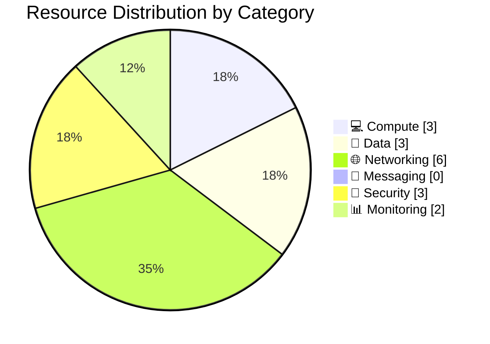

# 📦 Resource Inventory: Contoso Service Hub

<strong>📑 Inventory Contents</strong>

- [📊 Summary](#-summary)
- [📦 Resource Listing](#-resource-listing)
- [References](#references)

> Generated by 08-As-Built agent | 2026-04-01

| ⬅️ Previous                                          | 📑 Index            | Next ➡️                                      |
| ---------------------------------------------------- | ------------------- | -------------------------------------------- |
| [07-operations-runbook.md](07-operations-runbook.md) | [README](README.md) | [07-backup-dr-plan.md](07-backup-dr-plan.md) |

**Generated**: 2026-04-01
**Source**: Infrastructure as Code (Bicep)
**Environment**: dev, staging, prod
**Region**: swedencentral primary, with DNS resources created as Azure global services where required

---

## 📊 Summary

| Category | Count |
| --- | --- |
| **Total Resources** | 17 resource types |
| 💻 Compute | 3 |
| 💾 Data Services | 3 |
| 🌐 Networking | 6 |
| 📨 Messaging | 0 |
| 🔐 Security | 3 |
| 📊 Monitoring | 2 |

### Governance Tag Set

All validated resources inherit the same mandatory tags from [main.bicep](../../infra/bicep/contoso-service-hub-run-1/main.bicep):

| Tag | Value |
| --- | --- |
| `Environment` | `dev`, `staging`, or `prod` |
| `ManagedBy` | `Bicep` |
| `Project` | `contoso-service-hub` |
| `Owner` | `Contoso` |

### Naming Notes

- Several resources include a deterministic four-character suffix derived from subscription ID, project name, and environment.
- Because this run did not deploy into Azure, those suffixes are documented as `<suffix>` in the inventory rather than fabricated.
- Public DNS zone names are parameterized; only the dev value `dev.contoso-svchub.com` is committed in source today.

---

## 📦 Resource Listing

### 💻 Compute Resources

| Name | Type | SKU | Location | Monthly Cost | Purpose | Portal |
| --- | --- | --- | --- | --- | --- | --- |
| `aks-contoso-svchub-dev` | `Microsoft.ContainerService/managedClusters` | Free control plane, `Standard_D4s_v5` node pools | swedencentral | Included in dev subtotal | Primary non-production application platform | Available after deployment |
| `aks-contoso-svchub-staging` | `Microsoft.ContainerService/managedClusters` | Free control plane, `Standard_D4s_v5` node pools | swedencentral | Included in staging subtotal | Pre-production validation platform | Available after deployment |
| `aks-contoso-svchub-prod` | `Microsoft.ContainerService/managedClusters` | Standard control plane, `Standard_D4s_v5` system and user pools | swedencentral | $633 | Primary production application platform | Available after deployment |
| `apim-contoso-svchub-dev-<suffix>` | `Microsoft.ApiManagement/service` | Developer | swedencentral | Included in dev subtotal | API gateway and policy surface for development | Available after deployment |
| `apim-contoso-svchub-staging-<suffix>` | `Microsoft.ApiManagement/service` | Developer | swedencentral | Included in staging subtotal | Pre-production API validation | Available after deployment |
| `apim-contoso-svchub-prod-<suffix>` | `Microsoft.ApiManagement/service` | StandardV2 | swedencentral | $700 | Production API gateway | Available after deployment |
| `vm-contoso-svchub-dev` | `Microsoft.Compute/virtualMachines` | `Standard_D4s_v5` | swedencentral | Included in dev subtotal | Utility or operational workload host | Available after deployment |
| `vm-contoso-svchub-staging` | `Microsoft.Compute/virtualMachines` | `Standard_D4s_v5` | swedencentral | Included in staging subtotal | Staging support host | Available after deployment |
| `vm-contoso-svchub-prod` | `Microsoft.Compute/virtualMachines` | `Standard_D8s_v5` | swedencentral | $330 | Production utility or jump workload host | Available after deployment |

### 💾 Data Services

| Name | Type | SKU | Configuration | Location | Monthly Cost |
| --- | --- | --- | --- | --- | --- |
| `psql-contoso-svchub-dev-<suffix>` | `Microsoft.DBforPostgreSQL/flexibleServers` | `Standard_D2s_v3` | 32 GiB storage, Entra-only auth, no public access, 35-day backup retention | swedencentral | Included in dev subtotal |
| `psql-contoso-svchub-staging-<suffix>` | `Microsoft.DBforPostgreSQL/flexibleServers` | `Standard_D2s_v3` | 128 GiB storage, Entra-only auth, no public access, 35-day backup retention | swedencentral | Included in staging subtotal |
| `psql-contoso-svchub-prod-<suffix>` | `Microsoft.DBforPostgreSQL/flexibleServers` | `Standard_D4s_v3` | 256 GiB storage, zone-redundant HA, Entra-only auth, 35-day backup retention | swedencentral | $520 |
| `redis-contoso-svchub-dev` | `Microsoft.Cache/redisEnterprise` | `Enterprise_E10` | Private endpoint, TLS 1.2 minimum | swedencentral | Included in dev subtotal |
| `redis-contoso-svchub-staging` | `Microsoft.Cache/redisEnterprise` | `Enterprise_E10` | Private endpoint, TLS 1.2 minimum | swedencentral | Included in staging subtotal |
| `redis-contoso-svchub-prod` | `Microsoft.Cache/redisEnterprise` | `Enterprise_E100` | 128 GiB native cache, zonal placement, TLS 1.2 minimum | swedencentral | $3,580 |
| `stcshdev<suffix>` | `Microsoft.Storage/storageAccounts` | `Standard_LRS` | Blob containers `content`, `uploads`, `backups`; file share `appshare`; HTTPS-only | swedencentral | Included in dev subtotal |
| `stcshstaging<suffix>` | `Microsoft.Storage/storageAccounts` | `Standard_LRS` | Blob containers `content`, `uploads`, `backups`; file share `appshare`; HTTPS-only | swedencentral | Included in staging subtotal |
| `stcshprod<suffix>` | `Microsoft.Storage/storageAccounts` | `Standard_ZRS` | Blob containers `content`, `uploads`, `backups`; file share `appshare`; HTTPS-only | swedencentral | $8 storage plus file-share and disk charges in prod subtotal |

### 🌐 Networking Resources

| Name | Type | Configuration | Location |
| --- | --- | --- | --- |
| `vnet-contoso-svchub-<env>` | `Microsoft.Network/virtualNetworks` | `10.0.0.0/16` with compute, data, app gateway, private endpoint, APIM, and AKS subnets | swedencentral |
| `nsg-compute-<env>`, `nsg-data-<env>`, `nsg-appgw-<env>`, `nsg-pe-<env>` | `Microsoft.Network/networkSecurityGroups` | Deny-by-default segmentation with ingress rules only where platform dependencies require them | swedencentral |
| `privatelink.postgres.database.azure.com` | `Microsoft.Network/privateDnsZones` | Private DNS zone linked to the workload VNet | global |
| `privatelink.redisenterprise.cache.azure.net` | `Microsoft.Network/privateDnsZones` | Private DNS zone linked to the workload VNet | global |
| `privatelink.vaultcore.azure.net`, `privatelink.blob.core.windows.net`, `privatelink.file.core.windows.net`, `privatelink.swedencentral.azmk8s.io` | `Microsoft.Network/privateDnsZones` | Private DNS zones for Key Vault, Blob, Files, and AKS private API | global |
| `wafpol-contoso-svchub-<env>` | `Microsoft.Network/ApplicationGatewayWebApplicationFirewallPolicies` | Prevention mode, OWASP 3.2, attached to App Gateway | swedencentral |
| `agw-contoso-svchub-<env>` | `Microsoft.Network/applicationGateways` | WAF_v2 autoscale, public frontend IP, HTTPS backend settings, HTTP listener awaiting certificate-enabled HTTPS listener | swedencentral |
| `pip-agw-contoso-svchub-<env>` | `Microsoft.Network/publicIPAddresses` | Standard public IP for regional ingress | swedencentral |
| `publicDnsZoneName` parameter | `Microsoft.Network/dnsZones` | Dev value committed as `dev.contoso-svchub.com`; staging and prod remain parameter inputs | global |

### 📨 Messaging Resources

| Name | Type | SKU | Configuration | Location |
| --- | --- | --- | --- | --- |
| No dedicated messaging service in validated scope | N/A | N/A | Messaging and notification integrations are expected to be handled through application services and partner APIs, not a dedicated Azure messaging broker in this baseline | N/A |

### 🔐 Security Resources

| Name | Type | Configuration | Location |
| --- | --- | --- | --- |
| `id-contoso-svchub-<env>` | `Microsoft.ManagedIdentity/userAssignedIdentities` | Shared user-assigned managed identity for platform components | swedencentral |
| `kv-csh-<env>-<suffix>` | `Microsoft.KeyVault/vaults` | RBAC auth, purge protection enabled, 90-day soft delete retention, private access only | swedencentral |
| `budget-contoso-svchub-<env>` | `Microsoft.Consumption/budgets` | Monthly budget thresholds with alerting; dev committed at $1,500, staging planned at $2,100, prod planned at $7,500 | global |

### 📊 Monitoring Resources

| Name | Type | Retention | Location |
| --- | --- | --- | --- |
| `log-contoso-svchub-<env>` | `Microsoft.OperationalInsights/workspaces` | 90 days | swedencentral |
| `appi-contoso-svchub-<env>` | `Microsoft.Insights/components` | Workspace-based Application Insights retention governed by Log Analytics | swedencentral |

---

> The chart reflects validated resource types, not live instance counts in Azure.

---

## References

| Topic | Link |
| --- | --- |
| Azure Resource Types | [Resource Providers](https://learn.microsoft.com/azure/azure-resource-manager/management/resource-providers-and-types) |
| Naming Conventions | [CAF Naming](https://learn.microsoft.com/azure/cloud-adoption-framework/ready/azure-best-practices/resource-naming) |
| Pricing Calculator | [Azure Pricing](https://azure.microsoft.com/pricing/calculator/) |

---

_Resource inventory generated from validated Bicep templates and parameter defaults._

---

| ⬅️ [07-operations-runbook.md](07-operations-runbook.md) | 🏠 [Project Index](README.md) | ➡️ [07-backup-dr-plan.md](07-backup-dr-plan.md) |
| ------------------------------------------------------- | ----------------------------- | ----------------------------------------------- |

