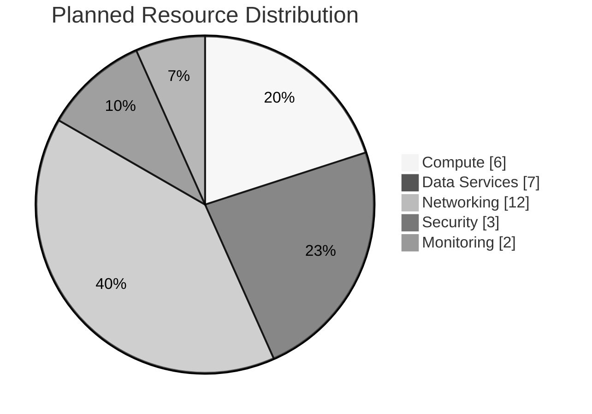

# 📦 Resource Inventory: Contoso Service Hub

<strong>📑 Inventory Contents</strong>

- [📊 Summary](#-summary)
- [📦 Resource Listing](#-resource-listing)
- [References](#references)

> Generated by 08-As-Built agent | 2026-03-16

| ⬅️ Previous                                          | 📑 Index               | Next ➡️                                      |
| ---------------------------------------------------- | ---------------------- | -------------------------------------------- |
| [07-operations-runbook.md](07-operations-runbook.md) | [README.md](README.md) | [07-backup-dr-plan.md](07-backup-dr-plan.md) |

**Generated**: 2026-03-16
**Source**: Infrastructure as Code (Bicep) and validated deployment plan
**Environment**: dev, staging, prod
**Region**: swedencentral

---

## 📊 Summary

This inventory is template-derived because the platform has not been deployed yet.
Resource names shown as `<suffix>` values are generated from `uniqueString(resourceGroup().id)`.

| Category                          | Count |
| --------------------------------- | ----- |
| **Total Planned Azure Resources** | 28+   |
| 💻 Compute                        | 6     |
| 💾 Data Services                  | 7     |
| 🌐 Networking                     | 12+   |
| 📨 Messaging                      | 0     |
| 🔐 Security                       | 3     |
| 📊 Monitoring                     | 2     |

**Standard tag set applied to every ARM resource**

| Tag Key             | Value Pattern                                 |
| ------------------- | --------------------------------------------- |
| `Environment`       | `dev`, `staging`, `prod`                      |
| `ManagedBy`         | `Bicep`                                       |
| `Project`           | `contoso-service-hub`                         |
| `Owner`             | `Platform-Engineering`                        |
| `environment`       | environment name                              |
| `owner`             | `Platform-Engineering`                        |
| `costcenter`        | `platform-engineering`                        |
| `application`       | `contoso-service-hub`                         |
| `workload`          | `service-hub`                                 |
| `sla`               | `99.9` for prod, `99.5` for non-prod          |
| `backup-policy`     | `daily-35d` for prod, `daily-7d` for non-prod |
| `maint-window`      | `Sun-02:00-04:00-CET`                         |
| `technical-contact` | `platform-engineering@contoso.local`          |
| `tech-contact`      | `platform-engineering@contoso.local`          |

---

## 📦 Resource Listing

### 💻 Compute Resources

| Environment | Name / Pattern                    | Type          | SKU                                    | Location      | Monthly Cost | Purpose                           | Tags                      | Private Endpoint                           |
| ----------- | --------------------------------- | ------------- | -------------------------------------- | ------------- | ------------ | --------------------------------- | ------------------------- | ------------------------------------------ |
| prod        | `aks-contoso-service-hub-prod`    | AKS           | Standard tier, 2 × D2s v5 + 3 × D8s v5 | swedencentral | €1,065       | Primary container platform        | Standard workload tag set | Uses private cluster + private data access |
| prod        | `vm-contoso-prod-mgmt`            | VM            | D8s v5                                 | swedencentral | €285         | Management and break-glass access | Standard workload tag set | No                                         |
| prod        | `disk-*-prod` (3 planned)         | Managed Disks | Premium SSD P20                        | swedencentral | €105         | Persistent node and VM storage    | Standard workload tag set | No                                         |
| staging     | `aks-contoso-service-hub-staging` | AKS           | Standard tier, D2s v5 + D4s v5         | swedencentral | €500         | Pre-production workload platform  | Standard workload tag set | Private data access                        |
| staging     | `vm-contoso-staging-mgmt`         | VM            | D2s v5                                 | swedencentral | €165         | Staging maintenance node          | Standard workload tag set | No                                         |
| dev         | `aks-contoso-service-hub-dev`     | AKS           | Free / reduced baseline, B2ms + B4ms   | swedencentral | €190         | Developer workload platform       | Standard workload tag set | Private data access where provisioned      |
| dev         | `vm-contoso-dev-mgmt`             | VM            | B2ms                                   | swedencentral | €48          | Dev maintenance node              | Standard workload tag set | No                                         |

### 💾 Data Services

| Environment | Name / Pattern                   | Type                       | SKU                         | Configuration                        | Location      | Monthly Cost | Tags                      | Private Endpoint    |
| ----------- | -------------------------------- | -------------------------- | --------------------------- | ------------------------------------ | ------------- | ------------ | ------------------------- | ------------------- |
| prod        | `psql-contoso-prod-<suffix>`     | PostgreSQL Flexible Server | GP D4s v5                   | 256 GB, zone-redundant HA, 35d PITR  | swedencentral | €520         | Standard workload tag set | `snet-data-prod`    |
| prod        | `redis-contoso-prod-<suffix>`    | Azure Managed Redis        | M100                        | 128 GB, hourly persistence, TLS only | swedencentral | €2,150       | Standard workload tag set | `snet-data-prod`    |
| prod        | `stcontosoprod<suffix>b`         | Blob Storage               | Standard_LRS                | Hot tier, 200 GB, versioning         | swedencentral | €5           | Standard workload tag set | `snet-data-prod`    |
| prod        | `stcontosoprod<suffix>f`         | Azure Files                | Premium_LRS                 | 256 GiB, backup enabled              | swedencentral | €92          | Standard workload tag set | `snet-data-prod`    |
| staging     | `psql-contoso-staging-<suffix>`  | PostgreSQL Flexible Server | GP D2s v5                   | 128 GB, no HA                        | swedencentral | €260         | Standard workload tag set | `snet-data-staging` |
| staging     | `redis-contoso-staging-<suffix>` | Azure Managed Redis        | Reduced non-prod tier       | 13 GB class cache baseline           | swedencentral | €310         | Standard workload tag set | `snet-data-staging` |
| staging     | `stcontosostaging<suffix>b/f`    | Blob + Files               | Standard_LRS / Standard_LRS | Reduced capacity baseline            | swedencentral | €85          | Standard workload tag set | `snet-data-staging` |
| dev         | `psql-contoso-dev-<suffix>`      | PostgreSQL Flexible Server | B1ms                        | 32 GB                                | swedencentral | €55          | Standard workload tag set | `snet-data-dev`     |
| dev         | `redis-contoso-dev-<suffix>`     | Azure Managed Redis        | Dev-sized cache             | Minimal cache tier                   | swedencentral | €22          | Standard workload tag set | `snet-data-dev`     |
| dev         | `stcontosodev<suffix>b/f`        | Blob + Files               | Standard_LRS / Standard_LRS | Minimal capacity baseline            | swedencentral | €25          | Standard workload tag set | `snet-data-dev`     |

### 🌐 Networking Resources

| Environment | Name / Pattern                                                                     | Type                     | Configuration                                     | Location                      | Monthly Cost                      | Private Endpoint Assignment                                           |
| ----------- | ---------------------------------------------------------------------------------- | ------------------------ | ------------------------------------------------- | ----------------------------- | --------------------------------- | --------------------------------------------------------------------- |
| prod        | `vnet-contoso-service-hub-prod`                                                    | Virtual Network          | `10.0.0.0/16` with 4 subnets                      | swedencentral                 | Included in networking allocation | Hosts all private endpoints                                           |
| prod        | `nsg-aks-system-prod`, `nsg-aks-user-prod`, `nsg-data-prod`, `nsg-management-prod` | NSGs                     | Dedicated per subnet                              | swedencentral                 | Included                          | N/A                                                                   |
| prod        | `privatelink.*` zones (5+)                                                         | Private DNS Zones        | PostgreSQL, Redis, Blob, File, Key Vault, ACR     | global                        | Included                          | Linked to prod VNet                                                   |
| prod        | `afd-contoso-service-hub-prod` / endpoint `afd-contoso-prod-<suffix>`              | Front Door Premium + WAF | Premium_AzureFrontDoor                            | global / swedencentral origin | €330                              | Protects APIM origin                                                  |
| prod        | `apim-contoso-service-hub-prod`                                                    | API Management           | Premium v2, 1 unit, zone-redundant, Internal VNet | swedencentral                 | €580                              | Private endpoint from Front Door; VNet integrated on `snet-data-prod` |
| prod        | `private-endpoint-*` (5+)                                                          | Private Endpoints        | PostgreSQL, Redis, Blob, File, Key Vault          | swedencentral                 | €120                              | `snet-data-prod`                                                      |
| staging     | `vnet-contoso-service-hub-staging` and subnet resources                            | Virtual Network + NSGs   | Same segmentation pattern                         | swedencentral                 | Included in €95 allocation        | Supports staging private endpoints                                    |
| staging     | `apim-contoso-service-hub-staging`                                                 | API Management           | Standard v2, 1 unit, None VNet                    | swedencentral                 | €280                              | N/A (staging)                                                         |
| staging     | Shared Front Door route or controlled ingress                                      | Edge ingress             | Shared or delegated                               | global                        | €180                              | Front Door routes to staging backend                                  |
| dev         | `vnet-contoso-service-hub-dev` and subnet resources                                | Virtual Network + NSGs   | Same segmentation pattern                         | swedencentral                 | €22                               | Dev private endpoints where enabled                                   |
| dev         | `apim-contoso-service-hub-dev`                                                     | API Management           | Developer, 1 unit                                 | swedencentral                 | €50                               | N/A (dev)                                                             |

### 📨 Messaging Resources

| Name | Type | SKU | Configuration                                              | Location |
| ---- | ---- | --- | ---------------------------------------------------------- | -------- |
| None | N/A  | N/A | Messaging services are not part of the validated RFQ scope | N/A      |

### 🔐 Security Resources

| Environment | Name / Pattern                            | Type                           | Configuration                                | Location           | Monthly Cost |
| ----------- | ----------------------------------------- | ------------------------------ | -------------------------------------------- | ------------------ | ------------ |
| prod        | `kv-contoso-prod-<suffix>`                | Key Vault                      | Standard, purge protection, private endpoint | swedencentral      | €5           |
| prod        | Microsoft Entra External ID tenant config | CIAM                           | 15K MAU free tier, admin MFA                 | EU tenant boundary | €0           |
| prod        | `uami-contoso-prod-aks`                   | User-assigned managed identity | AKS workload identity                        | swedencentral      | Included     |
| staging     | `kv-contoso-staging-<suffix>`             | Key Vault                      | Standard                                     | swedencentral      | €5           |
| dev         | `kv-contoso-dev-<suffix>`                 | Key Vault                      | Standard                                     | swedencentral      | €3           |

### 📊 Monitoring Resources

| Environment | Name / Pattern                                                         | Type                    | Retention       | Location      | Monthly Cost |
| ----------- | ---------------------------------------------------------------------- | ----------------------- | --------------- | ------------- | ------------ |
| prod        | `log-contoso-service-hub-prod`                                         | Log Analytics Workspace | 90 days         | swedencentral | €125         |
| prod        | `appi-contoso-service-hub-prod`                                        | Application Insights    | Workspace-based | swedencentral | €40          |
| staging     | `log-contoso-service-hub-staging` + `appi-contoso-service-hub-staging` | Monitoring stack        | 30 days         | swedencentral | €100         |
| dev         | `log-contoso-service-hub-dev` + `appi-contoso-service-hub-dev`         | Monitoring stack        | 30 days         | swedencentral | €40          |

### Shared and Governance Resources

| Scope             | Name / Pattern                       | Purpose                                      | Monthly Cost                           |
| ----------------- | ------------------------------------ | -------------------------------------------- | -------------------------------------- |
| prod              | `budget-contoso-service-hub-prod`    | Environment budget alerts at 80%, 100%, 120% | Included                               |
| staging           | `budget-contoso-service-hub-staging` | Environment budget alerts                    | Included                               |
| dev               | `budget-contoso-service-hub-dev`     | Environment budget alerts                    | Included                               |
| cross-environment | GitHub Enterprise integration        | Source control, CI/CD, release management    | Included in shared platform allocation |

---

## References

| Topic                | Link                                                                                                                   |
| -------------------- | ---------------------------------------------------------------------------------------------------------------------- |
| Azure Resource Types | [Resource Providers](https://learn.microsoft.com/azure/azure-resource-manager/management/resource-providers-and-types) |
| Naming Conventions   | [CAF Naming](https://learn.microsoft.com/azure/cloud-adoption-framework/ready/azure-best-practices/resource-naming)    |
| Pricing Calculator   | [Azure Pricing](https://azure.microsoft.com/pricing/calculator/)                                                       |

---

_Resource inventory generated from the approved Bicep templates and dry-run deployment summary._
