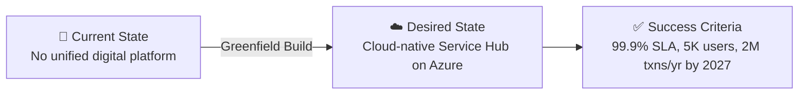

# 📋 Step 1: Requirements - Contoso Service Hub

<strong>📑 Requirements Overview</strong>

- [🎯 Project Overview](#-project-overview)
- [🚀 Functional Requirements](#-functional-requirements)
- [⚡ Non-Functional Requirements (NFRs)](#-non-functional-requirements-nfrs)
- [🔒 Compliance & Security Requirements](#-compliance--security-requirements)
- [💰 Budget](#-budget)
- [🔧 Operational Requirements](#-operational-requirements)
- [🌍 Regional Preferences](#-regional-preferences)
- [📊 Complexity Classification](#-complexity-classification)
- [📋 Summary for Architecture Assessment](#-summary-for-architecture-assessment)
- [References](#references)

> Generated by @requirements agent | 2026-04-02

| ⬅️ Previous | 📑 Index            | Next ➡️                                                        |
| ----------- | ------------------- | -------------------------------------------------------------- |
| —           | [README](README.md) | [02-architecture-assessment.md](02-architecture-assessment.md) |

---

## 🎯 Project Overview

| Field                   | Value                                                                                    |
| ----------------------- | ---------------------------------------------------------------------------------------- |
| **Project Name**        | Contoso Service Hub                                                                      |
| **Project Type**        | Full-Stack Digital Services Platform                                                     |
| **Timeline**            | May 2026 (MVP) → September 2027 (Release 2.1)                                           |
| **Primary Stakeholder** | Contoso Digital Services                                                                 |
| **Business Context**    | Unified digital platform for bookings, payments, content, and customer engagement in EU  |
| **IaC Tool**            | Bicep                                                                                    |

### Business Context

| Field               | Value                                                                                                       |
| ------------------- | ----------------------------------------------------------------------------------------------------------- |
| Industry / Vertical | Real Estate / Lifestyle / Digital Services                                                                  |
| Company Size        | Enterprise                                                                                                  |
| Current State       | Greenfield                                                                                                  |
| Migration Source    | N/A — new platform build                                                                                    |
| Business Drivers    | Unified digital experience, customer adoption, revenue growth, operational efficiency across EU properties   |
| Success Criteria    | Platform live by May 2026 (MVP), 99.9% SLA, 5K initial users scaling to support 2M transactions by 2027    |

### State Transition

### Delivery Milestones (from RFQ)

| Release               | Target Date    | Scope                          |
| --------------------- | -------------- | ------------------------------ |
| MVP + utilities sales | May 2026       | Core booking and payments      |
| Release 1.0           | July 2026      | Full Service Hub launch        |
| Release 1.1           | October 2026   | Feature expansion              |
| Release 2.0           | March 2027     | Platform scaling, new features |
| Release 2.1           | September 2027 | Maturity and optimization      |

---

## 🚀 Functional Requirements

### Core Capabilities

| #   | Capability                                 | Priority | Acceptance Criteria                                                          |
| --- | ------------------------------------------ | -------- | ---------------------------------------------------------------------------- |
| 1   | Service booking and scheduling             | 🔴 Must  | Users can book services, venues, and amenities through mobile/web            |
| 2   | Payment processing                         | 🔴 Must  | Secure payment transactions with PCI-DSS compliant processing               |
| 3   | Digital content delivery                   | 🔴 Must  | Content served via CDN with <2s load time across EU                          |
| 4   | Customer identity and access management    | 🔴 Must  | 15,000+ MAU with self-service registration and SSO                          |
| 5   | API-driven integrations                    | 🔴 Must  | 5M API requests/month through managed API gateway                           |
| 6   | Venue and service provider management      | 🟡 Should | Admin portal for managing venues, services, and provider relationships      |
| 7   | Customer engagement and notifications      | 🟡 Should | Push notifications, email, in-app messaging                                |
| 8   | Parking and mobility services              | 🟡 Should | Integration with parking/mobility systems                                   |
| 9   | Analytics and reporting                    | 🟡 Should | Business dashboards for usage, revenue, and operational metrics             |
| 10  | Smart environment capabilities             | 🟢 Could  | IoT integration for facility management (future roadmap)                    |

### User Types

| User Type             | Description                                      | Est. Count     | Access Level    |
| --------------------- | ------------------------------------------------ | -------------- | --------------- |
| Residents             | Primary users — bookings, payments, content      | ~3,000         | Consumer        |
| Visitors              | Temporary users — venue access, services         | ~1,500         | Consumer        |
| Tenants / Partners    | Business partners using the platform             | ~200           | Contributor     |
| Internal Staff        | Contoso operations and admin users               | ~100           | Admin           |
| Service Providers     | Third-party service providers                    | ~200           | Contributor     |

### Integrations

| System                   | Direction     | Protocol        | Auth Method                 | SLA   |
| ------------------------ | ------------- | --------------- | --------------------------- | ----- |
| Payment Gateway          | Bidirectional | REST / Webhooks | OAuth 2.0 + mTLS            | 99.9% |
| CIAM Provider            | Bidirectional | OIDC / SAML     | OAuth 2.0                   | 99.9% |
| Venue Management Systems | Inbound       | REST API        | API Key / Managed Identity  | 99.5% |
| Notification Services    | Outbound      | REST / Events   | Managed Identity            | 99.5% |
| Parking / Mobility       | Bidirectional | REST API        | API Key                     | 99.0% |

### Data Types

| Category                 | Sensitivity | Est. Volume      | Retention | Residency     |
| ------------------------ | ----------- | ---------------- | --------- | ------------- |
| Customer PII             | 🔴 High    | ~15K user records | 7 years   | EU only       |
| Payment / Transaction    | 🔴 High    | 50K→2M txns/yr   | 7 years   | EU only       |
| Booking & Service Data   | 🟡 Medium  | ~500 GB/yr       | 3 years   | EU only       |
| Content & Media          | 🟢 Low     | ~200 GB          | Indefinite| EU only       |
| Application Logs         | 🟡 Medium  | ~100 GB/yr       | 90 days   | EU only       |
| Analytics / Telemetry    | 🟢 Low     | ~50 GB/yr        | 1 year    | EU only       |

### Architecture Pattern

| Field              | Value                                                                                                         |
| ------------------ | ------------------------------------------------------------------------------------------------------------- |
| Workload Pattern   | N-Tier / API-First with containerized microservices                                                           |
| Recommended Option | Enterprise-grade containerized platform with managed services                                                 |
| Tier               | Enterprise                                                                                                    |
| Justification      | 15 cloud services, GDPR/PCI compliance, 99.9% SLA, projected 2M transactions, multi-environment deployment   |

### Proposed Azure Service Mapping

| #   | RFQ Service                    | Proposed Azure Service                               | SKU / Tier                | Sizing Notes                            |
| --- | ------------------------------ | ---------------------------------------------------- | ------------------------- | --------------------------------------- |
| 1   | Web Application Firewall       | Azure Application Gateway WAF v2                     | WAF v2                    | 1.5M requests/month, regional ingress   |
| 2   | Edge Security and CDN          | Azure Application Gateway WAF v2 plus Azure DNS; CDN reviewed only as an explicit exception path | Regional baseline / DNS / exception-only | 1.5M requests/month, EU-only baseline |
| 3   | CIAM                           | Microsoft Entra External ID                          | P1                        | 15,000 MAU                              |
| 4   | API Management                 | Azure API Management                                 | Standard v2               | 5M API requests/month                   |
| 5   | Container Engine               | Azure Kubernetes Service (AKS)                       | Standard                  | Managed Kubernetes is mandatory; size worker pools from the 8 vCPU RFQ baseline |
| 6   | Database (PostgreSQL)          | Azure Database for PostgreSQL — Flexible Server      | General Purpose, D4ds_v5  | 256 GB storage                          |
| 7   | Object Storage                 | Azure Blob Storage                                   | StorageV2, Hot tier       | 200 GB, LRS (ZRS for production)        |
| 8   | File Storage                   | Azure Files                                          | Premium SSD               | 256 GB                                  |
| 9   | Block Storage                  | Azure Managed Disks                                  | Premium SSD P15           | 256 GB                                  |
| 10  | In-memory Cache                | Azure Managed Redis                                   | Enterprise E50            | 128 GB approved baseline carried into later steps |
| 11  | Key and Secrets Management     | Azure Key Vault                                      | Standard                  | 100K operations/month                   |
| 12  | Virtual Machine                | Azure Virtual Machines                               | D8s_v5                    | 8 vCPU, general purpose                 |
| 13  | Network Services               | Azure VNet, NSG, Azure Bastion, Private DNS Zones    | Standard                  | Hub-spoke topology                      |
| 14  | SDLC Services                  | GitHub (Actions, Repos, Packages, Advanced Security) | Enterprise                | CI/CD, artifact repository, SAST/DAST   |
| 15  | Observability & Monitoring     | Azure Monitor, App Insights, Log Analytics           | Pay-as-you-go             | Centralized workspace                   |

> **EU Data Boundary Note**: The compliant baseline is regional ingress using Application Gateway WAF v2. Any global edge or CDN service is treated as an exception path that requires written legal and business approval before architecture selection.

> **Serverless Requirement Note**: RFQ Section 4.1 explicitly includes serverless capabilities in scope. The baseline solution keeps Azure Kubernetes Service as the mandatory container platform and treats Azure Functions as the complementary Azure-native option for event-driven and burst workloads unless architecture approval explicitly narrows that scope.

> **DNS / Certificate Requirement Note**: The compliant ingress baseline requires Azure DNS zone ownership and a managed TLS certificate source for Application Gateway. Any global CDN or Front Door usage stays outside the default scope and requires written legal and business approval.

---

## ⚡ Non-Functional Requirements (NFRs)

| WAF Pillar     | Metric                 | Target          | Current | Gap           |
| -------------- | ---------------------- | --------------- | ------- | ------------- |
| 🔄 Reliability | SLA                    | 99.9%           | N/A     | Greenfield    |
| 🔄 Reliability | RTO                    | 4 hours         | N/A     | Greenfield    |
| 🔄 Reliability | RPO                    | 1 hour          | N/A     | Greenfield    |
| ⚡ Performance | Page Load              | <2,000 ms       | N/A     | Greenfield    |
| ⚡ Performance | API Response (p95)     | <500 ms         | N/A     | Greenfield    |
| ⚡ Performance | Concurrent Users       | 1,000+          | N/A     | Greenfield    |
| ⚡ Performance | Transactions/month     | 50K (2026)      | N/A     | → 2M by 2027  |
| 🔒 Security    | Auth Method            | OIDC + MFA      | —       | —             |
| 🔒 Security    | Encryption             | At-rest + In-transit (TLS 1.2+) | — | —      |
| 💰 Cost        | Monthly Budget         | EUR 11,000–14,000 (estimated proposal envelope) | — | —          |
| 🔧 Operations  | Uptime Monitoring      | Yes             | —       | —             |

### Scalability

| Dimension         | Current (2026 MVP) | 6-Month Projection (End 2026) | 12-Month Projection (End 2027) |
| ----------------- | ------------------ | ----------------------------- | ------------------------------ |
| Active Users      | 5,000              | 10,000                        | 15,000+                        |
| Data Volume       | ~500 GB            | ~1 TB                         | ~2 TB                          |
| Transactions/year | 50,000             | 50,000                        | 2,000,000                      |
| API Calls/month   | 5,000,000          | 10,000,000                    | 20,000,000+                    |

### Service Credits (per RFQ Section 4.5)

The RFQ mandates a tiered service credit mechanism for SLA breaches:

| SLA Attainment       | Required Credit          |
| -------------------- | ------------------------ |
| 99.0%–99.9%          | Tiered % of monthly fees |
| 95.0%–99.0%          | Higher tiered credit     |
| Below 95.0%          | Maximum credit + review  |

> Detailed service credit tiers to be defined during architecture assessment and provider agreement.

---

## 🔒 Compliance & Security Requirements

### Regulatory Frameworks

<strong>GDPR</strong> — Applicable (Mandatory)

| Requirement                     | Applicability | Notes                                                                     |
| ------------------------------- | ------------- | ------------------------------------------------------------------------- |
| EU data subjects                | Yes           | All users are within the EU                                               |
| Data residency                  | Yes           | All data must remain within EU borders (RFQ Section 4.3)                  |
| Right to erasure (Art. 17)      | Yes           | Must support data deletion requests                                       |
| Data portability (Art. 20)      | Yes           | Must support data export in machine-readable format                       |
| Privacy by design (Art. 25)     | Yes           | Architecture must embed privacy controls from inception                   |
| DPO notification                | Yes           | Breach notification within 72 hours                                       |
| Cross-border transfer controls  | Yes           | No transfer outside EU without written approval + SCCs                    |

<strong>PCI-DSS</strong> — Applicable (Payment Processing)

| Requirement             | Applicability | Notes                                                       |
| ----------------------- | ------------- | ----------------------------------------------------------- |
| Cardholder data storage | Yes           | Payment transactions processed through the platform         |
| Network segmentation    | Yes           | Payment processing in isolated network segment              |
| Encryption requirements | Yes           | TLS 1.2+ for all payment data in transit, AES-256 at rest   |
| Audit logging           | Yes           | All access to payment systems must be logged                |

<strong>SOC 2</strong> — Recommended

| Trust Principle | Applicability | Notes                                           |
| --------------- | ------------- | ----------------------------------------------- |
| Security        | Yes           | Core requirement for cloud platform             |
| Availability    | Yes           | 99.9% SLA commitment                            |
| Confidentiality | Yes           | Customer PII and payment data                   |

<strong>HIPAA</strong> — Not Applicable

| Requirement   | Applicability | Notes                                 |
| ------------- | ------------- | ------------------------------------- |
| PHI handling  | No            | No healthcare data processed          |
| BAA required  | No            | N/A                                   |
| Audit logging | No            | N/A                                   |

<strong>ISO 27001</strong> — Recommended

| Control Area        | Applicability | Notes                                         |
| ------------------- | ------------- | --------------------------------------------- |
| Access control      | Yes           | RBAC and least-privilege across all services   |
| Asset management    | Yes           | Cloud resource inventory and tagging           |
| Incident management | Yes           | Security incident response procedures          |

### Data Residency

| Requirement              | Value                                                                              |
| ------------------------ | ---------------------------------------------------------------------------------- |
| Primary Region           | EU region (swedencentral recommended)                                              |
| Data Sovereignty         | EU-only — mandatory per RFQ Section 4.3                                            |
| Cross-region Replication | Not required (DR excluded from current RFQ scope)                                  |
| EU Data Boundary         | ⚠️ Global services (Front Door, DNS) require explicit EU Data Boundary validation  |
| Storage Redundancy       | ZRS recommended (GRS replicates to paired region — incompatible with strict EU DR) |

### Authentication & Authorization

| Requirement       | Value                                                        |
| ----------------- | ------------------------------------------------------------ |
| Identity Provider | Microsoft Entra External ID (consumer/partner identity)      |
| Admin Identity    | Microsoft Entra ID (internal staff)                          |
| MFA Requirement   | Required for admin users, conditional for consumer users     |
| RBAC Model        | Azure RBAC for infrastructure, application-level for users   |

### Network Security

| Control                     | Required | Notes                                                                  |
| --------------------------- | -------- | ---------------------------------------------------------------------- |
| Private endpoints           | ✅       | For PostgreSQL, Redis, Key Vault, Storage                              |
| VNet integration            | ✅       | Container platform and VMs in VNet; services via Private Link          |
| Public endpoints acceptable | ✅       | Only for the regional WAF ingress and other explicitly approved public entry points |
| WAF required                | ✅       | Application Gateway WAF v2 — 1.5M requests/month                     |
| Network segmentation        | ✅       | Separate subnets for compute, data, management; NSG rules enforced     |
| Bastion for admin access    | ✅       | No direct RDP/SSH to VMs from internet                                 |

### Recommended Security Controls

| Control               | Recommended | Notes                                                      |
| --------------------- | ----------- | ---------------------------------------------------------- |
| Managed Identity      | Yes         | Preferred over keys/connection strings for all services    |
| Private Endpoints     | Yes         | For all data services (PostgreSQL, Redis, Storage, KV)     |
| WAF                   | Yes         | Application Gateway WAF v2 for the compliant public ingress baseline |
| Key Vault for Secrets | Yes         | Centralized secrets, certificates, and key management      |
| Diagnostic Settings   | Yes         | Audit logging to Log Analytics for all resources           |
| TLS 1.2 Minimum       | Yes         | Enforced on all services                                   |
| Encryption at Rest    | Yes         | Platform-managed keys (CMK for payment data if required)   |
| Network Isolation     | Yes         | Hub-spoke VNet with NSG, Private Link, and Bastion         |
| DDoS Protection       | Yes         | Azure DDoS Protection Standard recommended                |
| Microsoft Defender    | Yes         | Defender for Cloud on all subscriptions                    |

---

## 💰 Budget

> [!NOTE]
> The RFQ does not specify an explicit budget. The estimate below is derived from
> the 15 proposed cloud services, their indicative volumetrics (RFQ Table 2), and
> Azure retail pricing for the `swedencentral` region. Detailed cost modeling will
> be performed during architecture assessment (Step 2) using the Azure Pricing MCP.

| Field              | Value                                                                |
| ------------------ | -------------------------------------------------------------------- |
| 💰 Monthly Budget  | EUR 11,000–14,000 (estimated across all environments)                |
| 📅 Annual Budget   | EUR 132,000–168,000                                                  |
| 🚦 Limit Type      | 🟡 Soft — no budget specified in RFQ; estimate subject to validation |
| 📊 Cost Model Pref | Hybrid (Reserved for steady-state compute, consumption for variable) |

### Estimated Cost Breakdown (Production Environment)

| Service Category              | Azure Service                                 | Estimated Monthly Cost |
| ----------------------------- | --------------------------------------------- | ---------------------- |
| Container Platform            | AKS (2–3 × D8s_v5 nodes)                     | $600–900               |
| Database                      | PostgreSQL Flexible Server (GP D4ds_v5, 256G) | $350–500               |
| In-memory Cache (128 GB)      | Azure Managed Redis Enterprise (E50)           | $2,500–2,700           |
| API Management                | APIM Standard v2                              | $300–400               |
| Regional ingress + WAF        | Azure Application Gateway WAF v2             | $400–650               |
| Virtual Machines              | D8s_v5 (general purpose)                      | $250–400               |
| Identity (CIAM)               | Entra External ID (15K MAU)                   | $0–50                  |
| Storage (Blob + Files + Disk) | Mixed tiers                                   | $80–150                |
| Key Vault                     | Standard                                      | $10–20                 |
| Monitoring                    | Azure Monitor + App Insights + Log Analytics  | $300–500               |
| Networking                    | VNet, Bastion, DNS Zones                      | $200–350               |
| DevOps / CI-CD                | GitHub Enterprise                             | $200–300               |
| **Production Subtotal**       |                                               | **$5,200–8,100**       |

| Environment | Sizing Factor | Estimated Monthly Cost |
| ----------- | ------------- | ---------------------- |
| Production  | 100%          | $5,200–8,100           |
| Staging     | ~60%          | $3,100–4,900           |
| Development | ~40%          | $2,100–3,200           |
| **Total**   |               | **$10,400–16,200**     |

> ⚠️ Redis 128 GB remains the dominant cost driver (~30–40% of production). The approved
> baseline is Azure Managed Redis Enterprise E50, so later pricing refinement should adjust
> that baseline rather than reopen the service-tier decision.

### Cost Optimization Priorities

| Priority                         | Selected | Impact |
| -------------------------------- | -------- | ------ |
| Minimize compute costs           | ☑        | High   |
| Prefer consumption-based pricing | ☑        | Medium |
| Reserved instances acceptable    | ☑        | High   |
| Spot instances for non-critical  | ☐        | Low    |

---

## 🔧 Operational Requirements

### Monitoring & Alerting

| Capability             | Required | Tool / Service                               | Notes                                      |
| ---------------------- | -------- | -------------------------------------------- | ------------------------------------------ |
| Application monitoring | ✅       | Application Insights                         | Per-service instrumentation                |
| Log aggregation        | ✅       | Log Analytics Workspace                      | Centralized workspace, 90-day retention    |
| Alert notifications    | ✅       | Azure Monitor Alerts → Email / Teams         | P1: 15min, P2: 1hr, P3: business hours     |
| Custom dashboards      | ✅       | Azure Monitor Workbooks / Grafana            | Operations and business KPI dashboards     |
| Uptime monitoring      | ✅       | Azure Monitor Availability Tests             | Synthetic tests from EU regions            |
| Security monitoring    | ✅       | Microsoft Defender for Cloud                 | Continuous security posture assessment     |

### Support & Maintenance

| Requirement         | Value                                                      |
| ------------------- | ---------------------------------------------------------- |
| Support Hours       | 24/7 for Production; Business hours for Dev/Staging        |
| On-call Requirement | Yes — for production P1/P2 incidents                       |
| Maintenance Windows | Saturday 02:00–06:00 CET (production)                     |
| Change Management   | Formal CAB for production; Team approval for non-prod      |

### Backup & Disaster Recovery

| Component          | Backup Frequency | Retention | Recovery Method    |
| ------------------ | ---------------- | --------- | ------------------ |
| PostgreSQL DB      | Daily + PITR     | 35 days   | Automated restore  |
| Blob Storage       | Soft delete      | 30 days   | Self-service       |
| Key Vault          | Soft delete      | 90 days   | Automated          |
| AKS Configuration  | Daily (Velero)   | 30 days   | Manual restore     |
| Redis              | Daily snapshot   | 7 days    | Automated restore  |

> **Note**: Multi-region disaster recovery is explicitly excluded from the current RFQ scope (Section 4.1).
> DR strategy should be revisited for Release 2.0 (March 2027).

### Environments

| Environment | Purpose                                      | Availability | Auto-scaling | Security Level |
| ----------- | -------------------------------------------- | ------------ | ------------ | -------------- |
| Production  | End-user facing, high availability           | 99.9%        | Yes          | Full           |
| Staging     | Pre-release validation, load testing         | Best-effort  | Limited      | Production-like|
| Development | Engineering, integration testing, CI/CD      | Best-effort  | No           | Standard       |

---

## 🌍 Regional Preferences

| Preference         | Value                            | Justification                                          |
| ------------------ | -------------------------------- | ------------------------------------------------------ |
| Primary Region     | `swedencentral`                  | EU GDPR-compliant, low latency to EU user base         |
| Failover Region    | N/A (DR excluded from RFQ scope) | To be reassessed for Release 2.0                       |
| Availability Zones | Required                         | Production workloads for 99.9% SLA                     |

### EU Data Residency Constraints

| Constraint                                | Status   | Notes                                                    |
| ----------------------------------------- | -------- | -------------------------------------------------------- |
| All data stored within EU                 | Required | RFQ Section 4.3 — mandatory                             |
| No processing outside EU                  | Required | Explicit written approval needed for any exception       |
| Global services (CDN, DNS, identity dependencies) flagged | ⚠️       | Any non-regional service requires explicit EU Data Boundary validation during architecture |
| GRS storage replication                   | ❌ Avoid | Use ZRS — GRS replicates to paired region                |
| Remote support GDPR safeguards            | Required | SCCs required for non-EU support personnel               |

---

## 📊 Complexity Classification

| Field      | Value                                                                                       |
| ---------- | ------------------------------------------------------------------------------------------- |
| Complexity | `complex`                                                                                   |
| Criteria   | >8 resource types (15 services), multi-env (3 environments), >3 compliance frameworks       |
| Rationale  | 15 distinct Azure services, 3 environments (Dev/Staging/Production), GDPR + PCI-DSS + SOC 2 + ISO 27001 compliance scope, 40× transaction growth trajectory (50K→2M), payment processing, EU data residency constraints, tiered SLA/service credit requirements |

---

## 📋 Summary for Architecture Assessment

### Handoff Summary

| Aspect               | Key Points                                                                                                      |
| -------------------- | --------------------------------------------------------------------------------------------------------------- |
| Critical Constraints | 1) EU-only data residency (GDPR) 2) 99.9% SLA with service credits 3) 128 GB Redis sizing drives cost          |
| Key Decisions        | IaC: Bicep, Region: swedencentral, CIAM: Entra External ID, DR excluded from current scope                     |
| Open Risks           | Explicit serverless workload mapping, DNS zone and certificate ownership for the regional ingress baseline, budget not specified in RFQ, any global edge exception requires approval |
| Recommended Pattern  | N-Tier / API-First with containerized microservices                                                             |
| Budget Envelope      | EUR 11,000–14,000/month (estimated proposal envelope — requires Azure pricing validation and final EUR quote) |

### Requirements Completeness

| Section                  | Status | Notes                                                           |
| ------------------------ | ------ | --------------------------------------------------------------- |
| Project Overview         | ✅     | Complete — extracted from RFQ Sections 1–3                      |
| Functional Requirements  | ✅     | Complete — derived from RFQ scope and service descriptions      |
| NFRs                     | ✅     | Complete — SLA, scalability, performance targets from RFQ 4.5   |
| Compliance & Security    | ✅     | Complete — GDPR mandatory, PCI-DSS for payments                 |
| Budget                   | ⚠️     | Estimated — RFQ does not specify explicit budget                |
| Operational Requirements | ✅     | Complete — environments, monitoring, backup defined             |

---

## Open Questions

> ⚠️ The following gaps were identified in the RFQ and require resolution during architecture assessment (Step 2).

| ID    | Category           | Question                                                                                                   | Impact  | Recommendation                                                                                                    |
| ----- | ------------------ | ---------------------------------------------------------------------------------------------------------- | ------- | ----------------------------------------------------------------------------------------------------------------- |
| OQ-01 | Budget             | RFQ does not specify an explicit budget. Estimated ~$12K–15K/month — is this acceptable?                   | High    | Validate with Azure Pricing MCP in Step 2; present detailed breakdown to Contoso                                  |
| OQ-02 | Redis Tier         | The 128 GB cache baseline has been carried forward as Azure Managed Redis Enterprise E50. Re-open only if commercial pricing forces a smaller compliant SKU. | Medium  | Treat Enterprise E50 as the approved baseline for architecture, planning, and IaC unless cost review explicitly changes it |
| OQ-03 | DNS / Edge         | Which Azure DNS zones and managed certificate source will back the regional ingress baseline, and is any global CDN exception actually required? | High    | Keep Azure DNS plus Application Gateway WAF v2 as the default path; require written legal and business approval before introducing CDN or Front Door |
| OQ-04 | Global Edge Exception | Any global CDN or edge service falls outside the compliant regional baseline. Is a formal exception acceptable under Contoso's GDPR and EU Data Boundary constraints? | Medium  | Treat Application Gateway WAF v2 as the default; require written legal and business approval before selecting a global edge service |
| OQ-05 | DR Strategy        | Multi-region DR is excluded from RFQ scope — when should it be re-evaluated?                               | Medium  | Plan DR architecture assessment for Release 2.0 (March 2027)                                                     |
| OQ-06 | SDLC Platform      | RFQ mentions "CI/CD pipelines, source code and artifact repository" — GitHub or Azure DevOps?              | Low     | GitHub recommended (Actions, Repos, Packages, Advanced Security); confirm with Contoso engineering team            |
| OQ-07 | Serverless Scope   | RFQ includes serverless capabilities, but the target workloads are not yet mapped. Which flows should use Azure Functions or another event-driven platform capability? | Medium  | Preserve Azure Functions as the preferred Azure-native serverless option for background jobs, event handling, and burst workloads unless architecture approval explicitly defers it |

---

## References

> [!NOTE]
> 📚 The following Microsoft Learn resources provide additional guidance.

| Topic                             | Link                                                                                                |
| --------------------------------- | --------------------------------------------------------------------------------------------------- |
| Well-Architected Framework        | [Overview](https://learn.microsoft.com/azure/well-architected/)                                     |
| Azure Regions                     | [Products by Region](https://azure.microsoft.com/explore/global-infrastructure/products-by-region/) |
| Compliance Offerings              | [Azure Compliance](https://learn.microsoft.com/azure/compliance/)                                   |
| GDPR in Azure                     | [GDPR Overview](https://learn.microsoft.com/azure/compliance/offerings/offering-gdpr)               |
| EU Data Boundary                  | [EU Data Boundary](https://learn.microsoft.com/privacy/eudb/eu-data-boundary-learn)                 |
| Azure Cache for Redis Tiers       | [Redis Tiers](https://learn.microsoft.com/azure/azure-cache-for-redis/cache-overview#service-tiers) |
| AKS vs Container Apps             | [Comparison](https://learn.microsoft.com/azure/container-apps/compare-options)                      |
| Entra External ID                 | [Overview](https://learn.microsoft.com/entra/external-id/)                                          |

---

_Requirements captured from Contoso RFQ (Selection of Cloud Services Provider) for E2E evaluation run-2_

---

| ⬅️ — | 🏠 [Project Index](README.md) | ➡️ [02-architecture-assessment.md](02-architecture-assessment.md) |
| ---- | ----------------------------- | ----------------------------------------------------------------- |

