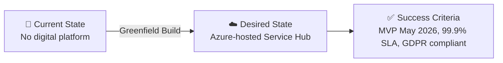

# 📋 Step 1: Requirements - Contoso Service Hub

<strong>📑 Requirements Overview</strong>

- [🎯 Project Overview](#-project-overview)
- [🚀 Functional Requirements](#-functional-requirements)
- [⚡ Non-Functional Requirements (NFRs)](#-non-functional-requirements-nfrs)
- [🔒 Compliance & Security Requirements](#-compliance--security-requirements)
- [💰 Budget](#-budget)
- [🔧 Operational Requirements](#-operational-requirements)
- [🌍 Regional Preferences](#-regional-preferences)
- [📊 Complexity Classification](#-complexity-classification)
- [📋 Summary for Architecture Assessment](#-summary-for-architecture-assessment)
- [References](#references)

> Generated by @requirements agent | 2026-03-16

| ⬅️ Previous | 📑 Index            | Next ➡️                                                        |
| ----------- | ------------------- | -------------------------------------------------------------- |
| —           | [README](README.md) | [02-architecture-assessment.md](02-architecture-assessment.md) |

---

## 🎯 Project Overview

| Field                   | Value                                                                                                                                              |
| ----------------------- | -------------------------------------------------------------------------------------------------------------------------------------------------- |
| **Project Name**        | Contoso Service Hub                                                                                                                                |
| **Project Type**        | Full-Stack Digital Services Platform (Mobile + Web + API)                                                                                          |
| **Timeline**            | March 2026 → MVP May 2026, GA July 2026, contract through February 2029                                                                            |
| **Primary Stakeholder** | Contoso (EU real estate and lifestyle ecosystem operator)                                                                                          |
| **Business Context**    | Unified digital platform for bookings, payments, content, and customer engagement across a mixed-use real estate and lifestyle ecosystem in the EU |
| **IaC Tool**            | Bicep                                                                                                                                              |

### Business Context

| Field               | Value                                                                                                                                               |
| ------------------- | --------------------------------------------------------------------------------------------------------------------------------------------------- |
| Industry / Vertical | Real Estate / Lifestyle / Digital Services                                                                                                          |
| Company Size        | Enterprise (multi-property, EU-wide operations)                                                                                                     |
| Current State       | Greenfield                                                                                                                                          |
| Migration Source    | N/A (greenfield platform build)                                                                                                                     |
| Business Drivers    | Digital transformation of property/lifestyle services; customer acquisition and engagement; unified service delivery across mobile and web channels |
| Success Criteria    | MVP launch May 2026; 5,000 initial users; 50K transactions by end of 2026; 2M transactions in 2027; 99.9% availability                              |

### Service Hub Delivery Milestones

| Release               | Target Date    |
| --------------------- | -------------- |
| MVP + utilities sales | May 2026       |
| Release 1.0           | July 2026      |
| Release 1.1           | October 2026   |
| Release 2.0           | March 2027     |
| Release 2.1           | September 2027 |

### State Transition

---

## 🚀 Functional Requirements

### Cloud Services Inventory (RFQ Table 2)

> Faithful 1:1 mapping of all 15 cloud services from Section 4.2–Table 2 with original numbering, names, and volumetrics.

| #   | RFQ Cloud Service                              | Indicative Volumetrics / Sizing                                                | Azure Service Mapping                                        | Notes / Gaps                                                     |
| --- | ---------------------------------------------- | ------------------------------------------------------------------------------ | ------------------------------------------------------------ | ---------------------------------------------------------------- |
| 1   | Web Application Firewall (WAF)                 | 1,500,000 requests/month                                                       | Azure Front Door with WAF Policy                             | Integrated with CDN (service #2)                                 |
| 2   | Edge Security and CDN                          | 1,500,000 requests/month                                                       | Azure Front Door (Standard/Premium)                          | Single Azure Front Door instance serves both WAF and CDN roles   |
| 3   | Customer Identity and Access Management (CIAM) | 15,000 monthly active users                                                    | Microsoft Entra External ID                                  | ⚠️ NOT Azure AD B2C (unavailable for new tenants since May 2025) |
| 4   | API Management                                 | 5,000,000 API requests/month                                                   | Azure API Management (Standard v2)                           | Gateway for all backend APIs                                     |
| 5   | Container Engine                               | Standard 8 vCPU virtual machines                                               | Azure Kubernetes Service (AKS) **OR** Azure Container Apps   | ⚠️ **RFP Gap**: See decision D003 below                          |
| 6   | Database (PostgreSQL)                          | General purpose tier, 256 GB                                                   | Azure Database for PostgreSQL – Flexible Server              | General Purpose tier, 256 GB storage                             |
| 7   | Object Storage                                 | 200 GB                                                                         | Azure Blob Storage (StorageV2, LRS)                          | Hot tier for active platform data                                |
| 8   | File Storage                                   | 256 GB SSD                                                                     | Azure Files (Premium, SMB/NFS)                               | SSD-backed file shares                                           |
| 9   | Block Storage                                  | 256 GB SSD                                                                     | Azure Managed Disks (Premium SSD)                            | Attached to VM (service #12) and/or AKS nodes                    |
| 10  | In-memory Cache                                | 128 GB                                                                         | Azure Cache for Redis **OR** Azure Managed Redis             | ⚠️ **RFP Gap**: See decision D002 below                          |
| 11  | Key and Secrets Management                     | 100,000 operations/month                                                       | Azure Key Vault (Standard)                                   | Secrets, keys, and certificates                                  |
| 12  | Virtual Machine                                | Standard 8 vCPU virtual machines                                               | Azure Virtual Machines (D-series, 8 vCPU)                    | For workloads not suited to containers                           |
| 13  | Network Services                               | As required                                                                    | Azure Virtual Network + NSGs + Private Endpoints + Azure DNS | Hub-spoke or flat VNet topology                                  |
| 14  | SDLC Services (DevOps)                         | CI/CD pipelines, source code and artifact repository, security tooling hosting | GitHub Actions + GitHub Packages **OR** Azure DevOps         | CI/CD, artifact management, security scanning                    |
| 15  | Observability and Monitoring Services          | Hosted on general purpose 8 vCPU VMs or equivalent managed services            | Azure Monitor + Log Analytics + Application Insights         | Managed PaaS preferred over self-hosted                          |

### Business Capabilities (Application Layer)

> These are application-level capabilities the Service Hub delivers — they are NOT cloud infrastructure services.

| #   | Capability                    | Priority  | Description                                                                    |
| --- | ----------------------------- | --------- | ------------------------------------------------------------------------------ |
| 1   | Service Booking               | 🔴 Must   | Users book services across sports, leisure, community, and lifestyle offerings |
| 2   | Payments and Transactions     | 🔴 Must   | Secure payment processing for bookings and purchases                           |
| 3   | Digital Content Delivery      | 🔴 Must   | Content management and delivery for marketing, guides, and notifications       |
| 4   | Customer Engagement           | 🔴 Must   | Notifications, messaging, and interaction between users and service providers  |
| 5   | Venue and Service Discovery   | 🟡 Should | Browse and search venues, amenities, and service providers                     |
| 6   | Partner/Tenant Portal         | 🟡 Should | Administrative access for partners and tenants                                 |
| 7   | Parking and Mobility          | 🟢 Could  | Parking management and mobility-related services                               |
| 8   | Smart Environment Integration | 🟢 Could  | IoT and smart building capabilities                                            |

### User Types

| User Type         | Description                                    | Est. Count      | Access Level                 |
| ----------------- | ---------------------------------------------- | --------------- | ---------------------------- |
| Residents         | Community residents using daily services       | ~3,000          | Consumer (Entra External ID) |
| Visitors          | Guests and visitors to the ecosystem           | ~1,500          | Consumer (Entra External ID) |
| Tenants/Partners  | Business tenants and service provider partners | ~200            | Contributor (Entra ID)       |
| Internal Staff    | Contoso operations and administration          | ~50             | Admin (Entra ID)             |
| System Integrator | External systems (payment gateways, IoT, etc.) | N/A (API-based) | Service Principal            |

### Integrations

| System                   | Direction     | Protocol   | Auth Method         | SLA   |
| ------------------------ | ------------- | ---------- | ------------------- | ----- |
| Payment Gateway          | Outbound      | REST/HTTPS | OAuth 2.0 / API Key | 99.9% |
| Mobile App (iOS/Android) | Inbound       | REST/HTTPS | OAuth 2.0 (OIDC)    | 99.9% |
| Web Application          | Inbound       | REST/HTTPS | OAuth 2.0 (OIDC)    | 99.9% |
| IoT/Smart Building       | Bidirectional | MQTT/HTTPS | Certificate / MI    | 99.5% |
| Partner Systems          | Bidirectional | REST/HTTPS | OAuth 2.0 / API Key | 99.5% |

### Data Types

| Category            | Sensitivity | Est. Volume  | Retention     | Residency |
| ------------------- | ----------- | ------------ | ------------- | --------- |
| Customer PII        | 🔴 High     | ~50 GB       | 7 years       | EU only   |
| Payment/Transaction | 🔴 High     | ~20 GB/year  | 7 years       | EU only   |
| Application Logs    | 🟡 Medium   | ~100 GB/year | 1 year        | EU only   |
| Content/Media       | 🟢 Low      | ~200 GB      | Indefinite    | EU only   |
| Telemetry/Analytics | 🟡 Medium   | ~50 GB/year  | 90 days       | EU only   |
| Service Metadata    | 🟡 Medium   | ~10 GB       | Contract term | EU only   |
| Backups             | 🔴 High     | ~500 GB      | 30 days       | EU only   |

### Architecture Pattern

| Field              | Value                                                                                                                                                                                      |
| ------------------ | ------------------------------------------------------------------------------------------------------------------------------------------------------------------------------------------ |
| Workload Pattern   | N-Tier / Microservices (containerized APIs + managed data services)                                                                                                                        |
| Recommended Option | Balanced — managed PaaS services with container orchestration                                                                                                                              |
| Tier               | Balanced → Enterprise (scaling from MVP to Release 2.x)                                                                                                                                    |
| Justification      | Multiple user types, API-first design, 15 distinct cloud services, GDPR requirements, and 40× transaction growth (50K→2M) favor a microservices architecture with managed backing services |

---

## ⚡ Non-Functional Requirements (NFRs)

| WAF Pillar     | Metric             | Target                                    | Current | Gap        |
| -------------- | ------------------ | ----------------------------------------- | ------- | ---------- |
| 🔄 Reliability | SLA                | 99.9%                                     | N/A     | Greenfield |
| 🔄 Reliability | RTO                | 4 hours                                   | N/A     | Greenfield |
| 🔄 Reliability | RPO                | 1 hour                                    | N/A     | Greenfield |
| ⚡ Performance | API Response (p95) | < 500 ms                                  | N/A     | Greenfield |
| ⚡ Performance | Concurrent Users   | 500 (2026), 2,000 (2027)                  | N/A     | Greenfield |
| ⚡ Performance | Transactions/month | 50K (2026) → 2M (2027)                    | N/A     | Greenfield |
| 🔒 Security    | Auth Method        | OAuth 2.0 / OIDC via Entra External ID    | —       | —          |
| 🔒 Security    | Encryption         | At-rest (AES-256) + In-transit (TLS 1.2+) | —       | —          |
| 💰 Cost        | Monthly Budget     | ~€8,000–12,000 (estimated — see Budget)   | —       | —          |
| 🔧 Operations  | Uptime Monitoring  | Yes (Azure Monitor + App Insights)        | —       | —          |

### Scalability

| Dimension       | 2026 (MVP–R1.1) | 2027 (R2.0–R2.1)  | 3-Year Projection |
| --------------- | --------------- | ----------------- | ----------------- |
| Active Users    | 5,000           | 15,000 MAU (CIAM) | 50,000+           |
| Data Volume     | ~500 GB         | ~1.5 TB           | ~5 TB             |
| Transactions/yr | 50,000          | 2,000,000         | 5,000,000+        |

### Service Credit Mechanism (RFQ Section 4.5)

The RFQ mandates tiered service credits:

| SLA Achieved | Credit (% of monthly fees)    |
| ------------ | ----------------------------- |
| 99.9%–99.5%  | To be defined in SLA schedule |
| 99.5%–99.0%  | To be defined in SLA schedule |
| Below 99.0%  | To be defined in SLA schedule |

> Architecture assessment (Step 2) must define specific credit percentages aligned with Azure SLAs.

---

## 🔒 Compliance & Security Requirements

### Regulatory Frameworks

<strong>GDPR</strong> — Applicable (Mandatory)

| Requirement               | Applicability | Notes                                                           |
| ------------------------- | ------------- | --------------------------------------------------------------- |
| EU data subjects          | Yes           | All end users are in the EU                                     |
| Data residency            | Yes           | All data must remain in EU regions                              |
| Right to erasure          | Yes           | Platform must support GDPR Article 17 deletion requests         |
| Data portability          | Yes           | Platform must support GDPR Article 20 data export               |
| Consent management        | Yes           | Explicit consent for data processing                            |
| Data protection by design | Yes           | Privacy-first architecture required (Article 25)                |
| Breach notification       | Yes           | 72-hour notification requirement (Article 33)                   |
| DPO appointment           | Yes           | Contoso responsibility, but platform must support DPO functions |

<strong>PCI-DSS</strong> — Potentially Applicable

| Requirement             | Applicability | Notes                                                     |
| ----------------------- | ------------- | --------------------------------------------------------- |
| Cardholder data storage | TBD           | Depends on payment integration model (gateway vs. direct) |
| Network segmentation    | Yes           | Required if any card data touches the platform            |
| Encryption requirements | Yes           | TLS 1.2+ in-transit, AES-256 at-rest minimum              |

> If Contoso uses a PCI-compliant payment gateway with tokenization, platform PCI scope may be limited to SAQ-A.

<strong>SOC 2</strong> — Not Applicable

SOC 2 is not explicitly required by the RFQ. Azure platform services carry SOC 2 Type II certifications.

<strong>HIPAA</strong> — Not Applicable

No health data processing is in scope for the Service Hub.

<strong>ISO 27001</strong> — Recommended

| Control Area        | Applicability | Notes                                       |
| ------------------- | ------------- | ------------------------------------------- |
| Access control      | Yes           | RBAC, least-privilege, MFA                  |
| Asset management    | Yes           | Resource tagging and inventory              |
| Incident management | Yes           | Monitoring, alerting, and incident response |

> Azure regions are ISO 27001 certified. Recommended as a governance framework for Contoso operations.

### Data Residency — GDPR Section 4.3 Clause-by-Clause

> Expanded from RFQ Section 4.3. Each requirement is independently testable.

| #     | Data Category         | Requirement                                                                                                                                 | Testable Criterion                                                               |
| ----- | --------------------- | ------------------------------------------------------------------------------------------------------------------------------------------- | -------------------------------------------------------------------------------- |
| DR-01 | Customer Data         | All customer PII, profiles, and account data must be stored and processed within EU borders                                                 | Verify all databases, storage accounts, and search indexes are in EU regions     |
| DR-02 | Application Logs      | All application logs, audit logs, and diagnostic data must remain within EU borders                                                         | Verify Log Analytics workspace and storage sinks are EU-deployed                 |
| DR-03 | Backups               | All backup data (database, storage, VM snapshots) must be stored within EU regions                                                          | Verify backup vaults, geo-redundant storage, and replication targets are EU-only |
| DR-04 | Service Metadata      | Azure resource metadata, configuration data, and management plane data must reside in EU                                                    | Verify resource group locations and metadata storage are EU-based                |
| DR-05 | Telemetry & Analytics | Application Insights telemetry, custom metrics, and analytics data must not leave the EU                                                    | Verify Application Insights workspace and data export targets are EU-only        |
| DR-06 | Replication & Caching | Any data replication (geo-redundancy, CDN caching, Redis replication) must stay within EU borders                                           | Verify Front Door PoPs are EU-configured; Redis replication is EU-only           |
| DR-07 | Indexing & Search     | Search indexes, AI enrichment outputs, and query logs must remain within EU                                                                 | Verify any Azure AI Search or Cognitive Services instances are EU-deployed       |
| DR-08 | Remote Support Access | Any remote support or administrative access must comply with GDPR safeguards, including SCCs where the support personnel are outside the EU | Verify contractual SCCs are in place; support access is logged and auditable     |

### Authentication & Authorization

| Requirement                | Value                                                          |
| -------------------------- | -------------------------------------------------------------- |
| Consumer Identity Provider | Microsoft Entra External ID (15,000 MAU)                       |
| Internal Identity Provider | Microsoft Entra ID                                             |
| MFA Requirement            | Required for internal/admin; Conditional for consumers         |
| RBAC Model                 | Azure RBAC for infrastructure; Application-level for end users |

> **Why Entra External ID?** Azure AD B2C has been unavailable for new customers since May 2025. Entra External ID is the current Microsoft CIAM solution for greenfield projects in 2026.

### Network Security

| Control                     | Required | Notes                                                          |
| --------------------------- | -------- | -------------------------------------------------------------- |
| Private endpoints           | ✅       | Required for PostgreSQL, Redis, Key Vault, Storage             |
| VNet integration            | ✅       | Required for AKS/Container Apps, API Management                |
| Public endpoints acceptable | ⚠️       | Only for Front Door (WAF-protected edge); all backends private |
| WAF required                | ✅       | Azure Front Door WAF, 1.5M requests/month                      |

### Recommended Security Controls

| Control               | Recommended | Notes                                                         |
| --------------------- | ----------- | ------------------------------------------------------------- |
| Managed Identity      | Yes         | Preferred for all service-to-service authentication           |
| Private Endpoints     | Yes         | For all data services (PostgreSQL, Redis, Storage, Key Vault) |
| WAF                   | Yes         | Azure Front Door WAF for all public endpoints                 |
| Key Vault for Secrets | Yes         | Centralized secrets, keys, and certificate management         |
| Diagnostic Settings   | Yes         | All resources send diagnostics to Log Analytics               |
| TLS 1.2 Minimum       | Yes         | Enforced on all services                                      |
| Encryption at Rest    | Yes         | Platform-managed keys (CMK optional for Phase 2)              |
| Network Isolation     | Yes         | VNet integration + NSGs + Private Link                        |
| DDoS Protection       | Yes         | Azure DDoS Protection Standard for VNet                       |

---

## 💰 Budget

> [!WARNING]
> **RFP Gap #1**: The RFQ does not specify an explicit budget. The estimate below is derived from the 15 cloud services and their volumetrics in Table 2 (Section 4.2).

| Field              | Value                                                                |
| ------------------ | -------------------------------------------------------------------- |
| 💰 Monthly Budget  | ~€8,000–12,000 (estimated across all 3 environments)                 |
| 📅 Annual Budget   | ~€96,000–144,000                                                     |
| 🚦 Limit Type      | 🟡 Soft (estimated — no budget stated in RFQ)                        |
| 📊 Cost Model Pref | Hybrid (reserved instances for steady-state + consumption for burst) |
| 💶 Currency        | EUR (EU-based operations)                                            |

### Estimated Cost Breakdown by Service (Production)

| #   | Azure Service                            | Estimated Monthly Cost (EUR) | Notes                                   |
| --- | ---------------------------------------- | ---------------------------- | --------------------------------------- |
| 1–2 | Azure Front Door (WAF + CDN)             | €400–600                     | Standard/Premium tier, 1.5M requests/mo |
| 3   | Microsoft Entra External ID              | €150–300                     | 15,000 MAU                              |
| 4   | Azure API Management                     | €350–500                     | Standard v2 tier                        |
| 5   | Container Engine (AKS or Container Apps) | €500–800                     | 8 vCPU nodes, autoscaling               |
| 6   | Azure Database for PostgreSQL            | €400–600                     | General Purpose, 256 GB                 |
| 7   | Azure Blob Storage                       | €10–20                       | 200 GB, Hot tier, LRS                   |
| 8   | Azure Files (Premium)                    | €40–60                       | 256 GB SSD                              |
| 9   | Azure Managed Disks                      | €40–60                       | 256 GB Premium SSD                      |
| 10  | Azure Cache for Redis / Managed Redis    | €2,000–4,000                 | ⚠️ 128 GB — see RFP Gap #2              |
| 11  | Azure Key Vault                          | €10–20                       | 100K operations/month                   |
| 12  | Azure Virtual Machine                    | €300–500                     | D-series, 8 vCPU                        |
| 13  | Networking (VNet, NSG, DNS, PE)          | €100–200                     | Private endpoints, DNS zones            |
| 14  | SDLC/DevOps                              | €50–100                      | GitHub Actions or Azure DevOps          |
| 15  | Azure Monitor + App Insights             | €300–500                     | Log Analytics, Application Insights     |
|     | **Production Subtotal**                  | **€4,650–7,360**             |                                         |

### Environment Cost Estimates

| Environment | Sizing Strategy                  | Estimated Monthly (EUR) |
| ----------- | -------------------------------- | ----------------------- |
| Production  | Full specification per Table 2   | €4,650–7,360            |
| Staging     | Mirrors Production, lower SKUs   | €2,000–3,000            |
| Development | Minimal SKUs, dev/test licensing | €1,000–1,500            |
| **Total**   |                                  | **€7,650–11,860**       |

### Cost Optimization Priorities

| Priority                         | Selected | Impact |
| -------------------------------- | -------- | ------ |
| Minimize compute costs           | ☐        | High   |
| Prefer consumption-based pricing | ☑        | High   |
| Reserved instances acceptable    | ☑        | High   |
| Spot instances for non-critical  | ☐        | Medium |
| Dev/Test pricing for lower envs  | ☑        | Medium |

> Detailed cost analysis with Azure Retail Prices API will be performed in Step 2 (Architecture Assessment).

---

## 🔧 Operational Requirements

### Monitoring & Alerting

| Capability             | Required | Tool / Service                   | Notes                                  |
| ---------------------- | -------- | -------------------------------- | -------------------------------------- |
| Application monitoring | ✅       | Application Insights             | Distributed tracing, live metrics      |
| Log aggregation        | ✅       | Log Analytics                    | Centralized logs, KQL queries          |
| Infrastructure metrics | ✅       | Azure Monitor                    | VM, AKS, PostgreSQL, Redis metrics     |
| Alert notifications    | ✅       | Azure Monitor Action Groups      | Email + Teams integration              |
| Custom dashboards      | ✅       | Azure Monitor Workbooks          | Operational dashboards per service     |
| Uptime monitoring      | ✅       | Azure Monitor Availability Tests | Synthetic tests for critical endpoints |

### Support & Maintenance

| Requirement         | Value                                                      |
| ------------------- | ---------------------------------------------------------- |
| Support Hours       | 24/7 for Production; Business hours for Dev/Staging        |
| On-call Requirement | Yes (Production)                                           |
| Maintenance Windows | Saturdays 02:00–06:00 CET (recommended)                    |
| Change Management   | Formal approval for Production; Team-level for Dev/Staging |

### Backup & Disaster Recovery

| Component    | Backup Frequency | Retention | Recovery Method | Notes                           |
| ------------ | ---------------- | --------- | --------------- | ------------------------------- |
| PostgreSQL   | Daily + PITR     | 30 days   | Automated       | Geo-redundant backup within EU  |
| Blob Storage | Soft delete      | 30 days   | Automated       | LRS with soft delete enabled    |
| Key Vault    | Soft delete      | 90 days   | Automated       | Purge protection enabled        |
| Redis Cache  | Periodic (RDB)   | 7 days    | Manual          | Export to EU storage account    |
| VM Disks     | Daily snapshots  | 30 days   | Automated       | Azure Backup vault              |
| AKS Config   | GitOps           | N/A       | Re-deploy       | Infrastructure-as-code recovery |

> **Note**: Multi-region disaster recovery is explicitly out of scope per RFQ Section 4.1: _"Disaster recovery across multiple regions is not included in the current RFQ scope."_

### Environments

| Environment | Purpose                                                                                | Availability | Auto-scaling |
| ----------- | -------------------------------------------------------------------------------------- | ------------ | ------------ |
| Production  | End-user facing; high availability, strong security, monitoring, optimized performance | 99.9%        | Yes          |
| Staging     | Mirrors Production for functional, load, and security validation before release        | 99.5%        | Limited      |
| Development | Engineering, integration testing, CI/CD execution; flexible and cost-efficient         | Best-effort  | No           |

---

## 🌍 Regional Preferences

| Preference         | Value                          | Justification                                             |
| ------------------ | ------------------------------ | --------------------------------------------------------- |
| Primary Region     | swedencentral                  | EU GDPR-compliant; low latency to Northern/Central Europe |
| Failover Region    | N/A (multi-region DR excluded) | RFQ Section 4.1 excludes multi-region DR                  |
| Availability Zones | Required                       | Zone-redundant deployment for 99.9% SLA in Production     |

### Region Exceptions

| Service           | Region Override  | Reason                                    |
| ----------------- | ---------------- | ----------------------------------------- |
| Azure Front Door  | Global (EU PoPs) | Edge service — confirm EU-only PoP config |
| Entra External ID | EU tenant        | Ensure tenant data location is set to EU  |

---

## 📊 Complexity Classification

| Field      | Value                                                                                                                                                                                                                                                                                                         |
| ---------- | ------------------------------------------------------------------------------------------------------------------------------------------------------------------------------------------------------------------------------------------------------------------------------------------------------------- |
| Complexity | `complex`                                                                                                                                                                                                                                                                                                     |
| Criteria   | >8 resource types (15 services), multi-env (3 environments), GDPR compliance, 40× growth                                                                                                                                                                                                                      |
| Rationale  | 15 distinct cloud services mapped in Table 2; 3 environments (Dev, Staging, Production); GDPR mandatory compliance with clause-by-clause data residency requirements; significant transaction growth trajectory (50K → 2M); multiple user types with CIAM; container orchestration and managed database needs |

---

## 📋 Summary for Architecture Assessment

### Identified RFP Gaps

> These three gaps were identified in the RFQ and must be resolved during Architecture Assessment (Step 2).

| Gap ID | Title                      | Description                                                                                                                                                                                               | Recommendation                                                                                                                                                                                                                                  |
| ------ | -------------------------- | --------------------------------------------------------------------------------------------------------------------------------------------------------------------------------------------------------- | ----------------------------------------------------------------------------------------------------------------------------------------------------------------------------------------------------------------------------------------------- |
| GAP-01 | No explicit budget         | The RFQ does not state a budget. Estimated €8K–12K/mo across 3 environments from Table 2 volumetrics.                                                                                                     | Architect to validate estimate using Azure Pricing MCP and confirm with Contoso.                                                                                                                                                                |
| GAP-02 | 128 GB Redis sizing        | Table 2 specifies 128 GB in-memory cache. Azure Cache for Redis Premium P4 (120 GB) is closest but may not suffice. Enterprise E100 (100 GB) or Azure Managed Redis are alternatives.                     | Architect to evaluate: Premium P4 (~120 GB usable), Enterprise E100 (100 GB), or Azure Managed Redis with 128 GB+ capacity. Consider whether full 128 GB is needed or if a smaller cache with eviction policies suffices.                       |
| GAP-03 | Container Engine ambiguity | Table 2 lists "Container Engine" (service #5) while Section 4.1 scope includes "Managed Kubernetes." AKS provides full Kubernetes; Azure Container Apps provides a simpler serverless container platform. | Architect to decide: AKS (full Kubernetes, more operational overhead, better for complex microservices) vs. Container Apps (simpler, serverless scaling, less operational burden). Consider team Kubernetes expertise and operational maturity. |

### Handoff Summary

| Aspect               | Key Points                                                                                                                          |
| -------------------- | ----------------------------------------------------------------------------------------------------------------------------------- |
| Critical Constraints | (1) GDPR — EU-only data residency, clause-by-clause compliance; (2) 99.9% SLA target; (3) 40× transaction growth in Year 1 (50K→2M) |
| Key Decisions        | IaC tool: Bicep; CIAM: Entra External ID (not B2C); Region: swedencentral; Multi-region DR excluded                                 |
| Open Risks           | GAP-01: No budget from RFQ; GAP-02: 128 GB Redis tier selection; GAP-03: AKS vs Container Apps                                      |
| Recommended Pattern  | N-Tier / Microservices with managed PaaS backing services                                                                           |
| Budget Envelope      | ~€8,000–12,000/month (estimated across 3 environments)                                                                              |

### Requirements Completeness

| Section                  | Status | Notes                                                       |
| ------------------------ | ------ | ----------------------------------------------------------- |
| Project Overview         | ✅     | Complete — greenfield, EU real estate, 3-year contract      |
| Functional Requirements  | ✅     | 15 services mapped 1:1 from Table 2 + business capabilities |
| NFRs                     | ✅     | SLA, RTO/RPO, scalability, performance targets defined      |
| Compliance & Security    | ✅     | GDPR clause-by-clause, Entra External ID, network security  |
| Budget                   | ⚠️     | Estimated — no explicit budget in RFQ (GAP-01)              |
| Operational Requirements | ✅     | Monitoring, backup, environments, support model defined     |

---

## References

> [!NOTE]
> 📚 The following Microsoft Learn resources provide additional guidance.

| Topic                      | Link                                                                                                |
| -------------------------- | --------------------------------------------------------------------------------------------------- |
| Well-Architected Framework | [Overview](https://learn.microsoft.com/azure/well-architected/)                                     |
| Azure Regions              | [Products by Region](https://azure.microsoft.com/explore/global-infrastructure/products-by-region/) |
| Compliance Offerings       | [Azure Compliance](https://learn.microsoft.com/azure/compliance/)                                   |
| Entra External ID          | [Documentation](https://learn.microsoft.com/entra/external-id/)                                     |
| Azure Front Door           | [Overview](https://learn.microsoft.com/azure/frontdoor/front-door-overview)                         |
| AKS                        | [Overview](https://learn.microsoft.com/azure/aks/intro-kubernetes)                                  |
| Azure Container Apps       | [Overview](https://learn.microsoft.com/azure/container-apps/overview)                               |
| Azure Cache for Redis      | [Overview](https://learn.microsoft.com/azure/azure-cache-for-redis/cache-overview)                  |
| PostgreSQL Flexible Server | [Overview](https://learn.microsoft.com/azure/postgresql/flexible-server/overview)                   |

---

_Requirements captured from Contoso RFQ (tmp/00-rfp.md) by @requirements agent_

---

| ⬅️ — | 🏠 [Project Index](README.md) | ➡️ [02-architecture-assessment.md](02-architecture-assessment.md) |
| ---- | ----------------------------- | ----------------------------------------------------------------- |

