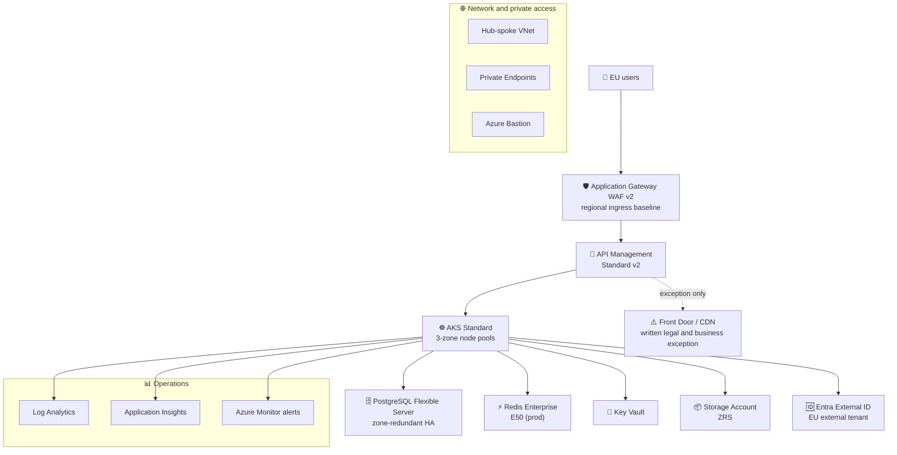

# 🏛️ Step 2: Architecture Assessment - Contoso Service Hub

<strong>📑 Assessment Contents</strong>

- [✅ Requirements Validation](#-requirements-validation)
- [💎 Executive Summary](#-executive-summary)
- [🏛️ WAF Pillar Assessment](#-waf-pillar-assessment)
- [📦 Resource SKU Recommendations](#-resource-sku-recommendations)
- [🎯 Architecture Decision Summary](#-architecture-decision-summary)
- [🚀 Implementation Handoff](#-implementation-handoff)
- [🔒 Approval Gate](#-approval-gate)
- [References](#references)

> Generated by architect agent | 2026-04-02

| ⬅️ Previous                              | 📑 Index            | Next ➡️                                            |
| ---------------------------------------- | ------------------- | -------------------------------------------------- |
| [01-requirements.md](01-requirements.md) | [README](README.md) | [03-des-cost-estimate.md](03-des-cost-estimate.md) |

---

## ✅ Requirements Validation

| Requirement Area        | Status     | Validation Notes |
| ----------------------- | ---------- | ---------------- |
| NFRs (SLA, RTO, RPO)    | ✅ Defined | 99.9% service target, 4h RTO, 1h RPO, <2s page load, <500 ms API p95, 1,000+ concurrent users |
| Compliance requirements | ✅ Defined | GDPR mandatory, PCI-DSS in-scope, tenant EU Data Boundary prerequisite, EU-only processing baseline |
| Budget (approximate)    | ✅ Defined | Commercial envelope is EUR 11,000-14,000/month; technical Azure retail benchmark is USD 9,488/month |
| Scale requirements      | ✅ Defined | 5K MVP users, 15K+ by 2027, 50K to 2M transactions/year, 5M to 20M+ API calls/month |
| Security controls       | ✅ Defined | Regional WAF, private data plane, managed identity, Key Vault, TLS 1.2+, CIAM and MFA policy constraints |
| Data residency          | ✅ Defined | swedencentral baseline, ZRS storage, Front Door treated only as a documented exception path |

> [!NOTE]
> This self-corrected Step 2 keeps the customer-facing commercial budget in EUR and the Azure retail
> engineering model in USD. No FX conversion is implied in this artifact.

---

## 💎 Executive Summary

Contoso Service Hub is a greenfield EU digital services platform for bookings, payments, content,
and customer engagement. The corrected compliant baseline is a regional Azure architecture in
`swedencentral` built around **Application Gateway WAF v2**, **API Management Standard v2**,
**AKS**, **PostgreSQL Flexible Server**, **Redis Enterprise**, and private data services.

This revision fixes the Step 2 drift in four places:

- **Ingress baseline**: Application Gateway WAF v2 is the compliant public ingress baseline.
  Azure Front Door is not the default path because Microsoft documents Front Door and Azure CDN as
  services excluded from the EU Data Boundary.
- **Tenant sovereignty prerequisite**: Azure EU Data Boundary must be configured on a **new, empty
  tenant** before any subscriptions or resources are created. The external tenant country/region is
  an immutable data-location choice.
- **CIAM and MFA constraints**: Customer-facing External ID MFA in external tenants supports email
  one-time passcode and optional SMS add-on. SMS is not part of the compliant default because PSTN
  and SMS routing can leave the EU Data Boundary. Workforce and admin identities should use
  phishing-resistant methods such as passkeys or FIDO2 rather than PSTN or push-based flows when
  strict sovereignty is required.
- **Reliability wording**: This is a **single-region, zone-redundant** design. It is resilient to
  many zonal failures, but it does not provide automatic regional failover. Any 99.9% statement is a
  design objective for the workload, not an honest claim of region-loss continuity.

### Recommended Architecture

---

## 🏛️ WAF Pillar Assessment

### Overall Scores

| Pillar                    | Score | Confidence | Summary |
| ------------------------- | ----- | ---------- | ------- |
| 🔒 Security               | 8/10  | High       | Regional WAF, private data plane, tenant sovereignty guardrails, and explicit CIAM controls materially reduce compliance ambiguity |
| 🔄 Reliability            | 6/10  | Medium     | Strong intra-region resilience, but no automatic region failover and APIM Standard v2 remains single-datacenter within the region |
| ⚡ Performance            | 7/10  | Medium     | Regional ingress is acceptable for EU users, but it intentionally gives up Front Door anycast acceleration unless an exception is approved |
| 💰 Cost Optimization      | 8/10  | Medium     | One coherent USD benchmark of $9,488/month across all environments fits the engineering envelope without relying on Front Door |
| 🔧 Operational Excellence | 7/10  | Medium     | Good IaC and observability posture, but tenant sequencing, exception handling, and recovery runbooks still require discipline |

**Primary Pillar Optimized**: Security and compliance.
**Trade-offs Accepted**: Regional ingress over global edge, manual regional recovery, and a separate
commercial EUR budget view from the technical USD benchmark model.

### 🔒 Security Assessment (8/10)

**Strengths:**

- Application Gateway WAF v2 is a regional Layer 7 ingress with OWASP-based protection and
  prevention mode support.
- PostgreSQL, Redis, Storage, and Key Vault stay on private connectivity and avoid public data plane
  exposure.
- The tenant sequence is explicit: create a new EU/EFTA tenant, configure Azure EU Data Boundary,
  then create subscriptions and resources.
- Entra External ID tenant location is fixed at creation time, which supports governance review up
  front instead of after deployment.
- The workload can keep PCI-oriented segmentation at the regional edge, API, and data layers.

**Gaps:**

- Azure Front Door and Azure CDN remain outside the EU Data Boundary and therefore require a written
  exception if ever reintroduced.
- SMS-based MFA in external tenants is optional, billable, and depends on telephony paths that can
  route outside the EU boundary.
- Entra services still document limited residual or optional cross-boundary behaviors, so compliance
  must be expressed as a managed risk posture rather than an absolute zero-egress claim.

**Recommendations:**

1. Make the EU Data Boundary tenant configuration a formal go/no-go prerequisite before subscription
   creation.
2. Keep customer MFA on email OTP as the default external-tenant second factor, with SMS by
   documented exception only.
3. Enforce phishing-resistant MFA for workforce and admin identities by using passkeys or FIDO2 and
   avoiding PSTN and push-based methods where sovereignty is strict.

### 🔄 Reliability Assessment (6/10)

**Strengths:**

- AKS can distribute node pools across availability zones in `swedencentral`, and the Standard tier
  carries an uptime SLA when zones are enabled.
- PostgreSQL Flexible Server with zone-redundant HA provides automatic failover inside the region and
  a documented 99.99% service SLA.
- ZRS storage and zone-aware design choices reduce single-datacenter failure exposure.
- The platform remains compatible with a future multi-region DR release without replatforming the core
  services.

**Gaps:**

- This workload is still a **single-region** design. A region-wide outage requires manual recovery and
  redeployment activities.
- API Management Standard v2 does not support availability zones or multi-region deployment, so it is
  a key reliability limiter in the current baseline.
- The workload cannot honestly claim automatic 99.9% continuity for region-loss events.
- RTO and RPO are credible only if backup, restore, and redeployment runbooks are rehearsed.

**Recommendations:**

1. Describe 99.9% as a workload target for planned production operations, not as proof of automatic
   survival of a regional outage.
2. Plan Release 2.0 around multi-region recovery if the business truly needs a hard 4h RTO and 1h
   RPO under region-loss scenarios.
3. Revisit API Management Premium or Premium v2 if zone redundancy at the API layer becomes a
   contractual requirement.

### ⚡ Performance Assessment (7/10)

**Strengths:**

- EU users are concentrated enough that regional ingress in `swedencentral` remains viable for the
  stated latency target.
- Redis Enterprise keeps the read-heavy and session-heavy paths off PostgreSQL.
- AKS autoscaling and zone-aware node pools support burst handling inside the region.
- API Management Standard v2 is suitable for the current 5M request/month baseline.

**Gaps:**

- Regional ingress does not provide the same edge acceleration or global PoP reach as Front Door.
- Performance claims depend on disciplined caching, health probes, and horizontal scaling in AKS.
- The architecture still needs load testing before it can validate the 2M transaction/year growth path.

**Recommendations:**

1. Benchmark the regional App Gateway to APIM to AKS path from representative EU geographies before
   sign-off.
2. Reserve Front Door for a formally approved exception path where measured user experience justifies
   the sovereignty trade-off.
3. Set autoscale, cache hit-rate, and p95 latency alerts before MVP launch.

### 💰 Cost Assessment (8/10)

| Service                    | SKU / Baseline            | Monthly Cost (USD) | Notes |
| -------------------------- | ------------------------- | -----------------: | ----- |
| AKS                        | Standard, 3× D8s_v5 prod  |                770 | Production benchmark |
| PostgreSQL Flexible Server | GP D4ds_v5, HA            |                450 | Production benchmark |
| Redis Enterprise           | E50                       |              2,520 | Dominant production cost driver |
| API Management             | Standard v2               |                350 | Production benchmark |
| Application Gateway WAF v2 | WAF v2, 3-zone prod       |                400 | Compliant regional ingress |
| Virtual Machine            | D8s_v5                    |                330 | Management workload |
| Monitoring                 | LAW + App Insights        |                400 | Production benchmark |
| Networking                 | VNet, Bastion, DNS        |                280 | Production benchmark |
| Storage + Key Vault        | ZRS + Standard            |                 65 | Production benchmark |
| Entra External ID          | External tenant baseline  |                 30 | Production benchmark |
| **Production Total**       |                           |          **5,595** | USD technical benchmark |

**Environment benchmark totals:**

| Environment | Monthly Cost (USD) | Annual Cost (USD) | Cost Notes |
| ----------- | -----------------: | ----------------: | ---------- |
| Development |              1,402 |            16,824 | Reduced AKS, Redis E10, shared networking |
| Staging     |              2,491 |            29,892 | Intermediate sizing and App Gateway baseline |
| Production  |              5,595 |            67,140 | Full compliant baseline |
| **Total**   |          **9,488** |       **113,856** | Single engineering benchmark used across Step 2 |

**Cost Optimization Applied:**

- The revised Step 2 cost baseline uses the downstream validated App Gateway configuration instead of
  the superseded Front Door estimate.
- Non-production environments right-size Redis and AKS instead of blindly mirroring production.
- The customer-facing commercial budget remains EUR 11,000-14,000/month; the Azure retail benchmark
  remains USD 9,488/month. This artifact intentionally avoids implied FX conversion.

### 🔧 Operational Excellence Assessment (7/10)

**Strengths:**

- The architecture remains AVM-first and compatible with the Step 4 Bicep plan.
- Centralized Azure Monitor, Log Analytics, and Application Insights support operations from day one.
- The compliant path is now explicit, which reduces late-stage governance churn.
- Environment-specific right-sizing gives a better operational and financial baseline than copying
  production everywhere.

**Gaps:**

- Recovery still depends on manual regional rebuild actions and tested runbooks.
- Tenant creation, EU Data Boundary enablement, and CIAM policy configuration are easy to sequence
  incorrectly if they are not treated as prerequisites.
- Front Door and SMS-based MFA still need a formal exception mechanism if business teams request them.

**Recommendations:**

1. Add a preflight gate that verifies EU Data Boundary tenant state before any IaC deployment.
2. Add budget alerts, capacity alerts, and App Gateway health probes as mandatory Day 0 controls.
3. Create a written exception workflow for Front Door, SMS MFA, or other non-regional service choices.

---

## 📦 Resource SKU Recommendations

| Service                    | Recommended SKU             | Configuration | Monthly Est. | Justification |
| -------------------------- | --------------------------- | ------------- | -----------: | ------------- |
| Application Gateway        | WAF v2                      | Prevention mode, multi-zone prod, dedicated subnet | $400 | Compliant regional ingress baseline |
| API Management             | Standard v2                 | Single-region production tier | $350 | Production-ready, but no AZ support |
| AKS                        | Standard                    | 3× D8s_v5 prod, zone-aware node pools | $770 | Meets managed Kubernetes requirement |
| PostgreSQL Flexible Server | GP D4ds_v5                  | Zone-redundant HA, 256 GB storage | $450 | Right-sized primary database baseline |
| Redis Enterprise           | E50                         | 128 GB prod, reduced non-prod tiers | $2,520 | Meets production cache requirement |
| Storage Account            | StorageV2, ZRS              | 200 GB hot tier, private endpoints | $50 | EU-only redundancy posture |
| Key Vault                  | Standard                    | Private endpoint, soft delete, purge protection | $15 | Secret and certificate baseline |
| Entra External ID          | External tenant             | EU tenant location, email OTP default, SMS exception | $30 | CIAM baseline with explicit MFA constraints |
| Monitoring                 | Pay-as-you-go               | LAW + App Insights + alerts | $400 | Centralized observability |
| Bastion and networking     | Standard                    | Bastion, hub-spoke VNet, Private DNS | $280 | Private operational access |

<strong>Ingress Choice</strong> — Application Gateway WAF v2 vs Front Door Exception

| Criterion | Application Gateway WAF v2 | Azure Front Door Premium |
| --------- | -------------------------- | ------------------------ |
| EU Data Boundary baseline | ✅ Regional compliant path | ❌ Excluded service |
| WAF model | ✅ WAF policies, prevention mode | ✅ WAF policies |
| Global anycast acceleration | ❌ Regional only | ✅ Yes |
| Default selection | ✅ Baseline | ❌ Exception only |
| Monthly benchmark | ~$250-$400 by environment | ~$400 production estimate only |

**Selected**: Application Gateway WAF v2. Front Door remains available only through a documented
exception path with legal and business approval.

<strong>API Tier</strong> — Standard v2 vs Premium Escalation Path

| Criterion | Standard v2 | Premium / Premium v2 |
| --------- | ----------- | -------------------- |
| Production-ready SLA | ✅ Yes | ✅ Yes |
| Availability zones | ❌ No | ✅ Yes |
| Multi-region support | ❌ No | Premium classic only |
| Current fit | ✅ Fits MVP scale and cost envelope | ⚠️ Revisit if stricter API resilience is contracted |

**Selected**: Standard v2 for the baseline. Escalate only if the API layer needs zone redundancy or
more stringent contractual availability.

---

## 🎯 Architecture Decision Summary

| Decision | Choice | Rationale |
| -------- | ------ | --------- |
| Public ingress baseline | Application Gateway WAF v2 | Regional WAF keeps the compliant baseline inside the EU data-boundary posture |
| Front Door usage | Exception path only | Microsoft documents Front Door and CDN as excluded from the EU Data Boundary |
| Tenant setup | New EU/EFTA tenant plus EU Data Boundary before subscriptions | Data boundary can be established only on new empty tenants |
| Customer MFA baseline | External tenant email OTP default; SMS only by exception | External-tenant MFA supports email OTP and SMS add-on; SMS has sovereignty and cost implications |
| Workforce and admin MFA | Prefer passkeys or FIDO2 | Avoid PSTN and push-based methods where strict sovereignty is required |
| Reliability statement | Single-region, zone-redundant design target | Honest wording avoids implying automatic regional continuity |
| Cost baseline | USD 9,488/month engineering benchmark across all environments | Replaces the superseded Front Door-based Step 2 estimate |

### Service Maturity Assessment

| Service                    | GA Status | AZ Support in Chosen Tier | EU Sovereignty Note | Retirement Risk |
| -------------------------- | --------- | ------------------------- | ------------------- | --------------- |
| Application Gateway WAF v2 | ✅ GA     | ✅ Yes                    | Regional service | None |
| API Management Standard v2 | ✅ GA     | ❌ No                     | Regional service | None |
| AKS Standard               | ✅ GA     | ✅ Yes with zone-aware node pools | Regional service | None |
| PostgreSQL Flexible Server | ✅ GA     | ✅ Yes with zone-redundant HA | Regional service | None |
| Redis Enterprise           | ✅ GA     | ✅ Yes in selected baseline | Regional service | None |
| Entra External ID          | ✅ GA     | N/A                       | Tenant location and optional capabilities must be reviewed | None |
| Azure Front Door           | ✅ GA     | N/A                       | Excluded from EU Data Boundary baseline | None |

---

## 🚀 Implementation Handoff

### Ready for IaC Planner

The corrected architecture is ready for implementation with the following key parameters:

| Parameter | Value |
| --------- | ----- |
| Region | swedencentral |
| Environments | Development, Staging, Production |
| Budget | EUR 11,000-14,000/month commercial envelope; USD 9,488/month technical benchmark |
| Resource Count | 15 Azure services plus tenant-level prerequisites |
| IaC Tool | Bicep with AVM modules where available |
| Network Topology | Hub-spoke with private data services and dedicated App Gateway subnet |
| DR Strategy | Single-region, zone-redundant where supported; manual regional recovery |
| Governance Gate | Resource group creation is blocked until all 9 mandatory tag keys are present; `technical-contact` and `tech-contact` must both be accounted for in IaC inputs |

### Resources to Provision

| # | Resource | SKU | Key Config |
| - | -------- | --- | ---------- |
| 1 | Application Gateway WAF v2 | WAF v2 | Prevention mode, regional public ingress |
| 2 | API Management | Standard v2 | Single-region API gateway |
| 3 | AKS | Standard | Zone-aware system and user pools |
| 4 | PostgreSQL Flexible Server | GP D4ds_v5 | Zone-redundant HA |
| 5 | Redis Enterprise | E50 prod | Right-sized non-prod tiers |
| 6 | Storage Account | StorageV2, ZRS | No public blob access |
| 7 | Key Vault | Standard | Private endpoint |
| 8 | Entra External ID | External tenant | EU location chosen at creation |
| 9 | VNet, subnets, NSGs | Standard | Hub-spoke and private connectivity |
| 10 | Bastion | Standard | Operational access only |
| 11 | Monitoring stack | Pay-as-you-go | LAW, App Insights, alerts |

### Security Requirements for Implementation

| Requirement | Implementation |
| ----------- | -------------- |
| EU tenant prerequisite | Create a new EU/EFTA tenant and configure Azure EU Data Boundary before subscriptions |
| External tenant data location | Choose EU country/region at tenant creation; this choice is immutable |
| CIAM MFA baseline | Enable external-tenant MFA with email OTP by default; keep SMS disabled unless approved |
| Workforce/admin MFA | Use passkeys or FIDO2 where strict sovereignty is required |
| Public ingress | Application Gateway WAF v2 in prevention mode |
| Data plane exposure | Private endpoints for PostgreSQL, Redis, Storage, and Key Vault |
| Storage security | `allowBlobPublicAccess = false`, `allowSharedKeyAccess = false`, `supportsHttpsTrafficOnly = true` |

### Monitoring Requirements for Implementation

| Requirement | Implementation |
| ----------- | -------------- |
| Edge health | App Gateway health probes and Azure Monitor alerts |
| API resilience | APIM capacity, backend retry, and circuit-breaker policies |
| Database recovery | Backup validation and restore runbook testing |
| Cost control | Budget alerts in USD benchmark terms plus separate commercial finance tracking in EUR |
| Sovereignty controls | Pre-deployment check for tenant data-boundary state and approved exception register |

---

## 🔒 Approval Gate

> [!IMPORTANT]
> **🏗️ Architecture Assessment Complete**
>
> | Pillar      | Score |
> | ----------- | ----- |
> | Security    | 8/10  |
> | Reliability | 6/10  |
> | Performance | 7/10  |
> | Cost        | 8/10  |
> | Operations  | 7/10  |
>
> **Estimated Monthly Cost**: USD 9,488/month technical benchmark across all environments
>
> **Commercial Budget View**: EUR 11,000-14,000/month customer-facing envelope
>
> **Confidence Level**: Medium-High
>
> - [ ] **Approved** — proceed to iac-planner
> - Approver: Contoso delivery team
> - Date: 2026-04-02

---

## References

> [!NOTE]
> 📚 The following Microsoft Learn resources informed this corrected assessment.

| Topic | Link |
| ----- | ---- |
| Well-Architected Framework | [Overview](https://learn.microsoft.com/azure/well-architected/) |
| Application Gateway WAF v2 | [Overview](https://learn.microsoft.com/azure/web-application-firewall/ag/ag-overview) |
| Regional App Gateway guidance | [Secure hub-spoke design](https://learn.microsoft.com/azure/networking/cross-service-scenarios/design-secure-hub-spoke-network#application-gateway-with-waf) |
| Azure EU Data Boundary configuration | [Configure data boundary](https://learn.microsoft.com/azure/azure-resource-manager/management/manage-data-boundary) |
| EU Data Boundary excluded services | [Excluded services](https://learn.microsoft.com/privacy/eudb/eu-data-boundary-excluded-services#azure-services) |
| External tenant MFA | [External tenant MFA](https://learn.microsoft.com/entra/external-id/customers/concept-multifactor-authentication-customers) |
| Entra data storage for Europe | [European customer data storage](https://learn.microsoft.com/entra/fundamentals/data-storage-eu) |
| API Management reliability | [Reliability in API Management](https://learn.microsoft.com/azure/reliability/reliability-api-management) |
| PostgreSQL reliability | [Reliability in PostgreSQL](https://learn.microsoft.com/azure/reliability/reliability-database-postgresql) |
| AKS reliability | [Reliability in AKS](https://learn.microsoft.com/azure/reliability/reliability-aks) |

---

_Assessment performed using the Azure Well-Architected Framework. Cost values reflect the corrected
regional-ingress benchmark aligned to the validated downstream SKU model on 2026-04-02._

---

| ⬅️ [01-requirements.md](01-requirements.md) | 🏠 [Project Index](README.md) | ➡️ [03-des-cost-estimate.md](03-des-cost-estimate.md) |
| ------------------------------------------- | ----------------------------- | ----------------------------------------------------- |

