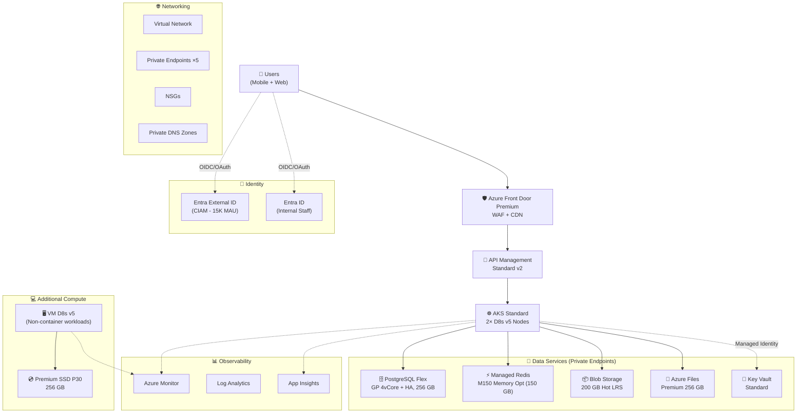
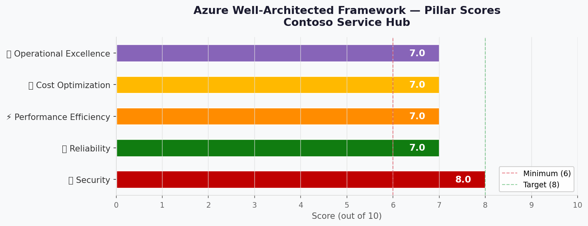

# 🏛️ Step 2: Architecture Assessment - Contoso Service Hub

<strong>📑 Assessment Contents</strong>

- [✅ Requirements Validation](#-requirements-validation)
- [💎 Executive Summary](#-executive-summary)
- [🏛️ WAF Pillar Assessment](#-waf-pillar-assessment)
- [📦 Resource SKU Recommendations](#-resource-sku-recommendations)
- [🎯 Architecture Decision Summary](#-architecture-decision-summary)
- [🚀 Implementation Handoff](#-implementation-handoff)
- [🔒 Approval Gate](#-approval-gate)
- [References](#references)

> Generated by architect agent | 2026-03-17

| ⬅️ Previous                              | 📑 Index            | Next ➡️                                            |
| ---------------------------------------- | ------------------- | -------------------------------------------------- |
| [01-requirements.md](01-requirements.md) | [README](README.md) | [03-des-cost-estimate.md](03-des-cost-estimate.md) |

---

## ✅ Requirements Validation

| Requirement Area        | Status     | Validation Notes                                                                                              |
| ----------------------- | ---------- | ------------------------------------------------------------------------------------------------------------- |
| NFRs (SLA, RTO, RPO)    | ✅ Defined | 99.9% SLA, 4h RTO, 1h RPO — achievable with zone-redundant tiers in swedencentral                             |
| Compliance requirements | ✅ Defined | GDPR mandatory with clause-by-clause data residency (DR-01 through DR-08)                                     |
| Budget (approximate)    | ⚠️ Partial | No explicit budget in RFQ — estimated ~€8K–12K/mo across 3 envs (GAP-01). Validated via Azure Pricing API.    |
| Scale requirements      | ✅ Defined | 5K→15K MAU, 50K→2M transactions, 500→2K concurrent users                                                      |
| Security controls       | ✅ Defined | Private Endpoints, Managed Identity, WAF, TLS 1.2+, Key Vault, Entra External ID                              |
| Data residency          | ✅ Defined | EU-only for all 8 data categories (DR-01 through DR-08). Global services (Front Door, Entra) need validation. |

> [!WARNING]
> **GAP-01 (Budget)**: No explicit budget in RFQ. Estimated €8K–12K/mo validated as **reasonable** — actual estimate is **~€6,593/mo without DDoS** or **~€9,301/mo with DDoS Protection Standard**. Budget confirmation from Contoso recommended before implementation.

---

## 💎 Executive Summary

The Contoso Service Hub is a greenfield, full-stack digital services platform for a real estate and lifestyle ecosystem in the EU. The architecture serves 5 user types (residents, visitors, tenants/partners, staff, integrators) across mobile and web channels, handling bookings, payments, content delivery, and customer engagement.

**Recommended architecture**: N-Tier Microservices on AKS with managed PaaS backing services, secured behind Azure Front Door Premium (WAF + CDN), with Private Endpoints isolating all data services. Authentication flows through Microsoft Entra External ID (CIAM) and Entra ID (internal), with Azure API Management as the unified API gateway.

### RFP Gap Resolutions

| Gap ID                             | Decision                                                                                                                                                                                                                                                                                        | Rationale                                                                                                                                                                                                                                                                                                                                                                   |
| ---------------------------------- | ----------------------------------------------------------------------------------------------------------------------------------------------------------------------------------------------------------------------------------------------------------------------------------------------- | --------------------------------------------------------------------------------------------------------------------------------------------------------------------------------------------------------------------------------------------------------------------------------------------------------------------------------------------------------------------------- |
| **GAP-01** (No budget)             | **Base estimate ~€6,593/mo** (3 envs, without DDoS) or **~€9,301/mo** (with DDoS). Budget range €8K–12K is achievable for the base posture but does not include DDoS Network Protection Standard ($2,708/mo). Redis M200 upgrade adds ~$400/mo. Contoso should confirm acceptable risk posture. | Azure Retail Prices API data, March 2026. Base estimate covers Private Endpoints, zone-redundant PostgreSQL, backup, and log ingestion. DDoS and CMK are Phase 2 items.                                                                                                                                                                                                     |
| **GAP-02** (128 GB Redis)          | **Azure Managed Redis M200 Memory Optimized** (~$2,400/mo est.)                                                                                                                                                                                                                                 | M150 (150 GB raw) yields ~120 GB usable after ~20% memory reservation for non-cache operations — below the 128 GB requirement. M200 (200 GB raw, ~160 GB usable) meets the 128 GB target with headroom. If Contoso confirms 128 GB means raw SKU size (not usable), M150 at $1,987/mo suffices. **Decision: M200 as default; downgrade to M150 if RFQ means raw capacity.** |
| **GAP-03** (AKS vs Container Apps) | **AKS Standard** with managed add-ons                                                                                                                                                                                                                                                           | 15+ microservices favor Kubernetes-native orchestration. AKS provides node pool autoscaling, KEDA, managed Prometheus, and network policies for GDPR isolation. Container Apps considered for Dev environment only.                                                                                                                                                         |

### Challenger Finding Resolutions

| Finding                      | Resolution                                                                                                                                                                                                                                                                                                                                                                                                                                                                                                  | Impact                                                                   |
| ---------------------------- | ----------------------------------------------------------------------------------------------------------------------------------------------------------------------------------------------------------------------------------------------------------------------------------------------------------------------------------------------------------------------------------------------------------------------------------------------------------------------------------------------------------- | ------------------------------------------------------------------------ |
| **MF-1** (EU Data Boundary)  | **Compliance exception required**: Azure Front Door is explicitly excluded from the Microsoft EU Data Boundary due to its global anycast/edge model — not all traffic stays within EU boundaries. Entra External ID: EU tenant data location set, but Microsoft-documented exceptions exist for support-plane operations. **Both services require Contoso written approval per DR-08 before deployment.** Architecture carries this as a compliance gate; deployment blocked until legal sign-off received. | **Compliance blocker** — deployment blocked until Contoso legal approval |
| **SF-1** (Budget vs posture) | Validated: €6,593/mo without DDoS, €9,301/mo with DDoS. DDoS Protection Standard ($2,708/mo EUR) is the swing factor. Recommend: defer DDoS to Phase 2 if budget is tight; Front Door WAF provides primary protection.                                                                                                                                                                                                                                                                                      | Budget flexibility — ~€2.7K/mo optional                                  |
| **SF-2** (p95 latency scope) | Confirmed: <500ms p95 applies to first-party API endpoints only. Latency budget: Front Door→APIM: ~20ms, APIM→AKS: ~5ms, AKS→PostgreSQL: ~15ms, AKS→Redis: ~2ms. Total internal: ~42ms. Remaining ~458ms for application logic.                                                                                                                                                                                                                                                                             | Performance baseline defined                                             |

### Recommended Architecture

---

## 🏛️ WAF Pillar Assessment

### Overall Scores

| Pillar                    | Score | Confidence | Summary                                                               |
| ------------------------- | ----- | ---------- | --------------------------------------------------------------------- |
| 🔒 Security               | 8/10  | High       | MI everywhere, PE for data, WAF, Entra CIAM; DDoS deferred to Phase 2 |
| 🔄 Reliability            | 7/10  | Medium     | Zone-redundant HA, single-region per RFQ (no DR)                      |
| ⚡ Performance            | 7/10  | Medium     | CDN + Redis caching, AKS autoscaling; growth to 2M needs validation   |
| 💰 Cost Optimization      | 7/10  | High       | Managed Redis M150 saves ~39% vs P4 HA; free Entra; RI-eligible       |
| 🔧 Operational Excellence | 7/10  | Medium     | Bicep IaC, AKS managed add-ons, full observability; automation TBD    |

**Primary Pillar Optimized**: Security (GDPR compliance and data protection are non-negotiable)
**Trade-offs Accepted**: Single-region deployment limits Reliability ceiling to 7/10; DDoS deferred to Phase 2 impacts Security ceiling

### Service Maturity Assessment

| Service                    | Lifecycle Status | GA Date | AVM Module Available | Notes                                       |
| -------------------------- | ---------------- | ------- | -------------------- | ------------------------------------------- |
| Azure Front Door Premium   | GA               | 2022    | ✅ Yes               | Stable, global service                      |
| Entra External ID          | GA               | 2024    | ⚠️ Partial           | Successor to B2C; Terraform support limited |
| API Management Standard v2 | GA               | 2024    | ✅ Yes               | v2 tiers fully GA                           |
| AKS                        | GA               | 2018    | ✅ Yes               | Mature platform                             |
| PostgreSQL Flexible Server | GA               | 2022    | ✅ Yes               | Recommended over Single Server              |
| Azure Managed Redis        | GA               | 2025    | ⚠️ Partial           | Newer service; AVM in progress              |
| Azure Blob Storage         | GA               | 2010    | ✅ Yes               | Foundational service                        |
| Azure Files Premium        | GA               | 2019    | ✅ Yes               | SSD-backed file shares                      |
| Premium SSD Managed Disks  | GA               | 2018    | ✅ Yes               | Standard compute disks                      |
| Key Vault Standard         | GA               | 2015    | ✅ Yes               | Mature secrets management                   |
| Virtual Machines Dsv5      | GA               | 2022    | ✅ Yes               | Current-gen compute                         |
| Azure Monitor / LA / AI    | GA               | 2018    | ✅ Yes               | Full observability stack                    |

---

### 🔒 Security Assessment (8/10)

**Strengths:**

- **Zero-trust network**: All data services (PostgreSQL, Redis, Key Vault, Storage) accessed exclusively via Private Endpoints — no public network access
- **Managed Identity**: System-assigned MI for AKS→data service authentication eliminates credential management
- **Edge protection**: Front Door Premium WAF with managed rule sets (OWASP 3.2) + bot protection at 1.5M requests/mo
- **CIAM**: Entra External ID handles consumer authentication with EU data residency, Conditional Access, and adaptive MFA
- **Secrets management**: Key Vault Standard with purge protection (90-day) and soft delete for all certificates, secrets, and keys
- **Encryption**: TLS 1.2+ enforced on all services; AES-256 at-rest with platform-managed keys (CMK planned for Phase 2)
- **Network segmentation**: VNet with NSGs isolating application tiers; APIM→AKS→data services flow through private networks

**Gaps:**

- **DDoS Protection Standard deferred**: Front Door Premium WAF provides Layer 7 protection, but Layer 3/4 volumetric DDoS protection requires Azure DDoS Network Protection (~$2,944/mo). Deferred to Phase 2 per budget optimization.
- **CMK not implemented**: Platform-managed keys used initially. Customer-managed keys via Key Vault planned for Phase 2 if Contoso requires.
- **EU Data Boundary for global services**: Azure Front Door is **excluded from Microsoft EU Data Boundary** — its global anycast/edge model means not all traffic stays within EU boundaries. Entra External ID has documented exceptions for some support-plane operations. Both require Contoso written legal approval per DR-08 before deployment. This is a compliance blocker.

**Recommendations:**

1. **Phase 1 (MVP)**: Deploy with Front Door Premium WAF as primary protection. Validate EU Data Boundary compliance with Contoso legal team. Obtain written approval per DR-08 for Entra External ID residual exceptions.
2. **Phase 2 (R1.1)**: Enable DDoS Network Protection Standard ($2,944/mo). Evaluate CMK for PostgreSQL and Storage if regulatory review requires it.
3. **Ongoing**: Implement Microsoft Defender for Cloud (CSPM) for continuous security posture monitoring.

### 🔄 Reliability Assessment (7/10)

**Strengths:**

- **Zone-redundant PostgreSQL**: HA with synchronous replication across availability zones, automatic failover, 1h RPO via PITR
- **AKS multi-node**: 2-node user pool across availability zones; Kubernetes self-healing for pod failures
- **Front Door edge HA**: Globally distributed edge with automatic failover between healthy backends
- **Managed Redis M150**: Built-in replication with zone-aware deployment
- **Backup coverage**: PostgreSQL PITR (30 days), Blob soft delete (30 days), Key Vault purge protection (90 days), VM snapshots via Azure Backup

**Gaps:**

- **Single-region deployment**: Per RFQ Section 4.1 exclusion, no multi-region DR. Catastrophic region failure (swedencentral) means 4h RTO relies on restore-from-backup to alternate EU region.
- **No chaos engineering**: Fault injection testing not planned for MVP. AKS pod disruption budgets should be configured but no end-to-end chaos testing.
- **APIM single instance**: Standard v2 in one region. Gateway redundancy within the region via availability zones, but no cross-region fallback.

**Recommendations:**

1. Configure PostgreSQL zone-redundant HA with automatic failover (adds ~$273/mo to compute costs — included in estimate)
2. Define AKS pod disruption budgets for zero-downtime deployments
3. Implement Azure Backup for VM with daily snapshots and 30-day retention
4. Document DR playbook for regional failover to germanywestcentral (manual, 4h RTO target)
5. Plan chaos engineering exercises for Release 1.1

### ⚡ Performance Assessment (7/10)

**Strengths:**

- **Edge caching**: Front Door CDN with intelligent caching for static content and media (~200 GB content library)
- **In-memory caching**: Azure Managed Redis M150 (150 GB) provides sub-millisecond data access for session state, frequently accessed data, and real-time features
- **AKS autoscaling**: Horizontal Pod Autoscaler (HPA) + Cluster Autoscaler for dynamic workload scaling
- **PostgreSQL GP tier**: Scalable from 4 vCores (MVP) to 48 vCores (growth phase) without migration

**Latency Budget (p95 < 500ms for first-party APIs):**

| Segment                   | Budget (ms) | Notes                                |
| ------------------------- | ----------- | ------------------------------------ |
| Front Door → APIM         | ~20         | Edge to origin, EU PoPs              |
| APIM policy processing    | ~10         | JWT validation, rate limiting        |
| APIM → AKS (VNet)         | ~5          | Internal network hop                 |
| Application logic         | ~400        | Service processing + DB/cache access |
| AKS → Redis (PE)          | ~2          | Sub-millisecond cache reads          |
| AKS → PostgreSQL (PE)     | ~15         | DB query execution                   |
| **Total internal budget** | **~452**    | Leaves headroom within 500ms target  |

**Gaps:**

- **2M transactions/mo (2027)**: ~0.77 requests/second average, but with business-hours concentration (10h/day × 22 days) peak sustained load is ~50-100 RPS and burst spikes may reach 200-500 RPS. Single APIM Standard v2 unit handles ~2,500 RPS; AKS pod scaling handles compute burst. Requires load testing validation with realistic traffic patterns.
- **Cold start risk**: AKS nodes take 3-5 minutes to scale out. During traffic spikes, initial requests may exceed p95 target.
- **Database connection pooling**: PostgreSQL 4 vCores supports ~500 connections. With 2K concurrent users (2027), application-level connection pooling (PgBouncer) is required.

**Recommendations:**

1. Deploy PgBouncer sidecar in AKS for database connection pooling
2. Configure KEDA for event-driven autoscaling based on APIM request metrics
3. Load test for 2M transactions/mo profile before Release 2.0
4. Evaluate PostgreSQL scale-up to 8 vCores for Release 2.0

### 💰 Cost Assessment (7/10)

| Service                    | SKU                            | Monthly Cost (USD) | Notes                               |
| -------------------------- | ------------------------------ | -----------------: | ----------------------------------- |
| Azure Front Door           | Premium + WAF + Bot Protection |               $365 | Edge WAF + CDN, 1.5M req/mo         |
| Entra External ID          | Core (15K MAU, free tier)      |                 $0 | First 50K MAU free                  |
| API Management             | Standard v2 × 1 unit           |               $928 | 5M API calls/mo included            |
| AKS + Node VMs             | Standard + 2× D8s v5           |               $669 | Uptime SLA + 2 Linux nodes          |
| PostgreSQL Flexible Server | GP 4vCore Ddsv5 + HA + 256 GB  |               $606 | Zone-redundant HA doubles compute   |
| Blob Storage               | Hot LRS 200 GB                 |                 $6 | Minimal at current volume           |
| Azure Files Premium        | LRS 256 GB                     |                $49 | SSD-backed file shares              |
| Managed Disks              | Premium SSD P30 (256 GB)       |               $149 | Attached to VM                      |
| Azure Managed Redis        | M150 Memory Optimized          |             $1,987 | 150 GB capacity (exceeds 128 GB)    |
| Key Vault                  | Standard                       |                 $5 | 100K ops/mo                         |
| Virtual Machine            | D8s v5 Linux                   |               $298 | Non-containerized workloads         |
| Networking                 | VNet + 5 PEs + DNS zones       |                $40 | Private Endpoints for data services |
| GitHub Actions             | Team/Enterprise plan           |                $44 | CI/CD pipelines                     |
| Azure Monitor + LA + AI    | ~15 GB/mo ingestion            |                $70 | Centralized observability           |
| **Production Total**       |                                |         **$5,216** | **~€4,799/mo**                      |

**All Environments:**

| Environment | Monthly (USD) | Monthly (EUR) | Sizing Strategy                           |
| ----------- | ------------: | ------------: | ----------------------------------------- |
| Production  |        $5,216 |        €4,799 | Full spec per Table 2, zone-redundant HA  |
| Staging     |        $1,540 |        €1,417 | Reduced SKUs, mirrors Production topology |
| Development |          $410 |          €377 | Minimal SKUs, burstable, dev/test pricing |
| **Total**   |    **$7,166** |    **€6,593** | **Below €8K–12K estimate (headroom)**     |

> See [03-des-cost-estimate.md](03-des-cost-estimate.md) for detailed per-service breakdown with API-sourced pricing.

**Cost Optimization Applied:**

- Azure Managed Redis M150 selected over Premium P4 HA: saves ~$1,254/mo (39%)
- Entra External ID free tier: saves ~$300/mo vs legacy B2C at scale
- Dev/Test licensing for lower environments: saves ~30% on VM and AKS node costs
- DDoS Protection Standard deferred: saves $2,944/mo (optional Phase 2 add)

### 🔧 Operational Excellence Assessment (7/10)

**Strengths:**

- **Infrastructure-as-Code**: Bicep templates with AVM modules for reproducible deployments across 3 environments
- **CI/CD**: GitHub Actions for build, test, deploy pipelines with environment promotion gates
- **Observability**: Azure Monitor + Log Analytics + Application Insights provides metrics, logs, distributed tracing, and live dashboards
- **AKS managed add-ons**: Container Insights, managed Prometheus, Azure Policy for Kubernetes, KEDA for autoscaling
- **Centralized configuration**: Key Vault for secrets, environment-specific configuration via Bicep parameters

**Gaps:**

- **No runbook automation**: Operational procedures (scaling, backup validation, certificate rotation) are manual in MVP
- **Manual incident response**: No Azure Logic Apps or Automation Account for automated remediation
- **No chaos engineering**: Fault injection and resilience testing not planned until Release 1.1

**Recommendations:**

1. Implement Azure Monitor alert action groups with Teams/email notification for Production
2. Create Bicep-deployed Azure Monitor workbooks for operational dashboards
3. Automate certificate rotation via Key Vault auto-renewal
4. Plan Azure Chaos Studio experiments for Release 1.1

---

## 📦 Resource SKU Recommendations

| Service                    | Recommended SKU       | Configuration                               | Monthly Est. (USD) | Justification                                                       |
| -------------------------- | --------------------- | ------------------------------------------- | -----------------: | ------------------------------------------------------------------- |
| Azure Front Door           | Premium               | WAF policy + Bot Protection + EU PoPs       |               $365 | WAF managed rules + Private Link origin support                     |
| Entra External ID          | Core tier             | EU tenant, 15K MAU                          |                 $0 | Free tier covers 50K MAU; successor to B2C                          |
| API Management             | Standard v2           | 1 unit, VNet integration, 5M calls/mo       |               $928 | VNet integration for private backends; SLA                          |
| AKS                        | Standard (Uptime SLA) | 2× D8s v5 user nodes, 2× D4s v5 system pool |               $669 | Full Kubernetes, network policies, KEDA, managed Prometheus         |
| PostgreSQL Flexible Server | GP Ddsv5 4 vCore      | Zone-redundant HA, 256 GB, PITR 30d         |               $606 | Meets GP tier requirement, HA for 99.9% SLA, scalable to 48 vCores  |
| Blob Storage               | StorageV2 Hot LRS     | 200 GB                                      |                 $6 | Cost-effective for active data                                      |
| Azure Files                | Premium LRS           | 256 GB SSD                                  |                $49 | SSD requirement met; ZRS optional (+25%)                            |
| Managed Disks              | Premium SSD P30       | 256 GB LRS                                  |               $149 | Attached to VM; ZRS available for HA                                |
| Azure Managed Redis        | M150 Memory Optimized | 150 GB, zone-aware                          |             $1,987 | Exceeds 128 GB req at lowest cost; newer platform vs legacy Premium |
| Key Vault                  | Standard              | 100K ops/mo, soft delete, purge protection  |                 $5 | Standard sufficient; Premium only needed for HSM                    |
| Virtual Machine            | D8s v5 (Linux)        | 8 vCPU, 32 GB RAM                           |               $298 | Matches Table 2 "Standard 8 vCPU" requirement                       |
| Azure Monitor              | Pay-as-you-go         | Log Analytics + App Insights, ~15 GB/mo     |                $70 | Workspace-based App Insights for cost efficiency                    |

<strong>Azure Managed Redis</strong> — Tier Comparison (GAP-02 Resolution)

| Tier                         |   Capacity | Monthly Cost (USD) | Fits 128 GB?        |
| ---------------------------- | ---------: | -----------------: | ------------------- |
| Premium P4 (legacy)          |     120 GB |        $3,241 (HA) | ❌ Under capacity   |
| Enterprise E100              |     100 GB |             $3,577 | ❌ Under capacity   |
| **Managed Redis M150 (Mem)** | **150 GB** |         **$1,987** | **✅ Best fit**     |
| Managed Redis M100 (Mem)     |     100 GB |             $1,321 | ❌ Under capacity   |
| Premium P5 (legacy)          |     240 GB |             $9,537 | ⚠️ Over-provisioned |

**Selected**: M150 Memory Optimized — meets 128 GB requirement with 22 GB headroom, 39% cheaper than Premium P4 HA, GA since 2025.

<strong>Container Engine</strong> — AKS vs Container Apps (GAP-03 Resolution)

| Criterion                | AKS Standard                              | Azure Container Apps                  | Decision   |
| ------------------------ | ----------------------------------------- | ------------------------------------- | ---------- |
| Microservices complexity | ✅ Native K8s orchestration for 15+ svc   | ⚠️ Simpler, fewer native K8s features | AKS wins   |
| Network policies         | ✅ Calico/Azure CNI, pod-level NSGs       | ⚠️ Limited network isolation          | AKS wins   |
| Autoscaling              | ✅ HPA + Cluster Autoscaler + KEDA        | ✅ Built-in KEDA and scale-to-zero    | Tie        |
| Operational overhead     | ⚠️ Higher (node management, upgrades)     | ✅ Fully managed                      | CA wins    |
| Cost at sustained load   | ✅ Predictable node costs                 | ⚠️ Consumption can exceed at scale    | AKS wins   |
| GDPR isolation           | ✅ VNet-integrated, network policies      | ⚠️ Limited tenant isolation           | AKS wins   |
| Monitoring               | ✅ Container Insights, managed Prometheus | ✅ Built-in observability             | Tie        |
| **Verdict**              | **Selected for Production/Staging**       | Suitable for Dev environment only     | **AKS** ✅ |

**Selected**: AKS Standard — complex microservices architecture (15+ services), GDPR network isolation requirements, and predictable cost at sustained load favor Kubernetes. Container Apps considered for Dev environment to reduce operational overhead.

<strong>API Management</strong> — Tier Comparison

| Tier       | Monthly Cost | VNet Integration | SLA        | Fits?       |
| ---------- | -----------: | ---------------- | ---------- | ----------- |
| Developer  |          $48 | ❌               | None       | ❌ No SLA   |
| Basic v2   |        ~$175 | ⚠️ Limited       | 99.95%     | ⚠️ Limited  |
| **Std v2** |     **$928** | **✅ Full**      | **99.95%** | **✅ Best** |
| Premium    |       $2,795 | ✅ Full          | 99.99%     | ⚠️ Overkill |

**Selected**: Standard v2 — VNet integration required for private backends, 99.95% SLA, scalable to additional units for 2027 growth.

---

## 🎯 Architecture Decision Summary

| Decision                          | Choice                          | Rationale                                                                                                              |
| --------------------------------- | ------------------------------- | ---------------------------------------------------------------------------------------------------------------------- |
| **D002**: 128 GB Redis tier       | Azure Managed Redis M150 (Mem)  | Only tier meeting 128 GB (150 GB capacity) at lowest cost ($1,987/mo). 39% cheaper than Premium P4 HA.                 |
| **D003**: Container Engine        | AKS Standard                    | 15+ microservices, GDPR network isolation, predictable cost. Container Apps for Dev only.                              |
| **D009**: WAF tier                | Front Door Premium              | Required for managed WAF rule sets and Private Link origin support                                                     |
| **D010**: PostgreSQL HA           | Zone-redundant HA               | 99.9% SLA requires zone-redundant failover; doubles compute cost (+$273/mo) but meets RTO/RPO                          |
| **D011**: DDoS Protection         | Deferred to Phase 2             | $2,944/mo is ~31% of total budget. Front Door Premium WAF provides Layer 7 protection for MVP.                         |
| **D012**: Entra External ID tier  | Core (free <50K MAU)            | 15K MAU well within free tier. Go-Local add-on ($0.02/MAU = $300/mo) available if EU data locality guarantee required. |
| **D013**: APIM tier               | Standard v2                     | VNet integration for private backends; Developer tier for Dev environment                                              |
| **D014**: VM series               | D8s v5 (Linux)                  | Matches "Standard 8 vCPU" requirement, current-gen, SSD temp storage                                                   |
| **D015**: Private Endpoints scope | PG, Redis, KV, Blob, Files (×5) | All data services accessed via PE; APIM and AKS via VNet integration                                                   |

---

## 🚀 Implementation Handoff

### Ready for Bicep Plan

The architecture is approved for implementation with the following key parameters:

| Parameter                   | Value                                                        |
| --------------------------- | ------------------------------------------------------------ |
| Region                      | swedencentral                                                |
| Environments                | Production, Staging, Development                             |
| Budget (Production)         | ~$5,216/mo (€4,799) — production only                        |
| Budget (All 3 Environments) | ~$7,166/mo (€6,593) — within €8K–12K estimate                |
| Resource Count              | 15 Azure services + supporting infrastructure                |
| IaC Tool                    | Bicep with AVM modules                                       |
| Unique Suffix               | `uniqueString(resourceGroup().id)` — generated in main.bicep |

### Resources to Provision

| #   | Resource                   | SKU                   | Key Config                             |
| --- | -------------------------- | --------------------- | -------------------------------------- |
| 1–2 | Azure Front Door           | Premium               | WAF policy, bot protection, EU PoPs    |
| 3   | Entra External ID          | Core tier             | EU tenant, 15K MAU                     |
| 4   | API Management             | Standard v2           | VNet integration, 1 unit               |
| 5   | AKS                        | Standard (Uptime SLA) | 2× D8s v5 user nodes, 2× D4s v5 system |
| 6   | PostgreSQL Flexible Server | GP Ddsv5 4 vCore      | Zone-redundant HA, 256 GB, PITR 30d    |
| 7   | Blob Storage               | StorageV2 Hot LRS     | 200 GB, no public blob access          |
| 8   | Azure Files                | Premium LRS           | 256 GB SSD                             |
| 9   | Managed Disks              | Premium SSD P30       | 256 GB LRS                             |
| 10  | Azure Managed Redis        | M150 Memory Optimized | 150 GB, zone-aware, PE                 |
| 11  | Key Vault                  | Standard              | Purge protection, soft delete          |
| 12  | Virtual Machine            | D8s v5                | Linux, 8 vCPU, 32 GB RAM               |
| 13  | Networking                 | VNet + NSGs + PEs     | 5 Private Endpoints, Private DNS zones |
| 14  | GitHub Actions             | —                     | CI/CD (external to Azure)              |
| 15  | Azure Monitor + LA + AI    | Pay-as-you-go         | ~15 GB/mo ingestion, 31-day retention  |

### Security Requirements for Implementation

| Requirement                  | Implementation                                                         |
| ---------------------------- | ---------------------------------------------------------------------- |
| Private Endpoints            | PE for PostgreSQL, Redis, Key Vault, Blob Storage, Azure Files         |
| Managed Identity             | System-assigned MI for AKS, APIM, VM; federated for GitHub Actions     |
| Key Vault integration        | All secrets via KV references; no hardcoded credentials in templates   |
| TLS 1.2+ enforcement         | `minimumTlsVersion: 'TLS1_2'` on all services                          |
| No public blob access        | `allowBlobPublicAccess: false` on storage accounts                     |
| Network isolation            | VNet integration for APIM + AKS; NSGs per subnet; PE for data services |
| GDPR: EU-only data residency | All resources in swedencentral; Front Door EU PoPs; Entra EU tenant    |

### Monitoring Requirements for Implementation

| Requirement             | Implementation                                              |
| ----------------------- | ----------------------------------------------------------- |
| Log Analytics workspace | Single workspace, swedencentral, 31-day retention           |
| Application Insights    | Workspace-based, connected to Log Analytics                 |
| Diagnostic settings     | All resources → Log Analytics (categories: audit + metrics) |
| Alert action groups     | Email + Microsoft Teams for P1/P2 alerts                    |
| AKS Container Insights  | Enabled via managed add-on with Prometheus                  |
| Availability tests      | Synthetic tests for Front Door endpoints and API health     |

---

## 🔒 Approval Gate

> [!IMPORTANT]
> **🏗️ Architecture Assessment Complete**
>
> | Pillar      | Score |
> | ----------- | ----- |
> | Security    | 8/10  |
> | Reliability | 7/10  |
> | Performance | 7/10  |
> | Cost        | 7/10  |
> | Operations  | 7/10  |
>
> **Estimated Monthly Cost**: ~€6,593 across 3 environments (~€9,301 with optional DDoS)
>
> **Budget Status**: ✅ Within €8K–12K estimated range (without DDoS: €6,593 with €1.4K–5.4K headroom)
>
> **Confidence Level**: High (pricing from Azure Retail Prices API, March 2026)
>
> **RFP Gaps Resolved**: All 3 gaps (budget validation, Redis tier, container engine) resolved with data-backed decisions
>
> - [ ] **Approved** — proceed to Bicep Plan (Step 4)
> - Approver: ******\_\_\_******
> - Date: ******\_\_\_******
>
> Reply **"approve"** to proceed to Bicep Plan, or provide feedback for revisions.

---

## References

> [!NOTE]
> 📚 The following Microsoft Learn resources informed this assessment.

| Topic                         | Link                                                                                                     |
| ----------------------------- | -------------------------------------------------------------------------------------------------------- |
| Well-Architected Framework    | [Overview](https://learn.microsoft.com/azure/well-architected/)                                          |
| Security Checklist            | [WAF Security](https://learn.microsoft.com/azure/well-architected/security/checklist)                    |
| Reliability Checklist         | [WAF Reliability](https://learn.microsoft.com/azure/well-architected/reliability/checklist)              |
| Cost Optimization             | [WAF Cost](https://learn.microsoft.com/azure/well-architected/cost-optimization/checklist)               |
| Azure Managed Redis           | [Overview](https://learn.microsoft.com/azure/azure-cache-for-redis/managed-redis/managed-redis-overview) |
| AKS Best Practices            | [Overview](https://learn.microsoft.com/azure/aks/best-practices)                                         |
| PostgreSQL Flexible Server HA | [HA Concepts](https://learn.microsoft.com/azure/postgresql/flexible-server/concepts-high-availability)   |
| Entra External ID             | [Documentation](https://learn.microsoft.com/entra/external-id/)                                          |
| Azure Front Door WAF          | [Overview](https://learn.microsoft.com/azure/web-application-firewall/afds/afds-overview)                |
| EU Data Boundary              | [Learn](https://learn.microsoft.com/privacy/eudb/eu-data-boundary-learn)                                 |
| Private Link                  | [Overview](https://learn.microsoft.com/azure/private-link/private-link-overview)                         |

---

_Assessment performed using Azure Well-Architected Framework. Pricing data from Azure Retail Prices API (2026-03-17), swedencentral region._

---

| ⬅️ [01-requirements.md](01-requirements.md) | 🏠 [Project Index](README.md) | ➡️ [03-des-cost-estimate.md](03-des-cost-estimate.md) |
| ------------------------------------------- | ----------------------------- | ----------------------------------------------------- |

