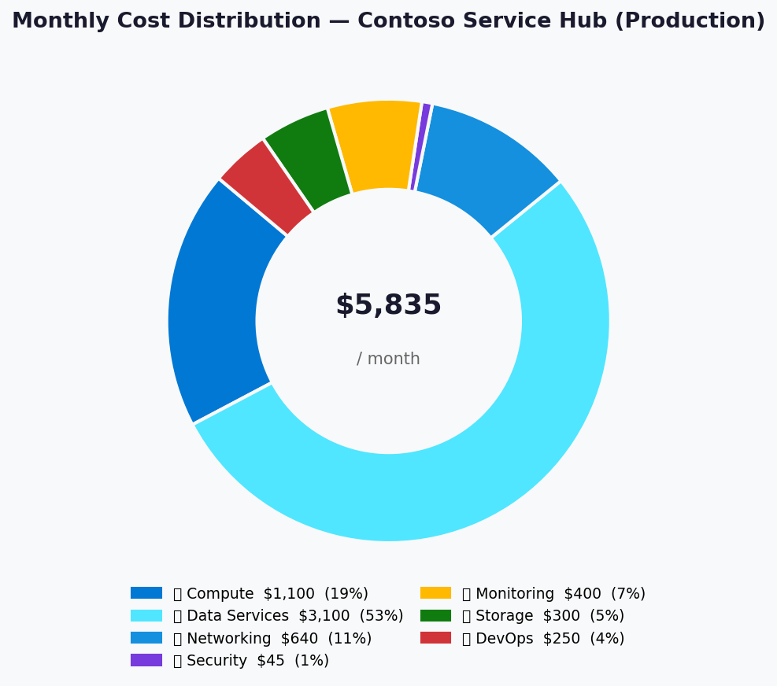
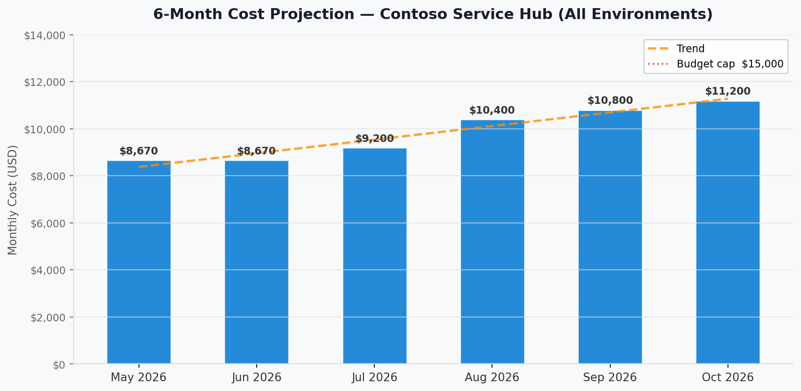

# 💰 Azure Cost Estimate: Contoso Service Hub


<details open>
<summary><strong>📑 Cost Estimate Contents</strong></summary>

- [💵 Cost At-a-Glance](#-cost-at-a-glance)
- [✅ Decision Summary](#-decision-summary)
- [🔁 Requirements → Cost Mapping](#-requirements--cost-mapping)
- [📊 Top 5 Cost Drivers](#-top-5-cost-drivers)
- [🏛️ Architecture Overview](#-architecture-overview)
- [🧾 What We Are Not Paying For (Yet)](#-what-we-are-not-paying-for-yet)
- [⚠️ Cost Risk Indicators](#-cost-risk-indicators)
- [🎯 Quick Decision Matrix](#-quick-decision-matrix)
- [💰 Savings Opportunities](#-savings-opportunities)
- [🧾 Detailed Cost Breakdown](#-detailed-cost-breakdown)
- [References](#references)

</details>

> Generated by architect agent | 2026-04-02

| ⬅️ Previous                                                    | 📑 Index            | Next ➡️                                                      |
| -------------------------------------------------------------- | ------------------- | ------------------------------------------------------------ |
| [02-architecture-assessment.md](02-architecture-assessment.md) | [README](README.md) | [04-governance-constraints.md](04-governance-constraints.md) |

**Generated**: 2026-04-02
**Region**: swedencentral
**Environments**: Development, Staging, Production
**Pricing Source**: Azure retail benchmark data aligned to the corrected regional-ingress SKU set
**Architecture Reference**: [02-architecture-assessment.md](02-architecture-assessment.md)

---

## 💵 Cost At-a-Glance

> **Monthly Total: ~$9,488** | Annual: ~$113,856
>
> ```text
> Commercial envelope: EUR 11,000-14,000/month | Technical Azure benchmark: USD 9,488/month
> FX normalization: intentionally not applied in Step 2
> ```
>
> | Status            | Indicator |
> | ----------------- | --------- |
> | Cost Trend        | ➡️ Stable baseline with explicit non-prod right-sizing |
> | Savings Available | 💰 ~$4,380/year from 1-year RI on AKS and PostgreSQL |
> | Compliance        | ✅ App Gateway baseline and EU tenant sequencing retained |

## ✅ Decision Summary

- ✅ **Approved baseline**: Application Gateway WAF v2 replaces Front Door for compliant ingress.
- ✅ **Approved baseline**: One coherent all-environment benchmark of **USD 9,488/month** is used
  across Step 2.
- ✅ **Approved baseline**: Commercial pricing remains a separate **EUR 11,000-14,000/month**
  customer-facing envelope.
- ✅ **Approved baseline**: EU Data Boundary tenant sequencing is mandatory before subscriptions.
- ✅ **Approved baseline**: Customer MFA in external tenants defaults to email OTP; SMS remains an
  optional paid add-on and is not part of the compliant default.
- ⏳ **Deferred**: Front Door exception path, multi-region DR, DDoS Protection Standard, and APIM
  Premium escalation.

**Confidence**: Medium | **Expected Variance**: ±15% because this is still a design-stage engineering
benchmark, not a finance-approved contract model.

## 🔁 Requirements → Cost Mapping

| Requirement | Architecture Decision | Cost Impact | Mandatory |
| ----------- | --------------------- | ----------: | --------- |
| EU-only compliant ingress | Application Gateway WAF v2 regional baseline | Included in benchmark | Yes |
| EU tenant sovereignty | New EU/EFTA tenant plus EU Data Boundary before subscriptions | Governance prerequisite, not a metered line item | Yes |
| Customer MFA | External-tenant email OTP default; SMS only by exception | Avoids SMS add-on by default | Yes |
| 99.9% service target | Zone-aware AKS, PostgreSQL HA, ZRS storage | Increases core service spend | Yes |
| Managed Kubernetes | AKS Standard | Included in benchmark | Yes |
| 128 GB production cache | Redis Enterprise E50 in prod | Major cost driver | Yes |
| 5M API requests/month | API Management Standard v2 | Included in benchmark | Yes |
| Observability | LAW, App Insights, Azure Monitor alerts | Included in benchmark | Yes |

## 📊 Top 5 Cost Drivers

| Rank | Resource | Monthly Cost (USD) | % of Total | Trend | Optimization |
| ---- | -------- | -----------------: | ---------: | ----- | ------------ |
| 1️⃣ | Redis Enterprise (all envs) | 3,276 | 35% | ➡️ | Validate prod capacity and non-prod sizing quarterly |
| 2️⃣ | AKS + worker nodes | 1,325 | 14% | 📈 | 1-year RI on steady-state node pools |
| 3️⃣ | App Gateway WAF v2 | 950 | 10% | ➡️ | Keep autoscale bounds tight by environment |
| 4️⃣ | PostgreSQL Flexible Server | 935 | 10% | 📈 | RI after workload stabilizes |
| 5️⃣ | API Management Standard v2 | 775 | 8% | ➡️ | Revisit only if Premium resilience is required |

> 💡 **Quick Win**: The cleanest low-risk saving is reserved capacity on AKS and PostgreSQL once MVP
> usage stabilizes.

<details>
<summary><strong>Cost Driver Details</strong></summary>

#### 1️⃣ Redis Enterprise

| Aspect | Detail |
| ------ | ------ |
| Current baseline | E50 in production, E10 in staging and development |
| Monthly cost | $3,276 across all environments |
| Optimization | Keep the non-prod right-sizing; validate whether production truly needs 128 GB |
| Potential savings | Significant if production cache demand is materially overestimated |

#### 2️⃣ AKS

| Aspect | Detail |
| ------ | ------ |
| Current baseline | Standard tier with zone-aware pools; 3× D8s_v5 in production |
| Monthly cost | $1,325 across all environments |
| Optimization | 1-year reserved capacity on steady-state nodes |
| Potential savings | ~$2,760/year on the production node pool alone |

</details>

## 🏛️ Architecture Overview

### Cost Distribution

| Category | Monthly Cost (USD) | Share |
| -------- | -----------------: | ----: |
| 💻 Compute | 1,955 | 21% |
| 💾 Data Services | 4,316 | 45% |
| 🌐 Edge and Networking | 2,345 | 25% |
| 📊 Monitoring | 770 | 8% |
| 🔐 Identity and Secrets | 102 | 1% |



### Month-over-Month Projection



> The corrected baseline assumes a stable MVP period with environment-specific right-sizing already
> applied. The main upward triggers are Redis growth, AKS autoscale pressure, and any future move to
> API Management Premium or multi-region DR.

### Key Design Decisions Affecting Cost

| Decision | Cost Impact | Business Rationale | Status |
| -------- | ----------- | ------------------ | ------ |
| Replace Front Door with App Gateway baseline | Neutral to slightly higher edge spend | Removes the EU Data Boundary exception from the default design | Required |
| Right-size non-prod Redis | Strong reduction vs mirrored prod sizing | Avoids wasting cache spend before production demand exists | Required |
| Keep single-region design | Avoids +$3,000-5,000/month DR uplift | RFQ scope does not fund active regional failover today | Accepted |
| Keep APIM on Standard v2 | Avoids Premium uplift | Current scale does not justify premium resilience cost | Accepted |

## 🧾 What We Are Not Paying For (Yet)

- **Azure Front Door exception path**: not included in the compliant baseline; would require a
  separate legal and business exception.
- **Multi-region DR**: deferred until Release 2.0 or until the business funds a region-loss posture.
- **API Management Premium / Premium v2**: deferred until zone redundancy at the API tier becomes a
  contractual need.
- **DDoS Protection Standard**: still excluded from the current baseline.
- **External-tenant SMS add-on**: not enabled by default because it is both a cost add-on and a
  sovereignty-sensitive control.

### Assumptions & Uncertainty

- The engineering model is expressed in **USD Azure retail benchmark data**.
- The customer-facing commercial budget is expressed in **EUR** and should be managed separately.
- Development and staging already use smaller Redis and compute footprints than production.
- No finance-approved FX rate is assumed in this artifact.

## ⚠️ Cost Risk Indicators

| Resource | Risk Level | Issue | Mitigation |
| -------- | ---------- | ----- | ---------- |
| Redis Enterprise | 🟡 Medium | Production 128 GB may still be oversized | Monitor utilization and revalidate quarterly |
| App Gateway WAF v2 | 🟡 Medium | Capacity units can rise with unexpected traffic spikes | Set autoscale floors and ceilings by environment |
| API Management | 🟡 Medium | Premium escalation becomes expensive if zonal API resilience is required | Treat Premium only as a reliability-trigger redesign |
| FX separation | 🟡 Medium | EUR commercial tracking and USD engineering benchmark can be conflated | Keep both values visible and never imply a hidden conversion |
| Multi-region DR | 🔴 High | Region-loss resilience is not funded in this baseline | Reassess before contractual DR commitments are made |

> **⚠️ Watch Item**: The biggest Step 2 governance risk is not raw spend, but accidental mixing of
> EUR commercial pricing and USD Azure benchmark data in the same approval discussion.

## 🎯 Quick Decision Matrix

_If you need X, expect to pay Y more or reopen a design trade-off._

| Requirement | Additional Cost | SKU Change | Verdict | Notes |
| ----------- | --------------- | ---------- | ------- | ----- |
| Multi-region DR | +$3,000-5,000/month | Add secondary region and replication | 🟡 Monitor | Required only if region-loss commitments become explicit |
| API tier zone redundancy | +~$2,500/month | Standard v2 to Premium-class tier | 🟡 Monitor | Needed only if API tier becomes contractual SPOF risk |
| Front Door exception path | +~$400/month plus governance overhead | Add global edge service | 🔴 Investigate | Not part of compliant default |
| External-tenant SMS MFA | Variable add-on | Enable SMS second factor | 🔴 Investigate | Adds both cost and sovereignty risk |
| DDoS Protection Standard | +$2,944/month | Enable DDoS plan | 🟡 Monitor | Defer unless threat profile changes |

## 💰 Savings Opportunities

> ### Total Practical Near-Term Savings: ~$4,380/year without reopening architecture
>
> | Strategy | Commitment | Monthly Savings | Annual Savings | % Reduction |
> | -------- | ---------- | ---------------: | -------------: | ----------: |
> | AKS reserved capacity | 1-year | 230 | 2,760 | 2.4% |
> | PostgreSQL reserved capacity | 1-year | 135 | 1,620 | 1.4% |
> | Log sampling and caps | N/A | 100 | 1,200 | 1.1% |
> | Dev/staging schedules | N/A | Variable | Variable | Context dependent |

## 🧾 Detailed Cost Breakdown

### Assumptions

- Currency model: USD Azure retail benchmark for engineering; EUR commercial envelope tracked
  separately.
- Non-production environments are deliberately smaller than production.
- Application Gateway WAF v2 is included in every environment because it is part of the compliant
  baseline architecture.

### Production Environment

| Category | Service | SKU / Meter | Est. Monthly (USD) |
| -------- | ------- | ----------- | -----------------: |
| 💻 Compute | AKS | Standard, 3× D8s_v5 | 770 |
| 💾 Data Services | PostgreSQL Flexible Server | GP D4ds_v5, 256 GB, HA | 450 |
| 💾 Data Services | Redis Enterprise | E50 | 2,520 |
| 🌐 Edge and Networking | Application Gateway WAF v2 | Standard_v2, 3-zone prod | 400 |
| 🌐 Edge and Networking | API Management | Standard v2 | 350 |
| 💻 Compute | Management VM | D8s_v5 | 330 |
| 🌐 Edge and Networking | Networking stack | VNet, Bastion, DNS | 280 |
| 📊 Monitoring | LAW + App Insights + alerts | Pay-as-you-go | 400 |
| 🔐 Identity and Secrets | Entra External ID | External tenant baseline | 30 |
| 💾 Data Services | Storage + Key Vault | ZRS + Standard | 65 |
| | **Production Total** | | **5,595** |

### Staging Environment

| Category | Service | SKU / Meter | Est. Monthly (USD) |
| -------- | ------- | ----------- | -----------------: |
| Combined | Full staging stack | Reduced AKS, Redis E10, smaller DB, App Gateway, APIM, monitoring, shared network | 2,491 |

### Development Environment

| Category | Service | SKU / Meter | Est. Monthly (USD) |
| -------- | ------- | ----------- | -----------------: |
| Combined | Full dev stack | Minimal AKS, Redis E10, smaller DB, App Gateway, reduced monitoring | 1,402 |

### Multi-Environment Summary

| Environment | Monthly Cost (USD) | Annual Cost (USD) | Notes |
| ----------- | -----------------: | ----------------: | ----- |
| Development | 1,402 | 16,824 | Minimum viable engineering environment |
| Staging | 2,491 | 29,892 | Pre-production scale and validation |
| Production | 5,595 | 67,140 | Full compliant baseline |
| **Total** | **9,488** | **113,856** | Single Step 2 benchmark baseline |

### Notes

- This corrected Step 2 deliberately removes the superseded Front Door-based cost baseline.
- The all-environment benchmark is consistent with the later implementation-planning SKU model.
- The engineering model is **USD benchmark data only**. The commercial proposal should continue to be
  governed in EUR.

---

## References

| Topic | Link |
| ----- | ---- |
| Azure Cost Management | [Overview](https://learn.microsoft.com/azure/cost-management-billing/costs/overview-cost-management) |
| Reserved Instances | [Reservations](https://learn.microsoft.com/azure/cost-management-billing/reservations/save-compute-costs-reservations) |
| API Management reliability | [Reliability guide](https://learn.microsoft.com/azure/reliability/reliability-api-management) |
| EU Data Boundary configuration | [Configure data boundary](https://learn.microsoft.com/azure/azure-resource-manager/management/manage-data-boundary) |
| EU Data Boundary excluded services | [Excluded services](https://learn.microsoft.com/privacy/eudb/eu-data-boundary-excluded-services#azure-services) |
| External tenant MFA | [External tenant MFA](https://learn.microsoft.com/entra/external-id/customers/concept-multifactor-authentication-customers) |

---

<div align="center">

| ⬅️ [02-architecture-assessment.md](02-architecture-assessment.md) | 🏠 [Project Index](README.md) | ➡️ [04-governance-constraints.md](04-governance-constraints.md) |
| ----------------------------------------------------------------- | ----------------------------- | --------------------------------------------------------------- |

</div>

