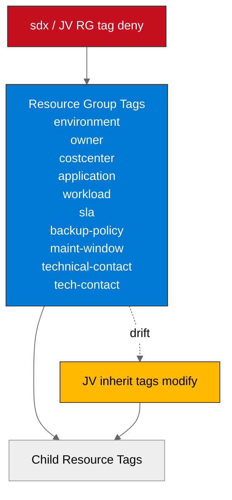

# 🛡️ Governance Constraints - Contoso Service Hub


<details open>
<summary><strong>📑 Governance Contents</strong></summary>

- [🔍 Discovery Source](#-discovery-source)
- [📋 Azure Policy Compliance](#-azure-policy-compliance)
- [🔄 Plan Adaptations Based on Policies](#-plan-adaptations-based-on-policies)
- [🚫 Deployment Blockers](#-deployment-blockers)
- [🏷️ Required Tags](#-required-tags)
- [🔐 Security Policies](#-security-policies)
- [💰 Cost Policies](#-cost-policies)
- [🌐 Network Policies](#-network-policies)
- [References](#references)

</details>

> Generated by 04g-Governance agent | 2026-04-02

| ⬅️ Previous                                        | 📑 Index            | Next ➡️                                                |
| -------------------------------------------------- | ------------------- | ------------------------------------------------------ |
| [03-des-cost-estimate.md](03-des-cost-estimate.md) | [README](README.md) | [04-implementation-plan.md](04-implementation-plan.md) |

This document captures the live Azure Policy constraints discovered for the
`sandbox` subscription using ARM REST API calls on 2026-04-02. It replaces the
template-only governance baseline that was generated during the automated E2E
run.

## 🔍 Discovery Source

> [!IMPORTANT]
> Governance constraints in this artifact were discovered from the live Azure
> environment via ARM REST API, including management-group inherited
> assignments.

| Query | Result | Timestamp |
| ----- | ------ | --------- |
| REST API Total | 37 effective policy assignments | 2026-04-02T10:29:38Z |
| Subscription-scope | 7 direct subscription assignments | 2026-04-02T10:29:38Z |
| MG-inherited | 30 management-group assignments | 2026-04-02T10:29:38Z |
| Highlighted Deny | 6 relevant deny policies reviewed; 1 immediate blocker for the current plan | 2026-04-02T10:29:38Z |
| Highlighted Audit | 3 relevant audit policies reviewed | 2026-04-02T10:29:38Z |
| Highlighted Modify / DINE | 6 relevant auto-remediation policies reviewed | 2026-04-02T10:29:38Z |
| Tag Policies | 3 live tag assignments discovered | 2026-04-02T10:29:38Z |
| Security / Ops | Defender, monitoring, storage hardening, and sandbox guardrails discovered | 2026-04-02T10:29:38Z |

**Discovery Method**: ARM REST API via `az rest` against
`/subscriptions/c103c983-d48f-4c1e-b12d-c7be294bb8ff/providers/Microsoft.Authorization/policyAssignments`
plus targeted `policyDefinitions` and `policySetDefinitions` lookups.

**Subscription**: sandbox (`c103c983-d48f-4c1e-b12d-c7be294bb8ff`)

**Tenant**: `2d04cb4c-999b-4e60-a3a7-e8993edc768b`

**Scope**: Full subscription discovery, including inherited management-group
assignments.

**Portal Validation**: Not performed in this session. REST API discovery
completed successfully.

### Policy Definition Analysis

> [!IMPORTANT]
> The live blocker list below is based on policy-rule inspection, not policy
> display names alone. Several policies with strong names do not block the
> current Contoso design.

| Policy Display Name | Assignment Scope | Effect | Actually Blocks | Evidence from policyRule.if | Bicep Property Path | Required Value |
| ------------------- | ---------------- | ------ | --------------- | --------------------------- | ------------------- | -------------- |
| Allowed locations | Management Group `alz` | Audit | Resources deployed outside `swedencentral`, `germanywestcentral`, `westeurope`, or `global` | `field: location`, `notIn: [allowed locations]`, `notEquals: global` | N/A | N/A |
| sdx - Enforce Resource Group Tags | Subscription | Deny | Resource groups missing one of 9 mandatory tags | `field: type = Microsoft.Resources/subscriptions/resourceGroups` and `anyOf` missing tag checks | N/A | N/A |
| JV-Enforce Resource Group Tags | Management Group tenant root | Deny | Same 9-tag resource-group requirement as the subscription-scope policy | Same 9 explicit `tags[...]` checks | N/A | N/A |
| JV - Inherit Multiple Tags from Resource Group | Management Group tenant root | Modify | Child resources missing inherited tags from their resource group | `anyOf` missing tag checks followed by `addOrReplace` tag operations | N/A | N/A |
| Block Azure RM Resource Creation | Management Group tenant root | Deny | Classic resource types only, and only when the resource-group `ringValue` tag matches the default list (`r0`) | `anyOf` limited to `Microsoft.Classic*` types plus `resourceGroup().tags['ringValue'] in ['r0']` | N/A | N/A |
| Deny the deployment of classic resources | Management Group `alz` | Deny | Classic resource providers only | `field: type in listOfResourceTypesNotAllowed` populated with `Microsoft.Classic*` resource types | N/A | N/A |
| JV - Deny ML Clusters | Management Group `alz` | Deny | Azure ML compute clusters and virtual clusters only | `listOfResourceTypesNotAllowed = Microsoft.MachineLearningServices/workspaces/computes, Microsoft.MachineLearningServices/virtualclusters` | N/A | N/A |
| Deny AKS deployment with agent pool count greater than 10 | Management Group tenant root | Deny | AKS clusters with more than 10 agent pools | `field: type = Microsoft.ContainerService/managedClusters` and `count(agentPoolProfiles[*]) > 10` | `managedClusters::properties.agentPoolProfiles` | `<= 10 pools` |
| Block VM SKU Sizes | Management Group tenant root | Deny | VM and VMSS deployments using blocked H, M, or N family SKUs | `field: Microsoft.Compute/virtualMachines/sku.name in [BlockedSKUs]` or VMSS equivalent | `virtualMachines::sku.name` | `not in blocked H/M/N SKU sets` |
| Audit VMs that do not use managed disks | Management Group `alz` | Audit | VMs or VMSS instances backed by unmanaged disks | `field: Microsoft.Compute/virtualMachines/osDisk.uri exists = True` or VMSS VHD container/image URL checks | `virtualMachines::storageProfile.osDisk.uri` | `managed disks only` |
| Audit resource location matches resource group location | Management Group `alz` | Audit | Resources whose location differs from the resource-group location | `field: location`, `notEquals: [resourceGroup().location]` | N/A | N/A |
| Configure Azure Activity logs to stream to specified Log Analytics workspace | Management Group `alz` | DeployIfNotExists | Missing subscription activity-log diagnostic settings | `field: type = Microsoft.Resources/subscriptions`; DINE template deploys `Microsoft.Insights/diagnosticSettings` | N/A | N/A |
| Enable allLogs category group resource logging for supported resources to Log Analytics | Management Group `alz` | DeployIfNotExists | Missing diagnostics for supported resource types; default list includes APIM, App Gateway, Key Vault, and PostgreSQL Flexible Server | Initiative default `effect = DeployIfNotExists`; default supported resource-type list contains those services | N/A | N/A |
| Ensure secure access to storage account containers | Management Group tenant root | Modify | Storage accounts with `allowBlobPublicAccess` unset or `true`, unless tagged with `SecurityControl` | `field: Microsoft.Storage/storageAccounts/allowBlobPublicAccess exists = false or equals true` | `storageAccounts::allowBlobPublicAccess` | `false` |
| SFI-ID4.2.1 Storage Accounts - Safe Secrets Standard | Management Group tenant root | Modify | Storage accounts with shared-key auth enabled, unless an exemption tag is present | `field: Microsoft.Storage/storageAccounts/allowSharedKeyAccess notEquals false` | `storageAccounts::allowSharedKeyAccess` | `false` |
| Add system-assigned managed identity to enable Guest Configuration assignments on virtual machines with no identities | Management Group tenant root | Modify | Microsoft Windows Desktop VMs without an identity | `field: type = Microsoft.Compute/virtualMachines`, Windows Desktop publisher, and `identity.type` missing | `virtualMachines::identity.type` | `SystemAssigned` |
| Enforce ALZ Sandbox Guardrails | Management Group `alz-sandboxes` | Deny | ExpressRoute, Virtual WAN, VPN gateway, and similar sandbox-forbidden network resources; also cross-subscription vNet peering | Assignment parameter `listOfResourceTypesNotAllowed` contains gateway / Virtual WAN types; initiative also contains `Deny-VNET-Peer-Cross-Sub` | `virtualNetworkPeerings::properties.remoteVirtualNetwork.id` | `remote virtual network must stay in current subscription` |

**Analysis Notes**:

- The live location policy is **audit**, not deny, and its allowed list includes
  `global`. Azure Policy therefore does not block Azure Front Door or other
  global resources in this subscription.
- The live tag baseline is stricter than the placeholder: it requires nine
  governance tags on resource groups.
- There is a live tag-key drift between policies: the resource-group deny
  policies require `technical-contact`, while the child-resource modify policy
  inherits `tech-contact`.
- No direct deny policy was evidenced in the targeted live queries for Key
  Vault public network access, PostgreSQL Flexible Server public access, Redis
  Enterprise public access, or mandatory private endpoints. The placeholder
  baseline had overstated those as hard blockers.
- The policy named `Deny virtual machines and virtual machine scale sets that
  do not use managed disk` resolves to an **audit** definition, not a deny.
- The policy named `Block Azure RM Resource Creation` only blocks classic
  resource providers and is not a blocker for the modern Contoso service set.

## 📋 Azure Policy Compliance

| Category | Constraint | Implementation | Status |
| -------- | ---------- | -------------- | ------ |
| Tagging | Resource groups must include 9 mandatory governance tags | Replace the 4-tag placeholder baseline before provisioning resource groups | ❌ |
| Tagging | Child resources inherit tags via modify policy | Populate both `technical-contact` and `tech-contact` on the RG until policy owners reconcile the drift | ⚠️ |
| Location | Allowed locations are audited to `swedencentral`, `germanywestcentral`, `westeurope`, and `global` | Current `swedencentral` baseline is compliant; global services are audited but not denied | ✅ |
| AKS | AKS clusters are denied only when agent pool count exceeds 10 | Current design stays compliant if it keeps 10 or fewer agent pools | ✅ |
| Virtual Machines | VM / VMSS H, M, and N blocked SKU sets are denied | Planned management VM size `D8s_v5` is allowed by the live deny list | ✅ |
| Storage | Blob anonymous access and shared-key auth are auto-remediated off | Set both properties explicitly in IaC to avoid post-deployment modification drift | ⚠️ |
| Monitoring | Subscription activity logs must stream to the central ALZ workspace | Auto-remediation exists, but the design should assume the central workspace dependency | ⚠️ |
| Diagnostics | APIM, App Gateway, Key Vault, and PostgreSQL receive allLogs diagnostics by policy | Plan for central diagnostics on those services; AKS, Storage, and Redis are not covered by this specific initiative default list | ⚠️ |
| Sandbox Network Guardrails | ExpressRoute, Virtual WAN, VPN gateways, and cross-subscription vNet peering are denied in sandboxes | Current Contoso design stays compliant if it remains in a same-subscription hub-spoke pattern | ✅ |

> [!NOTE]
> The current Step 4 and Step 5 artifacts have been updated to align with the live
> 9-tag discovery result, including the temporary `technical-contact` / `tech-contact`
> key drift handling.

## 🔄 Plan Adaptations Based on Policies

> [!NOTE]
> This section documents how the implementation plan should adapt to the live
> policy state that was discovered on 2026-04-02.

### Architectural Changes

| Original Design | Blocking Policy | Effect | Adaptation Applied |
| --------------- | --------------- | ------ | ------------------ |
| 4-tag baseline (`Environment`, `ManagedBy`, `Project`, `Owner`) | sdx - Enforce Resource Group Tags / JV-Enforce Resource Group Tags | Deny | Expand the resource-group tag baseline to the live 9-tag set before resource-group creation |
| Single contact tag assumption | JV - Inherit Multiple Tags from Resource Group | Modify | Add both `technical-contact` and `tech-contact` at the resource-group layer until policy definitions are reconciled |
| Optional storage hardening in later phases | StorageAccount_BlobAnonymousAccess_Modify and StorageAccount_DisableLocalAuth_Modify | Modify | Set `allowBlobPublicAccess = false` and `allowSharedKeyAccess = false` explicitly in IaC |
| Architecture treated global services as policy-blocked | Allowed locations | Audit | Treat the Front Door versus Application Gateway choice as an architecture / compliance decision, not an Azure Policy deny |
| AKS scale-out unconstrained | AKS_LimitNodeCount_Deny | Deny | Keep the AKS cluster at 10 or fewer agent pools |

### Auto-Applied Resources

| Policy | Effect | Auto-Applied Resource |
| ------ | ------ | --------------------- |
| Configure Azure Activity logs to stream to specified Log Analytics workspace | DeployIfNotExists | Subscription diagnostic settings pointing to `/subscriptions/4d4d9df0-45be-4400-b5e0-cc16ca2ce541/resourceGroups/alz-mgmt/providers/Microsoft.OperationalInsights/workspaces/alz-law` |
| Enable allLogs category group resource logging for supported resources to Log Analytics | DeployIfNotExists | Diagnostic settings for supported resources such as APIM, App Gateway, Key Vault, and PostgreSQL Flexible Server |
| Configure Advanced Threat Protection to be enabled on open-source relational databases | Defender initiative | Defender / advanced threat protection configuration on supported open-source relational database resources |

### Auto-Modified Configurations

| Policy | Effect | Auto-Applied Change |
| ------ | ------ | ------------------- |
| JV - Inherit Multiple Tags from Resource Group | Modify | Missing child-resource tags are copied from the resource group using the 9 configured tag names |
| Ensure secure access to storage account containers | Modify | `allowBlobPublicAccess` is set to `false` |
| SFI-ID4.2.1 Storage Accounts - Safe Secrets Standard | Modify | `allowSharedKeyAccess` is set to `false` unless an exemption tag is present |
| Add system-assigned managed identity to enable Guest Configuration assignments on virtual machines with no identities | Modify | `identity.type` is set to `SystemAssigned` for matching Windows Desktop VMs |

## 🚫 Deployment Blockers

> [!CAUTION]
> The live deny inventory is materially narrower than the placeholder baseline.
> For the current Contoso design, the only immediate blocker discovered in this
> session is tag compliance at resource-group creation.

### Mandatory Resource Group Tag Baseline

- **Policy ID**: `84a03f02-279f-49ad-973d-62ef55442a2a` and `27833bcf-5909-4a37-891c-16a3cb06856d`
- **Effect**: Deny
- **Scope**: Subscription + management-group inherited
- **Enforcement Mode**: Default
- **Impact**: Resource-group creation is denied unless the live 9-tag governance
  set is present. The existing E2E plan and Bicep output still assume the old
  4-tag baseline.
- **Assessment Date**: 2026-04-02

**Resolution Options**:

1. **Update IaC to the live baseline**:
   - Add the live 9 required tags to resource groups.
   - Add both contact tag variants (`technical-contact` and `tech-contact`) at
     the resource-group layer until policy owners reconcile the mismatch.
   - **Risk Level**: Low.

2. **Request policy exemption**:
   - Appropriate only for a temporary migration window.
   - **Risk Level**: High.
   - **Approval Process**: Governance / platform-owner approval.

**Status**: ⚠️ **DEPLOYMENT CANNOT PROCEED WITHOUT RESOLUTION**

**Other Deny Policies Reviewed**:

- AKS agent pools are denied only when the cluster exceeds 10 pools.
- VM SKU deny targets blocked H, M, and N families; the planned `D8s_v5` VM is
  not blocked.
- Classic-resource denies do not affect the modern Contoso service set.
- Sandbox deny policies block ExpressRoute, Virtual WAN, VPN gateways, and
  cross-subscription vNet peering, none of which are in the current design.

## 🏷️ Required Tags

The live tag baseline differs from the placeholder baseline. Resource groups are
denied unless they contain the following nine tags:

- `environment`
- `owner`
- `costcenter`
- `application`
- `workload`
- `sla`
- `backup-policy`
- `maint-window`
- `technical-contact`

The child-resource modify policy is configured with the same first eight tags,
but uses `tech-contact` instead of `technical-contact`. Until the policy owners
reconcile that drift, the safest deployment baseline is to set **both** contact
tags on resource groups.

```bicep
tags: {
  environment: environment
  owner: owner
  costcenter: costCenter
  application: applicationName
  workload: workloadName
  sla: serviceLevel
  'backup-policy': backupPolicy
  'maint-window': maintenanceWindow
  'technical-contact': technicalContact
  'tech-contact': technicalContact
}
```



## 🔐 Security Policies

| Policy | Requirement |
| ------ | ----------- |
| Azure Security Baseline / Microsoft Cloud Security Benchmark | Broad benchmark initiatives are assigned at management-group scope; expect additional audit coverage even when direct deny rules are absent |
| Configure Advanced Threat Protection to be enabled on open-source relational databases | PostgreSQL should assume Defender / ATP integration requirements |
| Ensure secure access to storage account containers | Storage accounts should explicitly disable blob anonymous access |
| SFI-ID4.2.1 Storage Accounts - Safe Secrets Standard | Storage accounts should explicitly disable shared-key authentication unless an exemption tag is approved |
| Add system-assigned managed identity to enable Guest Configuration assignments on virtual machines with no identities | Windows Desktop VMs without identities will be auto-modified to `SystemAssigned` |

## 💰 Cost Policies

| Policy | Constraint |
| ------ | ---------- |
| Unused resources driving cost should be avoided | Audit initiative assigned at ALZ scope; expect cost / idle-resource review pressure rather than deployment denial |
| Block VM SKU Sizes | Deny applies only to blocked H, M, and N family SKUs; current `D8s_v5` VM choice remains allowed |
| Resources should be Zone Resilient | Audit initiative assigned at ALZ scope; zone-resilient SKUs remain a governance expectation |

## 🌐 Network Policies

| Policy | Constraint |
| ------ | ---------- |
| Allowed locations | Audit only; allowed values are `swedencentral`, `germanywestcentral`, `westeurope`, and `global` |
| Audit resource location matches resource group location | Resource locations should stay aligned with the RG location unless the resource is global |
| Enforce ALZ Sandbox Guardrails | Denies ExpressRoute, Virtual WAN, VPN gateway, and similar network-edge resources in the sandbox landing zone |
| Deny vNet peering cross subscription | Cross-subscription vNet peering is denied in the sandbox initiative; same-subscription hub-spoke remains compliant |

---

## References

| Topic | Link |
| ----- | ---- |
| Azure Policy overview | [Overview](https://learn.microsoft.com/azure/governance/policy/overview) |
| Azure Policy assignments REST API | [Assignments - List for Subscription](https://learn.microsoft.com/rest/api/policy/policy-assignments/list-for-subscription) |
| Azure Policy definitions REST API | [Policy Definitions - Get](https://learn.microsoft.com/rest/api/policy/policy-definitions/get) |
| Azure Monitor diagnostic settings policy guidance | [Diagnostic Settings](https://learn.microsoft.com/azure/azure-monitor/platform/diagnostic-settings-policy) |

---

_Governance constraints discovered from live ARM REST API queries on 2026-04-02._
_This artifact replaces the earlier template-only governance baseline for this E2E project._

---

<div align="center">

| ⬅️ [03-des-cost-estimate.md](03-des-cost-estimate.md) | 🏠 [Project Index](README.md) | ➡️ [04-implementation-plan.md](04-implementation-plan.md) |
| ----------------------------------------------------- | ----------------------------- | --------------------------------------------------------- |

</div>
