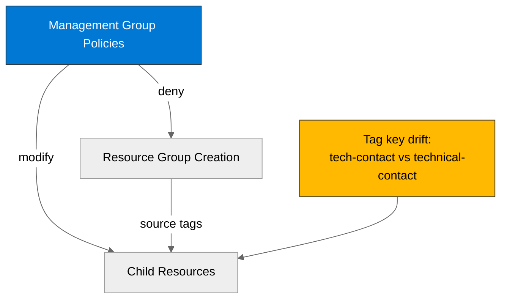

# 🛡️ Governance Constraints - Contoso Service Hub


<details open>
<summary><strong>📑 Governance Contents</strong></summary>

- [🔍 Discovery Source](#-discovery-source)
- [📋 Azure Policy Compliance](#-azure-policy-compliance)
- [🔄 Plan Adaptations Based on Policies](#-plan-adaptations-based-on-policies)
- [🚫 Deployment Blockers](#-deployment-blockers)
- [🏷️ Required Tags](#-required-tags)
- [🔐 Security Policies](#-security-policies)
- [💰 Cost Policies](#-cost-policies)
- [🌐 Network Policies](#-network-policies)
- [References](#references)

</details>

> Generated by 04g-Governance agent | 2026-03-17

| ⬅️ Previous                                        | 📑 Index            | Next ➡️                                                |
| -------------------------------------------------- | ------------------- | ------------------------------------------------------ |
| [03-des-cost-estimate.md](03-des-cost-estimate.md) | [README](README.md) | [04-implementation-plan.md](04-implementation-plan.md) |

This document captures the governance constraints and Azure Policy requirements
that must be addressed in the implementation plan and Bicep code.

## 🔍 Discovery Source

> [!IMPORTANT]
> Governance constraints in this artifact were discovered from live Azure Policy
> assignments and policy definitions via ARM REST API, including management
> group inherited assignments.

| Query              | Results                                          | Timestamp            |
| ------------------ | ------------------------------------------------ | -------------------- |
| Policy Assignments | 21 effective assignments discovered              | 2026-03-17T09:21:25Z |
| Tag Policies       | 2 direct tag policies discovered                 | 2026-03-17T09:21:25Z |
| Security Policies  | 8 architecture-relevant controls inspected       | 2026-03-17T09:21:25Z |
| Deny Policies      | 5 relevant deny controls reviewed                | 2026-03-17T09:21:25Z |
| Modify Policies    | 4 relevant modify controls reviewed              | 2026-03-17T09:21:25Z |
| Audit Policies     | 4 relevant audit or audit-if-not-exists reviewed | 2026-03-17T09:21:25Z |

**Discovery Method**: ARM REST API via `az rest`
**Subscription**: `noalz` (`00858ffc-dded-4f0f-8bbf-e17fff0d47d9`)
**Tenant**: `2d04cb4c-999b-4e60-a3a7-e8993edc768b`
**Scope**: Full subscription effective assignments (`12` subscription-or-below, `9` management group inherited)

> [!NOTE]
> Resource-group assignments scoped to `rg-arcbox-swc01` were excluded from plan adaptation because they do not apply to the Contoso Service Hub target resource groups.

> [!WARNING]
> No standalone `Allowed locations` deny assignment was surfaced in the custom tenant assignments inspected. Region residency is therefore enforced by the approved architecture choice (`swedencentral`) and by the subscription-level GDPR initiative, not by an explicit deny policy that the plan can rely on.

### Policy Definition Analysis

> [!IMPORTANT]
> Deny and modify policies below were verified against their live `policyRule`
> JSON so the artifact reflects actual enforcement behavior rather than display
> name assumptions.

| Policy Display Name                                                                                                   | Assignment Scope | Effect | Actually Blocks or Modifies                                                                            | Evidence from `policyRule.if`                                                                                      | Bicep Property Path                                  | Required Value                                                                                                               |
| --------------------------------------------------------------------------------------------------------------------- | ---------------- | ------ | ------------------------------------------------------------------------------------------------------ | ------------------------------------------------------------------------------------------------------------------ | ---------------------------------------------------- | ---------------------------------------------------------------------------------------------------------------------------- |
| JV-Enforce Resource Group Tags                                                                                        | Management Group | Deny   | Resource group creation without all 9 mandatory tags                                                   | `field: "type" == "Microsoft.Resources/subscriptions/resourceGroups"` plus `anyOf` on missing tag fields           | `resourceGroups::tags`                               | `environment`, `owner`, `costcenter`, `application`, `workload`, `sla`, `backup-policy`, `maint-window`, `technical-contact` |
| Block Azure RM Resource Creation                                                                                      | Management Group | Deny   | Classic resource providers only                                                                        | `anyOf` contains only `Microsoft.Classic*` resource types                                                          | N/A                                                  | N/A                                                                                                                          |
| Not allowed resource types                                                                                            | Management Group | Deny   | Classic resource providers only for this tenant assignment                                             | `field: "type" in listOfResourceTypesNotAllowed` and the initiative parameter list contains only classic providers | N/A                                                  | N/A                                                                                                                          |
| Block VM SKU Sizes                                                                                                    | Management Group | Deny   | H, M, and N family VM and VMSS SKUs; D-series is allowed                                               | `Microsoft.Compute/virtualMachines/sku.name in [parameters('BlockedSKUs')]`                                        | `virtualMachines::properties.hardwareProfile.vmSize` | Any VM size outside the blocked H, M, and N family lists                                                                     |
| Deny AKS deployment with agent pool count greater than 10                                                             | Management Group | Deny   | AKS clusters with more than 10 agent pools                                                             | `count field: Microsoft.ContainerService/managedClusters/agentPoolProfiles[*] greater 10`                          | `managedClusters::properties.agentPoolProfiles`      | `<= 10` pools                                                                                                                |
| Ensure secure access to storage account containers                                                                    | Management Group | Modify | Blob public access is auto-disabled on `StorageV2` accounts unless `SecurityControl=Ignore` is present | `field: Microsoft.Storage/storageAccounts/allowBlobPublicAccess` missing or `true`                                 | `storageAccounts::properties.allowBlobPublicAccess`  | `false`                                                                                                                      |
| SFI-ID4.2.1 Storage Accounts - Safe Secrets Standard                                                                  | Management Group | Modify | Shared-key auth is auto-disabled unless `SecurityControl=Ignore` is present                            | `field: Microsoft.Storage/storageAccounts/allowSharedKeyAccess notEquals false`                                    | `storageAccounts::properties.allowSharedKeyAccess`   | `false`                                                                                                                      |
| Add system-assigned managed identity to enable Guest Configuration assignments on virtual machines with no identities | Management Group | Modify | Windows desktop VMs without an identity are auto-modified to `SystemAssigned`                          | `field: identity.type` missing or `None` on matching Windows images                                                | `virtualMachines::identity.type`                     | `SystemAssigned`                                                                                                             |

**Analysis Notes**:

- `Block Azure RM Resource Creation` appears broad by name, but the live rule only targets classic providers. It is not a blocker for AKS, PostgreSQL, Storage, Key Vault, networking, or Azure Monitor.
- `Not allowed resource types` is active through the custom deny initiative, but the configured parameter list is also limited to classic providers.
- The VM SKU deny policy blocks H, M, and N families. The proposed `D8s v5` VM remains compliant.
- There is a tag-key drift between the two custom tag policies: the deny policy requires `technical-contact` on the resource group, while the tag inheritance policy is configured to inherit `tech-contact` to child resources. The plan must treat this as tenant-policy drift and avoid assuming automatic inheritance of `technical-contact`.

## 📋 Azure Policy Compliance

| Category       | Constraint                                                                                                                                              | Implementation                                                                                                   | Status |
| -------------- | ------------------------------------------------------------------------------------------------------------------------------------------------------- | ---------------------------------------------------------------------------------------------------------------- | ------ |
| Naming         | Classic resource providers are denied by two tenant controls                                                                                            | Use only ARM-based resource providers in Bicep                                                                   | ✅     |
| Tagging        | Resource groups must carry 9 exact lowercase tags; child resources inherit a parallel 9-tag set from the resource group                                 | Add all 9 required tags to the resource group in Step 4 and propagate them to modules                            | ❌     |
| Security       | Storage public access and shared-key auth are modified to secure values; PostgreSQL TLS and SSL are audited; Redis plaintext protocol is audited        | Set secure values explicitly in IaC so deployment and post-deploy compliance both pass cleanly                   | ⚠️     |
| Data Residency | Subscription has a live GDPR initiative assignment, but no explicit tenant-level `Allowed locations` deny was surfaced in the inspected custom controls | Keep every regional resource in `swedencentral`; treat any future region expansion as a governance re-check item | ⚠️     |

> [!WARNING]
> The only hard blocker identified for the current design is missing resource-group tags. All other deny policies reviewed are either already satisfied by the proposed architecture or do not apply to the chosen Azure services.

## 🔄 Plan Adaptations Based on Policies

> [!NOTE]
> This section documents how the implementation plan must adapt to the discovered Azure Policies.

### Architectural Changes

| Original Design                                                               | Blocking Policy                                                                                                 | Effect | Adaptation Applied                                                                                       |
| ----------------------------------------------------------------------------- | --------------------------------------------------------------------------------------------------------------- | ------ | -------------------------------------------------------------------------------------------------------- |
| Default 4-tag Azure baseline (`Environment`, `ManagedBy`, `Project`, `Owner`) | `JV-Enforce Resource Group Tags`                                                                                | Deny   | Expand the resource-group tag set to the tenant-required 9 lowercase tags before any resource deployment |
| VM family not yet validated against tenant policy                             | `Block VM SKU Sizes`                                                                                            | Deny   | Keep the architecture on `D8s v5`; avoid H, M, and N family SKUs                                         |
| AKS scale target not yet checked against governance                           | `Deny AKS deployment with agent pool count greater than 10`                                                     | Deny   | Constrain the cluster design to 10 or fewer pools; the current design uses 2 pools and remains compliant |
| Storage account security posture derived from best practice only              | `Ensure secure access to storage account containers` and `SFI-ID4.2.1 Storage Accounts - Safe Secrets Standard` | Modify | Set `allowBlobPublicAccess = false` and `allowSharedKeyAccess = false` explicitly in Bicep               |

### Auto-Applied Resources

✅ No additional resources for the planned services were conclusively identified as `DeployIfNotExists` from the inspected policies. The tenant has deploy initiatives assigned, but the architecture-relevant controls confirmed during this discovery run were modify or audit based.

### Auto-Modified Configurations

| Policy                                                                                                                  | Effect | Auto-Applied Change                                                                                 |
| ----------------------------------------------------------------------------------------------------------------------- | ------ | --------------------------------------------------------------------------------------------------- |
| `JV - Inherit Multiple Tags from Resource Group`                                                                        | Modify | Adds or replaces 9 child-resource tag keys from the resource group tag values                       |
| `Ensure secure access to storage account containers`                                                                    | Modify | Sets `allowBlobPublicAccess` to `false` on storage accounts except `FileStorage`                    |
| `SFI-ID4.2.1 Storage Accounts - Safe Secrets Standard`                                                                  | Modify | Sets `allowSharedKeyAccess` to `false` unless the exclusion tag `SecurityControl=Ignore` is present |
| `Add system-assigned managed identity to enable Guest Configuration assignments on virtual machines with no identities` | Modify | Adds `identity.type = SystemAssigned` to matching Windows VMs                                       |

## 🚫 Deployment Blockers

> [!CAUTION]
> This section lists policies that block deployment unless the implementation plan is adapted.

### JV-Enforce Resource Group Tags

- **Policy ID**: `/providers/Microsoft.Management/managementGroups/2d04cb4c-999b-4e60-a3a7-e8993edc768b/providers/Microsoft.Authorization/policyDefinitions/27833bcf-5909-4a37-891c-16a3cb06856d`
- **Effect**: Deny
- **Scope**: Management Group
- **Enforcement Mode**: Default
- **Impact**: Resource group creation is denied if any of the 9 required lowercase tags is missing.
- **Assessment Date**: `2026-03-17`

**Resolution Options**:

1. **Compliant Architecture**:
   - Create the Contoso resource groups with all 9 tenant-required tags.
   - Preserve those tag keys exactly as lowercase strings to avoid case-sensitive policy failures.
   - Align Step 4 naming and parameter files with the tenant tag taxonomy instead of the repository default 4-tag minimum.

2. **Manual Override**:
   - Request a policy exemption only if the tenant refuses to supply all required tag values before deployment.
   - This is not recommended because the blocker is straightforward to satisfy in IaC.

**Status**: ⚠️ **DEPLOYMENT CANNOT PROCEED WITHOUT RG TAG VALUES**

**Next Steps**:

- [ ] Confirm values for all 9 required tenant tags
- [ ] Add those tags to the resource-group module and inherited resource tag map
- [ ] Re-run governance or `what-if` validation if the tenant policy set changes

## 🏷️ Required Tags

All resource groups must include the following discovered tag keys:

```bicep
tags: {
  environment: environment
  owner: owner
  costcenter: costCenter
  application: projectName
  workload: workloadName
  sla: slaTier
  'backup-policy': backupPolicy
  'maint-window': maintenanceWindow
  'technical-contact': technicalContact
}
```

Child resources are subject to a modify policy that inherits these tags from the
resource group, with one caveat:

- The inherit policy is configured with `tech-contact`
- The deny policy requires `technical-contact`

Treat that mismatch as tenant-policy drift. Do not assume the modify policy will
populate the deny-policy key on child resources.



## 🔐 Security Policies

| Policy                   | Requirement                                                                                                                            |
| ------------------------ | -------------------------------------------------------------------------------------------------------------------------------------- |
| Storage container access | `allowBlobPublicAccess` is auto-set to `false` unless excluded with `SecurityControl=Ignore`                                           |
| Storage local auth       | `allowSharedKeyAccess` is auto-set to `false` unless excluded with `SecurityControl=Ignore`                                            |
| PostgreSQL SSL           | `require_secure_transport` must exist with value `ON` to avoid `AuditIfNotExists` findings                                             |
| PostgreSQL TLS           | `ssl_min_protocol_version` must be `TLSv1.2` or `TLSv1.3` to avoid `AuditIfNotExists` findings                                         |
| Redis client protocol    | Do not configure Redis Enterprise databases with `clientProtocol = Plaintext`                                                          |
| Windows VM identity      | Matching Windows VMs without `identity.type` are modified to `SystemAssigned`                                                          |
| Key Vault / HSM          | Managed HSM purge protection deny exists in the tenant deny initiative, but it does not apply to the current Key Vault Standard design |

## 💰 Cost Policies

| Policy                                                    | Constraint                                                                                                                           |
| --------------------------------------------------------- | ------------------------------------------------------------------------------------------------------------------------------------ |
| Block VM SKU Sizes                                        | H, M, and N family VM and VMSS sizes are denied; the proposed D-series VM remains compliant                                          |
| Deny AKS deployment with agent pool count greater than 10 | AKS clusters must stay at 10 or fewer agent pools                                                                                    |
| Not allowed resource types                                | Classic resource providers are denied, which prevents legacy resource drift but does not affect the current modern Azure service set |

## 🌐 Network Policies

| Policy                                        | Constraint                                                                                                                                                                                                     |
| --------------------------------------------- | -------------------------------------------------------------------------------------------------------------------------------------------------------------------------------------------------------------- |
| Audit diagnostic settings enabled on Controls | Front Door and Redis resources are expected to have `Microsoft.Insights/diagnosticSettings` with `allLogs` enabled                                                                                             |
| Tenant custom deny set                        | No explicit private-endpoint deny policy was surfaced in the inspected custom MG policies; keep private endpoints because the architecture already depends on them, not because discovery found a deny control |
| Region governance                             | No explicit allowed-locations deny was surfaced in the inspected custom MG policies; keep all regional services in `swedencentral` and re-check governance before any region change                            |

---

## References

| Topic                 | Link                                                                                                                               |
| --------------------- | ---------------------------------------------------------------------------------------------------------------------------------- |
| Azure Policy          | [Overview](https://learn.microsoft.com/azure/governance/policy/overview)                                                           |
| Azure Policy REST API | [Policy Assignments - List For Subscription](https://learn.microsoft.com/rest/api/policy/policy-assignments/list-for-subscription) |
| Azure Resource Graph  | [ARG Overview](https://learn.microsoft.com/azure/governance/resource-graph/overview)                                               |
| Tag Governance        | [Tagging Strategy](https://learn.microsoft.com/azure/cloud-adoption-framework/ready/azure-best-practices/resource-tagging)         |

---

_Governance constraints discovered from live Azure Policy assignments and definitions._

---

<div align="center">

| ⬅️ [03-des-cost-estimate.md](03-des-cost-estimate.md) | 🏠 [Project Index](README.md) | ➡️ [04-implementation-plan.md](04-implementation-plan.md) |
| ----------------------------------------------------- | ----------------------------- | --------------------------------------------------------- |

</div>
