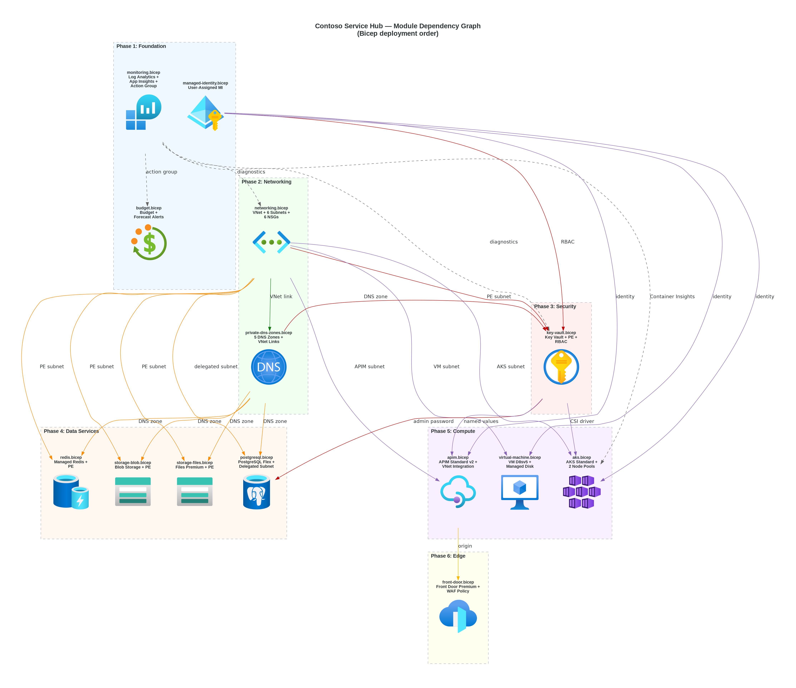
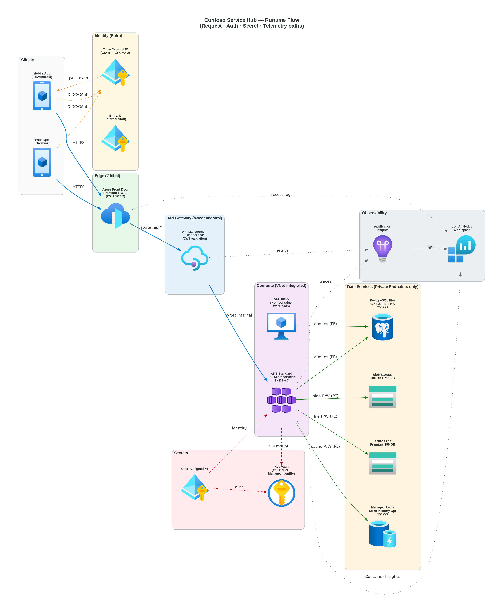

# 📀 Step 4: Implementation Plan - Contoso Service Hub


<details open>
<summary><strong>📑 Implementation Contents</strong></summary>

- [📋 Overview](#-overview)
- [📦 Resource Inventory](#-resource-inventory)
- [🗂️ Module Structure](#-module-structure)
- [🔨 Implementation Tasks](#-implementation-tasks)
- [🚀 Deployment Phases](#-deployment-phases)
- [🔗 Dependency Graph](#-dependency-graph)
- [🔄 Runtime Flow Diagram](#-runtime-flow-diagram)
- [🏷️ Naming Conventions](#-naming-conventions)
- [🔐 Security Configuration](#-security-configuration)
- [⏱️ Estimated Implementation Time](#-estimated-implementation-time)
- [🔒 Approval Gate](#-approval-gate)
- [References](#references)

</details>

> Generated by bicep-plan agent | 2026-03-17

| ⬅️ Previous                                                  | 📑 Index            | Next ➡️                                        |
| ------------------------------------------------------------ | ------------------- | ---------------------------------------------- |
| [04-governance-constraints.md](04-governance-constraints.md) | [README](README.md) | [04-preflight-check.md](04-preflight-check.md) |

## 📋 Overview

Bicep implementation plan for the **Contoso Service Hub** — a full-stack digital services platform hosted on Azure in `swedencentral`. The platform spans 15 cloud services across 3 environments (dev/staging/prod), secured with Private Endpoints, Managed Identity, and WAF, governed by 21 live Azure Policy assignments including 9 mandatory resource group tags.

**Key parameters:**

| Parameter           | Value                                                    |
| ------------------- | -------------------------------------------------------- |
| Region              | `swedencentral`                                          |
| Environments        | `dev`, `staging`, `prod`                                 |
| IaC Tool            | Bicep with AVM modules                                   |
| Resource Count      | 20 deployable Azure resources (15 services + supporting) |
| Budget (3 envs)     | ~€6,593/mo (~$7,166/mo)                                  |
| Compliance          | GDPR, 21 Azure Policy assignments                        |
| Deployment Strategy | Phased (6 phases with approval gates)                    |
| Unique Suffix       | `uniqueString(resourceGroup().id)`                       |

**Governance summary (from Step 3.5):**

- **1 BLOCKER**: 9 mandatory RG tags (`JV-Enforce Resource Group Tags` — Deny)
- **4 AUTO-MODIFY**: Storage security, tag inheritance, VM identity
- **4 AUDIT/WARNING**: PostgreSQL SSL/TLS, Redis plaintext, diagnostic settings
- **Tag drift**: RG deny requires `technical-contact`; child inherit uses `tech-contact`

---

## 📦 Resource Inventory

| #   | Resource                       | Type                                                        | SKU / Tier              | AVM Module                                                      | Version | Dependencies       | Env Diff                                                             |
| --- | ------------------------------ | ----------------------------------------------------------- | ----------------------- | --------------------------------------------------------------- | ------- | ------------------ | -------------------------------------------------------------------- |
| 1   | Log Analytics Workspace        | `Microsoft.OperationalInsights/workspaces`                  | PerGB2018               | ✅ `avm/res/operational-insights/workspace`                     | 0.15.0  | —                  | Retention: prod=90d, staging=60d, dev=31d                            |
| 2   | User-Assigned Managed Identity | `Microsoft.ManagedIdentity/userAssignedIdentities`          | —                       | ✅ `avm/res/managed-identity/user-assigned-identity`            | 0.5.0   | —                  | Same across envs                                                     |
| 3   | Virtual Network                | `Microsoft.Network/virtualNetworks`                         | —                       | ✅ `avm/res/network/virtual-network`                            | 0.7.2   | —                  | CIDR: prod=10.0.0.0/16, staging=10.1.0.0/16, dev=10.2.0.0/16         |
| 4   | NSGs (×6)                      | `Microsoft.Network/networkSecurityGroups`                   | —                       | ✅ `avm/res/network/network-security-group`                     | 0.5.2   | VNet               | Same rules across envs                                               |
| 5   | Private DNS Zones (×5)         | `Microsoft.Network/privateDnsZones`                         | —                       | ✅ `avm/res/network/private-dns-zone`                           | 0.8.1   | VNet               | Same across envs                                                     |
| 6   | Key Vault                      | `Microsoft.KeyVault/vaults`                                 | Standard                | ✅ `avm/res/key-vault/vault`                                    | 0.13.3  | VNet, MI, DNS      | Same across envs (purge protection prod/staging)                     |
| 7   | Storage Account (Blob)         | `Microsoft.Storage/storageAccounts`                         | StorageV2 Hot LRS       | ✅ `avm/res/storage/storage-account`                            | 0.32.0  | VNet, DNS, KV      | Same SKU, RBAC-only (no shared key)                                  |
| 8   | Storage Account (Files)        | `Microsoft.Storage/storageAccounts`                         | FileStorage Premium LRS | ✅ `avm/res/storage/storage-account`                            | 0.32.0  | VNet, DNS          | 256 GB all envs                                                      |
| 9   | PostgreSQL Flexible Server     | `Microsoft.DBforPostgreSQL/flexibleServers`                 | GP Ddsv5 4vCore         | ✅ `avm/res/db-for-postgre-sql/flexible-server`                 | 0.15.2  | VNet, DNS, KV      | prod: HA + 256 GB; staging: no HA, 128 GB; dev: Burstable B2s, 32 GB |
| 10  | Azure Managed Redis            | `Microsoft.Cache/redisEnterprise`                           | M150 Memory Optimized   | ⚠️ `avm/res/cache/redis-enterprise`                             | 0.5.0   | VNet, DNS          | prod: M150; staging: M50; dev: M10                                   |
| 11  | AKS Cluster                    | `Microsoft.ContainerService/managedClusters`                | Standard (Uptime SLA)   | ✅ `avm/res/container-service/managed-cluster`                  | 0.13.0  | VNet, MI, LA, KV   | prod: 2×D8sv5 user+2×D4sv5 sys; staging: 1×D4sv5; dev: 1×B4ms        |
| 12  | Virtual Machine                | `Microsoft.Compute/virtualMachines`                         | D8s v5                  | ✅ `avm/res/compute/virtual-machine`                            | 0.21.0  | VNet, KV, MI       | prod: D8sv5; staging: D4sv5; dev: B4ms                               |
| 13  | Managed Disk                   | `Microsoft.Compute/disks`                                   | Premium SSD P30 256 GB  | ✅ `avm/res/compute/disk`                                       | 0.6.0   | —                  | prod: P30; staging: P20; dev: E20                                    |
| 14  | API Management                 | `Microsoft.ApiManagement/service`                           | Standard v2             | ✅ `avm/res/api-management/service`                             | 0.14.1  | VNet, KV, MI       | prod: Standard v2; staging: Basic v2; dev: Developer                 |
| 15  | Azure Front Door               | `Microsoft.Cdn/profiles`                                    | Premium                 | ✅ `avm/res/cdn/profile`                                        | 0.19.0  | APIM, AKS          | Same tier (Premium required for WAF + PE support)                    |
| 16  | WAF Policy                     | `Microsoft.Network/frontDoorWebApplicationFirewallPolicies` | Premium_AzureFrontDoor  | ✅ `avm/res/network/front-door-web-application-firewall-policy` | 0.3.3   | Front Door         | Prevention mode (prod); Detection mode (dev)                         |
| 17  | Application Insights           | `Microsoft.Insights/components`                             | —                       | ✅ `avm/res/insights/component`                                 | 0.7.1   | LA Workspace       | Same across envs                                                     |
| 18  | Action Group                   | `Microsoft.Insights/actionGroups`                           | —                       | ✅ `avm/res/insights/action-group`                              | 0.8.0   | —                  | Different notification targets per env                               |
| 19  | Private Endpoints (×5)         | `Microsoft.Network/privateEndpoints`                        | —                       | ✅ `avm/res/network/private-endpoint`                           | 0.12.0  | VNet, DNS, targets | One per: PG, Redis, KV, Blob, Files                                  |
| 20  | Budget                         | `Microsoft.Consumption/budgets`                             | —                       | ✅ `avm/res/consumption/budget/rg-scope`                        | 0.1.0   | —                  | prod: $5,500; staging: $1,800; dev: $500                             |

**AVM Coverage: 20/20 resources (100%)** — All resources use Azure Verified Modules.

> [!NOTE]
> **Entra External ID** (CIAM) and **GitHub Actions** (DevOps) are configured outside Bicep. Entra External ID is provisioned via Microsoft Entra admin center or Microsoft Graph API. GitHub Actions is configured in the repository.

---

## 🗂️ Module Structure

```text
infra/bicep/contoso-service-hub/
├── main.bicep                          # Orchestrator — all module calls, uniqueSuffix
├── main.bicepparam                     # Environment-specific parameter values
├── modules/
│   ├── monitoring.bicep                # Log Analytics + App Insights + Action Group
│   ├── managed-identity.bicep          # User-Assigned Managed Identity
│   ├── networking.bicep                # VNet + 6 subnets + 6 NSGs
│   ├── private-dns-zones.bicep         # 5 Private DNS Zones + VNet links
│   ├── key-vault.bicep                 # Key Vault + PE + RBAC
│   ├── storage-blob.bicep              # StorageV2 account + PE + containers
│   ├── storage-files.bicep             # FileStorage Premium account + PE + shares
│   ├── postgresql.bicep                # PostgreSQL Flex Server + PE + SSL config
│   ├── redis.bicep                     # Azure Managed Redis + PE + TLS
│   ├── aks.bicep                       # AKS cluster + node pools + add-ons
│   ├── virtual-machine.bicep           # VM + managed disk + extensions
│   ├── apim.bicep                      # API Management + policies + VNet integration
│   ├── front-door.bicep                # Front Door Premium + WAF + origins + routes
│   └── budget.bicep                    # Budget + forecast alerts + anomaly detection
└── deploy.ps1                          # Deployment script with what-if + validation
```

| Module                  | AVM Source                                                             | Version | Purpose                               |
| ----------------------- | ---------------------------------------------------------------------- | ------- | ------------------------------------- |
| monitoring.bicep        | `br/public:avm/res/operational-insights/workspace`                     | 0.15.0  | Centralized logging workspace         |
| monitoring.bicep        | `br/public:avm/res/insights/component`                                 | 0.7.1   | Distributed tracing and app telemetry |
| monitoring.bicep        | `br/public:avm/res/insights/action-group`                              | 0.8.0   | Alert notification routing            |
| managed-identity.bicep  | `br/public:avm/res/managed-identity/user-assigned-identity`            | 0.5.0   | Shared identity for AKS, APIM, VM     |
| networking.bicep        | `br/public:avm/res/network/virtual-network`                            | 0.7.2   | Hub VNet with 6 subnets               |
| networking.bicep        | `br/public:avm/res/network/network-security-group`                     | 0.5.2   | Per-subnet NSGs                       |
| private-dns-zones.bicep | `br/public:avm/res/network/private-dns-zone`                           | 0.8.1   | PE DNS resolution (×5 zones)          |
| key-vault.bicep         | `br/public:avm/res/key-vault/vault`                                    | 0.13.3  | Secrets, keys, certificates           |
| key-vault.bicep         | `br/public:avm/res/network/private-endpoint`                           | 0.12.0  | Key Vault PE                          |
| storage-blob.bicep      | `br/public:avm/res/storage/storage-account`                            | 0.32.0  | Hot blob storage 200 GB               |
| storage-blob.bicep      | `br/public:avm/res/network/private-endpoint`                           | 0.12.0  | Blob PE                               |
| storage-files.bicep     | `br/public:avm/res/storage/storage-account`                            | 0.32.0  | Premium SSD file shares 256 GB        |
| storage-files.bicep     | `br/public:avm/res/network/private-endpoint`                           | 0.12.0  | Files PE                              |
| postgresql.bicep        | `br/public:avm/res/db-for-postgre-sql/flexible-server`                 | 0.15.2  | PostgreSQL with HA + PITR             |
| postgresql.bicep        | _(delegated subnet — no PE)_                                           | —       | VNet integration via delegated subnet |
| redis.bicep             | `br/public:avm/res/cache/redis-enterprise`                             | 0.5.0   | Azure Managed Redis M150              |
| redis.bicep             | `br/public:avm/res/network/private-endpoint`                           | 0.12.0  | Redis PE                              |
| aks.bicep               | `br/public:avm/res/container-service/managed-cluster`                  | 0.13.0  | AKS Standard with managed add-ons     |
| virtual-machine.bicep   | `br/public:avm/res/compute/virtual-machine`                            | 0.21.0  | Non-containerized workloads           |
| virtual-machine.bicep   | `br/public:avm/res/compute/disk`                                       | 0.6.0   | Premium SSD P30 data disk             |
| apim.bicep              | `br/public:avm/res/api-management/service`                             | 0.14.1  | API gateway with VNet integration     |
| front-door.bicep        | `br/public:avm/res/cdn/profile`                                        | 0.19.0  | Edge CDN + WAF origin routing         |
| front-door.bicep        | `br/public:avm/res/network/front-door-web-application-firewall-policy` | 0.3.3   | OWASP 3.2 managed rules               |
| budget.bicep            | `br/public:avm/res/consumption/budget/rg-scope`                        | 0.1.0   | Cost governance + forecast alerts     |

---

## 🔨 Implementation Tasks

### Task 1: main.bicep (Orchestration)

**Purpose**: Root orchestrator — declares all parameters, generates `uniqueSuffix`, calls all modules in dependency order.

**Parameters**:

```yaml
parameters:
  - name: environment
    type: string
    allowed: ["dev", "staging", "prod"]
    description: Target environment
  - name: location
    type: string
    default: swedencentral
    description: Azure region for all resources
  - name: projectName
    type: string
    default: contoso-service-hub
    description: Project identifier for naming
  - name: owner
    type: string
    description: Resource owner (governance tag)
  - name: costCenter
    type: string
    description: Cost center code (governance tag)
  - name: workloadName
    type: string
    default: service-hub
    description: Workload identifier (governance tag)
  - name: slaTier
    type: string
    allowed: ["99.9", "99.5", "best-effort"]
    description: SLA tier (governance tag)
  - name: backupPolicy
    type: string
    default: daily-30d
    description: Backup policy label (governance tag)
  - name: maintenanceWindow
    type: string
    default: sun-02-06-utc
    description: Maintenance window (governance tag)
  - name: technicalContact
    type: string
    description: Technical contact email (governance tag)
  - name: vnetAddressPrefix
    type: string
    description: VNet CIDR (env-specific)
  - name: aksNodeCount
    type: int
    description: AKS user node pool count (env-specific)
  - name: aksNodeSku
    type: string
    description: AKS user node VM size (env-specific)
  - name: postgresqlSkuName
    type: string
    description: PostgreSQL compute tier (env-specific)
  - name: postgresqlHaMode
    type: string
    description: PostgreSQL HA mode (env-specific)
  - name: redisSku
    type: string
    description: Redis Enterprise SKU (env-specific)
  - name: vmSize
    type: string
    description: VM size (env-specific)
  - name: apimSkuName
    type: string
    description: APIM SKU (env-specific)
  - name: budgetAmount
    type: int
    description: Monthly budget in USD (env-specific)
```

**Variables**:

```yaml
variables:
  - name: uniqueSuffix
    value: uniqueString(resourceGroup().id)
    description: 5-char deterministic suffix for globally unique names
  - name: shortProjectName
    value: csh
    description: Abbreviated project name for length-constrained resources
  - name: tags
    value: >
      {
        environment: environment
        owner: owner
        costcenter: costCenter
        application: projectName
        workload: workloadName
        sla: slaTier
        'backup-policy': backupPolicy
        'maint-window': maintenanceWindow
        'technical-contact': technicalContact
        'tech-contact': technicalContact
        'ManagedBy': 'Bicep'
      }
    description: 11 tags — 9 governance-required + tech-contact (drift mitigation) + ManagedBy
```

**Modules Called** (in dependency order):

1. `monitoring.bicep` — Log Analytics, App Insights, Action Group
2. `managed-identity.bicep` — User-Assigned MI
3. `networking.bicep` — VNet, subnets, NSGs
4. `private-dns-zones.bicep` — 5 DNS zones + VNet links
5. `key-vault.bicep` — Key Vault + PE
6. `storage-blob.bicep` — Blob storage + PE
7. `storage-files.bicep` — Files storage + PE
8. `postgresql.bicep` — PostgreSQL + PE
9. `redis.bicep` — Managed Redis + PE
10. `aks.bicep` — AKS cluster
11. `virtual-machine.bicep` — VM + disk
12. `apim.bicep` — API Management
13. `front-door.bicep` — Front Door + WAF
14. `budget.bicep` — Budget + alerts

---

### Task 2: modules/monitoring.bicep

**Purpose**: Centralized observability — Log Analytics workspace, Application Insights, and alert routing.

**AVM Modules**: `operational-insights/workspace` v0.15.0, `insights/component` v0.7.1, `insights/action-group` v0.8.0

**Resources**:

```yaml
resources:
  - name: law-csh-{env}-{suffix}
    type: Log Analytics Workspace
    sku: PerGB2018
    config:
      retentionInDays: env == 'prod' ? 90 : env == 'staging' ? 60 : 31
      dailyQuotaGb: env == 'prod' ? -1 : 5
      diagnosticSettings: allLogs → self (policy: LoggingControls audit)
  - name: ai-csh-{env}-{suffix}
    type: Application Insights
    config:
      kind: web
      applicationType: web
      workspaceResourceId: logAnalyticsWorkspace.id
      retentionInDays: 90
  - name: ag-csh-{env}
    type: Action Group
    config:
      emailReceivers: env-specific notification targets
      enabled: true
```

**Outputs**: `logAnalyticsWorkspaceId`, `logAnalyticsWorkspaceName`, `appInsightsConnectionString`, `appInsightsInstrumentationKey`, `actionGroupId`

---

### Task 3: modules/managed-identity.bicep

**Purpose**: Shared User-Assigned Managed Identity for AKS, APIM, and VM authentication to data services.

**AVM Module**: `managed-identity/user-assigned-identity` v0.5.0

**Resources**:

```yaml
resources:
  - name: id-csh-{env}-{suffix}
    type: User-Assigned Managed Identity
    config:
      # No additional configuration — identity is granted RBAC in consuming modules
```

**Outputs**: `managedIdentityId`, `managedIdentityPrincipalId`, `managedIdentityClientId`

---

### Task 4: modules/networking.bicep

**Purpose**: Hub VNet with 6 subnets and per-subnet NSGs for network segmentation.

**AVM Modules**: `network/virtual-network` v0.7.2, `network/network-security-group` v0.5.2

**Resources**:

```yaml
resources:
  - name: vnet-csh-{env}
    type: Virtual Network
    config:
      addressPrefixes: [vnetAddressPrefix] # prod: 10.0.0.0/16, staging: 10.1.0.0/16, dev: 10.2.0.0/16
      subnets:
        - name: snet-aks-{env}
          addressPrefix: x.x.1.0/24
          purpose: AKS node pool subnet
          delegations: []
        - name: snet-apim-{env}
          addressPrefix: x.x.2.0/24
          purpose: APIM VNet integration
          delegations: []
        - name: snet-data-{env}
          addressPrefix: x.x.3.0/24
          purpose: Private Endpoints for data services
          delegations: []
        - name: snet-vm-{env}
          addressPrefix: x.x.4.0/24
          purpose: Virtual Machine subnet
          delegations: []
        - name: snet-pgsql-{env}
          addressPrefix: x.x.5.0/24
          purpose: PostgreSQL delegated subnet
          delegations: [Microsoft.DBforPostgreSQL/flexibleServers]
        - name: snet-default-{env}
          addressPrefix: x.x.0.0/24
          purpose: Default / management subnet
          delegations: []
      diagnosticSettings:
        workspaceResourceId: logAnalyticsWorkspaceId
  - name: nsg-aks-{env}
    type: NSG → snet-aks
    rules: Allow HTTPS inbound from APIM subnet; deny all other inbound
  - name: nsg-apim-{env}
    type: NSG → snet-apim
    rules: Allow 443 inbound from Front Door service tag; allow 3443 for APIM management
  - name: nsg-data-{env}
    type: NSG → snet-data
    rules: Deny all public inbound; allow PE traffic from VNet only
  - name: nsg-vm-{env}
    type: NSG → snet-vm
    rules: Allow SSH from management subnet only; deny all other inbound
  - name: nsg-pgsql-{env}
    type: NSG → snet-pgsql
    rules: Allow 5432 from AKS and VM subnets; deny all other inbound
  - name: nsg-default-{env}
    type: NSG → snet-default
    rules: Default deny inbound
```

**Outputs**: `vnetId`, `vnetName`, `aksSubnetId`, `apimSubnetId`, `dataSubnetId`, `vmSubnetId`, `pgsqlSubnetId`

---

### Task 5: modules/private-dns-zones.bicep

**Purpose**: Private DNS zones for PE resolution. All 5 zones linked to the VNet.

**AVM Module**: `network/private-dns-zone` v0.8.1

**Resources**:

```yaml
resources:
  - name: privatelink.postgres.database.azure.com
    purpose: PostgreSQL Flexible Server PE DNS
  - name: privatelink.redisenterprise.cache.azure.com
    purpose: Azure Managed Redis PE DNS
  - name: privatelink.vaultcore.azure.net
    purpose: Key Vault PE DNS
  - name: privatelink.blob.core.windows.net
    purpose: Blob Storage PE DNS
  - name: privatelink.file.core.windows.net
    purpose: Azure Files PE DNS
  # Each zone gets a VNet link to vnet-csh-{env}
```

**Outputs**: `postgresqlDnsZoneId`, `redisDnsZoneId`, `keyVaultDnsZoneId`, `blobDnsZoneId`, `fileDnsZoneId`

---

### Task 6: modules/key-vault.bicep

**Purpose**: Centralized secrets management with RBAC, purge protection, PE.

**AVM Modules**: `key-vault/vault` v0.13.3, `network/private-endpoint` v0.12.0

**Resources**:

```yaml
resources:
  - name: kv-csh-{env}-{suffix}
    type: Key Vault
    config:
      sku: standard
      enableRbacAuthorization: true
      enableSoftDelete: true
      softDeleteRetentionInDays: 90
      enablePurgeProtection: env != 'dev' # disabled in dev for cleanup
      publicNetworkAccess: disabled
      networkAcls:
        defaultAction: Deny
      roleAssignments:
        - principalId: managedIdentityPrincipalId
          roleDefinitionId: Key Vault Secrets User
      diagnosticSettings:
        workspaceResourceId: logAnalyticsWorkspaceId
        categoryGroup: allLogs
  - name: pe-kv-csh-{env}
    type: Private Endpoint
    config:
      subnetId: dataSubnetId
      groupIds: ["vault"]
      privateDnsZoneGroupId: keyVaultDnsZoneId
```

**Outputs**: `keyVaultId`, `keyVaultUri`, `keyVaultName`

---

### Task 7: modules/storage-blob.bicep

**Purpose**: Object storage for platform content (200 GB hot tier), RBAC-only access.

**AVM Modules**: `storage/storage-account` v0.32.0, `network/private-endpoint` v0.12.0

**Resources**:

```yaml
resources:
  - name: stcshblob{env}{suffix}
    type: Storage Account (StorageV2)
    config:
      kind: StorageV2
      sku: Standard_LRS
      accessTier: Hot
      allowBlobPublicAccess: false # Policy: Modify auto-enforces
      allowSharedKeyAccess: false # Policy: Modify auto-enforces
      minimumTlsVersion: TLS1_2
      supportsHttpsTrafficOnly: true
      publicNetworkAccess: Disabled
      networkAcls:
        defaultAction: Deny
      blobServices:
        containers:
          - name: platform-content
            publicAccess: None
          - name: user-uploads
            publicAccess: None
          - name: backups
            publicAccess: None
      diagnosticSettings:
        workspaceResourceId: logAnalyticsWorkspaceId
  - name: pe-stblob-csh-{env}
    type: Private Endpoint
    config:
      subnetId: dataSubnetId
      groupIds: ["blob"]
      privateDnsZoneGroupId: blobDnsZoneId
```

**Outputs**: `blobStorageAccountId`, `blobStorageAccountName`

---

### Task 8: modules/storage-files.bicep

**Purpose**: Premium SSD file shares (256 GB) for application workloads.

**AVM Modules**: `storage/storage-account` v0.32.0, `network/private-endpoint` v0.12.0

**Resources**:

```yaml
resources:
  - name: stcshfile{env}{suffix}
    type: Storage Account (FileStorage)
    config:
      kind: FileStorage
      sku: Premium_LRS
      allowBlobPublicAccess: false
      allowSharedKeyAccess: false
      minimumTlsVersion: TLS1_2
      supportsHttpsTrafficOnly: true
      publicNetworkAccess: Disabled
      networkAcls:
        defaultAction: Deny
      fileServices:
        shares:
          - name: app-data
            shareQuota: 256
            accessTier: Premium
      diagnosticSettings:
        workspaceResourceId: logAnalyticsWorkspaceId
  - name: pe-stfile-csh-{env}
    type: Private Endpoint
    config:
      subnetId: dataSubnetId
      groupIds: ["file"]
      privateDnsZoneGroupId: fileDnsZoneId
```

**Outputs**: `fileStorageAccountId`, `fileStorageAccountName`

---

### Task 9: modules/postgresql.bicep

**Purpose**: Primary relational database — zone-redundant HA (prod), SSL enforced, PITR enabled.

**AVM Modules**: `db-for-postgre-sql/flexible-server` v0.15.2, `network/private-endpoint` v0.12.0

**Resources**:

```yaml
resources:
  - name: psql-csh-{env}-{suffix}
    type: PostgreSQL Flexible Server
    config:
      version: '16'
      sku:
        name: postgresqlSkuName          # prod: Standard_D4ds_v5, staging: Standard_D2ds_v5, dev: Standard_B2s
        tier: env == 'dev' ? Burstable : GeneralPurpose
      storage:
        storageSizeGB: env == 'prod' ? 256 : env == 'staging' ? 128 : 32
      highAvailability:
        mode: postgresqlHaMode            # prod: ZoneRedundant, staging/dev: Disabled
      backup:
        backupRetentionDays: 30
        geoRedundantBackup: Disabled
      # Delegated subnet networking (not PE — PostgreSQL Flex uses VNet integration)
      network:
        delegatedSubnetResourceId: pgsqlSubnetId
        privateDnsZoneArmResourceId: postgresqlDnsZoneId
      configurations:
        - name: require_secure_transport
          value: 'ON'                     # Policy: AuditIfNotExists compliance
        - name: ssl_min_protocol_version
          value: 'TLSv1.2'               # Policy: AuditIfNotExists compliance
      administratorLogin: psqladmin
      administratorLoginPassword: <from Key Vault>
      diagnosticSettings:
        workspaceResourceId: logAnalyticsWorkspaceId
        categoryGroup: allLogs
```

> [!NOTE]
> PostgreSQL Flexible Server uses **delegated subnet** networking (not Private Endpoints).
> The PE is not needed — VNet integration via delegated subnet provides private access.
> The Private DNS zone is still required for name resolution.

**Outputs**: `postgresqlServerId`, `postgresqlServerFqdn`, `postgresqlServerName`

---

### Task 10: modules/redis.bicep

**Purpose**: In-memory cache — Azure Managed Redis M150 (150 GB usable), zone-aware, encrypted.

**AVM Module**: `cache/redis-enterprise` v0.5.0, `network/private-endpoint` v0.12.0

**Resources**:

```yaml
resources:
  - name: redis-csh-{env}-{suffix}
    type: Redis Enterprise Cluster (Azure Managed Redis)
    config:
      sku:
        name: redisSku                  # prod: MemoryOptimized_M150, staging: MemoryOptimized_M50, dev: MemoryOptimized_M10
        capacity: 1
      minimumTlsVersion: '1.2'
      zones: env == 'prod' ? ['1', '2', '3'] : null
      databases:
        - name: default
          clientProtocol: Encrypted      # Policy: Audit compliance — no Plaintext
          clusteringPolicy: OSSCluster
          evictionPolicy: noeviction
          port: 10000
      diagnosticSettings:
        workspaceResourceId: logAnalyticsWorkspaceId
        categoryGroup: allLogs           # Policy: LoggingControls audit
  - name: pe-redis-csh-{env}
    type: Private Endpoint
    config:
      subnetId: dataSubnetId
      groupIds: ['redisEnterprise']
      privateDnsZoneGroupId: redisDnsZoneId
```

**Outputs**: `redisClusterId`, `redisHostName`, `redisPort`

---

### Task 11: modules/aks.bicep

**Purpose**: Kubernetes cluster for 15+ microservices with managed add-ons, KEDA, and Container Insights.

**AVM Module**: `container-service/managed-cluster` v0.13.0

**Resources**:

```yaml
resources:
  - name: aks-csh-{env}-{suffix}
    type: AKS Managed Cluster
    config:
      skuTier: env == 'prod' ? Standard : Free
      kubernetesVersion: '1.30'
      dnsPrefix: aks-csh-{env}
      identity:
        type: UserAssigned
        userAssignedIdentities: [managedIdentityId]
      agentPoolProfiles:
        - name: system
          mode: System
          vmSize: env == 'prod' ? Standard_D4s_v5 : Standard_B4ms
          count: env == 'prod' ? 2 : 1
          availabilityZones: env == 'prod' ? ['1','2','3'] : null
          osDiskSizeGB: 128
          maxPods: 110
          osType: Linux
        - name: user
          mode: User
          vmSize: aksNodeSku            # prod: Standard_D8s_v5, staging: Standard_D4s_v5, dev: Standard_B4ms
          count: aksNodeCount           # prod: 2, staging: 1, dev: 1
          availabilityZones: env == 'prod' ? ['1','2','3'] : null
          enableAutoScaling: true
          minCount: env == 'prod' ? 2 : 1
          maxCount: env == 'prod' ? 5 : 2
          maxPods: 110
          osType: Linux
      # Governance: ≤10 agent pools (current: 2 — compliant)
      networkProfile:
        networkPlugin: azure
        networkPolicy: calico
        serviceCidr: '172.16.0.0/16'
        dnsServiceIP: '172.16.0.10'
        loadBalancerSku: standard
      addonProfiles:
        omsagent:
          enabled: true
          logAnalyticsWorkspaceResourceID: logAnalyticsWorkspaceId
        azurepolicy:
          enabled: true
        azureKeyvaultSecretsProvider:
          enabled: true
      autoScalerProfile:
        scaleDownDelayAfterAdd: '15m'
        scaleDownUnreadyTime: '20m'
      diagnosticSettings:
        workspaceResourceId: logAnalyticsWorkspaceId
      # KEDA enabled via managedCluster addon
```

**Outputs**: `aksClusterId`, `aksClusterFqdn`, `aksOidcIssuerUrl`

---

### Task 12: modules/virtual-machine.bicep

**Purpose**: Non-containerized workloads — D8s v5 Linux VM with Premium SSD data disk.

**AVM Modules**: `compute/virtual-machine` v0.21.0, `compute/disk` v0.6.0

**Resources**:

```yaml
resources:
  - name: vm-csh-{env}-{suffix}
    type: Virtual Machine
    config:
      vmSize: vmSize                    # prod: Standard_D8s_v5, staging: Standard_D4s_v5, dev: Standard_B4ms
      osType: Linux
      imageReference:
        publisher: Canonical
        offer: ubuntu-24_04-lts
        sku: server
        version: latest
      osDisk:
        managedDisk:
          storageAccountType: Premium_LRS
        diskSizeGB: 128
      identity:
        type: UserAssigned
        userAssignedIdentities: [managedIdentityId]
      # Policy: VMs without identity auto-modified to SystemAssigned (Windows only — not triggered for Linux)
      networkInterfaces:
        - subnetId: vmSubnetId
          enableAcceleratedNetworking: true
      diagnosticSettings:
        workspaceResourceId: logAnalyticsWorkspaceId
  - name: disk-csh-{env}-{suffix}
    type: Managed Disk
    config:
      sku: env == 'prod' ? Premium_LRS : env == 'staging' ? Premium_LRS : StandardSSD_LRS
      diskSizeGB: 256
      createOption: Empty
      # Attached to VM as data disk
```

**Outputs**: `vmId`, `vmPrivateIpAddress`

---

### Task 13: modules/apim.bicep

**Purpose**: Unified API gateway with VNet integration for private backend routing.

**AVM Module**: `api-management/service` v0.14.1

**Resources**:

```yaml
resources:
  - name: apim-csh-{env}-{suffix}
    type: API Management Service
    config:
      sku:
        name: apimSkuName # prod: Standardv2, staging: Basicv2, dev: Developer
        capacity: 1
      publisherName: Contoso
      publisherEmail: api-admin@contoso.com
      identity:
        type: UserAssigned
        userAssignedIdentities: [managedIdentityId]
      # Standard v2 does NOT support Internal VNet injection — use VNet integration (outbound) + Private Endpoint (inbound)
      # Developer tier (dev) uses no VNet integration
      virtualNetworkType: None # Standard v2 uses PE for inbound, VNet integration for outbound
      # Inbound: Private Endpoint from Front Door Private Link origin
      # Outbound: VNet integration to reach backend private services
      diagnosticSettings:
        workspaceResourceId: logAnalyticsWorkspaceId
        categoryGroup: allLogs
```

> **APIM Networking Note**: Standard v2 and Basic v2 tiers do NOT support classic Internal VNet injection (which is only available on Developer/Premium/Premiumv2 tiers). Instead, use: (1) VNet integration for outbound connectivity to backend services on private networks, and (2) a Private Endpoint for inbound traffic from Azure Front Door via Private Link origin. The Developer tier (dev environment) uses no VNet integration.

**Outputs**: `apimId`, `apimGatewayUrl`, `apimPrivateEndpointId`

---

### Task 14: modules/front-door.bicep

**Purpose**: Global edge — CDN, WAF (OWASP 3.2), bot protection, origin routing to APIM.

**AVM Modules**: `cdn/profile` v0.19.0, `network/front-door-web-application-firewall-policy` v0.3.3

**Resources**:

```yaml
resources:
  - name: afd-csh-{env}
    type: Front Door Profile (Premium)
    config:
      sku: Premium_AzureFrontDoor
      endpoints:
        - name: ep-api-csh-{env}
          enabledState: Enabled
      originGroups:
        - name: og-apim
          loadBalancingSettings:
            sampleSize: 4
            successfulSamplesRequired: 3
          healthProbeSettings:
            probePath: /health
            probeProtocol: Https
            probeIntervalInSeconds: 30
          origins:
            - name: origin-apim
              hostName: apimGatewayHostName
              httpPort: 80
              httpsPort: 443
              priority: 1
              weight: 1000
              privateLinkResourceId: apimPrivateEndpointId  # Private Link origin for APIM
              privateLinkLocation: swedencentral
              privateEndpointResourceType: Microsoft.ApiManagement/service
      routes:
        - name: rt-api
          endpointName: ep-api-csh-{env}
          originGroupName: og-apim
          patternsToMatch: ['/api/*']
          forwardingProtocol: HttpsOnly
          httpsRedirect: Enabled
      securityPolicies:
        - name: sp-waf
          wafPolicyId: wafPolicy.id
          associations:
            - endpointName: ep-api-csh-{env}
      diagnosticSettings:
        workspaceResourceId: logAnalyticsWorkspaceId
        categoryGroup: allLogs             # Policy: LoggingControls audit
  - name: waf-csh-{env}
    type: WAF Policy
    config:
      sku: Premium_AzureFrontDoor
      policySettings:
        enabledState: Enabled
        mode: env == 'prod' ? Prevention : Detection
      managedRules:
        managedRuleSets:
          - ruleSetType: Microsoft_DefaultRuleSet
            ruleSetVersion: '2.1'
          - ruleSetType: Microsoft_BotManagerRuleSet
            ruleSetVersion: '1.1'
```

**Outputs**: `frontDoorId`, `frontDoorEndpointHostName`, `frontDoorProfileName`

---

### Task 15: modules/budget.bicep

**Purpose**: Cost governance — monthly budget with forecast alerts at 80%/100%/120% and anomaly detection.

**AVM Module**: `consumption/budget/rg-scope` v0.1.0

**Resources**:

```yaml
resources:
  - name: budget-csh-{env}
    type: Budget (Resource Group scope)
    config:
      amount: budgetAmount # prod: 5500, staging: 1800, dev: 500
      category: Cost
      timeGrain: Monthly
      timePeriod:
        startDate: deployment start date
      notifications:
        forecast80:
          enabled: true
          operator: GreaterThanOrEqualTo
          threshold: 80
          thresholdType: Forecasted
          contactEmails: [technicalContact]
          contactGroups: [actionGroupId]
        forecast100:
          enabled: true
          operator: GreaterThanOrEqualTo
          threshold: 100
          thresholdType: Forecasted
          contactEmails: [technicalContact]
          contactGroups: [actionGroupId]
        forecast120:
          enabled: true
          operator: GreaterThanOrEqualTo
          threshold: 120
          thresholdType: Forecasted
          contactEmails: [technicalContact]
          contactGroups: [actionGroupId]
        actual100:
          enabled: true
          operator: GreaterThanOrEqualTo
          threshold: 100
          thresholdType: Actual
          contactEmails: [technicalContact]
          contactGroups: [actionGroupId]
```

**Outputs**: `budgetId`

---

### Task 16: main.bicepparam (Parameter File)

**Purpose**: Environment-specific parameter values using `.bicepparam` format.

**Environment Differentiation**:

| Parameter           | dev                   | staging               | prod                   |
| ------------------- | --------------------- | --------------------- | ---------------------- |
| `environment`       | `dev`                 | `staging`             | `prod`                 |
| `vnetAddressPrefix` | `10.2.0.0/16`         | `10.1.0.0/16`         | `10.0.0.0/16`          |
| `aksNodeCount`      | 1                     | 1                     | 2                      |
| `aksNodeSku`        | `Standard_B4ms`       | `Standard_D4s_v5`     | `Standard_D8s_v5`      |
| `postgresqlSkuName` | `Standard_B2s`        | `Standard_D2ds_v5`    | `Standard_D4ds_v5`     |
| `postgresqlHaMode`  | `Disabled`            | `Disabled`            | `ZoneRedundant`        |
| `redisSku`          | `MemoryOptimized_M10` | `MemoryOptimized_M50` | `MemoryOptimized_M150` |
| `vmSize`            | `Standard_B4ms`       | `Standard_D4s_v5`     | `Standard_D8s_v5`      |
| `apimSkuName`       | `Developer`           | `Basicv2`             | `Standardv2`           |
| `budgetAmount`      | 500                   | 1800                  | 5500                   |
| `slaTier`           | `best-effort`         | `99.5`                | `99.9`                 |

---

### Task 17: deploy.ps1 (Deployment Script)

**Features**:

- Parameter validation (environment, resource group, subscription)
- Bicep lint + build verification before deployment
- `az deployment group what-if` preview with diff output
- Interactive approval gate before actual deployment
- `az deployment group create` execution
- Post-deployment output display (endpoints, connection strings)
- Error handling with rollback guidance

---

## 🚀 Deployment Phases

> Deployment strategy: **Phased** — 6 logical phases with validation gates between each. All phases deploy via a single `main.bicep` but can be isolated using deployment conditions. Recommended for production; dev may use single-pass.

### Phase 1: Foundation

| Order | Module                 | Resources                                           | Validation                                                                 |
| ----- | ---------------------- | --------------------------------------------------- | -------------------------------------------------------------------------- |
| 1.1   | monitoring.bicep       | Log Analytics Workspace, App Insights, Action Group | Verify workspace accepting ingestion; App Insights connection string valid |
| 1.2   | managed-identity.bicep | User-Assigned Managed Identity                      | Verify identity created; principalId available                             |
| 1.3   | budget.bicep           | Budget + 4 alert notifications                      | Verify budget active; forecast alerts configured                           |

**Gate**: Confirm Log Analytics workspace ID and MI principalId before networking.

### Phase 2: Networking

| Order | Module                  | Resources                         | Validation                                       |
| ----- | ----------------------- | --------------------------------- | ------------------------------------------------ |
| 2.1   | networking.bicep        | VNet (6 subnets), 6 NSGs          | Verify subnets created; NSG associations correct |
| 2.2   | private-dns-zones.bicep | 5 Private DNS Zones, 5 VNet links | Verify DNS zones linked to VNet; resolution test |

**Gate**: Verify VNet connectivity and DNS resolution before security/data resources.

### Phase 3: Security

| Order | Module          | Resources                    | Validation                                                                       |
| ----- | --------------- | ---------------------------- | -------------------------------------------------------------------------------- |
| 3.1   | key-vault.bicep | Key Vault + Private Endpoint | Verify KV accessible via PE; RBAC grants active; purge protection enabled (prod) |

**Gate**: Verify Key Vault PE DNS resolution and MI can read secrets.

### Phase 4: Data Services

| Order | Module              | Resources                                   | Validation                                                         |
| ----- | ------------------- | ------------------------------------------- | ------------------------------------------------------------------ |
| 4.1   | storage-blob.bicep  | Blob Storage Account + PE                   | Verify no public access; shared key disabled; PE resolves          |
| 4.2   | storage-files.bicep | Files Storage Account + PE                  | Verify Premium tier; file share accessible via PE                  |
| 4.3   | postgresql.bicep    | PostgreSQL Flex Server (+ delegated subnet) | Verify SSL enforced; TLS 1.2+; HA active (prod); PITR enabled      |
| 4.4   | redis.bicep         | Managed Redis Cluster + PE                  | Verify encrypted client protocol; diagnostic settings; PE resolves |

**Gate**: All data services accessible via private network; SSL/TLS audit policies pass.

### Phase 5: Compute

| Order | Module                | Resources                  | Validation                                                                               |
| ----- | --------------------- | -------------------------- | ---------------------------------------------------------------------------------------- |
| 5.1   | aks.bicep             | AKS Cluster (2 node pools) | Verify nodes ready; ≤10 pools (policy); Container Insights active; KV CSI driver mounted |
| 5.2   | virtual-machine.bicep | VM + Managed Disk          | Verify VM running; MI attached; data disk mounted; D-series compliant (policy)           |
| 5.3   | apim.bicep            | API Management             | Verify VNet integration; gateway URL accessible from VNet; MI active                     |

**Gate**: AKS nodes healthy; APIM gateway responding; VM accessible via SSH from management subnet.

### Phase 6: Edge

| Order | Module           | Resources                       | Validation                                                                                                 |
| ----- | ---------------- | ------------------------------- | ---------------------------------------------------------------------------------------------------------- |
| 6.1   | front-door.bicep | Front Door Premium + WAF Policy | Verify endpoint routing to APIM origin; WAF rules active (Prevention in prod); diagnostic settings enabled |

**Gate**: End-to-end request flow: Front Door → APIM → AKS (health endpoint) returns 200.

### Phase Summary

| Phase     | Phase Name    | Resources | Est. Deploy Time | Approval Gate         |
| --------- | ------------- | --------- | ---------------- | --------------------- |
| 1         | Foundation    | 5         | ~3 min           | ✅ LA workspace + MI  |
| 2         | Networking    | 12        | ~5 min           | ✅ VNet + DNS         |
| 3         | Security      | 2         | ~3 min           | ✅ Key Vault PE       |
| 4         | Data Services | 8         | ~15 min          | ✅ Data PE resolution |
| 5         | Compute       | 5         | ~20 min          | ✅ AKS + APIM health  |
| 6         | Edge          | 2         | ~10 min          | ✅ E2E request flow   |
| **Total** |               | **34**    | **~56 min**      |                       |

> [!NOTE]
> Deploy times are estimates for a single environment. PostgreSQL HA provisioning and APIM creation are the longest operations. Redis Enterprise cluster creation may take 10–15 minutes.

---

## 🔗 Dependency Graph



Source: [04-dependency-diagram.py](./04-dependency-diagram.py)

> Each node maps to a module in the `modules/` directory. Edges represent explicit `dependsOn` relationships or parameter passing from parent to child module.

**Dependency order** (topological sort):

1. **monitoring.bicep** — no dependencies
2. **managed-identity.bicep** — no dependencies
3. **budget.bicep** — depends on monitoring (action group for alerts)
4. **networking.bicep** — depends on monitoring (diagnostic settings)
5. **private-dns-zones.bicep** — depends on networking (VNet link)
6. **key-vault.bicep** — depends on networking, private-dns-zones, managed-identity, monitoring
7. **storage-blob.bicep** — depends on networking, private-dns-zones, monitoring
8. **storage-files.bicep** — depends on networking, private-dns-zones, monitoring
9. **postgresql.bicep** — depends on networking, private-dns-zones, key-vault, monitoring
10. **redis.bicep** — depends on networking, private-dns-zones, monitoring
11. **aks.bicep** — depends on networking, managed-identity, key-vault, monitoring
12. **virtual-machine.bicep** — depends on networking, managed-identity, key-vault, monitoring
13. **apim.bicep** — depends on networking, managed-identity, key-vault, monitoring
14. **front-door.bicep** — depends on apim, monitoring

---

## 🔄 Runtime Flow Diagram



Source: [04-runtime-diagram.py](./04-runtime-diagram.py)

> Shows request, authentication, secret retrieval, and telemetry paths at runtime.

**Request flow**: User → Front Door (WAF) → APIM (JWT validation) → AKS (microservice) → PostgreSQL/Redis

**Auth flow**: User → Entra External ID (OIDC) → JWT → APIM (validate) → AKS (claims)

**Secret flow**: AKS → Key Vault CSI Driver → mount secrets as volumes

**Telemetry flow**: All services → Log Analytics Workspace ← App Insights ← AKS (Container Insights)

---

## 🏷️ Naming Conventions

> All names follow Azure Cloud Adoption Framework (CAF) conventions with the Contoso Service Hub short prefix `csh`.

| Resource         | Pattern                        | dev Example                  | prod Example                  | Max Len |
| ---------------- | ------------------------------ | ---------------------------- | ----------------------------- | ------- |
| Resource Group   | `rg-{project}-{env}`           | `rg-contoso-service-hub-dev` | `rg-contoso-service-hub-prod` | 90      |
| Virtual Network  | `vnet-{short}-{env}`           | `vnet-csh-dev`               | `vnet-csh-prod`               | 64      |
| Subnet           | `snet-{purpose}-{env}`         | `snet-aks-dev`               | `snet-aks-prod`               | 80      |
| NSG              | `nsg-{purpose}-{env}`          | `nsg-aks-dev`                | `nsg-aks-prod`                | 80      |
| Key Vault        | `kv-{short}-{env}-{suffix}`    | `kv-csh-dev-a1b2c`           | `kv-csh-prod-x9y8z`           | 24      |
| Storage (Blob)   | `st{short}blob{env}{suffix}`   | `stcshblobdeva1b2c`          | `stcshblobprodx9y8z`          | 24      |
| Storage (Files)  | `st{short}file{env}{suffix}`   | `stcshfiledeva1b2c`          | `stcshfileprodx9y8z`          | 24      |
| PostgreSQL       | `psql-{short}-{env}-{suffix}`  | `psql-csh-dev-a1b2c`         | `psql-csh-prod-x9y8z`         | 63      |
| Redis            | `redis-{short}-{env}-{suffix}` | `redis-csh-dev-a1b2c`        | `redis-csh-prod-x9y8z`        | 63      |
| AKS              | `aks-{short}-{env}-{suffix}`   | `aks-csh-dev-a1b2c`          | `aks-csh-prod-x9y8z`          | 63      |
| VM               | `vm-{short}-{env}-{suffix}`    | `vm-csh-dev-a1b2c`           | `vm-csh-prod-x9y8z`           | 64      |
| Managed Disk     | `disk-{short}-{env}-{suffix}`  | `disk-csh-dev-a1b2c`         | `disk-csh-prod-x9y8z`         | 80      |
| APIM             | `apim-{short}-{env}-{suffix}`  | `apim-csh-dev-a1b2c`         | `apim-csh-prod-x9y8z`         | 50      |
| Front Door       | `afd-{short}-{env}`            | `afd-csh-dev`                | `afd-csh-prod`                | 64      |
| WAF Policy       | `waf-{short}-{env}`            | `waf-csh-dev`                | `waf-csh-prod`                | 80      |
| Log Analytics    | `law-{short}-{env}-{suffix}`   | `law-csh-dev-a1b2c`          | `law-csh-prod-x9y8z`          | 63      |
| App Insights     | `ai-{short}-{env}-{suffix}`    | `ai-csh-dev-a1b2c`           | `ai-csh-prod-x9y8z`           | 260     |
| Action Group     | `ag-{short}-{env}`             | `ag-csh-dev`                 | `ag-csh-prod`                 | 12      |
| Managed Identity | `id-{short}-{env}-{suffix}`    | `id-csh-dev-a1b2c`           | `id-csh-prod-x9y8z`           | 128     |
| Private Endpoint | `pe-{target}-{short}-{env}`    | `pe-kv-csh-dev`              | `pe-kv-csh-prod`              | 80      |
| Budget           | `budget-{short}-{env}`         | `budget-csh-dev`             | `budget-csh-prod`             | 63      |

**Tag values** (applied to Resource Group — inherited to children via Modify policy):

| Tag Key             | dev                   | staging               | prod                  |
| ------------------- | --------------------- | --------------------- | --------------------- |
| `environment`       | `dev`                 | `staging`             | `prod`                |
| `owner`             | _{from parameter}_    | _{from parameter}_    | _{from parameter}_    |
| `costcenter`        | _{from parameter}_    | _{from parameter}_    | _{from parameter}_    |
| `application`       | `contoso-service-hub` | `contoso-service-hub` | `contoso-service-hub` |
| `workload`          | `service-hub`         | `service-hub`         | `service-hub`         |
| `sla`               | `best-effort`         | `99.5`                | `99.9`                |
| `backup-policy`     | `daily-30d`           | `daily-30d`           | `daily-30d`           |
| `maint-window`      | `sun-02-06-utc`       | `sun-02-06-utc`       | `sun-02-06-utc`       |
| `technical-contact` | _{from parameter}_    | _{from parameter}_    | _{from parameter}_    |
| `ManagedBy`         | `Bicep`               | `Bicep`               | `Bicep`               |

> [!WARNING]
> **Tag drift mitigation**: The child-resource inherit policy uses `tech-contact` while the RG deny policy requires `technical-contact`. The Bicep code must set `technical-contact` on the RG explicitly. Do NOT rely on automatic tag inheritance for the ninth tag. Both `technical-contact` (for RG) and `tech-contact` (for child resources, matching inherit policy) should be set in the tags object to avoid compliance drift.

---

## 🔐 Security Configuration

| Resource          | Security Setting                                      | Value                                      | Governance Policy                                   |
| ----------------- | ----------------------------------------------------- | ------------------------------------------ | --------------------------------------------------- |
| Key Vault         | `enableRbacAuthorization`                             | `true`                                     | Best practice                                       |
| Key Vault         | `enablePurgeProtection`                               | `true` (prod/staging)                      | Security baseline                                   |
| Key Vault         | `publicNetworkAccess`                                 | `Disabled`                                 | Best practice                                       |
| Storage (Blob)    | `allowBlobPublicAccess`                               | `false`                                    | Modify: `StorageAccount_BlobAnonymousAccess_Modify` |
| Storage (Blob)    | `allowSharedKeyAccess`                                | `false`                                    | Modify: `StorageAccount_DisableLocalAuth_Modify`    |
| Storage (Files)   | `allowBlobPublicAccess`                               | `false`                                    | Modify: auto-enforced                               |
| Storage (Files)   | `allowSharedKeyAccess`                                | `false`                                    | Modify: auto-enforced                               |
| Storage (All)     | `minimumTlsVersion`                                   | `TLS1_2`                                   | Security baseline                                   |
| PostgreSQL        | `require_secure_transport`                            | `ON`                                       | Audit: `PostgreSQLFlexibleServer_SSL_Audit`         |
| PostgreSQL        | `ssl_min_protocol_version`                            | `TLSv1.2`                                  | Audit: `PostgreSQLFlexibleServer_TLS_Audit`         |
| Redis             | `clientProtocol`                                      | `Encrypted`                                | Audit: `RedisEnterprise_clientProtocol_Audit`       |
| Redis             | `minimumTlsVersion`                                   | `1.2`                                      | Security baseline                                   |
| AKS               | Node pool VM family                                   | D-series only                              | Deny: `VirtualMachine_SKU_Deny` (blocks H/M/N)      |
| AKS               | Agent pool count                                      | ≤ 10                                       | Deny: `AKS_LimitNodeCount_Deny`                     |
| AKS               | `identity.type`                                       | `UserAssigned`                             | Best practice                                       |
| VM                | VM size                                               | D8s v5 (prod)                              | Deny: `VirtualMachine_SKU_Deny` (D-series allowed)  |
| VM                | `identity.type`                                       | `UserAssigned`                             | Modify: auto-adds SystemAssigned on Windows only    |
| APIM              | Inbound: Private Endpoint; Outbound: VNet integration | `None` (Standard v2 uses PE, not Internal) | Security baseline — Standard v2 networking model    |
| Front Door        | WAF mode                                              | `Prevention` (prod)                        | Best practice                                       |
| All services      | TLS version                                           | `1.2` minimum                              | Security baseline                                   |
| All data services | Network access                                        | Private Endpoint only                      | Architecture decision D015                          |

---

## ⏱️ Estimated Implementation Time

| Task                         | Estimated Duration |
| ---------------------------- | ------------------ |
| main.bicep + main.bicepparam | 30 min             |
| monitoring.bicep             | 15 min             |
| managed-identity.bicep       | 5 min              |
| networking.bicep             | 25 min             |
| private-dns-zones.bicep      | 15 min             |
| key-vault.bicep              | 15 min             |
| storage-blob.bicep           | 15 min             |
| storage-files.bicep          | 10 min             |
| postgresql.bicep             | 20 min             |
| redis.bicep                  | 15 min             |
| aks.bicep                    | 30 min             |
| virtual-machine.bicep        | 15 min             |
| apim.bicep                   | 20 min             |
| front-door.bicep             | 25 min             |
| budget.bicep                 | 10 min             |
| deploy.ps1                   | 15 min             |
| Testing + validation         | 30 min             |
| **Total**                    | **~5 hours**       |

---

## 🔒 Approval Gate

> [!IMPORTANT]
> **📋 Implementation Plan Ready**
>
> | Metric                           | Value                                                                     |
> | -------------------------------- | ------------------------------------------------------------------------- |
> | Azure resources planned          | 20 (34 including sub-resources)                                           |
> | Bicep modules to create          | 14 + main.bicep + deploy.ps1                                              |
> | AVM module coverage              | 100% (20/20 resources)                                                    |
> | Governance constraints addressed | ✅ All 21 policies mapped                                                 |
> | CAF naming conventions applied   | ✅ All resources                                                          |
> | Private Endpoints planned        | 5 (Redis, Key Vault, Blob, Files, APIM) + 1 delegated subnet (PostgreSQL) |
> | Required tags (9 + ManagedBy)    | ✅ Configured                                                             |
> | Tag drift mitigated              | ✅ Both `technical-contact` and `tech-contact` set                        |
> | Budget + forecast alerts         | ✅ 80%/100%/120% thresholds                                               |
> | Deployment phases                | 6 with approval gates                                                     |
> | Environments                     | 3 (dev/staging/prod) with SKU differentiation                             |
>
> **Blockers resolved**:
>
> - ✅ 9 mandatory RG tags → all mapped to parameters
> - ✅ VM SKU family restrictions → D-series only (compliant)
> - ✅ AKS pool limit → 2 pools (< 10 limit)
> - ✅ Storage security → explicit `false` for public access and shared key
> - ✅ PostgreSQL SSL/TLS → server configurations set
> - ✅ Redis client protocol → Encrypted (not Plaintext)
> - [ ] **Approved** — proceed to bicep-code
> - **Approver**: ******\_\_\_******
> - **Date**: ******\_\_\_******
>
> Reply **"approve"** to proceed to Bicep CodeGen (Step 5), or provide feedback for revisions.

---

## References

> [!NOTE]
> 📚 The following Microsoft Learn resources inform this implementation.

| Topic                      | Link                                                                                                                          |
| -------------------------- | ----------------------------------------------------------------------------------------------------------------------------- |
| Azure Verified Modules     | [AVM Index](https://aka.ms/avm/index)                                                                                         |
| Bicep Best Practices       | [Documentation](https://learn.microsoft.com/azure/azure-resource-manager/bicep/best-practices)                                |
| CAF Naming Conventions     | [Naming Rules](https://learn.microsoft.com/azure/cloud-adoption-framework/ready/azure-best-practices/resource-naming)         |
| Resource Abbreviations     | [Abbreviations](https://learn.microsoft.com/azure/cloud-adoption-framework/ready/azure-best-practices/resource-abbreviations) |
| Private Endpoints          | [Overview](https://learn.microsoft.com/azure/private-link/private-link-overview)                                              |
| AKS Best Practices         | [Overview](https://learn.microsoft.com/azure/aks/best-practices)                                                              |
| PostgreSQL Flexible Server | [VNet Integration](https://learn.microsoft.com/azure/postgresql/flexible-server/concepts-networking-private)                  |
| Azure Managed Redis        | [Overview](https://learn.microsoft.com/azure/azure-cache-for-redis/managed-redis/managed-redis-overview)                      |
| Azure Front Door WAF       | [WAF Overview](https://learn.microsoft.com/azure/web-application-firewall/afds/afds-overview)                                 |
| Azure Policy Effects       | [Policy Effects](https://learn.microsoft.com/azure/governance/policy/concepts/effects)                                        |
| Azure Budgets              | [Cost Management](https://learn.microsoft.com/azure/cost-management-billing/costs/tutorial-acm-create-budgets)                |

---

_Plan generated by bicep-plan agent following Azure Well-Architected Framework guidelines._

---

<div align="center">

| ⬅️ [04-governance-constraints.md](04-governance-constraints.md) | 🏠 [Project Index](README.md) | ➡️ [04-preflight-check.md](04-preflight-check.md) |
| --------------------------------------------------------------- | ----------------------------- | ------------------------------------------------- |

</div>
