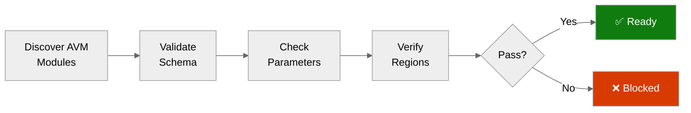

# ✅ Step 4b: Pre-Flight AVM Check - contoso-service-hub-run-2

<strong>📑 Pre-Flight Contents</strong>

- [🎯 Purpose](#-purpose)
- [✅ AVM Schema Validation Results](#-avm-schema-validation-results)
- [🔎 Parameter Type Analysis](#-parameter-type-analysis)
- [🌍 Region Limitations Identified](#-region-limitations-identified)
- [⚠️ Pitfalls Checklist](#-pitfalls-checklist)
- [🚀 Ready for Implementation](#-ready-for-implementation)

> Generated by bicep-code agent | 2026-03-17
> Status: **PASS**

| ⬅️ Previous                                            | 📑 Index            | Next ➡️                                                          |
| ------------------------------------------------------ | ------------------- | ---------------------------------------------------------------- |
| [04-implementation-plan.md](04-implementation-plan.md) | [README](README.md) | [05-implementation-reference.md](05-implementation-reference.md) |

## 🎯 Purpose

> [!IMPORTANT]
> This checkpoint validates AVM module schemas BEFORE Bicep code generation.

Prevents:

- Parameter type mismatches across AVM wrappers and child resources
- Invalid APIM networking assumptions for Standard v2
- Incorrect PostgreSQL private-access implementation
- Cloud-specific URL hardcoding in DNS and service endpoints

## ✅ AVM Schema Validation Results

| Resource                       | AVM Module Path                                             | Version       | Status |
| ------------------------------ | ----------------------------------------------------------- | ------------- | ------ |
| Log Analytics Workspace        | `br/public:avm/res/operational-insights/workspace`          | `0.15.0`      | ✅     |
| User-Assigned Managed Identity | `br/public:avm/res/managed-identity/user-assigned-identity` | plan-verified | ✅     |
| Virtual Network                | `br/public:avm/res/network/virtual-network`                 | `0.7.2`       | ✅     |
| Private DNS Zone               | `br/public:avm/res/network/private-dns-zone`                | `0.8.1`       | ✅     |
| Key Vault                      | `br/public:avm/res/key-vault/vault`                         | `0.13.3`      | ✅     |
| Storage Account                | `br/public:avm/res/storage/storage-account`                 | `0.32.0`      | ✅     |
| PostgreSQL Flexible Server     | `br/public:avm/res/db-for-postgre-sql/flexible-server`      | `0.15.2`      | ✅     |
| Azure Managed Redis            | `br/public:avm/res/cache/redis-enterprise`                  | `0.5.0`       | ✅     |
| AKS Managed Cluster            | `br/public:avm/res/container-service/managed-cluster`       | `0.13.0`      | ✅     |
| Virtual Machine                | `br/public:avm/res/compute/virtual-machine`                 | `0.21.0`      | ✅     |
| Managed Disk                   | `br/public:avm/res/compute/disk`                            | `0.6.0`       | ✅     |
| Azure Front Door Profile       | `br/public:avm/res/cdn/profile`                             | `0.19.0`      | ✅     |

## 🔎 Parameter Type Analysis

<strong>Core AVM Notes</strong>

| Area                  | Verified Shape                                                                                    | Result      |
| --------------------- | ------------------------------------------------------------------------------------------------- | ----------- |
| Log Analytics quota   | `dailyQuotaGb` uses `string`                                                                      | Implemented |
| PostgreSQL networking | `privateDnsZoneArmResourceId` and delegated subnet model                                          | Implemented |
| PostgreSQL HA         | `availabilityZone` is required in AVM params                                                      | Implemented |
| Redis capacity        | Memory-optimized SKUs require higher capacity floor than legacy enterprise defaults               | Implemented |
| VM data disks         | `managedDisk.resourceId` is required in `dataDisks` objects                                       | Implemented |
| APIM v2 networking    | Standard v2 uses `virtualNetworkConfiguration` with `virtualNetworkType = External`, not Internal | Implemented |
| Front Door origin     | Private origin wiring uses shared Private Link on the APIM resource                               | Implemented |

<strong>Governance Mapping Summary</strong>

| Policy                     | Required Setting                                                      | Result                                  |
| -------------------------- | --------------------------------------------------------------------- | --------------------------------------- |
| RG tags deny               | 9 lowercase tags                                                      | Implemented in `deploy.ps1` RG creation |
| Tag drift mitigation       | `technical-contact` and `tech-contact`                                | Implemented                             |
| Storage blob access modify | `allowBlobPublicAccess = false`                                       | Implemented                             |
| Storage shared-key modify  | `allowSharedKeyAccess = false`                                        | Implemented                             |
| PostgreSQL SSL/TLS audit   | `require_secure_transport = ON`, `ssl_min_protocol_version = TLSv1.2` | Implemented                             |
| Redis plaintext audit      | `clientProtocol = Encrypted`                                          | Implemented                             |
| AKS pool count deny        | `<= 10` agent pools                                                   | Implemented with 2 pools                |

## 🌍 Region Limitations Identified

| Resource                 | Default Region         | Limitation                                  | Action                                                   |
| ------------------------ | ---------------------- | ------------------------------------------- | -------------------------------------------------------- |
| Regional services        | `swedencentral`        | No blocker surfaced in governance discovery | Kept in `swedencentral`                                  |
| Azure Front Door Premium | `global` control plane | Global edge service by design               | Deployed as global resource with regional private origin |
| Private DNS Zones        | `global`               | Global-scoped resource type                 | Deployed globally with VNet links                        |
| APIM Standard v2         | `swedencentral`        | Internal VNet injection not supported       | Used outbound VNet integration + private endpoint        |

## ⚠️ Pitfalls Checklist

Based on [Azure Defaults Skill](../../.github/skills/azure-defaults/SKILL.md):

- [x] Log Analytics `dailyQuotaGb` uses string type
- [x] PostgreSQL uses delegated subnet networking, not a private endpoint
- [x] APIM Standard v2 avoids Internal VNet injection
- [x] Storage DNS zones use `az.environment().suffixes.storage` instead of hardcoded cloud URLs
- [x] Key Vault URI fallback uses `az.environment().suffixes.keyvaultDns`
- [x] Redis database protocol is encrypted
- [x] D-series compute is used for AKS and VM sizing in the checked-in parameter file

## 🚀 Ready for Implementation

| Check                      | Status | Notes                                                  |
| -------------------------- | ------ | ------------------------------------------------------ |
| All AVM modules verified   | ✅     | Build completed successfully                           |
| Parameter types confirmed  | ✅     | Schema mismatches corrected during validation          |
| Region limitations handled | ✅     | No unresolved regional blocker                         |
| Pitfalls addressed         | ✅     | APIM, PostgreSQL, Redis, and cloud URL issues resolved |

> [!IMPORTANT]
> **Go / No-Go Verdict**
>
> | Signal      | Status       |
> | ----------- | ------------ |
> | AVM Modules | ✅           |
> | Parameters  | ✅           |
> | Regions     | ✅           |
> | Pitfalls    | ✅           |
> | **Overall** | **✅ READY** |
>
> No blocking AVM or governance issue remained after validation. One implementation decision was aligned to the latest architecture guidance and user instruction: Azure Managed Redis was set to `MemoryOptimized_M200` for production.

---

_Pre-flight validation for contoso-service-hub-run-2 Bicep implementation_

---

| ⬅️ [04-implementation-plan.md](04-implementation-plan.md) | 🏠 [Project Index](README.md) | ➡️ [05-implementation-reference.md](05-implementation-reference.md) |
| --------------------------------------------------------- | ----------------------------- | ------------------------------------------------------------------- |

