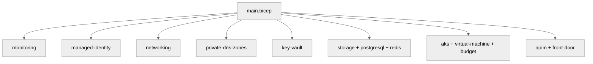

# 💻 Step 5: Implementation Reference - contoso-service-hub-run-2


<details open>
<summary><strong>📑 Implementation Reference</strong></summary>

- [📁 IaC Templates Location](#-iac-templates-location)
- [🗂️ File Structure](#-file-structure)
- [✅ Validation Status](#-validation-status)
- [🏗️ Resources Created](#-resources-created)
- [🚀 Deployment Instructions](#-deployment-instructions)
- [📝 Key Implementation Notes](#-key-implementation-notes)

</details>

> Generated by bicep-code agent | 2026-03-17

| ⬅️ Previous                                    | 📑 Index            | Next ➡️                                              |
| ---------------------------------------------- | ------------------- | ---------------------------------------------------- |
| [04-preflight-check.md](04-preflight-check.md) | [README](README.md) | [06-deployment-summary.md](06-deployment-summary.md) |

## 📁 IaC Templates Location

📁 **Code Location**: [`infra/bicep/contoso-service-hub-run-2/`](../../infra/bicep/contoso-service-hub-run-2/)

## 🗂️ File Structure

```text
infra/bicep/contoso-service-hub-run-2/
├── main.bicep
├── main.bicepparam
├── azure.yaml
├── deploy.ps1
└── modules/
    ├── aks.bicep
    ├── apim.bicep
    ├── budget.bicep
    ├── front-door.bicep
    ├── key-vault.bicep
    ├── managed-identity.bicep
    ├── monitoring.bicep
    ├── networking.bicep
    ├── postgresql.bicep
    ├── private-dns-zones.bicep
    ├── redis.bicep
    ├── storage-blob.bicep
    ├── storage-files.bicep
    └── virtual-machine.bicep
```

## ✅ Validation Status

| Check         | Result | Details                                                                                    |
| ------------- | ------ | ------------------------------------------------------------------------------------------ |
| `bicep build` | ✅     | `az bicep build --file main.bicep` completed successfully                                  |
| `bicep lint`  | ✅     | `az bicep lint --file main.bicep` completed successfully                                   |
| `what-if`     | ⚠️     | Not run automatically because deployment inputs and subscription context were not provided |

Legend: ✅ pass, ⚠️ not executed in this coding run, ❌ failed

## 🏗️ Resources Created

| Resource                                      | Bicep Type                                         | Module                    |
| --------------------------------------------- | -------------------------------------------------- | ------------------------- |
| Log Analytics Workspace                       | `Microsoft.OperationalInsights/workspaces`         | `monitoring.bicep`        |
| Application Insights                          | `Microsoft.Insights/components`                    | `monitoring.bicep`        |
| Action Group                                  | `Microsoft.Insights/actionGroups`                  | `monitoring.bicep`        |
| User-Assigned Managed Identity                | `Microsoft.ManagedIdentity/userAssignedIdentities` | `managed-identity.bicep`  |
| Virtual Network and 6 subnets                 | `Microsoft.Network/virtualNetworks`                | `networking.bicep`        |
| 6 Network Security Groups                     | `Microsoft.Network/networkSecurityGroups`          | `networking.bicep`        |
| 5 Private DNS Zones                           | `Microsoft.Network/privateDnsZones`                | `private-dns-zones.bicep` |
| Key Vault + private endpoint                  | `Microsoft.KeyVault/vaults`                        | `key-vault.bicep`         |
| Blob Storage + private endpoint               | `Microsoft.Storage/storageAccounts`                | `storage-blob.bicep`      |
| Azure Files + private endpoint                | `Microsoft.Storage/storageAccounts`                | `storage-files.bicep`     |
| PostgreSQL Flexible Server                    | `Microsoft.DBforPostgreSQL/flexibleServers`        | `postgresql.bicep`        |
| Azure Managed Redis + private endpoint        | `Microsoft.Cache/redisEnterprise`                  | `redis.bicep`             |
| AKS Managed Cluster                           | `Microsoft.ContainerService/managedClusters`       | `aks.bicep`               |
| Linux VM + managed disk                       | `Microsoft.Compute/virtualMachines`                | `virtual-machine.bicep`   |
| API Management Standard v2 + private endpoint | `Microsoft.ApiManagement/service`                  | `apim.bicep`              |
| Azure Front Door Premium + WAF                | `Microsoft.Cdn/profiles`                           | `front-door.bicep`        |
| Budget with forecast alerts                   | `Microsoft.Consumption/budgets`                    | `budget.bicep`            |



## 🚀 Deployment Instructions

<details>
<summary><strong>🟢 Quick Deploy (PowerShell)</strong></summary>

```powershell
cd infra/bicep/contoso-service-hub-run-2
./deploy.ps1 -ResourceGroup rg-contoso-service-hub-prod -Environment prod -ProjectName contoso-service-hub -Owner contoso-platform -CostCenter CSH-001 -WorkloadName service-hub -SlaTier 99.9 -BackupPolicy daily-30d -MaintenanceWindow sun-02-06-utc -TechnicalContact platform@contoso.example -ManagementVmAdminPublicKey '<ssh-public-key>' -PostgresqlAdministratorCredential (Get-Credential -UserName 'psqladmin' -Message 'Enter PostgreSQL admin password')
```

</details>

<details>
<summary><strong>🔍 Preview Changes (What-If)</strong></summary>

```powershell
./deploy.ps1 -ResourceGroup rg-contoso-service-hub-prod -Environment prod -ProjectName contoso-service-hub -Owner contoso-platform -CostCenter CSH-001 -WorkloadName service-hub -SlaTier 99.9 -BackupPolicy daily-30d -MaintenanceWindow sun-02-06-utc -TechnicalContact platform@contoso.example -ManagementVmAdminPublicKey '<ssh-public-key>' -PostgresqlAdministratorCredential (Get-Credential -UserName 'psqladmin' -Message 'Enter PostgreSQL admin password') -WhatIf
```

</details>

<details>
<summary><strong>⚙️ Custom Parameters</strong></summary>

```powershell
./deploy.ps1 -ResourceGroup rg-contoso-service-hub-staging -Environment staging -Phase data -ProjectName contoso-service-hub -Owner contoso-platform -CostCenter CSH-001 -WorkloadName service-hub -SlaTier 99.5 -BackupPolicy daily-30d -MaintenanceWindow sun-02-06-utc -TechnicalContact platform@contoso.example -ManagementVmAdminPublicKey '<ssh-public-key>' -PostgresqlAdministratorCredential (Get-Credential -UserName 'psqladmin' -Message 'Enter PostgreSQL admin password')
```

</details>

<details>
<summary><strong>🚀 Azure CLI</strong></summary>

```bash
az deployment group create \
  --resource-group rg-contoso-service-hub-prod \
  --template-file main.bicep \
  --parameters main.bicepparam \
  --parameters environment=prod phase=all projectName=contoso-service-hub owner=contoso-platform costCenter=CSH-001 workloadName=service-hub slaTier=99.9 backupPolicy=daily-30d maintenanceWindow=sun-02-06-utc technicalContact=platform@contoso.example managementVmAdminPublicKey='<ssh-public-key>' postgresqlAdministratorPassword='<password>'
```

</details>

## 📝 Key Implementation Notes

| Note                                                                                                                                | Impact                                                 | Reference                  |
| ----------------------------------------------------------------------------------------------------------------------------------- | ------------------------------------------------------ | -------------------------- |
| Unique suffix is generated once in `main.bicep` and reused across all globally unique resource names                                | Deterministic re-entry across phases                   | `main.bicep`               |
| Resource-group tagging is enforced in `deploy.ps1` with all 11 required tags, including both `technical-contact` and `tech-contact` | Avoids governance deny and tenant tag drift            | `deploy.ps1`               |
| APIM Standard v2 uses `virtualNetworkType = External` and a separate private endpoint instead of Internal injection                 | Matches the approved networking model                  | `modules/apim.bicep`       |
| PostgreSQL uses a delegated subnet plus private DNS, not a private endpoint                                                         | Matches Flexible Server private access guidance        | `modules/postgresql.bicep` |
| Redis production SKU is set to `MemoryOptimized_M200` in the checked-in parameter file                                              | Aligns with architecture headroom and user instruction | `main.bicepparam`          |
| Budget alerts are configured at 80%, 100%, and 120% forecast thresholds plus 100% actual                                            | Satisfies mandatory cost monitoring baseline           | `modules/budget.bicep`     |

```bicep
var uniqueSuffix = uniqueString(resourceGroup().id)
```

This implementation is phase-aware with six deployment phases: `foundation`, `networking`, `security`, `data`, `compute`, and `edge`.

---

_Implementation reference generated from Bicep templates._

---

<div align="center">

| ⬅️ [04-preflight-check.md](04-preflight-check.md) | 🏠 [Project Index](README.md) | ➡️ [06-deployment-summary.md](06-deployment-summary.md) |
| ------------------------------------------------- | ----------------------------- | ------------------------------------------------------- |

</div>
