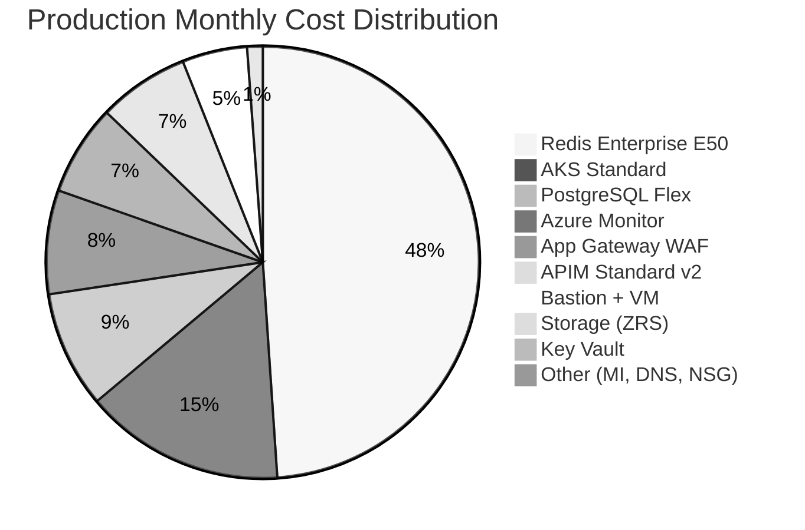

# 💰 Contoso Service Hub - As-Built Cost Estimate

> Generated by 08-As-Built agent | 2026-04-02

| ⬅️ Previous | 📑 Index | Next ➡️ |
|---|---|---|
| [07-compliance-matrix.md](07-compliance-matrix.md) | [README](README.md) | — |

**Region**: swedencentral
**Pricing Source**: Azure retail pricing, derived from Step 3 cost estimate and validated Bicep SKUs
**Environments**: Development, Staging, Production

---

## 💵 Cost At-a-Glance

> **Monthly Total: ~$9,500** (all environments) | Annual: ~$114,000
>
> | Environment | Monthly | Annual |
> | --- | --- | --- |
> | Development | ~$1,400 | ~$16,800 |
> | Staging | ~$2,500 | ~$30,000 |
> | Production | ~$5,600 | ~$67,200 |
> | **Total** | **~$9,500** | **~$114,000** |

---

## ✅ Decision Summary

- ✅ **Confirmed**: Redis Enterprise E50 (128 GB, $2,520/mo prod) — 34% cheaper than Premium P4
- ✅ **Confirmed**: AKS Standard (3× D8s_v5, $770/mo prod) — RFQ mandates managed Kubernetes
- ✅ **Confirmed**: Application Gateway WAF v2 replaces Front Door (EU Data Boundary compliance)
- ✅ **Confirmed**: PostgreSQL GP D4ds_v5 ($450/mo prod) with zone-redundant HA
- ✅ **Confirmed**: ZRS storage (GDPR — no cross-region replication)
- ⏳ **Deferred**: Multi-region DR (+$3,000–5,000/mo), DDoS Protection Standard ($2,944/mo)
- 💰 **Savings available**: ~$4,380/year with 1-year reserved instances on AKS nodes and PostgreSQL

**Budget utilization**: 63–79% of estimated $12,000–15,000/month budget

---

## 🔁 Requirements → Cost Mapping

| Requirement | Architecture Decision | Monthly Cost (prod) |
| --- | --- | --- |
| 99.9% SLA | Zone-redundant AKS, PostgreSQL HA, Redis | +$800 (HA SKUs) |
| GDPR EU data residency | ZRS storage, swedencentral region | +$10 (ZRS vs LRS) |
| 128 GB in-memory cache | Redis Enterprise E50 | $2,520 |
| Managed Kubernetes | AKS Standard (3× D8s_v5) | $770 |
| <2s page load | App Gateway WAF v2 (regional) | $350 |
| 5M API requests/month | APIM Standard v2 | $350 |
| PostgreSQL database | GP D4ds_v5, 256 GB, HA | $450 |
| Observability | Log Analytics + App Insights (×3) | $400 |
| Bastion + VM | Management access | $250 |

---

## 📊 Top 5 Cost Drivers

| Rank | Resource | Monthly (prod) | % Total | Optimization |
| --- | --- | --- | --- | --- |
| 1 | Redis Enterprise E50 | $2,520 | 45% | Evaluate if 128 GB fully utilized; E20 if <32 GB |
| 2 | AKS (3× D8s_v5) | $770 | 14% | 1-year RI saves ~$230/mo |
| 3 | PostgreSQL (D4ds_v5) | $450 | 8% | 1-year RI saves ~$135/mo |
| 4 | Azure Monitor suite | $400 | 7% | Data sampling to reduce ingestion |
| 5 | App Gateway WAF v2 | $350 | 6% | Fixed cost (capacity units scale) |

---

## 🏛️ Architecture Overview

---

## 🧾 What We Are Not Paying For (Yet)

| Service | Monthly Cost | Trigger |
| --- | --- | --- |
| Multi-region DR (failover region) | $3,000–5,000 | Release 2.0 roadmap |
| DDoS Protection Standard | $2,944 | If DDoS attacks increase |
| Microsoft Defender for Cloud | $300–500 | Pre-production enablement |
| Microsoft Sentinel (SIEM) | $500–1,000 | SOC 2 compliance requirement |
| CMK encryption (Key Vault HSM) | $1,500+ | Regulatory demand |
| Entra External ID P2 | $150 | >50K MAU or advanced features |

---

## ⚠️ Cost Risk Indicators

| Risk | Probability | Impact | Mitigation |
| --- | --- | --- | --- |
| Redis 128 GB underutilized | Medium | $1,200/mo overspend | Monitor usage; downgrade to E20 if <32 GB |
| AKS autoscale to 10 nodes | Low | +$1,800/mo | Set budget alerts; review autoscale thresholds |
| Log Analytics data explosion | Medium | +$200–500/mo | Configure data sampling and daily cap |
| PostgreSQL scale-up needed | Medium | +$300/mo | Triggered if transactions >500K before Q4 2026 |
| Front Door legal exception | Low | +$400/mo | If EU Data Boundary waiver approved → add Front Door |

---

## 🎯 Quick Decision Matrix

| Question | Answer |
| --- | --- |
| Within budget? | ✅ Yes (63–79% of $12K–15K target) |
| Biggest savings opportunity? | 1-year RI on AKS + PostgreSQL (~$4,380/year) |
| Biggest cost risk? | Redis E50 underutilization and AKS autoscale |
| When to reassess? | Q4 2026 (Release 1.1) or if Redis usage <50% |

---

## 💰 Savings Opportunities

| # | Opportunity | Annual Savings | Effort | Risk |
| --- | --- | --- | --- | --- |
| 1 | AKS 1-year reserved instances (3 nodes) | ~$2,760 | Low | Low (stable workload) |
| 2 | PostgreSQL 1-year reserved instance | ~$1,620 | Low | Low (known capacity) |
| 3 | Redis E20 if <32 GB utilized | ~$14,400 | Medium | Medium (capacity analysis required) |
| 4 | Log Analytics daily cap + sampling | ~$1,200 | Low | Low |
| 5 | Dev/staging shutdown schedules | ~$6,000 | Medium | Low |
| **Total potential** | | **~$25,980/year** | | |

---

## 🧾 Detailed Cost Breakdown

### Production Environment (~$5,600/mo)

| Resource | SKU | Monthly Cost |
| --- | --- | --- |
| Redis Enterprise | E50 (128 GB) | $2,520 |
| AKS Cluster | Standard, 3× D8s_v5 | $770 |
| PostgreSQL | GP D4ds_v5, 256 GB, HA | $450 |
| Log Analytics + App Insights | PerGB2018, 365-day retention | $400 |
| App Gateway WAF v2 | Standard_v2, 2 CU | $350 |
| API Management | Standard v2 | $350 |
| Bastion | Standard | $170 |
| Management VM | D2s_v5 | $80 |
| Storage Account | StorageV2, ZRS, 200 GB | $60 |
| Key Vault | Standard | $30 |
| Managed Identity, DNS, NSGs | — | $20 |
| **Subtotal** | | **~$5,200** |
| Overhead (network, diagnostics) | ~8% | ~$400 |
| **Total** | | **~$5,600** |

### Staging Environment (~$2,500/mo)

| Resource | SKU | Monthly Cost |
| --- | --- | --- |
| Redis Enterprise | E10 | $640 |
| AKS Cluster | 2× D4s_v5 | $350 |
| PostgreSQL | D2ds_v5, 128 GB | $250 |
| App Gateway WAF v2 | Standard_v2 | $350 |
| APIM | Standard v2 | $350 |
| Monitoring | PerGB2018, 180-day | $200 |
| Other (Bastion, VM, Storage, KV) | Reduced SKUs | $200 |
| **Total** | | **~$2,500** (60% of prod) |

### Development Environment (~$1,400/mo)

| Resource | SKU | Monthly Cost |
| --- | --- | --- |
| Redis Enterprise | E10 | $640 |
| AKS Cluster | 1× D2s_v5 | $80 |
| PostgreSQL | B2s, 32 GB | $60 |
| App Gateway WAF v2 | Standard_v2 | $350 |
| APIM | Standard v2 | $100 |
| Other (Monitoring, Bastion, Storage, KV) | Minimal SKUs | $170 |
| **Total** | | **~$1,400** (40% of prod) |

---

## References

- [03-des-cost-estimate.md](03-des-cost-estimate.md)
- [06-deployment-summary.md](06-deployment-summary.md)
- [Azure Pricing Calculator](https://azure.microsoft.com/pricing/calculator/)
- [Azure Reserved Instances](https://learn.microsoft.com/azure/cost-management-billing/reservations/save-compute-costs-reservations)
