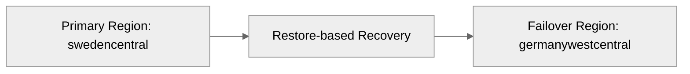

# 🛡️ Backup and Disaster Recovery Plan: Contoso Service Hub


<details open>
<summary><strong>📑 DR Plan Contents</strong></summary>

- [📋 Executive Summary](#-executive-summary)
- [🎯 1. Recovery Objectives](#-1-recovery-objectives)
- [💾 2. Backup Strategy](#-2-backup-strategy)
- [🌍 3. Disaster Recovery Procedures](#-3-disaster-recovery-procedures)
- [🧪 4. Testing Schedule](#-4-testing-schedule)
- [📢 5. Communication Plan](#-5-communication-plan)
- [👥 6. Roles and Responsibilities](#-6-roles-and-responsibilities)
- [🔗 7. Dependencies](#-7-dependencies)
- [📖 8. Recovery Runbooks](#-8-recovery-runbooks)
- [📎 9. Appendix](#-9-appendix)
- [References](#references)

</details>

> Generated by 08-As-Built agent | 2026-03-17

<div align="center">

| ⬅️ Previous                                          | 📑 Index            | Next ➡️                                            |
| ---------------------------------------------------- | ------------------- | -------------------------------------------------- |
| [07-resource-inventory.md](07-resource-inventory.md) | [README](README.md) | [07-compliance-matrix.md](07-compliance-matrix.md) |

</div>

**Generated**: 2026-03-17
**Version**: 1.0
**Environment**: Production baseline
**Primary Region**: swedencentral
**Secondary Region**: germanywestcentral

---

## 📋 Executive Summary

This document defines the backup and disaster recovery posture for the validated Contoso Service Hub design. The design is intentionally single-region for initial scope, so continuity depends on service-native backups, zone redundancy within `swedencentral`, and manual restore-based recovery to `germanywestcentral` if a regional loss occurs.

| Metric           | Current                         | Target  |
| ---------------- | ------------------------------- | ------- |
| **RPO**          | 1 hour for critical data        | 1 hour  |
| **RTO**          | 4 hours for critical services   | 4 hours |
| **Availability** | 99.9% planned service objective | 99.9%   |

---

## 🎯 1. Recovery Objectives

### 1.1 Recovery Time Objective (RTO)

| Tier         | RTO Target | Services                                                      |
| ------------ | ---------- | ------------------------------------------------------------- |
| 🔴 Critical  | 4 hours    | Front Door, APIM, AKS, PostgreSQL, Redis, Key Vault           |
| 🟠 Important | 8 hours    | Blob, Files, VM-backed support workloads, observability stack |
| 🟢 Standard  | 24 hours   | Dashboards, lower-environment support services                |

### 1.2 Recovery Point Objective (RPO)

| Data Type                | RPO Target              | Backup Strategy                                     |
| ------------------------ | ----------------------- | --------------------------------------------------- |
| Transactional data       | 1 hour                  | PostgreSQL PITR and HA                              |
| Blob content             | 24 hours                | Service protections and restore procedures          |
| File share data          | 24 hours                | Azure Files backup/snapshot policy after deployment |
| Secrets and certificates | Near-zero metadata loss | Key Vault soft delete and purge protection          |
| VM-backed workload data  | 24 hours                | Managed disk snapshots / Azure Backup policy        |



---

## 💾 2. Backup Strategy

| Workload                   | Validated Backup Strategy                                                                 |
| -------------------------- | ----------------------------------------------------------------------------------------- |
| PostgreSQL Flexible Server | PITR enabled, production HA, restore to new server in-region or alternate EU region       |
| Azure Blob Storage         | Soft delete and versioning to be enabled during deployment hardening; private access only |
| Azure Files                | Premium share backups or snapshots to be scheduled after deployment                       |
| VM and managed disk        | Azure Backup or managed snapshot policy during production rollout                         |
| Key Vault                  | Soft delete and purge protection, with access governed via RBAC                           |

<details>
<summary><strong>💾 Azure SQL Database</strong></summary>

This workload does not use Azure SQL Database. PostgreSQL Flexible Server is the validated relational data platform.

</details>

<details>
<summary><strong>🔐 Azure Key Vault</strong></summary>

| Setting          | Configuration |
| ---------------- | ------------- |
| Soft Delete      | Enabled       |
| Purge Protection | Enabled       |

</details>

---

## 🌍 3. Disaster Recovery Procedures

<details>
<summary><strong>🌍 Region Failover</strong></summary>

### 3.1 Failover Procedure

1. Declare a regional incident and confirm `swedencentral` is unavailable or materially impaired.
2. Freeze production changes and preserve incident evidence from Azure Monitor and service health feeds.
3. Recreate the resource group and validated Bicep stack in `germanywestcentral` using the approved parameter set.
4. Restore PostgreSQL from the latest valid restore point and recover storage content from protected copies.
5. Repoint Front Door origins only after application, data, and identity dependencies are ready.

</details>

<details>
<summary><strong>↩️ Failback Procedure</strong></summary>

### 3.2 Failback Procedure

1. Rebuild primary-region infrastructure from the same Bicep source once `swedencentral` is stable.
2. Validate data integrity and replay required changes from the temporary recovery environment.
3. Shift gateway routing back to the primary region during an approved maintenance window.
4. Conduct a post-incident review and update runbooks, controls, and budget assumptions.

</details>

---

## 🧪 4. Testing Schedule

| Test Type                   | Frequency         | Last Test        | Next Test                      |
| --------------------------- | ----------------- | ---------------- | ------------------------------ |
| Bicep build/lint validation | Every code change | 2026-03-17       | On next template change        |
| Restore procedure tabletop  | Quarterly         | Not yet executed | Before production go-live      |
| PostgreSQL restore drill    | Semi-annual       | Not yet executed | First quarter after deployment |
| Regional recovery rehearsal | Annual            | Not yet executed | After production stabilization |

---

## 📢 5. Communication Plan

| Audience                | Channel                        | Template                                            |
| ----------------------- | ------------------------------ | --------------------------------------------------- |
| Platform engineering    | Teams / email                  | Incident declaration + technical action log         |
| Security and compliance | Email / escalation bridge      | Compliance impact summary                           |
| Product stakeholders    | Status page / executive update | Business impact and ETA summary                     |
| Tenant operations       | Direct coordination            | Recovery steps that affect customer-facing services |

---

## 👥 6. Roles and Responsibilities

| Role                | Team                            | Responsibility                                     |
| ------------------- | ------------------------------- | -------------------------------------------------- |
| Incident commander  | Platform engineering            | Coordinates recovery decisions and execution       |
| Data recovery lead  | Data platform team              | Validates PostgreSQL and storage recovery          |
| Security approver   | Security and compliance         | Approves exception handling and evidence retention |
| Communications lead | Product / operations leadership | Publishes business-facing updates                  |

---

## 🔗 7. Dependencies

| Dependency                                                | Impact                                                              | Mitigation                                              |
| --------------------------------------------------------- | ------------------------------------------------------------------- | ------------------------------------------------------- |
| DR-08 legal approval for Front Door and Entra External ID | Blocks production rollout and therefore any real recovery rehearsal | Obtain written approval before go-live                  |
| Subscription quotas in alternate region                   | Can delay emergency rebuild                                         | Pre-check quotas in `germanywestcentral`                |
| Entra tenant readiness                                    | Blocks authentication in recovery environment                       | Pre-document tenant and app registration recovery steps |
| Governance tag values                                     | Resource group creation denied without them                         | Preserve approved tag set in deployment automation      |

---

## 📖 8. Recovery Runbooks

| Scenario                   | Runbook                                                        | Owner                |
| -------------------------- | -------------------------------------------------------------- | -------------------- |
| PostgreSQL logical failure | Restore to timestamp, redirect workloads, validate consistency | Data platform lead   |
| AKS service outage         | Reconcile node health, restart workloads, scale if needed      | Platform engineering |
| Regional outage            | Rebuild in failover region from Bicep and restore data         | Incident commander   |

<details>
<summary><strong>📖 Runbook: PostgreSQL Restore</strong></summary>

**Trigger**: Data corruption, accidental deletion, or primary server failure
**Estimated Duration**: 1 to 4 hours depending on data volume and validation

1. Create a restore target from the latest acceptable point in time.
2. Apply network, identity, and configuration parity with the validated design.
3. Update application connection routing only after integrity checks pass.

**Validation**:

```bash
az postgres flexible-server show --resource-group rg-contoso-service-hub-prod --name <restored-server-name>
```

</details>

---

## 📎 9. Appendix

<details>
<summary>📋 Detailed Recovery Procedures</summary>

The single-region design means disaster recovery is procedural rather than active-active. The most important operational requirement before production is to convert these recovery patterns into rehearsed runbooks with tested credentials, quotas, and restore timings.

</details>

---

## References

| Topic                         | Link                                                                                                    |
| ----------------------------- | ------------------------------------------------------------------------------------------------------- |
| Azure Backup Overview         | [Backup Overview](https://learn.microsoft.com/azure/backup/backup-overview)                             |
| Reliability Metrics           | [RTO and RPO](https://learn.microsoft.com/azure/well-architected/reliability/metrics)                   |
| Disaster Recovery Guidance    | [DR Planning](https://learn.microsoft.com/azure/well-architected/reliability/disaster-recovery)         |
| PostgreSQL Backup and Restore | [Flexible Server](https://learn.microsoft.com/azure/postgresql/flexible-server/concepts-backup-restore) |

---

_Backup and DR plan generated from validated infrastructure artifacts._

---

<div align="center">

| ⬅️ [07-resource-inventory.md](07-resource-inventory.md) | 🏠 [Project Index](README.md) | ➡️ [07-compliance-matrix.md](07-compliance-matrix.md) |
| ------------------------------------------------------- | ----------------------------- | ----------------------------------------------------- |

</div>
