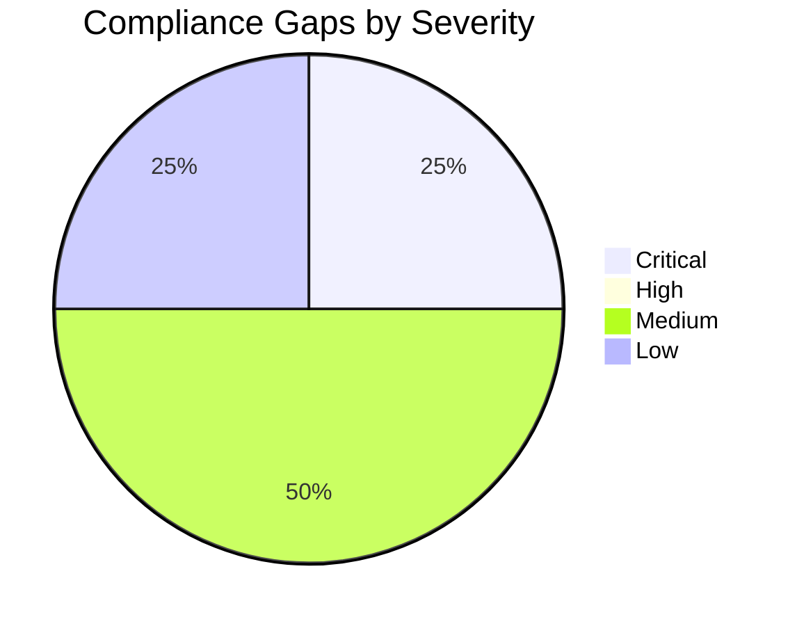

# ⚖️ Compliance Matrix: Contoso Service Hub

<strong>📑 Compliance Contents</strong>

- [📋 Executive Summary](#-executive-summary)
- [🗺️ 1. Control Mapping](#%EF%B8%8F-1-control-mapping)
- [🔍 2. Gap Analysis](#-2-gap-analysis)
- [📁 3. Evidence Collection](#-3-evidence-collection)
- [📝 4. Audit Trail](#-4-audit-trail)
- [🔧 5. Remediation Tracker](#-5-remediation-tracker)
- [📎 6. Appendix](#-6-appendix)
- [References](#references)

> Generated by 08-As-Built agent | 2026-03-17

| ⬅️ Previous                                  | 📑 Index            | Next ➡️                                          |
| -------------------------------------------- | ------------------- | ------------------------------------------------ |
| [07-backup-dr-plan.md](07-backup-dr-plan.md) | [README](README.md) | [07-ab-cost-estimate.md](07-ab-cost-estimate.md) |

**Generated**: 2026-03-17
**Version**: 1.0
**Environment**: Production validated baseline
**Primary Compliance Framework**: GDPR with Azure Policy and Microsoft Cloud Security Benchmark alignment

---

## 📋 Executive Summary

This matrix maps the validated Contoso Service Hub design to GDPR, Azure Policy, and core Microsoft security baseline expectations. The design is strong on regional resource placement, network isolation, and governance controls, but it still has one explicit deployment blocker tied to global-service legal approval.

| Compliance Area             | Coverage               | Status |
| --------------------------- | ---------------------- | ------ |
| Network Security            | 90%                    | ✅     |
| Data Protection             | 85%                    | ✅     |
| Access Control              | 85%                    | ✅     |
| Monitoring & Audit          | 80%                    | ✅     |
| Incident Response           | 70%                    | ⚠️     |
| Production release approval | Pending DR-08 sign-off | ❌     |
| Overall                     | 82%                    | ⚠️     |

---

## 🗺️ 1. Control Mapping

### Requirement 1: GDPR Data Residency and Protection

| Control        | Requirement                                                                                     | Implementation                                                                       | Status |
| -------------- | ----------------------------------------------------------------------------------------------- | ------------------------------------------------------------------------------------ | ------ |
| DR-01 to DR-07 | EU-only regional services for customer, log, backup, metadata, analytics, cache, and index data | Regional services pinned to `swedencentral`; alternate recovery region remains in EU | ✅     |
| DR-08          | Legal safeguards for non-regional/global support or control-plane flows                         | Front Door and Entra External ID require Contoso written approval before deployment  | ⚠️     |
| Article 25     | Data protection by design                                                                       | Private data plane, managed identity, Key Vault, WAF, and secure transport posture   | ✅     |

<strong>📎 Evidence</strong>

**Evidence Location**: [01-requirements.md](./01-requirements.md), [02-architecture-assessment.md](./02-architecture-assessment.md)

| Evidence Item                         | Type                  | Date Collected |
| ------------------------------------- | --------------------- | -------------- |
| GDPR clause table DR-01 through DR-08 | Requirements artifact | 2026-03-16     |
| EU Data Boundary blocker resolution   | Architecture artifact | 2026-03-17     |

### Requirement 2: Governance and Azure Policy Compliance

| Control              | Requirement                                    | Implementation                                          | Status |
| -------------------- | ---------------------------------------------- | ------------------------------------------------------- | ------ |
| RG tags              | 9 mandatory lowercase RG tags                  | Bicep and deployment flow require all tenant tag values | ✅     |
| Tag drift mitigation | `technical-contact` vs `tech-contact` mismatch | Both tags set in validated tag object                   | ✅     |
| Storage hardening    | Disable blob public access and shared key auth | Explicitly configured in storage modules                | ✅     |
| AKS policy bound     | Fewer than 10 agent pools                      | Validated cluster uses 2 pools                          | ✅     |

<strong>📎 Evidence</strong>

**Evidence Location**: [04-governance-constraints.md](./04-governance-constraints.md), [06-deployment-summary.md](./06-deployment-summary.md)

| Evidence Item                              | Type                | Date Collected |
| ------------------------------------------ | ------------------- | -------------- |
| Live policy discovery results              | Governance artifact | 2026-03-17     |
| Security and governance validation summary | Deployment summary  | 2026-03-17     |

### Requirement 3: Security Baseline Controls

| Control              | Requirement                                         | Implementation                                                      | Status |
| -------------------- | --------------------------------------------------- | ------------------------------------------------------------------- | ------ |
| TLS 1.2 minimum      | Secure transport on platform services               | Explicit configuration and validation on PostgreSQL, storage, Redis | ✅     |
| Secrets hygiene      | No hardcoded secrets, centralized secret management | Key Vault + Managed Identity                                        | ✅     |
| Data-plane isolation | No public exposure for data services                | Private Endpoints and delegated subnet                              | ✅     |
| Edge protection      | WAF for public entry                                | Front Door Premium + WAF policy                                     | ✅     |

<strong>📎 Evidence</strong>

**Evidence Location**: [05-implementation-reference.md](./05-implementation-reference.md), [06-deployment-summary.md](./06-deployment-summary.md)

| Evidence Item               | Type               | Date Collected |
| --------------------------- | ------------------ | -------------- |
| Implementation notes        | Bicep reference    | 2026-03-17     |
| Dry-run validation findings | Deployment summary | 2026-03-17     |

---

## 🔍 2. Gap Analysis

| Gap                                                                           | Severity | Risk Level | Remediation                                                        | Timeline                                |
| ----------------------------------------------------------------------------- | -------- | ---------- | ------------------------------------------------------------------ | --------------------------------------- |
| Front Door and Entra External ID require legal approval under DR-08           | 🔴       | High       | Obtain Contoso written approval or redesign edge/identity approach | Before production deployment            |
| Incident and DR procedures are documented but not yet tested in a live estate | 🟡       | Medium     | Run tabletop and restore drills after first deployment             | Before go-live and quarterly thereafter |
| Entra External ID and GitHub Actions are external to Bicep evidence chain     | 🟡       | Medium     | Add operational evidence and provisioning records outside IaC      | Before audit readiness review           |
| `what-if` preview was skipped in E2E mode                                     | 🟢       | Low        | Run subscription-scoped what-if in a credentialed environment      | Before first production change          |

---

## 📁 3. Evidence Collection

<strong>📁 Evidence Items</strong>

| Control                | Evidence Type     | Location                                                                                                         | Last Collected |
| ---------------------- | ----------------- | ---------------------------------------------------------------------------------------------------------------- | -------------- |
| GDPR requirements      | Markdown artifact | [01-requirements.md](./01-requirements.md)                                                                       | 2026-03-16     |
| Architecture approvals | Markdown artifact | [02-architecture-assessment.md](./02-architecture-assessment.md)                                                 | 2026-03-17     |
| Governance constraints | Markdown + JSON   | [04-governance-constraints.md](./04-governance-constraints.md)                                                   | 2026-03-17     |
| Template validation    | Markdown artifact | [06-deployment-summary.md](./06-deployment-summary.md)                                                           | 2026-03-17     |
| Bicep implementation   | Code reference    | [../../infra/bicep/contoso-service-hub-run-2/main.bicep](../../infra/bicep/contoso-service-hub-run-2/main.bicep) | 2026-03-17     |

---

## 📝 4. Audit Trail

| Date       | Auditor                 | Finding                                          | Status                              | Commit |
| ---------- | ----------------------- | ------------------------------------------------ | ----------------------------------- | ------ |
| 2026-03-17 | Governance agent        | 9-tag RG policy and tag drift identified         | Closed in design and code           | N/A    |
| 2026-03-17 | Architecture challenger | EU Data Boundary claim overstated for Front Door | Open as legal approval gate         | N/A    |
| 2026-03-17 | Bicep review            | 6 must-fix issues in initial code iteration      | Closed before validation completion | N/A    |

---

## 🔧 5. Remediation Tracker

| Finding                                                   | Owner                             | Due Date                      | Status         |
| --------------------------------------------------------- | --------------------------------- | ----------------------------- | -------------- |
| DR-08 legal approval for Front Door and Entra External ID | Contoso security and legal        | Before production deployment  | 🔄 In Progress |
| Credentialed `what-if` execution                          | Platform engineering              | Before production deployment  | ⬜ Todo        |
| DR tabletop and restore test                              | Platform engineering              | First production milestone    | ⬜ Todo        |
| External identity evidence collection                     | Platform engineering and security | Before audit readiness review | ⬜ Todo        |

---

## 📎 6. Appendix

### A. Compliance Framework Reference

The project is governed primarily by GDPR obligations defined in the RFQ, reinforced by Azure Policy controls discovered live in the target tenant and by Microsoft security baseline guidance for Azure services.

### B. Azure Security Baseline Mapping

| Baseline Theme | Project Position                                        |
| -------------- | ------------------------------------------------------- |
| Identity       | Managed Identity and Entra-based auth adopted           |
| Network        | Private data plane and edge WAF adopted                 |
| Data           | Encryption in transit and at rest adopted               |
| Logging        | Log Analytics and Application Insights adopted          |
| Governance     | Policy-driven tag and secure-config enforcement adopted |

---

## References

| Topic                              | Link                                                                      |
| ---------------------------------- | ------------------------------------------------------------------------- |
| Microsoft Cloud Security Benchmark | [Overview](https://learn.microsoft.com/security/benchmark/azure/overview) |
| Azure Compliance                   | [Offerings](https://learn.microsoft.com/azure/compliance/)                |
| Azure Policy                       | [Overview](https://learn.microsoft.com/azure/governance/policy/overview)  |
| EU Data Boundary                   | [Learn](https://learn.microsoft.com/privacy/eudb/eu-data-boundary-learn)  |

---

_Compliance matrix generated from validated infrastructure artifacts._

---

| ⬅️ [07-backup-dr-plan.md](07-backup-dr-plan.md) | 🏠 [Project Index](README.md) | ➡️ [07-ab-cost-estimate.md](07-ab-cost-estimate.md) |
| ----------------------------------------------- | ----------------------------- | --------------------------------------------------- |

