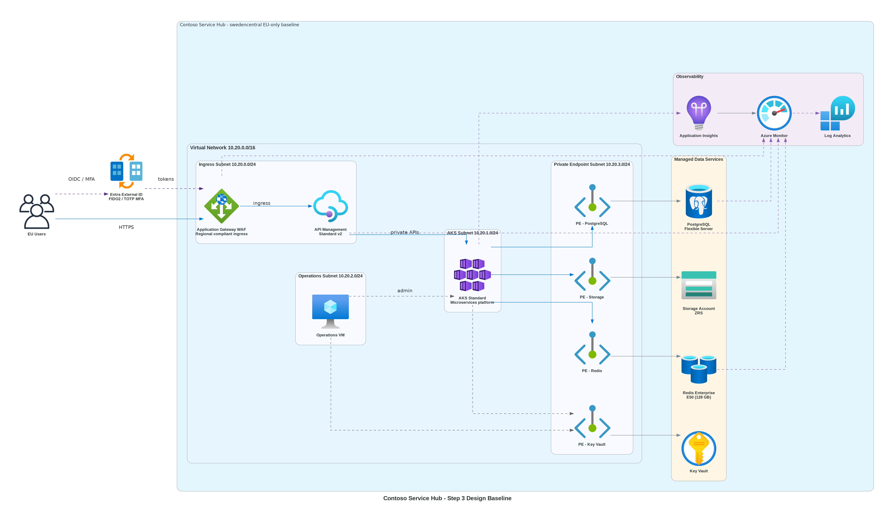

# 📐 Azure Design Document: Contoso Service Hub

<strong>📑 Design Contents</strong>

- [📝 1. Introduction](#-1-introduction)
- [🏛️ 2. Azure Architecture Overview](#-2-azure-architecture-overview)
- [🌐 3. Networking](#-3-networking)
- [💾 4. Storage](#-4-storage)
- [💻 5. Compute](#-5-compute)
- [👤 6. Identity & Access](#-6-identity--access)
- [🔐 7. Security & Compliance](#-7-security--compliance)
- [🔄 8. Backup & Disaster Recovery](#-8-backup--disaster-recovery)
- [📊 9. Management & Monitoring](#-9-management--monitoring)
- [📎 10. Appendix](#-10-appendix)
- [References](#references)

> Generated by 08-As-Built agent | 2026-04-02

| ⬅️ Previous | 📑 Index | Next ➡️ |
| --- | --- | --- |
| [07-documentation-index.md](07-documentation-index.md) | [README](README.md) | [07-operations-runbook.md](07-operations-runbook.md) |

**Version**: 1.0
**Date**: 2026-04-02
**Author**: Generated from validated workflow artifacts and Bicep modules
**Status**: Validated design, not live as-built telemetry

---

## 📝 1. Introduction

### 1.1 Document Purpose

This document captures the validated Step 7 design for Contoso Service Hub. Because the E2E run
completed as a dry-run, the document describes the infrastructure design proven by Bicep build,
lint, implementation planning, and deployment validation rather than a live Azure estate.

**Intended Audience:**

- Solution architecture and platform engineering teams
- Security, risk, and compliance reviewers
- Operations and SRE teams preparing production cutover
- Application teams integrating to the platform

### 1.2 Project Overview

Contoso Service Hub is a unified EU digital platform for bookings, payments, customer engagement,
content delivery, and partner integrations. The validated design uses AKS as the primary runtime,
Application Gateway WAF v2 as the compliant regional ingress, PostgreSQL Flexible Server for the
transactional system of record, Redis Enterprise for low-latency cache workloads, and a private
network baseline for regulated data services.

**Business Objectives:**

- Deliver an MVP in May 2026 that supports bookings, payments, and customer self-service
- Preserve EU residency expectations for regulated data while meeting the GDPR baseline
- Scale from the MVP profile to materially higher traffic and transaction volumes without a
    platform redesign

### 1.3 Design Objectives

| Objective | Target | Implementation |
| --- | --- | --- |
| Availability | 99.9% application SLA | Zone-redundant production services, regional WAF ingress, AKS multi-node pools |
| Performance | <2s page load, <500 ms API p95 | Application Gateway, APIM, Redis Enterprise, AKS autoscaling, Azure CNI |
| Security | Private data plane, TLS 1.2+, secretless auth | Key Vault RBAC, private endpoints, managed identity, WAF prevention mode |
| Scalability | Growth from 5K users to enterprise scale | AKS user pool autoscaling, PostgreSQL scale-up path, Redis E-series headroom |

### 1.4 Constraints & Assumptions

**Constraints:**

- The workload is restricted to `swedencentral` for the validated baseline.
- This Step 7 package is based on dry-run validation only; no live resource IDs or runtime metrics
    exist yet.
- The governance artifact is template-derived because Azure Policy discovery did not run with live
    credentials during the E2E execution.

**Assumptions:**

- Entra External ID is provisioned outside this Bicep deployment as a tenant-level dependency.
- Production cutover will replace the App Gateway placeholder certificate with a Key Vault-backed
    certificate and will populate Key Vault secrets before workloads go live.
- Governance exceptions are not approved by default. The platform therefore uses Application
    Gateway rather than Front Door for the compliant ingress baseline.

### 1.5 Stakeholders

| Role | Team | Responsibility |
| --- | --- | --- |
| Platform owner | Contoso platform engineering | Infrastructure standards, operations readiness, and change control |
| Security lead | Contoso security and compliance | GDPR and payment control validation |
| Application lead | Service Hub engineering | AKS workloads, APIs, and integration delivery |
| Operations lead | Platform operations | Monitoring, incident response, and maintenance execution |
| Compliance lead | Legal and privacy office | Sovereignty decisions and evidence review |

---

## 🏛️ 2. Azure Architecture Overview

### 2.1 Architecture Diagram

Source: [03-des-architecture-diagram.png](./03-des-architecture-diagram.png)

The validated architecture is organized into four deployment waves:

- **Foundation**: monitoring, networking, managed identity, Key Vault, and budget guardrails
- **Data**: Storage Account, PostgreSQL Flexible Server, and Redis Enterprise
- **Edge**: Application Gateway WAF v2 and API Management
- **Platform**: AKS, Bastion, and the management VM

### 2.2 Resource Summary

| Category | Count |
| --- | ---: |
| Compute and application services | 4 |
| Networking and connectivity service families | 5 |
| Data platform services | 3 |
| Security and identity service families | 3 |

---

## 🌐 3. Networking

Source: [04-runtime-diagram.png](./04-runtime-diagram.png)

The network baseline is a single VNet with address space `10.0.0.0/16` and dedicated subnets for
AKS, data private endpoints, Application Gateway, management workloads, and Azure Bastion. The
validated subnet layout from `modules/networking.bicep` is:

| Subnet | CIDR | Purpose |
| --- | --- | --- |
| `snet-aks` | `10.0.0.0/22` | AKS system and user node pools using Azure CNI |
| `snet-data` | `10.0.4.0/24` | Private endpoints for Storage, PostgreSQL, Redis, and Key Vault |
| `snet-appgw` | `10.0.5.0/24` | Dedicated Application Gateway WAF v2 subnet |
| `snet-mgmt` | `10.0.6.0/24` | Management VM NICs and private management traffic |
| `AzureBastionSubnet` | `10.0.7.0/26` | Azure Bastion control plane requirement |

The VNet is protected by environment-specific NSGs. Inbound traffic is generally denied except for
explicit allowances such as GatewayManager and AzureLoadBalancer rules required by Application
Gateway and Bastion. The management subnet allows SSH and RDP only from the Bastion subnet, and
the management VM has no public IP.

Private DNS zones are linked to the VNet for the Key Vault, blob, file, PostgreSQL, and Redis
private endpoints. This aligns the validated design with the template governance baseline that
requires private-only access to the data plane.

Ingress is regional and HTTPS-only. Application Gateway WAF v2 terminates TLS on port 443, uses a
static Standard public IP, enforces the `AppGwSslPolicy20220101` policy, and applies a WAF policy
in prevention mode with OWASP CRS 3.2 and Microsoft Bot Manager.

API Management is deployed behind the regional edge, but the validated design still depends on the
public APIM gateway surface supported by the selected APIM tier. This is a controlled exception to
the otherwise private data-plane baseline and must remain behind the App Gateway entry point.

---

## 💾 4. Storage

The stateful platform services are configured directly in Bicep and differ in meaningful ways from
earlier planning assumptions.

| Service | Validated configuration |
| --- | --- |
| Storage Account | `StorageV2`, `Standard_ZRS` in production and `Standard_LRS` in non-production |
| Blob data | `app-data` container, no public access, 14-day blob and container soft delete |
| File share | `app-share`, `256 GB` in production and `128 GB` in non-production |
| PostgreSQL | Version 16, `D4ds_v5` production, `D2ds_v5` staging, `B2s` development |
| Redis | `Enterprise_E50` in production, `Enterprise_E10` in non-production |

The storage module disables public network access, disables shared key access, enforces TLS 1.2,
and creates separate private endpoints for blob and file services. The production storage account
uses zone-redundant storage, which preserves the regional data boundary while improving zone-level
resilience.

PostgreSQL Flexible Server uses `autoGrow`, `require_secure_transport=on`,
`ssl_min_protocol_version=TLSv1.2`, and private endpoint access only. The validated design also
enables **geo-redundant backup in production**, which materially differs from the earlier planning
note that proposed single-region-only backups. Because geo-redundant backup replicates backup data
to the Azure paired region, this setting must be explicitly reviewed against the strictest
interpretation of the EU residency requirement before production deployment.

Redis Enterprise is configured with encrypted client protocol, `NoEviction`, and Enterprise
clustering policy. The Bicep module does not configure data persistence or periodic export, so the
validated design currently treats Redis as a recoverable cache tier rather than a system of record.

---

## 💻 5. Compute

The platform compute profile uses AKS as the primary runtime, API Management as the managed API
layer, Application Gateway as the regional edge, and a management VM for platform operations.

| Component | Validated configuration |
| --- | --- |
| AKS control plane | Kubernetes `1.30`, Azure CNI, Calico network policy, Azure RBAC, Azure Policy addon |
| AKS system pool | `D4ds_v5 x3` in production, `D2ds_v5 x2` in non-production |
| AKS user pool | `D8ds_v5` in production with autoscale `3-10`, `D4ds_v5` in non-production with autoscale `1-3` |
| APIM | `StandardV2` in production and staging, `Developer` in development |
| Application Gateway | WAF v2 with autoscale `1-10` in production and `1-2` in non-production |
| Management VM | Ubuntu 22.04 LTS Gen2, `D8s_v5` in production, `D4s_v5` in non-production |

AKS production deployments use availability zones `[1,2,3]` for both the system and user pools.
The module also applies `authorizedIPRanges` for RFC 1918 networks in production and staging and
sets `privateDNSZone: 'system'`. That combination supports a tightly restricted control-plane
access model. The design document therefore describes the AKS management plane as restricted and
private-DNS-backed instead of making a broader claim that a private cluster has already been proven
in a live environment.

The management VM uses SSH keys only, no public IP, a Premium SSD OS disk, a Standard SSD data
disk, host encryption, accelerated networking, and a user-assigned managed identity. Bastion is
the only validated administrative ingress path.

---

## 👤 6. Identity & Access

The platform follows a secretless access pattern wherever Bicep can enforce it.

| Area | Validated design |
| --- | --- |
| Shared platform identity | One user-assigned managed identity reused by AKS, App Gateway, and the management VM |
| Key Vault authorization | RBAC mode enabled, managed identity granted `Key Vault Secrets User` |
| Kubernetes access | Azure AD managed integration with Azure RBAC enabled |
| API gateway identity | APIM uses a system-assigned managed identity |
| VM access | SSH public key only, password auth disabled |

Entra External ID remains an external dependency not provisioned by the Bicep templates. Step 7
documents it as an operational prerequisite rather than a deployed resource. The ADR and governance
baseline require MFA methods with EU-compatible handling unless a formal exception is approved.

---

## 🔐 7. Security & Compliance

The Bicep source enforces a strong baseline for data-plane isolation and transport security.

| Control | Implementation | Evidence |
| --- | --- | --- |
| TLS 1.2+ | Storage, PostgreSQL, Redis, and App Gateway explicitly enforce TLS 1.2 minimums | `modules/storage.bicep`, `modules/postgresql.bicep`, `modules/redis.bicep`, `modules/appgateway.bicep` |
| Private data plane | Key Vault, Storage, PostgreSQL, and Redis use private endpoints and private DNS | `modules/keyvault.bicep`, `modules/storage.bicep`, `modules/postgresql.bicep`, `modules/redis.bicep` |
| Secrets governance | Key Vault uses RBAC, purge protection, and 90-day soft delete | `modules/keyvault.bicep` |
| Ingress protection | Application Gateway WAF policy in prevention mode with OWASP CRS 3.2 | `modules/appgateway.bicep` |
| Admin access isolation | Bastion-only management ingress, no public IP on the VM | `modules/networking.bicep`, `modules/vm.bicep`, `modules/bastion.bicep` |

Residual risks remain and are carried into the compliance matrix:

- Live Azure Policy discovery did not run, so policy conformance is inferred from the templates and
    not proven against an active subscription.
- Production PostgreSQL enables geo-redundant backup, which improves resilience but may trigger a
    sovereignty review because backup data is copied to the Azure paired region.
- APIM Standard v2 remains externally reachable at the gateway layer and therefore depends on the
    regional App Gateway control plane and operational hardening.

---

## 🔄 8. Backup & Disaster Recovery

The validated design favors strong regional resilience and controlled recovery over active-active
multi-region deployment.

| Capability | Validated posture |
| --- | --- |
| Zone resilience | Production AKS, Application Gateway, Bastion, and Redis use zone-aware or zone-redundant deployment patterns |
| Database recovery | PostgreSQL supports PITR and uses 35-day retention in production |
| Key recovery | Key Vault soft delete and purge protection are enabled |
| Object recovery | Storage soft delete is enabled for blobs and containers for 14 days |
| Region failover | No active-active DR deployment is provisioned; recovery depends on rebuild and restore procedures |

The earlier architecture narrative deferred multi-region DR to a later release. The Bicep modules
maintain that position for compute and ingress, but PostgreSQL production backups are configured to
support geo-restore in the paired region. This creates a split posture: the database tier has a
regional backup escape hatch, while the rest of the platform remains single-region and must be
recreated from IaC in a failover event.

---

## 📊 9. Management & Monitoring

The monitoring stack uses a central Log Analytics workspace plus three workspace-based Application
Insights components.

| Component | Validated setting |
| --- | --- |
| Log Analytics | `PerGB2018`, retention `90d` production, `60d` staging, `30d` development |
| App Insights | Separate frontend, backend, and platform components wired to the shared workspace |
| Diagnostics | Key Vault, PostgreSQL, Redis, APIM, App Gateway, Bastion, and Storage send metrics or logs to Log Analytics |
| Cost alerts | Budget thresholds at 50%, 80%, and 100% per environment |

Container Insights is enabled on AKS, and the budget module creates monthly cost alerts with the
`platform-ops@contoso.com` contact alias. The design therefore supports operational observability,
but runbook automation and final alert tuning still need to be completed after the first live
deployment.

---

## 📎 10. Appendix

### Module Inventory

| Module | Purpose |
| --- | --- |
| `networking.bicep` | VNet, subnets, NSGs, private DNS |
| `monitoring.bicep` | Log Analytics and Application Insights |
| `identity.bicep` | Shared user-assigned managed identity |
| `keyvault.bicep` | Key Vault, RBAC, private endpoint, diagnostics |
| `storage.bicep` | Storage account, blob/file services, private endpoints |
| `postgresql.bicep` | PostgreSQL Flexible Server with diagnostics and private endpoint |
| `redis.bicep` | Redis Enterprise cluster with diagnostics and private endpoint |
| `appgateway.bicep` | App Gateway WAF v2, public IP, and WAF policy |
| `apim.bicep` | API Management service |
| `aks.bicep` | AKS control plane and node pools |
| `bastion.bicep` | Azure Bastion host |
| `vm.bicep` | Management VM |
| `budget.bicep` | Consumption budget and threshold notifications |

### Key Validated Deviations From Earlier Planning

- PostgreSQL production backup redundancy is geo-redundant, not single-region only.
- APIM remains an internet-facing gateway service and is not injected into a private VNet mode.
- Redis durability is based on the managed service baseline; export or persistence automation is
    not yet modelled in Bicep.

---

## References

| Topic | Link |
| --- | --- |
| Well-Architected Framework | [Overview](https://learn.microsoft.com/azure/well-architected/) |
| PostgreSQL backup and restore | [Backup and restore in Azure Database for PostgreSQL](https://learn.microsoft.com/azure/postgresql/backup-restore/concepts-backup-restore) |
| PostgreSQL reliability | [Reliability in Azure Database for PostgreSQL](https://learn.microsoft.com/azure/reliability/reliability-database-postgresql) |
| AKS authorized IP ranges | [Secure access to the API server in AKS](https://learn.microsoft.com/azure/aks/api-server-authorized-ip-ranges) |
| Azure Managed Redis reliability | [Reliability in Azure Managed Redis](https://learn.microsoft.com/azure/reliability/reliability-managed-redis) |
| Application Gateway security baseline | [Azure security baseline guidance](https://learn.microsoft.com/security/benchmark/azure/overview) |

---

_Design document generated from the validated Bicep implementation._
