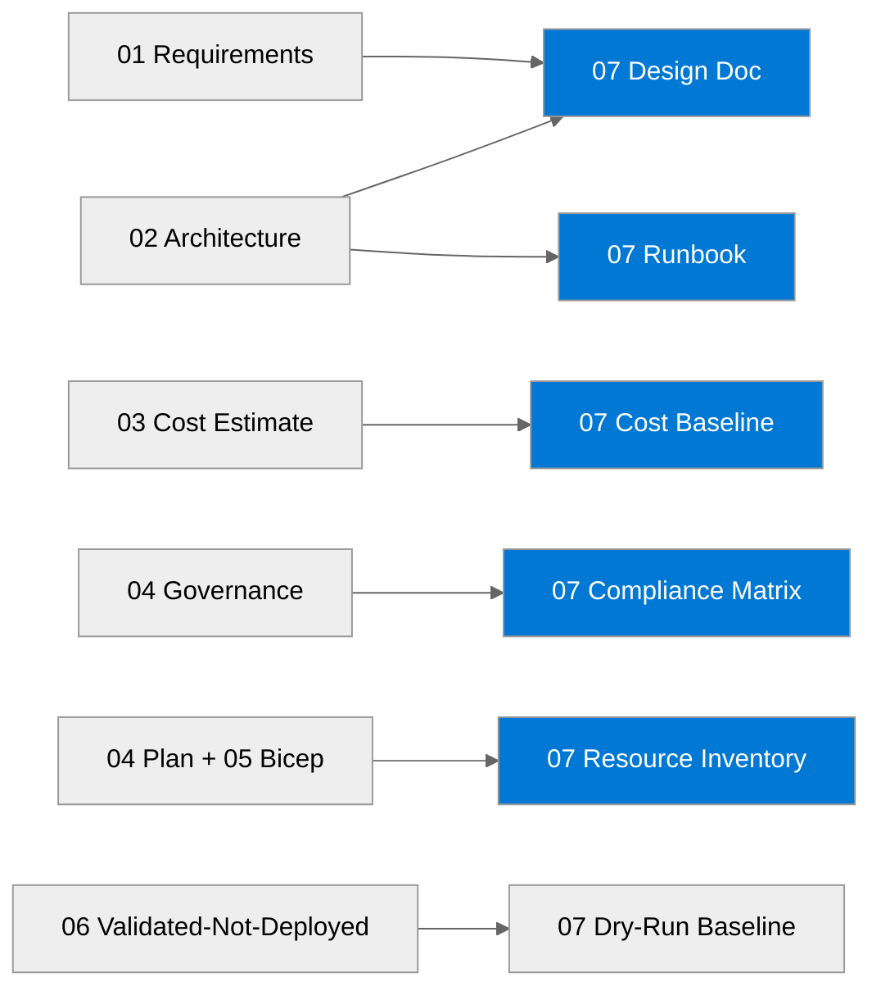

# 📚 Contoso Service Hub - Workload Documentation

<strong>📑 Documentation Contents</strong>

- [📦 1. Document Package Contents](#-1-document-package-contents)
- [📚 2. Source Artifacts](#-2-source-artifacts)
- [📋 3. Project Summary](#-3-project-summary)
- [🔗 4. Related Resources](#-4-related-resources)
- [⚡ 5. Quick Links](#-5-quick-links)

> Generated by 08-As-Built agent | 2026-04-02

| ⬅️ Previous | 📑 Index | Next ➡️ |
|---|---|---|
| [06-deployment-summary.md](06-deployment-summary.md) | [README](README.md) | [07-design-document.md](07-design-document.md) |

**Generated**: 2026-04-02
**Version**: 1.0
**Status**: Validated design baseline for a dry-run deployment (`validated-not-deployed`)

---

## 📦 1. Document Package Contents

| Document | Description | Status |
| --- | --- | --- |
| [07-documentation-index.md](./07-documentation-index.md) | Master index for the Step 7 package |  |
| [07-design-document.md](./07-design-document.md) | Detailed technical design for the validated Azure baseline |  |
| [07-operations-runbook.md](./07-operations-runbook.md) | Day-2 operating model and incident procedures |  |
| [07-resource-inventory.md](./07-resource-inventory.md) | Inventory of validated resources, SKUs, regions, and tags |  |
| [07-backup-dr-plan.md](./07-backup-dr-plan.md) | Single-region backup and disaster recovery plan |  |
| [07-compliance-matrix.md](./07-compliance-matrix.md) | GDPR and PCI-DSS control mapping against the validated design |  |
| [07-ab-cost-estimate.md](./07-ab-cost-estimate.md) | Cost baseline for dev, staging, and prod using validated pricing inputs |  |

---

## 📚 2. Source Artifacts

These documents were generated from the following agentic workflow outputs and validated Bicep sources:

| Artifact | Source | Generated |
| --- | --- | --- |
| Requirements | [01-requirements.md](./01-requirements.md) | 2026-04-02 |
| WAF Assessment | [02-architecture-assessment.md](./02-architecture-assessment.md) | 2026-04-02 |
| Cost Estimate | [03-des-cost-estimate.md](./03-des-cost-estimate.md) | 2026-04-02 |
| ADR-001 | [03-des-adr-001-container-platform.md](./03-des-adr-001-container-platform.md) | 2026-04-02 |
| ADR-002 | [03-des-adr-002-caching-tier.md](./03-des-adr-002-caching-tier.md) | 2026-04-02 |
| ADR-003 | [03-des-adr-003-eu-data-boundary.md](./03-des-adr-003-eu-data-boundary.md) | 2026-04-02 |
| Governance Constraints | [04-governance-constraints.md](./04-governance-constraints.md) | 2026-04-02 |
| Implementation Plan | [04-implementation-plan.md](./04-implementation-plan.md) | 2026-04-02 |
| Deployment Summary | [06-deployment-summary.md](./06-deployment-summary.md) | 2026-04-02 |
| Bicep Templates | [../../infra/bicep/contoso-service-hub-run-2/](../../infra/bicep/contoso-service-hub-run-2/) | 2026-04-02 |

> Step 7 is based on validated infrastructure code and validation outputs. No live Azure resources were provisioned in this run.

---

## 📋 3. Project Summary

| Field | Value |
| --- | --- |
| **Project** | Contoso Service Hub |
| **Type** | Greenfield enterprise digital services platform |
| **Architecture** | N-Tier / API-First with containerized microservices on AKS |
| **Region** | swedencentral (EU Data Boundary) |
| **IaC Tool** | Bicep (AVM-first, 88% AVM coverage) |
| **Environments** | Development, Staging, Production |
| **Total Resources** | 18 resource types across 13 Bicep modules |
| **Compliance** | GDPR (mandatory), PCI-DSS (payment processing) |
| **Cost (monthly)** | ~$9,500/mo across all environments |
| **SLA Target** | 99.9% composite |
| **Deployment Status** | Validated — not deployed (E2E dry-run) |

---

## 🔗 4. Related Resources

| Resource | Link |
| --- | --- |
| Azure Well-Architected Framework | [learn.microsoft.com/azure/well-architected](https://learn.microsoft.com/azure/well-architected) |
| AKS Best Practices | [learn.microsoft.com/azure/aks/best-practices](https://learn.microsoft.com/azure/aks/best-practices) |
| Azure Verified Modules | [azure.github.io/Azure-Verified-Modules](https://azure.github.io/Azure-Verified-Modules/) |
| EU Data Boundary | [learn.microsoft.com/privacy/eudb](https://learn.microsoft.com/privacy/eudb/eu-data-boundary-learn) |
| CAF Naming Conventions | [learn.microsoft.com/azure/cloud-adoption-framework/ready/azure-best-practices/resource-naming](https://learn.microsoft.com/azure/cloud-adoption-framework/ready/azure-best-practices/resource-naming) |

---

## ⚡ 5. Quick Links

| Action | Command |
| --- | --- |
| Build Bicep | `bicep build infra/bicep/contoso-service-hub-run-2/main.bicep` |
| Lint Bicep | `bicep lint infra/bicep/contoso-service-hub-run-2/main.bicep` |
| Deploy (azd) | `cd infra/bicep/contoso-service-hub-run-2 && azd provision --environment dev` |
| Deploy (CLI) | `az deployment group create --resource-group rg-contoso-hub-dev --template-file infra/bicep/contoso-service-hub-run-2/main.bicep` |
| Validate all | `npm run validate:all` |

---

## References

- [Azure Well-Architected Framework](https://learn.microsoft.com/azure/well-architected)
- [Azure Verified Modules](https://azure.github.io/Azure-Verified-Modules/)
- [Cloud Adoption Framework](https://learn.microsoft.com/azure/cloud-adoption-framework)
