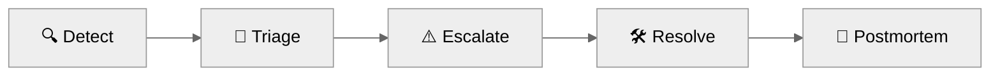
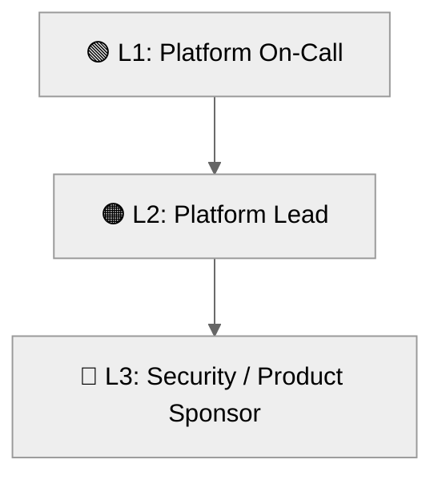

# 📖 Operations Runbook: Contoso Service Hub


<details open>
<summary><strong>📑 Runbook Contents</strong></summary>

- [⚡ Quick Reference](#-quick-reference)
- [📋 1. Daily Operations](#-1-daily-operations)
- [🚨 2. Incident Response](#-2-incident-response)
- [🔧 3. Common Procedures](#-3-common-procedures)
- [🕐 4. Maintenance Windows](#-4-maintenance-windows)
- [📞 5. Contacts & Escalation](#-5-contacts--escalation)
- [📝 6. Change Log](#-6-change-log)
- [References](#references)

</details>

> Generated by 08-As-Built agent | 2026-03-17

| ⬅️ Previous                                    | 📑 Index            | Next ➡️                                              |
| ---------------------------------------------- | ------------------- | ---------------------------------------------------- |
| [07-design-document.md](07-design-document.md) | [README](README.md) | [07-resource-inventory.md](07-resource-inventory.md) |

**Version**: 1.0
**Date**: 2026-03-17
**Environment**: Production baseline, validated for staging and dev variants
**Region**: swedencentral

---

## ⚡ Quick Reference

| Item                               | Value                                                                         |
| ---------------------------------- | ----------------------------------------------------------------------------- |
| **Primary Region**                 | swedencentral                                                                 |
| **Primary Resource Group Pattern** | `rg-contoso-service-hub-{env}`                                                |
| **Support Contact**                | `platform@contoso.example`                                                    |
| **Escalation Path**                | Platform On-Call → Platform Lead → Security/Compliance Lead → Product Sponsor |

### Critical Resources

| Resource            | Name Pattern                                                     | Resource Group                | Severity |
| ------------------- | ---------------------------------------------------------------- | ----------------------------- | -------- |
| Edge ingress        | `afd-contosos-prod` style profile from `main.bicep` naming rules | `rg-contoso-service-hub-prod` | 🔴 P1    |
| API gateway         | `apim-contoso-service-hub-prod-*`                                | `rg-contoso-service-hub-prod` | 🔴 P1    |
| AKS                 | `aks-contoso-service-hub-prod-*`                                 | `rg-contoso-service-hub-prod` | 🔴 P1    |
| PostgreSQL          | `psql-contoso-service-hub-prod-*`                                | `rg-contoso-service-hub-prod` | 🔴 P1    |
| Azure Managed Redis | `redis-contoso-service-hub-prod-*`                               | `rg-contoso-service-hub-prod` | 🟠 P2    |
| Log Analytics       | `law-contoso-service-hub-prod-*`                                 | `rg-contoso-service-hub-prod` | 🟠 P2    |

> [!NOTE]
> This runbook is written against the validated naming patterns and approved parameter file because the environment has not been deployed yet.

---

## 📋 1. Daily Operations

### 1.1 Health Checks

**Morning Health Check:**

1. Confirm Front Door, APIM, AKS, PostgreSQL, Redis, and storage resources are present and healthy after deployment.
2. Review Azure Monitor alerts, budget threshold notifications, and critical diagnostic signals in Log Analytics.
3. Verify no new governance drift exists for required tags, storage security settings, or PostgreSQL TLS posture.

**KQL Query - System Health Overview:**

<details>
<summary><strong>📊 Health Check KQL</strong></summary>

```kusto
AzureDiagnostics
| where TimeGenerated > ago(24h)
| summarize Events=count() by ResourceProvider, Category
| order by Events desc
```

</details>

### 1.2 Log Review

**Priority Logs to Review:**

| Log Source               | Query Focus                                                     | Action Threshold                                 |
| ------------------------ | --------------------------------------------------------------- | ------------------------------------------------ |
| Front Door and WAF       | Blocked requests, anomaly spikes, backend health probe failures | Any sudden sustained increase over baseline      |
| API Management           | 5xx rate, backend dependency latency, auth failures             | >1% error rate over 15 minutes                   |
| AKS / Container Insights | Node pressure, pod restarts, unschedulable workloads            | Any repeated restart loop or node NotReady state |
| PostgreSQL               | Connection saturation, failover events, storage growth          | Connection pressure >80% or replication issues   |
| Redis                    | Memory pressure, connection drops, latency outliers             | Sustained memory pressure or eviction growth     |

---

## 🚨 2. Incident Response

### 2.1 Severity Definitions

| Severity | Definition                                                                                          | Response Time     |
| -------- | --------------------------------------------------------------------------------------------------- | ----------------- |
| 🔴 P1    | User-facing outage or critical security/compliance event affecting booking, payment, or login paths | 15 minutes        |
| 🟠 P2    | Major degradation with workaround available, or data-tier instability without full outage           | 1 hour            |
| 🟢 P3    | Minor defect, non-critical alert noise, or documentation/process issue                              | Next business day |

### Incident Response Flow



### 2.2 Runbooks by Alert

| Alert                                        | Runbook                                                                    | Owner                |
| -------------------------------------------- | -------------------------------------------------------------------------- | -------------------- |
| Front Door backend unhealthy                 | Validate APIM and health probe endpoint, then inspect backend logs         | Platform on-call     |
| APIM 5xx surge                               | Review gateway logs, backend connectivity, and AKS ingress health          | API platform lead    |
| AKS node pressure                            | Scale node pool or reschedule workloads after validating quotas            | Platform engineering |
| PostgreSQL failover or connection saturation | Validate delegated subnet reachability, DB metrics, and connection pooling | Data platform lead   |
| Budget threshold reached                     | Review spend deltas and upcoming scale events before approving changes     | Platform owner       |

---

## 🔧 3. Common Procedures

### 3.1 Restart Services

<details>
<summary>🔧 Restart App Tier Components</summary>

```bash
az aks command invoke --resource-group rg-contoso-service-hub-prod --name <aks-name> --command "kubectl rollout restart deployment/<deployment-name> -n <namespace>"
```

</details>

### 3.2 Scale Resources

<details>
<summary>📈 Scale Up/Out Commands</summary>

```bash
az aks nodepool scale --resource-group rg-contoso-service-hub-prod --cluster-name <aks-name> --name userpool --node-count 3
az apim update --resource-group rg-contoso-service-hub-prod --name <apim-name> --set sku.capacity=2
```

</details>

Other validated procedures:

| Procedure              | Purpose                                                                     |
| ---------------------- | --------------------------------------------------------------------------- |
| Verify governance tags | Ensure `technical-contact` and `tech-contact` remain present where expected |
| Re-run dry validation  | `az bicep build` and `az bicep lint` before any IaC change                  |
| Review DR-08 status    | Confirm legal approval remains valid before changing edge or identity scope |

---

## 🕐 4. Maintenance Windows

| Task                                   | Schedule                       | Duration     |
| -------------------------------------- | ------------------------------ | ------------ |
| AKS and base platform patch review     | Weekly, Sunday 02:00-06:00 UTC | 2 hours      |
| Bicep validation and dependency review | Weekly before change window    | 1 hour       |
| PostgreSQL maintenance coordination    | Monthly Azure-managed window   | Up to 1 hour |
| DR procedure review                    | Quarterly                      | 2 hours      |

The approved maintenance window tag is `sun-02-06-utc`. All change procedures should stay inside that window unless handling an incident.

---

## 📞 5. Contacts & Escalation

| Role                         | Contact                           | Phone | On-Call Rotation       |
| ---------------------------- | --------------------------------- | ----- | ---------------------- |
| Platform On-Call             | `platform@contoso.example`        | N/A   | Weekly rotation        |
| Operations                   | `operations@contoso.example`      | N/A   | Business-hours support |
| Security and Compliance Lead | To be assigned before production  | N/A   | Escalation only        |
| Product Sponsor              | Contoso leadership representative | N/A   | Escalation only        |

### Escalation Path



---

## 📝 6. Change Log

| Date       | Change                                                                            | Author            |
| ---------- | --------------------------------------------------------------------------------- | ----------------- |
| 2026-03-17 | Initial Step 7 operations runbook created from validated infrastructure artifacts | 08-As-Built agent |

---

## References

| Topic                 | Link                                                                                                 |
| --------------------- | ---------------------------------------------------------------------------------------------------- |
| Azure Monitor Alerts  | [Best Practices](https://learn.microsoft.com/azure/azure-monitor/best-practices-alerts)              |
| Log Analytics Queries | [KQL Reference](https://learn.microsoft.com/azure/azure-monitor/logs/get-started-queries)            |
| AKS Operations        | [Day-2 Operations](https://learn.microsoft.com/azure/aks/operator-best-practices-cluster-operations) |
| Azure Service Health  | [Overview](https://learn.microsoft.com/azure/service-health/overview)                                |

---

_Operations runbook generated from validated infrastructure artifacts._

---

<div align="center">

| ⬅️ [07-design-document.md](07-design-document.md) | 🏠 [Project Index](README.md) | ➡️ [07-resource-inventory.md](07-resource-inventory.md) |
| ------------------------------------------------- | ----------------------------- | ------------------------------------------------------- |

</div>
