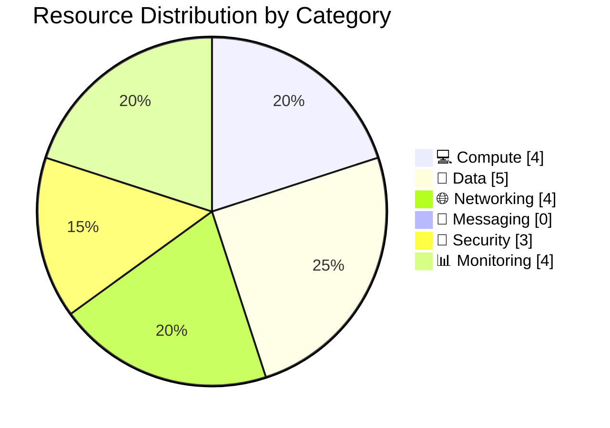

# 📦 Resource Inventory: Contoso Service Hub

<strong>📑 Inventory Contents</strong>

- [📊 Summary](#-summary)
- [📦 Resource Listing](#-resource-listing)
- [References](#references)

> Generated by 08-As-Built agent | 2026-03-17

| ⬅️ Previous                                          | 📑 Index            | Next ➡️                                      |
| ---------------------------------------------------- | ------------------- | -------------------------------------------- |
| [07-operations-runbook.md](07-operations-runbook.md) | [README](README.md) | [07-backup-dr-plan.md](07-backup-dr-plan.md) |

**Generated**: 2026-03-17
**Source**: Infrastructure as Code (Bicep) and validated deployment summary
**Environment**: Production profile with staging and dev variants documented
**Region**: swedencentral

---

## 📊 Summary

| Category                       | Count |
| ------------------------------ | ----- |
| **Total Validated Components** | 20    |
| 💻 Compute                     | 4     |
| 💾 Data Services               | 5     |
| 🌐 Networking                  | 4     |
| 📨 Messaging                   | 0     |
| 🔐 Security                    | 3     |
| 📊 Monitoring                  | 4     |

> [!NOTE]
> No Azure resources were deployed in Step 6. This inventory reflects the validated production design plus environment-specific deltas from the approved Bicep implementation.

---

## 📦 Resource Listing

### 💻 Compute Resources

| Name Pattern                         | Type                                         | SKU                                                 | Location                          | Monthly Cost                     | Purpose                                | Portal                   |
| ------------------------------------ | -------------------------------------------- | --------------------------------------------------- | --------------------------------- | -------------------------------- | -------------------------------------- | ------------------------ |
| `aks-{shortProject}-{env}-{suffix}`  | `Microsoft.ContainerService/managedClusters` | Standard tier, `Standard_D8s_v5` user nodes in prod | swedencentral                     | Included in AKS line item        | Primary microservice runtime           | Planned after deployment |
| `vm-{shortProject}-{env}-{suffix}`   | `Microsoft.Compute/virtualMachines`          | `Standard_D8s_v5` in prod                           | swedencentral                     | Included in VM line item         | Non-containerized workload support     | Planned after deployment |
| `apim-{shortProject}-{env}-{suffix}` | `Microsoft.ApiManagement/service`            | StandardV2 in prod                                  | swedencentral                     | Included in APIM line item       | Managed API gateway                    | Planned after deployment |
| `afd-{shortProject}-{env}`           | `Microsoft.Cdn/profiles`                     | Premium                                             | Global edge with regional backend | Included in Front Door line item | Edge routing, CDN, and WAF association | Planned after deployment |

### 💾 Data Services

| Name Pattern                          | Type                                        | SKU                     | Configuration                                                   | Location      | Monthly Cost                       |
| ------------------------------------- | ------------------------------------------- | ----------------------- | --------------------------------------------------------------- | ------------- | ---------------------------------- |
| `psql-{shortProject}-{env}-{suffix}`  | `Microsoft.DBforPostgreSQL/flexibleServers` | `Standard_D4ds_v5`      | 256 GB, zone-redundant HA in prod, delegated subnet, PITR       | swedencentral | Included in PostgreSQL line item   |
| `redis-{shortProject}-{env}-{suffix}` | `Microsoft.Cache/redisEnterprise`           | `MemoryOptimized_M200`  | Encrypted client protocol, private endpoint, managed service    | swedencentral | Included in Redis line item        |
| `st{shortProject}{env}{suffix}b`      | `Microsoft.Storage/storageAccounts`         | StorageV2 Hot LRS       | 200 GB object data, no public blob access, no shared key access | swedencentral | Included in storage line item      |
| `st{shortProject}{env}{suffix}f`      | `Microsoft.Storage/storageAccounts`         | FileStorage Premium LRS | 256 GB premium file shares                                      | swedencentral | Included in storage line item      |
| `disk-{shortProject}-{env}-{suffix}`  | `Microsoft.Compute/disks`                   | Premium SSD P30         | 256 GB managed disk for VM workloads                            | swedencentral | Included in managed disk line item |

### 🌐 Networking Resources

| Name Pattern                | Type                                      | Configuration                                                               | Location                             |
| --------------------------- | ----------------------------------------- | --------------------------------------------------------------------------- | ------------------------------------ |
| `vnet-{shortProject}-{env}` | `Microsoft.Network/virtualNetworks`       | `/16` address space per environment, 5 workload subnets plus default subnet | swedencentral                        |
| `nsg-*`                     | `Microsoft.Network/networkSecurityGroups` | Six logical NSG protections aligned to subnet roles                         | swedencentral                        |
| `privatelink.*` zones       | `Microsoft.Network/privateDnsZones`       | Five zones for PostgreSQL, Redis, Key Vault, Blob, Files                    | Global control plane, linked to VNet |
| `pe-*`                      | `Microsoft.Network/privateEndpoints`      | Five endpoints: APIM, Redis, Key Vault, Blob, Files                         | swedencentral                        |

### 📨 Messaging Resources

| Name                            | Type | SKU | Configuration                                                                                             | Location |
| ------------------------------- | ---- | --- | --------------------------------------------------------------------------------------------------------- | -------- |
| None in current validated scope | N/A  | N/A | Messaging is handled by application patterns rather than dedicated Azure messaging services in this phase | N/A      |

### 🔐 Security Resources

| Name Pattern                         | Type                                                        | Configuration                                                  | Location                |
| ------------------------------------ | ----------------------------------------------------------- | -------------------------------------------------------------- | ----------------------- |
| `kv-{shortProject}-{env}-{suffix}`   | `Microsoft.KeyVault/vaults`                                 | Standard tier, RBAC access, purge protection, private endpoint | swedencentral           |
| `uami-{shortProject}-{env}-{suffix}` | `Microsoft.ManagedIdentity/userAssignedIdentities`          | Shared workload identity for AKS, APIM, and VM                 | swedencentral           |
| `wafpolicy{shortProject}{env}`       | `Microsoft.Network/frontDoorWebApplicationFirewallPolicies` | Prevention mode in prod, detection mode in dev                 | Global edge association |

### 📊 Monitoring Resources

| Name Pattern                         | Type                                       | Retention                                       | Location             |
| ------------------------------------ | ------------------------------------------ | ----------------------------------------------- | -------------------- |
| `law-{shortProject}-{env}-{suffix}`  | `Microsoft.OperationalInsights/workspaces` | 90 days prod, 60 days staging, 31 days dev      | swedencentral        |
| `appi-{shortProject}-{env}-{suffix}` | `Microsoft.Insights/components`            | Workspace-based retention through Log Analytics | swedencentral        |
| `ag-{shortProject}-{env}`            | `Microsoft.Insights/actionGroups`          | Notification routing for alerting               | Global control plane |
| `budget-{shortProject}-{env}`        | `Microsoft.Consumption/budgets`            | 80%, 100%, 120% thresholds                      | Resource-group scope |

---

## References

| Topic                    | Link                                                                                                                       |
| ------------------------ | -------------------------------------------------------------------------------------------------------------------------- |
| Bicep orchestrator       | [../../infra/bicep/contoso-service-hub-run-2/main.bicep](../../infra/bicep/contoso-service-hub-run-2/main.bicep)           |
| Parameter baseline       | [../../infra/bicep/contoso-service-hub-run-2/main.bicepparam](../../infra/bicep/contoso-service-hub-run-2/main.bicepparam) |
| Implementation reference | [05-implementation-reference.md](./05-implementation-reference.md)                                                         |
| Deployment summary       | [06-deployment-summary.md](./06-deployment-summary.md)                                                                     |

---

_Resource inventory generated from validated Bicep templates._

---

| ⬅️ [07-operations-runbook.md](07-operations-runbook.md) | 🏠 [Project Index](README.md) | ➡️ [07-backup-dr-plan.md](07-backup-dr-plan.md) |
| ------------------------------------------------------- | ----------------------------- | ----------------------------------------------- |

