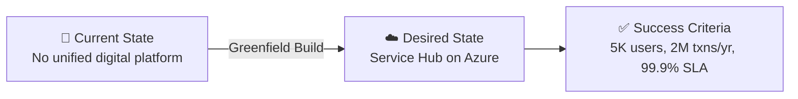

# 📋 Step 1: Requirements - Contoso Service Hub

<strong>📑 Requirements Overview</strong>

- [🎯 Project Overview](#-project-overview)
- [🚀 Functional Requirements](#-functional-requirements)
- [⚡ Non-Functional Requirements (NFRs)](#-non-functional-requirements-nfrs)
- [🔒 Compliance & Security Requirements](#-compliance--security-requirements)
- [💰 Budget](#-budget)
- [🔧 Operational Requirements](#-operational-requirements)
- [🌍 Regional Preferences](#-regional-preferences)
- [📊 Complexity Classification](#-complexity-classification)
- [📋 Summary for Architecture Assessment](#-summary-for-architecture-assessment)
- [References](#references)

> Generated by @requirements agent | 2026-03-17

| ⬅️ Previous | 📑 Index            | Next ➡️                                                        |
| ----------- | ------------------- | -------------------------------------------------------------- |
| —           | [README](README.md) | [02-architecture-assessment.md](02-architecture-assessment.md) |

## 🎯 Project Overview

| Field                   | Value                                                                                                                                    |
| ----------------------- | ---------------------------------------------------------------------------------------------------------------------------------------- |
| **Project Name**        | Contoso Service Hub                                                                                                                      |
| **Project Type**        | Full-Stack Digital Services Platform                                                                                                     |
| **Timeline**            | May 2026 (MVP) → September 2027 (Release 2.1); 3-year contract through Feb 2029                                                          |
| **Primary Stakeholder** | Contoso — EU real estate and lifestyle digital services                                                                                  |
| **Business Context**    | Unified digital platform for bookings, payments, content, and customer engagement across a mixed-use real estate and lifestyle ecosystem |

### Business Context

| Field               | Value                                                                                                                     |
| ------------------- | ------------------------------------------------------------------------------------------------------------------------- |
| Industry / Vertical | Real Estate / Lifestyle Digital Services                                                                                  |
| Company Size        | Enterprise                                                                                                                |
| Current State       | Greenfield                                                                                                                |
| Migration Source    | N/A (greenfield digital platform)                                                                                         |
| Business Drivers    | Customer adoption, unified digital experience, revenue generation, operational efficiency across properties               |
| Success Criteria    | 5,000 initial users onboarded; 50K transactions in 2026; growth to 2M transactions in 2027; 99.9% availability maintained |

### State Transition

## 🚀 Functional Requirements

### Core Capabilities

| #   | Capability                                     | Priority  | Acceptance Criteria                                                        |
| --- | ---------------------------------------------- | --------- | -------------------------------------------------------------------------- |
| 1   | Service Bookings (sports, leisure, venues)     | 🔴 Must   | Users can discover, book, and manage service appointments via mobile/web   |
| 2   | Payment Processing                             | 🔴 Must   | Secure transaction processing for bookings and utilities; 50K txns in 2026 |
| 3   | Content Delivery (digital content, promotions) | 🔴 Must   | Sub-second content load times via CDN; 1.5M requests/month capacity        |
| 4   | Customer Identity and Access Management        | 🔴 Must   | Self-service registration, SSO, profile management for 15K MAU initially   |
| 5   | API Gateway for Integrations                   | 🔴 Must   | Centralized API management handling 5M requests/month                      |
| 6   | Admin Portal (property/community management)   | 🟡 Should | Internal administrative functions for property and facilities management   |
| 7   | Parking and Mobility Services                  | 🟡 Should | Digital parking management and mobility services integration               |
| 8   | Utilities Sales and Management                 | 🔴 Must   | Included in MVP (May 2026); billing and consumption tracking               |
| 9   | Partner and Vendor Integration                 | 🟡 Should | API-based integration with third-party service providers and venues        |
| 10  | Push Notifications and Engagement              | 🟡 Should | Customer engagement through digital channels and notifications             |

### User Types

| User Type               | Description                                   | Est. Count       | Access Level |
| ----------------------- | --------------------------------------------- | ---------------- | ------------ |
| Residents               | Community residents using day-to-day services | ~3,000 (initial) | Contributor  |
| Visitors                | Visitors accessing leisure and venue services | ~1,500 (initial) | Reader       |
| Tenants                 | Commercial and residential tenants            | ~500 (initial)   | Contributor  |
| Partners                | Service providers and venue operators         | ~50              | Contributor  |
| Internal Business Users | Contoso operational and administrative staff  | ~100             | Admin        |

### Integrations

| System                | Direction     | Protocol     | Auth Method  | SLA   |
| --------------------- | ------------- | ------------ | ------------ | ----- |
| Payment Gateway       | Outbound      | REST         | OAuth 2.0    | 99.9% |
| Property Management   | Bidirectional | REST / Event | MI / API Key | 99.9% |
| Venue Booking Systems | Bidirectional | REST         | OAuth 2.0    | 99.5% |
| Parking/Mobility      | Bidirectional | REST         | API Key      | 99.5% |
| Notification Services | Outbound      | REST / Event | MI           | 99.5% |

### Data Types

| Category             | Sensitivity | Est. Volume       | Retention | Residency |
| -------------------- | ----------- | ----------------- | --------- | --------- |
| Customer PII         | 🔴 High     | ~15K user records | 7 years   | EU only   |
| Transaction/Payment  | 🔴 High     | 50K–2M txns/yr    | 7 years   | EU only   |
| Booking/Service Data | 🟡 Medium   | ~200 GB           | 3 years   | EU only   |
| Content/Media        | 🟢 Low      | ~200 GB (blob)    | 1 year    | EU only   |
| Application Logs     | 🟡 Medium   | Growing           | 90 days   | EU only   |
| Telemetry/Monitoring | 🟢 Low      | Growing           | 30 days   | EU only   |

### Architecture Pattern

| Field              | Value                                                                                                                                                                                                                                           |
| ------------------ | ----------------------------------------------------------------------------------------------------------------------------------------------------------------------------------------------------------------------------------------------- |
| Workload Pattern   | N-Tier Web + Container (microservices backend with container orchestration, API gateway, and customer-facing web/mobile apps)                                                                                                                   |
| Recommended Option | Enterprise Tier: AKS + ACR + PostgreSQL + Redis + Front Door + APIM + Key Vault + Monitor                                                                                                                                                       |
| Tier               | Enterprise                                                                                                                                                                                                                                      |
| Justification      | 15 discrete cloud services, GDPR compliance, 99.9% SLA target, 3 environments, payment processing, and growth from 50K to 2M transactions demands enterprise-grade infrastructure with container orchestration, caching, and full observability |

### Proposed Azure Service Mapping

| #   | RFP Service                  | Azure Service                                 | SKU / Tier                 | Indicative Volumetrics               |
| --- | ---------------------------- | --------------------------------------------- | -------------------------- | ------------------------------------ |
| 1   | Web Application Firewall     | Azure Front Door WAF                          | Premium                    | 1,500,000 requests/month             |
| 2   | Edge Security and CDN        | Azure Front Door                              | Premium                    | 1,500,000 requests/month             |
| 3   | CIAM                         | Azure AD B2C                                  | Premium P1                 | 15,000 MAU                           |
| 4   | API Management               | Azure API Management                          | Standard                   | 5,000,000 API requests/month         |
| 5   | Container Engine             | Azure Kubernetes Service (AKS)                | Standard, 8 vCPU nodes     | Multi-node cluster                   |
| 6   | Database (PostgreSQL)        | Azure Database for PostgreSQL Flexible Server | General Purpose, 256 GB    | Primary relational datastore         |
| 7   | Object Storage               | Azure Blob Storage                            | Standard LRS, Hot tier     | 200 GB                               |
| 8   | File Storage                 | Azure Files                                   | Premium SSD, 256 GB        | Shared file storage                  |
| 9   | Block Storage                | Azure Managed Disks                           | Premium SSD, 256 GB        | VM and container-attached storage    |
| 10  | In-memory Cache              | Azure Cache for Redis                         | Enterprise (128 GB) ⚠️     | Session state, caching               |
| 11  | Key and Secrets Management   | Azure Key Vault                               | Standard                   | 100,000 operations/month             |
| 12  | Virtual Machine              | Azure Virtual Machines                        | Standard 8 vCPU (D-series) | Supporting workloads                 |
| 13  | Network Services             | Azure VNet + NSG + Private Endpoints          | As required                | Hub-spoke or flat VNet               |
| 14  | SDLC Services                | GitHub Actions + Azure Container Registry     | Standard                   | CI/CD pipelines, artifact repository |
| 15  | Observability and Monitoring | Azure Monitor + Log Analytics + App Insights  | Pay-as-you-go              | Centralized monitoring and alerting  |

> ⚠️ **Open Question**: Redis 128 GB requirement maps to Azure Cache for Redis Enterprise tier, which is a significant cost driver. Confirm whether 128 GB is a firm requirement or whether a smaller tier (e.g., Premium P4 at 53 GB) is acceptable for MVP.

## ⚡ Non-Functional Requirements (NFRs)

| WAF Pillar     | Metric             | Target                          | Current | Gap           |
| -------------- | ------------------ | ------------------------------- | ------- | ------------- |
| 🔄 Reliability | SLA                | 99.9%                           | N/A     | Greenfield    |
| 🔄 Reliability | RTO                | 4 hours                         | N/A     | Standard tier |
| 🔄 Reliability | RPO                | 1 hour                          | N/A     | Standard tier |
| ⚡ Performance | Page Load          | < 2,000 ms                      | N/A     | Greenfield    |
| ⚡ Performance | API Response (p95) | < 500 ms                        | N/A     | Greenfield    |
| ⚡ Performance | Concurrent Users   | 500 (initial)                   | N/A     | Greenfield    |
| 🔒 Security    | Auth Method        | B2C + MFA                       | —       | —             |
| 🔒 Security    | Encryption         | At-rest + In-transit (TLS 1.2+) | —       | —             |
| 💰 Cost        | Monthly Budget     | ~$12,000 (estimated)            | —       | —             |
| 🔧 Operations  | Uptime Monitoring  | Yes                             | —       | —             |

### Scalability

| Dimension        | Current (2026 MVP)    | 6-Month Projection (Dec 2026) | 12-Month Projection (2027) |
| ---------------- | --------------------- | ----------------------------- | -------------------------- |
| Users            | 5,000                 | 10,000                        | 15,000+                    |
| Data Volume      | ~1 TB (all stores)    | ~2 TB                         | ~5 TB                      |
| Transactions/day | ~200 (50K / 250 days) | ~500                          | ~5,500 (2M / 365 days)     |

> **Note**: Transaction growth from 50K (2026) to 2M (2027) represents a 40× increase. The architecture must support auto-scaling to handle this ramp without re-platforming.

## 🔒 Compliance & Security Requirements

### Regulatory Frameworks

<strong>PCI-DSS</strong> — Potentially Applicable

| Requirement             | Applicability | Notes                                                       |
| ----------------------- | ------------- | ----------------------------------------------------------- |
| Cardholder data storage | Pending       | Depends on payment integration model (direct vs. tokenized) |
| Network segmentation    | Yes           | Required for any payment-adjacent workloads                 |
| Encryption requirements | Yes           | TLS 1.2+ in transit, AES-256 at rest                        |

> ⚠️ **Open Question**: Payment integration model not specified in RFP. If Contoso processes card data directly, PCI-DSS scope expands significantly. Recommend tokenized payment gateway (e.g., Stripe, Adyen) to minimize PCI scope.

<strong>SOC 2</strong> — Not Applicable

| Trust Principle | Applicability | Notes                        |
| --------------- | ------------- | ---------------------------- |
| Security        | No            | Not required per RFP         |
| Availability    | No            | Covered by SLA commitments   |
| Confidentiality | No            | Covered by GDPR requirements |

<strong>HIPAA</strong> — Not Applicable

| Requirement   | Applicability | Notes                       |
| ------------- | ------------- | --------------------------- |
| PHI handling  | No            | No healthcare data in scope |
| BAA required  | No            | N/A                         |
| Audit logging | No            | Covered by GDPR audit trail |

<strong>GDPR</strong> — Applicable (Mandatory)

| Requirement         | Applicability | Notes                                                       |
| ------------------- | ------------- | ----------------------------------------------------------- |
| EU data subjects    | Yes           | All users are EU residents, visitors, and tenants           |
| Data residency      | Yes           | All data must remain within EU borders — no exceptions      |
| Right to erasure    | Yes           | Must support GDPR Article 17 data deletion requests         |
| DPO requirement     | Yes           | Data Protection Officer required for large-scale processing |
| Consent management  | Yes           | Explicit consent required for data processing               |
| Data portability    | Yes           | Must support GDPR Article 20 data export requests           |
| Breach notification | Yes           | 72-hour breach notification to supervisory authority        |

<strong>ISO 27001</strong> — Recommended

| Control Area        | Applicability | Notes                                              |
| ------------------- | ------------- | -------------------------------------------------- |
| Access control      | Yes           | RBAC, least privilege, MFA for admin access        |
| Asset management    | Yes           | All cloud resources tagged and inventoried         |
| Incident management | Yes           | Aligned with GDPR breach notification requirements |

### Data Residency

| Requirement              | Value                                                                  |
| ------------------------ | ---------------------------------------------------------------------- |
| Primary Region           | EU (Sweden Central)                                                    |
| Data Sovereignty         | EU-only — strict; no data transfer outside EU without written approval |
| Cross-region Replication | Not required (DR excluded from current RFP scope)                      |

### Authentication & Authorization

| Requirement       | Value                                                     |
| ----------------- | --------------------------------------------------------- |
| Identity Provider | Azure AD B2C (customer-facing CIAM) + Entra ID (internal) |
| MFA Requirement   | Required for admin access; conditional for end users      |
| RBAC Model        | Azure RBAC for infrastructure + application-level RBAC    |

### Network Security

| Control                     | Required | Notes                                                         |
| --------------------------- | -------- | ------------------------------------------------------------- |
| Private endpoints           | ✅       | Required for PostgreSQL, Redis, Key Vault, Storage            |
| VNet integration            | ✅       | AKS in VNet; all PaaS services VNet-integrated where possible |
| Public endpoints acceptable | ✅       | Only via Front Door WAF (internet-facing edge)                |
| WAF required                | ✅       | 1.5M requests/month; OWASP rule set; DDoS protection          |

### Recommended Security Controls

| Control               | Recommended | User Confirmed | Notes                                                           |
| --------------------- | ----------- | -------------- | --------------------------------------------------------------- |
| Managed Identity      | Yes         | Yes (RFP)      | Prefer over keys for all Azure service-to-service auth          |
| Private Endpoints     | Yes         | Yes (RFP)      | Required for all data services (PostgreSQL, Redis, Storage, KV) |
| WAF                   | Yes         | Yes (RFP)      | Azure Front Door WAF with OWASP 3.2 rules                       |
| Key Vault for Secrets | Yes         | Yes (RFP)      | 100K operations/month; centralized secrets management           |
| Diagnostic Settings   | Yes         | Yes (RFP)      | All resources must emit logs to Log Analytics                   |
| TLS 1.2 Minimum       | Yes         | Yes (RFP)      | Mandatory for all services                                      |
| Encryption at Rest    | Yes         | Yes (implied)  | Platform-managed keys minimum; CMK for sensitive data           |
| Network Isolation     | Yes         | Yes (RFP)      | VNet + NSG + Private Link architecture                          |

## 💰 Budget

> [!NOTE]
> The RFP does **not** specify an explicit budget. The estimate below is derived from
> the 15 proposed cloud services, their indicative volumetrics, 3 environments
> (Dev/Staging/Production), and enterprise-tier requirements.

| Field              | Value                                                                |
| ------------------ | -------------------------------------------------------------------- |
| 💰 Monthly Budget  | ~$12,000 (estimated across all environments)                         |
| 📅 Annual Budget   | ~$144,000                                                            |
| 🚦 Limit Type      | 🟡 Soft — no explicit budget ceiling stated in RFP                   |
| 📊 Cost Model Pref | Hybrid (reserved instances for steady-state + consumption for burst) |

### Estimated Monthly Breakdown by Environment

| Environment | Est. Monthly Cost | Notes                                                           |
| ----------- | ----------------- | --------------------------------------------------------------- |
| Production  | ~$7,000–8,000     | Full-scale: AKS, PostgreSQL, Redis Enterprise, APIM, Front Door |
| Staging     | ~$3,000–4,000     | Mirror of Production (smaller node count)                       |
| Development | ~$1,000–1,500     | Minimal sizing; consumption-based where possible                |

### Key Cost Drivers

| Service                        | Est. Monthly (Prod) | Notes                                          |
| ------------------------------ | ------------------- | ---------------------------------------------- |
| Azure Cache for Redis (128 GB) | ~$2,500–3,500       | ⚠️ Enterprise tier; largest single cost driver |
| Azure Kubernetes Service       | ~$800–1,200         | 2-3 Standard_D8s_v5 nodes                      |
| Azure Database for PostgreSQL  | ~$600–900           | General Purpose, 256 GB, 8 vCPUs               |
| Azure API Management           | ~$700–900           | Standard tier                                  |
| Azure Front Door (Premium)     | ~$350–500           | WAF + CDN combined                             |
| Azure Virtual Machines         | ~$300–500           | 1× Standard_D8s_v5                             |
| Observability stack            | ~$200–400           | Monitor + Log Analytics + App Insights         |
| Storage (Blob + Files + Disks) | ~$80–150            | ~700 GB combined                               |
| Azure Key Vault                | ~$10–20             | 100K operations/month                          |
| Azure AD B2C                   | ~$0–50              | First 50K MAU free                             |

### Cost Optimization Priorities

| Priority                         | Selected | Impact |
| -------------------------------- | -------- | ------ |
| Minimize compute costs           | ☐        | High   |
| Prefer consumption-based pricing | ☑        | High   |
| Reserved instances acceptable    | ☑        | High   |
| Spot instances for non-critical  | ☐        | Medium |

> **Recommendation**: 1-year reserved instances for AKS nodes, PostgreSQL, and Redis would reduce costs by 30–40%. Recommend Contoso evaluate reserved capacity commitments once MVP traffic patterns are validated.

## 🔧 Operational Requirements

### Monitoring & Alerting

| Capability             | Required | Tool / Service                    | Notes                                            |
| ---------------------- | -------- | --------------------------------- | ------------------------------------------------ |
| Application monitoring | ✅       | Application Insights              | Distributed tracing across microservices         |
| Log aggregation        | ✅       | Log Analytics                     | Centralized logs for all 15 services             |
| Alert notifications    | ✅       | Azure Monitor → Email / Teams     | SLA breach, error rate, latency alerts           |
| Custom dashboards      | ✅       | Azure Monitor workbooks / Grafana | Per-environment health dashboards                |
| Infrastructure metrics | ✅       | Azure Monitor                     | CPU, memory, disk, network for all compute       |
| Security monitoring    | ✅       | Microsoft Defender for Cloud      | Threat detection and security posture management |

### CI/CD & DevOps

| Capability             | Required | Tool / Service                 | Notes                                             |
| ---------------------- | -------- | ------------------------------ | ------------------------------------------------- |
| CI/CD Pipelines        | ✅       | GitHub Actions                 | Build, test, deploy automation                    |
| Container Registry     | ✅       | Azure Container Registry (ACR) | Private registry for AKS container images         |
| Infrastructure as Code | ✅       | Bicep                          | All infrastructure defined and version-controlled |
| Secret Management      | ✅       | Azure Key Vault                | No secrets in code or CI/CD variables             |
| Security Scanning      | ✅       | GitHub Advanced Security       | SAST, dependency scanning, secret scanning        |

### Support & Maintenance

| Requirement         | Value                                                    |
| ------------------- | -------------------------------------------------------- |
| Support Hours       | 24/7 (Production); Business hours (Dev/Staging)          |
| On-call Requirement | Yes — for Production environment                         |
| Maintenance Windows | Weekends 02:00–06:00 CET; coordinated with Contoso       |
| Change Management   | Formal CAB for Production; Team approval for Staging/Dev |

### Backup & Disaster Recovery

| Component           | Backup Frequency  | Retention | Recovery Method       |
| ------------------- | ----------------- | --------- | --------------------- |
| PostgreSQL Database | Daily (automated) | 35 days   | Point-in-time restore |
| Azure Blob Storage  | GRS (continuous)  | 30 days   | Automated             |
| AKS Configuration   | Daily             | 30 days   | GitOps re-deploy      |
| Key Vault           | Soft-delete       | 90 days   | Automated recovery    |
| Redis Cache         | Periodic (6hr)    | 7 days    | Restore from snapshot |

> **Note**: Multi-region disaster recovery is explicitly **excluded** from the current RFP scope (Section 4.1). Backup strategy covers single-region data protection only.

## 🌍 Regional Preferences

| Preference         | Value         | Justification                                                              |
| ------------------ | ------------- | -------------------------------------------------------------------------- |
| Primary Region     | swedencentral | EU GDPR-compliant; low latency to core EU user base                        |
| Failover Region    | N/A           | Multi-region DR excluded from RFP scope                                    |
| Availability Zones | Required      | 99.9% SLA target requires zone-redundant deployments for critical services |

> **IaC Tool**: `iac_tool: Bicep`

---

## 📊 Complexity Classification

| Field      | Value                                                                                                                                                                                                                                                                                                                                                                                                 |
| ---------- | ----------------------------------------------------------------------------------------------------------------------------------------------------------------------------------------------------------------------------------------------------------------------------------------------------------------------------------------------------------------------------------------------------- |
| Complexity | `complex`                                                                                                                                                                                                                                                                                                                                                                                             |
| Criteria   | >8 resource types (15 Azure services), multi-env (Dev + Staging + Production), GDPR + potential PCI-DSS compliance                                                                                                                                                                                                                                                                                    |
| Rationale  | 15 distinct Azure services across 3 environments with EU-only data residency, GDPR mandatory compliance, payment processing, significant transaction growth (40× in year 1), enterprise-grade SLA (99.9%), and customer-facing CIAM for 15K+ MAU. This exceeds the "complex" threshold on all dimensions: resource count (15 > 8), environments (3), and compliance scope (GDPR + PCI-DSS potential). |

---

## 📋 Summary for Architecture Assessment

### Handoff Summary

| Aspect               | Key Points                                                                                                                             |
| -------------------- | -------------------------------------------------------------------------------------------------------------------------------------- |
| Critical Constraints | 1) EU-only data residency (GDPR) 2) 99.9% SLA target 3) 40× transaction growth in 12 months                                            |
| Key Decisions        | IaC: Bicep; Region: swedencentral; CIAM: Azure AD B2C; Container: AKS (pending confirmation); Enterprise tier selected                 |
| Open Risks           | Redis 128 GB sizing vs. cost trade-off; Payment model (PCI scope); No explicit budget from stakeholder; AKS vs Container Apps decision |
| Recommended Pattern  | N-Tier Web + Container (enterprise tier)                                                                                               |
| Budget Envelope      | ~$12,000/month (estimated — no RFP budget stated)                                                                                      |

### Requirements Completeness

| Section                  | Status | Notes                                                        |
| ------------------------ | ------ | ------------------------------------------------------------ |
| Project Overview         | ✅     | Fully populated from RFP Sections 1-3                        |
| Functional Requirements  | ✅     | 10 capabilities mapped from RFP scope                        |
| NFRs                     | ✅     | SLA, RTO/RPO, scalability projections from Section 4.5       |
| Compliance & Security    | ✅     | GDPR mandatory; PCI-DSS pending payment model clarification  |
| Budget                   | ⚠️     | Estimated from service volumetrics — no explicit RFP budget  |
| Operational Requirements | ✅     | Monitoring, CI/CD, backup derived from RFP Sections 4.2, 4.4 |

### Open Questions

| #   | Question                                                                                     | Impact    | Default Assumption                                         |
| --- | -------------------------------------------------------------------------------------------- | --------- | ---------------------------------------------------------- |
| 1   | Is Redis 128 GB a firm requirement or can a smaller tier (53 GB Premium P4) suffice for MVP? | 💰 High   | Proceed with 128 GB Enterprise tier as specified           |
| 2   | Should the container engine be AKS or Azure Container Apps?                                  | 🔧 Medium | AKS (RFP specifies "Standard 8 vCPU" suggesting VM-backed) |
| 3   | What is the payment integration model — direct card processing or tokenized gateway?         | 🔒 High   | Tokenized gateway (minimizes PCI-DSS scope)                |
| 4   | Is there an explicit budget ceiling or range from Contoso procurement?                       | 💰 High   | No ceiling; estimate ~$12K/month based on volumetrics      |
| 5   | Are 8 vCPU VMs (Service #12) in addition to AKS nodes, or are they the AKS nodes?            | 🔧 Medium | Separate VM for observability/DevOps tooling               |
| 6   | What is the SDLC platform preference — Azure DevOps or GitHub?                               | 🔧 Low    | GitHub Actions + ACR                                       |
| 7   | Is multi-region DR expected in a future phase beyond this RFP?                               | 🔄 Low    | Single-region for now; architect for future DR readiness   |

---

## References

> [!NOTE]
> 📚 The following Microsoft Learn resources provide additional guidance.

| Topic                      | Link                                                                                                |
| -------------------------- | --------------------------------------------------------------------------------------------------- |
| Well-Architected Framework | [Overview](https://learn.microsoft.com/azure/well-architected/)                                     |
| Azure Regions              | [Products by Region](https://azure.microsoft.com/explore/global-infrastructure/products-by-region/) |
| Compliance Offerings       | [Azure Compliance](https://learn.microsoft.com/azure/compliance/)                                   |
| GDPR on Azure              | [GDPR Overview](https://learn.microsoft.com/azure/compliance/offerings/offering-eu-gdpr)            |
| Azure AD B2C               | [B2C Documentation](https://learn.microsoft.com/azure/active-directory-b2c/)                        |
| AKS Best Practices         | [AKS Guidance](https://learn.microsoft.com/azure/aks/best-practices)                                |

---

_Requirements extracted from Contoso RFQ (docs/e2e-inputs/contoso-rfq.md) for automated E2E evaluation run-3_

---

| ⬅️ — | 🏠 [Project Index](README.md) | ➡️ [02-architecture-assessment.md](02-architecture-assessment.md) |
| ---- | ----------------------------- | ----------------------------------------------------------------- |

