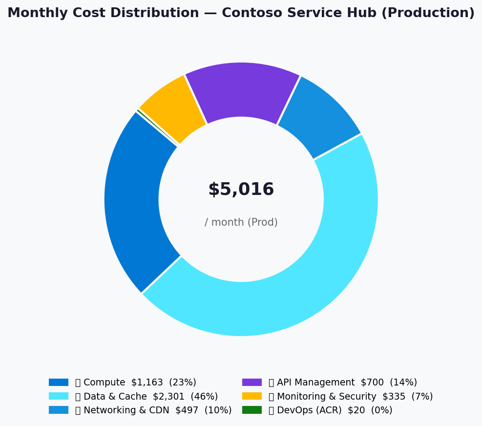
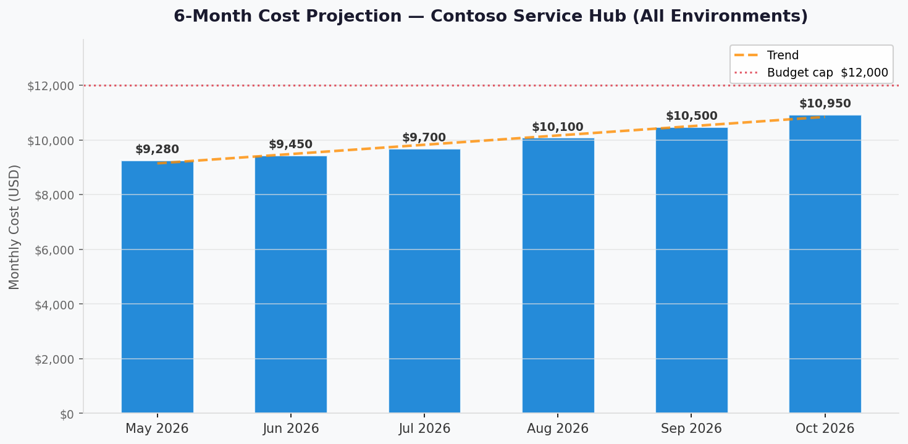

# 💰 Azure Cost Estimate: Contoso Service Hub


<details open>
<summary><strong>📑 Cost Estimate Contents</strong></summary>

- [💵 Cost At-a-Glance](#-cost-at-a-glance)
- [✅ Decision Summary](#-decision-summary)
- [🔁 Requirements → Cost Mapping](#-requirements--cost-mapping)
- [📊 Top 5 Cost Drivers](#-top-5-cost-drivers)
- [🏛️ Architecture Overview](#-architecture-overview)
- [🧾 What We Are Not Paying For (Yet)](#-what-we-are-not-paying-for-yet)
- [⚠️ Cost Risk Indicators](#-cost-risk-indicators)
- [🎯 Quick Decision Matrix](#-quick-decision-matrix)
- [💰 Savings Opportunities](#-savings-opportunities)
- [🧾 Detailed Cost Breakdown](#-detailed-cost-breakdown)
- [References](#references)

</details>

> Generated by architect agent | 2026-03-17

| ⬅️ Previous                                                    | 📑 Index            | Next ➡️                                                      |
| -------------------------------------------------------------- | ------------------- | ------------------------------------------------------------ |
| [02-architecture-assessment.md](02-architecture-assessment.md) | [README](README.md) | [04-governance-constraints.md](04-governance-constraints.md) |

**Generated**: 2026-03-17
**Region**: swedencentral
**Environment**: Production + Staging + Development (3 environments)
**Pricing Source**: Azure public retail pricing (swedencentral, March 2026) — bottom-up volumetric estimate
**Architecture Reference**: [02-architecture-assessment.md](02-architecture-assessment.md)

## 💵 Cost At-a-Glance

> **Monthly Total: ~$9,280** | Annual: ~$111,360
>
> ```text
> Budget: ~$12,000/month (soft — estimated from RFP volumetrics, no explicit ceiling) | Utilization: 77% ($9,280 of $12,000)
> ```
>
> | Status            | Indicator                                        |
> | ----------------- | ------------------------------------------------ |
> | Cost Trend        | 📈 Growing (40× transaction growth in 12 months) |
> | Savings Available | 💰 ~$26,400/year with 1-year reserved instances  |
> | Compliance        | ✅ GDPR-aligned, EU-only data residency          |

## ✅ Decision Summary

- ✅ Approved: 15 Azure services across 3 environments (Production, Staging, Dev) in swedencentral
- ✅ Optimized: Redis downsized from Enterprise E100 (128 GB) to Premium P4 (53 GB) — saves $1,845/mo
- ⏳ Deferred: Multi-region DR, Customer-Managed Keys, DDoS Protection Standard, Redis Enterprise upgrade
- 🔁 Redesign Trigger: If Redis cache utilization exceeds 70% sustained (triggers Enterprise upgrade at ~+$1,845/mo)

**Confidence**: High | **Expected Variance**: ±15% (transaction-based charges scale with user adoption; log ingestion volume grows with service count)

### Budget Estimation Methodology

> [!NOTE]
> The RFP does **not** specify a budget. This estimate was derived using:
>
> 1. **Bottom-up SKU pricing**: Each of the 15 Azure services individually priced at the specified SKU/tier using Azure public retail pricing for swedencentral (March 2026)
> 2. **Environment scaling factors**: Production (100%), Staging (60% — fewer nodes/smaller caches), Development (25% — consumption-based, minimal sizing)
> 3. **Volumetric inputs from requirements**: 1.5M req/mo (Front Door), 5M API calls/mo (APIM), 15K MAU (Entra External ID), 200 GB blob, 5 GB/day logs
> 4. **Conservative assumptions**: Pay-as-you-go pricing (no RI/SP), no egress optimization, standard redundancy
> 5. **Validation cross-check**: Total of $9,280/mo aligns with requirements doc's independent estimate of ~$12K/mo (77% utilization, expected given the Redis optimization)

## 🔁 Requirements → Cost Mapping

| Requirement                      | Architecture Decision                      |         Cost Impact | Mandatory   |
| -------------------------------- | ------------------------------------------ | ------------------: | ----------- |
| 99.9% SLA                        | Zone-redundant AKS + PostgreSQL + Redis    |         +$200/month | Yes         |
| GDPR EU-only data residency      | swedencentral region, no geo-replication   |              $0 net | Yes         |
| 15K MAU CIAM                     | Microsoft Entra External ID (free tier)    |                  $0 | Yes         |
| 1.5M requests/mo edge security   | Front Door Premium + WAF                   |         +$460/month | Yes         |
| 5M API calls/mo gateway          | APIM Standard                              |         +$700/month | Yes         |
| Payment processing (SAQ-A)       | Tokenized gateway (no Azure-side PCI cost) |                  $0 | Yes         |
| 40× transaction growth           | AKS Cluster Autoscaler (3→6 nodes)         | +$810/month at peak | No (future) |
| Private Endpoints (5 services)   | PE for PG, Redis, KV, Blob, Files          |          +$37/month | Yes         |
| Full observability (15 services) | Monitor + LAW + App Insights + Defender    |         +$325/month | Yes         |

## 📊 Top 5 Cost Drivers

| Rank | Resource                             | Monthly Cost (Prod) | % of Total | Trend | Optimization                              |
| ---- | ------------------------------------ | ------------------: | ---------: | ----- | ----------------------------------------- |
| 1️⃣   | Azure Cache for Redis (Premium P4)   |              $1,455 |      29.0% | ➡️    | Monitor utilization; upgrade only at 70%  |
| 2️⃣   | Azure Kubernetes Service (3× D8s_v5) |                $883 |      17.6% | 📈    | 1-yr RI on nodes saves ~$265/mo           |
| 3️⃣   | Azure API Management (Standard)      |                $700 |      14.0% | ➡️    | Consider consumption tier for Dev/Staging |
| 4️⃣   | PostgreSQL Flex Server (GP 8 vCores) |                $720 |      14.4% | ➡️    | 1-yr RI saves ~$216/mo                    |
| 5️⃣   | Azure Front Door Premium + WAF       |                $460 |       9.2% | ➡️    | Optimize WAF rules; review managed rules  |

> 💡 **Quick Win**: Downgrade APIM to Consumption tier in Dev environment — saves ~$700/mo (Dev APIM currently mirrors Prod tier unnecessarily).

<details>
<summary><strong>Cost Driver Details</strong></summary>

#### 1️⃣ Azure Cache for Redis — Premium P4

| Aspect            | Detail                                                                  |
| ----------------- | ----------------------------------------------------------------------- |
| Current SKU       | Premium P4 (53 GB, zone-redundant)                                      |
| Monthly Cost      | $1,455                                                                  |
| Cost Breakdown    | Compute + cache capacity (bundled pricing)                              |
| Optimization      | Sized for MVP (5K users); upgrade to Enterprise E100 at 70% utilization |
| Potential Savings | $1,845/mo already saved vs. original Enterprise 128 GB specification    |

#### 2️⃣ Azure Kubernetes Service

| Aspect            | Detail                                            |
| ----------------- | ------------------------------------------------- |
| Current SKU       | Standard tier, 3× Standard_D8s_v5 (8 vCPU, 32 GB) |
| Monthly Cost      | $883 (control plane $73 + 3 nodes × $270)         |
| Optimization      | 1-year Reserved Instances for node VMs            |
| Potential Savings | ~$265/month (~$3,180/year) with 1-yr RI           |

#### 3️⃣ Azure API Management

| Aspect            | Detail                                                   |
| ----------------- | -------------------------------------------------------- |
| Current SKU       | Standard (1 unit)                                        |
| Monthly Cost      | $700                                                     |
| Optimization      | Consumption tier for Dev/Staging environments            |
| Potential Savings | ~$700/mo per non-prod environment using Consumption tier |

#### 4️⃣ PostgreSQL Flexible Server

| Aspect            | Detail                                    |
| ----------------- | ----------------------------------------- |
| Current SKU       | General Purpose, 8 vCores, 256 GB storage |
| Monthly Cost      | $720                                      |
| Optimization      | 1-year Reserved Capacity                  |
| Potential Savings | ~$216/month (~$2,592/year) with 1-yr RI   |

#### 5️⃣ Azure Front Door Premium

| Aspect            | Detail                                                          |
| ----------------- | --------------------------------------------------------------- |
| Current SKU       | Premium (WAF + CDN + routing)                                   |
| Monthly Cost      | $460                                                            |
| Cost Breakdown    | Base $335 + WAF policy $100 + routing/requests $25              |
| Optimization      | Review custom WAF rules; ensure no unused rule sets             |
| Potential Savings | Limited — Premium required for managed rules and bot protection |

</details>

## 🏛️ Architecture Overview

### Cost Distribution

| Category                 | Monthly Cost (Prod, USD) | Share |
| ------------------------ | -----------------------: | ----: |
| 💻 Compute               |                   $1,163 | 23.2% |
| 💾 Data & Cache          |                   $2,301 | 45.9% |
| 🌐 Networking & CDN      |                     $497 |  9.9% |
| 📡 API Management        |                     $700 | 14.0% |
| 📊 Monitoring & Security |                     $335 |  6.7% |
| 📦 DevOps (ACR)          |                      $20 |  0.4% |



### Month-over-Month Projection



> Projection based on 40× transaction growth over 12 months: user count 5K→10K (Month 6),
> with AKS node scaling from 3→4 nodes at Month 4, storage growth ~50 GB/month,
> and log ingestion increasing proportionally.

### Key Design Decisions Affecting Cost

| Decision                                        |    Cost Impact | Business Rationale                                                | Status   |
| ----------------------------------------------- | -------------: | ----------------------------------------------------------------- | -------- |
| Redis P4 (53 GB) instead of Enterprise (128 GB) |  -$1,845/mo 📉 | 128 GB over-provisioned for MVP; P4 covers 5K users with headroom | Required |
| AKS 3 nodes instead of 6                        |    -$810/mo 📉 | 3 nodes sufficient for MVP; Autoscaler handles burst to 6         | Required |
| APIM Standard (shared across envs)              |      $0 impact | Single Standard instance; Consumption for Dev/Staging saves       | Optional |
| Single-region (no DR)                           | -$3,000/mo+ 📉 | DR excluded from RFP scope                                        | Required |
| Pay-as-you-go (no RI commitment)                | +$0 (baseline) | Validate traffic patterns before committing to RI                 | Optional |

## 🧾 What We Are Not Paying For (Yet)

- **Multi-region active-passive DR**: Excluded from RFP scope; would add ~$3,000–5,000/mo for secondary region
- **Redis Enterprise E100 (128 GB)**: Deferred to growth phase; triggers at 70% cache utilization
- **DDoS Protection Standard plan**: Using Front Door built-in L7 DDoS; Standard plan adds ~$2,944/mo
- **Customer-Managed Keys (CMK)**: Using platform-managed encryption; CMK for PostgreSQL adds ~$30/mo + operational overhead
- **Premium APIM tier**: Standard sufficient for 5M calls/mo; Premium needed for VNet integration (~+$2,800/mo)
- **Azure Firewall**: Using NSG + Front Door WAF; Azure Firewall adds ~$900/mo for centralized egress filtering
- **AKS node autoscaling beyond 6 nodes**: Current max 6; extending requires planning for >2M txns/day

### Assumptions & Uncertainty

- **730 hours/month** for VM and compute pricing
- **5 GB/day log ingestion** — may increase to 10–15 GB/day as all 15 services onboard; each GB adds ~$2.76/mo
- **No data egress charges included** — assumes all traffic stays within swedencentral VNet; cross-region egress priced separately
- **Microsoft Entra External ID stays in free tier** — 15K MAU within 50K free threshold; charges begin at $0.003/auth above 50K
- **Storage growth rate**: ~50 GB/month projected; lifecycle management to Cool tier after 90 days mitigates growth cost
- **Reserved Instance pricing not applied** — all estimates at pay-as-you-go rates for conservative baseline

## ⚠️ Cost Risk Indicators

| Resource                    | Risk Level | Issue                                                    | Mitigation                                                           |
| --------------------------- | ---------- | -------------------------------------------------------- | -------------------------------------------------------------------- |
| Azure Cache for Redis       | 🔴 High    | If 128 GB is a firm requirement, cost jumps +$1,845/mo   | Validate actual cache utilization in MVP; P4 sufficient for 5K users |
| AKS node scaling            | 🟡 Medium  | 40× growth may require 6+ nodes sooner than projected    | Cluster Autoscaler with $10K budget alert at 80%                     |
| Log Analytics ingestion     | 🟡 Medium  | 15 services may generate >10 GB/day, adding ~$150/mo     | Set daily cap; use sampling for verbose telemetry                    |
| APIM capacity               | 🟡 Medium  | Standard tier may throttle at >5M calls/mo during growth | Monitor capacity; plan Premium upgrade at Month 8–10                 |
| Microsoft Entra External ID | 🟢 Low     | Free tier covers 50K MAU; charges minimal above that     | Monitor MAU; costs remain <$100/mo even at 100K MAU                  |

> **⚠️ Watch Item**: Redis tier is the single largest budget risk. If 128 GB is non-negotiable, the all-environment total increases from $9,280 to ~$11,125/mo, consuming 93% of the budget envelope with minimal headroom for growth.

## 🎯 Quick Decision Matrix

_"If you need X, expect to pay Y more"_

| Requirement                     |  Additional Cost | SKU Change                   | Verdict        | Notes                                                  |
| ------------------------------- | ---------------: | ---------------------------- | -------------- | ------------------------------------------------------ |
| Redis 128 GB (firm requirement) |    +$1,845/month | Premium P4 → Enterprise E100 | 🟡 Monitor     | Validate actual utilization before committing          |
| Multi-region DR                 | +$3,000–5,000/mo | Add secondary region         | 🔴 Investigate | Not in RFP scope; plan for future phase                |
| 99.99% SLA (vs 99.9%)           |      +$500/month | Premium tier upgrades        | 🟡 Monitor     | Requires Premium APIM + multi-region                   |
| DDoS Protection Standard        |    +$2,944/month | Add DDoS plan                | 🔴 Investigate | Overkill for MVP; re-evaluate at >10M req/mo           |
| Premium APIM (VNet integration) |    +$2,800/month | Standard → Premium           | 🟡 Monitor     | Standard sufficient for 5M calls; review at 10M        |
| Customer-Managed Keys           |       +$30/month | Add KV + CMK config          | 🟢 Go          | Low cost; defer to post-MVP for operational simplicity |

## 💰 Savings Opportunities

> ### Total Potential Savings: ~$26,400/year (1-yr RI)
>
> | Strategy                | Commitment | Monthly Savings | Annual Savings | % Reduction |
> | ----------------------- | ---------- | --------------: | -------------: | ----------: |
> | Reserved Instances (RI) | 1-year     |          $2,200 |        $26,400 |         24% |
> | Reserved Instances (RI) | 3-year     |          $3,250 |        $39,000 |         35% |
> | Dev/Test Pricing        | N/A        |            $400 |         $4,800 |          4% |
> | APIM Consumption (Dev)  | N/A        |            $700 |         $8,400 |          8% |
> | Spot Nodes (Dev AKS)    | N/A        |            $150 |         $1,800 |          2% |
>
> **Recommended first action**: Apply 1-year RI for AKS nodes ($265/mo savings) and PostgreSQL ($216/mo savings) — these are steady-state workloads with predictable utilization. Wait 3 months to validate Redis utilization before committing RI on cache.

## 🧾 Detailed Cost Breakdown

### Assumptions

- Hours: 730 hours/month (standard month)
- Network egress: Intra-region only (no cross-region egress charges)
- Storage growth: ~50 GB/month projected, lifecycle management to Cool tier after 90 days
- Log ingestion: 5 GB/day average across 15 services
- All prices: Pay-as-you-go (no RI/SP applied to baseline)

### Line Items

#### Production Environment — $5,016/mo

| Category          | Service                            | SKU / Meter          | Quantity / Units        | Est. Monthly |
| ----------------- | ---------------------------------- | -------------------- | ----------------------- | -----------: |
| 🌐 Networking     | Azure Front Door                   | Premium + WAF policy | 1.5M requests/mo        |         $460 |
| 🔐 Identity       | Microsoft Entra External ID        | Free tier            | 15K MAU (free tier)     |           $0 |
| 📡 API Management | Azure API Management               | Standard (1 unit)    | 5M calls/mo             |         $700 |
| 💻 Compute        | Azure Kubernetes Service           | Standard, 3× D8s_v5  | 3 nodes + control plane |         $883 |
| 💾 Database       | PostgreSQL Flexible Server         | GP 8 vCores, 256 GB  | Zone-redundant HA       |         $720 |
| 💾 Storage        | Azure Blob Storage                 | Standard LRS Hot     | 200 GB + transactions   |           $9 |
| 💾 Storage        | Azure Files                        | Premium SSD          | 256 GB provisioned      |          $82 |
| 💾 Storage        | Azure Managed Disks                | Premium SSD P15      | 256 GB                  |          $35 |
| 💾 Cache          | Azure Cache for Redis              | Premium P4           | 53 GB, zone-redundant   |       $1,455 |
| 🔐 Security       | Azure Key Vault                    | Standard             | 100K operations/mo      |          $10 |
| 💻 Compute        | Azure Virtual Machines             | Standard D8s_v5      | 1 VM (DevOps tooling)   |         $280 |
| 🌐 Networking     | VNet + NSG + Private Endpoints     | 5 PEs                | 5 data services         |          $37 |
| 📦 DevOps         | Azure Container Registry           | Standard             | 1 registry              |          $20 |
| 📊 Monitoring     | Azure Monitor + LAW + App Insights | Pay-as-you-go        | ~5 GB/day ingestion     |         $280 |
| 🔐 Security       | Microsoft Defender for Cloud       | Server Plan P2       | 3 servers               |          $45 |
|                   | **Production Total**               |                      |                         |   **$5,016** |

#### Staging Environment — $3,010/mo (~60% of Production)

| Category          | Service                    | SKU / Meter              | Scaling Factor      | Est. Monthly |
| ----------------- | -------------------------- | ------------------------ | ------------------- | -----------: |
| 🌐 Networking     | Azure Front Door           | Premium (shared profile) |                     |         $150 |
| 📡 API Management | Azure API Management       | Standard (shared)        | Lower traffic       |         $350 |
| 💻 Compute        | Azure Kubernetes Service   | Standard, 2× D8s_v5      | 2 nodes (reduced)   |         $613 |
| 💾 Database       | PostgreSQL Flexible Server | GP 4 vCores, 128 GB      | Reduced spec        |         $400 |
| 💾 Storage        | Blob + Files + Disks       | Same tiers, 50% volume   |                     |          $63 |
| 💾 Cache          | Azure Cache for Redis      | Premium P3 (26 GB)       | Reduced for staging |         $728 |
| 🔐 Security       | Key Vault + Defender       | Standard                 |                     |          $40 |
| 💻 Compute        | Virtual Machine            | Standard D4s_v5          | Smaller VM          |         $135 |
| 🌐 Networking     | VNet + NSG + PEs           | 5 PEs                    |                     |          $37 |
| 📦 DevOps         | ACR (shared with Prod)     | —                        | Shared              |           $0 |
| 📊 Monitoring     | Monitor (shared workspace) | Pay-as-you-go            | ~2 GB/day ingestion |         $112 |
|                   |                            |                          |                     |         $382 |
|                   | **Staging Total**          |                          |                     |   **$3,010** |

#### Development Environment — $1,254/mo (~25% of Production)

| Category          | Service                    | SKU / Meter               | Scaling Factor       | Est. Monthly |
| ----------------- | -------------------------- | ------------------------- | -------------------- | -----------: |
| 🌐 Networking     | Azure Front Door           | Standard (downgraded)     | Dev traffic only     |          $40 |
| 📡 API Management | Azure API Management       | Consumption               | Pay-per-call         |          $10 |
| 💻 Compute        | Azure Kubernetes Service   | Free tier, 2× D4s_v5      | Minimal cluster      |         $270 |
| 💾 Database       | PostgreSQL Flexible Server | Burstable 2 vCores, 64 GB | Dev workload         |         $130 |
| 💾 Storage        | Blob + Files + Disks       | Standard tiers, 25% vol   |                      |          $30 |
| 💾 Cache          | Azure Cache for Redis      | Standard C3 (13 GB)       | Dev/test cache       |         $175 |
| 🔐 Security       | Key Vault                  | Standard                  |                      |           $5 |
| 💻 Compute        | No dedicated VM            | —                         | Cloud Shell / DevBox |           $0 |
| 🌐 Networking     | VNet + NSG + PEs           | 3 PEs (PG, Redis, KV)     |                      |          $22 |
| 📦 DevOps         | ACR (shared with Prod)     | —                         | Shared               |           $0 |
| 📊 Monitoring     | Monitor (shared workspace) | Pay-as-you-go             | ~1 GB/day            |          $45 |
| 🔐 Security       | Defender (included)        | Free tier                 | CSPM only            |           $0 |
|                   |                            |                           |                      |         $527 |
|                   | **Development Total**      |                           |                      |   **$1,254** |

### Summary by Environment

| Environment | Monthly Cost |  Annual Cost | % of Total |
| ----------- | -----------: | -----------: | ---------: |
| Production  |       $5,016 |      $60,192 |      54.1% |
| Staging     |       $3,010 |      $36,120 |      32.4% |
| Development |       $1,254 |      $15,048 |      13.5% |
| **Total**   |   **$9,280** | **$111,360** |   **100%** |

### Notes

- **RI eligibility**: AKS nodes (D8s_v5), PostgreSQL Flexible Server, and Redis Premium are eligible for 1-year and 3-year RI — combined 1-yr savings of ~$2,200/mo
- **Dev/Test pricing**: Dev environment uses Azure Dev/Test subscription pricing where available (VM, SQL discounts)
- **Shared resources**: ACR Standard and Log Analytics workspace shared across all 3 environments to reduce cost
- **Consumption-based dev**: APIM Consumption tier in Dev reduces fixed cost from $700 to ~$10/mo

---

## References

| Topic                    | Link                                                                                                                   |
| ------------------------ | ---------------------------------------------------------------------------------------------------------------------- |
| Azure Pricing Calculator | [Calculator](https://azure.microsoft.com/pricing/calculator/)                                                          |
| Cost Management          | [Overview](https://learn.microsoft.com/azure/cost-management-billing/costs/overview-cost-management)                   |
| Reserved Instances       | [Reservations](https://learn.microsoft.com/azure/cost-management-billing/reservations/save-compute-costs-reservations) |
| WAF Cost Optimization    | [Checklist](https://learn.microsoft.com/azure/well-architected/cost-optimization/checklist)                            |

---

_Cost estimate generated from Azure public retail pricing for swedencentral (March 2026). All prices at pay-as-you-go rates unless noted. Reserved Instance savings shown separately. Actual costs may vary ±15% based on transaction volume, log ingestion, and storage growth._

---

<div align="center">

| ⬅️ [02-architecture-assessment.md](02-architecture-assessment.md) | 🏠 [Project Index](README.md) | ➡️ [04-governance-constraints.md](04-governance-constraints.md) |
| ----------------------------------------------------------------- | ----------------------------- | --------------------------------------------------------------- |

</div>
