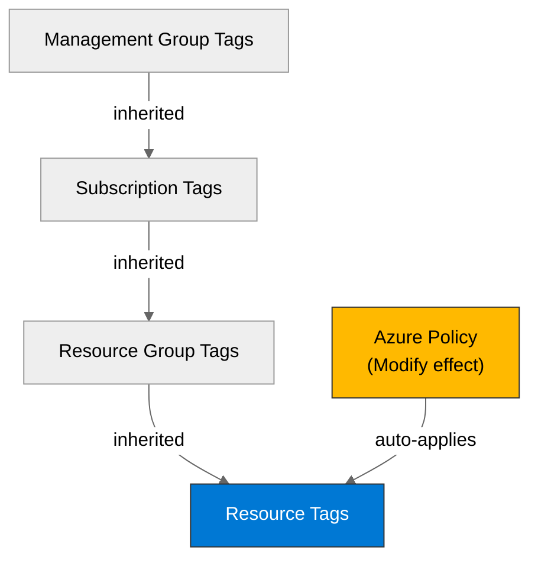

# 🛡️ Governance Constraints - contoso-service-hub-run-3


<details open>
<summary><strong>📑 Governance Contents</strong></summary>

- [🔍 Discovery Source](#-discovery-source)
- [📋 Azure Policy Compliance](#-azure-policy-compliance)
- [🔄 Plan Adaptations Based on Policies](#-plan-adaptations-based-on-policies)
- [🚫 Deployment Blockers](#-deployment-blockers)
- [🏷️ Required Tags](#-required-tags)
- [🔐 Security Policies](#-security-policies)
- [💰 Cost Policies](#-cost-policies)
- [🌐 Network Policies](#-network-policies)
- [References](#references)

</details>

> Generated by bicep-plan agent | 2026-03-17

| ⬅️ Previous                                        | 📑 Index            | Next ➡️                                                |
| -------------------------------------------------- | ------------------- | ------------------------------------------------------ |
| [03-des-cost-estimate.md](03-des-cost-estimate.md) | [README](README.md) | [04-implementation-plan.md](04-implementation-plan.md) |

This document captures the governance constraints and Azure Policy requirements
that must be addressed in the Bicep implementation.

## 🔍 Discovery Source

> [!IMPORTANT]
> Governance constraints were discovered from live Azure Policy assignments through ARM REST, then reduced to controls relevant to the architecture in [02-architecture-assessment.md](02-architecture-assessment.md).

| Query              | Results                             | Timestamp            |
| ------------------ | ----------------------------------- | -------------------- |
| Policy Assignments | 21 assignments discovered           | 2026-03-17T11:20:10Z |
| Tag Policies       | 2 direct tag assignments discovered | 2026-03-17T11:20:10Z |
| Security Policies  | 17 architecture-relevant controls   | 2026-03-17T11:20:10Z |

**Discovery Method**: ARM REST via `az rest`
**Subscription**: `noalz` (`00858ffc-dded-4f0f-8bbf-e17fff0d47d9`)
**Scope**: Subscription + inherited management group assignments

> [!NOTE]
> This automated E2E run had Azure credentials. The output below distinguishes between:
>
> 1. live tenant-enforced controls discovered from assigned definitions, and
> 2. project baseline constraints required by the architecture where no explicit tenant deny was discovered.

### Policy Definition Analysis

> [!IMPORTANT]
> **MANDATORY**: For all Deny and Modify policies, the policy definition JSON was inspected to determine actual blocking behavior rather than trusting initiative names.

| Policy Display Name                                                                                                   | Assignment Scope | Effect | Actually Blocks                                                                        | Evidence from policyRule.if                                                                                                                                                                                                                                                                    | Bicep Property Path                | Required Value                |
| --------------------------------------------------------------------------------------------------------------------- | ---------------- | ------ | -------------------------------------------------------------------------------------- | ---------------------------------------------------------------------------------------------------------------------------------------------------------------------------------------------------------------------------------------------------------------------------------------------- | ---------------------------------- | ----------------------------- |
| JV-Enforce Resource Group Tags                                                                                        | Management Group | Deny   | Creation of resource groups missing any of the nine required lowercase governance tags | `field: "type" = "Microsoft.Resources/subscriptions/resourceGroups"` plus `anyOf` missing `tags['environment']`, `tags['owner']`, `tags['costcenter']`, `tags['application']`, `tags['workload']`, `tags['sla']`, `tags['backup-policy']`, `tags['maint-window']`, `tags['technical-contact']` | `tags` on resource group           | All nine tags required        |
| Deny AKS deployment with agent pool count greater than 10                                                             | Management Group | Deny   | AKS clusters with more than 10 agent pools                                             | `field: "type" = "Microsoft.ContainerService/managedClusters"` and `count(field: agentPoolProfiles[*]) > 10`                                                                                                                                                                                   | `properties.agentPoolProfiles`     | Max 10 pools                  |
| Block Azure RM Resource Creation                                                                                      | Management Group | Deny   | Classic resource types only, not modern ARM resources in this design                   | Policy set reference resolves to `NotAllowedResourceTypes` for `microsoft.classic*` providers                                                                                                                                                                                                  | N/A                                | N/A                           |
| JV - Inherit Multiple Tags from Resource Group                                                                        | Management Group | Modify | Resources missing inherited governance tags                                            | `exists: false` checks for 9 tag keys, then `addOrReplace` operations from `resourceGroup().tags[...]`                                                                                                                                                                                         | `tags`                             | Inherit RG tags               |
| Ensure secure access to storage account containers                                                                    | Management Group | Modify | Storage accounts with missing or enabled blob public access                            | `field: type = Microsoft.Storage/storageAccounts` and `allowBlobPublicAccess` missing or `true`                                                                                                                                                                                                | `properties.allowBlobPublicAccess` | `false`                       |
| SFI-ID4.2.1 Storage Accounts - Safe Secrets Standard                                                                  | Management Group | Modify | Storage accounts using shared key auth unless exempted by `SecurityControl=Ignore`     | `field: allowSharedKeyAccess != false` and no exclusion tag at resource or RG scope                                                                                                                                                                                                            | `properties.allowSharedKeyAccess`  | `false`                       |
| Add system-assigned managed identity to enable Guest Configuration assignments on virtual machines with no identities | Management Group | Modify | Windows Desktop VMs without any identity                                               | `field: type = Microsoft.Compute/virtualMachines` plus Windows Desktop image checks and missing `identity.type`                                                                                                                                                                                | `identity.type`                    | `SystemAssigned`              |
| Add system-assigned managed identity to enable Guest Configuration assignments on VMs with a user-assigned identity   | Management Group | Modify | Windows Desktop VMs with only user-assigned identity                                   | Same VM image filters plus `contains: UserAssigned` and not `SystemAssigned`                                                                                                                                                                                                                   | `identity.type`                    | `UserAssigned,SystemAssigned` |

**Analysis Notes**:

- `Block Azure RM Resource Creation` is not a blocker for this project because it only denies classic compute, classic network, and classic storage resources.
- The subscription does not expose a direct deny assignment for EU-only locations. EU residency remains a project compliance baseline from requirements and architecture, not a tenant-enforced deny discovered in this run.
- The subscription exposes audit coverage for several project controls through the GDPR initiative rather than direct deny policies. Those still need explicit IaC implementation to avoid non-compliance findings.

## 📋 Azure Policy Compliance

| Category       | Constraint                                                                                                        | Implementation                                                                                             | Status |
| -------------- | ----------------------------------------------------------------------------------------------------------------- | ---------------------------------------------------------------------------------------------------------- | ------ |
| Naming         | No classic Azure resource types                                                                                   | Use ARM-native resources and AVM modules only                                                              | ✅     |
| Tagging        | Resource groups must include 9 lowercase governance tags; resources inherit them                                  | Populate RG tags first, then apply inherited and project tags consistently                                 | ❌     |
| Security       | Storage public access and shared key auth are auto-remediated; VM MI is auto-added for scoped Windows Desktop VMs | Set secure values explicitly in IaC to avoid drift and remediation churn                                   | ⚠️     |
| Data Residency | No explicit tenant deny found for EU-only regions; project still requires EU-only deployment                      | Restrict all planned regions to `swedencentral`, `westeurope`, `germanywestcentral` in plan and parameters | ⚠️     |

> [!WARNING]
> Any ❌ items are deployment blockers. Resource group tag compliance must be resolved before code generation.

## 🔄 Plan Adaptations Based on Policies

> [!NOTE]
> This section documents how the implementation plan must adapt to comply with live assignments and project governance baseline.

### Architectural Changes

| Original Design                                          | Blocking Policy                                                                                 | Effect       | Adaptation Applied                                                                                                   |
| -------------------------------------------------------- | ----------------------------------------------------------------------------------------------- | ------------ | -------------------------------------------------------------------------------------------------------------------- |
| AKS with flexible pool expansion                         | Deny AKS deployment with agent pool count greater than 10                                       | Deny         | Keep system + user pools at 10 or fewer total; model scale by node count and workload placement, not many pools      |
| Four project tags only                                   | JV-Enforce Resource Group Tags                                                                  | Deny         | Add nine lowercase governance tags to the resource group and preserve project tags as supplemental tags where needed |
| APIM internal VNet and Front Door as sole public ingress | No direct tenant deny discovered                                                                | Baseline gap | Enforce internal APIM mode in IaC and document it as architecture-mandated rather than tenant-enforced               |
| EU-only deployment requirement                           | No explicit allowed-locations deny discovered                                                   | Baseline gap | Hard-pin regions to `swedencentral`, `westeurope`, and `germanywestcentral` in IaC parameters and validation         |
| PostgreSQL Flexible Server with private access           | GDPR initiative audit: public network access should be disabled for PostgreSQL flexible servers | Audit        | Use delegated subnet or private endpoint only; set public network access to disabled                                 |
| Redis Premium P4 for application caching                 | GDPR initiative audit: Azure Cache for Redis should use private link                            | Audit        | Add private endpoint and disable any public data-plane dependency                                                    |

### Auto-Applied Resources

| Policy                                                                                                                | Effect | Auto-Applied Resource                                                           |
| --------------------------------------------------------------------------------------------------------------------- | ------ | ------------------------------------------------------------------------------- |
| JV - Inherit Multiple Tags from Resource Group                                                                        | Modify | Missing resource tags inherited from the resource group                         |
| Add system-assigned managed identity to enable Guest Configuration assignments on virtual machines with no identities | Modify | System-assigned identity on targeted Windows Desktop VMs                        |
| Add system-assigned managed identity to enable Guest Configuration assignments on VMs with a user-assigned identity   | Modify | Combined `UserAssigned,SystemAssigned` identity on targeted Windows Desktop VMs |

### Auto-Modified Configurations

| Policy                                               | Effect | Auto-Applied Change                                                                 |
| ---------------------------------------------------- | ------ | ----------------------------------------------------------------------------------- |
| Ensure secure access to storage account containers   | Modify | Forces `allowBlobPublicAccess = false`                                              |
| SFI-ID4.2.1 Storage Accounts - Safe Secrets Standard | Modify | Forces `allowSharedKeyAccess = false` unless exempted with `SecurityControl=Ignore` |

## 🚫 Deployment Blockers

> [!CAUTION]
> **CRITICAL**: This section lists policies that can block deployment or materially change deployment behavior.

### JV-Enforce Resource Group Tags

- **Policy ID**: `27833bcf-5909-4a37-891c-16a3cb06856d`
- **Effect**: Deny
- **Scope**: Management Group
- **Enforcement Mode**: Default
- **Impact**: Resource group creation fails unless all nine lowercase governance tags are present.
- **Assessment Date**: 2026-03-17

**Resolution Options**:

1. **Request Policy Exemption**:
   - **Justification**: Only if the subscription owner confirms a project-specific exception to the management-group tag baseline.
   - **Duration**: Temporary
   - **Risk Level**: High
   - **Approval Process**: Management group policy owner approval required.

2. **Alternative Architecture**:
   - Make the resource group the authoritative tag source with the nine lowercase governance tags, then inherit them to all resources.
   - **Trade-offs**: Slightly larger tag payload and mapping overhead in Bicep, but fully compliant.

**Status**: ⚠️ **DEPLOYMENT CANNOT PROCEED WITHOUT RESOLUTION**

**Next Steps**:

- [x] Align resource group tags to the management-group baseline
- [ ] Confirm whether project tags `Environment`, `ManagedBy`, `Project`, `Owner` must coexist with lowercase governance tags or be mapped downstream

### Deny AKS deployment with agent pool count greater than 10

- **Policy ID**: `AKS_LimitNodeCount_Deny`
- **Effect**: Deny
- **Scope**: Management Group
- **Enforcement Mode**: Default
- **Impact**: AKS deployment fails if `agentPoolProfiles` exceeds 10 entries.
- **Assessment Date**: 2026-03-17

**Resolution Options**:

1. **Request Policy Exemption**:
   - **Justification**: Only if the cluster design genuinely requires more than 10 pools.
   - **Duration**: Temporary or permanent
   - **Risk Level**: Medium
   - **Approval Process**: Management group policy owner approval required.

2. **Alternative Architecture**:
   - Consolidate pool strategy to a small set of system and workload pools.
   - **Trade-offs**: Fewer isolation boundaries, but simpler cluster operations and lower policy friction.

**Status**: ✅ **CURRENT ARCHITECTURE CAN PROCEED IF POOL COUNT STAYS ≤ 10**

**Next Steps**:

- [x] Keep AKS pool design under the policy limit in Step 4 planning

## 🏷️ Required Tags

All resources must include the following tags at minimum from project governance:

```bicep
tags: {
  Environment: environment
  Project: projectName
  ManagedBy: 'Bicep'
  Owner: owner
}
```

Live tenant governance also requires the following lowercase resource-group tag keys:

- `environment`
- `owner`
- `costcenter`
- `application`
- `workload`
- `sla`
- `backup-policy`
- `maint-window`
- `tech-contact`



> Use the lowercase tag set to satisfy the live deny policy. Add project tags in parallel if downstream reporting requires them.

## 🔐 Security Policies

| Policy           | Requirement                                                                                                                                                                                |
| ---------------- | ------------------------------------------------------------------------------------------------------------------------------------------------------------------------------------------ |
| HTTPS Only       | Project baseline: enforce HTTPS-only for Front Door, APIM, Storage, Key Vault, and any App Service adjuncts; live GDPR initiative audits HTTPS on App Service only                         |
| TLS Version      | Storage accounts must use the specified minimum TLS version; project baseline requires TLS 1.2 minimum on all services                                                                     |
| Public Access    | Storage blob public access is auto-disabled; PostgreSQL Flexible Server public network access should be disabled; APIM must remain internal by design                                      |
| Managed Identity | VM managed identity is auto-added for targeted Windows Desktop VMs; project baseline is explicit managed identity for AKS, APIM, and compute workloads                                     |
| Key Vault        | Key Vault deletion protection should be enabled; keys and secrets should have expiration dates; purge protection must be enabled in IaC                                                    |
| AKS              | Authorized IP ranges should be defined and the Azure Policy add-on should be enabled; network policy remains a project baseline requirement because no direct tenant policy was discovered |
| Storage          | `allowBlobPublicAccess = false`, `allowSharedKeyAccess = false`, secure transfer enabled, minimum TLS 1.2                                                                                  |
| Redis            | Use private link; keep Redis off public application paths                                                                                                                                  |

## 💰 Cost Policies

| Policy            | Constraint                                                                                                                                                                      |
| ----------------- | ------------------------------------------------------------------------------------------------------------------------------------------------------------------------------- |
| Budget            | No live Azure Policy budget control discovered; continue using the architecture budget envelope of ~$9,280/month across 3 environments                                          |
| SKU Restrictions  | VM SKUs in H-, M-, and N-series are denied by the custom `VirtualMachine_SKU_Deny` policies in `MCAPSGovDenyPolicies`; planned D-series VMs and AKS D8s_v5 nodes are unaffected |
| Reserved Capacity | No live reserved-capacity policy discovered                                                                                                                                     |

## 🌐 Network Policies

| Policy            | Constraint                                                                                                                                                           |
| ----------------- | -------------------------------------------------------------------------------------------------------------------------------------------------------------------- |
| Private Endpoints | GDPR initiative audits private link for Azure Cache for Redis; project baseline extends private access to PostgreSQL, Storage, Key Vault, and APIM integration paths |
| VNet Integration  | APIM must use internal VNet mode by architecture decision; AKS remains VNet-integrated with NSG-protected subnets                                                    |
| Public Endpoints  | Front Door + WAF is the only intended public ingress; PostgreSQL public network access should be disabled; storage public access is disallowed                       |

---

## References

| Topic                       | Link                                                                                                                       |
| --------------------------- | -------------------------------------------------------------------------------------------------------------------------- |
| Azure Policy                | [Overview](https://learn.microsoft.com/azure/governance/policy/overview)                                                   |
| Azure Resource Manager REST | [ARM REST reference](https://learn.microsoft.com/rest/api/resources/)                                                      |
| Tag Governance              | [Tagging Strategy](https://learn.microsoft.com/azure/cloud-adoption-framework/ready/azure-best-practices/resource-tagging) |

---

_Governance constraints discovered from ARM REST and assignment definition analysis._
_See [governance-discovery.instructions.md](/.github/instructions/governance-discovery.instructions.md) for discovery methodology._

---

<div align="center">

| ⬅️ [03-des-cost-estimate.md](03-des-cost-estimate.md) | 🏠 [Project Index](README.md) | ➡️ [04-implementation-plan.md](04-implementation-plan.md) |
| ----------------------------------------------------- | ----------------------------- | --------------------------------------------------------- |

</div>
