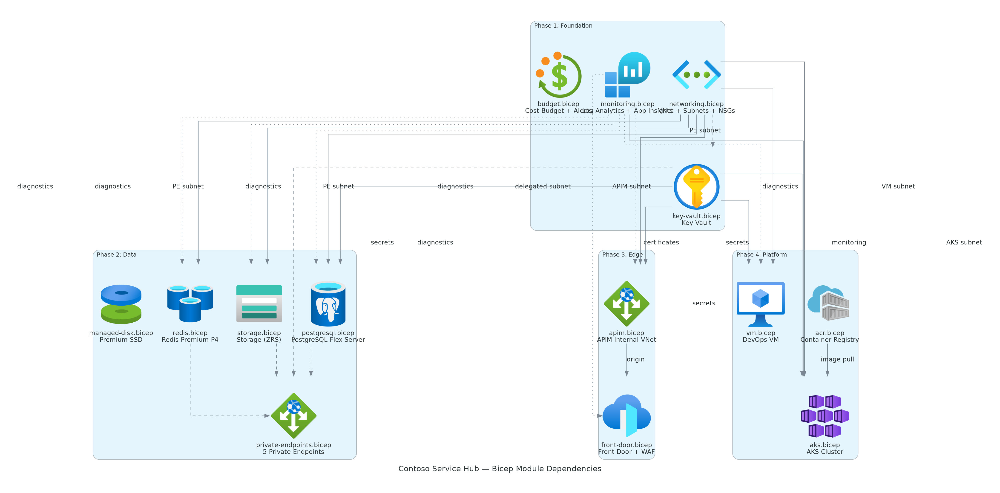
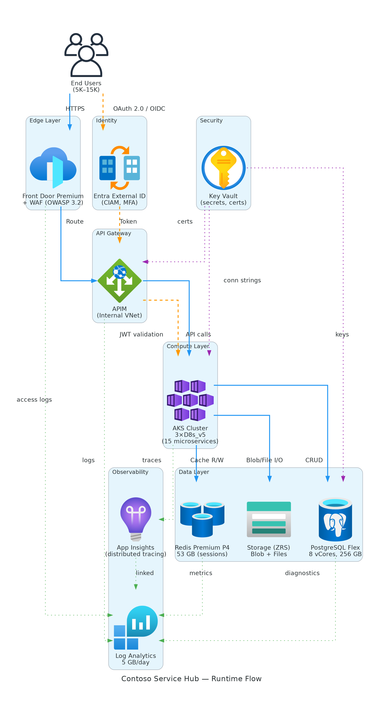

# 📀 Step 4: Implementation Plan - Contoso Service Hub


<details open>
<summary><strong>📑 Implementation Contents</strong></summary>

- [📋 Overview](#-overview)
- [📦 Resource Inventory](#-resource-inventory)
- [🗂️ Module Structure](#-module-structure)
- [🔨 Implementation Tasks](#-implementation-tasks)
- [🚀 Deployment Phases](#-deployment-phases)
- [🔗 Dependency Graph](#-dependency-graph)
- [🔄 Runtime Flow Diagram](#-runtime-flow-diagram)
- [🏷️ Naming Conventions](#-naming-conventions)
- [🔐 Security Configuration](#-security-configuration)
- [⏱️ Estimated Implementation Time](#-estimated-implementation-time)
- [🔒 Approval Gate](#-approval-gate)
- [References](#references)

</details>

> Generated by bicep-plan agent | 2026-03-17

| ⬅️ Previous                                                  | 📑 Index            | Next ➡️                                        |
| ------------------------------------------------------------ | ------------------- | ---------------------------------------------- |
| [04-governance-constraints.md](04-governance-constraints.md) | [README](README.md) | [04-preflight-check.md](04-preflight-check.md) |

## 📋 Overview

Contoso Service Hub is a greenfield full-stack digital services platform for a mixed-use real estate and lifestyle ecosystem. This plan details the Bicep implementation for **15 Azure services** across **3 environments** (Dev, Staging, Production) in **swedencentral**, following an AVM-first module selection strategy with phased deployment.

| Property                   | Value                                                   |
| -------------------------- | ------------------------------------------------------- |
| **Project**                | contoso-service-hub-run-3                               |
| **Architecture Pattern**   | N-Tier Web + Container (Enterprise)                     |
| **Region**                 | swedencentral (EU GDPR-compliant)                       |
| **Environments**           | dev, staging, prod                                      |
| **IaC Tool**               | Bicep (AVM-first)                                       |
| **Estimated Monthly Cost** | ~$9,280 (all environments)                              |
| **Complexity**             | Complex (15 services, 3 envs, GDPR, 99.9% SLA)          |
| **Deployment Strategy**    | Phased: Foundation → Data → Edge → Platform             |
| **Governance Blockers**    | 2 (CTRL-001: RG tags, CTRL-002: AKS pool limit ≤10)     |
| **Governance Warnings**    | 10 (all addressed in security configuration matrix)     |
| **Auto-Remediation**       | 5 (tag inheritance, blob access, shared-key, MI on VMs) |

### Governance Summary

All controls from `04-governance-constraints.json` are incorporated:

- **CTRL-001 (Blocker)**: Resource groups must include 9 lowercase governance tags → enforced in `main.bicep` parameters
- **CTRL-002 (Blocker)**: AKS agent pool count ≤ 10 → architecture uses 2 pools (system + user), well within limit
- **CTRL-003 (Cleared)**: Classic resource block — not applicable (all ARM-native)
- **CTRL-004–008 (Auto-remediation)**: Tag inheritance, blob access, shared-key, VM managed identity — handled by policy; IaC sets compliant values proactively
- **CTRL-009–022 (Warnings)**: AKS authorized IPs, Policy add-on, network policy, PostgreSQL private access, Redis PE, Storage TLS/HTTPS, Key Vault purge/soft-delete, EU region, APIM internal mode, Front Door WAF sole ingress — all addressed in security configuration

---

## 📦 Resource Inventory

| #   | Resource                       | Type                                         | SKU (Prod)                       | SKU (Staging)                    | SKU (Dev)                | AVM Module                                             | AVM Version | Dependencies                                     | Est. Cost (Prod) |
| --- | ------------------------------ | -------------------------------------------- | -------------------------------- | -------------------------------- | ------------------------ | ------------------------------------------------------ | ----------- | ------------------------------------------------ | ---------------: |
| 1   | Log Analytics Workspace        | `Microsoft.OperationalInsights/workspaces`   | PerGB2018, 5 GB/day              | PerGB2018, 2 GB/day              | PerGB2018, 1 GB/day      | `br/public:avm/res/operational-insights/workspace`     | 0.15.0      | —                                                |             $230 |
| 2   | Application Insights           | `Microsoft.Insights/components`              | —                                | —                                | —                        | `br/public:avm/res/insights/component`                 | 0.7.1       | Log Analytics                                    |              $50 |
| 3   | Key Vault                      | `Microsoft.KeyVault/vaults`                  | Standard                         | Standard                         | Standard                 | `br/public:avm/res/key-vault/vault`                    | 0.13.3      | VNet (PE subnet)                                 |              $10 |
| 4   | Virtual Network                | `Microsoft.Network/virtualNetworks`          | 5 subnets                        | 5 subnets                        | 3 subnets                | `br/public:avm/res/network/virtual-network`            | 0.7.2       | —                                                |               $0 |
| 5   | NSG (×5)                       | `Microsoft.Network/networkSecurityGroups`    | Per-subnet                       | Per-subnet                       | Per-subnet               | `br/public:avm/res/network/network-security-group`     | 0.5.2       | —                                                |               $0 |
| 6   | Budget                         | `Microsoft.Consumption/budgets`              | $10,000/mo                       | $5,000/mo                        | $2,000/mo                | `br/public:avm/res/consumption/budget/rg-scope`        | 0.1.0       | —                                                |               $0 |
| 7   | PostgreSQL Flexible Server     | `Microsoft.DBforPostgreSQL/flexibleServers`  | GP 8 vCores, 256 GB              | GP 4 vCores, 128 GB              | Burstable B2s, 32 GB     | `br/public:avm/res/db-for-postgre-sql/flexible-server` | 0.15.2      | VNet (delegated subnet), Key Vault               |             $720 |
| 8   | Redis Cache                    | `Microsoft.Cache/Redis`                      | Premium P4 (53 GB)               | Premium P1 (6 GB)                | Basic C0 (250 MB)        | `br/public:avm/res/cache/redis`                        | 0.16.4      | VNet (PE subnet)                                 |           $1,455 |
| 9   | Storage Account (Blob + Files) | `Microsoft.Storage/storageAccounts`          | Standard ZRS Hot                 | Standard LRS Hot                 | Standard LRS Hot         | `br/public:avm/res/storage/storage-account`            | 0.32.0      | VNet (PE subnet)                                 |              $91 |
| 10  | Managed Disk                   | `Microsoft.Compute/disks`                    | Premium SSD P15, 256 GB          | Standard SSD E15, 256 GB         | Standard SSD E10, 128 GB | `br/public:avm/res/compute/disk`                       | 0.6.0       | —                                                |              $35 |
| 11  | API Management                 | `Microsoft.ApiManagement/service`            | Standard (1 unit), Internal VNet | Standard (1 unit), Internal VNet | Developer (1 unit)       | `br/public:avm/res/api-management/service`             | 0.14.1      | VNet (APIM subnet), Key Vault                    |             $700 |
| 12  | Front Door + WAF               | `Microsoft.Cdn/profiles`                     | Premium, WAF OWASP 3.2           | Standard                         | Standard                 | `br/public:avm/res/cdn/profile`                        | 0.19.0      | APIM (origin)                                    |             $460 |
| 13  | AKS Cluster                    | `Microsoft.ContainerService/managedClusters` | Standard, 3×D8s_v5 (3 AZs)       | Standard, 2×D4s_v5               | Free, 1×D4s_v5           | `br/public:avm/res/container-service/managed-cluster`  | 0.13.0      | VNet (AKS subnet), Key Vault, ACR, Log Analytics |             $883 |
| 14  | Virtual Machine                | `Microsoft.Compute/virtualMachines`          | D8s_v5                           | D4s_v5                           | B2s                      | `br/public:avm/res/compute/virtual-machine`            | 0.21.0      | VNet (VM subnet), Key Vault                      |             $280 |
| 15  | Container Registry             | `Microsoft.ContainerRegistry/registries`     | Standard                         | Standard                         | Basic                    | `br/public:avm/res/container-registry/registry`        | 0.11.0      | —                                                |              $20 |
| 16  | Private Endpoints (×5)         | `Microsoft.Network/privateEndpoints`         | —                                | —                                | —                        | `br/public:avm/res/network/private-endpoint`           | 0.12.0      | VNet (PE subnet), target resources               |              $37 |

**AVM Coverage**: 16/16 resources (100%) use Azure Verified Modules.

> **Note**: Microsoft Entra External ID (free tier, 15K MAU) and Microsoft Defender for Cloud (Server P2, $45/mo) are tenant/subscription-level services configured outside Bicep resource group scope. They are documented here for completeness but not included in the module structure.

### Environment Cost Summary

| Environment     | Monthly Estimate | Scaling Factor | Notes                                          |
| --------------- | ---------------: | :------------: | ---------------------------------------------- |
| **Production**  |           $5,016 |      100%      | Full SKUs, zone-redundant, 3-node AKS          |
| **Staging**     |           $3,010 |      ~60%      | Fewer nodes, smaller cache/DB, shared ACR      |
| **Development** |           $1,254 |      ~25%      | Burstable, consumption-tier, minimal sizing    |
| **Total**       |       **$9,280** |       —        | Within ~$12K budget envelope (77% utilization) |

### Budget Alerts Configuration

Per `iac-cost-repeatability.instructions.md`, each environment includes:

| Alert Type  | Thresholds                | Action                             |
| ----------- | ------------------------- | ---------------------------------- |
| Actual cost | 80%, 100% of budget       | Email notification to cost-contact |
| Forecast    | 80%, 100%, 120% of budget | Email notification to cost-contact |

---

## 🗂️ Module Structure

```text
infra/bicep/contoso-service-hub-run-3/
├── main.bicep                          # Orchestrator — parameters, variables, module calls
├── main.bicepparam                     # Parameter file (environment-specific values)
├── modules/
│   ├── monitoring.bicep                # Log Analytics + App Insights
│   ├── networking.bicep                # VNet + Subnets + NSGs
│   ├── key-vault.bicep                 # Key Vault + access policies + PE
│   ├── budget.bicep                    # Cost Management budget + alerts
│   ├── postgresql.bicep                # PostgreSQL Flexible Server + PE
│   ├── redis.bicep                     # Redis Cache + PE
│   ├── storage.bicep                   # Storage Account (Blob + Files) + PE
│   ├── managed-disk.bicep              # Premium SSD managed disk
│   ├── apim.bicep                      # API Management (internal VNet mode)
│   ├── front-door.bicep                # Front Door Premium + WAF policy
│   ├── aks.bicep                       # AKS cluster + node pools
│   ├── vm.bicep                        # DevOps VM
│   ├── acr.bicep                       # Container Registry
│   └── private-endpoints.bicep         # Shared PE module for data services
└── deploy.ps1                          # Deployment script (lint → build → what-if → deploy)
```

| Module                  | AVM Source                                             | Version | Purpose                                       |
| ----------------------- | ------------------------------------------------------ | ------- | --------------------------------------------- |
| monitoring.bicep        | `br/public:avm/res/operational-insights/workspace`     | 0.15.0  | Log Analytics workspace (shared)              |
| monitoring.bicep        | `br/public:avm/res/insights/component`                 | 0.7.1   | Application Insights (linked to LAW)          |
| networking.bicep        | `br/public:avm/res/network/virtual-network`            | 0.7.2   | VNet with 5 subnets                           |
| networking.bicep        | `br/public:avm/res/network/network-security-group`     | 0.5.2   | NSG per subnet (×5)                           |
| key-vault.bicep         | `br/public:avm/res/key-vault/vault`                    | 0.13.3  | Key Vault with soft-delete + purge protection |
| budget.bicep            | `br/public:avm/res/consumption/budget/rg-scope`        | 0.1.0   | Budget with forecast + anomaly alerts         |
| postgresql.bicep        | `br/public:avm/res/db-for-postgre-sql/flexible-server` | 0.15.2  | PostgreSQL Flex (zone-redundant HA)           |
| redis.bicep             | `br/public:avm/res/cache/redis`                        | 0.16.4  | Redis Premium (zone-redundant, AOF)           |
| storage.bicep           | `br/public:avm/res/storage/storage-account`            | 0.32.0  | Storage (ZRS, HTTPS-only, TLS 1.2)            |
| managed-disk.bicep      | `br/public:avm/res/compute/disk`                       | 0.6.0   | Premium SSD managed disk                      |
| apim.bicep              | `br/public:avm/res/api-management/service`             | 0.14.1  | APIM internal VNet mode                       |
| front-door.bicep        | `br/public:avm/res/cdn/profile`                        | 0.19.0  | Front Door Premium + WAF                      |
| aks.bicep               | `br/public:avm/res/container-service/managed-cluster`  | 0.13.0  | AKS with system + user pools                  |
| vm.bicep                | `br/public:avm/res/compute/virtual-machine`            | 0.21.0  | DevOps/tooling VM                             |
| acr.bicep               | `br/public:avm/res/container-registry/registry`        | 0.11.0  | Container Registry                            |
| private-endpoints.bicep | `br/public:avm/res/network/private-endpoint`           | 0.12.0  | PE for PostgreSQL, Redis, KV, Blob, Files     |

---

## 🔨 Implementation Tasks

### Task 1: main.bicep (Orchestration)

**Purpose**: Entry point that wires parameters, generates the unique suffix, and calls all modules in dependency order.

**Parameters**:

```yaml
- environmentName: string # 'dev' | 'staging' | 'prod'
- location: string # Default: 'swedencentral'
- projectName: string # Default: 'csh' (contoso-service-hub short)
- aksNodeCount: int # 3 (prod), 2 (staging), 1 (dev)
- aksVmSize: string # 'Standard_D8s_v5' (prod), 'Standard_D4s_v5' (staging/dev)
- postgresqlSkuTier: string # 'GeneralPurpose' | 'Burstable'
- postgresqlSkuName: string # 'Standard_D8s_v3' | 'Standard_D4s_v3' | 'Standard_B2s'
- postgresqlStorageSizeGB: int # 256 | 128 | 32
- redisSku: string # 'Premium' | 'Basic'
- redisCapacity: int # 4 (P4) | 1 (P1) | 0 (C0)
- budgetAmount: int # 10000 | 5000 | 2000
- costContactEmail: string # Budget alert recipient
- governanceTags: object # 9 lowercase governance tags (CTRL-001 compliance)
```

**Variables**:

```yaml
- uniqueSuffix: uniqueString(resourceGroup().id) # 13-char hash for globally unique names
- resourcePrefix: "${projectName}-${environmentName}"
```

**Modules Called** (in dependency order):

1. `monitoring.bicep` → outputs: `logAnalyticsWorkspaceId`, `appInsightsId`, `appInsightsConnectionString`
2. `networking.bicep` → outputs: `vnetId`, `subnetIds` (object with AKS, APIM, PE, PG, VM)
3. `key-vault.bicep` → outputs: `keyVaultId`, `keyVaultUri`
4. `budget.bicep` → outputs: (none — fire-and-forget)
5. `postgresql.bicep` → outputs: `postgresqlFqdn`, `postgresqlId`
6. `redis.bicep` → outputs: `redisHostName`, `redisId`
7. `storage.bicep` → outputs: `storageAccountId`, `blobEndpoint`, `fileEndpoint`
8. `managed-disk.bicep` → outputs: `diskId`
9. `acr.bicep` → outputs: `acrLoginServer`, `acrId`
10. `apim.bicep` → outputs: `apimGatewayUrl`, `apimPrivateIp`
11. `front-door.bicep` → outputs: `frontDoorEndpoint`, `frontDoorId`
12. `aks.bicep` → outputs: `aksClusterName`, `aksFqdn`, `aksIdentityPrincipalId`
13. `vm.bicep` → outputs: `vmId`
14. `private-endpoints.bicep` → outputs: (none — connects PE to target resources)

### Task 2: modules/monitoring.bicep

**Resources**:

- Log Analytics Workspace (`avm/res/operational-insights/workspace`)
- Application Insights (`avm/res/insights/component`)

**Key Configuration**:

```yaml
- retentionInDays: 30
- dailyQuotaGb: environment == 'prod' ? 5 : environment == 'staging' ? 2 : 1
- diagnosticSettings: self-logging to same workspace
```

**Outputs**: `logAnalyticsWorkspaceId`, `appInsightsId`, `appInsightsConnectionString`

### Task 3: modules/networking.bicep

**Resources**:

- VNet with address space `10.0.0.0/16`
- 5 subnets (prod/staging) or 3 subnets (dev):
  - `snet-aks-{env}` — `10.0.0.0/21` (2,048 IPs for AKS pods + nodes)
  - `snet-apim-{env}` — `10.0.8.0/24` (APIM delegation)
  - `snet-pe-{env}` — `10.0.9.0/24` (private endpoints for data services)
  - `snet-pg-{env}` — `10.0.10.0/24` (PostgreSQL delegated subnet)
  - `snet-vm-{env}` — `10.0.11.0/24` (VM subnet)
- NSG per subnet with baseline deny rules

**Outputs**: `vnetId`, `subnetIds` (object)

### Task 4: modules/key-vault.bicep

**Resources**:

- Key Vault (`avm/res/key-vault/vault`)

**Key Configuration** (CTRL-018, CTRL-019):

```yaml
- enableSoftDelete: true
- enablePurgeProtection: true
- enableRbacAuthorization: true
- networkAcls: deny by default, allow from VNet subnets
- diagnosticSettings: → Log Analytics
```

**Outputs**: `keyVaultId`, `keyVaultUri`

### Task 5: modules/budget.bicep

**Resources**:

- Budget (`avm/res/consumption/budget/rg-scope`)

**Key Configuration**:

```yaml
- amount: budgetAmount (per environment)
- timeGrain: Monthly
- notifications:
    - actual_80: threshold 80%, operator GreaterThan
    - actual_100: threshold 100%, operator GreaterThan
    - forecast_80: threshold 80%, operator GreaterThan, thresholdType Forecasted
    - forecast_100: threshold 100%, operator GreaterThan, thresholdType Forecasted
    - forecast_120: threshold 120%, operator GreaterThan, thresholdType Forecasted
- contactEmails: [costContactEmail]
```

### Task 6: modules/postgresql.bicep

**Resources**:

- PostgreSQL Flexible Server (`avm/res/db-for-postgre-sql/flexible-server`)

**Key Configuration** (CTRL-012, CTRL-013):

```yaml
- version: '16'
- sku: { tier: postgresqlSkuTier, name: postgresqlSkuName }
- storage: { storageSizeGB: postgresqlStorageSizeGB }
- highAvailability: { mode: environment == 'prod' ? 'ZoneRedundant' : 'Disabled' }
- backup: { backupRetentionDays: 35, geoRedundantBackup: 'Disabled' }  # GDPR: no cross-region
- network: { delegatedSubnetResourceId: subnetIds.pg, publicNetworkAccess: 'Disabled' }
- diagnosticSettings: → Log Analytics
```

**Outputs**: `postgresqlFqdn`, `postgresqlId`

### Task 7: modules/redis.bicep

**Resources**:

- Redis Cache (`avm/res/cache/redis`)

**Key Configuration** (CTRL-014):

```yaml
- sku: { name: redisSku, family: environment == 'dev' ? 'C' : 'P', capacity: redisCapacity }
- minimumTlsVersion: '1.2'
- enableNonSslPort: false
- redisConfiguration: { aof-backup-enabled: environment == 'prod' ? '1' : '0' }
- zones: environment == 'prod' ? ['1', '2', '3'] : null
- publicNetworkAccess: environment != 'dev' ? 'Disabled' : 'Enabled'
- diagnosticSettings: → Log Analytics
```

**Outputs**: `redisHostName`, `redisId`

### Task 8: modules/storage.bicep

**Resources**:

- Storage Account (`avm/res/storage/storage-account`)

**Key Configuration** (CTRL-005, CTRL-006, CTRL-015, CTRL-016, CTRL-017):

```yaml
- kind: 'StorageV2'
- sku: { name: environment == 'prod' ? 'Standard_ZRS' : 'Standard_LRS' }
- minimumTlsVersion: 'TLS1_2'
- supportsHttpsTrafficOnly: true
- allowBlobPublicAccess: false
- allowSharedKeyAccess: false
- networkAcls: { defaultAction: 'Deny', virtualNetworkRules: [peSubnet] }
- blobServices: { containers: ['content', 'uploads', 'backups'] }
- fileServices: { shares: [{ name: 'shared', shareQuota: 256, accessTier: 'Premium' }] }
- diagnosticSettings: → Log Analytics
```

**Outputs**: `storageAccountId`, `blobEndpoint`, `fileEndpoint`

### Task 9: modules/managed-disk.bicep

**Resources**:

- Managed Disk (`avm/res/compute/disk`)

**Key Configuration**:

```yaml
- sku: { name: environment == 'prod' ? 'Premium_LRS' : 'StandardSSD_LRS' }
- diskSizeGB: environment == 'prod' ? 256 : environment == 'staging' ? 256 : 128
- zones: environment == 'prod' ? ['1'] : null
- encryption: { type: 'EncryptionAtRestWithPlatformKey' }
```

**Outputs**: `diskId`

### Task 10: modules/acr.bicep

**Resources**:

- Container Registry (`avm/res/container-registry/registry`)

**Key Configuration**:

```yaml
- sku: { name: environment == 'dev' ? 'Basic' : 'Standard' }
- adminUserEnabled: false
- publicNetworkAccess: 'Enabled'  # ACR pull from AKS via managed identity
- diagnosticSettings: → Log Analytics
```

**Outputs**: `acrLoginServer`, `acrId`

### Task 11: modules/apim.bicep

**Resources**:

- API Management (`avm/res/api-management/service`)

**Key Configuration** (CTRL-021):

```yaml
- sku: { name: environment == 'dev' ? 'Developer' : 'Standard', capacity: 1 }
- virtualNetworkType: (environment == 'dev') ? 'None' : 'Internal'
- virtualNetworkConfiguration: { subnetResourceId: subnetIds.apim }
- minimumApiVersion: '2021-08-01'
- customProperties: { 'Microsoft.WindowsAzure.ApiManagement.Gateway.Security.Protocols.Tls10': 'False' }
- diagnosticSettings: → Log Analytics
```

**Outputs**: `apimGatewayUrl`, `apimPrivateIp`

### Task 12: modules/front-door.bicep

**Resources**:

- Front Door Profile (`avm/res/cdn/profile`) with:
  - AFD Endpoint
  - Origin Group → APIM private IP origin
  - WAF Security Policy (OWASP 3.2 managed rule set)
  - Route rules

**Key Configuration** (CTRL-022):

```yaml
- sku: { name: environment == 'prod' ? 'Premium_AzureFrontDoor' : 'Standard_AzureFrontDoor' }
- originResponseTimeoutSeconds: 60
- wafPolicy: { managedRules: [{ ruleSetType: 'Microsoft_DefaultRuleSet', ruleSetVersion: '2.1' }] }
- diagnosticSettings: → Log Analytics
```

**Outputs**: `frontDoorEndpoint`, `frontDoorId`

### Task 13: modules/aks.bicep

**Resources**:

- AKS Managed Cluster (`avm/res/container-service/managed-cluster`)

**Key Configuration** (CTRL-002, CTRL-009, CTRL-010, CTRL-011):

```yaml
- sku: { name: 'Base', tier: environment == 'dev' ? 'Free' : 'Standard' }
- kubernetesVersion: '1.30'
- dnsPrefix: 'aks-csh-${environmentName}-${uniqueSuffix}'
- agentPoolProfiles:
    - name: 'system'
      count: 1
      vmSize: 'Standard_D4s_v5'
      mode: 'System'
      availabilityZones: environment == 'prod' ? ['1','2','3'] : null
      osDiskSizeGB: 128
    - name: 'user'
      count: aksNodeCount
      vmSize: aksVmSize
      mode: 'User'
      availabilityZones: environment == 'prod' ? ['1','2','3'] : null
      enableAutoScaling: true
      minCount: aksNodeCount
      maxCount: aksNodeCount * 2  # Max 6 for prod (CTRL-002: ≤10 pools, not nodes)
- networkProfile:
    networkPlugin: 'azure'
    networkPolicy: 'azure'          # CTRL-011: AKS network policy required
    serviceCidr: '10.1.0.0/16'
    dnsServiceIP: '10.1.0.10'
- addonProfiles:
    azurepolicy: { enabled: true }  # CTRL-010: Azure Policy add-on required
    omsagent: { enabled: true, config: { logAnalyticsWorkspaceResourceID: logAnalyticsWorkspaceId } }
- apiServerAccessProfile:
    authorizedIpRanges: ['<deployment-agent-IP>/32']  # CTRL-009: authorized IP ranges
- aadProfile: { managed: true, enableAzureRBAC: true }
- identityProfile: { type: 'SystemAssigned' }
- diagnosticSettings: → Log Analytics
```

**2 pools total** — well within CTRL-002 limit of ≤10.

**Outputs**: `aksClusterName`, `aksFqdn`, `aksIdentityPrincipalId`

### Task 14: modules/vm.bicep

**Resources**:

- Virtual Machine (`avm/res/compute/virtual-machine`)

**Key Configuration** (CTRL-007, CTRL-008):

```yaml
- vmSize: environment == 'prod' ? 'Standard_D8s_v5' : environment == 'staging' ? 'Standard_D4s_v5' : 'Standard_B2s'
- imageReference: { publisher: 'Canonical', offer: '0001-com-ubuntu-server-jammy', sku: '22_04-lts-gen2', version: 'latest' }
- osDisk: { managedDisk: { storageAccountType: 'Premium_LRS' }, diskSizeGB: 128 }
- identity: { type: 'SystemAssigned' }  # CTRL-007/008 auto-remediation handles Windows; we set proactively for Linux
- diagnosticSettings: → Log Analytics
```

**Outputs**: `vmId`

### Task 15: modules/private-endpoints.bicep

**Resources**:

- Private Endpoint for PostgreSQL (`groupIds: ['postgresqlServer']`)
- Private Endpoint for Redis (`groupIds: ['redisCache']`)
- Private Endpoint for Key Vault (`groupIds: ['vault']`)
- Private Endpoint for Blob Storage (`groupIds: ['blob']`)
- Private Endpoint for File Storage (`groupIds: ['file']`)

**Key Configuration**:

```yaml
- subnet: subnetIds.pe
- privateDnsZoneGroups: auto-registration to respective private DNS zones
- Each PE uses avm/res/network/private-endpoint module (0.12.0)
```

### Task 16: deploy.ps1 (Deployment Script)

**Features**:

- Parameter validation (environment, location, governance tags)
- `bicep lint` verification
- `bicep build` compilation check
- `az deployment group what-if` preview
- `az deployment group create` execution
- Output display (resource IDs, endpoints)
- Phased deployment support (per-phase execution flag)

---

## 🚀 Deployment Phases

> Deployment strategy: **Phased** — Foundation → Data → Edge → Platform

### Phase 1: Foundation

| Order | Module           | Resources                                     | Validation                                          |
| ----- | ---------------- | --------------------------------------------- | --------------------------------------------------- |
| 1.1   | monitoring.bicep | Log Analytics Workspace, Application Insights | Verify workspace ID, App Insights connection string |
| 1.2   | networking.bicep | VNet, 5 Subnets, 5 NSGs                       | Verify subnets created, NSG associations            |
| 1.3   | key-vault.bicep  | Key Vault (soft-delete, purge protection)     | Verify KV URI accessible, RBAC enabled              |
| 1.4   | budget.bicep     | Budget with alert thresholds                  | Verify budget created with correct amount           |

**Approval Gate**: Verify all foundation resources healthy, VNet topology correct, Key Vault accessible.

### Phase 2: Data

| Order | Module                  | Resources                                      | Validation                                 |
| ----- | ----------------------- | ---------------------------------------------- | ------------------------------------------ |
| 2.1   | postgresql.bicep        | PostgreSQL Flexible Server (zone-redundant HA) | Verify connectivity via PE, HA status      |
| 2.2   | redis.bicep             | Redis Premium P4 (zone-redundant, AOF)         | Verify connectivity via PE, persistence    |
| 2.3   | storage.bicep           | Storage Account (ZRS, Blob + Files)            | Verify HTTPS-only, TLS 1.2, no public blob |
| 2.4   | managed-disk.bicep      | Premium SSD P15                                | Verify disk provisioned in correct zone    |
| 2.5   | private-endpoints.bicep | 5 PEs (PG, Redis, KV, Blob, File)              | Verify DNS resolution to private IPs       |

**Approval Gate**: Verify all data services private-only, PE DNS resolving, encryption at rest confirmed.

### Phase 3: Edge

| Order | Module           | Resources                 | Validation                              |
| ----- | ---------------- | ------------------------- | --------------------------------------- |
| 3.1   | apim.bicep       | APIM (internal VNet mode) | Verify APIM responds on private IP only |
| 3.2   | front-door.bicep | Front Door Premium + WAF  | Verify WAF enabled, APIM origin healthy |

**Approval Gate**: Verify Front Door → APIM routing, WAF rules active, no direct public APIM access.

### Phase 4: Platform

| Order | Module    | Resources                         | Validation                              |
| ----- | --------- | --------------------------------- | --------------------------------------- |
| 4.1   | acr.bicep | Container Registry                | Verify ACR login server accessible      |
| 4.2   | aks.bicep | AKS cluster (system + user pools) | Verify nodes ready, RBAC, Policy add-on |
| 4.3   | vm.bicep  | DevOps VM (D8s_v5)                | Verify VM running, managed identity     |

**Approval Gate**: Verify AKS can pull from ACR (MI), all nodes in Ready state, VM accessible.

### Phase Summary

| Phase     | Name       | Resources                                   | Est. Deploy Time | Approval Gate |
| --------- | ---------- | ------------------------------------------- | ---------------- | ------------- |
| 1         | Foundation | 4 modules (LAW, AI, VNet, NSGs, KV, Budget) | ~10 min          | ✅            |
| 2         | Data       | 5 modules (PG, Redis, Storage, Disk, PEs)   | ~25 min          | ✅            |
| 3         | Edge       | 2 modules (APIM, Front Door)                | ~30 min          | ✅            |
| 4         | Platform   | 3 modules (ACR, AKS, VM)                    | ~15 min          | ✅            |
| **Total** |            | **14 modules, 16 resource types**           | **~80 min**      |               |

> **Note**: APIM internal VNet deployment typically takes 20–30 minutes. AKS cluster creation takes 5–10 minutes. Phase 3 is the longest.

---

## 🔗 Dependency Graph



Source: [04-dependency-diagram.py](./04-dependency-diagram.py)

> Map each node label to an Implementation Task heading in the task table above.

---

## 🔄 Runtime Flow Diagram



Source: [04-runtime-diagram.py](./04-runtime-diagram.py)

> Keep this runtime view focused on request/auth/secret/event/telemetry paths only.

---

## 🏷️ Naming Conventions

All names follow CAF conventions with `uniqueSuffix = uniqueString(resourceGroup().id)`.

| Resource         | Pattern                     | Example (prod)      | Example (dev)      |
| ---------------- | --------------------------- | ------------------- | ------------------ |
| Resource Group   | `rg-{project}-{env}`        | `rg-csh-prod`       | `rg-csh-dev`       |
| Log Analytics    | `law-{project}-{env}`       | `law-csh-prod`      | `law-csh-dev`      |
| App Insights     | `appi-{project}-{env}`      | `appi-csh-prod`     | `appi-csh-dev`     |
| Key Vault        | `kv-{short}-{env}-{suffix}` | `kv-csh-prod-abc12` | `kv-csh-dev-abc12` |
| VNet             | `vnet-{project}-{env}`      | `vnet-csh-prod`     | `vnet-csh-dev`     |
| Subnet           | `snet-{purpose}-{env}`      | `snet-aks-prod`     | `snet-aks-dev`     |
| NSG              | `nsg-{purpose}-{env}`       | `nsg-aks-prod`      | `nsg-aks-dev`      |
| PostgreSQL       | `psql-{project}-{env}`      | `psql-csh-prod`     | `psql-csh-dev`     |
| Redis            | `redis-{project}-{env}`     | `redis-csh-prod`    | `redis-csh-dev`    |
| Storage Account  | `st{short}{env}{suffix}`    | `stcshprodabc12`    | `stcshdevabc12`    |
| Managed Disk     | `disk-{purpose}-{env}`      | `disk-data-prod`    | `disk-data-dev`    |
| APIM             | `apim-{project}-{env}`      | `apim-csh-prod`     | `apim-csh-dev`     |
| Front Door       | `afd-{project}-{env}`       | `afd-csh-prod`      | `afd-csh-dev`      |
| AKS              | `aks-{project}-{env}`       | `aks-csh-prod`      | `aks-csh-dev`      |
| VM               | `vm-{purpose}-{env}`        | `vm-devops-prod`    | `vm-devops-dev`    |
| ACR              | `acr{short}{suffix}`        | `acrcshabc12`       | `acrcshabc12`      |
| Private Endpoint | `pe-{target}-{env}`         | `pe-psql-prod`      | `pe-psql-dev`      |
| Budget           | `budget-{project}-{env}`    | `budget-csh-prod`   | `budget-csh-dev`   |

### Governance Tags (CTRL-001 Compliance)

Resource groups **must** include all 9 lowercase governance tags to pass the deny policy:

| Tag             | Prod Value              | Staging Value           | Dev Value             |
| --------------- | ----------------------- | ----------------------- | --------------------- |
| `environment`   | `prod`                  | `staging`               | `dev`                 |
| `owner`         | `contoso-platform-team` | `contoso-platform-team` | `contoso-dev-team`    |
| `costcenter`    | `CC-1234`               | `CC-1234`               | `CC-5678`             |
| `application`   | `contoso-service-hub`   | `contoso-service-hub`   | `contoso-service-hub` |
| `workload`      | `production`            | `staging`               | `development`         |
| `sla`           | `99.9`                  | `99.0`                  | `none`                |
| `backup-policy` | `daily-35d`             | `daily-14d`             | `none`                |
| `maint-window`  | `sun-02-06`             | `sat-22-02`             | `anytime`             |
| `tech-contact`  | `platform@contoso.com`  | `platform@contoso.com`  | `dev@contoso.com`     |

Additionally, the 4 project-standard tags are applied in parallel:

| Tag           | Value                   |
| ------------- | ----------------------- |
| `Environment` | Per environment         |
| `ManagedBy`   | `Bicep`                 |
| `Project`     | `contoso-service-hub`   |
| `Owner`       | `contoso-platform-team` |

---

## 🔐 Security Configuration

| Resource          | Security Setting      | Value                | Governance Control          |
| ----------------- | --------------------- | -------------------- | --------------------------- |
| All data services | TLS minimum           | `TLS1_2`             | CTRL-017, baseline          |
| All data services | Private Endpoint      | Enabled              | CTRL-012–014                |
| Storage Account   | HTTPS-only            | `true`               | CTRL-016                    |
| Storage Account   | Public blob access    | `false`              | CTRL-005, CTRL-015          |
| Storage Account   | Shared key access     | `false`              | CTRL-006                    |
| Storage Account   | Redundancy            | ZRS (prod)           | D010 (GDPR no cross-region) |
| Key Vault         | Soft delete           | `true`               | CTRL-019                    |
| Key Vault         | Purge protection      | `true`               | CTRL-018                    |
| Key Vault         | RBAC authorization    | `true`               | Baseline                    |
| PostgreSQL        | Public network access | `Disabled`           | CTRL-012                    |
| PostgreSQL        | Delegated subnet      | Required             | CTRL-013                    |
| PostgreSQL        | Zone-redundant HA     | Prod only            | Reliability baseline        |
| PostgreSQL        | Geo-redundant backup  | `Disabled`           | GDPR: no cross-region       |
| Redis             | Private endpoint      | Required             | CTRL-014                    |
| Redis             | Non-SSL port          | `false`              | Security baseline           |
| Redis             | Zone redundancy       | Prod: zones 1,2,3    | Reliability baseline        |
| AKS               | Agent pool count      | 2 (system + user)    | CTRL-002: ≤10               |
| AKS               | Azure Policy add-on   | `true`               | CTRL-010                    |
| AKS               | Authorized IP ranges  | Configured           | CTRL-009                    |
| AKS               | Network policy        | `azure`              | CTRL-011                    |
| AKS               | Azure RBAC            | `true`               | Security baseline           |
| AKS               | Managed identity      | SystemAssigned       | Security baseline           |
| APIM              | VNet type             | `Internal`           | CTRL-021                    |
| Front Door        | WAF                   | OWASP managed rules  | CTRL-022                    |
| Front Door        | Sole public ingress   | Only public endpoint | CTRL-022                    |
| VM                | Managed identity      | SystemAssigned       | CTRL-007/008                |
| ACR               | Admin user            | `false`              | Security baseline           |
| All resources     | Diagnostic settings   | → Log Analytics      | Observability baseline      |
| All resources     | Region                | `swedencentral`      | CTRL-020                    |
| Resource Groups   | Governance tags       | 9 required tags      | CTRL-001                    |

---

## ⏱️ Estimated Implementation Time

| Task                           | Estimated Duration |
| ------------------------------ | ------------------ |
| main.bicep orchestrator        | 30 min             |
| monitoring.bicep (LAW + AI)    | 20 min             |
| networking.bicep (VNet + NSGs) | 30 min             |
| key-vault.bicep                | 15 min             |
| budget.bicep                   | 10 min             |
| postgresql.bicep               | 25 min             |
| redis.bicep                    | 20 min             |
| storage.bicep                  | 20 min             |
| managed-disk.bicep             | 10 min             |
| apim.bicep                     | 25 min             |
| front-door.bicep (+ WAF)       | 30 min             |
| aks.bicep                      | 40 min             |
| vm.bicep                       | 20 min             |
| acr.bicep                      | 10 min             |
| private-endpoints.bicep        | 20 min             |
| deploy.ps1                     | 20 min             |
| main.bicepparam                | 15 min             |
| Testing & validation           | 60 min             |
| **Total**                      | **~6.5 hours**     |

---

## 🔒 Approval Gate

> [!IMPORTANT]
> **📋 Implementation Plan Ready**
>
> | Metric                          | Value                                       |
> | ------------------------------- | ------------------------------------------- |
> | Azure resources planned         | 16 resource types across 14 modules         |
> | Bicep modules to create         | 14 + main.bicep + deploy.ps1                |
> | AVM coverage                    | 100% (16/16)                                |
> | Governance blockers addressed   | ✅ 2/2 (CTRL-001 tags, CTRL-002 pool limit) |
> | Governance warnings addressed   | ✅ 10/10                                    |
> | Auto-remediation policies noted | ✅ 5/5                                      |
> | CAF naming conventions applied  | ✅                                          |
> | Security baseline enforced      | ✅ TLS 1.2, HTTPS, MI, PE, KV               |
> | Budget alerts configured        | ✅ Actual + Forecast at 80/100/120%         |
> | Cost estimate (all envs)        | ~$9,280/mo                                  |
> | Deployment strategy             | Phased (4 phases, ~80 min deploy time)      |
>
> - [ ] **Approved** — proceed to bicep-code
> - **Approver**: _{pending}_
> - **Date**: _{pending}_
>
> Reply **"approve"** to proceed to bicep-code, or provide feedback.

---

## References

> [!NOTE]
> 📚 The following Microsoft Learn resources inform this implementation.

| Topic                  | Link                                                                                                                          |
| ---------------------- | ----------------------------------------------------------------------------------------------------------------------------- |
| Azure Verified Modules | [AVM Index](https://aka.ms/avm/index)                                                                                         |
| Bicep Best Practices   | [Documentation](https://learn.microsoft.com/azure/azure-resource-manager/bicep/best-practices)                                |
| CAF Naming Conventions | [Naming Rules](https://learn.microsoft.com/azure/cloud-adoption-framework/ready/azure-best-practices/resource-naming)         |
| Resource Abbreviations | [Abbreviations](https://learn.microsoft.com/azure/cloud-adoption-framework/ready/azure-best-practices/resource-abbreviations) |
| AKS Best Practices     | [AKS Guidance](https://learn.microsoft.com/azure/aks/best-practices)                                                          |
| PostgreSQL Flex Server | [PostgreSQL Docs](https://learn.microsoft.com/azure/postgresql/flexible-server/)                                              |
| Redis Best Practices   | [Redis Guidance](https://learn.microsoft.com/azure/azure-cache-for-redis/cache-best-practices)                                |
| Azure Policy           | [Policy Overview](https://learn.microsoft.com/azure/governance/policy/overview)                                               |
| Front Door + WAF       | [AFD Docs](https://learn.microsoft.com/azure/frontdoor/)                                                                      |
| Cost Management        | [Budget Alerts](https://learn.microsoft.com/azure/cost-management-billing/costs/tutorial-acm-create-budgets)                  |

---

_Plan generated by bicep-plan agent following Azure Well-Architected Framework guidelines._

---

<div align="center">

| ⬅️ [04-governance-constraints.md](04-governance-constraints.md) | 🏠 [Project Index](README.md) | ➡️ [04-preflight-check.md](04-preflight-check.md) |
| --------------------------------------------------------------- | ----------------------------- | ------------------------------------------------- |

</div>
