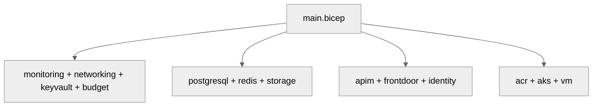

# 💻 Step 5: Implementation Reference - contoso-service-hub-run-3


<details open>
<summary><strong>📑 Implementation Reference</strong></summary>

- [📁 IaC Templates Location](#-iac-templates-location)
- [🗂️ File Structure](#-file-structure)
- [✅ Validation Status](#-validation-status)
- [🏗️ Resources Created](#-resources-created)
- [🚀 Deployment Instructions](#-deployment-instructions)
- [📝 Key Implementation Notes](#-key-implementation-notes)

</details>

> Generated by bicep-code agent | 2026-03-17

| ⬅️ Previous                                    | 📑 Index            | Next ➡️                                              |
| ---------------------------------------------- | ------------------- | ---------------------------------------------------- |
| [04-preflight-check.md](04-preflight-check.md) | [README](README.md) | [06-deployment-summary.md](06-deployment-summary.md) |

## 📁 IaC Templates Location

📁 **Code Location**: [`infra/bicep/contoso-service-hub-run-3/`](../../infra/bicep/contoso-service-hub-run-3/)

## 🗂️ File Structure

```text
infra/bicep/contoso-service-hub-run-3/
├── main.bicep
├── main.bicepparam
├── azure.yaml
├── main.json
└── modules/
    ├── acr.bicep
    ├── aks.bicep
    ├── apim.bicep
    ├── budget.bicep
    ├── frontdoor.bicep
    ├── identity.bicep
    ├── keyvault.bicep
    ├── monitoring.bicep
    ├── networking.bicep
    ├── postgresql.bicep
    ├── redis.bicep
    ├── storage.bicep
    └── vm.bicep
```

## ✅ Validation Status

| Check         | Result | Details                                                                                              |
| ------------- | ------ | ---------------------------------------------------------------------------------------------------- |
| `bicep build` | ✅     | `az bicep build --file main.bicep` completed successfully during this preparation pass               |
| `bicep lint`  | ✅     | `az bicep lint --file main.bicep` completed successfully during this preparation pass                |
| `what-if`     | ⚠️     | Deferred to Step 6. `azure.yaml` is now present, but `azd` is not installed on this environment PATH |

Legend: ✅ pass, ⚠️ pending external prerequisite, ❌ failed

## 🏗️ Resources Created

| Resource                                         | Bicep Type                                                                                                                        | Module                          |
| ------------------------------------------------ | --------------------------------------------------------------------------------------------------------------------------------- | ------------------------------- |
| Log Analytics Workspace and Application Insights | `Microsoft.OperationalInsights/workspaces`, `Microsoft.Insights/components`                                                       | `monitoring.bicep`              |
| Virtual Network, subnets, NSGs, diagnostics      | `Microsoft.Network/virtualNetworks`, `Microsoft.Network/networkSecurityGroups`, `Microsoft.Insights/diagnosticSettings`           | `networking.bicep`              |
| Key Vault foundation                             | `Microsoft.KeyVault/vaults`                                                                                                       | `keyvault.bicep`                |
| Resource group budget alerts                     | `Microsoft.Consumption/budgets`                                                                                                   | `budget.bicep`                  |
| PostgreSQL server, private DNS, TLS config       | `Microsoft.DBforPostgreSQL/flexibleServers`, `Microsoft.DBforPostgreSQL/flexibleServers/configurations`                           | `postgresql.bicep`              |
| Redis cache and private DNS integration          | `Microsoft.Cache/Redis`                                                                                                           | `redis.bicep`                   |
| Storage account with private connectivity        | `Microsoft.Storage/storageAccounts`                                                                                               | `storage.bicep`                 |
| API edge and WAF                                 | `Microsoft.ApiManagement/service`, `Microsoft.Cdn/profiles`, `Microsoft.Network/frontDoorWebApplicationFirewallPolicies`          | `apim.bicep`, `frontdoor.bicep` |
| User-assigned identity and role bindings         | `Microsoft.ManagedIdentity/userAssignedIdentities`, `Microsoft.Authorization/roleAssignments`                                     | `identity.bicep`                |
| Container platform and registry                  | `Microsoft.ContainerRegistry/registries`, `Microsoft.ContainerService/managedClusters`, `Microsoft.Authorization/roleAssignments` | `acr.bicep`, `aks.bicep`        |
| Operations VM and Key Vault access               | `Microsoft.Compute/virtualMachines`, `Microsoft.Authorization/roleAssignments`                                                    | `vm.bicep`                      |



## 🚀 Deployment Instructions

<details>
<summary><strong>🟢 Quick Deploy (azd)</strong></summary>

```bash
cd infra/bicep/contoso-service-hub-run-3
azd provision
```

</details>

<details>
<summary><strong>🔍 Preview Changes (azd)</strong></summary>

```bash
cd infra/bicep/contoso-service-hub-run-3
azd provision --preview
```

</details>

<details>
<summary><strong>⚙️ Custom Parameters</strong></summary>

```text
The checked-in main.bicepparam currently targets:
- environmentName = dev
- deploymentPhase = foundation
- location = swedencentral

Adjust main.bicepparam before Step 6 if you want a different environment or phase.
```

</details>

<details>
<summary><strong>🚀 Azure CLI</strong></summary>

```bash
az deployment group what-if \
  --resource-group "rg-contoso-service-hub-run-3-dev" \
  --template-file main.bicep \
  --parameters main.bicepparam
```

</details>

## 📝 Key Implementation Notes

| Note                                                                                                  | Impact                                                                      | Reference         |
| ----------------------------------------------------------------------------------------------------- | --------------------------------------------------------------------------- | ----------------- |
| Unique suffix is generated once in `main.bicep` and reused in globally unique resource names          | Deterministic naming across reruns                                          | `main.bicep`      |
| Governance tags are merged from the discovered lowercase tag set and baseline project tags            | Satisfies the resource-group tagging gate discovered in governance analysis | `main.bicep`      |
| Deployment is phase-aware: `foundation`, `data`, `edge`, `platform`, `all`                            | Safe first deployment of the foundation slice                               | `main.bicep`      |
| The checked-in parameter file is already scoped to `dev` + `foundation`                               | Matches the requested first deployment target                               | `main.bicepparam` |
| `azure.yaml` is now present for Step 6 handoff, but `azd` must be installed or made available on PATH | Step 6 can proceed once the CLI prerequisite is satisfied                   | `azure.yaml`      |

```bicep
var uniqueSuffix = uniqueString(resourceGroup().id)
var tags = union(baselineTags, governanceTags)
```

This implementation stays aligned to the checked-in Run 3 code and does not introduce design changes beyond the missing deployment manifest required for `azd`.

---

_Implementation reference generated from Bicep templates._

---

<div align="center">

| ⬅️ [04-preflight-check.md](04-preflight-check.md) | 🏠 [Project Index](README.md) | ➡️ [06-deployment-summary.md](06-deployment-summary.md) |
| ------------------------------------------------- | ----------------------------- | ------------------------------------------------------- |

</div>
*** Update File: /workspaces/azure-agentic-infraops/infra/bicep/contoso-service-hub-run-3/azure.yaml
