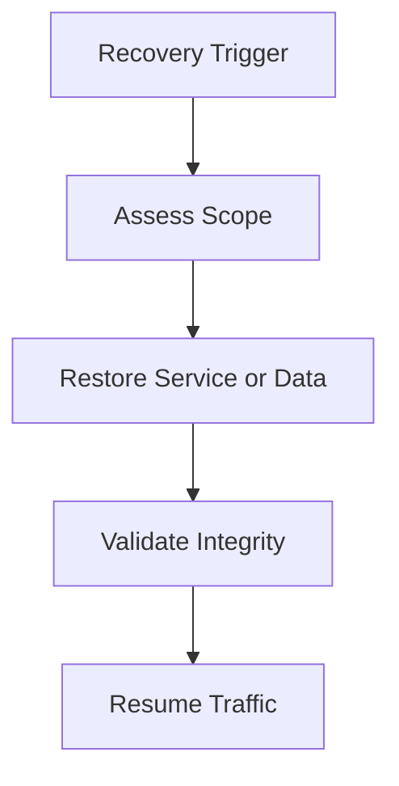

# 🛡️ Backup and Disaster Recovery Plan: Contoso Service Hub


<details open>
<summary><strong>📑 DR Plan Contents</strong></summary>

- [📋 Executive Summary](#-executive-summary)
- [🎯 1. Recovery Objectives](#-1-recovery-objectives)
- [💾 2. Backup Strategy](#-2-backup-strategy)
- [🌍 3. Disaster Recovery Procedures](#-3-disaster-recovery-procedures)
- [🧪 4. Testing Schedule](#-4-testing-schedule)
- [📢 5. Communication Plan](#-5-communication-plan)
- [👥 6. Roles and Responsibilities](#-6-roles-and-responsibilities)
- [🔗 7. Dependencies](#-7-dependencies)
- [📖 8. Recovery Runbooks](#-8-recovery-runbooks)
- [📎 9. Appendix](#-9-appendix)
- [References](#references)

</details>

> Generated by 08-As-Built agent | 2026-03-17

<div align="center">

| ⬅️ Previous                                          | 📑 Index            | Next ➡️                                            |
| ---------------------------------------------------- | ------------------- | -------------------------------------------------- |
| [07-resource-inventory.md](07-resource-inventory.md) | [README](README.md) | [07-compliance-matrix.md](07-compliance-matrix.md) |

</div>

**Generated**: 2026-03-17
**Version**: 1.0
**Environment**: Production baseline with staging and dev deltas
**Primary Region**: swedencentral
**Secondary Region**: Not provisioned; contingency target is an approved EU region

---

## 📋 Executive Summary

This document defines backup, restore, and continuity procedures for the dry-run
validated Contoso Service Hub architecture. The current scope is a single-region
deployment model with service-level recovery rather than pre-provisioned regional
failover.

| Metric           | Current Baseline              | Target  |
| ---------------- | ----------------------------- | ------- |
| **RPO**          | 1 hour for critical data      | 1 hour  |
| **RTO**          | 4 hours for critical services | 4 hours |
| **Availability** | 99.9% design target           | 99.9%   |

---

## 🎯 1. Recovery Objectives

### 1.1 Recovery Time Objective (RTO)

| Tier         | RTO Target | Services                                      |
| ------------ | ---------- | --------------------------------------------- |
| 🔴 Critical  | 4 hours    | Front Door, APIM, AKS, PostgreSQL, Key Vault  |
| 🟠 Important | 8 hours    | Redis, Storage, ACR, shared operational VM    |
| 🟢 Standard  | 24 hours   | Dev-only utilities and lower-priority tooling |

### 1.2 Recovery Point Objective (RPO)

| Data Type              | RPO Target | Backup Strategy                                     |
| ---------------------- | ---------- | --------------------------------------------------- |
| Transactional data     | 1 hour     | PostgreSQL automated backups and PITR               |
| Uploaded content       | 4 hours    | Storage redundancy plus application restore process |
| Cacheable state        | 6 hours    | Redis persistence plus rehydration                  |
| Platform configuration | 24 hours   | Bicep source of truth and redeployment              |



---

## 💾 2. Backup Strategy

### PostgreSQL Flexible Server

| Setting             | Configuration                                           |
| ------------------- | ------------------------------------------------------- |
| Backup Type         | Automated service backups                               |
| Retention (PITR)    | 35 days                                                 |
| Long-Term Retention | Not enabled in current scope                            |
| Geo-Redundancy      | Disabled to preserve EU-only and single-region baseline |

### Redis Cache

| Setting        | Configuration                                          |
| -------------- | ------------------------------------------------------ |
| Persistence    | Enabled for production profile                         |
| Snapshot Cycle | Periodic persistence aligned to cache durability needs |
| Restore Method | Service restore plus workload cache warm-up            |

### Storage and Files

| Setting           | Configuration                                     |
| ----------------- | ------------------------------------------------- |
| Object storage    | Standard ZRS in production                        |
| Public access     | Disabled                                          |
| Shared key access | Disabled                                          |
| Recovery method   | Storage redundancy plus application-level restore |

### Key Vault and Platform Configuration

| Setting          | Configuration                               |
| ---------------- | ------------------------------------------- |
| Soft Delete      | Enabled                                     |
| Purge Protection | Enabled                                     |
| IaC backup       | Bicep and parameter files in source control |
| Operational docs | Step 7 artifact suite maintained in repo    |

---

## 🌍 3. Disaster Recovery Procedures

### 3.1 Failover Procedure

The current scope does not provision an active secondary region. Regional outage
response therefore follows a rebuild pattern:

1. Declare a regional disaster and pause non-essential change activity.
2. Confirm whether the outage is confined to an Azure service, the workload, or
   the primary region.
3. Restore critical data from PostgreSQL and storage backups if service recovery
   in the primary region is not viable.
4. Re-deploy the validated Bicep baseline into an approved EU contingency region
   only if executive, security, and compliance approval is granted.
5. Reconnect DNS, certificates, and application secrets after the rebuilt stack
   is verified.

### 3.2 Failback Procedure

If a contingency deployment is used:

1. Confirm primary-region health restoration.
2. Freeze changes on the contingency environment.
3. Replicate or export the current authoritative data set back to the primary.
4. Re-deploy the approved primary-region configuration.
5. Validate application paths, data consistency, and user authentication before
   traffic is returned.

---

## 🧪 4. Testing Schedule

| Test Type               | Frequency   | Last Test | Next Test                           |
| ----------------------- | ----------- | --------- | ----------------------------------- |
| PostgreSQL PITR drill   | Quarterly   | Not run   | First live quarter after deployment |
| Storage restore sample  | Quarterly   | Not run   | First live quarter after deployment |
| Key Vault recovery test | Semi-annual | Not run   | First production milestone          |
| Regional rebuild drill  | Annual      | Not run   | After initial production release    |

Because this project ended Step 6 in dry-run mode, all recovery testing remains
planned rather than executed.

---

## 📢 5. Communication Plan

| Audience             | Channel                      | Template                  |
| -------------------- | ---------------------------- | ------------------------- |
| Internal responders  | Teams / incident bridge      | Incident update template  |
| Product stakeholders | Service incident updates     | Business impact summary   |
| Security and privacy | Security escalation path     | Breach / data risk notice |
| External users       | Status page or service comms | Customer advisory         |

---

## 👥 6. Roles and Responsibilities

| Role                   | Team                  | Responsibility                         |
| ---------------------- | --------------------- | -------------------------------------- |
| Incident commander     | Platform engineering  | Coordinate recovery and communications |
| Database owner         | Data platform         | PostgreSQL restore validation          |
| Security lead          | Security governance   | Assess exposure and compliance impact  |
| Product representative | Contoso product owner | Approve customer-facing communication  |

---

## 🔗 7. Dependencies

| Dependency               | Impact                                              | Mitigation                              |
| ------------------------ | --------------------------------------------------- | --------------------------------------- |
| Front Door availability  | Public entry path unavailable                       | Validate origin and route health early  |
| APIM internal networking | API path unavailable if internal connectivity fails | Preserve subnet, DNS, and NSG integrity |
| PostgreSQL backups       | Critical data recovery depends on service backups   | Quarterly restore drills                |
| Key Vault access         | Secrets and certificate access blocked              | RBAC review and recovery procedure      |
| Source control integrity | Rebuild depends on Bicep and parameter source       | Protect repo and release artifacts      |

---

## 📖 8. Recovery Runbooks

| Scenario                         | Runbook                                                | Owner                |
| -------------------------------- | ------------------------------------------------------ | -------------------- |
| PostgreSQL corruption            | PITR restore and connection cutover                    | Data platform        |
| AKS cluster failure              | Recreate cluster from Bicep and redeploy workloads     | Platform engineering |
| Key Vault deletion event         | Recover from soft delete and re-validate RBAC          | Platform engineering |
| Full regional service disruption | Controlled rebuild into approved EU contingency region | Incident commander   |

**Runbook: PostgreSQL PITR**

1. Identify the restore point.
2. Create a restored server from the requested timestamp.
3. Validate schema, connectivity, and data integrity.
4. Cut application traffic over once validation completes.

```bash
az postgres flexible-server restore \
  --resource-group rg-contoso-service-hub-prod \
  --name <postgres-server-name> \
  --restore-time "2026-03-17T00:00:00Z" \
  --target-server-name <postgres-server-name>-restore
```

---

## 📎 9. Appendix

<details>
<summary>📋 Detailed Recovery Procedures</summary>

| Recovery Domain      | Primary Method                                          |
| -------------------- | ------------------------------------------------------- |
| Application runtime  | Redeploy AKS and workloads from approved manifests      |
| Gateway layer        | Recreate APIM and Front Door from Bicep modules         |
| Data                 | Restore PostgreSQL and validate storage assets          |
| Security and secrets | Recover Key Vault and re-issue certificates if required |

</details>

---

## References

| Topic                 | Link                                                                                                  |
| --------------------- | ----------------------------------------------------------------------------------------------------- |
| Azure Backup Overview | [Backup Overview](https://learn.microsoft.com/azure/backup/backup-overview)                           |
| Backup Best Practices | [Best Practices](https://learn.microsoft.com/azure/backup/backup-best-practices)                      |
| RTO / RPO Guidance    | [Reliability Metrics](https://learn.microsoft.com/azure/well-architected/reliability/metrics)         |
| DR Planning           | [Disaster Recovery](https://learn.microsoft.com/azure/well-architected/reliability/disaster-recovery) |

---

_Backup and disaster recovery plan generated from validated infrastructure artifacts._

---

<div align="center">

| ⬅️ [07-resource-inventory.md](07-resource-inventory.md) | 🏠 [Project Index](README.md) | ➡️ [07-compliance-matrix.md](07-compliance-matrix.md) |
| ------------------------------------------------------- | ----------------------------- | ----------------------------------------------------- |

</div>
