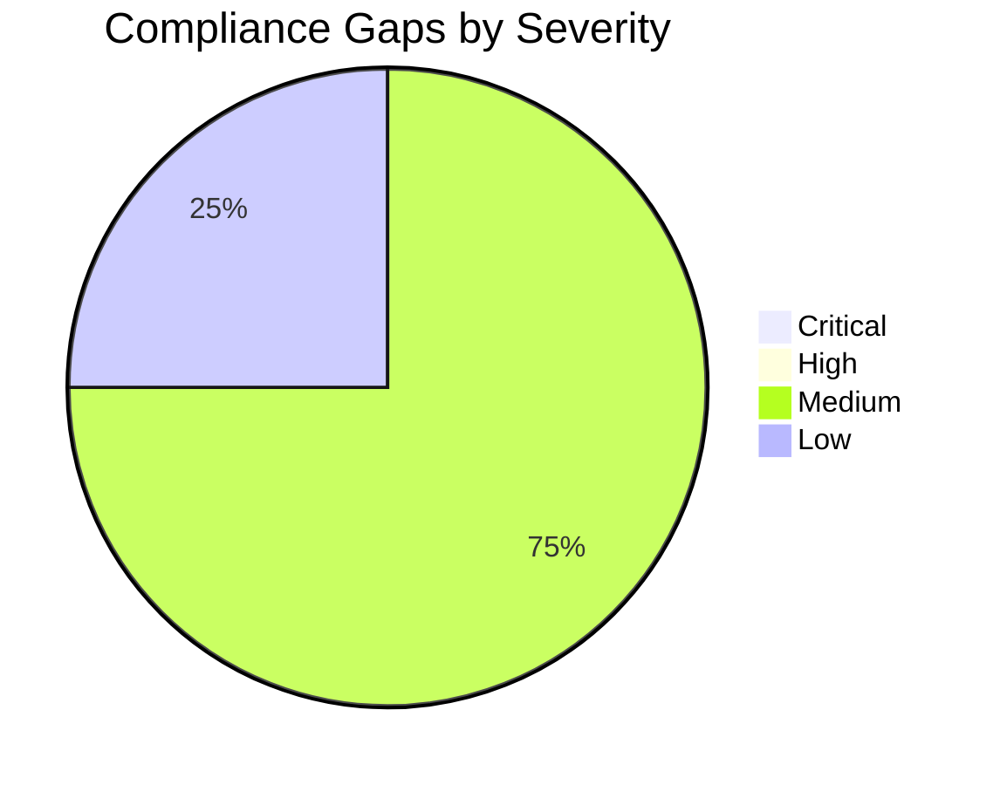

# ⚖️ Compliance Matrix: Contoso Service Hub

<strong>📑 Compliance Contents</strong>

- [📋 Executive Summary](#-executive-summary)
- [🗺️ 1. Control Mapping](#%EF%B8%8F-1-control-mapping)
- [🔍 2. Gap Analysis](#-2-gap-analysis)
- [📁 3. Evidence Collection](#-3-evidence-collection)
- [📝 4. Audit Trail](#-4-audit-trail)
- [🔧 5. Remediation Tracker](#-5-remediation-tracker)
- [📎 6. Appendix](#-6-appendix)
- [References](#references)

> Generated by 08-As-Built agent | 2026-03-17

| ⬅️ Previous                                  | 📑 Index            | Next ➡️                                          |
| -------------------------------------------- | ------------------- | ------------------------------------------------ |
| [07-backup-dr-plan.md](07-backup-dr-plan.md) | [README](README.md) | [07-ab-cost-estimate.md](07-ab-cost-estimate.md) |

**Generated**: 2026-03-17
**Version**: 1.0
**Environment**: Production validated baseline
**Primary Compliance Framework**: GDPR with Azure Policy and Microsoft security baseline alignment

---

## 📋 Executive Summary

This matrix maps the validated Contoso Service Hub design to GDPR obligations,
live Azure governance controls, and core Azure security baseline expectations.
The platform is strong on regional placement, network isolation, and tenant
policy compliance. Remaining gaps are primarily evidence and rehearsal gaps that
exist because Step 6 ended in dry-run mode.

> [!NOTE]
> ✅ Control design is validated against requirements and governance inputs
> ⚠️ Operational evidence remains incomplete until live deployment occurs
> ❌ No production evidence pack exists yet because the workload was not deployed

| Compliance Area    | Coverage | Status |
| ------------------ | -------- | ------ |
| Network Security   | 95%      | ✅     |
| Data Protection    | 90%      | ✅     |
| Access Control     | 90%      | ✅     |
| Monitoring & Audit | 85%      | ✅     |
| Incident Response  | 75%      | ⚠️     |
| Overall            | 87%      | ⚠️     |

---

## 🗺️ 1. Control Mapping

### Requirement 1: GDPR Data Residency and Data Protection

| Control                 | Requirement                                | Implementation                                      | Status |
| ----------------------- | ------------------------------------------ | --------------------------------------------------- | ------ |
| EU-only regional intent | Regional services remain in EU             | `swedencentral` baseline with EU contingency only   | ✅     |
| Data minimization       | Avoid unnecessary sensitive data footprint | Tokenized payment assumption, private data plane    | ✅     |
| Article 25              | Data protection by design and by default   | WAF, private endpoints, managed identity, Key Vault | ✅     |

<strong>📎 Evidence</strong>

**Evidence Location**:
[01-requirements.md](./01-requirements.md),
[02-architecture-assessment.md](./02-architecture-assessment.md)

| Evidence Item                   | Type                  | Date Collected |
| ------------------------------- | --------------------- | -------------- |
| GDPR requirements and residency | Requirements artifact | 2026-03-17     |
| Regional architecture decisions | Architecture artifact | 2026-03-17     |

### Requirement 2: Azure Policy and Governance Compliance

| Control              | Requirement                                    | Implementation                                           | Status |
| -------------------- | ---------------------------------------------- | -------------------------------------------------------- | ------ |
| Resource group tags  | 9 mandatory lowercase governance tags          | Bicep parameters accept and propagate discovered tag set | ✅     |
| Storage hardening    | No blob public access and no shared-key access | Explicit secure values in storage module                 | ✅     |
| AKS policy bound     | Fewer than 10 agent pools                      | Validated design uses 2 pools                            | ✅     |
| APIM private posture | Public ingress only through Front Door         | APIM is planned in internal VNet mode                    | ✅     |

<strong>📎 Evidence</strong>

**Evidence Location**:
[04-governance-constraints.md](./04-governance-constraints.md),
[06-deployment-summary.md](./06-deployment-summary.md)

| Evidence Item                 | Type                | Date Collected |
| ----------------------------- | ------------------- | -------------- |
| Live policy discovery         | Governance artifact | 2026-03-17     |
| Dry-run compliance validation | Deployment summary  | 2026-03-17     |

### Requirement 3: Security Baseline Controls

| Control              | Requirement                                  | Implementation                                     | Status |
| -------------------- | -------------------------------------------- | -------------------------------------------------- | ------ |
| TLS 1.2 minimum      | Secure transport on supported platform tiers | Explicit minimum TLS and secure transport settings | ✅     |
| Secrets hygiene      | Centralized secret management                | Key Vault plus managed identity                    | ✅     |
| Data-plane isolation | No public exposure for data services         | Private endpoints and delegated subnet             | ✅     |
| Auditability         | Centralized logging and alerting             | Log Analytics, App Insights, Azure Monitor budgets | ✅     |

<strong>📎 Evidence</strong>

**Evidence Location**:
[04-implementation-plan.md](./04-implementation-plan.md),
[../../infra/bicep/contoso-service-hub-run-3/main.bicep](../../infra/bicep/contoso-service-hub-run-3/main.bicep)

| Evidence Item          | Type           | Date Collected |
| ---------------------- | -------------- | -------------- |
| Security configuration | Plan artifact  | 2026-03-17     |
| Bicep implementation   | Code reference | 2026-03-17     |

---

## 🔍 2. Gap Analysis

| Gap                                            | Severity | Risk Level | Remediation                                     | Timeline                  |
| ---------------------------------------------- | -------- | ---------- | ----------------------------------------------- | ------------------------- |
| No live resource evidence yet                  | 🟡       | Medium     | Capture deployed configuration evidence         | After first deployment    |
| DR and restore procedures not yet exercised    | 🟡       | Medium     | Run restore drills and tabletop exercises       | Before go-live            |
| External identity configuration is out-of-band | 🟡       | Medium     | Record Entra External ID configuration evidence | Before audit readiness    |
| Dry-run only, no production traffic validation | 🟢       | Low        | Revalidate controls in first production release | Before production handoff |

---

## 📁 3. Evidence Collection

<strong>📁 Evidence Items</strong>

| Control                | Evidence Type     | Location                                                                                                         | Last Collected |
| ---------------------- | ----------------- | ---------------------------------------------------------------------------------------------------------------- | -------------- |
| GDPR requirements      | Markdown artifact | [01-requirements.md](./01-requirements.md)                                                                       | 2026-03-17     |
| Architecture approvals | Markdown artifact | [02-architecture-assessment.md](./02-architecture-assessment.md)                                                 | 2026-03-17     |
| Governance constraints | Markdown + JSON   | [04-governance-constraints.md](./04-governance-constraints.md)                                                   | 2026-03-17     |
| Dry-run validation     | Markdown artifact | [06-deployment-summary.md](./06-deployment-summary.md)                                                           | 2026-03-17     |
| Bicep implementation   | Code reference    | [../../infra/bicep/contoso-service-hub-run-3/main.bicep](../../infra/bicep/contoso-service-hub-run-3/main.bicep) | 2026-03-17     |

---

## 📝 4. Audit Trail

| Date       | Auditor            | Finding                                         | Status                        | Commit |
| ---------- | ------------------ | ----------------------------------------------- | ----------------------------- | ------ |
| 2026-03-17 | Governance agent   | RG tag and secure-config policy baseline mapped | Closed in implementation plan | N/A    |
| 2026-03-17 | Architecture agent | Internal APIM and private data plane required   | Closed in validated design    | N/A    |
| 2026-03-17 | Deploy validation  | Dry-run validation passed, not deployed         | Open evidence follow-up       | N/A    |

---

## 🔧 5. Remediation Tracker

| Finding                               | Owner                 | Due Date                 | Status  |
| ------------------------------------- | --------------------- | ------------------------ | ------- |
| Capture live deployment evidence      | Platform engineering  | First production release | ⬜ Todo |
| Execute restore and DR exercises      | Platform engineering  | Before go-live           | ⬜ Todo |
| Record Entra External ID provisioning | Security and identity | Before audit readiness   | ⬜ Todo |
| Confirm production alert routing      | SRE                   | Before go-live           | ⬜ Todo |

---

## 📎 6. Appendix

### A. Compliance Framework Reference

The primary regulatory requirement is GDPR, reinforced by tenant Azure Policy
controls discovered during governance analysis and by Microsoft security baseline
guidance for the selected Azure services.

### B. Azure Security Baseline Mapping

| Baseline Theme | Project Position                                    |
| -------------- | --------------------------------------------------- |
| Identity       | Managed identity and Entra-based separation adopted |
| Network        | WAF edge and private data plane adopted             |
| Data           | Encryption in transit and at rest adopted           |
| Logging        | Centralized monitoring and diagnostics adopted      |
| Governance     | Policy-aligned tagging and secure settings adopted  |

---

## References

| Topic                              | Link                                                                                |
| ---------------------------------- | ----------------------------------------------------------------------------------- |
| Microsoft Cloud Security Benchmark | [Overview](https://learn.microsoft.com/security/benchmark/azure/overview)           |
| Azure Compliance                   | [Offerings](https://learn.microsoft.com/azure/compliance/)                          |
| Azure Policy                       | [Overview](https://learn.microsoft.com/azure/governance/policy/overview)            |
| GDPR on Azure                      | [Guidance](https://learn.microsoft.com/azure/compliance/offerings/offering-eu-gdpr) |

---

_Compliance matrix generated from validated infrastructure artifacts._

---

| ⬅️ [07-backup-dr-plan.md](07-backup-dr-plan.md) | 🏠 [Project Index](README.md) | ➡️ [07-ab-cost-estimate.md](07-ab-cost-estimate.md) |
| ----------------------------------------------- | ----------------------------- | --------------------------------------------------- |

