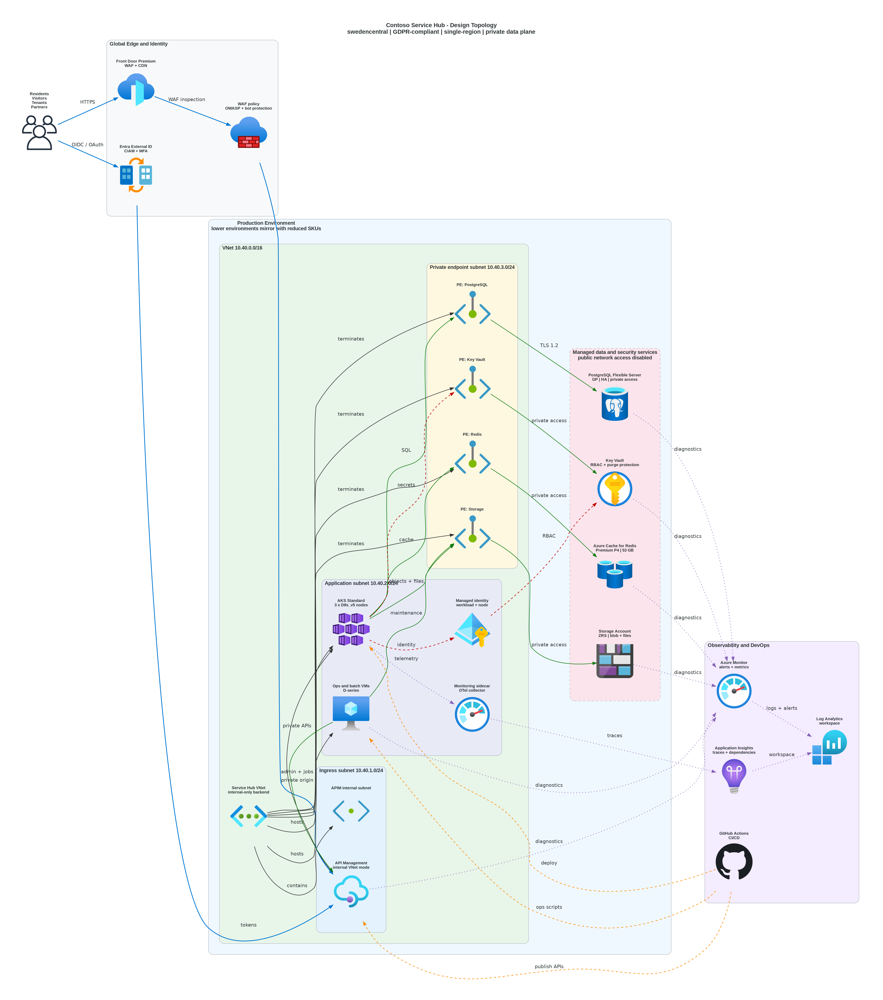

# 📐 Azure Design Document: Contoso Service Hub

<strong>📑 Design Contents</strong>

- [📝 1. Introduction](#-1-introduction)
- [🏛️ 2. Azure Architecture Overview](#-2-azure-architecture-overview)
- [🌐 3. Networking](#-3-networking)
- [💾 4. Storage](#-4-storage)
- [💻 5. Compute](#-5-compute)
- [👤 6. Identity & Access](#-6-identity--access)
- [🔐 7. Security & Compliance](#-7-security--compliance)
- [🔄 8. Backup & Disaster Recovery](#-8-backup--disaster-recovery)
- [📊 9. Management & Monitoring](#-9-management--monitoring)
- [📎 10. Appendix](#-10-appendix)
- [References](#references)

> Generated by 08-As-Built agent | 2026-03-17

| ⬅️ Previous                                            | 📑 Index            | Next ➡️                                              |
| ------------------------------------------------------ | ------------------- | ---------------------------------------------------- |
| [07-documentation-index.md](07-documentation-index.md) | [README](README.md) | [07-operations-runbook.md](07-operations-runbook.md) |

**Version**: 1.0
**Date**: 2026-03-17
**Author**: Generated by 08-As-Built agent
**Status**: Complete

---

## 📝 1. Introduction

### 1.1 Document Purpose

This design document captures the validated target architecture for Contoso
Service Hub after planning, Bicep generation, and dry-run validation. It is the
technical reference for platform engineering, security review, operations, and
future deployment execution.

> [!NOTE]
> ✅ Validated design baseline
> ⚠️ Dry-run only, with no live Azure deployment evidence yet
> ❌ Not a substitute for post-deployment operational verification

**Intended Audience:**

- Solution architects
- Platform engineering and SRE teams
- Security and compliance reviewers
- Delivery teams preparing the production rollout

### 1.2 Project Overview

Contoso Service Hub is a greenfield enterprise platform for bookings, payments,
content delivery, utilities management, and customer engagement across a mixed
real-estate and lifestyle estate.

**Business Objectives:**

- Deliver a unified digital services platform for residents, visitors, tenants,
  partners, and internal operators.
- Meet GDPR and EU-only regional requirements while maintaining 99.9% service
  availability targets.
- Support growth from MVP traffic to materially higher transaction volumes
  without re-platforming away from the selected Azure foundation.

### 1.3 Design Objectives

| Objective    | Target                     | Implementation                                                                 |
| ------------ | -------------------------- | ------------------------------------------------------------------------------ |
| Availability | 99.9% service availability | Zone-aware AKS, PostgreSQL HA, Front Door health probing, ZRS where applicable |
| Performance  | API p95 < 500 ms           | Front Door caching, APIM mediation, Redis hot-path caching, AKS autoscaling    |
| Security     | GDPR-aligned zero-trust    | Private endpoints, managed identity, TLS 1.2, WAF, internal APIM               |
| Scalability  | Growth without redesign    | AKS node scaling, environment right-sizing, phased topology                    |

### 1.4 Constraints & Assumptions

**Constraints:**

- All regional resources are pinned to `swedencentral` for the primary design.
- This Step 7 suite documents a dry-run outcome and therefore describes the
  validated design instead of live Azure resource state.
- Multi-region active disaster recovery is outside the current project scope.

**Assumptions:**

- Payment integration remains tokenized so cardholder data does not reside on
  the Azure platform.
- GitHub Actions with OpenID Connect is used for CI/CD integration.
- Resource group creation includes the tenant-mandated lowercase governance
  tags discovered in live policy assignments.

### 1.5 Stakeholders

| Role                    | Team                         | Responsibility                                  |
| ----------------------- | ---------------------------- | ----------------------------------------------- |
| Product owner           | Contoso digital platform     | Business priorities and release scope           |
| Solution architecture   | Architecture and platform    | Target design, Azure service selection          |
| Platform engineering    | InfraOps / cloud engineering | Bicep delivery, deployment, operationalization  |
| Security and compliance | Security governance          | GDPR controls, policy compliance, audit posture |

---

## 🏛️ 2. Azure Architecture Overview

### 2.1 Architecture Diagram

Source: [03-des-diagram.py](./03-des-diagram.py)

The validated architecture uses Azure Front Door Premium as the public edge,
routes traffic to API Management in internal VNet mode, and serves backend
workloads from AKS. PostgreSQL Flexible Server, Redis Premium, Storage, and Key
Vault are held behind private connectivity.

### 2.2 Resource Summary

| Category   | Count |
| ---------- | ----- |
| Compute    | 4     |
| Networking | 4     |
| Data       | 4     |
| Security   | 2     |

Additional validated services include 2 monitoring components and a native
resource-group budget. Tenant-scoped identity and security services such as
Microsoft Entra External ID and Defender for Cloud are documented as
dependencies rather than resource-group resources.

---

## 🌐 3. Networking

The network design implements a private backend topology with Front Door as the
only public ingress point.

### Network Topology

- Azure Front Door Premium provides WAF, routing, health probes, and CDN.
- API Management is deployed in internal VNet mode on a dedicated subnet.
- AKS runs on its own subnet and consumes private services over Azure backbone
  networking.
- Data services use private endpoints or delegated subnets, with no intended
  public data-plane exposure.

### Validated Subnets

| Subnet            | Purpose                                      |
| ----------------- | -------------------------------------------- |
| `snet-aks-{env}`  | AKS nodes and pod networking                 |
| `snet-apim-{env}` | Internal APIM integration                    |
| `snet-pe-{env}`   | Private endpoints for data and secret stores |
| `snet-data-{env}` | PostgreSQL delegated subnet                  |
| `snet-vm-{env}`   | VM workload support                          |

### Networking Decisions

- Private endpoints are required for PostgreSQL, Redis, Key Vault, and Storage.
- NSGs are attached per subnet to constrain east-west traffic.
- Front Door origins resolve to APIM; direct public API exposure is not part of
  the validated target design.
- The failover region is a contingency plan rather than a provisioned topology.

---

## 💾 4. Storage

The data layer combines transactional, cache, object, file, and disk-backed
storage services sized per environment.

### Core Data Services

| Service             | Production Baseline     | Environment Notes                                  |
| ------------------- | ----------------------- | -------------------------------------------------- |
| PostgreSQL Flexible | GP, 8 vCores, 256 GB    | Staging uses smaller GP sizing; dev uses Burstable |
| Redis Cache         | Premium P4, 53 GB       | Staging uses Premium P1; dev uses Basic C0         |
| Storage Account     | Standard ZRS Hot        | Non-prod uses LRS                                  |
| Managed Disk        | Premium SSD P15, 256 GB | Non-prod uses smaller Standard SSD options         |

### Data Design Notes

- PostgreSQL holds the primary transactional workload and supports point-in-time
  restore with 35-day retention.
- Redis was intentionally right-sized to Premium P4 for MVP economics while
  preserving an upgrade path once sustained utilization exceeds the trigger.
- Blob and file storage are consolidated under the storage account module while
  still enforcing HTTPS-only access and disabled shared-key access.
- The design keeps all copies within the EU data boundary and avoids cross-region
  replication in the validated baseline.

---

## 💻 5. Compute

The platform uses a mixed compute model centered on AKS with supporting gateway,
registry, and VM resources.

### Compute Services

| Service            | Production Baseline                  | Role                                             |
| ------------------ | ------------------------------------ | ------------------------------------------------ |
| AKS                | Standard tier, 3 x `Standard_D8s_v5` | Primary runtime for the microservice estate      |
| API Management     | Standard, internal VNet              | API gateway, policy enforcement, throttling      |
| Container Registry | Standard                             | Secure image distribution for AKS workloads      |
| Virtual Machine    | `Standard_D8s_v5`                    | Supporting workload and operational utility host |

### Compute Design Notes

- AKS is selected over Container Apps because the workload requires full
  Kubernetes control, custom networking, and a predictable scaling path.
- The cluster design uses two node pools in the validated plan and remains well
  below the tenant policy limit for agent pools.
- APIM remains private to the VNet and is designed to be reached through Front
  Door rather than directly from the internet.
- ACR uses managed identity-based pull access and keeps the admin account
  disabled.

---

## 👤 6. Identity & Access

The validated identity model separates customer identity, operator identity, and
workload identity.

### Identity Planes

| Identity Plane    | Service                            | Scope                                               |
| ----------------- | ---------------------------------- | --------------------------------------------------- |
| Customer identity | Microsoft Entra External ID        | Registration, sign-in, and CIAM flows               |
| Internal identity | Microsoft Entra ID                 | Administrative access, operator MFA, RBAC           |
| Workload identity | User-assigned and managed identity | AKS, APIM, VM, and service-to-service authorization |

### Access Model

- Azure RBAC governs resource access for platform operators.
- Key Vault uses RBAC authorization and centralizes secrets and certificates.
- Managed identity replaces connection-string and shared-key usage where the
  platform supports it.
- GitHub Actions is expected to use OIDC federation for deployment automation.

---

## 🔐 7. Security & Compliance

<strong>🔒 Security Controls</strong>

| Control           | Implementation                                                                 | Evidence                                                                                                         |
| ----------------- | ------------------------------------------------------------------------------ | ---------------------------------------------------------------------------------------------------------------- |
| TLS 1.2+          | Explicit minimum TLS on storage and Redis; secure transport baseline elsewhere | [04-implementation-plan.md](./04-implementation-plan.md)                                                         |
| HTTPS-only        | Storage HTTPS-only, Front Door edge TLS, private backend posture               | [04-governance-constraints.md](./04-governance-constraints.md)                                                   |
| Managed Identity  | Managed identity for workloads and no admin ACR account                        | [../../infra/bicep/contoso-service-hub-run-3/main.bicep](../../infra/bicep/contoso-service-hub-run-3/main.bicep) |
| Network isolation | Private endpoints, delegated subnet, internal APIM, NSGs                       | [06-deployment-summary.md](./06-deployment-summary.md)                                                           |

<strong>📋 Compliance Mapping</strong>

| Framework                    | Control ID / Theme                | Status |
| ---------------------------- | --------------------------------- | ------ |
| GDPR                         | EU-only residency                 | ✅     |
| GDPR                         | Data protection by design         | ✅     |
| Azure Policy / governance    | RG tag baseline and secure config | ✅     |
| PCI-adjacent payment posture | Tokenized gateway assumption      | ✅     |

The security model is deliberately edge-to-core. Internet traffic is inspected
at Front Door WAF, APIs are mediated by APIM, workloads authenticate with managed
identity, and data services are not expected to expose public endpoints.

---

## 🔄 8. Backup & Disaster Recovery

The validated design is single-region, but it still defines recovery mechanisms
for data corruption, service loss, and planned rebuilds.

- PostgreSQL relies on automated backups with 35-day retention and PITR.
- Redis uses persistence for the production profile and relies on restore plus
  rehydration of cacheable state.
- AKS recovery is based on Bicep redeployment, ACR images, and workload manifests.
- Key Vault uses soft delete and purge protection to support recovery from
  operational deletion events.
- Regional failover is a contingency pattern to an EU region, not an active
  deployed standby in the current scope.

---

## 📊 9. Management & Monitoring

The operational baseline uses Azure Monitor, Log Analytics, and Application
Insights as shared foundational services.

### Monitoring Capabilities

| Capability              | Service                       | Purpose                                   |
| ----------------------- | ----------------------------- | ----------------------------------------- |
| Central log aggregation | Log Analytics Workspace       | Consolidated diagnostics and audit trail  |
| Application telemetry   | Application Insights          | Distributed traces and request analytics  |
| Platform alerting       | Azure Monitor + action groups | Reliability, latency, and security alerts |
| Budget monitoring       | Resource-group budget         | 80%, 100%, and forecast notifications     |
| Security posture        | Microsoft Defender for Cloud  | Threat detection and hardening guidance   |

### Operational Notes

- Production requires 24x7 operational coverage.
- Staging and dev use reduced sizing but follow the same operational patterns.
- Cost management is part of the implementation, not a later optimization step.

---

## 📎 10. Appendix

📋 Detailed Resource Configuration

| Area            | Validated Configuration Snapshot                                   |
| --------------- | ------------------------------------------------------------------ |
| Naming          | `uniqueString(resourceGroup().id)` driven suffixes in `main.bicep` |
| Phases          | Foundation, Data, Edge, Platform                                   |
| Region          | `swedencentral` only                                               |
| Environments    | `dev`, `staging`, `prod`                                           |
| Budget baseline | $2,000 dev, $5,000 staging, $10,000 prod alerts                    |
| Governance tags | Baseline project tags plus 9 lowercase tenant tags                 |

📚 Reference Architecture Links

| Architecture Reference  | Link                                                             |
| ----------------------- | ---------------------------------------------------------------- |
| Initial requirements    | [01-requirements.md](./01-requirements.md)                       |
| Architecture assessment | [02-architecture-assessment.md](./02-architecture-assessment.md) |
| Implementation plan     | [04-implementation-plan.md](./04-implementation-plan.md)         |
| Deployment validation   | [06-deployment-summary.md](./06-deployment-summary.md)           |

---

## References

| Topic                      | Link                                                                                     |
| -------------------------- | ---------------------------------------------------------------------------------------- |
| Well-Architected Framework | [Overview](https://learn.microsoft.com/azure/well-architected/)                          |
| Azure Architecture Center  | [Architectures](https://learn.microsoft.com/azure/architecture/)                         |
| AKS Best Practices         | [Guidance](https://learn.microsoft.com/azure/aks/best-practices)                         |
| Azure API Management       | [Overview](https://learn.microsoft.com/azure/api-management/api-management-key-concepts) |
| PostgreSQL Flexible Server | [Overview](https://learn.microsoft.com/azure/postgresql/flexible-server/overview)        |
| Azure Front Door           | [Overview](https://learn.microsoft.com/azure/frontdoor/front-door-overview)              |

---

_Design document generated from validated infrastructure artifacts._

---

| ⬅️ [07-documentation-index.md](07-documentation-index.md) | 🏠 [Project Index](README.md) | ➡️ [07-operations-runbook.md](07-operations-runbook.md) |
| --------------------------------------------------------- | ----------------------------- | ------------------------------------------------------- |

