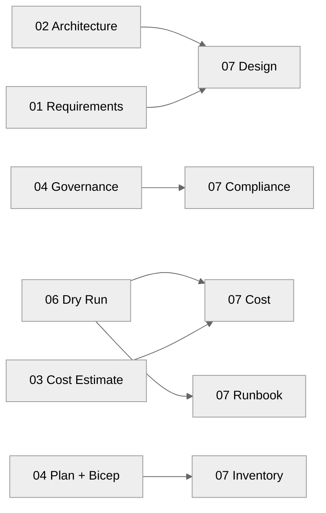

# 📚 Contoso Service Hub - Workload Documentation

<strong>📑 Documentation Contents</strong>

- [📦 1. Document Package Contents](#-1-document-package-contents)
- [📚 2. Source Artifacts](#-2-source-artifacts)
- [📋 3. Project Summary](#-3-project-summary)
- [🔗 4. Related Resources](#-4-related-resources)
- [⚡ 5. Quick Links](#-5-quick-links)

> Generated by 08-As-Built agent | 2026-03-17

| ⬅️ Previous                                          | 📑 Index            | Next ➡️                                        |
| ---------------------------------------------------- | ------------------- | ---------------------------------------------- |
| [06-deployment-summary.md](06-deployment-summary.md) | [README](README.md) | [07-design-document.md](07-design-document.md) |

**Generated**: 2026-03-17
**Version**: 1.0
**Status**: Complete

---

## 📦 1. Document Package Contents

| Document                                               | Description                                                            | Status                                                        |
| ------------------------------------------------------ | ---------------------------------------------------------------------- | ------------------------------------------------------------- |
| [07-design-document.md](./07-design-document.md)       | Technical architecture, networking, security, and data design          |  |
| [07-operations-runbook.md](./07-operations-runbook.md) | Day-2 operations for the validated target estate                       |  |
| [07-resource-inventory.md](./07-resource-inventory.md) | Validated resource inventory with naming, SKUs, phases, and regions    |  |
| [07-backup-dr-plan.md](./07-backup-dr-plan.md)         | Backup, continuity, and recovery guidance for the dry-run architecture |  |
| [07-compliance-matrix.md](./07-compliance-matrix.md)   | GDPR, governance, and security control mapping                         |  |
| [07-ab-cost-estimate.md](./07-ab-cost-estimate.md)     | Finalized cost baseline per environment for the validated design       |  |

> [!NOTE]
> This project completed Step 7 from a `validated-not-deployed` baseline.
> “As-built” in this documentation means the final validated infrastructure
> definition after planning, code generation, and dry-run validation.

---

## 📚 2. Source Artifacts

These documents were generated from the following workflow outputs and
implementation inputs:

| Artifact                 | Source                                                                                                                     | Generated  |
| ------------------------ | -------------------------------------------------------------------------------------------------------------------------- | ---------- |
| Requirements             | [01-requirements.md](./01-requirements.md)                                                                                 | 2026-03-17 |
| Architecture assessment  | [02-architecture-assessment.md](./02-architecture-assessment.md)                                                           | 2026-03-17 |
| Design cost estimate     | [03-des-cost-estimate.md](./03-des-cost-estimate.md)                                                                       | 2026-03-17 |
| ADR: container platform  | [03-des-adr-001-container-platform.md](./03-des-adr-001-container-platform.md)                                             | 2026-03-17 |
| ADR: cache tier          | [03-des-adr-002-caching-tier.md](./03-des-adr-002-caching-tier.md)                                                         | 2026-03-17 |
| Governance constraints   | [04-governance-constraints.md](./04-governance-constraints.md)                                                             | 2026-03-17 |
| Implementation plan      | [04-implementation-plan.md](./04-implementation-plan.md)                                                                   | 2026-03-17 |
| Deployment summary       | [06-deployment-summary.md](./06-deployment-summary.md)                                                                     | 2026-03-17 |
| Bicep orchestrator       | [../../infra/bicep/contoso-service-hub-run-3/main.bicep](../../infra/bicep/contoso-service-hub-run-3/main.bicep)           | 2026-03-17 |
| Bicep parameter baseline | [../../infra/bicep/contoso-service-hub-run-3/main.bicepparam](../../infra/bicep/contoso-service-hub-run-3/main.bicepparam) | 2026-03-17 |

---

## 📋 3. Project Summary

| Attribute                  | Value                                                          |
| -------------------------- | -------------------------------------------------------------- |
| **Project Name**           | Contoso Service Hub                                            |
| **Environment Scope**      | Development, Staging, Production                               |
| **Primary Region**         | swedencentral                                                  |
| **Compliance Baseline**    | GDPR with EU-only regional deployment intent                   |
| **Architecture Pattern**   | N-Tier Web + Container (Enterprise)                            |
| **Deployment Strategy**    | Foundation → Data → Edge → Platform                            |
| **Deployment State**       | `validated-not-deployed`                                       |
| **Validated Resource Set** | 16 Azure resource types across the phased Bicep implementation |
| **Validated Monthly Cost** | ~$9,280/month across 3 environments                            |

---

## 🔗 4. Related Resources

- **Infrastructure code**:
  [../../infra/bicep/contoso-service-hub-run-3/](../../infra/bicep/contoso-service-hub-run-3/)
- **Project README**: [README.md](./README.md)
- **Architecture diagram**: [03-des-diagram.png](./03-des-diagram.png)
- **Phase diagrams**:
  [04-dependency-diagram.png](./04-dependency-diagram.png),
  [04-runtime-diagram.png](./04-runtime-diagram.png)
- **Governance evidence**:
  [04-governance-constraints.json](./04-governance-constraints.json)

---

## ⚡ 5. Quick Links

- 📄 **Core docs**:
  [07-design-document.md](./07-design-document.md) |
  [07-operations-runbook.md](./07-operations-runbook.md) |
  [07-resource-inventory.md](./07-resource-inventory.md)
- 🔐 **Controls**:
  [07-compliance-matrix.md](./07-compliance-matrix.md) |
  [07-backup-dr-plan.md](./07-backup-dr-plan.md)
- 💰 **Cost**: [07-ab-cost-estimate.md](./07-ab-cost-estimate.md)
- 🧱 **IaC**:
  [../../infra/bicep/contoso-service-hub-run-3/main.bicep](../../infra/bicep/contoso-service-hub-run-3/main.bicep) |
  [../../infra/bicep/contoso-service-hub-run-3/main.bicepparam](../../infra/bicep/contoso-service-hub-run-3/main.bicepparam)

---

_Documentation index generated from validated project artifacts._

---

| ⬅️ [06-deployment-summary.md](06-deployment-summary.md) | 🏠 [Project Index](README.md) | ➡️ [07-design-document.md](07-design-document.md) |
| ------------------------------------------------------- | ----------------------------- | ------------------------------------------------- |

