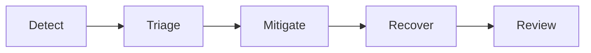

# 📖 Operations Runbook: Contoso Service Hub


<details open>
<summary><strong>📑 Runbook Contents</strong></summary>

- [⚡ Quick Reference](#-quick-reference)
- [📋 1. Daily Operations](#-1-daily-operations)
- [🚨 2. Incident Response](#-2-incident-response)
- [🔧 3. Common Procedures](#-3-common-procedures)
- [🕐 4. Maintenance Windows](#-4-maintenance-windows)
- [📞 5. Contacts & Escalation](#-5-contacts--escalation)
- [📝 6. Change Log](#-6-change-log)
- [References](#references)

</details>

> Generated by 08-As-Built agent | 2026-03-17

| ⬅️ Previous                                    | 📑 Index            | Next ➡️                                              |
| ---------------------------------------------- | ------------------- | ---------------------------------------------------- |
| [07-design-document.md](07-design-document.md) | [README](README.md) | [07-resource-inventory.md](07-resource-inventory.md) |

**Version**: 1.0
**Date**: 2026-03-17
**Environment**: Production baseline with staging and dev deltas
**Region**: swedencentral

---

## ⚡ Quick Reference

| Item                | Value                                                    |
| ------------------- | -------------------------------------------------------- |
| **Primary Region**  | swedencentral                                            |
| **Resource Group**  | `rg-contoso-service-hub-{env}`                           |
| **Support Contact** | Platform engineering on-call                             |
| **Escalation Path** | SRE → platform lead → service owner → security / product |

### Critical Resources

| Resource             | Name Pattern                                 | Resource Group Pattern         | Severity |
| -------------------- | -------------------------------------------- | ------------------------------ | -------- |
| Public edge          | `afd-{project}-{env}-{suffix}`               | `rg-contoso-service-hub-{env}` | 🔴 P1    |
| Internal API gateway | `apim-{project}-{env}-{suffix}`              | `rg-contoso-service-hub-{env}` | 🔴 P1    |
| Application runtime  | `aks-contoso-service-hub-run-3-{env}-{id}`   | `rg-contoso-service-hub-{env}` | 🔴 P1    |
| Primary database     | `psql-{project}-{env}-{suffix}`              | `rg-contoso-service-hub-{env}` | 🔴 P1    |
| Cache tier           | `redis-contoso-service-hub-run-3-{env}-{id}` | `rg-contoso-service-hub-{env}` | 🟠 P2    |
| Shared observability | `law-{project}-{env}-{suffix}`               | `rg-contoso-service-hub-{env}` | 🟠 P2    |

> [!NOTE]
> This runbook is prepared from a dry-run validation. Live endpoints, dashboard
> IDs, and alert rule IDs must be recorded during first deployment.

---

## 📋 1. Daily Operations

### 1.1 Health Checks

**Morning Health Check:**

1. Confirm Front Door, APIM, and AKS service health for the production baseline.
2. Review PostgreSQL, Redis, and storage diagnostic signals for latency,
   connectivity, or failed authentication events.
3. Check Azure Monitor alerts, Defender findings, and budget notifications.

**KQL Query - System Health Overview:**

```kusto
let lookback = 30m;
union isfuzzy=true
AppRequests,
AppExceptions,
AzureDiagnostics
| where TimeGenerated > ago(lookback)
| summarize Events = count() by Type = $table
| order by Events desc
```

### 1.2 Log Review

**Priority Logs to Review:**

| Log Source             | Query Focus                              | Action Threshold                |
| ---------------------- | ---------------------------------------- | ------------------------------- |
| Front Door / WAF       | Blocked requests, origin health failures | Sustained edge failures > 5 min |
| API Management         | Backend latency, 4xx/5xx, policy errors  | p95 latency > 500 ms            |
| AKS / Container logs   | Restarts, failed probes, image pull gaps | Any recurring restart loop      |
| PostgreSQL diagnostics | Connection saturation, failed auth       | CPU or connections above 80%    |
| Budget alerts          | Actual and forecast thresholds           | 80%, 100%, or forecast breaches |

---

## 🚨 2. Incident Response

### 2.1 Severity Definitions

| Severity | Definition                                                  | Response Time     |
| -------- | ----------------------------------------------------------- | ----------------- |
| 🔴 P1    | Customer-facing outage or unavailable booking / payment API | 15 minutes        |
| 🟠 P2    | Partial degradation, high latency, or single-tier failure   | 1 hour            |
| 🟢 P3    | Low-impact fault, warning, or non-production issue          | Same business day |

### 2.2 Runbooks by Alert

| Alert                                  | Runbook                                          | Owner                |
| -------------------------------------- | ------------------------------------------------ | -------------------- |
| Front Door origin unhealthy            | Check APIM private integration and health probes | SRE / platform       |
| APIM backend failure or 5xx spike      | Validate AKS service health and APIM policies    | Platform engineering |
| AKS node pressure or pod restarts      | Review HPA, node health, and container logs      | Platform engineering |
| PostgreSQL restore or availability gap | Execute PITR or service restore procedure        | DBA / platform       |
| Redis memory pressure                  | Reduce hot set or trigger capacity review        | Platform engineering |

Incident handling follows: detect, triage, contain, mitigate, communicate,
and close with post-incident review.



---

## 🔧 3. Common Procedures

### 3.1 Restart Services

<details>
<summary><strong>Restart Guidance</strong></summary>

```bash
# Restart APIM is not a normal first action. Validate backend health first.
# For AKS workloads, restart the affected deployment after confirming cause.
kubectl rollout restart deployment/<service-name> --namespace <namespace>
kubectl rollout status deployment/<service-name> --namespace <namespace>
```

</details>

### 3.2 Scale Resources

```bash
# Review current AKS node pools and cluster state.
az aks nodepool list \
  --resource-group rg-contoso-service-hub-prod \
  --cluster-name <aks-cluster-name>

# Update node count if capacity pressure is confirmed.
az aks nodepool scale \
  --resource-group rg-contoso-service-hub-prod \
  --cluster-name <aks-cluster-name> \
  --name userpool \
  --node-count 4
```

### 3.3 Database Recovery

```bash
az postgres flexible-server restore \
  --resource-group rg-contoso-service-hub-prod \
  --name <postgres-server-name> \
  --restore-time "2026-03-17T00:00:00Z" \
  --target-server-name <postgres-server-name>-restore
```

### 3.4 Cost and Capacity Review

- Review monthly actual versus forecast budget alerts.
- Check Redis utilization against the 70% upgrade trigger.
- Confirm non-production services remain right-sized after each release.

---

## 🕐 4. Maintenance Windows

| Task                        | Schedule               | Duration |
| --------------------------- | ---------------------- | -------- |
| Non-production changes      | Weekdays as required   | 2 hours  |
| Production platform changes | Sunday 02:00-06:00 CET | 4 hours  |
| Quarterly restore exercises | Quarterly              | 1 day    |
| AKS version review          | Monthly                | 2 hours  |

Maintenance should avoid major booking and billing peaks. Production changes
require change approval and rollback criteria before execution.

---

## 📞 5. Contacts & Escalation

| Role                 | Contact               | Phone | On-Call Rotation |
| -------------------- | --------------------- | ----- | ---------------- |
| Primary on-call      | Platform engineering  | N/A   | 24x7 for prod    |
| Secondary escalation | Platform lead         | N/A   | Week-based       |
| Service owner        | Contoso product owner | N/A   | Business hours   |
| Security escalation  | Security governance   | N/A   | On demand        |

### Escalation Path

Use the following progression unless the incident is clearly security-related:

1. Primary on-call triages and stabilizes.
2. Platform lead joins if the incident exceeds the initial response window.
3. Service owner is notified for customer-impacting incidents.
4. Security joins immediately for suspected breach, data exposure, or policy
   violation events.

---

## 📝 6. Change Log

| Date       | Change                                                        | Author            |
| ---------- | ------------------------------------------------------------- | ----------------- |
| 2026-03-17 | Initial Step 7 dry-run operations runbook from validated plan | 08-As-Built agent |

---

## References

| Topic                 | Link                                                                                             |
| --------------------- | ------------------------------------------------------------------------------------------------ |
| Azure Monitor Alerts  | [Alerting Best Practices](https://learn.microsoft.com/azure/azure-monitor/best-practices-alerts) |
| Log Analytics Queries | [KQL Reference](https://learn.microsoft.com/azure/azure-monitor/logs/get-started-queries)        |
| Azure Service Health  | [Overview](https://learn.microsoft.com/azure/service-health/overview)                            |
| AKS Day-2 Operations  | [Operations](https://learn.microsoft.com/azure/aks/operator-best-practices-cluster-isolation)    |

---

_Operations runbook generated from validated infrastructure artifacts._

---

<div align="center">

| ⬅️ [07-design-document.md](07-design-document.md) | 🏠 [Project Index](README.md) | ➡️ [07-resource-inventory.md](07-resource-inventory.md) |
| ------------------------------------------------- | ----------------------------- | ------------------------------------------------------- |

</div>
