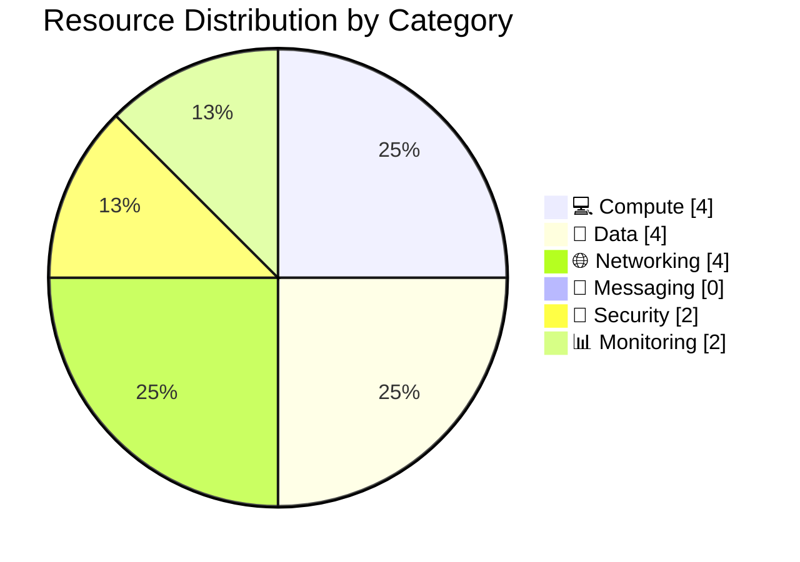

# 📦 Resource Inventory: Contoso Service Hub

<strong>📑 Inventory Contents</strong>

- [📊 Summary](#-summary)
- [📦 Resource Listing](#-resource-listing)
- [References](#references)

> Generated by 08-As-Built agent | 2026-03-17

| ⬅️ Previous                                          | 📑 Index            | Next ➡️                                      |
| ---------------------------------------------------- | ------------------- | -------------------------------------------- |
| [07-operations-runbook.md](07-operations-runbook.md) | [README](README.md) | [07-backup-dr-plan.md](07-backup-dr-plan.md) |

**Generated**: 2026-03-17
**Source**: Infrastructure as Code (Bicep) and dry-run deployment summary
**Environment**: Production baseline with staging and dev variants documented
**Region**: swedencentral

---

## 📊 Summary

| Category                       | Count |
| ------------------------------ | ----- |
| **Total Validated Components** | 16    |
| 💻 Compute                     | 4     |
| 💾 Data Services               | 4     |
| 🌐 Networking                  | 4     |
| 📨 Messaging                   | 0     |
| 🔐 Security                    | 2     |
| 📊 Monitoring                  | 2     |

> [!NOTE]
> Microsoft Entra External ID and Microsoft Defender for Cloud are validated
> external dependencies for this design, but they are not part of the 16
> resource-group resource types modeled in the Bicep deployment.

---

## 📦 Resource Listing

### 💻 Compute Resources

| Name Pattern                                   | Type                                         | SKU / Tier                                     | Location      | Purpose                  |
| ---------------------------------------------- | -------------------------------------------- | ---------------------------------------------- | ------------- | ------------------------ |
| `aks-contoso-service-hub-run-3-{env}-{suffix}` | `Microsoft.ContainerService/managedClusters` | Standard tier; prod uses 3 x `Standard_D8s_v5` | swedencentral | Microservice runtime     |
| `apim-{shortProject}-{env}-{suffix}`           | `Microsoft.ApiManagement/service`            | Standard in prod and staging; Developer in dev | swedencentral | Internal API gateway     |
| `acr{shortProject}{env}{suffix}`               | `Microsoft.ContainerRegistry/registries`     | Standard in prod / staging; Basic in dev       | swedencentral | Container image registry |
| `vm-contoso-service-hub-run-3-{env}-{suffix}`  | `Microsoft.Compute/virtualMachines`          | `D8s_v5` prod; `D4s_v5` staging; `B2s` dev     | swedencentral | Supporting workload host |

### 💾 Data Services

| Name Pattern                                     | Type                                        | SKU / Tier                                        | Configuration Summary                           | Location      |
| ------------------------------------------------ | ------------------------------------------- | ------------------------------------------------- | ----------------------------------------------- | ------------- |
| `psql-{shortProject}-{env}-{suffix}`             | `Microsoft.DBforPostgreSQL/flexibleServers` | GP 8 vCores prod; GP 4 vCores staging; B2s dev    | 35-day backups, delegated subnet, HA in prod    | swedencentral |
| `redis-contoso-service-hub-run-3-{env}-{suffix}` | `Microsoft.Cache/Redis`                     | Premium P4 prod; Premium P1 staging; Basic C0 dev | TLS 1.2, private endpoint in non-prod and prod  | swedencentral |
| `st{shortProject}{env}{suffix}`                  | `Microsoft.Storage/storageAccounts`         | Standard ZRS Hot prod; Standard LRS non-prod      | Blob + file services, HTTPS-only, no shared key | swedencentral |
| `disk-{project}-{env}-{suffix}`                  | `Microsoft.Compute/disks`                   | Premium SSD P15 prod; Standard SSD non-prod       | VM and supporting persistent storage            | swedencentral |

### 🌐 Networking Resources

| Name Pattern                           | Type                                      | Configuration Summary                                       | Location                       |
| -------------------------------------- | ----------------------------------------- | ----------------------------------------------------------- | ------------------------------ |
| `vnet-contoso-service-hub-run-3-{env}` | `Microsoft.Network/virtualNetworks`       | `/16` VNet per environment with workload subnets            | swedencentral                  |
| `nsg-{purpose}-{env}`                  | `Microsoft.Network/networkSecurityGroups` | NSG per subnet for AKS, APIM, PE, data, and VM segments     | swedencentral                  |
| `pe-{service}-{env}`                   | `Microsoft.Network/privateEndpoints`      | Private endpoints for PostgreSQL, Redis, Key Vault, Storage | swedencentral                  |
| `afd-{shortProject}-{env}-{suffix}`    | `Microsoft.Cdn/profiles`                  | Front Door Premium with WAF, endpoint, route, origin group  | Global edge / regional backend |

### 📨 Messaging Resources

| Name                            | Type | SKU | Configuration                                      | Location |
| ------------------------------- | ---- | --- | -------------------------------------------------- | -------- |
| None in current validated scope | N/A  | N/A | Messaging is handled inside application components | N/A      |

### 🔐 Security Resources

| Name Pattern                       | Type                                               | Configuration Summary                               | Location      |
| ---------------------------------- | -------------------------------------------------- | --------------------------------------------------- | ------------- |
| `kv-{shortProject}-{env}-{suffix}` | `Microsoft.KeyVault/vaults`                        | RBAC mode, soft delete, purge protection, PE        | swedencentral |
| `id-{shortProject}-{env}-{suffix}` | `Microsoft.ManagedIdentity/userAssignedIdentities` | Workload identity for integration and secret access | swedencentral |

### 📊 Monitoring Resources

| Name Pattern                         | Type                                       | Retention / Capacity                            | Location      |
| ------------------------------------ | ------------------------------------------ | ----------------------------------------------- | ------------- |
| `law-{shortProject}-{env}-{suffix}`  | `Microsoft.OperationalInsights/workspaces` | 5 GB/day prod baseline; reduced non-prod quotas | swedencentral |
| `appi-{shortProject}-{env}-{suffix}` | `Microsoft.Insights/components`            | Workspace-based Application Insights            | swedencentral |

---

## References

| Topic               | Link                                                                                                                       |
| ------------------- | -------------------------------------------------------------------------------------------------------------------------- |
| Bicep orchestrator  | [../../infra/bicep/contoso-service-hub-run-3/main.bicep](../../infra/bicep/contoso-service-hub-run-3/main.bicep)           |
| Parameter baseline  | [../../infra/bicep/contoso-service-hub-run-3/main.bicepparam](../../infra/bicep/contoso-service-hub-run-3/main.bicepparam) |
| Implementation plan | [04-implementation-plan.md](./04-implementation-plan.md)                                                                   |
| Deployment summary  | [06-deployment-summary.md](./06-deployment-summary.md)                                                                     |

---

_Resource inventory generated from validated Bicep templates._

---

| ⬅️ [07-operations-runbook.md](07-operations-runbook.md) | 🏠 [Project Index](README.md) | ➡️ [07-backup-dr-plan.md](07-backup-dr-plan.md) |
| ------------------------------------------------------- | ----------------------------- | ----------------------------------------------- |

