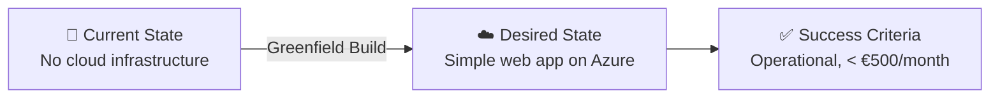

# 📋 Step 1: Requirements - e2e-ralph-loop

<strong>📑 Requirements Overview</strong>

- [🎯 Project Overview](#-project-overview)
- [🚀 Functional Requirements](#-functional-requirements)
- [⚡ Non-Functional Requirements (NFRs)](#-non-functional-requirements-nfrs)
- [🔒 Compliance & Security Requirements](#-compliance--security-requirements)
- [💰 Budget](#-budget)
- [🔧 Operational Requirements](#-operational-requirements)
- [🌍 Regional Preferences](#-regional-preferences)
- [📊 Complexity Classification](#-complexity-classification)
- [📋 Summary for Architecture Assessment](#-summary-for-architecture-assessment)
- [References](#references)

> Generated by @requirements agent | 2026-03-15 (pre-seeded for E2E RALPH loop)

| ⬅️ Previous | 📑 Index            | Next ➡️                                                        |
| ----------- | ------------------- | -------------------------------------------------------------- |
| —           | [README](README.md) | [02-architecture-assessment.md](02-architecture-assessment.md) |

## 🎯 Project Overview

| Field                   | Value                                                                                                              |
| ----------------------- | ------------------------------------------------------------------------------------------------------------------ |
| **Project Name**        | e2e-ralph-loop (Nordic Fresh Foods Lite)                                                                           |
| **Project Type**        | Simple Web Application                                                                                             |
| **Timeline**            | March 2026 (E2E evaluation run)                                                                                    |
| **Primary Stakeholder** | E2E Evaluation Loop                                                                                                |
| **Business Context**    | Simplified farm-to-table ordering platform — App Service + Azure SQL + Storage Account. Single environment (prod). |
| **IaC Tool**            | Bicep                                                                                                              |

### Business Context

| Field               | Value                                                                             |
| ------------------- | --------------------------------------------------------------------------------- |
| Industry / Vertical | Food & Agriculture                                                                |
| Company Size        | Startup / Small (1-50 employees)                                                  |
| Current State       | Greenfield — no existing cloud infrastructure                                     |
| Migration Source    | N/A (greenfield)                                                                  |
| Business Drivers    | Simple web ordering platform for local farm produce delivery                      |
| Success Criteria    | Platform operational, orders accepted, inventory visible, < €500/month Azure cost |

### State Transition

## 🚀 Functional Requirements

### Core Capabilities

| #   | Capability                 | Priority  | Acceptance Criteria                           |
| --- | -------------------------- | --------- | --------------------------------------------- |
| 1   | Web-based order management | 🔴 Must   | Orders accepted and stored via web portal     |
| 2   | Product catalog browsing   | 🔴 Must   | Users can browse available farm produce       |
| 3   | Basic inventory display    | 🔴 Must   | Current stock levels visible on product pages |
| 4   | Order status tracking      | 🟡 Should | Users can check order status                  |

### User Types

| User Type | Description                   | Est. Count | Access Level |
| --------- | ----------------------------- | ---------- | ------------ |
| Customer  | Browse products, place orders | 500        | Reader       |
| Admin     | Manage products, view orders  | 5          | Admin        |

### Integrations

| System              | Direction | Protocol | Auth Method | SLA   | EU Data Residency Required |
| ------------------- | --------- | -------- | ----------- | ----- | -------------------------- |
| Email Notifications | Outbound  | REST     | API Key     | 99.0% | Yes — PII (emails)         |

### Data Types

| Category        | Sensitivity | Est. Volume   | Retention  | Residency |
| --------------- | ----------- | ------------- | ---------- | --------- |
| Customer PII    | 🔴 High     | 500 records   | 3 years    | EU only   |
| Order data      | 🟡 Medium   | 50 orders/day | 2 years    | EU only   |
| Product catalog | 🟢 Low      | 200 products  | Indefinite | EU only   |

### Architecture Pattern

| Field              | Value                                                                         |
| ------------------ | ----------------------------------------------------------------------------- |
| Workload Pattern   | Simple Web Application                                                        |
| Recommended Option | App Service + Azure SQL + Storage Account                                     |
| Tier               | Cost-Optimized                                                                |
| Justification      | Startup budget (<€500/month), <50 concurrent users, greenfield, prod env only |

## ⚡ Non-Functional Requirements (NFRs)

| WAF Pillar     | Metric             | Target               | Current | Gap                 |
| -------------- | ------------------ | -------------------- | ------- | ------------------- |
| 🔄 Reliability | SLA                | 99.9%                | N/A     | Full build required |
| 🔄 Reliability | RTO                | 24 hours             | N/A     | Relaxed for MVP     |
| 🔄 Reliability | RPO                | 24 hours             | N/A     | Relaxed for MVP     |
| ⚡ Performance | Page Load          | <3000 ms             | N/A     | Full build required |
| ⚡ Performance | API Response (p95) | <500 ms              | N/A     | Full build required |
| ⚡ Performance | Concurrent Users   | <50 (peak)           | N/A     | Full build required |
| 🔒 Security    | Auth Method        | Entra External ID    | —       | —                   |
| 🔒 Security    | Encryption         | At-rest + In-transit | —       | —                   |
| 💰 Cost        | Monthly Budget     | <€500                | —       | —                   |
| 🔧 Operations  | Uptime Monitoring  | Yes                  | —       | —                   |

### Scalability

| Dimension        | Current    | 6-Month Projection | 12-Month Projection |
| ---------------- | ---------- | ------------------ | ------------------- |
| Users            | ~500       | ~2,000             | ~5,000              |
| Data Volume      | ~1 GB      | ~5 GB              | ~10 GB              |
| Transactions/day | ~50 orders | ~200 orders        | ~500 orders         |

## 🔒 Compliance & Security Requirements

### Regulatory Frameworks

<strong>PCI-DSS</strong> — Not Applicable

| Requirement             | Applicability | Notes                          |
| ----------------------- | ------------- | ------------------------------ |
| Cardholder data storage | No            | No payment processing in scope |

<strong>SOC 2</strong> — Not Applicable

| Trust Principle | Applicability | Notes                |
| --------------- | ------------- | -------------------- |
| Security        | No            | Not required for MVP |

<strong>HIPAA</strong> — Not Applicable

| Requirement  | Applicability | Notes                    |
| ------------ | ------------- | ------------------------ |
| PHI handling | No            | No health data processed |

<strong>GDPR</strong> — Applicable

| Requirement      | Applicability | Notes                                                      |
| ---------------- | ------------- | ---------------------------------------------------------- |
| EU data subjects | Yes           | All customers are EU residents (Scandinavia)               |
| Data residency   | Yes           | All data must reside in EU regions (swedencentral primary) |
| Right to erasure | Yes           | Must support GDPR Article 17 — customer data deletion      |

**GDPR Article 17 — Erasure Requirements:**

| Scope              | Requirement                                                                  |
| ------------------ | ---------------------------------------------------------------------------- |
| Stores in scope    | Azure SQL (customer PII, order data), Storage Account (uploaded files)       |
| Data classes       | Customer name, email, address, order history                                 |
| Response window    | 30 days from verified request                                                |
| Deletion method    | Hard delete from SQL; blob deletion from Storage                             |
| Telemetry handling | Application Insights PII fields anonymized; Log Analytics retains aggregates |
| Backup exception   | SQL PITR backups (30 days) may retain data until natural expiry              |

<strong>ISO 27001</strong> — Not Applicable

| Control Area   | Applicability | Notes                |
| -------------- | ------------- | -------------------- |
| Access control | No            | Not required for MVP |

### Data Residency

| Requirement              | Value                                      |
| ------------------------ | ------------------------------------------ |
| Primary Region           | swedencentral                              |
| Data Sovereignty         | EU-only (GDPR compliance)                  |
| Cross-region Replication | Not required (relaxed recovery objectives) |

### Environment Isolation

| Boundary        | Production                     |
| --------------- | ------------------------------ |
| Identity tenant | Single Entra config            |
| Secrets (KV)    | Dedicated Key Vault            |
| Data stores     | Single SQL + Storage           |
| Diagnostics     | Single Log Analytics workspace |
| Budget alert    | Single budget scope            |
| Network         | Basic — no private endpoints   |

### Authentication & Authorization

| Requirement       | Value                                  |
| ----------------- | -------------------------------------- |
| Identity Provider | Microsoft Entra External ID            |
| MFA Requirement   | Conditional (required for admin users) |
| RBAC Model        | Application-level (role per user type) |

### Network Security

| Control                     | Required | Notes                                                                               |
| --------------------------- | -------- | ----------------------------------------------------------------------------------- |
| Private endpoints           | ❌       | Not required — simple complexity                                                    |
| VNet integration            | ❌       | Not required — simple complexity                                                    |
| Public endpoints acceptable | ✅       | Web frontend and API via App Service                                                |
| WAF required                | ❌       | Not required for MVP                                                                |
| SQL firewall rules          | ✅       | Azure SQL must restrict access to App Service IPs + Azure services                  |
| Storage access model        | ✅       | Public endpoint allowed; Entra RBAC auth (no shared keys); no anonymous blob access |
| SQL public network access   | ✅       | Enabled with firewall restrictions (governance may override)                        |
| Storage public access       | ❌       | No anonymous blob access (`allowBlobPublicAccess: false`)                           |

### Recommended Security Controls

| Control               | Recommended | User Confirmed | Notes                                   |
| --------------------- | ----------- | -------------- | --------------------------------------- |
| Managed Identity      | Yes         | Yes            | Prefer over keys for service-to-service |
| Private Endpoints     | No          | No             | Not needed for simple complexity        |
| WAF                   | No          | No             | Not required for MVP                    |
| Key Vault for Secrets | Yes         | Yes            | Centralized secrets management          |
| Diagnostic Settings   | Yes         | Yes            | Application Insights + Log Analytics    |
| TLS 1.2 Minimum       | Yes         | Yes            | Security baseline                       |
| Encryption at Rest    | Yes         | Yes            | Platform-managed encryption             |

## 💰 Budget

| Field              | Value                                                 |
| ------------------ | ----------------------------------------------------- |
| 💰 Monthly Budget  | <€500/month (Azure platform only)                     |
| 📅 Annual Budget   | ~€6,000 (Azure platform only)                         |
| 🚦 Limit Type      | 🔴 Hard = evaluation constraints                      |
| 📊 Cost Model Pref | Cost-optimized managed services within budget ceiling |

### Budget Envelopes

| Category              | Monthly Envelope | Notes                        |
| --------------------- | ---------------- | ---------------------------- |
| Compute (App Service) | ~€100-200        | Web + API                    |
| Database (Azure SQL)  | ~€50-100         | Orders, products             |
| Observability         | ~€30-50          | Log Analytics + App Insights |
| Storage + Key Vault   | ~€10-30          | Blobs, secrets               |
| **Total Azure**       | **<€500**        | Hard cap                     |

### Cost Optimization Priorities

| Priority                         | Selected | Impact |
| -------------------------------- | -------- | ------ |
| Minimize compute costs           | ☑        | High   |
| Prefer consumption-based pricing | ☑        | High   |
| Reserved instances acceptable    | ☐        | Low    |
| Spot instances for non-critical  | ☐        | Low    |

## 🔧 Operational Requirements

### Monitoring & Alerting

| Capability             | Required | Tool / Service       | Notes                     |
| ---------------------- | -------- | -------------------- | ------------------------- |
| Application monitoring | ✅       | Application Insights | Request tracking, errors  |
| Log aggregation        | ✅       | Log Analytics        | Centralized log workspace |
| Alert notifications    | ✅       | Email                | Admin team                |
| Custom dashboards      | ❌       | —                    | Not required for MVP      |

### Support & Maintenance

| Requirement         | Value                 |
| ------------------- | --------------------- |
| Support Hours       | Business hours (CET)  |
| On-call Requirement | No                    |
| Maintenance Windows | Weekends, 02:00-06:00 |
| Change Management   | GitHub PRs            |

### Backup & Disaster Recovery

| Component          | Backup Frequency | Retention | Recovery Method               |
| ------------------ | ---------------- | --------- | ----------------------------- |
| Azure SQL Database | Daily            | 30 days   | Automated (PITR)              |
| Storage Account    | Blob soft delete | 7 days    | Soft delete + blob versioning |
| App Configuration  | IaC re-deploy    | N/A       | Bicep redeploy                |

> **Note**: Storage Account uses LRS for redundancy, not backup. Blob soft delete (7-day retention) and blob versioning provide recoverability for stored objects. These are separate from the redundancy tier.

## 🌍 Regional Preferences

| Preference         | Value         | Justification                              |
| ------------------ | ------------- | ------------------------------------------ |
| Primary Region     | swedencentral | EU GDPR-compliant, closest to Stockholm    |
| Failover Region    | N/A           | Not required — relaxed recovery objectives |
| Availability Zones | Not needed    | Cost optimization — single zone sufficient |

---

## 📊 Complexity Classification

| Field      | Value                                                                                                                       |
| ---------- | --------------------------------------------------------------------------------------------------------------------------- |
| Complexity | `simple`                                                                                                                    |
| Criteria   | ≤3 core resource types (App Service, SQL, Storage), single environment (prod), GDPR compliance only                         |
| Rationale  | Minimal resource footprint, no private networking, single environment, single compliance framework — meets simple threshold |

---

## 📋 Summary for Architecture Assessment

### Handoff Summary

| Aspect               | Key Points                                                                                                                                    |
| -------------------- | --------------------------------------------------------------------------------------------------------------------------------------------- |
| Critical Constraints | Budget <€500/month; GDPR data residency; single prod environment                                                                              |
| Key Decisions        | Bicep IaC; Cost-Optimized tier; Simple web app pattern; no private endpoints; prod env only                                                   |
| Open Risks           | GDPR backup retention overlap (SQL PITR may retain PII up to 30 days post-deletion); governance policies may require stricter network posture |
| Recommended Pattern  | App Service + Azure SQL + Storage Account (SKUs per Step 2)                                                                                   |
| Budget Envelope      | <€500/month (Azure platform)                                                                                                                  |

### Requirements Completeness

| Section                  | Status | Notes                                                  |
| ------------------------ | ------ | ------------------------------------------------------ |
| Project Overview         | ✅     | All fields populated                                   |
| Functional Requirements  | ✅     | 4 capabilities with priorities and acceptance criteria |
| NFRs                     | ✅     | WAF metrics, scalability projections defined           |
| Compliance & Security    | ✅     | GDPR scoped; security controls confirmed               |
| Budget                   | ✅     | Hard limit <€500/month; consumption model preferred    |
| Operational Requirements | ✅     | Monitoring, alerting, backup defined for MVP scope     |

---

## References

| Topic                      | Link                                                                                                |
| -------------------------- | --------------------------------------------------------------------------------------------------- |
| Well-Architected Framework | [Overview](https://learn.microsoft.com/azure/well-architected/)                                     |
| Azure Regions              | [Products by Region](https://azure.microsoft.com/explore/global-infrastructure/products-by-region/) |
| Compliance Offerings       | [Azure Compliance](https://learn.microsoft.com/azure/compliance/)                                   |

---

_Requirements pre-seeded for E2E RALPH loop evaluation using Nordic Fresh Foods template structure_

---

| ⬅️ — | 🏠 [Project Index](README.md) | ➡️ [02-architecture-assessment.md](02-architecture-assessment.md) |
| ---- | ----------------------------- | ----------------------------------------------------------------- |

